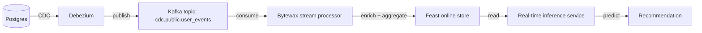

# 🎯 03 - Change Data Capture for ML — Debezium, Kafka Connect, and Streaming ETL

> **Stream database changes into your feature pipeline. CDC for ML: turn PostgreSQL into a continuous source of features. The pattern that makes real-time ML work.**

## 🎯 Learning Objectives
- Implement Change Data Capture (CDC) from PostgreSQL using Debezium
- Set up Kafka Connect for streaming ETL from CDC sources
- Materialize CDC streams into feature stores (Feast, Redis)
- Handle schema evolution in CDC pipelines
- Build exactly-once CDC → feature pipeline with checkpoints
- Use CDC for ML feature freshness (vs nightly batch loads)
- Apply CDC patterns to portfolio projects (user profiles, listing data, agent state)

## Introduction

Most ML features live in **transactional databases**: user profiles in Postgres, account balances in MySQL, listing data in MongoDB. The challenge: how do you keep ML features in sync with these databases **in real time**?

Three approaches:

1. **Nightly batch load** — pull all data from Postgres at midnight, recompute features. Simple, but features are up to 24 hours stale.
2. **Application-level writes** — every time the application updates the database, it also writes to the feature store. Fast, but error-prone (dual writes).
3. **Change Data Capture (CDC)** — stream every change in the database to a Kafka topic. The feature pipeline consumes from Kafka. Always fresh.

CDC is the production standard for real-time ML. **Debezium** is the dominant CDC tool for PostgreSQL (and other databases). **Kafka Connect** is the framework for running Debezium (and other CDC connectors) in production.

This note covers:
- CDC patterns and their tradeoffs
- Debezium for PostgreSQL
- Kafka Connect configuration
- Schema evolution handling
- CDC → Feast integration
- Real-world case studies


---

## 1. CDC Patterns

### 1.1 The four CDC patterns

| Pattern | How it works | Pros | Cons |
|---------|--------------|------|------|
| **Log-based** | Read database transaction log | Low overhead, complete | Database-specific |
| **Trigger-based** | Database triggers write to change table | Portable | Triggers add overhead |
| **Timestamp-based** | `WHERE updated_at > last_seen` | Simple | Misses deletes; needs polling |
| **Query-based (snapshot + diff)** | Full snapshot + delta | Simple | Slow for large tables |

**Log-based is the production standard** for PostgreSQL (using the `pgoutput` logical decoding plugin), MySQL (using binlog), and MongoDB (using the oplog).

### 1.2 Log-based CDC for PostgreSQL

PostgreSQL's logical decoding produces a stream of change events:

```sql
-- Setup (one-time)
ALTER SYSTEM SET wal_level = 'logical';
ALTER SYSTEM SET max_replication_slots = 4;

-- Create a publication for the tables we want to capture
CREATE PUBLICATION ml_features FOR TABLE users, accounts, transactions;
```

Each insert, update, or delete on the `users`, `accounts`, or `transactions` table produces an event in the publication stream.

Debezium (a Kafka Connect connector) reads from this publication and writes to Kafka.

---

## 2. Debezium for PostgreSQL

```bash
# Start Debezium via Docker
docker run -d --name debezium \
    -p 8083:8083 \
    -e GROUP_ID=1 \
    -e CONFIG_STORAGE_TOPIC=ml_debezium_configs \
    -e OFFSET_STORAGE_TOPIC=ml_debezium_offsets \
    -e STATUS_STORAGE_TOPIC=ml_debezium_status \
    -e BOOTSTRAP_SERVERS=kafka:9092 \
    debezium/connect:2.5
```

### 2.1 Configure the PostgreSQL connector

```http
POST http://debezium:8083/connectors
Content-Type: application/json

{
    "name": "ml-postgres-cdc",
    "config": {
        "connector.class": "io.debezium.connector.postgresql.PostgresConnector",
        "database.hostname": "postgres",
        "database.port": "5432",
        "database.user": "debezium",
        "database.password": "secret",
        "database.dbname": "myapp",
        "database.server.name": "ml-app",
        "plugin.name": "pgoutput",
        "publication.name": "ml_features",
        "slot.name": "ml_features_slot",
        "table.include.list": "public.users,public.accounts,public.transactions",
        "topic.prefix": "cdc",
        "snapshot.mode": "initial",
        "decimal.handling.mode": "double"
    }
}
```

Debezium reads the publication, creates Kafka topics, and starts streaming changes:

- `cdc.public.users` — every change to the `users` table
- `cdc.public.accounts` — every change to the `accounts` table
- `cdc.public.transactions` — every change to the `transactions` table

### 2.2 The change event format

```json
{
    "before": null,
    "after": {
        "id": 12345,
        "email": "alice@example.com",
        "age": 28,
        "income": 50000,
        "country": "DE",
        "created_at": "2026-01-15T10:30:00Z"
    },
    "source": {
        "version": "2.5.0.Final",
        "connector": "postgresql",
        "name": "ml-app",
        "ts_ms": 1706019600000,
        "snapshot": "false",
        "db": "myapp",
        "schema": "public",
        "table": "users"
    },
    "op": "c",
    "ts_ms": 1706019600000,
    "transaction": null
}
```

`op` is one of:
- `c` — create (insert)
- `u` — update
- `d` — delete
- `r` — read (snapshot)

### 2.3 Consuming CDC events in Python

```python
import json
from confluent_kafka import Consumer


consumer = Consumer({
    "bootstrap.servers": "localhost:9092",
    "group.id": "ml-cdc-consumer",
    "auto.offset.reset": "earliest",
})
consumer.subscribe(["cdc.public.users"])


def process_change(message):
    """Process a CDC change event."""
    event = json.loads(message.value())
    
    op = event["op"]
    if op == "c" or op == "u":
        # Insert or update: take the "after" state
        record = event["after"]
        update_feature_store(record)
    elif op == "d":
        # Delete: remove from feature store
        record = event["before"]
        delete_from_feature_store(record["id"])


def run_cdc_consumer():
    while True:
        msg = consumer.poll(1.0)
        if msg is None or msg.error():
            continue
        try:
            process_change(msg)
        except Exception as e:
            print(f"Error processing message: {e}")


if __name__ == "__main__":
    run_cdc_consumer()
```

For async Python:

```python
import asyncio
import json
from aiokafka import AIOKafkaConsumer


async def consume_cdc():
    consumer = AIOKafkaConsumer(
        "cdc.public.users",
        bootstrap_servers="localhost:9092",
        group_id="ml-cdc-consumer",
        auto_offset_reset="earliest",
    )
    await consumer.start()
    
    try:
        async for msg in consumer:
            event = json.loads(msg.value)
            await process_change(event)
    finally:
        await consumer.stop()


async def process_change(event):
    op = event["op"]
    if op in ("c", "u"):
        await update_feature_store(event["after"])
    elif op == "d":
        await delete_from_feature_store(event["before"]["id"])


asyncio.run(consume_cdc())
```

---

## 3. Kafka Connect for Streaming ETL

Kafka Connect is the framework for running Debezium (source connectors) and database/file sinks (sink connectors) in production. The 2026 state:

| Connector type | Examples |
|----------------|----------|
| **Source** | Debezium PostgreSQL, Debezium MySQL, MongoDB Kafka, S3 Source |
| **Sink** | S3 Sink, BigQuery Sink, Snowflake Sink, JDBC Sink, Elasticsearch Sink |

For real-time ML, common pipelines:

| Source | Sink | Use case |
|--------|------|----------|
| PostgreSQL (Debezium) | Kafka | CDC stream for feature pipeline |
| Kafka | Feast | Online feature store updates |
| Kafka | S3 | Cold storage for retraining |
| Kafka | ClickHouse | Analytics dashboard |

### 3.1 S3 Sink for retraining data

```http
POST http://kafka-connect:8083/connectors
Content-Type: application/json

{
    "name": "ml-features-s3-sink",
    "config": {
        "connector.class": "io.confluent.connect.s3.S3SinkConnector",
        "tasks.max": "4",
        "topics": "cdc.public.transactions",
        "s3.bucket.name": "ml-features-archive",
        "s3.region": "us-east-1",
        "format.class": "io.confluent.connect.s3.format.parquet.ParquetFormat",
        "flush.size": "10000",
        "rotate.interval.ms": "3600000",
        "partition.duration.ms": "86400000",
        "path.format": "'year'=YYYY/'month'=MM/'day'=dd",
        "timestamp.extractor": "Wallclock"
    }
}
```

Every change to the `transactions` table is archived to S3 in Parquet format, partitioned by date. This serves as the cold storage for nightly retraining.

---

## 4. Schema Evolution Handling

Database schemas change. CDC pipelines must handle schema changes without breaking downstream consumers.

### 4.1 Debezium schema evolution

Debezium handles most schema changes automatically:

| Schema change | Debezium behavior |
|--------------|-------------------|
| Add column | Captured automatically; new field in event |
| Drop column | Captured as `null` in event |
| Rename column | Captured as drop + add |
| Change type | Captured as new schema; consumers must update |

For breaking changes (type change, drop column), set `tombstones.on.delete=true` to emit null events:

```json
{
    "before": {"id": 12345, "email": "alice@example.com", "deleted_field": "..."},
    "after": null,
    "op": "d"
}
```

### 4.2 Schema Registry

For long-term schema evolution, use **Confluent Schema Registry** (or Karapace as open-source alternative):

```python
from confluent_kafka.schema_registry import SchemaRegistryClient
from confluent_kafka.schema_registry.avro import AvroSerializer


schema_registry = SchemaRegistryClient({"url": "http://schema-registry:8081"})

avro_serializer = AvroSerializer(
    schema_registry,
    schema_str=USER_SCHEMA,  # Avro schema definition
)

producer = Producer({
    "bootstrap.servers": "localhost:9092",
    "value.serializer": avro_serializer,
})
```

Schema Registry enforces schema compatibility. New schemas must be backward-compatible (new field with default, no breaking changes). This prevents downstream consumers from breaking.

---

## 5. CDC → Feast Integration

The most common CDC pattern for ML: stream changes from Postgres into Feast's online store.

```python
from feast import FeatureStore
import json


fs = FeatureStore(repo_path="feature_repo/")


def update_user_features(change_event):
    """Update Feast online store from CDC event."""
    op = change_event["op"]
    
    if op == "c" or op == "u":
        # Insert or update
        record = change_event["after"]
        fs.write_to_online_store(
            feature_view_name="user_profile",
            df=pd.DataFrame([{
                "user_id": record["id"],
                "age": record["age"],
                "income": record["income"],
                "country": record["country"],
                "event_timestamp": pd.Timestamp.now(),
            }]),
        )
    
    elif op == "d":
        # Delete
        record = change_event["before"]
        fs.delete_from_online_store(
            feature_view_name="user_profile",
            entity_keys=[{"user_id": record["id"]}],
        )


# Consume CDC events and update Feast
for change_event in consume_cdc_events("cdc.public.users"):
    update_user_features(change_event)
```

The result: every change to the `users` table is reflected in Feast within <100ms. The inference service reads fresh features from Feast.

---

## 6. Real-World Example — Real-time Recommendation



The architecture:
1. **PostgreSQL** stores user events, clicks, purchases
2. **Debezium** streams every change to Kafka
3. **Bytewax** consumes CDC, enriches with streaming features (Note 01), pushes to Feast
4. **Feast** provides online features at <5ms
5. **Inference service** combines online + batch features, serves in <50ms

For the **StayBot** (your portfolio project): CDC could stream new Airbnb listings to the vector DB and the recommendation model. The result: users see new listings within seconds, not the next day.

---

## 7. CDC Failure Modes and Recovery

| Failure | Detection | Recovery |
|---------|-----------|----------|
| **Debezium connector down** | Kafka Connect health check | Restart connector; resumes from last offset |
| **PostgreSQL WAL overflow** | Postgres logs | Increase `max_wal_size`; check replica lag |
| **Schema change breaks pipeline** | Schema Registry compatibility check | Add new column; deploy consumer updates |
| **Kafka topic deletion** | Topic existence check | Restore from S3 backup |
| **Slow consumer** | Consumer lag metric | Scale Bytewax workers |

For disaster recovery:
1. **Snapshot mode**: Debezium takes a full snapshot of the database on startup, then streams changes
2. **S3 archive**: Every change is archived to S3 (parquet) for offline recovery
3. **Checkpointing**: Bytewax checkpoints to disk; on restart, resumes from checkpoint

---

## 8. Antipatterns

### 8.1 Antipattern 1: Polling instead of CDC

```python
# ❌ Poll database every minute for new users
while True:
    new_users = db.query("SELECT * FROM users WHERE created_at > $1", last_check)
    for user in new_users:
        update_features(user)
    time.sleep(60)

# ✅ Use CDC: stream every change
def process_cdc(change):
    update_features(change["after"])
```

Polling has 60-second latency and adds load to the DB. CDC has <5s latency with no DB load.

### 8.2 Antipattern 2: Trigger-based CDC

```sql
-- ❌ Triggers add overhead to every write
CREATE TRIGGER update_features
AFTER INSERT ON users
FOR EACH ROW
BEGIN
    INSERT INTO feature_updates VALUES (NEW.id, NEW.email, NEW.age, ...);
END;
```

Triggers add 20-50% overhead to every write. Log-based CDC has near-zero overhead.

### 8.3 Antipattern 3: No schema evolution handling

```python
# ❌ Hard-coded schema; breaks on DB changes
def process_cdc(event):
    user_id = event["after"]["id"]  # KeyError if column renamed
    email = event["after"]["email"]

# ✅ Use schema registry or versioned processing
def process_cdc(event):
    schema_version = event["source"]["ts_ms"]
    record = event["after"]
    if "id" in record:
        process_v2(record)
    else:
        process_v1(record)
```

### 8.4 Antipattern 4: Synchronous Feast writes from CDC consumer

```python
# ❌ Synchronous Feast writes — slow, blocks CDC processing
def process_cdc(change):
    update_features(change["after"])  # synchronous DB call

# ✅ Batch writes to Feast
class CDCBatcher:
    def __init__(self, batch_size=100, flush_interval_ms=500):
        self.batch = []
        self.last_flush = time.time()
    
    def add(self, change):
        self.batch.append(change)
        if len(self.batch) >= self.batch_size or time.time() - self.last_flush > self.flush_interval_ms / 1000:
            self.flush()
    
    def flush(self):
        if self.batch:
            feast_write_batch(self.batch)
            self.batch = []
            self.last_flush = time.time()
```

### 8.5 Antipattern 5: No snapshot strategy

```python
# ❌ Stream-only CDC; on first run, table is empty
def start_cdc():
    consume_cdc_events()  # only captures future changes

# ✅ Snapshot mode: initial full sync, then stream
"config": {
    "snapshot.mode": "initial"  # or "always" for full re-sync
}
```

First-run systems need a snapshot. Otherwise, the feature store starts empty.

---

## 🎯 Key Takeaways

- CDC is the production standard for keeping ML features fresh in real time.
- **Log-based CDC** (Debezium + PostgreSQL `pgoutput`) is the production default.
- **Kafka Connect** runs Debezium in production with fault tolerance and monitoring.
- **Schema Registry** enforces schema compatibility, preventing downstream breakage.
- CDC → Feast integrates PostgreSQL with online feature stores in <100ms.
- **Snapshot mode** is required for first-run; stream-only would leave an empty store.
- Failure modes: Debezium down, WAL overflow, schema breaks, slow consumers.
- Avoid polling instead of CDC, trigger-based CDC, no schema handling, sync Feast writes, no snapshot.

## References

- Debezium — [debezium.io](https://debezium.io/)
- Kafka Connect — [kafka.apache.org/documentation/#connect](https://kafka.apache.org/documentation/#connect)
- Confluent Schema Registry — [docs.confluent.io/platform/current/schema-registry/index.html](https://docs.confluent.io/platform/current/schema-registry/index.html)
- Karapace (open-source Schema Registry) — [github.com/Aiven-Open/karapace](https://github.com/Aiven-Open/karapace)
- PostgreSQL Logical Replication — [postgresql.org/docs/current/logical-replication.html](https://www.postgresql.org/docs/current/logical-replication.html)
- Feast — [feast.dev](https://feast.dev/)
- [[09 - MLOps y Produccion/27 - Feast and Feature Stores|Feast course]]
- [[09 - MLOps y Produccion/40 - Real-time ML Systems/01 - Streaming Feature Engineering|Note 01 — Streaming Features]]
- [[09 - MLOps y Produccion/40 - Real-time ML Systems/02 - Online Inference and Event-Driven ML|Note 02 — Online Inference]]
- [[09 - MLOps y Produccion/40 - Real-time ML Systems/05 - Capstone - Production Real-time ML Pipeline|Note 05 — Capstone]]
- [[10 - Cloud, Infra y Backend/29 - Distributed ML Infrastructure/01 - Apache Kafka|Kafka note 01]]