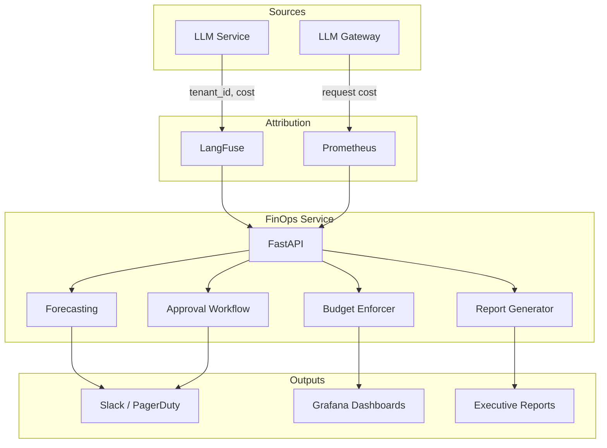
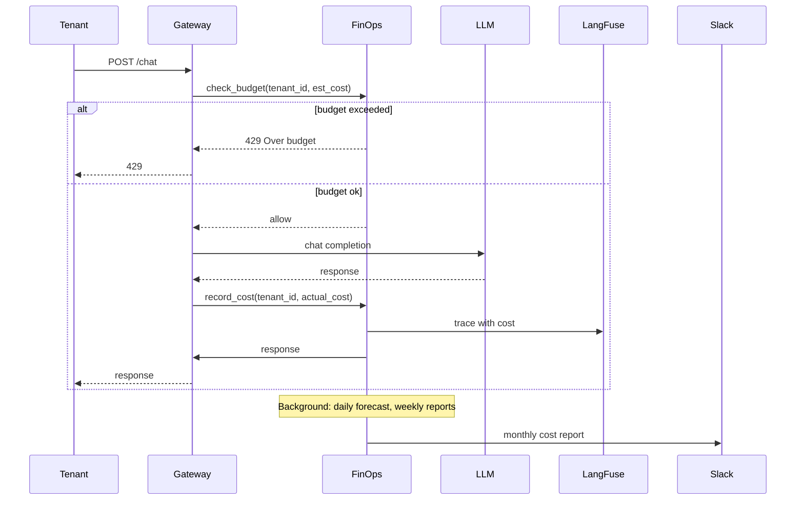

# 🎯 05 - Capstone — FinOps Pipeline for a Multi-Tenant LLM Service

> **The fourteenth portfolio project. A complete FinOps service for a multi-tenant LLM platform: cost attribution + forecasting + budget enforcement + approval workflows + executive dashboards. Boot the whole thing with one docker-compose.**

## 🎯 Learning Objectives
- Build a complete FinOps service for a multi-tenant LLM platform
- Implement per-tenant cost attribution via LangFuse metadata
- Set up cost forecasting with Prophet
- Enforce per-tenant budgets at the gateway
- Build approval workflows for high-cost operations
- Provide executive dashboards with optimization recommendations
- Deploy with Docker Compose for one-command setup

## Introduction

The capstone is the **synthesis** of all four notes. You will build a complete FinOps service that:

1. **Attributes cost** per tenant, per feature, per model via LangFuse metadata
2. **Forecasts** next month's cost with Prophet
3. **Enforces budgets** at the gateway; blocks over-budget tenants
4. **Alerts** on cost anomalies and projected overruns
5. **Approves** high-cost operations via Slack
6. **Reports** to the CFO with optimization recommendations

The architecture demonstrates all four pillars of FinOps. The capstone is the **fourteenth portfolio project**: the cost engineering skill.



---

## 1. Project Layout

```
finops-service/
├── app/
│   ├── api.py                # FastAPI service
│   ├── attribution.py        # Per-tenant cost attribution
│   ├── forecasting.py        # Prophet-based cost forecasting
│   ├── budget.py             # Budget enforcement
│   ├── approval.py           # Approval workflow
│   ├── reports.py            # Executive reports
│   ├── recommendations.py     # Cost optimization recommendations
│   └── observability.py      # LangFuse integration
├── dashboard/
│   └── grafana_dashboard.json
├── tests/
│   ├── test_attribution.py
│   ├── test_forecasting.py
│   └── test_budget.py
├── docker-compose.yml        # Full stack
└── README.md
```

---

## 2. The Attribution Service (`app/attribution.py`)

```python
from langfuse import Langfuse
from prometheus_client import Counter
from dataclasses import dataclass
from datetime import datetime


# Prometheus metrics
tenant_cost_total = Counter(
    "llm_cost_usd_per_tenant_total",
    "Total LLM cost per tenant",
    ["tenant_id", "feature", "model"],
)
tenant_tokens_total = Counter(
    "llm_tokens_per_tenant_total",
    "Total tokens per tenant",
    ["tenant_id", "feature", "model", "token_type"],
)


@dataclass
class LLMUsage:
    tenant_id: str
    feature: str
    model: str
    input_tokens: int
    output_tokens: int
    cost_usd: float
    timestamp: datetime
    user_id: str
    session_id: str


class CostAttribution:
    """Attribute every LLM call to a tenant + feature + model."""
    
    def __init__(self):
        self.langfuse = Langfuse()
    
    def record(self, usage: LLMUsage):
        """Record an LLM usage event."""
        
        # Update Prometheus counters
        tenant_cost_total.labels(
            tenant_id=usage.tenant_id,
            feature=usage.feature,
            model=usage.model,
        ).inc(usage.cost_usd)
        
        tenant_tokens_total.labels(
            tenant_id=usage.tenant_id,
            feature=usage.feature,
            model=usage.model,
            token_type="input",
        ).inc(usage.input_tokens)
        
        tenant_tokens_total.labels(
            tenant_id=usage.tenant_id,
            feature=usage.feature,
            model=usage.model,
            token_type="output",
        ).inc(usage.output_tokens)
        
        # Send to LangFuse for trace-level tracking
        with self.langfuse.observe() as trace:
            trace.score(
                name="cost_usd",
                value=usage.cost_usd,
                metadata={
                    "tenant_id": usage.tenant_id,
                    "feature": usage.feature,
                    "model": usage.model,
                    "input_tokens": usage.input_tokens,
                    "output_tokens": usage.output_tokens,
                },
            )
```

---

## 3. The Forecasting Service (`app/forecasting.py`)

```python
import pandas as pd
from prophet import Prophet
from prometheus_api_client import PrometheusConnect
from datetime import datetime, timedelta


class CostForecaster:
    """Forecast LLM costs with confidence intervals."""
    
    def __init__(self):
        self.prom = PrometheusConnect(url="http://prometheus:9090")
    
    def forecast(self, days_ahead: int = 30, tenant_id: str = None) -> dict:
        """Forecast total cost (or per-tenant) for the next N days."""
        
        # Pull historical data
        if tenant_id:
            query = f'sum by (day) (rate(llm_cost_usd_per_tenant_total{{tenant_id="{tenant_id}"}}[1d]))'
        else:
            query = "sum by (day) (rate(llm_cost_usd_total[1d]))"
        
        data = self.prom.get_metric_range_data(
            query,
            start_time=(datetime.utcnow() - timedelta(days=180)).isoformat(),
        )
        
        if not data:
            return None
        
        # Convert to Prophet format
        df = pd.DataFrame(data, columns=["ds", "y"])
        df["ds"] = pd.to_datetime(df["ds"])
        df["y"] = df["y"].astype(float)
        
        # Fit model
        model = Prophet(
            weekly_seasonality=True,
            daily_seasonality=False,
            yearly_seasonality=False,
            seasonality_mode="multiplicative",
            interval_width=0.95,  # 95% confidence interval
        )
        model.fit(df)
        
        # Forecast
        future = model.make_future_dataframe(periods=days_ahead)
        forecast = model.predict(future)
        
        # Return relevant data
        next_period = forecast.tail(days_ahead)
        return {
            "expected": float(next_period["yhat"].sum()),
            "lower_95ci": float(next_period["yhat_lower"].sum()),
            "upper_95ci": float(next_period["yhat_upper"].sum()),
            "trend": "increasing" if forecast["trend"].iloc[-1] > forecast["trend"].iloc[0] else "decreasing",
            "daily_forecast": next_period[["ds", "yhat", "yhat_lower", "yhat_upper"]].to_dict(orient="records"),
        }
    
    def get_top_growth_tenants(self, limit: int = 5) -> list[dict]:
    """Find tenants with fastest cost growth."""
        # Compare last 7 days to previous 7 days
        recent = self.prom.get_metric_range_data(
            "sum by (tenant_id) (rate(llm_cost_usd_per_tenant_total[7d]))",
            start_time=(datetime.utcnow() - timedelta(days=7)).isoformat(),
        )
        previous = self.prom.get_metric_range_data(
            "sum by (tenant_id) (rate(llm_cost_usd_per_tenant_total[7d] offset 7d))",
            start_time=(datetime.utcnow() - timedelta(days=14)).isoformat(),
            end_time=(datetime.utcnow() - timedelta(days=7)).isoformat(),
        )
        
        # Compute growth rates
        growth_rates = []
        for tenant in recent:
            current = float(tenant["value"])
            previous_value = next(
                (float(t["value"]) for t in previous if t["tenant_id"] == tenant["tenant_id"]),
                current,
            )
            if previous_value > 0:
                growth = (current - previous_value) / previous_value
                growth_rates.append({
                    "tenant_id": tenant["tenant_id"],
                    "current": current,
                    "previous": previous_value,
                    "growth_pct": growth,
                })
        
        growth_rates.sort(key=lambda x: -x["growth_pct"])
        return growth_rates[:limit]
```

---

## 4. The Budget Enforcer (`app/budget.py`)

```python
import asyncio
import redis
from datetime import datetime, timedelta


class BudgetEnforcer:
    """Enforce per-tenant monthly budgets."""
    
    def __init__(self, redis_client: redis.Redis):
        self.redis = redis_client
    
    async def check(self, tenant_id: str, additional_cost_usd: float) -> dict:
        """Check if a tenant is within budget."""
        
        config = await self._get_config(tenant_id)
        monthly_budget = config["monthly_budget_usd"]
        current_spend = await self._get_current_spend(tenant_id)
        
        projected = current_spend + additional_cost_usd
        
        if projected > monthly_budget:
            await self._send_alert(tenant_id, "over_budget", current_spend, monthly_budget, projected)
            return {
                "allow": False,
                "reason": "over_budget",
                "current_spend": current_spend,
                "monthly_budget": monthly_budget,
            }
        
        if projected > 0.9 * monthly_budget:
            return {
                "allow": True,
                "reason": "approaching_budget",
                "warning": True,
                "current_spend": current_spend,
            }
        
        return {"allow": True, "current_spend": current_spend}
    
    async def record_cost(self, tenant_id: str, cost_usd: float):
        """Record spend for tenant."""
        month_key = datetime.utcnow().strftime("%Y-%m")
        await self.redis.hincrbyfloat(f"tenant:{tenant_id}:spend", month_key, cost_usd)
        await self.redis.expire(f"tenant:{tenant_id}:spend", 86400 * 90)
    
    async def _get_config(self, tenant_id: str) -> dict:
        config = self.redis.hgetall(f"tenant:{tenant_id}:config")
        return {
            "monthly_budget_usd": float(config.get(b"monthly_budget_usd", 1000)),
            "tier": config.get(b"tier", b"standard").decode(),
        }
    
    async def _get_current_spend(self, tenant_id: str) -> float:
        month_key = datetime.utcnow().strftime("%Y-%m")
        spend = self.redis.hget(f"tenant:{tenant_id}:spend", month_key)
        return float(spend or 0)
    
    async def _send_alert(self, tenant_id: str, reason: str, current: float, budget: float, projected: float):
        import httpx
        async with httpx.AsyncClient() as client:
            await client.post(
                os.getenv("SLACK_WEBHOOK_URL"),
                json={"text": f"💰 Tenant {tenant_id}: {reason}\nCurrent: ${current:.2f}\nBudget: ${budget:.2f}\nProjected: ${projected:.2f}"},
            )
```

---

## 5. The Approval Workflow (`app/approval.py`)

```python
import uuid
import asyncio
import os
import httpx
from datetime import datetime, timedelta


class ApprovalWorkflow:
    """Approval workflow for high-cost LLM operations."""
    
    HIGH_COST_THRESHOLD_USD = 50.0
    APPROVAL_TIMEOUT_SEC = 300  # 5 minutes
    
    def __init__(self):
        self.pending: dict[str, dict] = {}
        self.events: dict[str, asyncio.Event] = {}
    
    async def request_approval(
        self,
        operation: str,
        estimated_cost: float,
        requester: str,
    ) -> tuple[bool, str]:
        """Request approval; returns (approved, approval_id)."""
        
        if estimated_cost < self.HIGH_COST_THRESHOLD_USD:
            return True, "auto_approved"
        
        approval_id = f"approval-{uuid.uuid4().hex[:8]}"
        self.pending[approval_id] = {
            "operation": operation,
            "estimated_cost_usd": estimated_cost,
            "requester": requester,
            "status": "pending",
            "created_at": datetime.utcnow().isoformat(),
        }
        self.events[approval_id] = asyncio.Event()
        
        await self._notify(approval_id, operation, estimated_cost, requester)
        
        # Wait for approval with timeout
        try:
            await asyncio.wait_for(self.events[approval_id].wait(), timeout=self.APPROVAL_TIMEOUT_SEC)
            return self.pending[approval_id]["status"] == "approved", approval_id
        except asyncio.TimeoutError:
            self.pending[approval_id]["status"] = "timeout"
            return False, approval_id
    
    async def approve(self, approval_id: str, approver: str) -> bool:
        if approval_id in self.pending:
            self.pending[approval_id]["status"] = "approved"
            self.pending[approval_id]["approver"] = approver
            self.events[approval_id].set()
            return True
        return False
    
    async def deny(self, approval_id: str, approver: str) -> bool:
        if approval_id in self.pending:
            self.pending[approval_id]["status"] = "denied"
            self.pending[approval_id]["approver"] = approver
            self.events[approval_id].set()
            return True
        return False
    
    async def _notify(self, approval_id: str, operation: str, cost: float, requester: str):
        async with httpx.AsyncClient() as client:
            await client.post(
                os.getenv("SLACK_WEBHOOK_URL"),
                json={
                    "text": (
                        f"💰 Approval needed\n"
                        f"Operation: `{operation}`\n"
                        f"Cost: ${cost:.2f}\n"
                        f"Approve: `/approve {approval_id}`\n"
                        f"Deny: `/deny {approval_id}`\n"
                        f"Timeout in {self.APPROVAL_TIMEOUT_SEC}s"
                    )
                }
            )
```

---

## 6. The Optimization Recommender (`app/recommendations.py`)

```python
class CostOptimizationRecommender:
    """Generate actionable cost optimization recommendations."""
    
    def __init__(self, attribution: CostAttribution):
        self.attribution = attribution
    
    def get_recommendations(self) -> list[dict]:
        """Analyze usage and produce recommendations."""
        
        recommendations = []
        
        # 1. Check if heavy GPT-4o usage could be on gpt-4o-mini
        gpt4o_pct = self._get_provider_pct("gpt-4o")
        if gpt4o_pct > 0.30:
            recommendations.append({
                "type": "model_tiering",
                "severity": "high",
                "title": f"{gpt4o_pct:.0%} of traffic on GPT-4o",
                "description": "Many queries likely don't need frontier model. Implement tiering: 80% on gpt-4o-mini, 15% on gpt-4o, 5% on frontier.",
                "estimated_savings_usd": self._estimate_tiering_savings(),
            })
        
        # 2. Check cache hit rate
        cache_hit_rate = self._get_cache_hit_rate()
        if cache_hit_rate < 0.40:
            recommendations.append({
                "type": "semantic_cache",
                "severity": "high",
                "title": f"Cache hit rate is {cache_hit_rate:.1%}",
                "description": "Implement semantic caching with Redis + embeddings. Target 50%+ hit rate for typical chatbot workloads.",
                "estimated_savings_usd": self._estimate_cache_savings(),
            })
        
        # 3. Check provider mix
        expensive_provider = self._get_most_expensive_provider()
        if expensive_provider in ["openai", "anthropic"]:
            recommendations.append({
                "type": "provider_routing",
                "severity": "medium",
                "title": f"Heavy reliance on {expensive_provider}",
                "description": f"Route non-critical queries to Together AI or Fireworks (5-10× cheaper for Llama 3 70B).",
                "estimated_savings_usd": self._estimate_routing_savings(),
            })
        
        # 4. Check prefix cache usage
        if not self._uses_prefix_cache():
            recommendations.append({
                "type": "prefix_cache",
                "severity": "medium",
                "title": "Prefix cache not enabled",
                "description": "Most LLM calls share system prompts. Enable prefix cache (Anthropic 90% off, Together/Fireworks free).",
                "estimated_savings_usd": self._estimate_prefix_cache_savings(),
            })
        
        return recommendations
```

---

## 7. The FastAPI Service (`app/api.py`)

```python
from fastapi import FastAPI, HTTPException
from prometheus_client import Counter
from contextlib import asynccontextmanager


@asynccontextmanager
async def lifespan(app: FastAPI):
    app.state.attribution = CostAttribution()
    app.state.forecaster = CostForecaster()
    app.state.budget = BudgetEnforcer(redis.from_url("redis://redis:6379"))
    app.state.approval = ApprovalWorkflow()
    app.state.recommender = CostOptimizationRecommender(app.state.attribution)
    yield


app = FastAPI(title="FinOps Service", lifespan=lifespan)


@app.get("/forecast")
async def forecast(days_ahead: int = 30, tenant_id: str = None):
    """Forecast LLM costs."""
    return app.state.forecaster.forecast(days_ahead, tenant_id)


@app.get("/budget/check")
async def check_budget(tenant_id: str, estimated_cost_usd: float):
    """Check if a tenant is within budget."""
    return await app.state.budget.check(tenant_id, estimated_cost_usd)


@app.post("/approval/request")
async def request_approval(operation: str, estimated_cost_usd: float, requester: str):
    """Request approval for high-cost operation."""
    approved, approval_id = await app.state.approval.request_approval(
        operation, estimated_cost_usd, requester,
    )
    return {"approved": approved, "approval_id": approval_id}


@app.post("/approval/{approval_id}/approve")
async def approve(approval_id: str, approver: str):
    """Approve a pending request."""
    success = await app.state.approval.approve(approval_id, approver)
    return {"success": success}


@app.get("/recommendations")
async def recommendations():
    """Get cost optimization recommendations."""
    return app.state.recommender.get_recommendations()


@app.get("/report")
async def executive_report():
    """Generate monthly cost report for the CFO."""
    return {
        "current_month": app.state.attribution.get_current_month_cost(),
        "forecast": app.state.forecaster.forecast(days_ahead=30),
        "recommendations": app.state.recommender.get_recommendations(),
        "top_tenants": app.state.forecaster.get_top_growth_tenants(limit=10),
    }


@app.get("/health")
async def health():
    return {"status": "ok"}
```

---

## 8. The Single Docker Compose

```yaml
version: "3.9"

services:
  finops-api:
    build: ./app
    ports:
      - "8000:8000"
    environment:
      - OPENAI_API_KEY=${OPENAI_API_KEY}
      - ANTHROPIC_API_KEY=${ANTHROPIC_API_KEY}
      - TOGETHER_API_KEY=${TOGETHER_API_KEY}
      - LANGFUSE_PUBLIC_KEY=${LANGFUSE_PUBLIC_KEY}
      - LANGFUSE_SECRET_KEY=${LANGFUSE_SECRET_KEY}
      - LANGFUSE_HOST=http://langfuse-web:3000
      - PROMETHEUS_URL=http://prometheus:9090
      - SLACK_WEBHOOK_URL=${SLACK_WEBHOOK_URL}
      - REDIS_URL=redis://redis:6379
    depends_on:
      - redis
      - prometheus
      - langfuse-web

  redis:
    image: redis:7-alpine
    ports:
      - "6379:6379"

  prometheus:
    image: prom/prometheus:latest
    volumes:
      - ./monitoring/prometheus.yml:/etc/prometheus/prometheus.yml
    ports:
      - "9090:9090"

  grafana:
    image: grafana/grafana:latest
    ports:
      - "3000:3000"

  langfuse-web:
    image: langfuse/langfuse:main
    # ... (same as in 09/36 capstone)

volumes:
  postgres_data:
```

---

## 9. The Production Workflow



---

## 10. Production Deployment Checklist

- [ ] LangFuse metadata includes tenant_id, feature, model on every trace
- [ ] Prometheus counters track per-tenant, per-feature, per-model costs
- [ ] Budget alerts at 80% and 100% of monthly budget
- [ ] Cost anomaly detection with z-score > 3
- [ ] Approval workflow for high-cost operations (>$50)
- [ ] Per-tenant budget enforcement at the gateway
- [ ] Forecasting with confidence intervals (Prophet)
- [ ] Executive reports with optimization recommendations
- [ ] Grafana dashboards: per-tenant, per-feature, per-model
- [ ] Slack/PagerDuty alerts for cost anomalies
- [ ] Long-term cost storage (S3, BigQuery) for historical reporting
- [ ] Cost-aware deployment gates in CI

---

## 🎯 Key Takeaways

- The capstone composes all four notes into a single FinOps service.
- One `docker-compose.yml` boots FinOps API + Redis + Prometheus + LangFuse + Grafana.
- Per-tenant attribution via LangFuse + Prometheus; executive dashboards via Grafana.
- Forecasting with Prophet + confidence intervals; alerts on projected overruns.
- Budget enforcement at the gateway; approval workflows for high-cost operations.
- The capstone is the **fourteenth portfolio project**: the cost engineering skill.

## References

- [[09 - MLOps y Produccion/41 - Cost Engineering as Discipline - FinOps for ML/01 - LLM Cost Fundamentals|Note 01 — Cost Fundamentals]]
- [[09 - MLOps y Produccion/41 - Cost Engineering as Discipline - FinOps for ML/02 - Cost Visibility - Per-Tenant Attribution, Chargeback, and Showback|Note 02 — Cost Visibility]]
- [[09 - MLOps y Produccion/41 - Cost Engineering as Discipline - FinOps for ML/03 - Cost Optimization Patterns|Note 03 — Cost Optimization]]
- [[09 - MLOps y Produccion/41 - Cost Engineering as Discipline - FinOps for ML/04 - Forecasting and Budget Management|Note 04 — Forecasting]]
- Prophet — [facebook.github.io/prophet](https://facebook.github.io/prophet/)
- LangFuse Cost Tracking — [langfuse.com/docs/observability/features/scores](https://langfuse.com/docs/observability/features/scores)
- [[09 - MLOps y Produccion/36 - LangFuse - Open-Source LLM Observability|LangFuse Deep Dive]]
- [[06 - Large Language Models/19 - LLM Gateway Patterns and LiteLLM|LLM Gateway Patterns]]
- [[09 - MLOps y Produccion/39 - Production Incident Response for AI Systems|Incident Response]] — cost anomaly runbook
- [[10 - Cloud, Infra y Backend/22 - Cloud Computing|Cloud Computing]] — reserved capacity planning