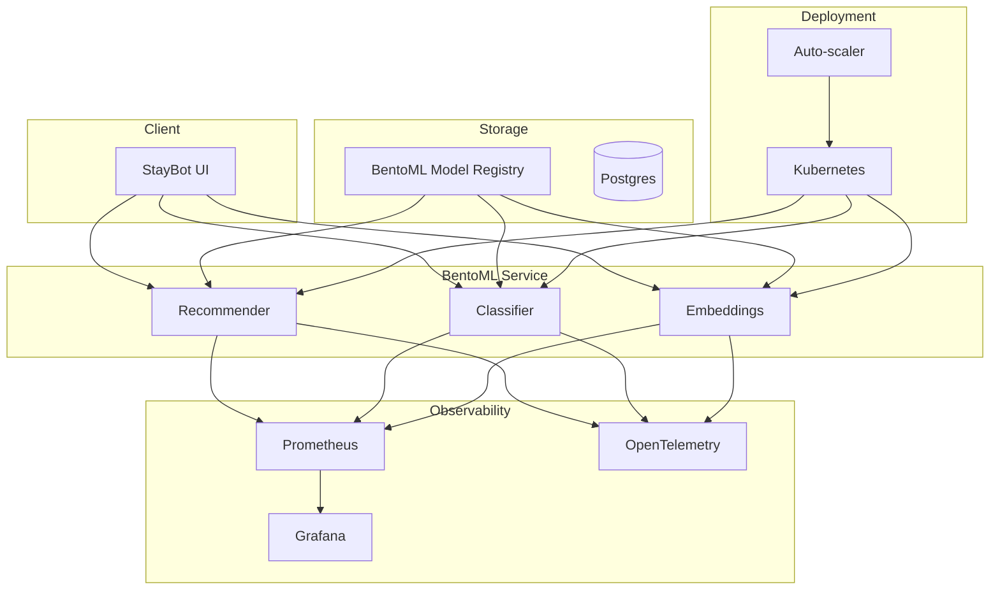

# 🎯 05 - Capstone — Production BentoML Platform

> **The seventeenth portfolio project. End-to-end production BentoML: a multi-model platform for the StayBot with CI/CD, auto-scaling, observability, and rollback. Boot with one docker-compose.**

## 🎯 Learning Objectives
- Build a complete multi-model BentoML service for the StayBot
- Deploy to Kubernetes with auto-scaling and rolling updates
- Implement CI/CD with retraining → rebuild → redeploy
- Wire up Prometheus metrics and Grafana dashboards
- Configure model versioning for rollback
- Add request tracing via OpenTelemetry
- Deploy with one docker-compose for local dev and Helm for production

## Introduction

The capstone is the **synthesis** of all four notes. You will build a complete production-shaped BentoML platform for the **StayBot**:

- Multi-model service (recommendation + classification + embeddings)
- Kubernetes deployment with HPA + PDB
- CI/CD pipeline (train → save → build → deploy)
- Prometheus metrics + Grafana dashboards
- Model versioning for rollback
- OpenTelemetry tracing

The capstone is the **seventeenth portfolio project**: production ML platform.



---

## 1. Project Layout

```
staybot-ml-platform/
├── bento_service.py        # The BentoML service
├── train.py                 # Training script
├── bento.yaml               # Bento configuration
├── docker-compose.yml       # Local dev stack
├── helm/                    # Production Helm chart
│   ├── Chart.yaml
│   ├── values.yaml
│   └── templates/
├── k8s/                     # Raw K8s manifests (alt)
├── tests/
│   ├── test_predict.py
│   └── smoke_test.py
├── .github/workflows/
│   └── deploy.yml
└── README.md
```

---

## 2. The Bento Service (`bento_service.py`)

```python
import bentoml
import numpy as np
import pandas as pd
from pydantic import BaseModel, Field


class RecommendRequest(BaseModel):
    user_id: str
    num_recommendations: int = Field(default=10, ge=1, le=50)


class RecommendResponse(BaseModel):
    user_id: str
    listing_ids: list[str]
    scores: list[float]
    model_version: str


class ClassifyRequest(BaseModel):
    listing_text: str


class ClassifyResponse(BaseModel):
    category: str
    confidence: float


class EmbedRequest(BaseModel):
    text: str


class EmbedResponse(BaseModel):
    embedding: list[float]
    model: str


@bentoml.service(
    name="staybot_ml",
    resources={"cpu": "4", "memory": "8Gi"},
    traffic={"timeout": 30, "concurrency": 200},
    metrics={"enabled": True},  # Prometheus
    tracing={"enabled": True},  # OpenTelemetry
)
class StayBotMLService:
    """Multi-model ML service for the StayBot."""
    
    # Three models in one service
    recommender = bentoml.models.BentoModel("staybot_recommender:latest")
    classifier = bentoml.models.BentoModel("staybot_classifier:latest")
    embedder = bentoml.models.BentoModel("staybot_embedder:latest")
    
    def __init__(self):
        # Load all models at startup
        import joblib
        self.rec_model = joblib.load(self.recommender.path_of("model.pkl"))
        self.cls_model = joblib.load(self.classifier.path_of("model.pkl"))
        # Embedder is from sentence-transformers
        from sentence_transformers import SentenceTransformer
        self.emb_model = SentenceTransformer(self.embedder.path)
        
        # Version tracking
        self.model_versions = {
            "recommender": self.recommender.tag,
            "classifier": self.classifier.tag,
            "embedder": self.embedder.tag,
        }
    
    @bentoml.api(batchable=True, max_batch_size=64, max_latency_ms=50)
    def recommend(self, requests: list[RecommendRequest]) -> list[RecommendResponse]:
        """Recommend listings for a user."""
        results = []
        for req in requests:
            # Get user features (from Feast, in production)
            user_features = self._get_user_features(req.user_id)
            
            # Score all listings
            scores = self.rec_model.predict_proba(user_features)[:, 1]
            top_k = np.argsort(scores)[-req.num_recommendations:][::-1]
            
            results.append(RecommendResponse(
                user_id=req.user_id,
                listing_ids=[f"L{i:05d}" for i in top_k],
                scores=[float(scores[i]) for i in top_k],
                model_version=self.model_versions["recommender"],
            ))
        return results
    
    @bentoml.api(batchable=True)
    def classify(self, requests: list[ClassifyRequest]) -> list[ClassifyResponse]:
        """Classify a listing into a category."""
        results = []
        for req in requests:
            prediction = self.cls_model.predict([req.listing_text])[0]
            proba = self.cls_model.predict_proba([req.listing_text])[0]
            results.append(ClassifyResponse(
                category=prediction,
                confidence=float(proba.max()),
            ))
        return results
    
    @bentoml.api
    def embed(self, req: EmbedRequest) -> EmbedResponse:
        """Generate embeddings for a text."""
        embedding = self.emb_model.encode(req.text).tolist()
        return EmbedResponse(embedding=embedding, model="all-MiniLM-L6-v2")
    
    @bentoml.api
    def health(self) -> dict:
        """Health check."""
        return {"status": "healthy", "models": self.model_versions}
    
    def _get_user_features(self, user_id: str) -> np.ndarray:
        """Get user features (from Feast in production)."""
        # Mock: return random features for demo
        np.random.seed(hash(user_id) % 1000)
        return np.random.rand(1, 100)
```

Three models in one service: recommender, classifier, embedder.

---

## 3. The Training Pipeline (`train.py`)

```python
# train.py
import pandas as pd
import numpy as np
import bentoml
from sklearn.ensemble import GradientBoostingClassifier
from sklearn.linear_model import LogisticRegression
from sentence_transformers import SentenceTransformer


def train_recommender():
    """Train the listing recommender."""
    # Load data from warehouse (mocked)
    interactions = pd.read_parquet("s3://staybot-data/interactions.parquet")
    
    # Build features
    features = build_features(interactions)
    labels = (interactions["clicks"] > 0).astype(int)
    
    # Train
    model = GradientBoostingClassifier(n_estimators=100)
    model.fit(features, labels)
    
    # Save to BentoML
    bentoml.sklearn.save_model(
        "staybot_recommender",
        model,
        signatures={"predict_proba": {"batchable": True, "batch_dim": 0}},
        metadata={
            "framework": "sklearn",
            "n_estimators": 100,
            "training_date": pd.Timestamp.utcnow().isoformat(),
            "training_data_rows": len(features),
        },
        labels={"env": "prod", "team": "ml"},
    )
    print("Recommender saved")


def train_classifier():
    """Train the listing category classifier."""
    listings = pd.read_parquet("s3://staybot-data/listings.parquet")
    
    # Train
    model = LogisticRegression(max_iter=1000)
    model.fit(listings["description"], listings["category"])
    
    bentoml.sklearn.save_model(
        "staybot_classifier",
        model,
        signatures={"predict": {"batchable": True}},
        metadata={"framework": "sklearn"},
    )
    print("Classifier saved")


def download_embedder():
    """Download and save the embedder."""
    model = SentenceTransformer("all-MiniLM-L6-v2")
    bentoml.transformers.save_model(
        "staybot_embedder",
        model,
        metadata={"name": "all-MiniLM-L6-v2"},
    )
    print("Embedder saved")


def build_features(interactions: pd.DataFrame) -> np.ndarray:
    """Build feature matrix from interactions."""
    # Mock feature engineering
    return np.random.rand(len(interactions), 100)


if __name__ == "__main__":
    train_recommender()
    train_classifier()
    download_embedder()
```

Run training:
```bash
bentoml models list  # see existing versions
python train.py     # train new versions
bentoml models list  # see new versions
```

---

## 4. The Single Docker Compose (`docker-compose.yml`)

```yaml
version: "3.9"

services:
  staybot-ml:
    build: .
    ports:
      - "3000:3000"
    environment:
      - OTEL_EXPORTER_OTLP_ENDPOINT=http://otel-collector:4317
      - OTEL_SERVICE_NAME=staybot-ml
    deploy:
      resources:
        limits:
          cpus: "4"
          memory: 8G
    healthcheck:
      test: ["CMD", "curl", "-f", "http://localhost:3000/healthz"]
      interval: 30s
      timeout: 5s
      retries: 3

  otel-collector:
    image: otel/opentelemetry-collector-contrib:latest
    command: ["--config=/etc/otel/config.yaml"]
    volumes:
      - ./otel-collector.yaml:/etc/otel/config.yaml
    ports:
      - "4317:4317"  # OTLP gRPC
      - "4318:4318"  # OTLP HTTP

  prometheus:
    image: prom/prometheus:latest
    volumes:
      - ./prometheus.yml:/etc/prometheus/prometheus.yml
    ports:
      - "9090:9090"

  grafana:
    image: grafana/grafana:latest
    ports:
      - "3000:3000"
    volumes:
      - ./grafana_dashboards:/var/lib/grafana/dashboards
```

```bash
docker compose up -d
```

- API: http://localhost:3000
- Prometheus: http://localhost:9090
- Grafana: http://localhost:3001

---

## 5. The Production Kubernetes Helm Chart

```yaml
# helm/values.yaml
image:
  repository: my-registry.com/staybot-ml
  tag: latest
  pullPolicy: Always

replicas: 3

resources:
  requests:
    cpu: "4"
    memory: "8Gi"
  limits:
    cpu: "8"
    memory: "16Gi"

autoscaling:
  enabled: true
  minReplicas: 3
  maxReplicas: 20
  targetCPUUtilizationPercentage: 70
  targetMemoryUtilizationPercentage: 80

ingress:
  enabled: true
  className: nginx
  annotations:
    cert-manager.io/cluster-issuer: letsencrypt-prod
  hosts:
    - host: ml.staybot.com
      paths:
        - path: /
          pathType: Prefix

serviceMonitor:
  enabled: true  # Prometheus scraping

podDisruptionBudget:
  enabled: true
  minAvailable: 2

env:
  - name: OTEL_EXPORTER_OTLP_ENDPOINT
    value: http://otel-collector:4317
  - name: OTEL_SERVICE_NAME
    value: staybot-ml
```

Deploy:
```bash
helm install staybot-ml ./helm -f helm/values-prod.yaml -n production
```

---

## 6. The CI/CD Pipeline (`.github/workflows/deploy.yml`)

```yaml
name: Train, Build, Deploy StayBot ML

on:
  push:
    paths:
      - "train.py"
      - "models/**"
    branches: [main]

jobs:
  train-build-deploy:
    runs-on: ubuntu-latest
    steps:
      - uses: actions/checkout@v4
      
      - name: Set up Python
        uses: actions/setup-python@v5
        with:
          python-version: "3.11"
      
      - name: Install dependencies
        run: pip install bentoml scikit-learn sentence-transformers
      
      - name: Train models
        run: python train.py
      
      - name: Build Bento
        run: bentoml build
      
      - name: Containerize
        run: bentoml containerize staybot_ml:latest -t staybot-ml:${{ github.sha }}
      
      - name: Push to registry
        run: |
          echo "${{ secrets.REGISTRY_PASSWORD }}" | docker login -u "${{ secrets.REGISTRY_USER }}" --password-stdin
          docker push my-registry.com/staybot-ml:${{ github.sha }}
      
      - name: Deploy to staging
        run: |
          helm upgrade --install staybot-ml ./helm \
              --set image.tag=${{ github.sha }} \
              -n staging
      
      - name: Smoke tests
        run: |
          sleep 30  # wait for rollout
          python tests/smoke_test.py --url http://staybot-ml.staging:3000
      
      - name: Deploy to production
        if: success()
        run: |
          helm upgrade --install staybot-ml ./helm \
              --set image.tag=${{ github.sha }} \
              -n production
```

The pipeline:
1. Trains new model versions on every push
2. Builds the Bento + container image
3. Deploys to staging
4. Runs smoke tests
5. Auto-deploys to production if tests pass

---

## 7. Rollback Procedures

For model version rollback:

```python
# Manual rollback
bentoml models list staybot_recommender
# Output: staybot_recommender:l3kxj2 (latest), staybot_recommender:abc123 (previous)

# Roll back the service to previous version
bentoml deploy staybot_ml:abc123 --platform kubernetes --namespace production
```

For automatic rollback on error rate spike:

```yaml
# Kubernetes with rollback via Helm
apiVersion: argoproj.io/v1alpha1
kind: Rollout
metadata:
  name: staybot-ml
spec:
  strategy:
    canary:
      steps:
        - setWeight: 10
        - pause: {duration: 5m}
        - setWeight: 50
        - pause: {duration: 5m}
        - setWeight: 100
      analysis:
        templates:
          - templateName: success-rate
        args:
          - name: service-name
            value: staybot-ml
```

Argo Rollouts:
- Deploys new version to 10% of traffic
- Watches success rate
- Promotes to 50%, then 100%
- Rolls back automatically if success rate drops

---

## 8. Production Observability

```yaml
# Grafana dashboard: StayBot ML
panels:
  - title: "Predictions per second"
    query: "rate(staybot_predictions_total[5m])"
  
  - title: "P99 latency"
    query: "histogram_quantile(0.99, staybot_prediction_duration_seconds)"
  
  - title: "Error rate"
    query: "rate(staybot_errors_total[5m]) / rate(staybot_predictions_total[5m])"
  
  - title: "Active models"
    query: "staybot_model_info"
  
  - title: "Bento versions deployed"
    query: "staybot_bento_version"
```

The dashboard shows:
- Throughput
- Latency (p50, p95, p99)
- Error rate
- Model versions in production
- Current Bento versions

---

## 9. Production Deployment Checklist

- [ ] Models trained and saved to BentoML registry
- [ ] Bento built and tested locally
- [ ] Container image built and pushed to registry
- [ ] Kubernetes manifests / Helm chart ready
- [ ] Prometheus scraping configured
- [ ] OpenTelemetry tracing configured
- [ ] Grafana dashboards created
- [ ] Argo Rollouts for canary deploys
- [ ] Health checks on /healthz endpoint
- [ ] Graceful shutdown (SIGTERM handling)
- [ ] Resource limits set (CPU, memory)
- [ ] Pod Disruption Budget for HA
- [ ] Auto-scaling (HPA) configured
- [ ] Ingress with TLS
- [ ] CI/CD pipeline with smoke tests
- [ ] Rollback procedure documented
- [ ] Disaster recovery: backup model registry

---

## 🎯 Key Takeaways

- The capstone composes all four notes into a production BentoML platform.
- Three models in one service: recommender, classifier, embedder.
- One `docker-compose.yml` for local dev; Helm chart for production.
- CI/CD pipeline: train → save → build → staging → smoke test → production.
- Argo Rollouts for canary deploys; automatic rollback on error rate spike.
- Prometheus + Grafana + OpenTelemetry for unified observability.
- Model versioning enables zero-downtime rollback.
- The capstone is the **seventeenth portfolio project**: production ML platform.

## References

- [[09 - MLOps y Produccion/42 - BentoML Production Model Serving/01 - BentoML Fundamentals|Note 01 — Fundamentals]]
- [[09 - MLOps y Produccion/42 - BentoML Production Model Serving/02 - Service Patterns|Note 02 — Service Patterns]]
- [[09 - MLOps y Produccion/42 - BentoML Production Model Serving/03 - Distributed Serving|Note 03 — Distributed Serving]]
- [[09 - MLOps y Produccion/42 - BentoML Production Model Serving/04 - Deployment Targets|Note 04 — Deployment Targets]]
- BentoML docs — [docs.bentoml.com](https://docs.bentoml.com)
- Argo Rollouts — [argoproj.github.io/argo-rollouts](https://argoproj.github.io/argo-rollouts/)
- [[06 - Large Language Models/13 - vLLM and Advanced RAG|vLLM]] — LLM serving comparison
- [[09 - MLOps y Produccion/32 - KServe and Knative|KServe]] — K8s-native alternative
- [[10 - Cloud, Infra y Backend/22 - Cloud Computing|Cloud Computing]] — multi-cloud deploy
- [[09 - MLOps y Produccion/36 - LangFuse - Open-Source LLM Observability|LangFuse Deep Dive]] — observability
- [[09 - MLOps y Produccion/22 - End-to-End ML Project|E2E ML Project]] — training pipeline