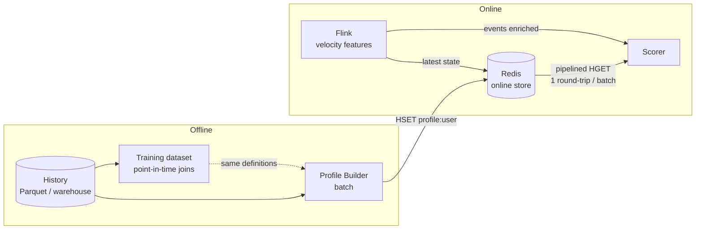

# ⚡ Welcome — Real-time Feature Serving with Redis

A fraud model is only as good as the features it sees at decision time, and at decision time you have a few milliseconds to fetch them. The online feature store is the component that makes "the user's 30-day average amount and their last 10 minutes of activity" available in under a millisecond, consistently with how the model was trained. In most real-time ML stacks, that component is **Redis**.

## 🎯 Learning Objectives
- Explain the **online vs offline** feature store split and where Redis fits relative to Feast/Tecton
- Model features in Redis for **speed, memory, and correctness**: keys, hashes vs JSON, TTLs, pipelining, Lua
- Decide between **Redis Streams and Kafka** for event transport in ML pipelines
- Guarantee **point-in-time correctness** and prevent **train/serve skew** between offline training data and online features
- Build and defend a **latency budget** for online serving with p95/p99 targets
- Apply all of it to the P1 fraud scorer and the P2 message router

## Introduction

Feature stores were popularized by Uber's Michelangelo (2017) and later by Feast and Tecton, but under the vocabulary the architecture is simple: an **offline store** (a warehouse or Parquet files) holds the full history used to build training datasets, and an **online store** (a key–value database) holds the **latest** feature values per entity for low-latency lookup at inference time. Redis dominates the online side because it serves reads from memory in microseconds, offers rich data structures, and is operationally familiar.

Using Redis well for ML is not the same as using it as a cache. A cache can be wrong for a while and recover; an online feature store that is subtly wrong — stale, inconsistent with training, or slow at the tail — silently degrades every prediction. This course focuses on the decisions that matter for correctness and latency rather than on Redis basics, which are covered in [[../../10 - Cloud, Infra y Backend/25 - Bases de Datos y Message Queues/03 - Redis y Caching|Redis y Caching]] and [[../../10 - Cloud, Infra y Backend/42 - Caching Strategies for FastAPI/02 - Redis as Cache Backend|Redis as Cache Backend]].

It also connects the streaming courses to serving: [[../../10 - Cloud, Infra y Backend/46 - Apache Flink for Real-time ML/00 - Welcome to Apache Flink for Real-time ML|Flink]] computes velocity features; Redis serves profile features and the latest state; the scorer combines both inside a strict budget.

---

## Course Map

| #  | Note                                              | Core question                                                       |
|----|---------------------------------------------------|---------------------------------------------------------------------|
| 01 | Feature Data Modeling in Redis                    | How do I lay out features for sub-ms reads and bounded memory?      |
| 02 | Redis Streams vs Kafka                            | When is Redis enough as the event log, and when is it not?          |
| 03 | Point-in-Time Correctness and Train-Serve Skew    | How do I guarantee the model sees online what it saw in training?   |
| 04 | Latency Budgets for Online Serving                | How do I allocate and defend 80 ms across every hop?                |

## Prerequisites
- Redis fundamentals ([[../../10 - Cloud, Infra y Backend/25 - Bases de Datos y Message Queues/03 - Redis y Caching|Redis y Caching]])
- Feature stores concepts ([[../27 - Feast and Feature Stores/00 - Welcome to Feast and Feature Stores for MLOps|Feast and Feature Stores]])
- Real-time ML patterns ([[../40 - Real-time ML Systems/00 - Welcome - Why Real-time ML Systems|Real-time ML Systems]])

⚠️ **Version and licensing note:** Redis 8 folded the former Redis Stack modules (JSON, Search, time series, probabilistic structures) into the core distribution and added an OSI-approved license option (AGPLv3) after the 2024 license change; **Valkey** is the Linux Foundation fork of Redis 7.2 under BSD. The commands in this course work on both unless marked. Verify licensing for your deployment.

## References
- Hermann & Del Balso, *Meet Michelangelo: Uber's Machine Learning Platform* (Uber Engineering, 2017)
- Redis documentation — data types, pipelining, Lua scripting, Streams
- Feast documentation — online stores (Redis), point-in-time joins
