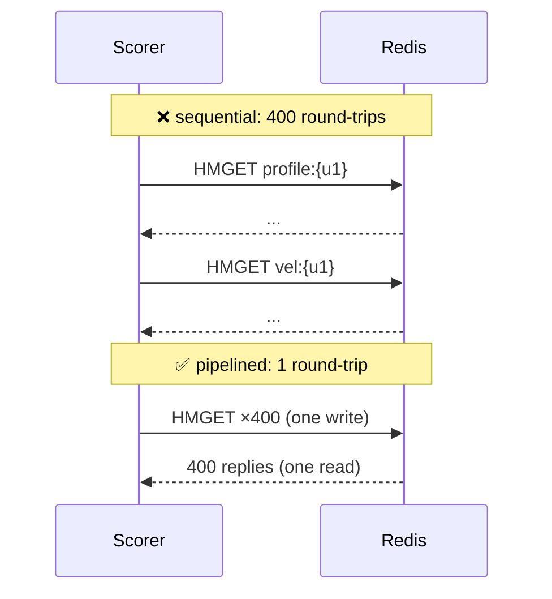

# 🗂️ 01 - Feature Data Modeling in Redis

Redis answers a `GET` in microseconds, so it is tempting to believe any layout is fast enough. It is not. The difference between one key per feature and one hash per entity is a 3–5× difference in memory; the difference between twenty round-trips and one pipelined round-trip is the difference between 4 ms and 0.3 ms of your scoring budget; and the difference between a blind `HSET` and a versioned write is whether a replayed old event can overwrite fresh features. Data modeling is where an online store becomes correct and cheap — or neither.

## 🎯 Learning Objectives
- Understand the Redis internals that drive feature-store design: single-threaded execution, per-key overhead, compact encodings
- Choose between **one key per feature**, **hashes per entity**, **JSON documents**, and **serialized blobs**
- Design keys: namespaces, feature-set **versions**, and **hash tags** for Redis Cluster
- Use **TTLs** at key and field level, and pick a safe **eviction policy**
- Eliminate round-trips with **pipelining** and quantify the gain
- Make writes **monotonic** with a Lua script so replays can't regress features
- Size memory before deploying, and verify it with `MEMORY USAGE`

## Introduction

An online feature store has a narrow contract: given an entity ID (a user, a card, a merchant), return the latest values of a known set of features, fast, at any percentile you care about. Everything else — how features are computed, how they're backfilled — happens elsewhere. That narrow contract is what makes Redis such a good fit: it is a **data-structure server**, and the right structure turns the contract into one command per entity.

This note models P1's two feature groups: **profile features** (30-day behavior, rebuilt in batch) under `profile:{user_id}` and **velocity state** (written by a streaming job) under `vel:{user_id}`. The scorer reads both for a micro-batch of payments in **one pipelined round-trip**.

---

## 1. The Problem and Why This Solution Exists

### Three naive layouts and how they fail

| Layout | Example | Failure |
|---|---|---|
| One key per feature | `user:42:avg_amount_30d` → `"37.5"` | Each key costs ~50–80 bytes of overhead; 20 features × 1M users = 20M keys; reads need `MGET` of many keys |
| One JSON string per entity | `user:42` → `'{"avg":37.5,...}'` | Updating one field is read–modify–write (race-prone); every read parses the whole blob |
| Features spread across many structures | sorted sets, lists, strings mixed | Many commands per entity, no single atomic read |

### Why Redis is shaped the way it is

Redis executes commands on a **single main thread** (I/O threading since 6.0 parallelizes network reads/writes, not command execution). That design gives each command atomicity and predictable sub-microsecond execution for O(1) operations, but it means **one slow command blocks everyone** — a `KEYS *` or a huge `HGETALL` on a 100k-field hash stalls every scorer request behind it. Data modeling must keep each command small and bounded.

---

## 2. Conceptual Deep Dive

### 2.1 Per-key overhead and compact encodings

Every top-level key carries bookkeeping: the key string, a dictionary entry, an object header, and possibly an expiry entry. A rough model:

$$
M_{\text{total}} \approx N_{\text{keys}} \cdot (o_{\text{key}} + |k|) + \sum_{\text{keys}} M_{\text{value}}
$$

with $o_{\text{key}}$ on the order of 50–70 bytes. Small hashes are stored in a **listpack** — a compact contiguous encoding — as long as they stay under `hash-max-listpack-entries` (default 128 fields) and `hash-max-listpack-value` (default 64 bytes per value). Within a listpack, each field–value pair costs little more than its bytes.

For 1M users × 20 features:

$$
\underbrace{20\text{M keys} \times \sim 90\,\text{B}}_{\text{key-per-feature}} \approx 1.8\,\text{GB}
\qquad\text{vs}\qquad
\underbrace{1\text{M keys} \times (\sim 90\,\text{B} + 20 \times \sim 18\,\text{B})}_{\text{hash per entity (listpack)}} \approx 0.45\,\text{GB}
$$

⚠️ **Warning:** a hash that grows past the listpack thresholds converts to a full hash table and its memory jumps several-fold. Keep feature hashes **small and bounded** — never store an ever-growing list of events inside the entity hash.

💡 **Tip:** short field names save memory at scale (`a30` instead of `avg_amount_30d`), but cost readability. A common compromise is readable names plus a **feature-set version** in the key, with the field-name mapping defined once in code.

### 2.2 Hash vs JSON vs serialized blob

| Option | Read | Partial update | Memory | When |
|---|---|---|---|---|
| **Hash** (`HSET`/`HMGET`) | Selected fields | ✅ per field | Compact (listpack) | Default for flat numeric features |
| **JSON** (`JSON.SET`/`JSON.GET`, built into Redis 8) | Paths | ✅ per path | Larger | Nested features, mixed types |
| **Serialized blob** (MessagePack/Protobuf in a string) | Whole entity in one `GET` | ❌ rewrite all | Very compact | Static feature sets rebuilt in batch |

P1 uses **hashes**: profile features are rewritten in batch (a blob would also work), but velocity state is updated field by field, and the scorer reads a fixed subset with `HMGET`.

### 2.3 Key design

- **Namespace by entity and feature set:** `profile:{user_id}`, `vel:{user_id}`.
- **Version the feature set**, not individual features: `profile:v3:{user_id}`. A new feature definition writes to `v4` in the background; the scorer switches the version it reads when `v4` is complete — a blue/green swap with instant rollback.
- **Hash tags for Redis Cluster:** keys are assigned to slots by CRC16 of the key, or of the substring inside `{...}` if present. Writing `profile:{u_42}` and `vel:{u_42}` puts both in the **same slot**, so a single node serves both and multi-key operations (including Lua scripts touching both) are allowed.

$$
\text{slot}(k) = \text{CRC16}\big(\text{tag}(k)\big) \bmod 16384,
\qquad
\text{tag}(\texttt{profile:\{u\_42\}}) = \texttt{u\_42}
$$

### 2.4 Expiration and eviction

- **Key TTL** (`EXPIRE vel:{u} 86400`) cleans up inactive users' velocity state.
- **Field TTL** (`HEXPIRE`, Redis 7.4+ / Redis 8): expire individual fields — e.g., a `last_device` field that should vanish after 24 h while the rest of the hash stays.
- **Eviction policy:** `noeviction` for a feature store. With `allkeys-lru`, Redis may silently evict a user's profile under memory pressure, and the scorer sees "new user" defaults for an old user — a correctness bug disguised as a cache miss. Prefer failing writes loudly (and alerting on memory) over silent eviction.

### 2.5 Round-trips: the dominant cost

From a client in the same Docker network, a round-trip (RTT) is ~0.1–0.3 ms; command execution is microseconds. For a micro-batch of $n$ payments needing 2 keys each:

$$
T_{\text{sequential}} \approx 2n\,(\text{RTT} + t_{\text{cmd}})
\qquad
T_{\text{pipelined}} \approx \text{RTT} + 2n\,t_{\text{cmd}}
$$

With $n = 200$, RTT = 0.2 ms, $t_{\text{cmd}} = 2\,\mu s$: **80 ms sequential vs 1 ms pipelined**. Pipelining is not an optimization here; it is what makes the latency budget feasible.



### 2.6 Monotonic writes with Lua

At-least-once streaming means an **older** record can be replayed after a newer one was written. A blind `HSET` lets the old values win. Make the write conditional on a monotonic field (event time, sequence number, or `doc_version`) atomically on the server:

```lua
-- KEYS[1] = vel:{user}, ARGV[1] = incoming ts, ARGV[2..] = field, value pairs
local cur = redis.call('HGET', KEYS[1], 'ts')
if cur and tonumber(cur) >= tonumber(ARGV[1]) then return 0 end
redis.call('HSET', KEYS[1], 'ts', ARGV[1], unpack(ARGV, 2))
return 1
```

The script runs atomically (single-threaded execution), so no other client can interleave between the check and the write.

---

## 3. Production Reality

### Sizing before deploying

1. Write 1,000 realistic entities.
2. `MEMORY USAGE profile:{u_1}` on samples → average bytes per entity.
3. Multiply by entities × 1.3 (fragmentation and headroom).
4. Watch `INFO memory`: `used_memory`, `mem_fragmentation_ratio`.

For P1 (100k users, ~8 profile fields and ~6 velocity fields), expect tens of MB — comfortably inside a 256 MB `maxmemory` with `noeviction`.

### Durability and availability

Online features are usually **rebuildable** (from the batch Profile Builder and from Kafka replay), so persistence can be off for latency and simplicity on a laptop. In production, a **replica** (and Sentinel or a managed service's failover) prevents a restart from turning into a cold, empty store at peak time — which would hit every prediction with default values.

### Client-side details that matter for the tail

- Use the **hiredis** parser with redis-py (C parser, much faster response parsing).
- Use a **connection pool** sized to concurrency; creating connections per request adds a TCP handshake.
- Avoid `HGETALL` on large hashes in the hot path; read the fields the model needs with `HMGET`.
- Consider **client-side caching** (RESP3 tracking) for features that change rarely (e.g., merchant risk tier): the server invalidates the client's local copy on change.

Caso real: DoorDash's engineering team described benchmarking Redis layouts for a feature store serving billions of feature lookups, and found that grouping an entity's features into hashes, shortening/encoding field names, and using compact binary encodings for list-valued features cut memory substantially and improved read latency compared to flat key-per-feature layouts — the same trade-offs described above, at scale.

Caso real: in P1, the scorer pipelines `HMGET profile:{u}` for every payment in a micro-batch of up to 500 events, so the Redis segment of the latency budget is roughly **one RTT per batch**, independent of batch size — a key reason the 80 ms budget is achievable on a laptop.

---

## 4. Code in Practice

### Writing profiles (batch) and reading features (scorer)

```python
import redis

r = redis.Redis(host="redis", port=6379, decode_responses=True)   # pip install "redis[hiredis]"
PROFILE_FIELDS = ["avg_amount_30d", "std_amount_30d", "home_country", "n_known_devices", "account_age_days"]

def write_profiles(rows: list[dict], version: str = "v1", chunk: int = 1000):
    pipe = r.pipeline(transaction=False)
    for i, row in enumerate(rows, 1):
        pipe.hset(f"profile:{version}:{{{row['user_id']}}}",            # hash tag → cluster slot by user
                  mapping={k: row[k] for k in PROFILE_FIELDS})
        if i % chunk == 0:
            pipe.execute()                                             # bounded pipeline size
    pipe.execute()

def read_features(user_ids: list[str], version: str = "v1") -> list[dict]:
    pipe = r.pipeline(transaction=False)
    for u in user_ids:
        pipe.hmget(f"profile:{version}:{{{u}}}", PROFILE_FIELDS)
        pipe.hmget(f"vel:{{{u}}}", ["f_cnt_1h", "f_sum_1h"])
    replies = pipe.execute()                                           # ONE round-trip for the batch
    out = []
    for prof, vel in zip(replies[0::2], replies[1::2]):
        out.append({**dict(zip(PROFILE_FIELDS, prof)), "f_cnt_1h": vel[0], "f_sum_1h": vel[1]})
    return out
```

⚠️ **Warning:** `HMGET` returns `None` for missing fields and a list of `None`s for a missing key. Decide explicitly what the model receives for a **new user** (training must have seen the same default) instead of letting `None` become `NaN` by accident.

### Monotonic velocity writes

```python
SET_IF_NEWER = r.register_script("""
local cur = redis.call('HGET', KEYS[1], 'ts')
if cur and tonumber(cur) >= tonumber(ARGV[1]) then return 0 end
redis.call('HSET', KEYS[1], 'ts', ARGV[1], unpack(ARGV, 2))
redis.call('EXPIRE', KEYS[1], 86400)
return 1
""")
SET_IF_NEWER(keys=["vel:{u_42}"], args=[1759740000.123, "f_cnt_1h", 4, "f_sum_1h", 120.5])
```

### ❌/✅ Layout

```python
# ❌ Key per feature: 20× the keys, 20 round-trips (or a giant MGET), more memory
for f, v in feats.items():
    r.set(f"user:{uid}:{f}", v)

# ✅ One bounded hash per entity and feature set; one command to write, one to read
r.hset(f"profile:v1:{{{uid}}}", mapping=feats)
```

### Inspecting memory

```bash
redis-cli MEMORY USAGE "profile:v1:{u_000042}"     # bytes for one entity
redis-cli OBJECT ENCODING "profile:v1:{u_000042}"  # "listpack" = compact; "hashtable" = grew too big
redis-cli INFO memory | grep -E "used_memory_human|mem_fragmentation_ratio"
```

### 📦 Compression code: memory and round-trip models for an online store

```python
# 📦 Compression code: why hashes + pipelining are the default layout for online features
# Covers: per-key overhead, listpack hashes, Cluster hash-tag slots, pipelining math
import binascii

def crc16_xmodem(data: bytes) -> int:            # Redis Cluster uses CRC16-CCITT (XMODEM)
    return binascii.crc_hqx(data, 0)

def slot(key: str) -> int:
    s, e = key.find("{"), key.find("}")
    tag = key[s + 1:e] if s != -1 and e > s + 1 else key
    return crc16_xmodem(tag.encode()) % 16384

users, feats = 1_000_000, 20
key_overhead, field_pair = 90, 18                 # rough bytes; measure with MEMORY USAGE
per_feature = users * feats * (key_overhead + 8)
per_hash = users * (key_overhead + feats * field_pair)
print(f"key-per-feature ≈ {per_feature/1e9:.2f} GB | hash-per-entity ≈ {per_hash/1e9:.2f} GB")

print("same slot:", slot("profile:v1:{u_42}") == slot("vel:{u_42}"),
      "| without tags:", slot("profile:v1:u_42") == slot("vel:u_42"))

rtt, t_cmd, n = 0.2e-3, 2e-6, 200                 # 200 payments × 2 keys
seq = 2 * n * (rtt + t_cmd)
pipe = rtt + 2 * n * t_cmd
print(f"sequential ≈ {seq*1000:.1f} ms | pipelined ≈ {pipe*1000:.2f} ms ({seq/pipe:.0f}× faster)")
# ¡Sorpresa! The commands take 0.8 ms in total; the other 79 ms of the sequential version is just waiting on the network.
```

---

## 🎯 Key Takeaways
- Model each entity as a **bounded hash** per feature set; small hashes use the compact **listpack** encoding.
- Per-key overhead dominates key-per-feature layouts — often **3–5× more memory**.
- **Version feature sets in the key** for blue/green rollouts; use **hash tags** to co-locate an entity's keys in Redis Cluster.
- Use key TTLs (and field TTLs on Redis 7.4+/8) for cleanup, and **`noeviction`** so features never vanish silently.
- **Pipeline** all reads for a micro-batch: one round-trip instead of hundreds.
- Make streaming writes **monotonic** with a Lua compare-and-set to survive replays.
- Size memory with `MEMORY USAGE` on real samples before deploying, and define new-user defaults consistently with training.

## References
- Redis documentation — Hashes, listpack encoding settings, pipelining, Lua scripting/Functions, `HEXPIRE`, Cluster key slots and hash tags, eviction policies, client-side caching
- DoorDash Engineering — *Building a Gigascale ML Feature Store with Redis* (2020)
- Feast documentation — Redis online store
- [[00 - Welcome to Real-time Feature Serving with Redis|Course welcome]] · [[02 - Redis Streams vs Kafka|Next: Redis Streams vs Kafka]]
