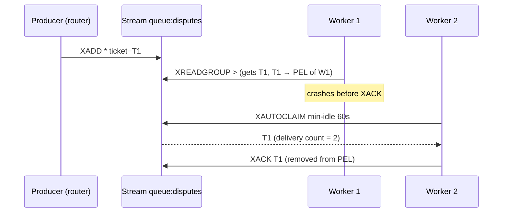

# 🔀 02 - Redis Streams vs Kafka

"We already have Redis, why run Kafka?" and "We have Kafka, why would we ever queue anything in Redis?" are both reasonable questions with wrong default answers. Redis Streams and Kafka both implement an append-only log with consumer groups, but they make opposite bets on **where data lives** (memory vs disk), **how progress is tracked** (per-message acknowledgments vs offsets), and **how far back you can replay**. Choosing between them is choosing which failure you can afford.

## 🎯 Learning Objectives
- Explain the Redis Streams model: entry IDs, consumer groups, the **Pending Entries List**, `XACK`, `XAUTOCLAIM`, trimming
- Contrast it with Kafka's partitioned, disk-based, offset-tracked log
- Compare **durability, retention, replay, ordering, scaling, and delivery semantics** quantitatively
- Recognize why **Pub/Sub and lists** are not reliable queues
- Decide which to use for event backbones, work queues, and short buffers in ML systems
- Implement a reliable Redis Streams work queue with claiming and a dead-letter stream

## Introduction

Real-time ML systems move two kinds of messages. **Events** describe facts (a payment happened, a message arrived) and are consumed by many independent readers — feature jobs, scorers, auditors, analytics — each at its own pace, sometimes replaying days of history. **Tasks** describe work to be done once (review this flagged payment, answer this escalated ticket) and are consumed by a pool of workers who must acknowledge each one and must not lose it if a worker crashes.

Kafka is built for events: durable, replayable, partitioned, cheap per gigabyte on disk. Redis Streams are excellent for tasks: per-message acknowledgment, inspection of what each worker is holding, and reassignment of stuck messages — all in memory, with sub-millisecond latency. Using each for the other's job works on a demo and fails in production.

The portfolio projects split exactly along this line: P1 and P2 use Kafka/Redpanda for event streams, and P2 uses **Redis Streams for human team queues** (disputes, security, cards…), where per-ticket acknowledgment and reassignment matter more than replaying history.

---

## 1. The Problem and Why This Solution Exists

### Why not Pub/Sub or a list?

| Mechanism | What happens if the consumer is down or crashes mid-message |
|---|---|
| Redis **Pub/Sub** | Messages published while nobody listens are **gone**. No persistence, no acks |
| Redis **list** (`LPUSH`/`BRPOP`) | `BRPOP` removes the item **before** processing; a crash loses it (the `BLMOVE` reliable-queue pattern helps, but needs manual bookkeeping) |
| Redis **Streams** | Entries persist; consumer groups track delivered-but-unacknowledged entries; they can be reclaimed |
| **Kafka** | Records persist on disk for the retention period; consumers resume from committed offsets |

Redis Streams (Redis 5.0, 2018) were designed precisely to give Redis a log with consumer groups inspired by Kafka — but kept in memory and with per-entry acknowledgment.

---

## 2. Conceptual Deep Dive

### 2.1 Redis Streams in one picture

- `XADD queue:disputes * field value …` appends an entry with an auto-generated ID `<ms-timestamp>-<seq>`; IDs are strictly increasing.
- A **consumer group** (`XGROUP CREATE`) tracks a `last-delivered-id` and, for each consumer, a **Pending Entries List (PEL)**: entries delivered but not yet acknowledged, with their delivery count and idle time.
- `XREADGROUP GROUP g consumer-1 COUNT 10 BLOCK 5000 STREAMS queue >` delivers **new** entries and adds them to that consumer's PEL.
- `XACK` removes an entry from the PEL — the task is done.
- `XAUTOCLAIM` transfers entries idle longer than a threshold to another consumer — recovery from a crashed worker.
- `XADD ... MAXLEN ~ 100000` or `XTRIM MINID ~ <id>` bounds memory (the `~` allows efficient approximate trimming).



### 2.2 Kafka in one picture (for contrast)

- A topic is split into **partitions**; each is an ordered, append-only log on **disk**, replicated to other brokers.
- A consumer group assigns each partition to one consumer; progress is a single **committed offset per partition** — not per message.
- Records stay for the **retention period** (hours to forever) regardless of consumption; any group can start from any offset → **replay**.

### 2.3 The quantitative differences

**Retention vs memory.** Redis keeps the stream in RAM. Holding $r$ events/s for a retention window $W$ with average entry size $b$:

$$
M_{\text{stream}} \approx r \cdot W \cdot b
$$

At 5,000 ev/s × 1 h × 300 B ≈ **5.4 GB** — beyond an 8 GB laptop and expensive in production. Kafka stores the same on disk, compressed, where 5 GB is trivial. Redis Streams suit **short buffers and work queues** (entries are trimmed once processed); Kafka suits **retained event history**.

**Progress tracking.** Kafka tracks one integer per partition, so a slow message blocks the commit of everything after it in that partition (head-of-line for commits, not for processing). Redis tracks each entry individually: worker A can be stuck on ticket T1 while worker B acknowledges T2–T50. For **tasks of very uneven duration** (a human resolving a dispute takes minutes; another takes hours), per-message acknowledgment is the right model.

**Scaling.** A Redis stream is **one key**, which lives on one node (one shard) in Redis Cluster. Scaling beyond a node means sharding manually across several streams (`queue:disputes:{0..7}`). Kafka scales a topic by adding partitions across brokers.

**Durability.** Redis persists via AOF/RDB and replicates **asynchronously**; with `appendfsync everysec`, a crash can lose up to ~1 s of acknowledged writes, and a failover can lose writes not yet replicated (`WAIT` reduces but doesn't eliminate this). Kafka with `acks=all` and `min.insync.replicas=2` acknowledges a write only after it is replicated.

| Dimension | Redis Streams | Kafka |
|---|---|---|
| Storage | Memory (+ AOF/RDB) | Disk, replicated |
| Typical retention | Minutes–hours (trimmed) | Days–forever |
| Replay | Within what's not trimmed | Any offset within retention |
| Progress | Per-entry ack (PEL) | Offset per partition |
| Stuck message recovery | `XAUTOCLAIM` per entry | Rebalance; offset doesn't advance |
| Ordering | Per stream | Per partition |
| Horizontal scaling | Manual sharding of streams | Partitions across brokers |
| Latency | Sub-ms | ms (batching, fsync policy) |
| Ecosystem | Redis clients | Connect, Flink/Spark/Kafka Streams, schema registries |

### 2.4 Delivery semantics

Both give **at-least-once** naturally: a task delivered and not acknowledged (Redis) or an offset not committed (Kafka) is redelivered after a failure. Consumers must therefore be **idempotent** — the same lesson as streaming sinks in [[../../10 - Cloud, Infra y Backend/46 - Apache Flink for Real-time ML/03 - State, Checkpoints and Exactly-Once|state and exactly-once]]. Redis adds a useful signal: the **delivery count** per pending entry, which lets you route "poison" tasks to a dead-letter stream after $k$ attempts instead of retrying forever.

---

## 3. Production Reality

### A decision guide for ML systems

| Need | Choose | Reason |
|---|---|---|
| Event backbone read by many services, with replay for backfills | **Kafka / Redpanda** | Retention on disk, independent consumer groups |
| Input to a stream processor (Flink, Spark, Quix) | **Kafka / Redpanda** | First-class connectors and offset-based recovery |
| Work queue for humans or slow workers, uneven task durations | **Redis Streams** | Per-entry ack, claiming, delivery counts, inspection |
| Short-lived buffer between two services already using Redis | **Redis Streams** | No new infrastructure, sub-ms |
| Fire-and-forget notifications where loss is acceptable | Pub/Sub | Simplest; not for tasks |

### Operating Redis Streams queues

- **Lag:** `XINFO GROUPS queue:disputes` reports `pending` and, in Redis 7+, `lag` (entries not yet delivered). Alert when lag exceeds the team's capacity.
- **Stuck work:** a periodic `XAUTOCLAIM` sweep (idle > N minutes) reassigns tasks from crashed workers.
- **Poison messages:** if `delivery_count > 5`, move the entry to `queue:dlq` with the error and `XACK` the original.
- **Memory:** trim acknowledged history with `XTRIM MINID` (everything older than the oldest pending entry) or `MAXLEN ~`.

Caso real: in P2, the router publishes each human-routed message to `queue:<team>` with `XADD`. Each team's workers (or the demo UI) read with `XREADGROUP`, and the dispatcher exposes `GET /queues` built from `XINFO GROUPS`. When a worker disappears mid-ticket, the sweeper reclaims the ticket after 10 minutes — nothing is lost, and the Grafana panel "pending by team" shows exactly who is holding what. The same design on Kafka would need an external store to track per-ticket state.

Caso real: a common anti-pattern is publishing payment events to Redis Pub/Sub "because it's fast" for a fraud scorer. During a scorer deploy, every event published in those seconds is lost — no error, no lag metric, just missing decisions. The fix is a log with durable consumer progress (Kafka for events; Streams at minimum).

---

## 4. Code in Practice

### Producer and a reliable worker

```python
import redis

r = redis.Redis(host="redis", decode_responses=True)
STREAM, GROUP, DLQ = "queue:disputes", "dispute-workers", "queue:dlq"

try:
    r.xgroup_create(STREAM, GROUP, id="0", mkstream=True)
except redis.ResponseError:
    pass                                                    # group already exists

def enqueue(ticket: dict):
    r.xadd(STREAM, ticket, maxlen=100_000, approximate=True)   # bounded memory

def work(consumer: str, handle):
    while True:
        # 1) recover tasks abandoned by crashed workers (idle > 10 min)
        _, claimed, _ = r.xautoclaim(STREAM, GROUP, consumer, min_idle_time=600_000, count=10)
        # 2) read new tasks
        fresh = r.xreadgroup(GROUP, consumer, {STREAM: ">"}, count=10, block=5000)
        entries = claimed + (fresh[0][1] if fresh else [])
        for entry_id, fields in entries:
            info = r.xpending_range(STREAM, GROUP, min=entry_id, max=entry_id, count=1)
            if info and info[0]["times_delivered"] > 5:      # poison message → dead letter
                r.xadd(DLQ, {**fields, "origin": STREAM, "error": "max_deliveries"})
                r.xack(STREAM, GROUP, entry_id)
                continue
            handle(fields)                                   # must be idempotent (ticket_id as key)
            r.xack(STREAM, GROUP, entry_id)
```

⚠️ **Warning:** acknowledge **after** the side effect (database write, reply sent), never before — acking first turns a crash into a lost task. Making `handle` idempotent (e.g., upsert by `ticket_id`) makes the redelivery after a crash harmless.

### ❌/✅ Event transport for the scorer

```python
# ❌ Pub/Sub for payment events: anything published while the scorer restarts is lost silently
r.publish("payments", payload)

# ✅ A durable log with consumer progress (Kafka/Redpanda for events)
producer.produce("payments", key=user_id, value=payload)
```

### 📦 Compression code: a consumer group with PEL, claiming, and a dead-letter stream

```python
# 📦 Compression code: Redis Streams semantics in plain Python (no server needed)
# Covers: XADD IDs, XREADGROUP '>', PEL, XACK, XAUTOCLAIM by idle time, delivery count → DLQ
import itertools

stream, pel, dlq, acked = [], {}, [], set()
ids = (f"{1759740000000 + i}-0" for i in itertools.count())
last_delivered = -1

def xadd(fields): stream.append((next(ids), fields))

def xreadgroup(consumer, now, count=2):
    global last_delivered
    out = stream[last_delivered + 1: last_delivered + 1 + count]
    last_delivered += len(out)
    for eid, _ in out:
        pel[eid] = {"consumer": consumer, "delivered_at": now, "count": 1}
    return out

def xautoclaim(consumer, now, min_idle):
    claimed = []
    for eid, meta in pel.items():
        if now - meta["delivered_at"] >= min_idle:
            meta.update(consumer=consumer, delivered_at=now, count=meta["count"] + 1)
            claimed.append(eid)
    return claimed

def xack(eid): pel.pop(eid, None); acked.add(eid)

for t in ("T1", "T2", "T3"):
    xadd({"ticket": t})
batch = xreadgroup("w1", now=0)                      # w1 takes T1, T2 … and crashes
xack(xreadgroup("w2", now=1)[0][0])                  # w2 handles T3 normally
for round_ in range(6):                              # T1/T2 keep failing (poison) on every claim
    for eid in xautoclaim("w2", now=700 * (round_ + 1), min_idle=600):
        if pel[eid]["count"] > 5:
            dlq.append(eid); xack(eid)
print(f"acked={sorted(acked)}  pending={list(pel)}  dlq={dlq}")
# ¡Sorpresa! Nothing was lost even though w1 died holding two tasks — but poison tasks need a DLQ, or they loop forever.
```

---

## 🎯 Key Takeaways
- **Events → Kafka/Redpanda** (durable, replayable, many independent consumers); **tasks → Redis Streams** (per-entry ack, claiming).
- Redis Streams keep entries **in memory**: retention cost is $r \cdot W \cdot b$ — fine for queues, not for hours of event history.
- The **PEL** tracks delivered-but-unacknowledged entries; `XAUTOCLAIM` recovers work from crashed consumers.
- Kafka tracks **one offset per partition**; Redis tracks **each entry** — the right model for uneven task durations.
- Both are **at-least-once**: acknowledge after side effects and make handlers idempotent; use delivery counts for a DLQ.
- **Pub/Sub and plain lists are not reliable queues** — never for payments or tickets.

## References
- Redis documentation — Streams introduction, `XREADGROUP`, `XACK`, `XAUTOCLAIM`, `XINFO`, `XTRIM`, persistence and replication
- Apache Kafka documentation — design (log, partitions, replication), consumer offsets, `acks`, `min.insync.replicas`
- Martin Kleppmann, *Designing Data-Intensive Applications* — Ch. 11, Stream Processing (logs vs message brokers)
- [[01 - Feature Data Modeling in Redis|Previous: Feature Data Modeling]] · [[03 - Point-in-Time Correctness and Train-Serve Skew|Next: Point-in-Time Correctness]]
