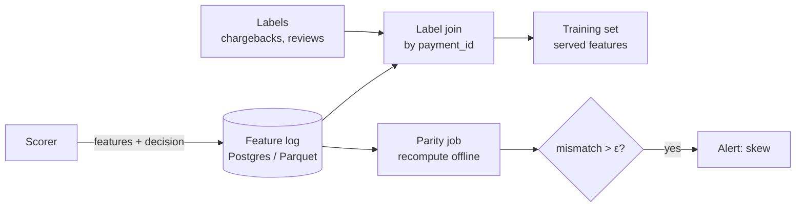

# 🕰️ 03 - Point-in-Time Correctness and Train-Serve Skew

The most dangerous model in production is the one that scored 0.98 PR-AUC offline. Very often that number was earned by a feature that, in training, quietly knew something from the future — a 30-day average computed *after* the payment, a chargeback count that included the very chargeback being predicted. Online, the future isn't available, the feature behaves differently, and the model's real performance is a fraction of what the notebook promised. Point-in-time correctness is the discipline that makes offline numbers mean something.

## 🎯 Learning Objectives
- Classify the forms of **train/serve skew**: definition, time-travel leakage, freshness, defaults, and transformation skew
- Build training sets with **point-in-time (as-of) joins** that only use information available at prediction time
- Model the **freshness delay** of online features and reproduce it offline
- Use **feature logging** ("train on what you served") as the strongest defense against skew
- Detect skew in production with **distribution metrics (PSI)** and **per-row parity checks**
- Apply these practices to P1's profile and velocity features

## Introduction

An ML model learns the relationship between a feature vector $x$ and a label $y$ from historical pairs $(x_i, y_i)$. The silent assumption is that, in production, $x$ will be computed **the same way and with the same information** as in training. Train/serve skew is any violation of that assumption, and it is different from **drift**: drift means the world changed; skew means *we* computed something different. Drift is unavoidable and monitored; skew is a bug and should be eliminated.

Online feature stores make skew both more likely and more detectable. More likely, because online and offline features are often produced by different systems (a streaming job and a SQL query). More detectable, because a well-designed online store can **log exactly what the model saw** and compare it with what training assumed.

The previous notes covered *how* features are stored ([[01 - Feature Data Modeling in Redis|data modeling]]); this one covers *which values* are correct to store, train on, and serve.

---

## 1. The Problem and Why This Solution Exists

### Five ways to train on something you will never serve

| Skew type | What happens | Example in fraud |
|---|---|---|
| **Definition skew** | Offline and online code compute the feature differently | Pandas `rolling('10min')` (right-closed) vs Flink `OVER` (includes current row) |
| **Time-travel leakage** | Training joins feature values from *after* the prediction time | Training uses today's `avg_amount_30d` snapshot for a payment from 3 weeks ago |
| **Freshness skew** | Online values lag reality by a delay that training ignored | Profile builder runs nightly, but training computes the profile exactly at payment time |
| **Default skew** | Missing values handled differently | Offline new users get `NaN` (XGBoost's missing branch); online they get `0` |
| **Transformation skew** | Encoders/scalers fit on different data or versions | Target-encoded `mcc` uses a newer mapping online |

Each is invisible in offline evaluation, which is computed on the training-side definition.

### Why it happens structurally

Training pipelines are written by people exploring data in batch, with the full table available; serving pipelines are written by people optimizing latency with only the present available. Without an explicit contract and tests, they diverge — the same root cause as the Lambda architecture's two codepaths ([[../../10 - Cloud, Infra y Backend/46 - Apache Flink for Real-time ML/01 - Stream Processing Model and Flink Architecture|stream processing model]]).

---

## 2. Conceptual Deep Dive

### 2.1 The point-in-time rule

For a prediction made at time $t_i$ for entity $u_i$, every feature must be computable from events observed **strictly before or at** $t_i$:

$$
x_i = f\big(\{\, e : \text{entity}(e) = u_i,\; t_e \le t_i \,\}\big)
$$

For **snapshot features** (precomputed tables with a timestamp, like a daily profile), the rule becomes an **as-of join**: use the most recent snapshot whose timestamp is $\le t_i$, and optionally not older than a TTL:

$$
x_i = s_{u_i}(\tau^*), \qquad \tau^* = \max\{\, \tau : \tau \le t_i,\; t_i - \tau \le \text{TTL} \,\}
$$

This is exactly what `pandas.merge_asof`, Spark/Flink temporal joins, and Feast's `get_historical_features` implement.

### 2.2 Freshness-aware training

Online, a feature is not available at $t_i$ but at $t_i$ minus some delay $\delta$ — the time it takes the pipeline to produce it. Nightly profiles have $\delta$ up to 24 h; streaming velocity features have $\delta$ of milliseconds to seconds. The online value is really:

$$
x^{\text{online}}_i = f\big(\{\, e : t_e \le t_i - \delta \,\}\big)
$$

If training uses $\delta = 0$, the model learns from fresher information than it will ever get. The fix is to **simulate the serving delay** offline: join snapshots as of $t_i - \delta_{\text{serving}}$ (e.g., "the profile built at the last midnight before the payment"), not as of $t_i$.

⚠️ **Warning:** P1's velocity features *include the current payment* (ADR-1 in the plan: enriched events). The offline definition must include it too — `closed="both"` in pandas. P1's profile features are built in batch, so training must use the profile **as of the last build before the payment**, never a profile computed exactly at payment time.

### 2.3 Feature logging: train on what you served

The strongest defense is to stop recomputing serving features for training at all: **log the exact feature vector** used for each prediction, keyed by the prediction ID, and later join it with the label when it arrives. Google's *Rules of ML* (Zinkevich) states it directly in Rule #29: the best way to train like you serve is to save the set of features used at serving time and use them for training.

$$
\mathcal{D}_{\text{train}} = \{\, (x^{\text{served}}_i,\; y_i) \,\}
\quad\Rightarrow\quad
\text{skew} = 0 \text{ by construction}
$$

Costs: storage for every logged vector, a label-join pipeline, and a warm-up period before enough logged data exists (bootstrapping still needs point-in-time joins). Most mature platforms combine both: point-in-time joins for the first model, feature logging for every retrain after.

### 2.4 Detecting skew in production

**Distribution comparison.** For each feature, compare the distribution served online in a window against the training distribution using the **Population Stability Index**, over bins $b$ with proportions $p_b$ (training) and $q_b$ (serving):

$$
\text{PSI} = \sum_b (q_b - p_b)\,\ln\frac{q_b}{p_b}
$$

Rules of thumb: < 0.1 stable, 0.1–0.25 moderate shift, > 0.25 significant. PSI flags both drift and skew; to tell them apart, look at **when** it jumped (a deploy → skew; gradual → drift).

**Per-row parity.** For a sample of served predictions, recompute features offline with the training code as of the logged timestamp and compare value by value. Any systematic difference is skew, not drift. This is the production version of the parity test from the [[../../10 - Cloud, Infra y Backend/46 - Apache Flink for Real-time ML/07 - Capstone - Kafka to Flink to Redis Feature Pipeline|Flink capstone]].



---

## 3. Production Reality

### How P1 applies all of this

| Defense | P1 implementation |
|---|---|
| One definition | `fraudcore/features.py` used by training, scorer, and API; Flink SQL mirrors it and a parity test enforces it |
| Point-in-time profiles | Profile Builder snapshots carry `built_at`; training joins `as-of payment_time − serving delay` |
| Freshness-aware velocity | Offline velocity includes the current event, matching the enriched-event design |
| Defaults | New-user defaults defined once in `fraudcore` and used in training |
| Feature logging | The auditor stores the scored feature vector with each decision; `v_feedback_dataset` retrains on served features |
| Detection | PSI per feature in Grafana (D4) + weekly parity job |

### Labels have their own time

Fraud labels arrive **late** (chargebacks take days or weeks). Two consequences: recent predictions have no label yet (don't treat "no label" as "legitimate"), and evaluation windows must end early enough that labels have matured. A model evaluated on last week's data with immature labels looks better than it is.

Caso real: a widely repeated failure pattern in fraud and credit teams is a "days since last chargeback" feature computed from a table that, at training time, already contained the chargeback for the transaction being predicted. Offline AUC jumps; online the feature is almost always "no chargeback yet", and the model underperforms the old rules. Point-in-time joins (and excluding the target event's own consequences) remove the leak.

Caso real: Uber's Michelangelo platform team described feature consistency between training and serving as one of the main motivations for a shared feature store — features defined once and served to both paths — rather than each team re-implementing online versions of their offline features.

---

## 4. Code in Practice

### Point-in-time join with a serving delay

```python
import pandas as pd

payments = pd.DataFrame({
    "payment_id": ["p1", "p2", "p3"], "user_id": ["u1", "u1", "u2"],
    "ts": pd.to_datetime(["2026-09-10 10:00", "2026-09-20 09:00", "2026-09-20 12:00"]),
})
profiles = pd.DataFrame({        # nightly snapshots: built_at is when the value became available online
    "user_id": ["u1", "u1", "u1", "u2"],
    "built_at": pd.to_datetime(["2026-09-01", "2026-09-15", "2026-09-25", "2026-09-19"]),
    "avg_amount_30d": [30.0, 45.0, 90.0, 12.0],
})

train = pd.merge_asof(
    payments.sort_values("ts"), profiles.sort_values("built_at"),
    left_on="ts", right_on="built_at", by="user_id",
    direction="backward",                      # only snapshots available BEFORE the payment
    tolerance=pd.Timedelta(days=7),            # stale beyond 7 days → NaN (same default as serving)
)
print(train[["payment_id", "ts", "built_at", "avg_amount_30d"]])
# p1 → Sep 1 is 9 days old → NaN; p2 → Sep 15 snapshot (45.0), never the Sep 25 one; p3 → 12.0
```

### ❌/✅ Joining features for training

```python
# ❌ Time travel: joins the CURRENT profile table to historical payments.
#    p2 (Sep 20) gets avg=90.0 computed on Sep 25 — information from the future.
leaky = payments.merge(profiles.sort_values("built_at").groupby("user_id").tail(1), on="user_id")

# ✅ As-of join with the serving delay and the serving default for stale/missing values
safe = pd.merge_asof(payments.sort_values("ts"), profiles.sort_values("built_at"),
                     left_on="ts", right_on="built_at", by="user_id", direction="backward")
```

### Logging served features

```python
# In the scorer, after deciding (async, off the critical path via the auditor topic)
decision_record = {
    "payment_id": pid, "model_version": model_version, "decision": decision, "score": score,
    "features": dict(zip(FEATURE_ORDER, x_row.tolist())),     # exactly what the model saw
    "features_ts_ns": time.time_ns(),
}
producer.produce("decisions", key=pid, value=orjson.dumps(decision_record))
```

### 📦 Compression code: leakage inflates offline metrics; PSI catches skew online

```python
# 📦 Compression code: time-travel leakage vs point-in-time features, and PSI for skew detection
# Covers: leaky "future" feature, honest as-of feature, metric inflation, PSI
import math
import random

random.seed(5)
rows = []
for i in range(20_000):
    fraud = random.random() < 0.05
    past_cb = random.random() < (0.30 if fraud else 0.05)        # honest: chargebacks known before t
    future_cb = fraud and random.random() < 0.9                   # leak: chargeback of THIS payment
    rows.append((fraud, past_cb, past_cb or future_cb))

def recall_at_flag(idx: int) -> float:
    flagged = [r for r in rows if r[idx]]
    return sum(r[0] for r in flagged) / max(1, sum(r[0] for r in rows))

print(f"recall honest feature = {recall_at_flag(1):.2f} | recall leaky feature = {recall_at_flag(2):.2f}")

def psi(train: list[float], served: list[float], bins: int = 10) -> float:
    lo, hi = min(train), max(train)
    edges = [lo + (hi - lo) * k / bins for k in range(1, bins)]
    def props(xs):
        counts = [0] * bins
        for x in xs:
            counts[sum(x > e for e in edges)] += 1
        return [max(c / len(xs), 1e-6) for c in counts]
    p, q = props(train), props(served)
    return sum((qb - pb) * math.log(qb / pb) for pb, qb in zip(p, q))

train_amt = [random.lognormvariate(3, 1) for _ in range(10_000)]
served_ok = [random.lognormvariate(3, 1) for _ in range(10_000)]
served_bug = [x / 100 for x in served_ok]                      # skew: online amounts in dollars, training in cents
print(f"PSI same pipeline = {psi(train_amt, served_ok):.3f} | PSI unit bug = {psi(train_amt, served_bug):.2f}")
# ¡Sorpresa! The leaky feature "catches" ~90% of fraud offline; online it is never available in time.
```

---

## 🎯 Key Takeaways
- **Skew is a bug** (we computed something different); **drift** is the world changing — monitor drift, eliminate skew.
- Every feature must satisfy the **point-in-time rule**: computable from events at or before prediction time.
- Use **as-of joins** for snapshot features and reproduce the **serving delay** ($t_i - \delta$) offline.
- Velocity features that include the current event online must include it offline too.
- **Feature logging** — train on the vectors you actually served — removes skew by construction (Rules of ML #29).
- Detect skew with **PSI** (when it jumps at a deploy) and **per-row parity** on sampled predictions.
- Respect **label maturity**: late labels make recent evaluation windows look better than reality.

## References
- Martin Zinkevich, *Rules of Machine Learning: Best Practices for ML Engineering* (Google) — Rules #29–#32 on training-serving skew
- Sculley et al., *Hidden Technical Debt in Machine Learning Systems* (NeurIPS 2015)
- Hermann & Del Balso, *Meet Michelangelo* (Uber Engineering, 2017)
- Feast documentation — point-in-time joins (`get_historical_features`), feature logging
- pandas documentation — `merge_asof`
- [[02 - Redis Streams vs Kafka|Previous: Redis Streams vs Kafka]] · [[04 - Latency Budgets for Online Serving|Next: Latency Budgets]]
