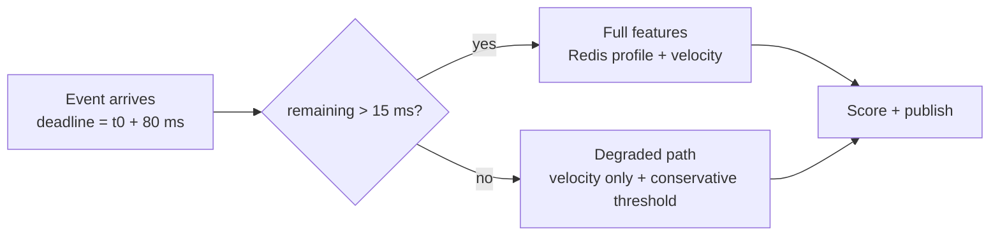

# ⏲️ 04 - Latency Budgets for Online Serving

"p95 ≤ 80 ms" is a promise about the whole path — generator to Kafka to Flink to Kafka to scorer to Redis and back to Kafka. No single team owns it, every hop eats part of it, and percentiles don't add the way intuition says. A **latency budget** turns the promise into per-segment allowances that each component can be designed, measured, and alerted against — and it is the tool that tells you, before you write code, whether 80 ms is even possible.

## 🎯 Learning Objectives
- Decompose an end-to-end SLO into **segment budgets** with explicit headroom
- Explain why **percentiles don't add** and how to combine segment latencies correctly
- Quantify **tail amplification** under fan-out (*The Tail at Scale*)
- Size **micro-batches** with the wait-vs-cost trade-off
- Use **timeouts, deadline propagation, hedging, and degraded modes** to protect the tail
- Build and defend the P1 (80 ms) and P2 (300 ms) budgets

## Introduction

Latency engineering for ML serving is mostly about the **tail**. Average latency is easy to make good; the 95th and 99th percentiles are where garbage-collection pauses, cache misses, network retransmits, batch boundaries, and queueing near saturation live. Because a high-volume system serves millions of requests, its p99 is not an edge case — it is thousands of customers per hour.

A budget is a contract and a design tool at once. As a contract, it assigns each segment a target ("Redis: ≤ 2 ms at p99") that its owner can monitor. As a design tool, it forces early arithmetic: if a micro-batch engine averages half a second per event, no amount of tuning elsewhere will meet 80 ms — the engine choice is decided by the budget ([[../../10 - Cloud, Infra y Backend/47 - Stream Processing Engines Compared/01 - Execution Models|execution models]]).

This note closes the Redis course by placing the online store inside the full serving path: it is one of the cheapest segments — **if** it is accessed with one pipelined round-trip per batch and guarded by a strict timeout.

---

## 1. The Problem and Why This Solution Exists

### Why "every part is fast" isn't enough

Suppose six segments each have a p99 of 20 ms. It is tempting to conclude the path's p99 is around 20 ms — or, pessimistically, 120 ms. Neither is right in general: the answer depends on how segment latencies are correlated, and with fan-out the tail gets *worse* than any single segment.

Dean and Barroso's *The Tail at Scale* (CACM 2013) made the point with fan-out: if a request must wait for $n$ independent components, and each is slow (beyond its p99) with probability $0.01$, the probability the request is slow is:

$$
P(\text{request slow}) = 1 - (1 - 0.01)^{n}
\qquad
n = 100 \Rightarrow 63\%
$$

A component's "rare" tail becomes the system's common case.

### The averaging trap

A mean latency of 25 ms is compatible with 5% of requests taking 400 ms. SLOs, budgets, and alerts must be expressed in **percentiles** (or as the fraction of requests under a threshold), measured with histograms — never with averages ([[../40 - Real-time ML Systems/02 - Online Inference and Event-Driven ML - Sub-50ms Predictions|online inference]]).

---

## 2. Conceptual Deep Dive

### 2.1 Combining segment latencies

End-to-end latency is the sum of segment latencies along the path: $L = \sum_k L_k$. For percentiles:

$$
q_{0.95}\!\left(\sum_k L_k\right) \;\le\; \sum_k q_{0.95}(L_k) \quad\text{(when segments' slow moments coincide — the conservative case)}
$$

For **independent** segments, the sum's p95 is usually much **smaller** than the sum of p95s, because it is unlikely that every segment is slow at once. For **correlated** segments (a GC pause or CPU contention that slows several services on the same laptop simultaneously), the sum of p95s is a realistic estimate. On a single shared machine, correlation is high — so P1 budgets with **sums of segment p95s** and keeps headroom.

### 2.2 Building a budget

1. Start from the SLO: p95 ≤ 80 ms.
2. Reserve **headroom** (25–40%) for variance, growth, and things you didn't model.
3. Allocate the rest to segments in proportion to their irreducible cost.
4. Give each segment a **p95 and p99 target**, a metric, and an owner.

**P1 budget (p95 targets, sum-of-p95s, single laptop):**

| Segment | Driver of cost | Budget p95 |
|---|---|---|
| Generator → Kafka append | Producer `linger.ms`, broker write | 3 ms |
| Kafka → Flink operator | Fetch, deserialize | 3 ms |
| Flink OVER window + state | RocksDB access, network buffer (timeout 5 ms) | 12 ms |
| Flink → Kafka (`payments-enriched`) | Sink buffer, broker append | 4 ms |
| Kafka → scorer | Poll; **micro-batch wait ≤ 5 ms** | 7 ms |
| Redis profile read | One pipelined round-trip per batch | 2 ms |
| Feature assembly + ONNX inference | Batch inference on CPU | 4 ms |
| Scorer → Kafka (`decisions`) | Produce + flush | 5 ms |
| **Allocated** | | **40 ms** |
| **Headroom** | Contention, GC, growth | **40 ms** |

The table says something important before any code exists: the budget is **feasible only with a per-event engine** (Flink's segment ≈ 12 ms) and **only with pipelined Redis reads** (sequential reads for a 200-event batch would take ~80 ms alone — [[01 - Feature Data Modeling in Redis|note 01]]).

**P2 budget (p95 ≤ 300 ms, System 1 path):** Redpanda in 5 ms · Python dataflow + dedupe 10 ms · micro-batch wait ≤ 20 ms · Laya ONNX int8 on CPU, batch of 16: 120 ms · policy 1 ms · Redpanda out 5 ms → 161 ms allocated, ~140 ms headroom. The model dominates; the engine is not the bottleneck.

### 2.3 Micro-batching: wait vs efficiency

A component that batches waits up to $\tau$ for up to $k$ items, then processes the batch in time $o + c\,k$. For an item arriving at rate $\lambda$ into a batch:

$$
L_{\text{item}} \lesssim \underbrace{\min\!\left(\tau,\; \frac{k}{\lambda}\right)}_{\text{wait for batch}} + \underbrace{o + c\,k}_{\text{batch processing}}
$$

At **low** traffic, the timeout $\tau$ dominates — batching adds latency without much efficiency. At **high** traffic, batches fill quickly ($k/\lambda$ small) and the per-batch overhead $o$ is amortized. Good defaults cap both: "up to 500 messages **or** 5 ms". Tune with load steps, not a single rate.

### 2.4 Protecting the tail

| Technique | What it does | Where in P1/P2 |
|---|---|---|
| **Timeouts** | Bound a dependency's worst case | Redis read timeout 5 ms → degraded features (P1 F3/F4) |
| **Deadline propagation** | Each hop knows the remaining budget and skips optional work | Scorer skips non-essential enrichment if the event is already late |
| **Hedged requests** | Send a backup request after the p95 delay; use the first answer | Read replicas for features (production; not needed on a laptop) |
| **Degraded modes** | Return a safe, cheaper answer instead of a late perfect one | Conservative thresholds when profiles are unavailable |
| **Load shedding** | Drop optional work under overload | Pause explainer and shadow scoring first (P1 §7.4) |
| **Headroom** | Keep utilization ≤ 60–70% | Capacity planning ([[../../10 - Cloud, Infra y Backend/47 - Stream Processing Engines Compared/01 - Execution Models|queueing knee]]) |



---

## 3. Production Reality

### Measure every segment, not just the total

A budget without per-segment measurement is a wish. P1 stamps each event at each hop (`t_scheduled`, broker `LogAppendTime`, `t_flink_out`, `t_received`, `t_decided`) and exports a histogram per segment; Grafana's breakdown dashboard shows which segment ate the budget in any minute. When the SLO burns, you look at the segment whose p95 moved — not at the whole system.

### Redis-specific tail risks

- **Slow commands** block the single command thread: avoid `KEYS`, large `HGETALL`, big Lua scripts on the hot path; check `SLOWLOG GET`.
- **Fork for persistence** (RDB/AOF rewrite) can stall large instances; for rebuildable features, persistence off or replicas only.
- **Connection storms** after a deploy: pool connections, don't create them per request.
- **Client timeouts:** set `socket_timeout` to the budget (e.g., 5 ms) so a stuck Redis turns into a degraded decision, not a stalled scorer.

Caso real: Google's *The Tail at Scale* describes techniques — hedged and tied requests, micro-partitioning, selective replication — that large search and serving systems use precisely because component tails compound across fan-out. Online ML serving inherits the problem every time a prediction fans out to several feature stores or models.

Caso real: in P1, an early design read Redis once per payment. At 5,000 ev/s with a 0.2 ms RTT, that is a full second of round-trips per second per scorer process — the budget's Redis line alone would have been blown, and the scorer would have saturated. Pipelining per micro-batch turned the Redis segment into ~1 RTT per batch.

---

## 4. Code in Practice

### Deadline-aware scoring step

```python
import time
import redis

r = redis.Redis(host="redis", socket_timeout=0.005, socket_connect_timeout=0.05)  # 5 ms read budget
SLO_NS = 80_000_000

def score_batch(events: list[dict]):
    now = time.time_ns()
    late = [e for e in events if now - e["t_scheduled_ns"] > SLO_NS - 15_000_000]   # < 15 ms left
    on_time = [e for e in events if e not in late]
    profiles = {}
    try:
        pipe = r.pipeline(transaction=False)
        for e in on_time:
            pipe.hmget(f"profile:v1:{{{e['user_id']}}}", PROFILE_FIELDS)
        profiles = dict(zip((e["payment_id"] for e in on_time), pipe.execute()))
    except redis.TimeoutError:
        late, on_time = late + on_time, []          # dependency too slow → degraded path for all
    decisions = [full_decision(e, profiles[e["payment_id"]]) for e in on_time]
    decisions += [degraded_decision(e) for e in late]   # velocity-only features, conservative thresholds
    return decisions
```

⚠️ **Warning:** a degraded decision is still a decision with business impact. The degraded policy (e.g., high amounts → REVIEW, never auto-APPROVE) must be designed with the business, and tagged (`degraded=true`) so it can be monitored and audited.

### ❌/✅ Expressing the SLO

```yaml
# ❌ Average-based alert: hides a 5% tail of 400 ms requests
expr: avg(rate(fraud_e2e_latency_seconds_sum[5m]) / rate(fraud_e2e_latency_seconds_count[5m])) > 0.08

# ✅ Ratio-based SLI: fraction of decisions under 80 ms (buckets must include 0.08)
expr: |
  sum(rate(fraud_e2e_latency_seconds_bucket{le="0.08"}[5m]))
  / sum(rate(fraud_e2e_latency_seconds_count[5m])) < 0.95
```

### 📦 Compression code: percentiles don't add, tails compound, batches wait

```python
# 📦 Compression code: budget arithmetic you can trust
# Covers: p95 of a sum vs sum of p95s (independent vs correlated), fan-out amplification, batch wait
import random
import statistics

random.seed(9)
p95 = lambda xs: statistics.quantiles(xs, n=100)[94]
segments = [(2, 1), (2, 1), (8, 4), (3, 1), (4, 2), (1, 0.5), (3, 1), (3, 1)]  # (mean, jitter) ms

def path(correlated: bool) -> float:
    shared = random.gauss(0, 1)                                    # one shared shock (GC, CPU contention)
    return sum(m + j * (shared if correlated else random.gauss(0, 1)) for m, j in segments)

indep = [path(False) for _ in range(50_000)]
corr = [path(True) for _ in range(50_000)]
seg_p95_sum = sum(m + 1.645 * j for m, j in segments)
print(f"sum of segment p95s = {seg_p95_sum:.1f} ms | p95 independent = {p95(indep):.1f} ms | "
      f"p95 correlated = {p95(corr):.1f} ms")

for n in (1, 10, 100):
    print(f"fan-out n={n:>3}: P(request beyond a component p99) = {1 - 0.99**n:.0%}")

for lam in (500, 5_000, 50_000):                                   # events/s into a batching scorer
    wait = min(0.005, 500 / lam)                                  # up to 500 msgs or 5 ms
    print(f"λ={lam:>6}/s → batch wait ≤ {wait*1000:.1f} ms, batch size ≈ {min(500, lam*0.005):.0f}")
# ¡Sorpresa! Shared contention (one laptop) makes the path's tail behave like the SUM of tails — budget for it.
```

---

## 🎯 Key Takeaways
- A **latency budget** splits the SLO into per-segment p95/p99 targets with explicit **headroom** (25–40%).
- Percentiles **don't add**: independent segments sum to less than $\sum p95$; correlated ones (shared machine) approach it.
- **Fan-out amplifies tails**: $1 - (1-p)^n$ of requests hit some component's tail.
- Micro-batching costs up to $\min(\tau, k/\lambda)$ of waiting — cap both size and wait, tune across load steps.
- Protect the tail with **timeouts, deadline propagation, degraded modes, load shedding, and headroom**.
- Express SLOs as **ratios under a threshold** from histograms, never averages.
- The budget decides architecture early: P1's 80 ms requires a per-event engine and pipelined Redis reads.

## References
- Dean & Barroso, *The Tail at Scale* (Communications of the ACM, 2013)
- Beyer et al., *Site Reliability Engineering* (O'Reilly, 2016) — SLIs, SLOs, error budgets
- Redis documentation — latency monitoring, `SLOWLOG`, persistence and forking, client timeouts
- [[03 - Point-in-Time Correctness and Train-Serve Skew|Previous: Point-in-Time Correctness]] · [[00 - Welcome to Real-time Feature Serving with Redis|Course welcome]]
- Next course: [[../44 - High-Performance Model Serving - Triton and ONNX Runtime/00 - Welcome to High-Performance Model Serving|High-Performance Model Serving — Triton and ONNX Runtime]]
