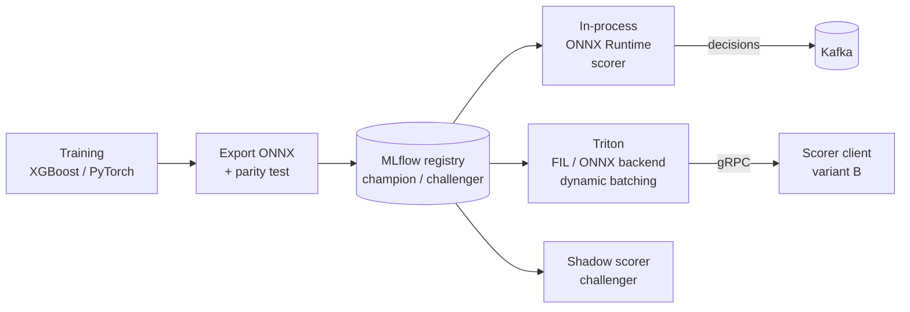

# 🚀 Welcome — High-Performance Model Serving: Triton and ONNX Runtime

A fraud model that takes 4 ms to score one payment in a notebook can take 400 µs per payment in production — or 40 ms — depending entirely on how it is served: which runtime executes the graph, whether requests are batched, whether the model lives in your process or behind a network hop, and how new versions are rolled out without risk. This course is about those choices for **classical and small neural models** — the XGBoost scorers, MLP challengers, and encoders that make most real-time ML decisions.

## 🎯 Learning Objectives
- Export tabular and small neural models to **ONNX** and serve them with **ONNX Runtime** — and prove numerical parity
- Understand **Triton Inference Server**: model repository, backends (ONNX, FIL for tree models, Python), dynamic batching, instance groups
- Build **ensembles** inside Triton and measure them seriously with **perf_analyzer**
- Roll out models safely with **shadow mode** and **champion/challenger** promotion
- Choose between **in-process ONNX, Triton, TorchServe, BentoML, and vLLM** with a latency/operability argument

## Introduction

Model serving has two layers that are often confused. The **runtime** executes the model's computation graph efficiently on a given device — ONNX Runtime, TensorRT, PyTorch, XGBoost's own predictor. The **server** wraps one or more runtimes with networking, batching, versioning, concurrency, and metrics — Triton, TorchServe, BentoML, vLLM. You can use a runtime **without** a server (in-process inference), and for latency-critical paths with small models that is often the fastest option.

The portfolio project P1 makes this concrete. Its champion is an XGBoost model exported to ONNX and run **in-process** inside the scorer, because a network hop to a model server costs more than the inference itself. Its **variant B** serves the same model through **Triton** (FIL or ONNX backend) to measure exactly what dynamic batching and isolation buy, and at what latency cost. Its PyTorch MLP **challenger** runs in **shadow mode** until the evidence justifies promotion.

The existing vault courses cover adjacent servers in depth — [[../30 - TorchServe/00 - Welcome to TorchServe|TorchServe]], [[../42 - BentoML Production Model Serving/00 - Welcome - BentoML Production Model Serving|BentoML]], [[../../06 - Large Language Models/20 - vLLM Production Serving/00 - Bienvenida|vLLM]] — and [[../../10 - Cloud, Infra y Backend/29 - Distributed ML Infrastructure/03 - NVIDIA Triton|NVIDIA Triton]] gives a first overview. This course goes deeper on the decisions that matter for real-time scoring and ends with a comparison across all of them.

---

## Course Map

| #  | Note                                           | Core question                                                            |
|----|------------------------------------------------|--------------------------------------------------------------------------|
| 01 | ONNX Runtime for Tabular Models                | How do I export XGBoost/MLPs to ONNX, prove parity, and make them fast?  |
| 02 | Triton Deep Dive                               | What does a model server add — and what does it cost per request?        |
| 03 | Triton Ensembles and perf_analyzer             | How do I compose pipelines in the server and measure them properly?      |
| 04 | Shadow Mode and Champion-Challenger            | How do I evaluate a new model on live traffic without risk?              |
| 05 | Choosing a Serving Stack                       | In-process, Triton, TorchServe, BentoML, or vLLM — when and why?         |

## Prerequisites
- Model serving patterns ([[../20 - Deployment y Serving/02 - Model Serving Patterns|Model Serving Patterns]])
- MLflow tracking and registry ([[../18 - Experiment Tracking y Model Registry/01 - MLflow y Tracking de Experimentos|MLflow]])
- Latency budgets ([[../43 - Real-time Feature Serving with Redis/04 - Latency Budgets for Online Serving|Latency Budgets for Online Serving]])

⚠️ **Version note:** in 2025 NVIDIA folded Triton Inference Server into its **Dynamo** inference platform branding (Dynamo targets distributed LLM serving; Triton remains the general-purpose multi-framework server). Container tags follow the `YY.MM` scheme (e.g., `nvcr.io/nvidia/tritonserver:<YY.MM>-py3`). Pin a tag and read its release notes — backends and supported framework versions change monthly.

## References
- ONNX — https://onnx.ai · ONNX Runtime documentation — https://onnxruntime.ai/docs/
- NVIDIA Triton Inference Server documentation and GitHub (`triton-inference-server/server`)
- Crankshaw et al., *Clipper: A Low-Latency Online Prediction Serving System* (NSDI 2017)
