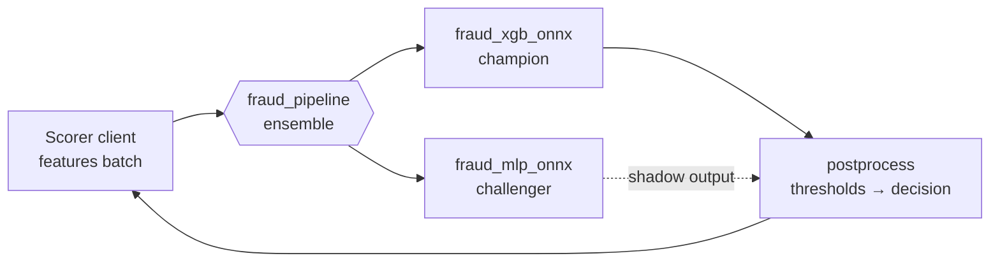

# 🧩 03 - Triton Ensembles and perf_analyzer

A model is rarely the whole inference path: raw inputs need feature derivation, scores need thresholds, and some requests should fan out to a second model. Triton can run that whole pipeline **inside the server** — and it ships the tool to measure it properly. Both are easy to misuse: an ensemble can quietly fork your feature logic away from training, and a benchmark run in the wrong mode can report a p99 that no real user ever saw.

## 🎯 Learning Objectives
- Build **ensemble models** that chain pre-processing, inference, and post-processing inside Triton
- Use **Business Logic Scripting (BLS)** for conditional or multi-model flows
- Understand the **skew risk** of moving feature logic into the server, and how to avoid it
- Run **perf_analyzer** in **concurrency** (closed-loop) and **request-rate** (open-loop) modes and read its breakdown
- Convert between concurrency, throughput, and latency with **Little's law**
- Use **Model Analyzer** to search configurations under a latency constraint

## Introduction

Triton's ensemble scheduler connects models into a directed graph whose intermediate tensors never leave the server: the client sends raw inputs once and receives the final output once. For pipelines with several stages, this removes client↔server round-trips that would otherwise dominate latency. When the flow needs conditions ("only run the challenger if the champion is uncertain") or loops, the Python backend's **BLS** API lets one model call others programmatically.

Measuring a server is its own discipline. `perf_analyzer` generates load against any Triton model (ensembles included) and reports throughput, latency percentiles, and a server-side breakdown of where time went. Its two load modes correspond exactly to the closed-loop vs open-loop distinction behind **coordinated omission** — the measurement error the P1 benchmark protocol is built to avoid ([[../43 - Real-time Feature Serving with Redis/04 - Latency Budgets for Online Serving|latency budgets]]).

---

## 1. The Problem and Why This Solution Exists

### Client-side orchestration is slow

A three-stage pipeline orchestrated by the client costs three round-trips and three serializations:

$$
L_{\text{client-orch}} = \sum_{s=1}^{3} \big(L_{\text{net}} + L_{\text{serde}} + L_{s}\big)
\qquad
L_{\text{ensemble}} = L_{\text{net}} + L_{\text{serde}} + \sum_{s=1}^{3} L_{s} + \epsilon_{\text{in-server}}
$$

where $\epsilon_{\text{in-server}}$ is the cost of passing tensors between backends (memory copies, no network).

### Benchmarks that lie

A load generator that waits for each response before sending the next (closed loop) cannot send requests while the server is stalled — so the stall barely appears in its latency distribution. Real clients don't wait for each other. A benchmark must state which model of load it uses.

---

## 2. Conceptual Deep Dive

### 2.1 Ensembles

An ensemble is a model whose `config.pbtxt` has `platform: "ensemble"` and an `ensemble_scheduling` block listing steps. Each step names a model and maps ensemble tensors to that model's inputs and outputs.


*Figure: an ensemble wiring pre-processing, models, and post-processing through named tensors. Source: Triton Inference Server documentation.*

Steps run as soon as their inputs are ready, so independent branches execute **in parallel** — e.g., champion and challenger scoring the same features concurrently, with the post-processor taking only the champion's output for the decision.

### 2.2 BLS for conditional flows

Ensembles are static DAGs. With the Python backend, a model's `execute()` can build `pb_utils.InferenceRequest` objects and call other models in the repository, with arbitrary control flow:

```python
# Inside a Python-backend model.py (BLS) — call the challenger only for uncertain cases
champion = pb_utils.InferenceRequest(model_name="fraud_xgb_onnx", requested_output_names=["probabilities"],
                                     inputs=[features]).exec()
p = pb_utils.get_output_tensor_by_name(champion, "probabilities").as_numpy()[:, 1]
if ((p > 0.3) & (p < 0.7)).any():
    challenger = pb_utils.InferenceRequest(model_name="fraud_mlp_onnx", requested_output_names=["p_fraud"],
                                           inputs=[features]).exec()
```

BLS is flexible but runs Python per request inside the server — keep it thin.

### 2.3 The skew trap

Moving pre-processing into a Triton Python model is attractive ("clients just send raw JSON"). But if that code is a *re-implementation* of the training feature logic, you have rebuilt train/serve skew inside the server ([[../43 - Real-time Feature Serving with Redis/03 - Point-in-Time Correctness and Train-Serve Skew|point-in-time correctness]]). Two safe options:

- Import the **same package** (`fraudcore`) in the Python backend that training uses, pinned to the same version, and run the parity test against the ensemble.
- Export pre-processing **into the ONNX graph** (skl2onnx pipelines, normalization inside PyTorch modules), so there is no separate code path at all.

### 2.4 perf_analyzer's two load modes

| Mode | Flag | Load model | Answers |
|---|---|---|---|
| **Concurrency** | `--concurrency-range 1:16:2` | **Closed loop**: keeps $N$ requests outstanding; sends the next only when one completes | "How much throughput at $N$ in flight, and what latency?" — capacity planning |
| **Request rate** | `--request-rate-range 100:2000:100` (or `--request-intervals`) | **Open loop**: sends at a fixed schedule regardless of responses | "What latency do users see at this arrival rate?" — SLO validation |

The two are related by **Little's law** for a stable system:

$$
N = \lambda \cdot W
\qquad\Longrightarrow\qquad
W = \frac{N}{\lambda}
$$

At concurrency $N = 8$ and measured throughput $\lambda = 4{,}000$ inf/s, the mean latency is 2 ms. But closed-loop percentiles **understate the tail** under stalls: while the server is stuck, at most $N$ requests experience the stall, instead of every request that would have arrived during it. Validate SLOs in request-rate mode.

### 2.5 Reading the output

perf_analyzer reports, per load level: throughput, client-side latency percentiles (p50/p90/p95/p99), and an average **server-side breakdown**: queue, compute input, compute infer, compute output — plus client send/receive time. A typical diagnosis:

| Observation | Meaning | Action |
|---|---|---|
| Queue time grows with load, compute flat | Not enough instances | Increase `instance_group.count` |
| Compute infer dominates | Model itself is the cost | Optimize model / quantize / GPU |
| Client send/recv large | Big tensors over the network | System or CUDA shared memory |
| p99 ≫ p95 at moderate load | Stalls (GC, batching delay, noisy neighbor) | Request-rate mode; inspect `max_queue_delay` |

### 2.6 Model Analyzer

Model Analyzer automates sweeps over **instance counts, max batch sizes, and dynamic batching settings**, runs perf_analyzer for each, and reports the configurations that maximize throughput **subject to a latency constraint** (e.g., p99 ≤ 10 ms). It is the server-level counterpart of the P1 experiment matrix.

---

## 3. Production Reality

### Measuring like you mean it

- Warm up before measuring (first requests load models and allocate memory).
- Use perf_analyzer's **stability** controls (`--measurement-interval`, `--stability-percentage`) so each data point represents a steady state.
- Record server version, backend versions, model config, and hardware with every result — the same manifest discipline as P1's benchmark.
- For SLOs, report **request-rate** results; for sizing, use **concurrency** sweeps.
- Generate inputs that resemble production (`--input-data` JSON with real feature vectors), not zeros.

### P1 variant B with an ensemble



The ensemble runs champion and challenger in parallel in one request and returns the decision plus the shadow score. It is an alternative to P1's separate shadow consumer group — compared in [[04 - Shadow Mode and Champion-Challenger|note 04]] — with the trade-off that the shadow model now shares the request's latency and failure domain.

Caso real: teams that move from client-orchestrated multi-model pipelines (detector → classifier → re-ranker, each a separate HTTP call) to in-server ensembles typically report the network and serialization overhead disappearing from the latency breakdown, leaving model compute as the dominant cost — at which point GPU batching and quantization become the effective levers.

---

## 4. Code in Practice

### Ensemble configuration

```protobuf
name: "fraud_pipeline"
platform: "ensemble"
max_batch_size: 512
input  [{ name: "FEATURES", data_type: TYPE_FP32, dims: [ 12 ] }]
output [{ name: "DECISION", data_type: TYPE_INT32, dims: [ 1 ] },
        { name: "SHADOW_P", data_type: TYPE_FP32,  dims: [ 1 ] }]
ensemble_scheduling {
  step [
    { model_name: "fraud_xgb_onnx", model_version: -1,
      input_map  { key: "input"         value: "FEATURES" }
      output_map { key: "probabilities" value: "champion_probs" } },
    { model_name: "fraud_mlp_onnx", model_version: -1,
      input_map  { key: "input"  value: "FEATURES" }
      output_map { key: "p_fraud" value: "SHADOW_P" } },
    { model_name: "fraud_postprocess", model_version: -1,      # Python backend: thresholds.yaml → decision
      input_map  { key: "PROBS"    value: "champion_probs" }
      output_map { key: "DECISION" value: "DECISION" } }
  ]
}
```

### perf_analyzer: capacity vs SLO

```bash
# Capacity (closed loop): throughput and latency at 1..16 outstanding requests, batch 32
perf_analyzer -m fraud_xgb_onnx -b 32 --concurrency-range 1:16:2 \
  --measurement-interval 5000 --percentile 95 -f results_concurrency.csv

# SLO validation (open loop): fixed arrival rates, real feature vectors
perf_analyzer -m fraud_pipeline --request-rate-range 100:1500:200 \
  --input-data features_sample.json --percentile 95 -f results_rate.csv
```

### Model Analyzer under a latency constraint

```bash
model-analyzer profile --model-repository /models --profile-models fraud_xgb_onnx \
  --latency-budget 10 --run-config-search-max-instance-count 3 \
  --output-model-repository-path /tmp/ma_out
model-analyzer report --report-model-configs fraud_xgb_onnx_config_default,fraud_xgb_onnx_config_2
```

⚠️ **Warning:** perf_analyzer and Model Analyzer flags change across Triton releases; run `--help` for the tag you pinned. Model Analyzer also needs permission to launch Triton (Docker or local mode) — on a laptop, profile **one** model at a time.

### ❌/✅ Benchmark mode for an SLO claim

```bash
# ❌ "p99 = 3 ms" from a concurrency=4 run: a 200 ms stall affected at most 4 requests
perf_analyzer -m fraud_pipeline --concurrency-range 4

# ✅ Open-loop at the expected arrival rate: every request scheduled during a stall waits
perf_analyzer -m fraud_pipeline --request-rate-range 800 --percentile 99
```

### 📦 Compression code: closed loop hides stalls; Little's law links the modes

```python
# 📦 Compression code: coordinated omission in server benchmarks
# Covers: closed-loop vs open-loop latency under a stall, Little's law N = λ·W
import statistics

SERVICE, STALL_AT, STALL_LEN, DURATION = 0.002, 5.0, 0.200, 10.0   # 2 ms service, one 200 ms stall

def service_end(start: float) -> float:
    if STALL_AT <= start < STALL_AT + STALL_LEN:
        start = STALL_AT + STALL_LEN                                 # server frozen during the stall
    return start + SERVICE

def closed_loop(n_clients: int) -> list[float]:
    lat, clocks = [], [0.0] * n_clients
    while min(clocks) < DURATION:
        i = clocks.index(min(clocks))
        end = service_end(clocks[i])
        lat.append(end - clocks[i])
        clocks[i] = end                                              # next request only after the reply
    return lat

def open_loop(rate: float) -> list[float]:
    lat, t, server_free = [], 0.0, 0.0
    while t < DURATION:
        start = max(t, server_free)
        end = service_end(start)
        lat.append(end - t)                                          # measured from the SCHEDULED time
        server_free, t = end, t + 1 / rate
    return lat

p99 = lambda xs: statistics.quantiles(xs, n=100)[98] * 1000
cl = closed_loop(4)
thr = len(cl) / DURATION
print(f"closed loop (N=4): {thr:,.0f} req/s, mean={statistics.mean(cl)*1000:.2f} ms, p99={p99(cl):.1f} ms")
print(f"Little's law check: N/λ = {4 / thr * 1000:.2f} ms ≈ mean latency")
ol = open_loop(rate=400)
print(f"open loop (400 req/s): p99={p99(ol):.1f} ms")
# ¡Sorpresa! Same server, same stall: closed loop reports a tiny p99, open loop shows the users who waited.
```

---

## 🎯 Key Takeaways
- **Ensembles** chain models inside Triton with one client round-trip; independent branches run in parallel.
- **BLS** (Python backend) adds conditional, multi-model logic — powerful, but Python per request.
- Server-side pre-processing must **reuse the training code** or live inside the ONNX graph, or it becomes skew.
- perf_analyzer **concurrency** mode (closed loop) sizes capacity; **request-rate** mode (open loop) validates SLOs.
- **Little's law** $N = \lambda W$ links concurrency, throughput, and latency.
- Read the **queue vs compute** breakdown to decide between more instances and a faster model.
- **Model Analyzer** searches configs under a latency budget — the server-level version of an experiment matrix.

## References
- NVIDIA Triton documentation — Ensemble Models, Python backend (BLS), perf_analyzer, Model Analyzer
- Gil Tene, *How NOT to Measure Latency* — coordinated omission
- John D. C. Little, *A Proof for the Queuing Formula L = λW* (Operations Research, 1961)
- [[02 - Triton Deep Dive|Previous: Triton Deep Dive]] · [[04 - Shadow Mode and Champion-Challenger|Next: Shadow Mode and Champion-Challenger]]
