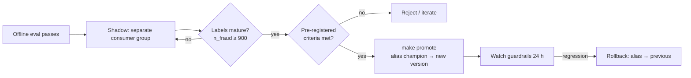

# 🌗 04 - Shadow Mode and Champion-Challenger

A new fraud model beats the old one by 3 points of recall on last month's test set. Should it replace the model that is blocking real payments right now? Offline wins are a hypothesis; production traffic is the experiment. **Shadow mode** runs the challenger on live traffic with zero impact on decisions, and **champion/challenger** turns the comparison into a pre-registered, statistically honest promotion decision — with a one-command rollback.

## 🎯 Learning Objectives
- Place shadow mode in the **progressive delivery ladder**: offline → shadow → canary → A/B → full rollout
- Compare shadow **architectures**: separate consumer group, in-process dual scoring, server ensembles, traffic mirroring
- Evaluate a challenger on live traffic: agreement, **decision-flip matrix**, and label-based metrics
- Test significance with **McNemar's test** and estimate how long a shadow must run (**sample size**)
- Define **pre-registered promotion criteria** and guardrails (latency, errors, score sanity, business cost)
- Implement promotion and rollback with **MLflow aliases** and scorer hot-reload

## Introduction

Offline evaluation answers "is the model better on historical data under our feature definitions?" Production asks harder questions: does it behave on **today's** traffic, with **online** features (including their freshness and defaults), under real latency constraints? Many models that win offline lose online — because of skew ([[../43 - Real-time Feature Serving with Redis/03 - Point-in-Time Correctness and Train-Serve Skew|point-in-time correctness]]), drift, or simply because the test set was not representative.

Shadow mode is the safest way to find out: the challenger receives the same inputs as the champion and produces scores that are **logged but never acted on**. Once labels arrive (in fraud, analyst reviews within hours, chargebacks within weeks), both models can be compared on identical traffic. Only then does the challenger graduate — to a canary, an A/B test, or directly to champion if the shadow evidence is strong and the risk is low.

P1 implements this end to end: an MLP challenger scored in a separate consumer group, an auditor that joins decisions, shadow scores, and labels in Postgres, a Grafana panel comparing the two, and `make promote` that moves an MLflow alias the scorer reloads without restarting.

---

## 1. The Problem and Why This Solution Exists

### The progressive delivery ladder

| Stage | Traffic affected | What it proves | Risk |
|---|---|---|---|
| Offline evaluation | 0% | Better on history under offline features | None, but optimistic |
| **Shadow** | 0% (scores logged only) | Behaves on live traffic and online features; latency and errors OK | Compute cost only |
| Canary | Small % (e.g., 5%) acted on | Real impact on a slice; catches catastrophic failures | Limited exposure |
| A/B test | Randomized split | Causal effect on business metrics | Controlled exposure |
| Full rollout | 100% | — | Rollback must be instant |

Shadow is unique in that it measures **predictive** performance on live data with **no** customer impact. It cannot measure effects that depend on acting (e.g., fraudsters adapting to blocks) — that is what canaries and A/B tests are for.

---

## 2. Conceptual Deep Dive

### 2.1 Shadow architectures

| Architecture | How | Latency impact on champion | Isolation | Notes |
|---|---|---|---|---|
| **Separate consumer group** (P1) | Challenger consumes the same enriched events independently | **None** | Full (own process) | Scores arrive slightly later; joined by `payment_id` |
| In-process dual scoring | Scorer runs both models per batch | Adds challenger's inference time | Shared process | Simple; risky for tight budgets |
| Server ensemble (Triton) | Champion and challenger as parallel ensemble branches | Max of both branches | Shared request | [[03 - Triton Ensembles and perf_analyzer|note 03]] |
| Traffic mirroring | Proxy (Envoy/Istio) copies requests to a shadow service | None for the caller | Full | For HTTP services; responses discarded |

For a p95-critical path, **decouple**: the shadow must never be able to slow or break the champion.

⚠️ **Warning:** shadow mode must use the **same features** as the champion (same enriched events, same profile reads) — otherwise you are comparing pipelines, not models. Log the feature vector or a hash of it with both scores.

### 2.2 What to compare before labels arrive

- **Agreement rate:** fraction of payments where both produce the same decision.
- **Decision-flip matrix:** counts of `champion decision × challenger decision` (APPROVE/REVIEW/BLOCK). Flips into BLOCK are where business risk concentrates.
- **Score distribution sanity:** PSI of the challenger's score vs its offline distribution; a large shift signals skew in the challenger's inputs.
- **Operational guardrails:** challenger latency, error rate, memory.

### 2.3 With labels: paired comparison and McNemar's test

Both models score the **same** payments, so the comparison is **paired**. On labeled fraud cases, count:

| | Challenger catches | Challenger misses |
|---|---|---|
| **Champion catches** | $a$ | $b$ |
| **Champion misses** | $c$ | $d$ |

Only the discordant cells matter. **McNemar's test** checks whether $b$ and $c$ differ more than chance:

$$
\chi^2 = \frac{(|b - c| - 1)^2}{b + c} \sim \chi^2_1
\qquad
p = \operatorname{erfc}\!\left(\sqrt{\chi^2 / 2}\right)
$$

The recall difference is $(c - b)/N_{\text{fraud}}$. The same test applies to false positives on legitimate payments (friction).

### 2.4 How long must the shadow run?

Fraud is rare, so labeled positives accumulate slowly. A rough sample size for detecting a recall improvement from $r_1$ to $r_2$ (unpaired approximation, conservative for paired designs), at significance $\alpha$ and power $1 - \beta$:

$$
n_{\text{fraud}} \approx \frac{(z_{1-\alpha/2} + z_{1-\beta})^2\,\big(r_1(1-r_1) + r_2(1-r_2)\big)}{(r_2 - r_1)^2}
$$

For $r_1 = 0.80$, $r_2 = 0.85$, $\alpha = 0.05$, power 0.8: $n \approx 7.84 \times 0.2875 / 0.0025 \approx 900$ fraud cases. At a 0.8% fraud rate that is ~**113,000 payments** — hours on a busy system, days on a small one, and longer if labels mature slowly. Decide the duration **before** looking at results.

### 2.5 Pre-registered promotion criteria

Write the decision rule before the shadow starts (P1's version):

1. Recall at FPR = 1% improves by ≥ 2 points, McNemar $p < 0.05$, on ≥ 900 labeled fraud cases.
2. False-positive rate on legitimate payments does not increase by more than 0.1 points.
3. Challenger p95 inference latency within the scorer's budget.
4. No error-rate increase; score PSI vs offline < 0.1.
5. Simulated business cost (§ thresholds by cost) not worse.

Pre-registration prevents **p-hacking by waiting** — checking every day and stopping the first time the challenger looks better inflates false promotions.



---

## 3. Production Reality

### Promotion and rollback with MLflow aliases

Services should never load "the latest" model — they load **an alias**. Promotion is moving the `champion` alias to the challenger's version; rollback is moving it back. The scorer polls the alias (or receives a notification), downloads the new artifact, **validates it** (feature order, parity smoke test on a fixed sample), and swaps it atomically between micro-batches. If validation fails, it keeps the current model and alerts — a corrupt artifact must never take down scoring.

### Label delay and proxy labels

Chargebacks can take weeks. Teams use **proxy labels** early (analyst review outcomes, customer confirmations) to get a first read, then confirm with mature labels. Report which label source a comparison used.

### Cost

Shadow doubles inference compute for the shadowed traffic. For a CPU tree model and an MLP that is cheap; for GPU models, shadow a **sample** of traffic (e.g., 20%) — enough to reach the sample size, at a fraction of the cost.

Caso real: shadow deployments are a standard step in large ML platforms (Uber's Michelangelo, for example, described running new models alongside production ones and comparing predictions before switching traffic). The common lesson across platforms is that shadow evaluation catches **integration** failures — missing features, wrong defaults, unit mismatches — that offline evaluation structurally cannot see.

Caso real: in P1's drift demo, a new fraud pattern is injected mid-run; the champion's recall drops on the dashboard while the retrained challenger, running in shadow, catches the new pattern. Promotion only happens after the pre-registered criteria are met on labeled events — then `make promote` moves the alias and the scorer hot-reloads without losing a single event.

---

## 4. Code in Practice

### Promotion with MLflow aliases

```python
from mlflow import MlflowClient

client = MlflowClient()
MODEL = "fraud-scorer"

def promote(version: str):
    current = client.get_model_version_by_alias(MODEL, "champion").version
    client.set_registered_model_alias(MODEL, "previous_champion", current)   # one-command rollback target
    client.set_registered_model_alias(MODEL, "champion", version)

def rollback():
    prev = client.get_model_version_by_alias(MODEL, "previous_champion").version
    client.set_registered_model_alias(MODEL, "champion", prev)
```

### Scorer hot-reload with validation

```python
import threading, time
import numpy as np

class ModelHolder:
    def __init__(self, load_fn, sample_X: np.ndarray, sample_p: np.ndarray):
        self._load, self._X, self._p = load_fn, sample_X, sample_p
        self.version, self.session = None, None
        self._lock = threading.Lock()

    def poll(self, alias: str = "champion", every_s: int = 30):
        while True:
            version, session = self._load(alias)                  # downloads + builds an ORT session
            if version != self.version:
                p = session.run(["probabilities"], {"input": self._X})[0][:, 1]
                if np.abs(p - self._p[version]).max() < 1e-5:      # parity smoke test vs registered outputs
                    with self._lock:
                        self.version, self.session = version, session   # atomic swap between batches
                # else: keep serving the current model and emit an alert
            time.sleep(every_s)
```

### Comparing champion and challenger in Postgres

```sql
-- Decision-flip matrix (no labels needed)
SELECT d.decision AS champion, s.decision AS challenger, COUNT(*)
FROM decisions d JOIN shadow_scores s USING (payment_id)
GROUP BY 1, 2 ORDER BY 1, 2;

-- Paired outcome on labeled fraud: inputs for McNemar
SELECT
  SUM(CASE WHEN d.decision <> 'APPROVE' AND s.decision <> 'APPROVE' THEN 1 ELSE 0 END) AS a,
  SUM(CASE WHEN d.decision <> 'APPROVE' AND s.decision =  'APPROVE' THEN 1 ELSE 0 END) AS b,
  SUM(CASE WHEN d.decision =  'APPROVE' AND s.decision <> 'APPROVE' THEN 1 ELSE 0 END) AS c,
  SUM(CASE WHEN d.decision =  'APPROVE' AND s.decision =  'APPROVE' THEN 1 ELSE 0 END) AS d
FROM decisions d JOIN shadow_scores s USING (payment_id) JOIN labels l USING (payment_id)
WHERE l.is_fraud;
```

### ❌/✅ Shadow placement

```python
# ❌ Shadow inside the hot path: challenger latency and exceptions now hit every decision
p_champ = champion.run(X); p_chal = challenger.run(X); publish(decide(p_champ))

# ✅ Separate consumer group / process: the champion cannot be slowed or broken by the shadow
# shadow_scorer --mode shadow --alias challenger --group shadow-scorer --out shadow-scores
```

### 📦 Compression code: paired evaluation, McNemar, and how long to wait

```python
# 📦 Compression code: champion vs challenger on the same labeled traffic
# Covers: decision flips on fraud, recall difference, McNemar p-value, required sample size
import math
import random

random.seed(4)
N, FRAUD_RATE = 150_000, 0.008
a = b = c = d = 0
for _ in range(N):
    if random.random() >= FRAUD_RATE:
        continue
    hard = random.random() < 0.25                      # new pattern the champion struggles with
    champ = random.random() < (0.55 if hard else 0.88)
    chal = random.random() < (0.80 if hard else 0.88)
    a += champ and chal; b += champ and not chal; c += (not champ) and chal; d += (not champ) and not chal
n_fraud = a + b + c + d
chi2 = (abs(b - c) - 1) ** 2 / (b + c)
p_value = math.erfc(math.sqrt(chi2 / 2))
print(f"fraud cases={n_fraud}  recall champion={(a+b)/n_fraud:.3f}  challenger={(a+c)/n_fraud:.3f}")
print(f"discordant b={b} c={c}  McNemar χ²={chi2:.1f}  p={p_value:.2e}")

z_a, z_b = 1.96, 0.8416
for r1, r2 in ((0.80, 0.85), (0.80, 0.82)):
    n = (z_a + z_b) ** 2 * (r1 * (1 - r1) + r2 * (1 - r2)) / (r2 - r1) ** 2
    print(f"detect recall {r1:.2f}→{r2:.2f}: ≈{n:,.0f} fraud cases ≈ {n / FRAUD_RATE:,.0f} payments")
# ¡Sorpresa! Detecting a 2-point gain needs ~6× more traffic than a 5-point gain — shadows must be sized, not eyeballed.
```

---

## 🎯 Key Takeaways
- Shadow mode measures a challenger on **live traffic and online features** with zero customer impact.
- **Decouple** the shadow (separate consumer group/process) so it can never slow or break the champion.
- Before labels: agreement, **decision-flip matrix**, score PSI, latency and errors. After labels: **paired** comparison.
- **McNemar's test** on discordant pairs gives an honest significance check for recall/FPR differences.
- Rare positives make shadows slow: compute the **required fraud cases** and run that long — no peeking.
- Promote with **pre-registered criteria** and **MLflow aliases**; validate artifacts before hot-swapping; keep a rollback alias.

## References
- McNemar, *Note on the sampling error of the difference between correlated proportions or percentages* (Psychometrika, 1947)
- Kohavi, Tang & Xu, *Trustworthy Online Controlled Experiments* (Cambridge, 2020)
- MLflow documentation — Model Registry aliases
- Hermann & Del Balso, *Meet Michelangelo* (Uber Engineering, 2017)
- [[03 - Triton Ensembles and perf_analyzer|Previous: Ensembles and perf_analyzer]] · [[05 - Choosing a Serving Stack|Next: Choosing a Serving Stack]]
