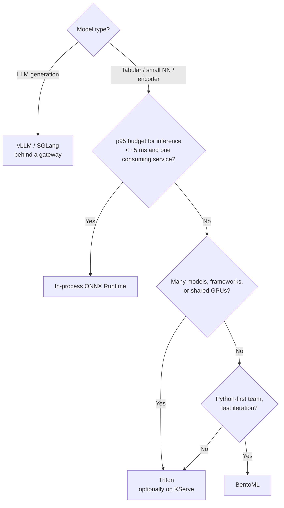

# 🧭 05 - Choosing a Serving Stack

"How would you serve this model?" has a dozen plausible answers — in-process ONNX Runtime, Triton, BentoML, KServe, Ray Serve, vLLM, a managed endpoint — and the right one depends on four things: the **model type**, the **latency budget**, the **traffic shape**, and **who operates it**. This note compares the options on those axes, records which projects are actively maintained as of October 2026, and gives the reasoning behind each of the three portfolio projects' choices.

## 🎯 Learning Objectives
- Classify serving options into **runtimes, model servers, LLM engines, orchestration layers, and managed platforms**
- Compare them on latency overhead, batching, model types, GPU efficiency, operability, and ecosystem
- Factor **project health** (release cadence, archival) into the decision — e.g., TorchServe's archival
- Apply a decision procedure to P1, P2, and P3
- Answer the serving-stack question in a system-design interview with quantified trade-offs

## Introduction

The options sit at different layers, which is why comparisons often confuse people:

- **Runtimes** execute a model graph: ONNX Runtime, TensorRT, LibTorch, XGBoost's predictor, OpenVINO.
- **Model servers** wrap runtimes with an API, batching, versioning, and metrics: Triton, BentoML, (TorchServe — now archived), TensorFlow Serving.
- **LLM engines** specialize in autoregressive generation: vLLM, SGLang, TensorRT-LLM — continuous batching, paged KV caches, speculative decoding.
- **Orchestration layers** run servers on clusters with autoscaling and rollouts: KServe (on Kubernetes/Knative), Ray Serve.
- **Managed platforms** do all of the above for a fee: SageMaker, Vertex AI, Azure ML endpoints, serverless GPU providers.

A real system often uses several layers at once — e.g., KServe orchestrating Triton, which uses ONNX Runtime underneath. The question is which layers your workload actually needs.

---

## 1. The Problem and Why This Solution Exists

### More layers, more latency, more operations

Every layer adds features **and** costs: a network hop, serialization, another deployment, another thing to monitor. For a 0.1 ms tree model with an 80 ms budget, a model server's ~1–3 ms per request is affordable but not free; for a 2-second LLM generation, it is noise. Matching layers to workloads is the whole game.

### Projects come and go

Serving frameworks evolve fast, and some stop. As of the GitHub API on 2026-10-06:

| Project | Status | Latest release |
|---|---|---|
| Triton Inference Server | Active | v2.73.0 (2026-09-30) |
| vLLM | Active | v0.31.0 (2026-10-05) |
| KServe | Active | v0.21.0 (2026-09-25) |
| Ray (Serve) | Active | 2.59.0 (2026-10-02) |
| BentoML | Active | v1.4.39 (2026-05-07) |
| **TorchServe** (`pytorch/serve`) | ⚠️ **Archived** (read-only since Aug 2025) | v0.12.0 (2024-09-30) |

⚠️ **Warning:** TorchServe is archived — no fixes, no security patches. Existing knowledge ([[../30 - TorchServe/00 - Welcome to TorchServe|TorchServe course]]) remains useful to understand handler-based serving and to maintain legacy deployments, but new PyTorch serving should use ONNX Runtime/TensorRT via Triton, BentoML, LibTorch-based servers, or (for LLMs) vLLM/SGLang.

---

## 2. Conceptual Deep Dive

### 2.1 The comparison

| Option | Layer | Best for | Batching | Per-request overhead | Ops burden |
|---|---|---|---|---|---|
| **In-process ONNX Runtime** | Runtime | Small/medium models on a latency-critical path inside one service | Your code (micro-batches) | Function call | Lowest (part of the service) |
| **Triton** | Server | Multi-framework, multi-model, GPU sharing, platform teams | Dynamic, server-side | gRPC/HTTP + serde + queue | Medium |
| **BentoML** | Server + packaging | Python-first teams shipping models as services; adaptive batching; easy containerization | Adaptive batching | HTTP/gRPC + Python | Low–medium |
| **vLLM / SGLang** | LLM engine | Text generation: continuous batching, paged KV cache, prefix caching | Continuous (token-level) | HTTP (OpenAI-compatible) | Medium (GPU) |
| **KServe** | Orchestration (K8s) | Standard inference CRDs, autoscaling incl. scale-to-zero, canaries | Delegates to runtime | + K8s ingress | High (Kubernetes) |
| **Ray Serve** | Orchestration (Ray) | Composed Python pipelines, multi-model graphs, Python-native autoscaling | Built-in batching decorator | Ray RPC | Medium–high |
| **Managed endpoints** | Platform | Teams without platform engineers; compliance-heavy orgs | Varies | Network + platform | Low (cost: money) |

### 2.2 A decision procedure



The thresholds are judgment calls; the structure is what matters: **model type first, then latency budget, then platform needs, then team**.

### 2.3 Cost of the extra hop, quantified

For a scorer handling micro-batches of size $k$ at rate $\lambda$ events/s, the added time per event from calling a server instead of an in-process runtime is roughly:

$$
\Delta L_{\text{event}} \approx \underbrace{L_{\text{rtt}} + L_{\text{serde}}(k)}_{\text{per batch}} + \underbrace{T_{\text{queue}}}_{\text{server batching}}
\qquad
\text{CPU overhead per event} \approx \frac{c_{\text{serde}}(k)}{k}
$$

With localhost gRPC at ~0.5 ms per batch and small tensors, the latency cost is ~0.5–2 ms per batch — fine for P1's 80 ms budget **if** it buys something (isolation, GPU sharing, independent rollouts). If it buys nothing, it is pure overhead. That is exactly what P1's experiment E4 quantifies.

### 2.4 Operational criteria that decide in practice

| Question | Why it matters |
|---|---|
| Who is on call for the serving layer? | A Kubernetes-based stack without a platform team is a liability |
| How are models rolled out and rolled back? | Aliases + hot reload (in-process) vs repository versions (Triton) vs CRDs (KServe) |
| How is it observed? | Built-in metrics (Triton, vLLM) vs custom instrumentation |
| What hardware? | GPUs favor servers with batching and sharing; CPUs favor lean in-process runtimes |
| Is the project healthy? | Release cadence, maintainers, archival (TorchServe) |

---

## 3. Production Reality

### The three portfolio projects

| Project | Model | Choice | Reasoning |
|---|---|---|---|
| **P1** fraud | XGBoost (+ MLP challenger) | **In-process ONNX Runtime** in the scorer; Triton as measured variant B | 80 ms end-to-end budget; tree inference ~0.1–1 ms; one consuming service; CPU-only laptop. Triton measured for isolation/GPU-platform trade-off |
| **P2** router | Laya encoder (decision model) | **In-process ONNX Runtime (int8)** inside the stream processor | Model call dominates per-message cost; in-process avoids a hop per batch; CPU-only |
| **P3** live RAG | Embedding model + LLM | **In-process ONNX** for embeddings (ingest and query); **LLM via the Go gateway** (Haiku in the final test, Ollama locally) | Embeddings are small and must be identical at ingest and query; generation is a remote LLM — vLLM would only make sense with a self-hosted GPU model |

Notice the pattern: on a laptop with small models, **in-process wins** every latency-critical slot; servers earn their place when you have **many models, shared GPUs, or many consuming services**. The interview value is in saying *why*, with numbers.

Caso real: a common evolution in ML platforms is "embedded models everywhere" → "a central Triton/KServe tier" once the number of models and GPU costs grow — and then back to embedded runtimes for the handful of ultra-low-latency models where the network hop dominates. Mature platforms support both modes.

Caso real: teams that adopted TorchServe for PyTorch models had to plan migrations after its archival in 2025 — usually exporting to ONNX/TensorRT and serving with Triton, or moving to BentoML — a reminder that the serving framework is a dependency with its own lifecycle, and that **portable artifacts** (ONNX) reduce lock-in.

---

## 4. Code in Practice

### One artifact, three serving modes (P1)

```python
# The same registered ONNX artifact can be served three ways — the scorer chooses by config.
import numpy as np

class InProcess:                                  # mode A: default for P1
    def __init__(self, session): self.s = session
    def predict(self, X: np.ndarray) -> np.ndarray:
        return self.s.run(["probabilities"], {"input": X})[0][:, 1]

class TritonGrpc:                                 # mode B: variant for experiment E4
    def __init__(self, client, model="fraud_xgb_onnx"): self.c, self.m = client, model
    def predict(self, X: np.ndarray) -> np.ndarray:
        import tritonclient.grpc as g
        inp = g.InferInput("input", list(X.shape), "FP32"); inp.set_data_from_numpy(X)
        return self.c.infer(self.m, [inp]).as_numpy("probabilities")[:, 1]

def make_backend(cfg: dict):
    return InProcess(cfg["session"]) if cfg["mode"] == "inprocess" else TritonGrpc(cfg["client"])
```

### ❌/✅ Choosing by fashion vs by budget

```text
❌ "We'll put every model behind KServe + Triton because that's what big companies do."
   → +1–3 ms and a Kubernetes stack for a single 0.1 ms CPU model with one consumer.

✅ "Inference budget is 4 ms of an 80 ms p95; one consumer; CPU. In-process ONNX Runtime,
   with the same artifact deployable to Triton when a second consumer or a GPU appears."
```

### 📦 Compression code: when does a model server pay for itself?

```python
# 📦 Compression code: in-process vs server, per-event latency and CPU, as batch size and model cost vary
# Covers: per-batch network/serde overhead, amortization by batch size, model-cost dominance
def per_event_ms(model_ms_per_batch: float, k: int, server: bool,
                 rtt_ms: float = 0.5, serde_ms_per_item: float = 0.004, queue_ms: float = 0.3) -> float:
    overhead = (rtt_ms + serde_ms_per_item * k + queue_ms) if server else 0.0
    return (model_ms_per_batch + overhead) / k

cases = {"tree model (0.1 ms + 0.02 ms/row)": lambda k: 0.1 + 0.02 * k,
         "encoder on CPU (8 ms + 4 ms/row)": lambda k: 8 + 4 * k}
for name, cost in cases.items():
    for k in (1, 32):
        ip, sv = per_event_ms(cost(k), k, False), per_event_ms(cost(k), k, True)
        print(f"{name:<36} k={k:>2}: in-process {ip:7.3f} ms/event | server {sv:7.3f} ms/event "
              f"(+{(sv / ip - 1) * 100:5.1f}%)")
# ¡Sorpresa! For a tiny tree model at k=1 the server multiplies per-event cost several times;
# for an encoder the same overhead is a rounding error — the model type decides.
```

---

## 🎯 Key Takeaways
- Separate the layers: **runtime** (ORT, TensorRT), **server** (Triton, BentoML), **LLM engine** (vLLM, SGLang), **orchestration** (KServe, Ray Serve), **managed**.
- Decide by **model type → latency budget → platform needs → team**, not by fashion.
- A model server costs a hop, serialization, and queueing: significant for tiny models, negligible for heavy ones.
- In-process runtimes win latency-critical slots with small models and a single consumer; servers win with many models, shared GPUs, and many consumers.
- **TorchServe is archived** (Aug 2025): prefer ONNX/TensorRT on Triton, BentoML, or LLM engines; keep artifacts **portable** to limit lock-in.
- P1, P2, and P3 all serve their small models **in-process** and justify it with measurements (E4 for Triton).

## References
- NVIDIA Triton documentation · BentoML documentation · KServe documentation · Ray Serve documentation · vLLM documentation
- GitHub API repository and release metadata (accessed 2026-10-06), including `pytorch/serve` archival
- Crankshaw et al., *Clipper* (NSDI 2017) · Kwon et al., *Efficient Memory Management for LLM Serving with PagedAttention* (SOSP 2023)
- [[../42 - BentoML Production Model Serving/00 - Welcome - BentoML Production Model Serving|BentoML course]] · [[../32 - KServe and Knative/00 - Welcome to KServe and Knative|KServe and Knative]] · [[../../06 - Large Language Models/20 - vLLM Production Serving/00 - Bienvenida|vLLM Production Serving]]
- [[04 - Shadow Mode and Champion-Challenger|Previous: Shadow Mode]] · [[00 - Welcome to High-Performance Model Serving|Course welcome]]
