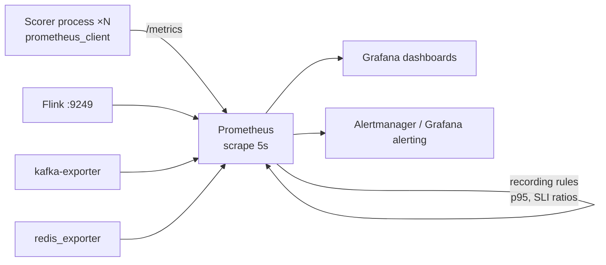

# 📏 01 - Prometheus Metrics Design for ML

Two scorer processes each report "p95 = 40 ms". Is the system's p95 40 ms? Not necessarily — and if those numbers came from client-side summaries, there is no way to compute the true combined p95 at all. A Prometheus histogram with buckets at 50, 100, 250 ms reports an 80 ms SLO as "somewhere between 50 and 100". And one innocent `user_id` label can turn a healthy Prometheus into an out-of-memory crash. Metric design decides whether your dashboards tell the truth.

## 🎯 Learning Objectives
- Choose the right **metric type**: counter, gauge, histogram, summary (and native histograms)
- Understand how `histogram_quantile` **interpolates**, and size buckets around your SLO
- Explain why **summaries can't be aggregated** across instances and histograms can
- Control **cardinality**: estimate series counts and pick labels that are bounded
- Apply naming conventions and the **RED/USE** methods to ML services
- Instrument a Python ML service with `prometheus_client`, recording rules, and exemplars

## Introduction

Prometheus stores **time series**: a metric name plus a set of label key–value pairs identifies a series, and each series is a sequence of timestamped values scraped every few seconds. Everything you can later ask in Grafana is constrained by what you exported: which types, which labels, which buckets. Unlike logs, you cannot go back and re-aggregate raw events — the aggregation decision is made at instrumentation time.

For ML services, three families of metrics matter: **service metrics** (request rate, errors, latency distributions by stage), **model metrics** (score distributions, decision mix, model version in use), and **pipeline metrics** (consumer lag, throughput per topic, feature freshness). This note shows how to export each so that percentiles are correct, queries are cheap, and Prometheus stays small enough for a laptop.

---

## 1. The Problem and Why This Solution Exists

### Averages lie; quantiles need distributions

A mean latency hides the tail ([[../43 - Real-time Feature Serving with Redis/04 - Latency Budgets for Online Serving|latency budgets]]). To report p95/p99 you need a **distribution**. There are two ways to ship one to a monitoring system: precomputed quantiles (summaries) or bucketed counts (histograms). The choice determines whether you can aggregate across processes, change the quantile later, and alert on SLOs.

### Cardinality is the hidden cost

Every distinct label combination is a separate series held in memory:

$$
N_{\text{series}} = \prod_{\ell \in \text{labels}} |\text{values}(\ell)| \;\times\; N_{\text{buckets}} \text{ (for histograms)}
$$

A latency histogram with 16 buckets, labeled by `stage` (8 values) and `model_version` (2 values), is $16 \times 8 \times 2 = 256$ series — trivial. Add `user_id` with 100,000 values and it becomes **25.6 million** — Prometheus falls over.

---

## 2. Conceptual Deep Dive

### 2.1 Metric types

| Type | Semantics | Query pattern | ML example |
|---|---|---|---|
| **Counter** | Monotonic total (resets on restart) | `rate(x_total[5m])` | `fraud_decisions_total{decision="BLOCK"}` |
| **Gauge** | Current value, up or down | Direct, `avg_over_time` | `kafka_consumergroup_lag`, `model_loaded_version` |
| **Histogram** | Cumulative bucket counters `_bucket{le}`, plus `_sum`, `_count` | `histogram_quantile(0.95, sum by (le)(rate(x_bucket[5m])))` | `fraud_e2e_latency_seconds` |
| **Summary** | Client-computed quantiles (`quantile="0.95"`) + `_sum`, `_count` | Read directly | Rarely: single-process, fixed quantiles |
| **Native histogram** | Exponential, sparse buckets in one series (Prometheus 2.40+, maturing in 3.x) | `histogram_quantile` on the native series | High-resolution latency without hand-picked buckets |

### 2.2 How `histogram_quantile` estimates a percentile

A classic histogram stores cumulative counts $C(u)$ of observations $\le u$ for each upper bound $u$. To estimate quantile $q$ from $N$ observations, Prometheus finds the bucket $(l, u]$ where the target rank $qN$ falls and **linearly interpolates**:

$$
\hat{x}_q = l + (u - l)\,\frac{qN - C(l)}{C(u) - C(l)}
$$

The estimate's error is bounded by the bucket width $u - l$. With buckets `[0.05, 0.1]` around an 80 ms SLO, the reported p95 can be off by tens of milliseconds — enough to show "green" when users are over budget. **Put buckets densely around your SLO threshold** and keep one bucket boundary **exactly at** it, so the SLI "fraction under 80 ms" is exact:

```text
P1 buckets (seconds): .005 .01 .02 .03 .04 .05 .06 .07 .08 .09 .1 .15 .25 .5 1 2.5
                                                  ↑ exact SLO boundary
```

### 2.3 Why summaries don't aggregate

A summary's p95 from process A and process B cannot be combined: the p95 of the union is **not** a function of the two p95s (nor their average). Histograms aggregate correctly because **bucket counts add**:

$$
C_{\text{total}}(u) = C_A(u) + C_B(u) \quad\Rightarrow\quad \hat{x}_q \text{ computed on the merged counts}
$$

That is why every multi-process service (P1 runs several scorer processes) should export **histograms**.

### 2.4 Naming and labels

- Base units and suffixes: `_seconds`, `_bytes`, counters end in `_total`.
- Name says *what*, labels say *which*: `fraud_stage_latency_seconds{stage="redis"}`, not `fraud_redis_latency_seconds`.
- **Bounded labels only:** `stage`, `decision`, `model_version` (a handful), `topic`, `service`. **Never** user IDs, payment IDs, raw text, or unbounded error messages — those belong in logs and traces.
- Use **exemplars** (OpenMetrics) to attach a `trace_id` to a histogram observation: Grafana can jump from a latency spike to the exact trace, without putting IDs in labels.

### 2.5 RED and USE for ML services

| Method | Signals | ML service mapping |
|---|---|---|
| **RED** (requests) | Rate, Errors, Duration | Decisions/s, failed/degraded decisions, latency histograms per stage |
| **USE** (resources) | Utilization, Saturation, Errors | CPU per process, consumer lag / queue depth, OOM kills |
| **Model** (ML-specific) | Distribution, Mix, Version | Score histogram, decision mix, model version gauge, feature PSI |



---

## 3. Production Reality

### Budgeting Prometheus on a laptop

Each active series costs a few KB of memory in Prometheus' head block. P1's catalog — latency histograms by stage (16 buckets × ~8 stages × 2 model versions), decision counters, exporters for Kafka (lag per partition) and Redis — stays in the low tens of thousands of series: a few hundred MB with 6 h retention, matching the ~350 MB budget in P1's plan.

### Recording rules

Quantile queries over many series are expensive when every dashboard refresh recomputes them. **Recording rules** precompute them every evaluation interval and store the result as a new, cheap series:

```yaml
groups:
  - name: fraud_slo
    interval: 15s
    rules:
      - record: fraud:e2e_latency_seconds:p95_5m
        expr: histogram_quantile(0.95, sum by (le) (rate(fraud_e2e_latency_seconds_bucket[5m])))
      - record: fraud:sli_under_80ms:ratio_5m
        expr: |
          sum(rate(fraud_e2e_latency_seconds_bucket{le="0.08"}[5m]))
          / sum(rate(fraud_e2e_latency_seconds_count[5m]))
```

### Scrape interval vs resolution

`rate()` needs at least two samples in its window; with a 5 s scrape, use windows ≥ 20–30 s for panels and 5 m for SLOs. Short spikes between scrapes are still captured by counters and histograms (they accumulate), but **gauges** sampled every 5 s can miss sub-interval peaks.

Caso real: one of the most common Prometheus outages in ML teams is a model-monitoring metric labeled with `request_id` or `user_id` "just for debugging"; cardinality explodes within hours, memory spikes, scrapes time out, and the monitoring system dies exactly when it is needed. The fix is architectural: IDs go to traces/logs, linked from metrics via exemplars.

Caso real: in P1, scorer processes scale from 1 to 4 during experiments. Because latency is exported as **histograms**, the dashboard's p95 is computed over all processes' merged buckets; with summaries, the team would only be able to show four separate p95s — none of which is the system's p95.

---

## 4. Code in Practice

### Instrumenting the scorer

```python
from prometheus_client import Counter, Gauge, Histogram, start_http_server

BUCKETS = (.005, .01, .02, .03, .04, .05, .06, .07, .08, .09, .1, .15, .25, .5, 1, 2.5)
E2E = Histogram("fraud_e2e_latency_seconds", "Scheduled → decision appended", buckets=BUCKETS)
STAGE = Histogram("fraud_stage_latency_seconds", "Per-stage latency", ["stage"], buckets=BUCKETS)
DECISIONS = Counter("fraud_decisions_total", "Decisions", ["decision", "model_version", "degraded"])
SCORE = Histogram("fraud_score", "Model score distribution", ["model_version"],
                  buckets=[i / 20 for i in range(1, 20)])
MODEL = Gauge("fraud_model_loaded_version", "Champion version in memory")
BATCH = Histogram("fraud_batch_size", "Micro-batch size", buckets=(1, 2, 5, 10, 25, 50, 100, 250, 500))

start_http_server(9100)                                     # /metrics for Prometheus

def record(batch, decisions, timings, version: str):
    BATCH.observe(len(batch))
    for stage, seconds in timings.items():                  # poll, redis, inference, produce
        STAGE.labels(stage=stage).observe(seconds)
    for d in decisions:
        DECISIONS.labels(d.decision, version, str(d.degraded).lower()).inc()
        SCORE.labels(version).observe(d.score)
```

💡 **Tip:** observe end-to-end latency where the **end** is known — in P1 that's the Latency Collector reading the broker's append time — not in the scorer, which only knows when it *sent* the decision.

### PromQL you will use daily

```promql
# p95 end-to-end over all processes
histogram_quantile(0.95, sum by (le) (rate(fraud_e2e_latency_seconds_bucket[5m])))

# p95 per stage (where did the time go?)
histogram_quantile(0.95, sum by (le, stage) (rate(fraud_stage_latency_seconds_bucket[5m])))

# Decision mix (%)
sum by (decision) (rate(fraud_decisions_total[5m])) / ignoring(decision) group_left sum(rate(fraud_decisions_total[5m]))

# Consumer lag of the scorer group
sum(kafka_consumergroup_lag{consumergroup="scorer"})
```

### ❌/✅ Labels

```python
# ❌ Unbounded label: one series per user × bucket — cardinality explosion
E2E_BAD = Histogram("lat", "…", ["user_id"]); E2E_BAD.labels(user_id=uid).observe(dt)

# ✅ Bounded labels in metrics; the ID travels as an exemplar to the trace
E2E.observe(dt, exemplar={"trace_id": trace_id})            # requires OpenMetrics exposition
```

### 📦 Compression code: bucket placement and why summaries don't merge

```python
# 📦 Compression code: histogram_quantile interpolation error and summary aggregation error
# Covers: Prometheus' linear interpolation, SLO-aligned buckets, merging histograms vs averaging p95s
import bisect
import random
import statistics

random.seed(2)
lat = [random.lognormvariate(-3.3, 0.45) for _ in range(100_000)]   # seconds, median ≈ 37 ms
true_p95 = statistics.quantiles(lat, n=100)[94]

def histogram_quantile(q: float, xs: list[float], bounds: list[float]) -> float:
    xs_sorted = sorted(xs)
    cum = [bisect.bisect_right(xs_sorted, b) for b in bounds]
    rank, lo, c_lo = q * len(xs), 0.0, 0
    for b, c in zip(bounds, cum):
        if c >= rank:
            return lo + (b - lo) * (rank - c_lo) / (c - c_lo)
        lo, c_lo = b, c
    return bounds[-1]

coarse = [0.05, 0.1, 0.25, 0.5, 1.0]
dense = [.005, .01, .02, .03, .04, .05, .06, .07, .08, .09, .1, .15, .25, .5, 1.0]
print(f"true p95 = {true_p95*1000:.1f} ms | coarse buckets = {histogram_quantile(.95, lat, coarse)*1000:.1f} ms"
      f" | dense buckets = {histogram_quantile(.95, lat, dense)*1000:.1f} ms")

a = [random.lognormvariate(-3.6, 0.3) for _ in range(90_000)]      # fast process, most traffic
b = [random.lognormvariate(-2.5, 0.4) for _ in range(10_000)]      # slow process, little traffic
p95 = lambda xs: statistics.quantiles(xs, n=100)[94] * 1000
print(f"avg of per-process p95s = {(p95(a) + p95(b)) / 2:.1f} ms | true merged p95 = {p95(a + b):.1f} ms")
# ¡Sorpresa! Averaging p95s is not a p95 at all — merge histogram buckets, never summaries.
```

---

## 🎯 Key Takeaways
- Use **counters** for totals, **gauges** for current values, **histograms** for latency and score distributions.
- `histogram_quantile` **interpolates linearly** inside a bucket — error is bounded by bucket width; place buckets densely around the SLO with a boundary **at** the threshold.
- **Histograms aggregate** across processes (counts add); **summaries don't** — averaging p95s is meaningless.
- **Cardinality** = product of label values (× buckets): only bounded labels; IDs go to traces via **exemplars**.
- Follow naming conventions (`_seconds`, `_total`) and the **RED/USE + model** signal families.
- Precompute expensive quantiles and SLI ratios with **recording rules**.

## References
- Prometheus documentation — metric types, histograms and summaries, naming, instrumentation best practices, native histograms
- OpenMetrics specification — exemplars
- Tom Wilkie, *The RED Method* · Brendan Gregg, *The USE Method*
- `prometheus_client` (Python) documentation
- [[00 - Welcome to Grafana and Latency Engineering|Course welcome]] · [[02 - Grafana Dashboards as Code|Next: Grafana Dashboards as Code]]
