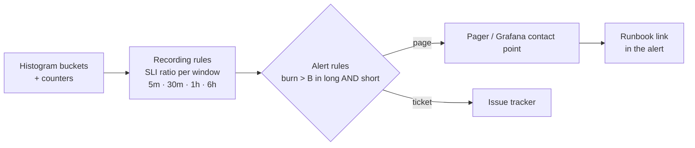

# 🚨 03 - SLOs, Alerting and Burn Rates

"Alert if p95 > 80 ms for one minute" sounds responsible and produces two failure modes at once: it pages at 3 a.m. for a 70-second blip that no customer noticed, and it stays silent through a week in which the system misses its target 3% of the time. Service Level Objectives and **burn-rate alerts** replace thresholds with a budget: how much unreliability users can tolerate, and how fast you are spending it.

## 🎯 Learning Objectives
- Define **SLIs** as good/valid ratios and set **SLOs** with explicit windows
- Compute **error budgets**, **burn rates**, and time-to-exhaustion
- Derive and implement **multi-window, multi-burn-rate** alerts (SRE Workbook style)
- Write Prometheus recording and alerting rules for latency, completeness, and freshness SLIs
- Add **ML-specific alerts**: drift, decision-mix anomalies, lag growth, model health
- Keep alerts actionable: severity, owner, runbook, symptom over cause

## Introduction

Monitoring tells you what is happening; **alerting** decides when a human must act. The SRE discipline (Google's *Site Reliability Engineering* and *The Site Reliability Workbook*) frames this around user-visible objectives: define what "good" means for one event (an **SLI**), commit to how often it must be good over a window (an **SLO**), and treat the remainder as a **budget** you may spend on incidents, deployments, and experiments. Alerts then fire when the budget is being consumed fast enough to threaten the objective — not when a single graph crosses a line.

For real-time ML, latency is only one SLI. A fraud pipeline also has a **completeness** SLI (every payment receives a decision), the RAG platform has a **freshness** SLI (changes become searchable within seconds), and every model has **quality** signals (drift, decision mix) that are not SLOs in the classic sense but deserve alerts. This note builds all of them on the metrics from [[01 - Prometheus Metrics Design for ML|note 01]].

---

## 1. The Problem and Why This Solution Exists

### Why static thresholds fail

| Static alert | Failure |
|---|---|
| `p95 > 80 ms for 1m` | Pages for short spikes that barely dent the monthly objective (noise → fatigue) |
| `p95 > 80 ms for 1h` | Misses a sharp outage for an hour; misses a chronic 3% violation that never sustains an hour |
| `error_rate > 1%` | Same number means different urgency for a 99% and a 99.99% objective |

Alert fatigue is not a nuisance; it is a reliability risk. Responders who are paged for nothing learn to ignore pages.

### The budget idea

If the objective is "95% of decisions under 80 ms over 30 days", then **5% of decisions are allowed to be slow** — that is the error budget. An incident that makes 50% of decisions slow for 10 minutes spends a measurable fraction of it. The alerting question becomes: *at the current rate, when will the budget run out?*

---

## 2. Conceptual Deep Dive

### 2.1 SLIs, SLOs, budgets

$$
\text{SLI} = \frac{\text{good events}}{\text{valid events}}
\qquad
\text{SLO: } \text{SLI} \ge s \text{ over window } W
\qquad
\text{error budget} = 1 - s
$$

| Project | SLI | Good event | SLO (example) |
|---|---|---|---|
| P1 latency | `decisions < 80 ms / decisions` | Decision appended < 80 ms after schedule | 95% over the evaluation window |
| P1 completeness | `decisions / payments` | A payment receives a decision | 99.9% |
| P2 routing latency | `routed < 300 ms / routed` | System 1 decision < 300 ms | 95% |
| P3 freshness | `probes found < 10 s / probes` | Marker document searchable within 10 s | 95% |

The latency SLI comes straight from a histogram bucket at the threshold (the reason note 01 insists on a bucket **at** 80 ms).

### 2.2 Burn rate

The **burn rate** is how fast the budget is consumed relative to the rate that would exactly exhaust it at the end of the window:

$$
b = \frac{\text{observed bad fraction}}{1 - s}
\qquad
T_{\text{exhaust}} = \frac{W}{b}
$$

With $s = 0.95$, a bad fraction of 0.05 is $b = 1$ (budget lasts exactly $W$); a bad fraction of 0.50 is $b = 10$ (a 30-day budget gone in 3 days).

An alert that looks at a window $w$ and fires when $b > B$ has consumed a fraction of the total budget by the time it fires:

$$
\text{budget consumed} = B \cdot \frac{w}{W}
$$

### 2.3 Multi-window, multi-burn-rate alerts

The SRE Workbook's recommended pattern for a 30-day window ($W = 720$ h):

| Severity | Burn rate $B$ | Long window | Short window | Budget consumed when it fires |
|---|---|---|---|---|
| Page | 14.4 | 1 h | 5 m | $14.4 \times 1/720 = 2\%$ |
| Page | 6 | 6 h | 30 m | $6 \times 6/720 = 5\%$ |
| Ticket | 1 | 3 d | 6 h | $1 \times 72/720 = 10\%$ |

Each alert requires **both** windows to exceed the burn rate. The long window ensures enough budget was really spent (no blips); the short window makes the alert **reset quickly** once the problem stops (no paging for an incident that ended 40 minutes ago).

⚠️ **Warning — burn rates are capped by the SLO:** the bad ratio can never exceed 1, so the maximum burn rate is $b_{\max} = 1/(1-s)$. The Workbook's thresholds were designed for tight objectives (99.9% → $b_{\max} = 1000$, and a 14.4 page fires at just 1.44% bad events). With a loose objective like P1's 95% ($b_{\max} = 20$), a 14.4 page requires **≥ 72% bad events sustained for an hour** — only a near-total outage would trigger it. For loose SLOs, either lower the page burn rate (P1 uses $B = 10$, i.e., ≥ 50% bad over 1 h and 5 m) or add a stricter companion SLO (e.g., 99% of decisions under 150 ms) whose budget is small enough for the classic thresholds.

💡 **Tip — short-lived demo systems:** a portfolio stack never runs for 30 days. Keep the 30-day formulas: the fast-burn page (burn rate 14.4 over 1 h **and** 5 m) is meaningful in any run longer than an hour, and P1's chaos experiments are designed to trigger it deliberately. The slower alerts need longer runs; if you shorten their windows for a demo (e.g., 6 h / 30 m instead of 3 d / 6 h), label them as demo settings in the README rather than presenting them as production policy.



### 2.4 ML-specific alerts (not SLOs, still actionable)

| Alert | Signal | Why |
|---|---|---|
| Score/feature **drift** | PSI > 0.2 for a feature or the score | Model inputs changed — skew or drift ([[../43 - Real-time Feature Serving with Redis/03 - Point-in-Time Correctness and Train-Serve Skew|skew]]) |
| **Decision mix** anomaly | BLOCK rate outside an expected band | Data bug, model bug, or attack wave |
| **Lag growth** | `deriv(consumer_lag[10m]) > 0` sustained | Pipeline falling behind before latency SLO burns |
| Model health | `fraud_model_loaded_version` changed unexpectedly / load failures | Bad promotion or corrupt artifact |
| Dependency degraded | Rate of `degraded=true` decisions | Redis or feature freshness issues |
| Freshness (P3) | Probe p95 > 30 s | Index stale → wrong answers |

### 2.5 Alert hygiene

Every alert has: a **severity** (page vs ticket), an **owner**, a **runbook link** (symptom → dashboard → diagnosis → action), and a **symptom-based** condition when possible (users are affected) rather than a cause (CPU is high). Cause-based alerts belong on dashboards or as tickets.

---

## 3. Production Reality

### Completeness is an SLO too

Streaming systems can be fast and still wrong: a consumer that skips messages after a bad deploy has great latency and terrible completeness. P1 tracks `decisions / payments` per minute, joined by the auditor, and alerts when it drops — the metric that would have caught the "lost events after recovery" class of bugs from the failure-testing catalog.

### Testing alerts

Alerts are code; test them. Prometheus rule unit tests (`promtool test rules`) feed synthetic series and assert which alerts fire. In P1, the chaos experiments (kill a TaskManager, slow Redis with Toxiproxy) double as **alert integration tests**: each runbook lists the alert expected to fire.

Caso real: Google's SRE practice popularized error budgets as a negotiation tool between reliability and feature velocity — when the budget is spent, risky launches pause; when it is healthy, teams ship faster. The multi-window burn-rate alerting in *The Site Reliability Workbook* was presented specifically to fix the precision/recall problems of threshold alerts.

Caso real: ML teams often discover that their most valuable alert is not latency but **decision-mix anomaly** — a sudden doubling of BLOCK decisions has, in practice, been caused by an upstream unit change (cents vs dollars), a stale feature store after a failed batch job, or a real fraud wave. All three need a human within minutes; none would trip a latency SLO.

---

## 4. Code in Practice

### Recording rules: SLI ratios per window

```yaml
groups:
  - name: fraud-sli
    interval: 30s
    rules:
      - record: fraud:sli_latency_bad_ratio:rate5m
        expr: 1 - (sum(rate(fraud_e2e_latency_seconds_bucket{le="0.08"}[5m]))
                   / sum(rate(fraud_e2e_latency_seconds_count[5m])))
      - record: fraud:sli_latency_bad_ratio:rate1h
        expr: 1 - (sum(rate(fraud_e2e_latency_seconds_bucket{le="0.08"}[1h]))
                   / sum(rate(fraud_e2e_latency_seconds_count[1h])))
      - record: fraud:sli_latency_bad_ratio:rate30m
        expr: 1 - (sum(rate(fraud_e2e_latency_seconds_bucket{le="0.08"}[30m]))
                   / sum(rate(fraud_e2e_latency_seconds_count[30m])))
      - record: fraud:sli_latency_bad_ratio:rate6h
        expr: 1 - (sum(rate(fraud_e2e_latency_seconds_bucket{le="0.08"}[6h]))
                   / sum(rate(fraud_e2e_latency_seconds_count[6h])))
```

### Alert rules: multi-window burn rate + ML alerts

```yaml
groups:
  - name: fraud-alerts
    rules:
      - alert: FraudLatencyBudgetFastBurn
        expr: fraud:sli_latency_bad_ratio:rate1h > (10 * 0.05)      # B=10: loose 95% SLO caps burn at 20
          and fraud:sli_latency_bad_ratio:rate5m > (10 * 0.05)
        labels: { severity: page, team: fraud }
        annotations:
          summary: "Latency SLO burning fast (≥1.4% of 30-day budget per hour)"
          runbook_url: "https://github.com/<you>/realtime-fraud-detection/blob/main/docs/runbooks.md#latency-fast-burn"
      - alert: FraudLatencyBudgetSlowBurn
        expr: fraud:sli_latency_bad_ratio:rate6h > (6 * 0.05)
          and fraud:sli_latency_bad_ratio:rate30m > (6 * 0.05)
        labels: { severity: page, team: fraud }
      - alert: FraudConsumerLagGrowing
        expr: deriv(sum(kafka_consumergroup_lag{consumergroup="scorer"})[10m:30s]) > 0
          and sum(kafka_consumergroup_lag{consumergroup="scorer"}) > 5000
        for: 5m
        labels: { severity: ticket }
      - alert: FraudScoreDrift
        expr: max(fraud_feature_psi{feature="score"}) > 0.2
        for: 15m
        labels: { severity: ticket }
```

⚠️ **Warning:** `rate(...[5m])` over histogram buckets needs at least two scrapes in the window and enough events; at very low traffic, burn-rate ratios become noisy — add a minimum-traffic condition (`and sum(rate(..._count[5m])) > 10`).

### ❌/✅ The same objective, two alerts

```yaml
# ❌ Threshold: pages on blips, misses chronic slowness
- alert: P95High
  expr: fraud:e2e_latency_seconds:p95_5m > 0.08
  for: 1m

# ✅ Budget-based: fires when the objective is genuinely threatened; resets fast when it isn't
- alert: FraudLatencyBudgetFastBurn
  expr: fraud:sli_latency_bad_ratio:rate1h > 0.5 and fraud:sli_latency_bad_ratio:rate5m > 0.5
```

### 📦 Compression code: threshold vs multi-window burn-rate alerts on the same traffic

```python
# 📦 Compression code: precision of alerting strategies under blips, an outage, and a slow burn
# Covers: SLI bad ratio per minute, burn rate, multi-window rule, static p95-style threshold
import random

random.seed(8)
SLO_BAD = 0.05                                     # 95% objective → 5% budget
minutes = 3 * 24 * 60
bad = [random.betavariate(2, 80) for _ in range(minutes)]      # healthy: ~2.4% bad
for m in random.sample(range(minutes), 12):                     # 12 short blips (1 minute, 60% bad)
    bad[m] = 0.6
for m in range(2000, 2040):                                     # real outage: 40 min, 90% bad
    bad[m] = 0.9
for m in range(3000, 3900):                                     # chronic slow burn: 15 h at 12% bad
    bad[m] = 0.12

def window(m, w): return sum(bad[max(0, m - w + 1): m + 1]) / min(w, m + 1)

static = [m for m in range(minutes) if bad[m] > 0.5]           # "fire if bad ratio > 50% for 1 min"
B_PAGE = min(14.4, 0.5 / SLO_BAD)                              # burn rate capped at 1/(1-s) = 20 → use 10
fast = [m for m in range(minutes) if window(m, 60) > B_PAGE * SLO_BAD and window(m, 5) > B_PAGE * SLO_BAD]
slow = [m for m in range(minutes) if window(m, 360) > 1 * SLO_BAD and window(m, 30) > 1 * SLO_BAD]  # ticket rule, 3d/6h shortened to 6h/30m

def first(ms, lo, hi): return next((m - lo for m in ms if lo <= m < hi), None)
print(f"static: {len(static)} firing minutes, first on outage after {first(static, 2000, 2040)} min, "
      f"on slow burn: {first(static, 3000, 3900)}")
print(f"fast burn page: first on outage after {first(fast, 2000, 2040)} min, "
      f"fires on blips: {any(m not in range(2000, 2100) for m in fast)}")
print(f"slow-burn ticket: first on slow burn after {first(slow, 3000, 3900)} min, "
      f"fires on blips: {any(m < 2000 for m in slow)}")
# ¡Sorpresa! The static rule pages for every blip yet never sees the 15-hour slow burn; burn-rate alerts do the opposite.
```

---

## 🎯 Key Takeaways
- An **SLI** is good/valid events; an **SLO** commits to a ratio over a window; the remainder is the **error budget**.
- **Burn rate** $b = \text{bad ratio}/(1 - s)$; the budget lasts $W/b$.
- **Multi-window, multi-burn-rate** alerts fire only when meaningful budget is spent (long window) and reset quickly (short window).
- Burn rate is capped at $1/(1-s)$: loose SLOs need **lower page thresholds** or a stricter companion SLO.
- Track **completeness** and **freshness** SLIs, not only latency — streaming systems can be fast and wrong.
- Add **ML-specific alerts** (drift, decision mix, lag growth, model health) with runbooks.
- Test alerts with `promtool` and with **chaos experiments** that are expected to trigger them.

## References
- Beyer et al., *Site Reliability Engineering* — Ch. 4 (SLOs), Ch. 6 (Monitoring)
- Beyer et al., *The Site Reliability Workbook* — Ch. 5, *Alerting on SLOs* (multi-window, multi-burn-rate)
- Prometheus documentation — recording rules, alerting rules, `promtool test rules`; Alertmanager routing
- [[02 - Grafana Dashboards as Code|Previous: Grafana Dashboards as Code]] · [[04 - Latency Measurement and Load Testing Methodology|Next: Latency Measurement and Load Testing]]
