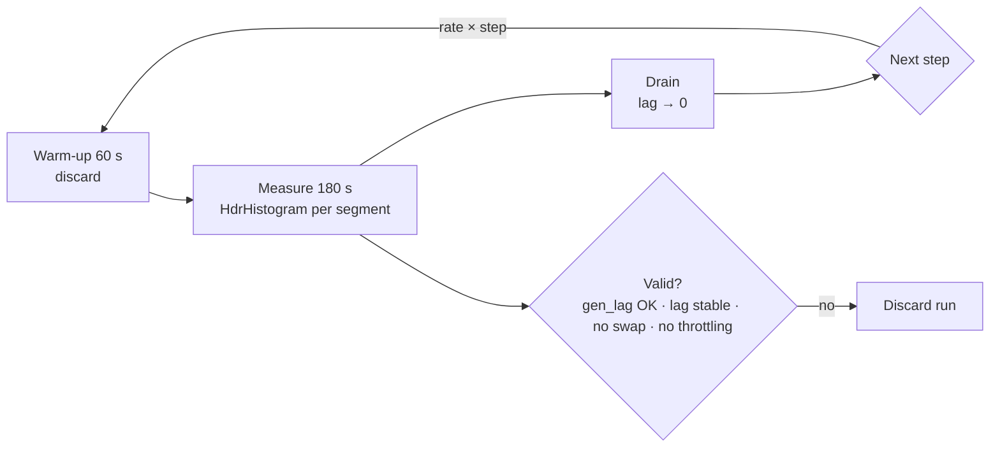

# 🔬 04 - Latency Measurement and Load Testing Methodology

"Kafka + Flink, 20k events/s, p95 80 ms" is a strong CV line — and a dangerous one if it can't survive a follow-up question: *measured how? open or closed loop? which percentile of how many samples, over how many runs, on what hardware?* This note is the methodology that makes a latency claim defensible: what to record, how to generate load without lying to yourself, how much data you need for a stable p99, and how to report results so a skeptical engineer can reproduce them.

## 🎯 Learning Objectives
- Define latency precisely: **start and end points**, per-segment vs end-to-end
- Record latency with **HdrHistogram** and understand its precision guarantees
- Explain **coordinated omission** and choose **open-loop** load models for SLO claims
- Design load tests: **step, ramp, soak, spike**; warm-up; repetitions
- Quantify **uncertainty** of percentiles (bootstrap confidence intervals) and compare configurations fairly
- Control laptop noise and write a **results manifest** that makes numbers reproducible

## Introduction

Latency measurement fails in quiet ways. The generator waits for responses and silently stops sending during stalls. The histogram averages away the tail. A single run happens to coincide with a thermal throttle. The p99 is computed from 300 samples. Each mistake produces a number that looks precise and is wrong — usually too optimistic.

The fixes are methodological, not technological: decide exactly what is being timed, generate load the way real users arrive, collect enough samples, repeat, record the conditions, and report uncertainty. The P1 benchmark protocol (step load, 60 s warm-up, 180 s measurement, 3 repetitions, manifest per run, sustained throughput defined by four conditions) is an application of this note — and the same protocol applies to P2's routing latency and P3's TTFT and freshness.

---

## 1. The Problem and Why This Solution Exists

### What exactly is "latency"?

| Definition | Start | End | What it hides |
|---|---|---|---|
| Service time | Server starts processing | Server finishes | Queueing |
| Response time (client) | Client sends | Client receives | Time the request *should* have been sent |
| **End-to-end (scheduled)** | Moment the event **was supposed** to be sent | Result observable downstream | Nothing — this is what users feel |

P1 measures end-to-end from `t_scheduled` (the generator's timetable) to the broker's `LogAppendTime` on the `decisions` topic, plus per-segment timestamps to explain where time went.

### Open vs closed systems

Schroeder, Wierman and Harchol-Balter (*Open Versus Closed: A Cautionary Tale*, NSDI 2006) showed that the **load model** changes measured performance dramatically. In a **closed** model, a fixed number of clients each wait for a response before sending the next request; in an **open** model, requests arrive according to an external process regardless of responses. Payments, messages, and API calls from many independent users are **open**. Benchmarks run closed-loop systematically understate response times under load — the effect behind coordinated omission.

---

## 2. Conceptual Deep Dive

### 2.1 Coordinated omission

If the load generator sends at a fixed interval $\Delta$ but waits for each response, a stall of duration $S$ produces **one** slow measurement instead of the $\approx S/\Delta$ slow requests that real arrivals would have experienced. The missing samples are exactly the bad ones, so tail percentiles are biased low. Two remedies:

1. **Open-loop generation** (P1's generator): schedule $t_k = t_0 + k\Delta$, send at $t_k$ regardless of earlier responses, and measure from $t_k$.
2. **Correction** (HdrHistogram's `recordValueWithExpectedInterval`): when a measurement exceeds the expected interval, back-fill the samples that would have been taken during the stall.

A simulation of the effect, with Little's law for the closed model, appears in [[../44 - High-Performance Model Serving - Triton and ONNX Runtime/03 - Triton Ensembles and perf_analyzer|Triton Ensembles and perf_analyzer]].

### 2.2 HdrHistogram

HdrHistogram (Gil Tene) records values in **log-linear buckets** sized to guarantee a configurable number of **significant digits** across a huge dynamic range, with constant memory and O(1) recording. With $d$ significant digits, the relative error of any recorded value is bounded by:

$$
\epsilon_{\text{rel}} \le 10^{-d}
\qquad d = 3 \Rightarrow \text{values within } 0.1\%
$$

A histogram tracking 1 µs to 1 hour at 3 digits uses a few tens of KB. Histograms from different processes or runs can be **added** (like Prometheus buckets), which is how per-step results are merged correctly.

### 2.3 How many samples does a percentile need?

The empirical $q$-quantile from $n$ samples is itself a random variable. Its rank uncertainty follows the binomial distribution: the number of samples below the true quantile has mean $nq$ and standard deviation $\sqrt{nq(1-q)}$. For the p99 to be pinned by, say, at least 100 samples beyond it:

$$
n (1 - q) \ge 100 \quad\Rightarrow\quad n \ge \frac{100}{1 - q}
\qquad p99 \Rightarrow n \ge 10{,}000 \qquad p99.9 \Rightarrow n \ge 100{,}000
$$

At 2,000 events/s, a 180 s measurement window gives 360,000 samples — comfortably enough for p99, borderline for p99.9. Report **bootstrap confidence intervals** for percentiles when comparing configurations.

### 2.4 Load profiles

| Profile | Shape | Answers |
|---|---|---|
| **Step** | Constant rate per step (1k, 2k, 5k…), each held long enough | Latency vs load curve; the **knee**; sustained throughput |
| Ramp | Continuously increasing rate | Quick estimate of saturation (less precise than steps) |
| **Soak** | Constant moderate rate for hours | Leaks, GC drift, state growth, compaction effects |
| Spike | Sudden burst (e.g., 2× for 60 s) | Backpressure, recovery time, autoscaling (P1 F9) |

Each step: **warm-up** (discard; JIT, caches, connection pools, consumer-group joins), **measurement** window, then **drain** (wait until lag returns to zero) before the next step.

### 2.5 Defining sustained throughput

"Max throughput" is ill-defined — any system "handles" more load if you accept unbounded latency. P1's definition: the highest step at which **all** hold:

1. p95 ≤ target (with the confidence interval reported);
2. queue/consumer lag is **stable** (slope ≈ 0) — no hidden backlog;
3. the generator kept its schedule (`gen_lag` p99 small) — the load was really applied;
4. no errors/DLQ growth.



### 2.6 Comparing two configurations

To claim "buffer-timeout 5 ms beats 100 ms", compare distributions, not single numbers: run each configuration ≥ 3 times in **interleaved** order (A, B, A, B…) to spread drift, bootstrap the difference of p95s, and report the interval. If the interval includes zero, you have not shown a difference.

---

## 3. Production Reality

### Laptop noise checklist

| Source | Effect | Control |
|---|---|---|
| Thermal throttling / battery | Random tail spikes, lower throughput | Plugged in, performance power plan, cooling pad; record CPU temperature if possible |
| Background apps (browser, IDE indexing) | CPU contention | Close them; note what remained open |
| WSL2 / Docker memory pressure | Swap → catastrophic tails | `.wslconfig` limit, `mem_limit`s; invalidate runs that swap |
| Generator on the same CPU | Generator stalls look like system stalls | Monitor `gen_lag`; more generator processes; or a second machine |
| Turbo frequency variance | Run-to-run variability | Repetitions; interleave configurations |

### Tools and their default load model

| Tool | Default model | Notes |
|---|---|---|
| **k6** | Closed (VUs) by default; **open** with `constant-arrival-rate` / `ramping-arrival-rate` executors | Use arrival-rate executors for SLO tests |
| **wrk2** | Open (constant throughput), CO-corrected | HTTP; designed around coordinated omission |
| **vegeta** | Open (constant rate) | HTTP; simple CLI |
| Locust | Closed (users with wait times) | Good for behavior scripts; not for open-loop SLO claims |
| perf_analyzer | Both (concurrency / request-rate) | Triton models ([[../44 - High-Performance Model Serving - Triton and ONNX Runtime/03 - Triton Ensembles and perf_analyzer|note]]) |
| Custom Kafka producer (P1) | Open, scheduled timestamps | Measures event pipelines end to end |

### Reporting

A results table without context is not a result. Every P1 run writes a **manifest**: git SHA, Compose profile, effective configuration (buffer timeout, batch size, parallelism), model version, CPU model and cores, RAM, OS, Docker/WSL settings, tool versions, start/end timestamps, and validity flags. The README's table cites the run IDs.

Caso real: Gil Tene's talk *How NOT to Measure Latency* walks through production systems whose dashboards showed excellent percentiles while users experienced multi-second stalls — because the measuring clients were themselves stalled (coordinated omission) or because averages and too-coarse buckets hid the tail. HdrHistogram and wrk2 came directly out of that work.

Caso real: in interviews, a candidate who says "sustained 5,000 events/s at p95 62 ms (95% CI 58–66) on an i5-10300H, open-loop, three repetitions; the bottleneck was scorer CPU" is far more credible than one who says "20k events/s" — and the methodology is what makes the smaller number impressive.

---

## 4. Code in Practice

### Recording with HdrHistogram (Python)

```python
from hdrh.histogram import HdrHistogram          # pip install hdrhistogram

h = HdrHistogram(1, 60_000_000, 3)               # 1 µs .. 60 s, 3 significant digits (values in µs)

def record(t_scheduled_ns: int, t_end_ns: int, expected_interval_us: int):
    latency_us = max(1, (t_end_ns - t_scheduled_ns) // 1000)
    h.record_value(latency_us)                   # open-loop: already measured from the schedule
    # closed-loop generators would instead use:
    # h.record_corrected_value(latency_us, expected_interval_us)   # back-fills omitted samples

for q in (50, 95, 99, 99.9):
    print(f"p{q}: {h.get_value_at_percentile(q) / 1000:.2f} ms")
encoded = h.encode()                             # compact string: store per step, merge later with .decode_and_add()
```

### k6 with an open (arrival-rate) model

```javascript
// load.js — open-loop HTTP load for P2's POST /route
import http from "k6/http";
export const options = {
  scenarios: {
    steps: {
      executor: "ramping-arrival-rate",          // OPEN model: arrivals don't wait for responses
      startRate: 50, timeUnit: "1s", preAllocatedVUs: 200, maxVUs: 1000,
      stages: [{ target: 50, duration: "1m" }, { target: 100, duration: "3m" }, { target: 200, duration: "3m" }],
    },
  },
  thresholds: { http_req_duration: ["p(95)<300"] },
};
export default function () {
  http.post("http://localhost:8000/route", JSON.stringify({ text: "me cobraron dos veces" }),
            { headers: { "Content-Type": "application/json" } });
}
```

### ❌/✅ Generator loop

```python
# ❌ Closed loop: send, wait, send — stalls pause the generator and vanish from the data
while True:
    t0 = time.perf_counter(); send_and_wait(); record(time.perf_counter() - t0)

# ✅ Open loop: send on a timetable; latency measured from the scheduled time
for k in range(N):
    t_k = start + k * interval
    sleep_until(t_k)
    send_async(event, t_scheduled=t_k)            # completion recorded downstream vs t_k
```

### 📦 Compression code: how certain is your p95, and is B really better than A?

```python
# 📦 Compression code: sample size for tail percentiles and bootstrap CIs for a p95 difference
# Covers: n ≥ 100/(1-q), bootstrap of p95, comparing two configs, interleaved repetitions
import random
import statistics

random.seed(12)
p = lambda xs, q: statistics.quantiles(xs, n=1000)[int(q * 1000) - 1]

for q in (0.95, 0.99, 0.999):
    print(f"q={q}: need n ≥ {100 / (1 - q):,.0f} samples for ~100 beyond the quantile")

def run(mu: float, sigma: float, n: int = 20_000) -> list[float]:
    return [random.lognormvariate(mu, sigma) * 1000 for _ in range(n)]   # ms

A = run(-3.0, 0.40)            # config A (e.g., buffer-timeout 100 ms)
B = run(-3.05, 0.40)           # config B: slightly faster

def bootstrap_diff(a, b, q=0.95, iters=300, k=4_000):
    diffs = sorted(p(random.choices(a, k=k), q) - p(random.choices(b, k=k), q) for _ in range(iters))
    return diffs[int(0.025 * iters)], diffs[int(0.975 * iters)]

lo, hi = bootstrap_diff(A, B)
print(f"p95 A={p(A, .95):.1f} ms  B={p(B, .95):.1f} ms  Δ 95% CI = [{lo:.1f}, {hi:.1f}] ms")
print("B is faster with confidence" if lo > 0 else "No demonstrated difference — more runs or samples needed")
# ¡Sorpresa! The ~4 ms gap clears zero only barely; cut the samples (k) and the same gap is indistinguishable from noise.
```

---

## 🎯 Key Takeaways
- Define latency from the **scheduled** start to the **observable** end; add per-segment timestamps to explain it.
- Real users form an **open** system: closed-loop generators cause **coordinated omission** and optimistic tails.
- Record with **HdrHistogram** (bounded relative error, mergeable) — never averages.
- Tail percentiles need samples: $n \ge 100/(1-q)$ → 10k for p99, 100k for p99.9.
- Use **step** tests with warm-up, measurement, and drain; define **sustained throughput** with explicit conditions.
- Compare configurations with **repetitions, interleaving, and bootstrap CIs**.
- Control laptop noise and publish a **manifest** with every number.

## References
- Schroeder, Wierman & Harchol-Balter, *Open Versus Closed: A Cautionary Tale* (NSDI 2006)
- Gil Tene, *How NOT to Measure Latency* (talk) · HdrHistogram — http://hdrhistogram.org
- Efron & Tibshirani, *An Introduction to the Bootstrap* (1993)
- k6 documentation — open vs closed models, arrival-rate executors · wrk2 README
- [[03 - SLOs, Alerting and Burn Rates|Previous: SLOs and Burn Rates]] · [[05 - LLM Observability Dashboards|Next: LLM Observability Dashboards]]
