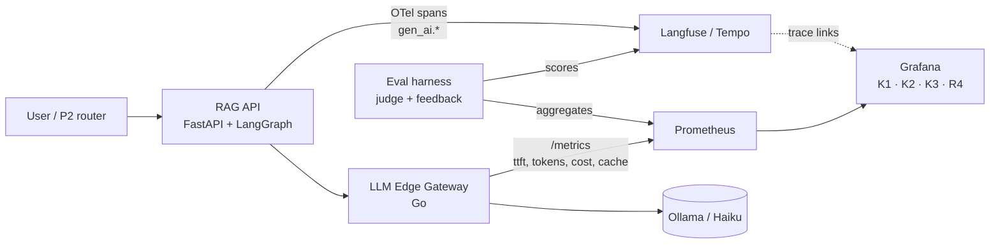

# 🤖 05 - LLM Observability Dashboards

An LLM feature can be up, fast on average, and still failing: answers stream their first token after four seconds, a prompt change doubled input tokens and the monthly bill, the semantic cache stopped hitting after a deploy, or the model began abstaining on half the questions. None of that shows in a CPU graph. LLM observability needs its own vocabulary — **TTFT, time per output token, tokens, cost, cache hits, quality scores** — and dashboards that join signals from the gateway, the application traces, and the evaluation pipeline.

## 🎯 Learning Objectives
- Decompose streaming LLM latency into **TTFT** and **time per output token (TPOT)**, and relate them to user experience
- Model **cost** per request and per successful task, including **cache** effects
- Instrument LLM calls with Prometheus metrics and **OpenTelemetry GenAI** semantic conventions
- Combine **Prometheus** (rates, histograms, cost), **Langfuse/OTel traces** (per-request detail), and **quality scores** in Grafana
- Build P3's freshness/answer/cost dashboards and P2's System 2 dashboard
- Keep LLM telemetry **cheap and safe**: bounded labels, sampling, PII handling

## Introduction

Classical service metrics assume a request either succeeds or fails within a latency. LLM calls stream: the user sees progress after the **first token** and judges responsiveness by it; total duration depends on how much the model decides to write; cost depends on tokens in and out, and on whether a cache absorbed the call; and "success" depends on whether the answer was *good*, which only an evaluation or a user can say.

This vault already covers tracing tools in depth — [[../34 - OpenTelemetry for AI Engineers/00 - Welcome to OpenTelemetry for AI Engineers|OpenTelemetry for AI Engineers]] and [[../36 - LangFuse - Open-Source LLM Observability/00 - Welcome - Why Open-Source LLM Observability|Langfuse]] — and gateway-level observability with [[../../06 - Large Language Models/27 - Portkey AI Gateway and Observability/00 - Welcome - Portkey AI Gateway and Observability|Portkey]]. This note focuses on **metrics and dashboards**: which numbers to aggregate in Prometheus, which details to leave in traces, and how to put them side by side so an on-call engineer can answer "is the assistant OK, and what is it costing us?" in one screen.

---

## 1. The Problem and Why This Solution Exists

### Why generic dashboards miss LLM failures

| Failure | Generic metric | LLM metric that catches it |
|---|---|---|
| Slow first token (prompt too long, cold start, provider queueing) | Avg request duration looks normal | **TTFT p95** |
| Verbose answers after a prompt change | Requests/s unchanged | **Output tokens per request**, cost/hour |
| Cache broken after deploy | Error rate unchanged | **Cache hit ratio** drops, cost/hour rises |
| Retrieval degraded (stale index) | Latency unchanged | **Abstention / retract rate**, faithfulness scores |
| Provider fallback active | Success rate unchanged | Requests by **provider/model**, fallback count |

### Where the data lives

- **Gateway** (the Go LLM Edge Gateway in the projects): sees every call — provider, model, tokens, cost, cache hit, latency, fallback. Ideal source of **Prometheus metrics**.
- **Application** (FastAPI + LangGraph): sees the user request, retrieval, agent steps — ideal source of **traces** (OTel → Langfuse/Tempo).
- **Evaluation** (harness, judges, user feedback): produces **quality scores** attached to traces or stored in a database.

---

## 2. Conceptual Deep Dive

### 2.1 Streaming latency

For a response of $n$ output tokens:

$$
L_{\text{total}} \approx \text{TTFT} + (n - 1)\cdot\text{TPOT}
\qquad
\text{throughput}_{\text{out}} = \frac{n}{L_{\text{total}}}
$$

- **TTFT** (time to first token) = network + queueing at the provider + **prefill** (processing the prompt, roughly proportional to input tokens) + the application's own pre-work (retrieval, grading).
- **TPOT** (time per output token, a.k.a. inter-token latency) = decode speed; users perceive streaming as smooth when it outpaces reading speed.

For RAG, the application's pre-work is often the largest TTFT component: P3's TTFT includes query embedding, hybrid retrieval, and the relevance-grading call **before** generation starts — which is why the SSE stream emits `status` events during that phase.

### 2.2 Cost

Per request with input tokens $t_{in}$, output tokens $t_{out}$, and per-million-token prices $p_{in}$, $p_{out}$:

$$
C = \frac{t_{in}\,p_{in} + t_{out}\,p_{out}}{10^6}
$$

With a semantic cache hit ratio $h$ (cached responses cost ~0) and provider-side prompt caching that discounts a fraction $f_c$ of input tokens by a factor $d$:

$$
\mathbb{E}[C] \approx (1 - h)\cdot\frac{t_{in}\,(1 - f_c + f_c d)\,p_{in} + t_{out}\,p_{out}}{10^6}
$$

The metric that matters to the business is often **cost per successful task** — cost divided by answers that were correct (or not abstained): a cheaper model that fails twice as often is not cheaper.

### 2.3 Metrics vs traces: what goes where

| Signal | Prometheus metric (aggregated, bounded labels) | Trace / span attribute (per request) |
|---|---|---|
| TTFT, total latency | Histograms by `model`, `provider`, `route` | Exact values per call |
| Tokens in/out | Counters by `model` | `gen_ai.usage.input_tokens`, `gen_ai.usage.output_tokens` |
| Cost | Counter (USD) by `model` | Computed cost attribute |
| Cache | Hit/miss counters by `cache_type` | Hit flag, similarity score |
| Prompt, completion text | ❌ never | Optional, **redacted/sampled** |
| Quality | Gauge/histogram of eval scores by `eval` | Score linked to trace ID |

OpenTelemetry's **GenAI semantic conventions** standardize attribute names (`gen_ai.system`, `gen_ai.request.model`, `gen_ai.usage.input_tokens`, `gen_ai.usage.output_tokens`, …) and metrics such as token-usage and operation-duration histograms. They are still evolving — pin the semantic-conventions version you implement.



### 2.4 Quality as a time series

Quality signals become dashboards when aggregated: **abstention rate**, **retract rate** (P3's groundedness check failed after streaming), **thumbs-down rate**, rolling **faithfulness** from sampled judge evaluations, and P2's **System 2 escalation rate**. A sudden change in any of them after a deploy is as actionable as a latency regression.

---

## 3. Production Reality

### Dashboards for the projects

| Dashboard | Top-left question | Key panels |
|---|---|---|
| **K1 Freshness & Ingestion** (P3) | Is the index fresh? | Freshness probe p50/p95; Spark batch duration vs trigger; Kafka lag |
| **K2 Answers** (P3) | Are answers fast and grounded? | TTFT p95 (warm/cold); total latency; abstention and retract rates; feedback |
| **K3 Cost & Cache** (P3) | What does it cost, and is the cache working? | USD/hour by model; tokens/request; semantic cache hit ratio; **gateway budget remaining** |
| **R4 System 2** (P2) | Is the agent worth it? | Escalation rate by reason; agent latency and steps; fallback to human; tokens per escalation |

During P3's final test with Haiku, K3's **budget remaining** panel (fed by the gateway's spend counter) is the guardrail made visible.

### Cost reconciliation

Token counts from the gateway are estimates until reconciled with the provider's usage reports. Compare daily totals; a gap usually means a code path bypassing the gateway — exactly what the "all LLM calls go through the gateway" rule prevents.

### Safety and cardinality

- Prompts and completions can contain personal data: keep them **out of metrics**, and in traces either redact, sample, or disable capture (OTel and Langfuse both support this) ([[../34 - OpenTelemetry for AI Engineers/06 - Production Patterns - Sampling Costs and PII Redaction|sampling and PII redaction]]).
- Labels: `model`, `provider`, `route`, `cache_type` — bounded. Never `prompt_hash`, `user_id`, or `session_id` on metrics.

Caso real: teams operating LLM features commonly find their first cost incident through a dashboard, not a bill: a prompt template change that appended full conversation history doubled input tokens per request; the tokens-per-request panel jumped at the deploy annotation, and the fix shipped the same day instead of at month end.

Caso real: in P2, the R4 dashboard tests the project's central claim — if the System 2 escalation rate creeps up from 10% to 30% after a data change, LLM cost per 1,000 messages triples and the "System 1 handles most traffic cheaply" thesis no longer holds. The panel turns the thesis into a monitored invariant.

---

## 4. Code in Practice

### Instrumenting LLM calls (gateway client or gateway itself)

```python
import time
from prometheus_client import Counter, Histogram

LAT_BUCKETS = (.05, .1, .2, .3, .5, .75, 1, 1.5, 2, 3, 5, 8, 13, 20)
TTFT = Histogram("llm_ttft_seconds", "Time to first token", ["model", "route"], buckets=LAT_BUCKETS)
TOTAL = Histogram("llm_request_seconds", "Total request time", ["model", "route"], buckets=LAT_BUCKETS)
TOKENS = Counter("llm_tokens_total", "Tokens", ["model", "direction"])           # direction=in|out
COST = Counter("llm_cost_usd_total", "Estimated cost in USD", ["model"])
CACHE = Counter("llm_cache_requests_total", "Semantic cache lookups", ["result"])  # hit|miss
PRICES = {"claude-haiku-4-5": (1.0, 5.0), "ollama/qwen3:1.7b": (0.0, 0.0)}       # USD per 1M tokens (verify)

def stream_completion(client, model: str, route: str, messages: list[dict]):
    t0, first, n_out = time.perf_counter(), None, 0
    for chunk in client.stream(model=model, messages=messages):    # gateway's OpenAI-compatible stream
        if first is None and chunk.text:
            first = time.perf_counter()
            TTFT.labels(model, route).observe(first - t0)
        n_out += chunk.output_tokens_delta
        yield chunk.text
    usage = client.last_usage()                                      # tokens reported by the gateway
    TOTAL.labels(model, route).observe(time.perf_counter() - t0)
    TOKENS.labels(model, "in").inc(usage.input_tokens)
    TOKENS.labels(model, "out").inc(usage.output_tokens)
    p_in, p_out = PRICES[model]
    COST.labels(model).inc((usage.input_tokens * p_in + usage.output_tokens * p_out) / 1e6)
```

### PromQL for the K3 dashboard

```promql
# USD per hour by model
sum by (model) (rate(llm_cost_usd_total[$__rate_interval])) * 3600

# TTFT p95 by route
histogram_quantile(0.95, sum by (le, route) (rate(llm_ttft_seconds_bucket[$__rate_interval])))

# Semantic cache hit ratio
sum(rate(llm_cache_requests_total{result="hit"}[$__rate_interval])) / sum(rate(llm_cache_requests_total[$__rate_interval]))

# Output tokens per request (verbosity drift)
sum(rate(llm_tokens_total{direction="out"}[$__rate_interval])) / sum(rate(llm_request_seconds_count[$__rate_interval]))
```

### OTel GenAI attributes on the generation span

```python
from opentelemetry import trace
tracer = trace.get_tracer("live-rag")

with tracer.start_as_current_span("chat claude-haiku-4-5") as span:
    span.set_attribute("gen_ai.system", "anthropic")
    span.set_attribute("gen_ai.request.model", "claude-haiku-4-5")
    span.set_attribute("gen_ai.request.max_tokens", 600)
    # … stream …
    span.set_attribute("gen_ai.usage.input_tokens", usage.input_tokens)
    span.set_attribute("gen_ai.usage.output_tokens", usage.output_tokens)
```

### ❌/✅ What to put in metrics

```python
# ❌ Unbounded labels and raw text in metrics: cardinality explosion + PII leak
COST.labels(model, prompt_text).inc(cost)

# ✅ Bounded labels in metrics; the prompt (if kept at all) lives redacted in the trace
COST.labels(model).inc(cost)
span.set_attribute("app.prompt_template_version", "rag-v7")
```

### 📦 Compression code: TTFT, TPOT, cost, and what a cache is worth

```python
# 📦 Compression code: streaming latency decomposition and cost with semantic + prompt caching
# Covers: L = TTFT + (n-1)·TPOT, cost per request, cache-adjusted expected cost, cost per successful task
import random

random.seed(6)
P_IN, P_OUT = 1.0, 5.0                                   # USD per 1M tokens (reference prices; verify)

def request(t_in: int, retrieval_ms: float) -> dict:
    prefill = 0.00002 * t_in                             # s per input token (illustrative)
    ttft = 0.15 + retrieval_ms / 1000 + prefill          # network/queue + RAG pre-work + prefill
    n_out = max(20, int(random.gauss(220, 60)))
    tpot = random.uniform(0.012, 0.02)
    return {"ttft": ttft, "total": ttft + (n_out - 1) * tpot, "t_in": t_in, "t_out": n_out}

reqs = [request(t_in=2_000, retrieval_ms=random.uniform(80, 400)) for _ in range(1_000)]
ttfts = sorted(r["ttft"] for r in reqs)
print(f"TTFT p95 = {ttfts[949]*1000:.0f} ms | mean total = {sum(r['total'] for r in reqs)/len(reqs):.2f} s")

cost = lambda t_in, t_out, f_c=0.0, d=0.1: (t_in * (1 - f_c + f_c * d) * P_IN + t_out * P_OUT) / 1e6
base = sum(cost(r["t_in"], r["t_out"]) for r in reqs) / len(reqs)
for h, f_c in ((0.0, 0.0), (0.3, 0.0), (0.3, 0.6)):
    exp_cost = (1 - h) * sum(cost(r["t_in"], r["t_out"], f_c) for r in reqs) / len(reqs)
    print(f"semantic hit={h:.0%} prompt-cached={f_c:.0%} → ${exp_cost*1000:.3f} per 1k requests"
          f" ({(1 - exp_cost / base):.0%} saved)")

for name, c, success in (("small model", base * 0.4, 0.70), ("larger model", base, 0.92)):
    print(f"{name}: ${c*1000:.3f}/1k requests, ${c/success*1000:.3f} per 1k SUCCESSFUL answers")
# ¡Sorpresa! Retrieval and grading dominate TTFT, and the 2k-token RAG context (input), not the answer, dominates cost —
# which is why prompt caching saves more than you'd guess.
```

---

## 🎯 Key Takeaways
- Streaming latency = **TTFT** + (n − 1) × **TPOT**; users judge responsiveness by TTFT, which in RAG includes retrieval and grading.
- Cost = tokens × prices; model **cache effects** explicitly and track **cost per successful task**, not just per request.
- Put **aggregates in Prometheus** (histograms, counters, bounded labels) and **details in traces** (OTel GenAI attributes, Langfuse).
- Treat **quality** as time series too: abstention, retract, feedback, judge scores, escalation rate.
- Dashboards K1–K3 (P3) and R4 (P2) turn freshness, cost, cache, and the System 1/2 thesis into monitored invariants.
- Keep prompts out of metrics; redact or sample them in traces; reconcile token costs with provider reports.

## References
- OpenTelemetry — Semantic Conventions for Generative AI (spans, metrics, `gen_ai.*` attributes)
- Langfuse documentation — OpenTelemetry ingestion, scores, cost tracking
- Anthropic documentation — pricing and prompt caching (verify current prices)
- Kwon et al., *Efficient Memory Management for LLM Serving with PagedAttention* (SOSP 2023) — prefill/decode background
- [[04 - Latency Measurement and Load Testing Methodology|Previous: Latency Measurement]] · [[00 - Welcome to Grafana and Latency Engineering|Course welcome]]
