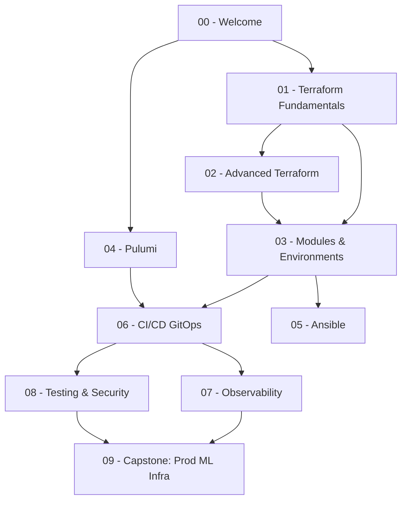

# 🏷️ 00 - Welcome to Infrastructure as Code

## 🎯 Learning Objectives

- Define Infrastructure as Code (IaC) and trace its etymology from DevOps origins to modern ML infrastructure
- Contrast manual click-ops provisioning with declarative, version-controlled infrastructure
- Articulate why IaC is non-negotiable for GPU-accelerated ML workloads ($10–100/hour)
- Navigate the course map: Terraform deep dives, Pulumi, Ansible, CI/CD/GitOps, Observability, and Security
- Identify prerequisites and internal vault connections to build a cohesive mental model

## Introduction

**Infrastructure as Code** (IaC) applies software engineering practices — version control, code review, automated testing, and declarative configuration — to the management of servers, networks, databases, and load balancers. The term crystallized around 2010 within the DevOps movement, when practitioners recognized that manual point-and-click provisioning (derisively called "click-ops") could not scale beyond a handful of servers. `Infrastructure` enters English from French (1875), originally referring to the substructure of railways. `Code` derives from Latin *codex* (book, system of laws). Together they capture the idea that your cloud topology is not a collection of ad-hoc console operations — it is a versioned, reviewable artifact governed by the same discipline as application source code.

The problem before IaC was grim. Engineers would SSH into servers, install packages by hand, tweak firewall rules from memory, and pray that the production environment matched staging. Snowflake servers — machines that had been patched so many times manually that no two were identical — were the norm. "Works on my machine" was a diagnosis, not a joke. When an instance died, recovery meant hours of manual reconstruction from (incomplete) runbooks. IaC eliminates this fragility by making infrastructure reproducible: a `terraform apply` or `pulumi up` rebuilds an entire environment from a configuration file in minutes.

For ML/AI engineers, the stakes are higher still. A single `p4d.24xlarge` GPU instance costs roughly $32/hour on-demand. Clusters of 32 GPUs burn through $1,000/hour. Reproducing a training environment manually after a failure wastes thousands of dollars and hours of researcher time. IaC captures your VPC layout, security group rules, S3 bucket policies, and GPU instance configurations in a Git repository — versioned, peer-reviewed, and reproducible. Your ML infrastructure deserves the same rigor as your model code. This course builds on foundational cloud knowledge from [[10 - Cloud, Infra y Backend/22 - Cloud Computing/00 - Bienvenida|Cloud Computing]] and connects deeply with [[10 - Cloud, Infra y Backend/24 - Backend para ML/04 - Autenticacion y Seguridad en APIs|Backend Security]], [[10 - Cloud, Infra y Backend/29 - Distributed ML Infrastructure/00 - Welcome|Distributed ML]], and Go-native infrastructure tooling explored in [[13/02 - Go for Cloud Native|Go Cloud Native]].

---

## 1. The Click-Ops Problem and the IaC Promise

Before IaC, provisioning a production service looked like this: log into the AWS console, click "Launch Instance," select an AMI from memory, manually configure security groups, assign tags inconsistently, and hope the result matches the staging environment that Bob configured three months ago. Bob left the company last week. This workflow — manual, undocumented, unreproducible — is **click-ops**. It produces:

- **Configuration drift**: Production diverges from staging because manual changes accumulate.
- **Secret tribal knowledge**: Only one person knows how the VPC peering was set up.
- **Disaster recovery latency**: Rebuilding from scratch takes days, not minutes.
- **Audit invisibility**: No git log, no blame, no PR discussion.

IaC replaces all of this with a single workflow: write configuration → commit to Git → open PR → review → merge → CI/CD applies. Every change has an author, a timestamp, a diff, and a reviewer. Rollback is `git revert` plus a new plan/apply cycle.

**❌ Click-ops antipattern**: Bob opens the AWS console, manually changes a security group rule to allow port 8080, clicks "Save." No record exists. Six months later, the security audit finds an open port that nobody can explain.

**✅ IaC pattern**: Bob edits `security_groups.tf`, changes `from_port = 8080`, opens a PR. Alice reviews and asks "Why port 8080?" Bob responds inline. The merged PR is the permanent record. Jenkins/GitHub Actions runs `terraform plan` and `terraform apply`.

## 2. The ML/AI Infrastructure Imperative

Consider a production ML training pipeline: a GPU cluster reads from an S3 data lake, writes checkpoints to EFS, reports metrics to Prometheus, and serves the trained model behind an ALB. That's 7–10 distinct cloud resources, each with networking, authentication, and lifecycle configuration. Manual provisioning guarantees misconfiguration. The cost of failure — a misconfigured security group that blocks gradient sync between GPUs — can mean a $5,000 training job that silently fails.

¡Sorpresa! Academia historically treated infrastructure as "someone else's problem." Industry reality: the most productive ML engineers own their infrastructure end-to-end because infrastructure bugs (wrong instance type, missing IAM role, EBS volume too small) are the hardest to debug. IaC makes infrastructure explicable.

**Caso real: Stripe** manages 200+ AWS accounts across multiple business units using Terraform. Their monorepo contains 50,000+ lines of HCL and 300+ modules. Every infrastructure change — from adding a new S3 bucket to provisioning a new RDS cluster — goes through PR review. Engineers cannot apply changes directly; Terraform Cloud enforces policy-as-code with Sentinel. The result: zero un-reviewed production changes, full audit trail, and the ability to clone entire environments for load testing.

## 3. Course Architecture

This course is organized into 9 core notes that take you from Terraform fundamentals to production ML infrastructure:

| Note | Focus Area | Key Tool |
|------|-----------|----------|
| 00 | Welcome & Motivation | — |
| 01 | Terraform Fundamentals — HCL, State, DAG | Terraform |
| 02 | Advanced Terraform — Loops, Functions, Lifecycle | Terraform |
| 03 | Modules, Workspaces & Multi-Environment Patterns | Terraform |
| 04 | Pulumi — IaC in Go and Python | Pulumi |
| 05 | Ansible for Configuration Management | Ansible |
| 06 | CI/CD for Infrastructure — GitOps | GitHub Actions, ArgoCD |
| 07 | Observability & Drift Detection | Datadog, tfsec |
| 08 | Testing & Security for IaC | Terratest, Checkov, OPA |
| 09 | Capstone: Production ML Infrastructure | All tools |

Prerequisites: familiarity with basic cloud concepts (regions, VMs, object storage), comfort with the command line, and understanding of Git workflows. Prior exposure to [[10 - Cloud, Infra y Backend/22 - Cloud Computing/01 - Fundamentos de Cloud y Modelos de Servicio|Cloud Fundamentals]] and [[10 - Cloud, Infra y Backend/22 - Cloud Computing/04 - Redes y Seguridad en Cloud|Cloud Networking]] is assumed.



---

## 🎯 Key Takeaways

- IaC replaces manual click-ops with version-controlled, reviewable, reproducible configurations — every change has a git log entry and a reviewer
- For ML/AI workloads running on GPU clusters at $10–100+/hour, IaC is not optional: a misconfiguration that wastes 2 hours of GPU time costs real money
- Terraform and Pulumi share the same provider engine (gRPC plugins) but offer different authoring experiences: declarative HCL vs general-purpose Go/Python/TypeScript
- The course progresses from HCL syntax through advanced Terraform patterns, then to Pulumi for Go-native IaC, and finally to CI/CD, security, and a production capstone
- Every note teaches both the abstract model (DAGs, state machines, dependency graphs) and the concrete syntax you need to write production configs
- Snowflake servers are a solved problem: IaC + immutable infrastructure + GitOps = deterministic, auditable infrastructure
- The industry standard for production IaC is directory-per-environment with remote state, module composition, and CI/CD gating on plan output

## 📦 Código de Compresión

```hcl
# terraform-backend.tf — Remote state with locking (S3 + DynamoDB)
terraform {
  required_version = ">= 1.5.0"
  required_providers {
    aws = {
      source  = "hashicorp/aws"
      version = "~> 5.0"
    }
  }
  backend "s3" {
    bucket         = "ml-infra-tfstate-prod"
    key            = "00-welcome/terraform.tfstate"
    region         = "us-east-1"
    encrypt        = true
    dynamodb_table = "terraform-locks"
  }
}

provider "aws" {
  region = "us-east-1"
}

resource "aws_instance" "ml_demo" {
  ami           = "ami-0c55b159cbfafe1f0"
  instance_type = "g4dn.xlarge"

  tags = {
    Name        = "ml-demo-instance"
    Environment = "demo"
    ManagedBy   = "Terraform"
  }
}
```

⚠️ The `backend "s3"` block cannot use Terraform variables — it must be hardcoded or generated by tools like Terragrunt. This is a deliberate design choice: backend configuration must be statically known before variable resolution.

💡 Always enable `encrypt = true` on your S3 backend. State files contain resource IDs, IPs, and sometimes secrets in plaintext. Encryption at rest is a one-line config that prevents a major security incident.

---

## References

- Humble, J., & Farley, D. (2010). *Continuous Delivery*. Addison-Wesley. — The book that introduced infrastructure automation as a core DevOps practice.
- Morris, K. (2016). *Infrastructure as Code: Managing Servers in the Cloud*. O'Reilly Media. — First comprehensive treatment of IaC patterns: snowflake servers, configuration drift, immutable infrastructure.
- HashiCorp. (2024). *Terraform Documentation*. https://developer.hashicorp.com/terraform — Primary reference for HCL syntax, provider architecture, and state management.
- Pulumi. (2024). *Pulumi Documentation*. https://www.pulumi.com/docs/ — Go/Python/TypeScript IaC SDK reference.
- [[10 - Cloud, Infra y Backend/22 - Cloud Computing/00 - Bienvenida|Cloud Computing]]
- [[10 - Cloud, Infra y Backend/22 - Cloud Computing/01 - Fundamentos de Cloud y Modelos de Servicio|Cloud Fundamentals]]
- [[13/02 - Go for Cloud Native]]
- [[10 - Cloud, Infra y Backend/29 - Distributed ML Infrastructure/00 - Welcome|Distributed ML Infrastructure]]
- [[09/29 - CI-CD for ML]]
- [[16/08 - SDD File Structures]]
