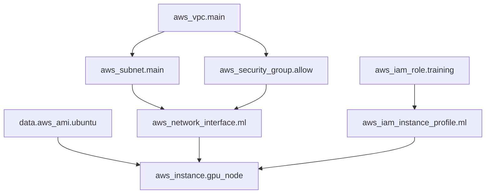

# 🏗️ 01 - Terraform Fundamentals — HCL, State, and the Resource Graph

## 🎯 Learning Objectives

- Articulate the declarative execution model: desired state → dependency graph → parallel resource operations
- Master HCL block types (resource, data, provider, variable, output, module, locals, terraform) and their type system
- Understand the resource graph as a Directed Acyclic Graph (DAG) that Terraform walks for parallel execution
- Deep-dive into the state file (`terraform.tfstate`): what it stores, why locking matters, and remote vs local
- Configure provider architecture: gRPC plugins, version pinning, and multi-region provider aliases
- Use variables, locals, and outputs as the module interface contract
- Distinguish workspaces from directory-per-environment patterns

## Introduction

Terraform is **not** a scripting tool. It does not execute commands in sequence. It is a declarative state machine: you describe the infrastructure you want, Terraform builds a Directed Acyclic Graph (DAG) of resources, resolves the dependency order, and applies changes to converge on your declared state. The name "Terraform" combines Latin *terra* (earth, land) with "form" — literally "to shape the earth." HashiCorp chose it to evoke the idea of shaping cloud infrastructure as deliberately as a landscape architect shapes physical terrain.

Understanding Terraform's core engine — the DAG builder, the state file, and the provider plugin model — is the difference between someone who can run `terraform apply` and someone who can debug why their plan shows 47 unexpected destroys. The HCL language sits on top of this engine as a domain-specific configuration language, but the real work happens in the plan/apply cycle that reads state, calls provider APIs, computes diffs, and executes parallel resource operations.

For ML infrastructure, this matters because GPU clusters involve tightly coupled resources: VPCs, subnets, security groups, IAM roles, instance profiles, EFS filesystems, S3 endpoints, and the GPU instances themselves. Each resource depends on others; misorder one dependency and your training job fails silently. The DAG gives you a visual, mathematically-grounded model of these dependencies. Paired with strong cloud fundamentals from [[10 - Cloud, Infra y Backend/22 - Cloud Computing/00 - Bienvenida|Cloud Computing]] and deployment patterns from [[09/20 - Deployment y Serving|Deployment]], Terraform becomes the backbone of reproducible ML infrastructure.

---

## 1. Declarative vs Imperative Infrastructure

Imperative tools (Ansible playbooks, bash scripts, AWS CLI commands) prescribe step-by-step procedures: "Create a VPC. Then create a subnet. Then create an internet gateway. Then attach it." If step 3 fails, the script halts at an unpredictable state. Declarative tools (Terraform, Pulumi, CloudFormation) describe the end state: "I want a VPC with this CIDR, one subnet, and an internet gateway attached." Terraform determines the order of operations.

Let the desired state be $\mathbf{S}_d$ and the actual state (from the provider API) be $\mathbf{S}_a$. Terraform's plan computes the difference:

$$\Delta = \mathbf{S}_d \ominus \mathbf{S}_a$$

where $\ominus$ is not simple subtraction — it includes create, update-in-place, and destroy-and-recreate operations determined by provider schemas. The execution engine converts $\Delta$ into an ordered sequence of API calls respecting dependency constraints.

**Caso real: HashiCorp** practices "dogfooding": Terraform Cloud — their SaaS platform — provisions its own infrastructure using Terraform. Every Terraform release is tested against HashiCorp's own production environment. Engineers who build the DAG engine use the DAG engine to manage the servers that run the DAG engine. This closed loop means bugs in `terraform plan` diffing are caught before release because HashiCorp's own infrastructure would break.

**❌ Imperative antipattern**:
```bash
# Snowflake provisioning script — fragile, unreproducible, no rollback
aws ec2 create-vpc --cidr-block 10.0.0.0/16
sleep 10  # Hope the VPC is ready
aws ec2 create-subnet --vpc-id vpc-??? --cidr-block 10.0.1.0/24
# What if the VPC ID changed? What if subnet creation failed?
```

**✅ Declarative pattern**:
```hcl
resource "aws_vpc" "main" {
  cidr_block = "10.0.0.0/16"
}
resource "aws_subnet" "main" {
  vpc_id     = aws_vpc.main.id
  cidr_block = "10.0.1.0/24"
}
```

Terraform sees `aws_subnet.main` references `aws_vpc.main.id`, builds the dependency edge, and creates the VPC first — no `sleep 10`, no manual ID extraction.

---

## 2. HCL — The HashiCorp Configuration Language

HCL is a declarative, JSON-compatible configuration language designed for human readability. It is not Turing-complete: no while loops, no recursion, no mutable variables. This constraint is deliberate — it makes static analysis, policy enforcement, and plan computation tractable.

### 2.1 Block Types and Their Semantics

| Block Type | Purpose | Key Properties |
|------------|---------|----------------|
| `terraform {}` | Top-level configuration: required providers, backend, required Terraform version | Must appear first; parsed before all other blocks |
| `provider {}` | Configures a cloud/SaaS API plugin | Supports multiple aliases for multi-region/multi-account |
| `resource {}` | Declares a cloud resource to manage | `resource "type" "name" { ... }` — type is provider-specific, name is local reference |
| `data {}` | Fetches read-only data from a provider at plan/apply time | `data "aws_ami" "latest" { ... }` — queries without creating |
| `variable {}` | Declares an input variable with optional type, default, validation, and sensitive flag | Typed: `string`, `number`, `bool`, `list(...)`, `map(...)`, `object({...})`, `tuple([...])` |
| `output {}` | Exports a computed value for CLI display, module composition, or `terraform_remote_state` | Supports `sensitive = true`, `depends_on`, and `precondition` blocks |
| `locals {}` | Computed named values scoped to the module | `locals { name = "${var.env}-${var.project}" }` — DRY for repeated expressions |
| `module {}` | Calls a child module | `source` parameter determines module location (local path, registry, git) |

### 2.2 HCL Type System

HCL's type system is structural, not nominal. Constraints are checked at plan time — not at `terraform validate` time, which only checks syntax. ¡Sorpresa! `terraform validate` only checks HCL syntax and basic reference validity. It does **not** validate that a `map(string)` variable passed to a module expecting `object({cidr = string, public = bool})` is type-compatible. Only `terraform plan` catches structural type mismatches when providers try to consume the values.

```hcl
variable "instance_config" {
  type = object({
    name         = string
    instance_type = string
    gpu_count    = optional(number, 0)   # HCL 1.3+: optional with default
    tags         = map(string)
  })
  validation {
    condition     = contains(["g4dn.xlarge", "p3.2xlarge", "p4d.24xlarge"], var.instance_config.instance_type)
    error_message = "Instance type must be a GPU-enabled type."
  }
}
```

Type conversion follows coercion rules: `"8080"` coerces to `8080` for number-typed arguments. Lists coerce to sets (deduplicating), but sets do NOT coerce to lists (ordering is ambiguous). The `any` type disables type checking — useful for passthrough variables but loses static guarantees.

### 2.3 Variable Validation and Preconditions

```hcl
variable "training_port" {
  type    = number
  default = 8080
  validation {
    condition     = var.training_port > 0 && var.training_port < 65536
    error_message = "Port must be between 1 and 65535."
  }
}
```

HCL 1.2+ also supports `precondition` and `postcondition` blocks inside resource and data blocks — these run at plan/apply time against live data:

```hcl
resource "aws_s3_bucket" "model_registry" {
  bucket = "ml-models-${var.environment}"

  lifecycle {
    precondition {
      condition     = length(var.environment) <= 10
      error_message = "Environment name must be <= 10 chars for S3 bucket naming."
    }
  }
}
```

---

## 3. The Resource Graph — Terraform's DAG Engine

### 3.1 Graph Construction

After parsing `.tf` files, Terraform builds a Directed Acyclic Graph $G = (V, E)$ where:

- $V$ = the set of all resources and data sources in the configuration
- $E = \{(a, b) \mid a \text{ depends on } b\}$ — a directed edge means "a must be created/updated after b"

Edges are discovered by scanning for **resource references**: any use of `aws_security_group.allow.id` in resource `aws_instance.web` creates an edge from `aws_instance.web` to `aws_security_group.allow`. The reference syntax is `resource_type.resource_name.attribute`. Terraform traverses nested expressions, interpolated strings, and `for_each` maps to find all references.

**Implicit edges** come from reference resolution. **Explicit edges** come from the `depends_on` meta-argument — needed when Terraform cannot infer a dependency (e.g., an IAM policy that the provider's API depends on but HCL doesn't reference):

```hcl
resource "aws_iam_role_policy" "s3_access" {
  depends_on = [aws_s3_bucket.model_data]  # ⚠️ Only when no HCL reference exists
  name   = "s3-access"
  role   = aws_iam_role.training_role.id
  policy = data.aws_iam_policy_document.s3_access.json
}
```

### 3.2 Parallel Execution Strategy

Terraform walks the DAG in topological order. Resources with no dependencies (indegree = 0) form the first wave and execute in parallel (up to `-parallelism=N`, default 10). As resources complete, their dependents become eligible. This gives:

$$T_{apply} = \max_{\text{paths } p} \sum_{v \in p} t_{\text{api}}(v)$$

where $t_{\text{api}}(v)$ is the provider API call duration for resource $v$. The critical path determines total apply time. For ML infrastructure, this means your 32 GPU instances provision in parallel (not sequentially), reducing a 16-hour sequential deployment to ~30 minutes.

**Caso real: Netflix** manages thousands of EC2 instances across multiple regions using Terraform. Their auto-scaling group definitions depend on launch templates, which depend on AMI data sources, which depend on security groups, which depend on VPCs. Terraform's DAG engine resolves this 5-level dependency chain and provisions the critical path in minutes. Without parallel execution, provisioning a single region would take hours.



Every resource in this graph that has no incoming edges (VPC, AMI data source, IAM role) provisions in parallel. EC2 starts only after all four of its predecessors complete.

---

## 4. State File Deep Dive

### 4.1 What State Stores

`terraform.tfstate` is a JSON file that maps your HCL resource names to real-world resource IDs and attributes:

```json
{
  "resources": [{
    "type": "aws_instance",
    "name": "gpu_node",
    "provider": "provider[\"registry.terraform.io/hashicorp/aws\"]",
    "instances": [{
      "attributes": {
        "id": "i-0abcd1234efgh5678",
        "arn": "arn:aws:ec2:us-east-1:123456789012:instance/i-0abcd1234efgh5678",
        "private_ip": "10.0.1.45",
        "public_ip": "54.123.45.67"
      }
    }]
  }]
}
```

Without the state file, Terraform cannot diff desired vs actual — it would try to create resources that already exist or fail to track deletions. ¡Sorpresa! Deleting the state file does **not** destroy your resources. It makes Terraform forget they exist. A subsequent `terraform apply` will attempt to create duplicates, causing API errors (e.g., "security group sg-xxx already exists"). Recovery requires `terraform import` to re-associate each real resource with its HCL declaration.

### 4.2 Remote State and Locking

For team workflows, the state file lives in a shared, versioned, encrypted backend — typically S3 (AWS), GCS (GCP), or Azure Blob Storage. Locking prevents concurrent applies: if engineer A runs `terraform apply`, engineer B's `terraform apply` blocks until A finishes.

```hcl
terraform {
  backend "s3" {
    bucket         = "ml-infra-tfstate-prod"
    key            = "gpu-cluster/terraform.tfstate"
    region         = "us-east-1"
    encrypt        = true
    dynamodb_table = "terraform-locks"  # ← Locking via DynamoDB
  }
}
```

The locking semantics use DynamoDB's conditional writes. Terraform writes a lock item with a unique operation ID; concurrent applies see the lock and block. DynamoDB's strong consistency guarantees that exactly one apply holds the lock at any time.

$$ \text{Lock}(operation\_id) = \text{DynamoDB.PutItem}(\text{LockID}, \text{OperationID}, \text{ConditionExpression: "attribute\_not\_exists(LockID)"}) $$

If the condition fails, the lock is already held. Terraform polls with exponential backoff. If an apply crashes, the lock persists — use `terraform force-unlock LOCK_ID` as a last resort (only after confirming no apply is actually running).

### 4.3 State Encryption and Sensitivity

State files often contain plaintext secrets: database passwords, API keys in `user_data`, private IPs. The `sensitive = true` flag on outputs and variables prevents display in the CLI, but the values **are still stored in the state file in plaintext**. AWS S3 server-side encryption (SSE-S3 or SSE-KMS) encrypts at rest. Always enable it.

```hcl
output "database_password" {
  value     = random_password.db.result
  sensitive = true   # Hides from CLI output, but stored in state!
}
```

⚠️ `sensitive = true` is **not** encryption. The value is still in the JSON state file. It only suppresses terminal output. Use a secrets manager (AWS Secrets Manager, HashiCorp Vault) for production secrets rather than relying on state file sensitivity flags.

---

## 5. Provider Architecture

Terraform providers are gRPC plugins that translate between Terraform Core's abstract resource model and a specific cloud API. When you write `resource "aws_instance"`, the `hashicorp/aws` provider handles every lifecycle operation (create, read, update, delete) by calling the AWS API.

### 5.1 Provider Resolution

```hcl
terraform {
  required_providers {
    aws = {
      source  = "hashicorp/aws"
      version = "~> 5.50"   # Pin major.minor: 5.50 ≤ version < 6.0
    }
  }
}
```

`terraform init` reads `required_providers`, downloads the specified versions from the Terraform Registry (or a private registry), and installs them into `.terraform/providers/`. The `.terraform.lock.hcl` file records exact versions and content hashes for reproducible installs — commit this file to Git.

### 5.2 Multi-Region with Provider Aliases

```hcl
provider "aws" {
  region = "us-east-1"
}

provider "aws" {
  alias  = "west"
  region = "us-west-2"
}

resource "aws_instance" "east" {
  provider = aws           # Implicit default
  # ...
}

resource "aws_instance" "west" {
  provider = aws.west      # Explicit alias
  # ...
}
```

Each provider alias maintains its own API client, credentials, and rate-limit state. Terraform treats them as separate nodes in the provider graph.

💡 For ML training clusters spanning multiple regions (e.g., data in us-east-1, training in us-west-2 where GPU spot instances are cheaper), provider aliases let you manage the entire topology in a single Terraform root module.

---

## 6. Variables, Locals, Outputs — The Module Contract

These three block types define a module's public interface. Variables are inputs (the function parameters). Locals are internal computed values. Outputs are return values consumed by parent modules or `terraform_remote_state`.

```hcl
# Inputs
variable "environment" {
  type    = string
  default = "dev"
}

variable "gpu_configs" {
  type = map(object({
    instance_type = string
    gpu_count     = number
  }))
}

# Internal computation
locals {
  name_prefix = "${var.environment}-ml"
  total_gpus  = sum([for c in var.gpu_configs : c.gpu_count])
}

# Outputs
output "instance_ips" {
  value       = aws_instance.gpu_nodes[*].private_ip
  description = "Private IPs of all GPU training nodes"
}
```

Locals are evaluated at plan time and cannot depend on resource attributes that don't yet exist. They are purely a DRY mechanism — any expression used more than once should become a local.

---

## 7. Workspaces

Terraform workspaces provide lightweight environment separation using a single configuration directory:

```bash
terraform workspace new staging
terraform workspace select staging
terraform apply -var-file="staging.tfvars"
```

Each workspace has its own state file (stored in the backend with a workspace prefix). This is simple but limited: all environments share the same backend configuration, the same provider configuration, and the same `terraform {}` block. For production, the directory-per-environment pattern ([[03 - Terraform Modules - Workspaces and Multi-Environment Patterns]]) offers stronger isolation.

---

## 🎯 Key Takeaways

- Terraform is a declarative DAG engine: it builds a resource graph, topologically sorts it, and executes operations in parallel — not a sequential script
- The state file is the JSON bridge between HCL and reality; losing it means Terraform forgets all resources exist; remote state + locking (S3 + DynamoDB) is mandatory for teams
- HCL is deliberately not Turing-complete to enable static analysis, but it has a rich type system (primitives + collections + structural objects) and validation blocks
- Reference resolution (`aws_vpc.main.id`) creates implicit DAG edges; `depends_on` adds explicit edges only when HCL cannot infer the dependency
- Providers are gRPC plugins — `terraform init` downloads them, `.terraform.lock.hcl` pins them, and aliases enable multi-region/multi-account
- Variables, locals, and outputs form the module contract: inputs, internal constants, and exported values
- Workspaces share backend configuration; directory-per-environment (covered in Note 03) provides true isolation for production workloads

## 📦 Código de Compresión

```hcl
terraform {
  required_version = ">= 1.5.0"
  required_providers {
    aws = {
      source  = "hashicorp/aws"
      version = "~> 5.0"
    }
  }
  backend "s3" {
    bucket         = "ml-tfstate"
    key            = "fundamentals/terraform.tfstate"
    region         = "us-east-1"
    encrypt        = true
    dynamodb_table = "terraform-locks"
  }
}

variable "environment" {
  type    = string
  default = "dev"
}

locals {
  name = "${var.environment}-ml-infra"
}

resource "aws_vpc" "main" {
  cidr_block           = "10.0.0.0/16"
  enable_dns_support   = true
  enable_dns_hostnames = true
  tags = { Name = "${local.name}-vpc" }
}

resource "aws_subnet" "public" {
  vpc_id                  = aws_vpc.main.id
  cidr_block              = "10.0.1.0/24"
  map_public_ip_on_launch = true
  tags = { Name = "${local.name}-subnet" }
}

resource "aws_security_group" "allow_ssh" {
  name        = "${local.name}-ssh"
  description = "Allow SSH inbound"
  vpc_id      = aws_vpc.main.id

  ingress {
    from_port   = 22
    to_port     = 22
    protocol    = "tcp"
    cidr_blocks = ["0.0.0.0/0"]  # ⚠️ Restrict to your IP in production!
  }

  egress {
    from_port   = 0
    to_port     = 0
    protocol    = "-1"
    cidr_blocks = ["0.0.0.0/0"]
  }
}

data "aws_ami" "ubuntu" {
  most_recent = true
  filter {
    name   = "name"
    values = ["ubuntu/images/hvm-ssd/ubuntu-jammy-22.04-amd64-server-*"]
  }
  owners = ["099720109477"]
}

resource "aws_instance" "ml_node" {
  ami           = data.aws_ami.ubuntu.id
  instance_type = "g4dn.xlarge"
  subnet_id     = aws_subnet.public.id
  vpc_security_group_ids = [aws_security_group.allow_ssh.id]

  tags = { Name = "${local.name}-gpu-node" }
}

output "instance_public_ip" {
  value       = aws_instance.ml_node.public_ip
  description = "Public IP of the ML GPU node"
}
```

💡 Use `data.aws_ami` instead of hardcoding AMI IDs — AMIs differ per region and are updated regularly. Canonical publishes new Ubuntu AMIs every few weeks; `most_recent = true` guarantees you always get the latest patched image.

⚠️ The `0.0.0.0/0` CIDR on SSH ingress is for demonstration only. In production, restrict it to your office VPN CIDR range. A wide-open SSH port is the #1 cause of cryptomining compromise on cloud accounts.

---

## References

- HashiCorp. (2024). *Terraform Language Documentation*. https://developer.hashicorp.com/terraform/language — Definitive reference for HCL syntax, types, and functions.
- HashiCorp. (2024). *Terraform State and Backends*. https://developer.hashicorp.com/terraform/language/state — State file internals, remote backends, and locking.
- Brikman, Y. (2022). *Terraform: Up & Running*, 3rd ed. O'Reilly Media. — The canonical book on Terraform in production.
- Hunt, A., & Thomas, D. (1999). *The Pragmatic Programmer*. Addison-Wesley. — Origin of "DRY" and "don't repeat yourself" that locals embody.
- [[10 - Cloud, Infra y Backend/22 - Cloud Computing/01 - Fundamentos de Cloud y Modelos de Servicio|Cloud Fundamentals]]
- [[10 - Cloud, Infra y Backend/22 - Cloud Computing/04 - Redes y Seguridad en Cloud|Cloud Networking]]
- [[09/20 - Deployment y Serving]]
- [[10 - Cloud, Infra y Backend/29 - Distributed ML Infrastructure/00 - Welcome|Distributed ML Infra]]
