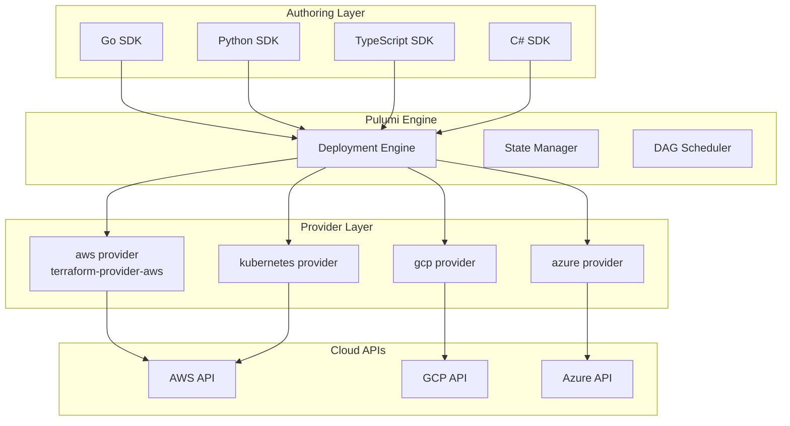

# 🐹 04 - Pulumi — Infrastructure as Code with Go and Python

## 🎯 Learning Objectives

- Understand Pulumi's architecture: same Terraform providers, different authoring frontend (Go, Python, TypeScript, C#)
- Write production Pulumi programs in Go with full type safety, IDE support, and unit tests
- Compare Pulumi vs Terraform across dimensions: language flexibility, testing, community, and operational maturity
- Leverage Go's concurrency and type system for dynamic infrastructure — compute instance counts, GPU type selection, and conditional resources
- Apply Pulumi's testing framework with `pulumi.WithMocks()` for unit tests and integration tests that deploy-and-destroy
- Articulate when to choose Pulumi (software engineering teams, complex logic) vs Terraform (infrastructure teams, simple topologies)

## Introduction

Pulumi asks a simple question that had profound consequences for the IaC landscape: what if you could use real programming languages instead of a domain-specific configuration language? Under the hood, Pulumi uses the **exact same Terraform providers**. When you `pulumi up`, the Pulumi engine translates your Go (or Python, or TypeScript) code into the same gRPC calls to the same `hashicorp/aws` provider binary that Terraform uses. The state engine, the DAG, the dependency graph — all conceptually identical. The difference is entirely in the authoring experience: instead of writing HCL, you write Go.

The name "Pulumi" comes from the Māori word *pulumi*, meaning "to embrace" or "to encompass." Pulumi Inc. founders (former Microsoft Cloud executives) chose it to evoke the idea of infrastructure that embraces the full power of general-purpose programming. The tool was launched in 2018, and as of 2024 has surpassed 1 billion cumulative downloads. For a vault with 73+ Go notes — including [[13/02 - Go for Cloud Native|Go Cloud Native]] and [[13/04 - DevSecOps and CLI Tools|DevSecOps Go]] — Pulumi is the natural IaC choice. Your infrastructure becomes Go code in the same monorepo, reviewed by the same team, tested with the same `go test` command, and deployed through the same CI pipeline.

This matters concretely for ML infrastructure. In HCL, computing the number of GPU instances based on model size, desired parallelism, and spot instance availability requires fragile combinations of `count`, `for`, and `locals`. In Go, it's a function. In HCL, conditional resource creation (only deploy the GPU cluster if a flag is set) requires the `count = var.enable_gpu ? 1 : 0` idiom. In Go, it's an `if` statement. Pulumi does not replace Terraform — it extends the same infrastructure engine with the expressive power of general-purpose languages. Foundational IaC concepts (state, DAG, providers) are covered in [[01 - Terraform Fundamentals - HCL, State and Resource Graph|Note 01]].

---

## 1. Pulumi Architecture

Pulumi's architecture is a layered stack that reuses Terraform's provider ecosystem:



Your code calls the Pulumi SDK (e.g., `ec2.NewInstance(ctx, "ml-node", &ec2.InstanceArgs{...})`). The SDK registers this resource with the Pulumi engine. The engine builds a dependency graph, resolves outputs (which are async values), and orchestrates calls to the provider plugins. The providers are unmodified Terraform provider binaries — Pulumi's "bridge" technology translates between Pulumi's gRPC interface and the Terraform provider protocol.

**Caso real: Pulumi** practices "dogfooding" at scale. Pulumi Cloud — their SaaS platform — provisions its own infrastructure using Pulumi. Their monorepo contains Go microservices and Pulumi infrastructure programs side by side. The same Go compiler checks that API handler code and infrastructure code are type-consistent. The same `go test` suite runs unit tests on business logic and infrastructure declarations. The same CI pipeline deploys both. This tight integration eliminates the impedance mismatch that teams experience when using HCL for infrastructure and Go for application code.

---

## 2. Go SDK Deep Dive

### 2.1 Program Structure

Every Pulumi Go program follows the same pattern:

```go
package main

import (
    "github.com/pulumi/pulumi-aws/sdk/v6/go/aws/ec2"
    "github.com/pulumi/pulumi/sdk/v3/go/pulumi"
)

func main() {
    pulumi.Run(func(ctx *pulumi.Context) error {
        // Infrastructure code goes here
        vpc, err := ec2.NewVpc(ctx, "main", &ec2.VpcArgs{
            CidrBlock: pulumi.String("10.0.0.0/16"),
        })
        if err != nil {
            return err
        }

        ctx.Export("vpcId", vpc.ID())
        return nil
    })
}
```

Key patterns:

- `pulumi.Run(func(ctx *pulumi.Context) error { ... })` is the entry point. The closure receives a context object used to register all resources.
- Resource constructors follow the pattern `ec2.New<Resource>(ctx, "logicalName", &<Resource>Args{...})`. The logical name (second argument) is the Terraform resource name equivalent — it must be unique within the program.
- `pulumi.String()`, `pulumi.Int()`, `pulumi.Bool()` wrap primitive values into Pulumi's output type system.
- `ctx.Export("name", value)` is equivalent to a Terraform `output` block. Values appear in `pulumi stack output`.

### 2.2 Inputs and Outputs — The Async Value System

Pulumi's type system distinguishes between **Inputs** (values that may be known only at deployment time) and **Outputs** (async values resolved after resource creation). This is the Go type-safe equivalent of Terraform's reference resolution:

```go
// Input: a static string known at compile time
sgName := pulumi.String("ml-sg")

// Output: resolved after the security group is created
sg, err := ec2.NewSecurityGroup(ctx, "ml-sg", &ec2.SecurityGroupArgs{
    Name: sgName,  // Input — known now
})
// sg.ID() returns pulumi.StringOutput — an async value
// sg.VpcId returns pulumi.StringOutput — resolved from the AWS API

// Apply transforms an Output value: the closure runs AFTER the value resolves
sg.ID().ApplyT(func(id string) string {
    return fmt.Sprintf("sg-%s-production", id)
})
```

The `ApplyT` method on `Output[T]` is Pulumi's functional transformation: it registers a callback that executes when the async value resolves. This is how you chain operations that depend on resource attributes. Pulumi tracks these dependencies and builds the DAG from them — exactly like Terraform does with reference resolution, but enforced by Go's type system at compile time.

### 2.3 Creating Resources with Full Type Safety

```go
vpc, err := ec2.NewVpc(ctx, "ml-vpc", &ec2.VpcArgs{
    CidrBlock:          pulumi.String("10.0.0.0/16"),
    EnableDnsSupport:   pulumi.Bool(true),
    EnableDnsHostnames: pulumi.Bool(true),
    Tags: pulumi.StringMap{
        "Name":        pulumi.String("ml-vpc"),
        "Environment": pulumi.String("production"),
    },
})

subnet, err := ec2.NewSubnet(ctx, "ml-subnet", &ec2.SubnetArgs{
    VpcId:     vpc.ID(),             // StringOutput — DAG edge created
    CidrBlock: pulumi.String("10.0.1.0/24"),
})

sg, err := ec2.NewSecurityGroup(ctx, "ml-sg", &ec2.SecurityGroupArgs{
    VpcId: vpc.ID(),
    Ingress: ec2.SecurityGroupIngressArray{
        ec2.SecurityGroupIngressArgs{
            FromPort:   pulumi.Int(22),
            ToPort:     pulumi.Int(22),
            Protocol:   pulumi.String("tcp"),
            CidrBlocks: pulumi.StringArray{pulumi.String("10.0.0.0/8")},
        },
    },
})

ami, err := ec2.LookupAmi(ctx, &ec2.LookupAmiArgs{
    MostRecent: pulumi.BoolRef(true),
    Filters: []ec2.GetAmiFilter{
        {Name: "name", Values: []string{"ubuntu/images/hvm-ssd/ubuntu-jammy-22.04-amd64-server-*"}},
    },
    Owners: []string{"099720109477"},
})

instance, err := ec2.NewInstance(ctx, "ml-node", &ec2.InstanceArgs{
    Ami:          pulumi.String(ami.Id),
    InstanceType: pulumi.String("g4dn.xlarge"),
    SubnetId:     subnet.ID(),
    VpcSecurityGroupIds: pulumi.StringArray{sg.ID()},
    Tags: pulumi.StringMap{"Name": pulumi.String("ml-gpu-node")},
})
```

Each resource constructor returns a pointer to a strongly-typed struct. `vpc.ID()` returns `pulumi.StringOutput`, not `string`. If you mistakenly pass `vpc.ID()` to a field expecting `pulumi.IntOutput`, Go's compiler catches the mismatch at build time — not at `terraform plan` time.

---

## 3. Pulumi vs Terraform — A Concrete Comparison

| Dimension | Terraform | Pulumi |
|-----------|-----------|--------|
| **Language** | HCL (domain-specific, declarative) | Go, Python, TypeScript, C# (general-purpose) |
| **Type safety** | Structural, checked at plan time | Nominal, checked at compile time (Go/TS) or runtime (Python) |
| **Abstraction** | Modules (HCL directories) | Functions, classes, packages, interfaces |
| **Iteration** | `count`, `for_each`, `for` expressions | Native `for` loops, `map`, `filter`, slices |
| **Conditionals** | Ternary expressions, `count = flag ? 1 : 0` | Native `if/else`, `switch` |
| **Testing** | Terratest (Go tests that invoke `terraform`) | `pulumi.WithMocks()` (unit), deployment tests (integration) |
| **IDE support** | Syntax highlighting, basic autocomplete | Full IntelliSense, go-to-definition, refactoring |
| **State storage** | S3, GCS, Azure Blob, Terraform Cloud | Pulumi Cloud, S3, GCS, Azure Blob |
| **Community** | 15M+ registry downloads, 13K+ GitHub stars | 1B+ downloads, 20K+ GitHub stars |
| **Enterprise** | Terraform Cloud/Enterprise, Sentinel | Pulumi Cloud/Enterprise, Policy as Code (CrossGuard) |
| **Learning curve** | Steep for HCL patterns (count/for_each/dynamic) | Steep for output/apply model; familiar if you know the language |

### When to Choose Terraform
- Infrastructure-heavy teams with operations backgrounds
- Simple, static infrastructure topologies
- Maximum community module reusability (Registry has 4,000+ verified modules)
- Policy-as-code with Sentinel (HashiCorp's policy engine)

### When to Choose Pulumi
- Software engineering teams managing their own infrastructure
- Complex logic: dynamic instance counts based on external data, conditional multi-cloud deployments
- Monorepos where infrastructure and application code live together in the same language
- Teams that want to unit-test infrastructure declarations
- ML infrastructure where GPU type selection requires logic (e.g., "if spot price < $X use p4d, else use g5")

**Caso real: Snowflake** uses Pulumi to manage multi-cloud infrastructure across AWS, Azure, and GCP. Their infrastructure team writes Go for provisioning because Go's type system catches provider mismatches at compile time — a misspelled field name or wrong type is a build error, not a runtime `terraform plan` failure. For a company managing infrastructure across three clouds, compile-time safety across provider APIs reduces incident count significantly.

---

## 4. Dynamic Infrastructure with Go

The power of a general-purpose language becomes obvious when infrastructure depends on external data or complex logic:

```go
// Compute GPU instance count based on model size and desired parallelism
func computeGPUCount(modelGB float64, parallelism int) int {
    base := int(math.Ceil(modelGB * float64(parallelism) / 80.0)) // 80 GB per GPU
    if base < 1 {
        return 1
    }
    if base > 32 {
        return 32
    }
    return base
}

func main() {
    pulumi.Run(func(ctx *pulumi.Context) error {
        gpuCount := computeGPUCount(500.0, 4) // 500 GB model, 4-way parallelism

        for i := 0; i < gpuCount; i++ {
            name := fmt.Sprintf("trainer-%d", i)
            _, err := ec2.NewInstance(ctx, name, &ec2.InstanceArgs{
                InstanceType: pulumi.String("p4d.24xlarge"),
                // ... networking ...
            })
            if err != nil {
                return err
            }
        }
        return nil
    })
}
```

This is dramatically simpler than the equivalent HCL — no `count`, no `for_each` map construction, no `locals` block. The logic is a plain Go function that can be unit-tested independently of Pulumi.

**❌ HCL antipattern (fragile, hard to review)**:
```hcl
locals {
  gpu_count = min(max(1, ceil(500.0 * 4 / 80.0)), 32)
}

resource "aws_instance" "trainer" {
  count         = local.gpu_count
  instance_type = "p4d.24xlarge"
  tags          = { Name = "trainer-${count.index}" }
}
```

**✅ Go pattern (familiar, testable, debuggable)**:
```go
gpuCount := computeGPUCount(500.0, 4)  // Can step through in a debugger
for i := 0; i < gpuCount; i++ {
    ec2.NewInstance(ctx, fmt.Sprintf("trainer-%d", i), &ec2.InstanceArgs{...})
}
```

¡Sorpresa! Pulumi's Go programs compile to a standalone binary. You can ship it, put it in a Docker container, run it from a CI pipeline — no `terraform` binary required at runtime. The `pulumi` CLI is still needed for deployment, but your infrastructure logic lives in a statically-linked executable.

💡 For production, use `pulumi.String()` constants or `pulumi.Config` to parameterize GPU count instead of hardcoding 500 GB. Config values can be set per-stack: `pulumi config set model_size_gb 500`.

---

## 5. Testing Pulumi Programs

Pulumi's testing story is a first-class advantage over Terraform. You can unit-test infrastructure declarations and integration-test actual deployments:

### 5.1 Unit Tests with `pulumi.WithMocks()`

```go
import (
    "testing"
    "github.com/pulumi/pulumi/sdk/v3/go/pulumi"
    "github.com/pulumi/pulumi/sdk/v3/go/common/resource"
)

func TestGPUCount(t *testing.T) {
    t.Run("minimum one GPU", func(t *testing.T) {
        if n := computeGPUCount(10.0, 1); n != 1 {
            t.Errorf("expected 1 GPU, got %d", n)
        }
    })
    t.Run("capped at 32", func(t *testing.T) {
        if n := computeGPUCount(5000.0, 64); n != 32 {
            t.Errorf("expected 32 GPUs, got %d", n)
        }
    })
}

func TestInfraProgram(t *testing.T) {
    err := pulumi.RunErr(func(ctx *pulumi.Context) error {
        _, err := ec2.NewVpc(ctx, "test-vpc", &ec2.VpcArgs{
            CidrBlock: pulumi.String("10.0.0.0/16"),
        })
        return err
    }, pulumi.WithMocks("test-project", "test-stack", mocks(0)))
    if err != nil {
        t.Fatalf("infra program failed: %v", err)
    }
}
```

With `pulumi.WithMocks()`, resource constructors return mock objects instead of making real API calls. Tests run in milliseconds with no cloud credentials. This is **impossible** with HCL — you cannot unit-test a `.tf` file. The best you can do is `terraform validate` (syntax only) or Terratest (full deployment, minutes per test).

### 5.2 Integration Tests

For integration testing, Pulumi supports an "ephemeral stack" workflow: create resources, run assertions against live infrastructure, then destroy:

```bash
pulumi stack init ephemeral-test
pulumi up --yes
# Run integration tests against live resources
go test -tags=integration ./tests/...
pulumi destroy --yes
pulumi stack rm ephemeral-test
```

---

## 6. Pulumi for ML Infrastructure — Complete Example

```go
package main

import (
    "github.com/pulumi/pulumi-aws/sdk/v6/go/aws/ec2"
    "github.com/pulumi/pulumi-aws/sdk/v6/go/aws/iam"
    "github.com/pulumi/pulumi-aws/sdk/v6/go/aws/s3"
    "github.com/pulumi/pulumi/sdk/v3/go/pulumi"
    "github.com/pulumi/pulumi/sdk/v3/go/pulumi/config"
)

func main() {
    pulumi.Run(func(ctx *pulumi.Context) error {
        cfg := config.New(ctx, "")
        instanceType := cfg.Get("instanceType")
        if instanceType == "" {
            instanceType = "g4dn.xlarge"
        }
        nodeCount := cfg.GetInt("nodeCount")
        if nodeCount == 0 {
            nodeCount = 2
        }

        vpc, err := ec2.NewVpc(ctx, "ml-vpc", &ec2.VpcArgs{
            CidrBlock:          pulumi.String("10.0.0.0/16"),
            EnableDnsSupport:   pulumi.Bool(true),
            EnableDnsHostnames: pulumi.Bool(true),
        })
        if err != nil {
            return err
        }

        bucket, err := s3.NewBucket(ctx, "ml-models", &s3.BucketArgs{
            Bucket: pulumi.Sprintf("ml-models-%s", ctx.Stack()),
            ServerSideEncryptionConfiguration: &s3.BucketServerSideEncryptionConfigurationArgs{
                Rule: &s3.BucketServerSideEncryptionConfigurationRuleArgs{
                    ApplyServerSideEncryptionByDefault: &s3.BucketServerSideEncryptionConfigurationRuleApplyServerSideEncryptionByDefaultArgs{
                        SseAlgorithm: pulumi.String("AES256"),
                    },
                },
            },
        })
        if err != nil {
            return err
        }

        role, err := iam.NewRole(ctx, "ml-training-role", &iam.RoleArgs{
            AssumeRolePolicy: pulumi.String(`{
                "Version": "2012-10-17",
                "Statement": [{
                    "Effect": "Allow",
                    "Principal": {"Service": "ec2.amazonaws.com"},
                    "Action": "sts:AssumeRole"
                }]
            }`),
        })
        if err != nil {
            return err
        }

        _, err = iam.NewRolePolicyAttachment(ctx, "s3-access", &iam.RolePolicyAttachmentArgs{
            Role:      role.Name,
            PolicyArn: pulumi.String("arn:aws:iam::aws:policy/AmazonS3ReadOnlyAccess"),
        })
        if err != nil {
            return err
        }

        subnet, err := ec2.NewSubnet(ctx, "ml-subnet", &ec2.SubnetArgs{
            VpcId:     vpc.ID(),
            CidrBlock: pulumi.String("10.0.1.0/24"),
        })
        if err != nil {
            return err
        }

        sg, err := ec2.NewSecurityGroup(ctx, "ml-sg", &ec2.SecurityGroupArgs{
            VpcId: vpc.ID(),
            Ingress: ec2.SecurityGroupIngressArray{
                ec2.SecurityGroupIngressArgs{
                    FromPort:   pulumi.Int(22),
                    ToPort:     pulumi.Int(22),
                    Protocol:   pulumi.String("tcp"),
                    CidrBlocks: pulumi.StringArray{pulumi.String("10.0.0.0/8")},
                },
            },
        })
        if err != nil {
            return err
        }

        ami, err := ec2.LookupAmi(ctx, &ec2.LookupAmiArgs{
            MostRecent: pulumi.BoolRef(true),
            Filters:    []ec2.GetAmiFilter{
                {Name: "name", Values: []string{"ubuntu/images/hvm-ssd/ubuntu-jammy-22.04-amd64-server-*"}},
            },
            Owners: []string{"099720109477"},
        })
        if err != nil {
            return err
        }

        profile, err := iam.NewInstanceProfile(ctx, "ml-profile", &iam.InstanceProfileArgs{
            Role: role.Name,
        })
        if err != nil {
            return err
        }

        var instanceIPs pulumi.StringArray
        for i := 0; i < nodeCount; i++ {
            inst, err := ec2.NewInstance(ctx, fmt.Sprintf("ml-node-%d", i), &ec2.InstanceArgs{
                Ami:                pulumi.String(ami.Id),
                InstanceType:       pulumi.String(instanceType),
                SubnetId:           subnet.ID(),
                VpcSecurityGroupIds: pulumi.StringArray{sg.ID()},
                IamInstanceProfile: profile.Name,
                Tags: pulumi.StringMap{
                    "Name": pulumi.Sprintf("ml-trainer-%d", i),
                },
            })
            if err != nil {
                return err
            }
            instanceIPs = append(instanceIPs, inst.PrivateIp)
        }

        ctx.Export("vpcId", vpc.ID())
        ctx.Export("bucketName", bucket.ID())
        ctx.Export("instancePrivateIPs", instanceIPs)
        return nil
    })
}
```

⚠️ The `s3.NewBucket` resource uses `ctx.Stack()` to generate a unique bucket name per Pulumi stack. This prevents naming collisions between dev/staging/prod — equivalent to `${terraform.workspace}` in HCL but type-safe.

💡 IAM assume role policies are embedded as JSON strings in this example. For production, use the `iam.GetPolicyDocument` data source to generate the JSON programmatically — this gives you compile-time validation of policy structure.

---

## 🎯 Key Takeaways

- Pulumi uses the exact same Terraform provider binaries under the hood — it's the same state engine and resource model with a different authoring frontend
- Go Pulumi programs give you compile-time type safety: wrong field types, misspelled resource names, and incorrect provider configurations are caught before deployment
- The `Output[T]` + `ApplyT` model is Pulumi's equivalent of Terraform's reference resolution, but enforced by Go's type system rather than string-based interpolation
- For ML infrastructure, general-purpose languages eliminate fragile HCL workarounds: `for` loops replace `count`, `if` statements replace ternary expressions, and functions replace `locals` blocks
- Pulumi's testing framework (`pulumi.WithMocks()`) enables unit tests on infrastructure code — something fundamentally impossible with HCL alone
- Choose Terraform when your team is operations-heavy with simple topologies; choose Pulumi when you're a software engineering team managing complex, dynamic infrastructure
- Pulumi programs compile to standalone Go binaries — no `terraform` binary required for the infrastructure logic itself

## 📦 Código de Compresión

```go
package main

import (
    "fmt"
    "os"
    "github.com/pulumi/pulumi-aws/sdk/v6/go/aws/ec2"
    "github.com/pulumi/pulumi/sdk/v3/go/pulumi"
)

func main() {
    pulumi.Run(func(ctx *pulumi.Context) error {
        vpc, err := ec2.NewVpc(ctx, "ml-vpc", &ec2.VpcArgs{
            CidrBlock: pulumi.String("10.0.0.0/16"),
            Tags:      pulumi.StringMap{"Name": pulumi.String("ml-training-vpc")},
        })
        if err != nil { return err }

        subnet, err := ec2.NewSubnet(ctx, "ml-subnet", &ec2.SubnetArgs{
            VpcId:     vpc.ID(),
            CidrBlock: pulumi.String("10.0.1.0/24"),
        })
        if err != nil { return err }

        sg, err := ec2.NewSecurityGroup(ctx, "ml-sg", &ec2.SecurityGroupArgs{
            VpcId: vpc.ID(),
            Ingress: ec2.SecurityGroupIngressArray{
                ec2.SecurityGroupIngressArgs{
                    FromPort: pulumi.Int(22), ToPort: pulumi.Int(22),
                    Protocol: pulumi.String("tcp"), CidrBlocks: pulumi.StringArray{pulumi.String("10.0.0.0/8")},
                },
            },
        })
        if err != nil { return err }

        ami, err := ec2.LookupAmi(ctx, &ec2.LookupAmiArgs{
            MostRecent: pulumi.BoolRef(true),
            Filters: []ec2.GetAmiFilter{
                {Name: "name", Values: []string{"ubuntu/images/hvm-ssd/ubuntu-jammy-22.04-*"}},
            },
            Owners: []string{"099720109477"},
        })
        if err != nil { return err }

        inst, err := ec2.NewInstance(ctx, "ml-node", &ec2.InstanceArgs{
            Ami: pulumi.String(ami.Id), InstanceType: pulumi.String("g4dn.xlarge"),
            SubnetId: subnet.ID(), VpcSecurityGroupIds: pulumi.StringArray{sg.ID()},
        })
        if err != nil { return err }

        ctx.Export("publicIp", inst.PublicIp)
        return nil
    })
}
```

---

## References

- Pulumi. (2024). *Pulumi Documentation*. https://www.pulumi.com/docs/ — Architecture, SDK reference, testing, and best practices.
- Pulumi. (2024). *Pulumi AWS Provider*. https://www.pulumi.com/registry/packages/aws/ — Go, Python, TypeScript, and C# API reference for all AWS resources.
- Pulumi. (2024). *Pulumi Testing Guide*. https://www.pulumi.com/docs/guides/testing/ — Unit tests with mocks and integration tests with ephemeral stacks.
- Turner, J. (2024). *Pulumi in Action*. Manning Publications. — Comprehensive guide to Pulumi with examples in Go, Python, and TypeScript.
- [[01 - Terraform Fundamentals - HCL, State and Resource Graph|Note 01 — HCL, State, and DAG]]
- [[02 - Advanced Terraform - Loops, Functions, Dynamic Blocks and Lifecycle|Note 02 — Advanced Terraform]]
- [[13/02 - Go for Cloud Native]]
- [[13/04 - DevSecOps and CLI Tools]]
- [[10 - Cloud, Infra y Backend/22 - Cloud Computing/01 - Fundamentos de Cloud y Modelos de Servicio|Cloud Fundamentals]]
