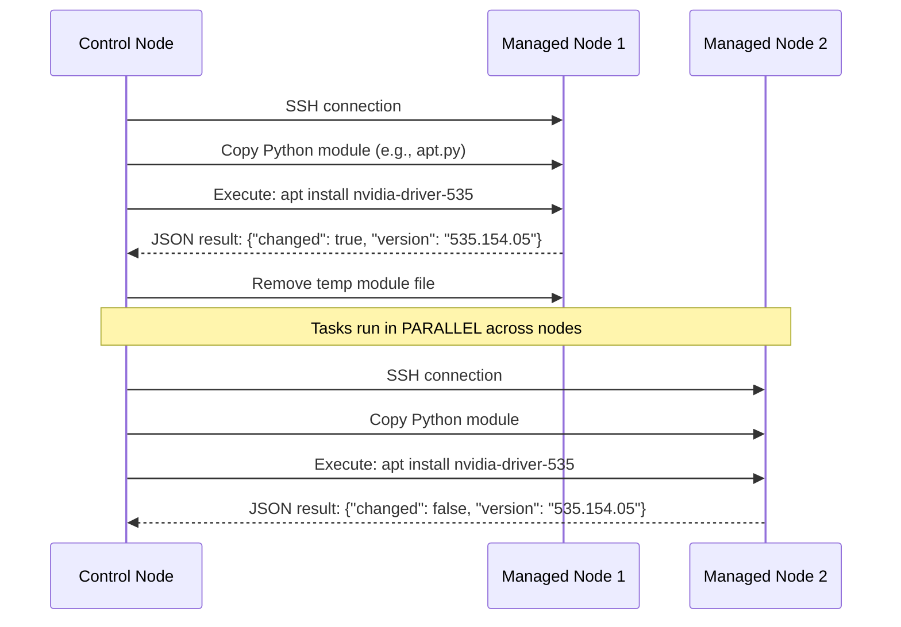

# 🏷️ 05 - Ansible — Configuration Management at Scale

## 🎯 Learning Objectives

- Distinguish infrastructure provisioning (Terraform) from configuration management (Ansible) and explain why they are complementary, not competitive
- Understand Ansible's agentless architecture — SSH/WinRM transport, Python runtime on targets, zero-agent model
- Construct static and dynamic inventories for ML GPU clusters, including cloud-provider auto-discovery plugins
- Write idempotent playbooks using core modules (`apt`, `pip`, `docker_container`, `nvidia_gpu`, `mount`, `systemd`, `template`)
- Design reusable roles with the standard filesystem layout (`tasks/`, `handlers/`, `templates/`, `vars/`, `defaults/`, `meta/`)
- Encrypt sensitive variables at rest with Ansible Vault and integrate password files in CI pipelines
- Apply Ansible to a real production ML use case: configuring a GPU training cluster with CUDA, Docker, PyTorch, JupyterHub, and MLflow

## Introduction

**Ansible** is a configuration management tool that configures servers — installing packages, writing configuration files, starting services, and enforcing desired state — across tens, hundreds, or thousands of machines simultaneously. The word *ansible* was coined by science fiction author Ursula K. Le Guin in her 1966 novel *Rocannon's World* to describe a device that allows instantaneous communication across interstellar distances. Michael DeHaan, who created the tool in 2012, chose the name to evoke the idea of controlling remote systems as if they were local. Red Hat acquired Ansible in 2015, and it now sits at the center of the company's automation portfolio.

The problem Ansible solves emerges exactly where Terraform stops. Terraform provisions infrastructure resources — it creates the EC2 instance, provisions the VPC, attaches the security group, allocates the EBS volume. But when the instance boots, it is a blank slate: no CUDA drivers, no Docker runtime, no Python environment, no mounted filesystems. The infrastructure EXISTS but is not USABLE. Before Ansible (and its predecessors Puppet and Chef), teams bridged this gap with fragile bash scripts — hundreds of lines of `apt-get install`, `pip install`, `wget`, and `systemctl restart` that failed on the second run because they lacked idempotency. A package already installed would throw an error; a directory already created would halt execution. This was the "works on my machine, not in production" problem, applied to server configuration.

Ansible solves this by making configuration **declarative and idempotent**. You describe the desired state of the system — "NVIDIA driver version 535.154.05 must be installed, Docker must be running, `/mnt/efs` must be mounted" — and Ansible determines what actions are necessary to reach that state. If the system already matches the desired state, Ansible does nothing. This is the fundamental property that separates configuration management from scripting, and it connects deeply to the Terraform philosophy explored in earlier notes. Together, [[Terraform + Ansible]] form the complete Infrastructure as Code stack: Terraform provisions, Ansible configures. Neither replaces the other. This note builds on cloud foundations from [[10 - Cloud, Infra y Backend/22 - Cloud Computing/01 - Fundamentos de Cloud y Modelos de Servicio|Cloud Fundamentals]] and connects to deployment patterns in [[09/20 - Deployment and Serving|Deployment]] and CI/CD pipelines in [[09/29 - CI-CD for ML|CI-CD for ML]].

---

## 1. Agentless Architecture — Why SSH + Python Wins

Ansible's most important architectural decision is that it has **no agent**. There is no daemon to install, update, secure, or troubleshoot on target machines. The control node (your laptop, a CI runner, a bastion host) connects to managed nodes via:

- **SSH** (Linux/Unix — every Linux server has an SSH daemon by default)
- **WinRM** (Windows — PowerShell remoting protocol)

Under the hood, Ansible SSHs into the target, copies a small Python module (the "Ansible module"), executes it, captures the JSON output, and removes the module. This is the full lifecycle of a task. No persistent binary, no open ports beyond SSH, no memory footprint between runs.

```
┌─────────────────┐         SSH (port 22)        ┌─────────────────────┐
│  Control Node   │ ──────────────────────────────▶│   Managed Node 1    │
│  (Ansible)      │                                │   (GPU server)      │
│                 │         SSH (port 22)         ┌─────────────────────┐
│  inventory.ini  │ ──────────────────────────────▶│   Managed Node 2    │
│  playbook.yml   │                                │   (GPU server)      │
└─────────────────┘                                └─────────────────────┘
```



¡Sorpresa! Ansible runs tasks in **parallel** across hosts by default. The `forks` parameter (default 5) controls how many nodes are configured simultaneously. For a cluster of 200 GPU nodes, set `forks = 50` and the entire cluster is configured in seconds, not hours. Each fork opens an independent SSH connection, so the only bottleneck is SSH connection overhead.

⚠️ The control node must have Python installed, but the managed nodes need Python too (Ansible copies and executes Python modules). Every modern Linux distribution includes Python 2.7+ or 3.x. Alpine Linux is the notable exception — it ships without Python by default, so Ansible's `raw` module must be used to bootstrap Python first.

💡 For truly air-gapped environments (no internet, no pip), Ansible supports an "ansible-pull" mode where managed nodes pull playbooks from a local Git mirror and execute them locally. This sacrifices the push parallelism but works behind military-grade firewalls.

**Caso real: CERN** manages over 30,000 physical and virtual servers with Ansible. The LHC computing grid spans 170 sites in 42 countries. Ansible's agentless model means they can reconfigure the entire grid's compute nodes without maintaining a fleet of agent daemons across heterogeneous hardware. Configuration runs take under 10 minutes for the full grid.

---

## 2. Inventories — Static, Dynamic, and GPU Auto-Discovery

The **inventory** is the list of managed nodes. It answers two questions: *which machines?* and *how are they grouped?* Ansible supports two inventory models:

### Static Inventories

The simplest form — a text file listing hostnames or IPs, optionally grouped into logical units:

```ini
# inventory.ini — Static inventory for ML cluster
[gpu_nodes]
gpu-node-01 ansible_host=10.0.1.10 ansible_user=ubuntu
gpu-node-02 ansible_host=10.0.1.11 ansible_user=ubuntu
gpu-node-03 ansible_host=10.0.1.12 ansible_user=ubuntu
gpu-node-04 ansible_host=10.0.1.13 ansible_user=ubuntu

[cpu_nodes]
cpu-node-01 ansible_host=10.0.1.20 ansible_user=ubuntu
cpu-node-02 ansible_host=10.0.1.21 ansible_user=ubuntu

[ml_cluster:children]
gpu_nodes
cpu_nodes

[ml_cluster:vars]
ansible_python_interpreter=/usr/bin/python3
ansible_ssh_private_key_file=~/.ssh/ml-cluster.pem
```

The YAML equivalent is more expressive and is preferred for complex inventories:

```yaml
# inventory.yaml
all:
  children:
    ml_cluster:
      children:
        gpu_nodes:
          hosts:
            gpu-node-01:
              ansible_host: 10.0.1.10
            gpu-node-02:
              ansible_host: 10.0.1.11
        cpu_nodes:
          hosts:
            cpu-node-01:
              ansible_host: 10.0.1.20
      vars:
        ansible_python_interpreter: /usr/bin/python3
```

Static inventories work for small, stable clusters. But ML infrastructure is dynamic — GPU spot instances come and go, autoscaling groups expand during training jobs and contract overnight. Static inventories become stale within minutes.

### Dynamic Inventories

A **dynamic inventory** is an executable script (Python, Go, bash) or plugin that queries a cloud provider's API and returns a JSON inventory in real time. Ansible ships with dynamic inventory plugins for AWS EC2, GCP Compute Engine, Azure VM, and more.

```bash
# List all available inventory plugins
ansible-doc -t inventory -l

# For ML: the aws_ec2 plugin auto-discovers GPU instances by tag
ansible-inventory -i aws_ec2.yaml --graph
```

```yaml
# aws_ec2.yaml — Dynamic inventory for AWS GPU instances
plugin: aws_ec2
regions:
  - us-east-1
  - us-west-2
filters:
  tag:Environment: production
  tag:Workload: ml-training
  instance-state-name: running
keyed_groups:
  - key: tags.InstanceType
    prefix: instance_type
  - key: tags.NodeGroup
    prefix: node_group
hostnames:
  - private-ip-address
compose:
  ansible_host: private_ip_address
```

¡Sorpresa! The `ansible-inventory --graph` command queries the LIVE cloud API every time. If a GPU instance was terminated by a spot reclaim 30 seconds ago, it will not appear in the inventory. This means your playbooks ALWAYS target the current state of your infrastructure — no stale host lists.

**❌ Antipattern**: Manually maintaining an INI inventory file and copying IP addresses from the AWS console every time an instance is replaced.

**✅ Pattern**: Dynamic inventory plugin that queries the cloud API with tag filters. New instances inherit the correct tags from the Terraform module that created them, and Ansible discovers them automatically.

For ML GPU clusters specifically, the `aws_ec2` plugin can filter by GPU instance types:

```yaml
filters:
  instance-type:
    - g4dn.xlarge
    - g5.xlarge
    - p4d.24xlarge
  tag:env: production
```

This composes perfectly with Terraform: your Terraform module tags every GPU instance with `Workload: ml-training`, and the dynamic inventory finds them by tag. Terraform provisions, tags propagate, Ansible discovers.

---

## 3. Playbooks, Plays, Tasks, and Modules — The Hierarchy of Execution

Ansible execution is organized into a strict hierarchy:

```
Playbook (YAML file)
  └── Play (targets a host group, sets variables)
        └── Task (calls a single module)
              └── Module (Python code that does the real work)
```

### Modules: The Atomic Unit

A **module** is a self-contained Python script that performs one operation idempotently. Ansible ships with over 3,000 built-in modules. The core modules for ML infrastructure:

| Module | Purpose | ML Infrastructure Use |
|--------|---------|----------------------|
| `ansible.builtin.apt` / `yum` / `package` | Install system packages | `nvidia-driver-535`, `cuda-toolkit-12-3` |
| `ansible.builtin.pip` | Install Python packages | `torch`, `transformers`, `jupyterhub` |
| `community.docker.docker_container` | Manage Docker containers | MLflow, JupyterHub, Triton Inference Server |
| `community.general.nvidia_gpu` | Install NVIDIA GPU drivers | `nvidia-driver-535`, CUDA toolkit |
| `ansible.posix.mount` | Mount filesystems | EFS for shared datasets, FSx for Lustre |
| `ansible.builtin.template` | Render Jinja2 templates | Config files for JupyterHub, MLflow, systemd |
| `ansible.builtin.systemd` | Manage systemd services | Ensure JupyterHub and MLflow restart on boot |
| `ansible.builtin.shell` / `command` | Escape hatch for arbitrary commands | ⚠️ Use only when no module exists |

⚠️ `shell` and `command` modules are NOT idempotent. They execute every time and always report `changed: true`. Use them only as a last resort when no purpose-built module exists. Every use of `shell` is a design smell.

### Playbook Structure

A playbook orchestrates multiple plays:

```yaml
---
# configure-ml-cluster.yml — Complete GPU node configuration
- name: Configure GPU training nodes
  hosts: gpu_nodes
  become: yes
  vars:
    nvidia_driver_version: "535.154.05"
    cuda_version: "12.3"
    pytorch_version: "2.1.0"
    efs_mount_point: "/mnt/datasets"
    efs_id: "fs-0123456789abcdef0"

  tasks:
    - name: Install NVIDIA driver and CUDA toolkit
      ansible.builtin.apt:
        name:
          - nvidia-driver-{{ nvidia_driver_version }}
          - cuda-toolkit-{{ cuda_version | replace('.', '-') }}
        state: present
        update_cache: yes
      # ¡Sorpresa! Ansible resolves Jinja2 vars BEFORE the module runs.
      # This means you can parameterize package names dynamically.

    - name: Install Docker and nvidia-container-toolkit
      ansible.builtin.apt:
        name:
          - docker.io
          - nvidia-container-toolkit
        state: present

    - name: Ensure Docker daemon is running
      ansible.builtin.systemd:
        name: docker
        state: started
        enabled: yes

    - name: Install PyTorch with CUDA support
      ansible.builtin.pip:
        name: "torch=={{ pytorch_version }}+cu{{ cuda_version | replace('.', '') }}"
        extra_args: "--index-url https://download.pytorch.org/whl/cu{{ cuda_version | replace('.', '') }}"
        state: present

    - name: Mount EFS for shared datasets
      ansible.posix.mount:
        path: "{{ efs_mount_point }}"
        src: "{{ efs_id }}.efs.us-east-1.amazonaws.com:/"
        fstype: nfs4
        opts: nfsvers=4.1,rsize=1048576,wsize=1048576,hard,timeo=600,retrans=2
        state: mounted
      # 💡 EFS mount options: rsize/wsize = 1MB maximizes throughput
      # for reading large datasets. hard + timeo=600 prevents I/O errors
      # during brief network blips.

    - name: Deploy JupyterHub configuration
      ansible.builtin.template:
        src: jupyterhub_config.py.j2
        dest: /etc/jupyterhub/jupyterhub_config.py
        owner: root
        group: root
        mode: "0644"
      notify: restart jupyterhub
      # ¡Sorpresa! `notify` triggers a HANDLER only if this task reports
      # "changed". If the config file hasn't changed, the service is NOT
      # restarted. This is idempotency awareness at the handler level.

  handlers:
    - name: restart jupyterhub
      ansible.builtin.systemd:
        name: jupyterhub
        state: restarted
```

### Idempotency — The Core Property

Ansible's idempotency guarantee is what separates it from shell scripts. Running a playbook N times produces the same final state as running it once:

$$\forall n \geq 1,\ f^n(x) = f(x)$$

Where $f$ is the playbook execution function and $x$ is the initial system state. This property holds because each module:
1. Reads the current state from the target system
2. Compares it to the desired state declared in the task
3. Makes changes ONLY if current ≠ desired
4. Reports `changed: true/false` in the output

```bash
# First run: everything is installed
$ ansible-playbook configure-ml-cluster.yml
# Output: changed=12, ok=0, failed=0

# Second run: everything already matches desired state
$ ansible-playbook configure-ml-cluster.yml
# Output: changed=0, ok=12, failed=0   ← Zero changes!
```

**❌ Antipattern**: A bash script that installs NVIDIA drivers:

```bash
# WARNING: This WILL fail on second run
apt-get install -y nvidia-driver-535  # Errors if already installed
pip install torch==2.1.0              # Downloads again unnecessarily
mkdir /mnt/datasets                    # Fails: "File exists"
mount -t nfs4 fs-abc.efs... /mnt/datasets  # Fails: "already mounted"
systemctl restart jupyterhub          # Restarts every time (unnecessary)
```

**✅ Pattern**: An Ansible playbook with the same logic — idempotent, rerunnable, production-safe.

---

## 4. Roles — Reusable Configuration Packages

A **role** packages tasks, handlers, templates, files, variables, and metadata into a reusable unit — the exact same concept as a Terraform module. Where Terraform modules encapsulate infrastructure resources, Ansible roles encapsulate server configuration. Ansible Galaxy (`ansible-galaxy`) is the community registry for roles, analogous to the Terraform Registry.

### Role Directory Structure

```
roles/
└── gpu_node/
    ├── tasks/              # Main task list (main.yml)
    │   ├── main.yml        # Entry point — includes all task files
    │   ├── install_drivers.yml
    │   ├── install_docker.yml
    │   ├── mount_filesystems.yml
    │   └── deploy_services.yml
    ├── handlers/           # Handlers triggered by notify
    │   └── main.yml
    ├── templates/          # Jinja2 templates (*.j2)
    │   ├── jupyterhub_config.py.j2
    │   ├── mlflow_config.env.j2
    │   └── docker_daemon.json.j2
    ├── files/              # Static files copied as-is
    │   └── nvidia-container-runtime-hook
    ├── vars/               # High-priority variables (override defaults)
    │   └── main.yml
    ├── defaults/           # Low-priority default variables
    │   └── main.yml
    └── meta/               # Role metadata (dependencies, galaxy info)
        └── main.yml
```

Variable precedence (lowest to highest): `defaults/` → inventory group vars → inventory host vars → playbook vars → `vars/` → `--extra-vars` (CLI). This is the Ansible equivalent of Terraform's variable precedence: defaults → tfvars → environment variables → CLI flags.

### Consuming a Role

```yaml
---
# Playbook using roles for ML cluster
- name: Configure complete ML infrastructure
  hosts: ml_cluster
  become: yes

  roles:
    - role: gpu_node
      vars:
        nvidia_driver_version: "535.154.05"
        efs_mount_target: "fs-0123456789abcdef0.efs.us-east-1.amazonaws.com"
      when: "'gpu_nodes' in group_names"
      # ¡Sorpresa! `when` conditionals at the ROLE level prevent the
      # entire role from executing on hosts that don't match.

    - role: cpu_node
      when: "'cpu_nodes' in group_names"

    - role: monitoring_agent
      # Common role applied to ALL nodes regardless of type
```

**Caso real: OpenAI** uses Ansible to provision DGX server racks. Each rack contains 8 DGX nodes, each with 8 A100 GPUs. Ansible installs NVIDIA drivers, CUDA toolkit, cuDNN, Docker with `nvidia-container-toolkit`, mounts shared NFS storage for datasets, configures Slurm for job scheduling, and registers nodes in the cluster management system. A single playbook run configures an entire rack in approximately 12 minutes. Their Ansible codebase includes roles for: `nvidia_dgx`, `slurm_worker`, `slurm_controller`, `nfs_client`, `prometheus_node_exporter`, and `dcgm_exporter`. Each role is tested in isolation with Molecule before integration testing.

---

## 🎯 Key Takeaways

- Terraform provisions infrastructure (creates the EC2 instance); Ansible configures it (installs CUDA, Docker, PyTorch). Together they form the complete IaC stack — neither replaces the other
- Ansible's agentless architecture (SSH + Python) eliminates the maintenance burden of agents and is the primary reason it dominates Puppet/Chef for ML infrastructure
- Dynamic inventories query cloud APIs in real time — GPU spot instances that terminate mid-job do not appear in the next inventory refresh, preventing playbook failures on dead hosts
- Idempotency ($f^n(x) = f(x)$) guarantees that running a playbook 100 times produces the same result — this is the fundamental property that separates configuration management from bash scripts
- Roles encapsulate reusable configuration (tasks + handlers + templates + vars) in the same way Terraform modules encapsulate reusable infrastructure
- Ansible Vault encrypts sensitive variables at rest, and CI pipelines can decrypt them at runtime with `--vault-password-file` — never commit API keys in plaintext
- For a 200-GPU training cluster, `forks = 50` configures the entire fleet in under 3 minutes — parallel execution is the default, not an afterthought

## 📦 Código de Compresión

```yaml
---
# gpu-node-config.yml — Ansible playbook: GPU ML node from bare metal to training-ready
- name: Configure GPU training node
  hosts: gpu_nodes
  become: yes
  vars:
    cuda_ver: "12.3"
    torch_ver: "2.1.0"

  tasks:
    - name: Install NVIDIA drivers and CUDA
      ansible.builtin.apt:
        name:
          - nvidia-driver-535
          - cuda-toolkit-12-3
          - libcudnn8
        state: present
        update_cache: yes

    - name: Install Docker with GPU runtime
      block:
        - ansible.builtin.apt:
            name: [docker.io, nvidia-container-toolkit]
            state: present
        - ansible.builtin.systemd:
            name: docker
            state: started
            enabled: yes
        - ansible.builtin.template:
            src: daemon.json.j2
            dest: /etc/docker/daemon.json
          notify: restart docker
      # ⚠️ `block` groups tasks; if any fail, the entire block is rolled back

    - name: Install PyTorch with CUDA
      ansible.builtin.pip:
        name: torch=={{ torch_ver }}+cu121
        extra_args: --index-url https://download.pytorch.org/whl/cu121

    - name: Mount EFS for datasets
      ansible.posix.mount:
        path: /mnt/datasets
        src: fs-abc.efs.us-east-1.amazonaws.com:/
        fstype: nfs4
        opts: nfsvers=4.1,rsize=1048576
        state: mounted

    - name: Enable nvidia-persistenced
      ansible.builtin.systemd:
        name: nvidia-persistenced
        state: started
        enabled: yes
      # 💡 nvidia-persistenced keeps GPU driver loaded even when idle.
      # Without it, driver unloads between container restarts, causing
      # 5-10s delays on every new container launch.

  handlers:
    - name: restart docker
      ansible.builtin.systemd:
        name: docker
        state: restarted
```

---

## References

- DeHaan, M. (2012). *Ansible Documentation*. https://docs.ansible.com — Original design documents and architecture overview.
- Red Hat. (2024). *Ansible User Guide*. https://docs.ansible.com/ansible/latest/user_guide/ — Official reference for playbook syntax, modules, and best practices.
- Hochstein, L., & Moser, R. (2022). *Ansible: Up and Running* (3rd ed.). O'Reilly Media. — Practical guide covering idempotency paradigms, dynamic inventories, and role development.
- Ansible Galaxy. (2024). *Community Roles Repository*. https://galaxy.ansible.com — Curated collection of reusable Ansible roles.
- NVIDIA. (2024). *NVIDIA Container Toolkit Documentation*. https://docs.nvidia.com/datacenter/cloud-native/container-toolkit/ — GPU container runtime integration with Docker.
- [[10 - Cloud, Infra y Backend/22 - Cloud Computing/01 - Fundamentos de Cloud y Modelos de Servicio|Cloud Computing]]
- [[10 - Cloud, Infra y Backend/22 - Cloud Computing/04 - Redes y Seguridad en Cloud|Cloud Networking]]
- [[09/20 - Deployment and Serving]]
- [[09/29 - CI-CD for ML]]
- [[13/02 - Go for Cloud Native]]
