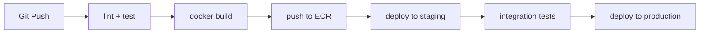
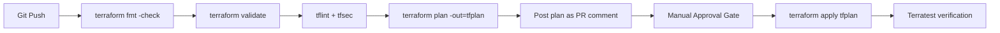
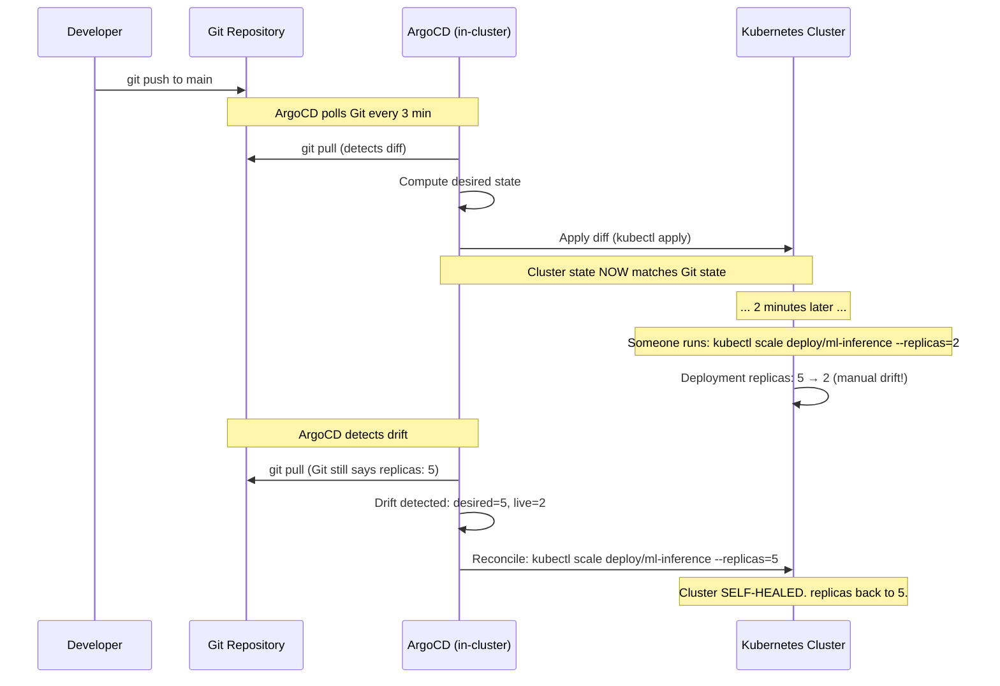

# 🏷️ 06 - CI/CD and GitOps for ML Infrastructure

## 🎯 Learning Objectives

- Differentiate infrastructure CI/CD pipelines from application CI/CD pipelines — plan artifacts, approval gates, drift detection
- Design a 6-stage infrastructure pipeline: fmt → validate → lint → plan → manual approval → apply
- Understand the GitOps pull model (ArgoCD, Flux) vs traditional push CI/CD and its security implications
- Configure Terraform plan output as a PR comment — the code review artifact for infrastructure changes
- Apply trunk-based development patterns to infrastructure repositories with short-lived feature branches
- Explain how GitOps self-healing clusters detect and revert manual changes within minutes
- Integrate cost estimation (Infracost) into CI pipelines to prevent surprise cloud bills

## Introduction

**Continuous Integration and Continuous Delivery** (CI/CD) is the engineering discipline that automates the path from code commit to production deployment. The term entered software engineering vocabulary through the Agile and Extreme Programming movements of the late 1990s, but was codified by Jez Humble and David Farley in their 2010 book *Continuous Delivery*. For infrastructure, CI/CD answers a deceptively simple question: *How do we make infrastructure changes safely?* The answer: every change goes through a pipeline that checks correctness, shows the plan, requires human approval, and applies deterministically.

The problem before infrastructure CI/CD was the "works from my laptop" anti-pattern. An engineer runs `terraform apply` from their local machine, against the production statefile, without anyone reviewing the plan. If the apply succeeds, infrastructure changed — but there is no record of what changed, who approved it, or whether it matches what was intended. If the apply fails halfway through, the statefile is corrupted and the infrastructure is in an unknown, partially-provisioned state. Recovery means manual intervention in the cloud console — exactly what IaC was supposed to prevent. Infrastructure CI/CD replaces the laptop with a pipeline: the plan is generated on a CI runner, posted as a PR comment for review, and applied only after human approval. The pipeline runner has no local statefile — it always fetches from remote state (S3 + DynamoDB), ensuring consistency.

**GitOps** takes this one step further. Coined by Weaveworks in 2017, GitOps declares that Git is the single source of truth for BOTH the desired state of infrastructure AND the mechanism for applying it. A GitOps agent (ArgoCD, Flux) runs inside the cluster, continuously watches a Git repository, and reconciles the live cluster state to match the desired state in Git. If someone manually edits a Kubernetes deployment from `replicas: 5` to `replicas: 3`, the agent detects the drift and reverts to `replicas: 5` within 3 minutes. This is the holy grail of infrastructure management: the cluster self-heals to Git. This note extends the Terraform patterns from earlier in the course into the operational domain, connecting deeply with [[09/29 - CI-CD for ML|CI-CD for ML]] and [[09/20 - Deployment and Serving|Deployment]].

---

## 1. Infrastructure Pipelines Are Different from Application Pipelines

The first lesson of infrastructure CI/CD: you are not shipping a Docker container. Application pipelines run unit tests, build artifacts, push images to registries, and deploy to staging. Infrastructure pipelines run `terraform plan`, not `pytest`. They check resource counts, not code coverage. They require manual approval gates, not automatic blue-green deployments.

### What An Application Pipeline Runs



### What An Infrastructure Pipeline Runs



The critical difference: **infrastructure pipelines have a manual approval gate BEFORE apply.** An application can auto-deploy to staging — if it breaks, the worst case is a buggy web page. An infrastructure change can destroy a production database. The approval gate is not optional; it is the primary safety mechanism. The plan itself — showing exactly what resources will be created, modified, or destroyed — is the artifact that engineers review during approval.

### The Plan as Code Review Artifact

When a PR modifies infrastructure code, the CI pipeline generates a `terraform plan` and posts the plan output directly as a PR comment. This is the heartbeat of infrastructure code review:

```hcl
# Terraform plan output posted as PR comment
# Plan: 3 to add, 1 to change, 0 to destroy

# aws_instance.gpu_node[0] will be created
+ resource "aws_instance" "gpu_node" {
+   ami           = "ami-0c55b159cbfafe1f0"
+   instance_type = "g5.xlarge"
+   subnet_id     = "subnet-0a1b2c3d4e5f67890"
+   tags          = { Name = "gpu-node-prod-01" }
+ }

# aws_security_group.ml_inference will be updated in-place
~ resource "aws_security_group" "ml_inference" {
    id   = "sg-0a1b2c3d4e5f67890"
+   ingress {
+     from_port   = 8080
+     to_port     = 8080
+     protocol    = "tcp"
+     cidr_blocks = ["10.0.0.0/8"]
+   }
  }
```

Every engineer on the team can read the plan and ask: "Why are we opening port 8080?" "Is that subnet ID correct?" "Are we sure we want `g5.xlarge` and not `g4dn.xlarge`?" The plan is the code review artifact.

**❌ Antipattern**:

```bash
# Engineer runs from laptop — no review, no audit trail
$ terraform apply -auto-approve
# Apply complete! Resources: 3 added, 1 changed, 0 destroyed.
# (Nobody knows what changed except the engineer, who is now on vacation)
```

**✅ Pattern**:

```yaml
# .github/workflows/terraform.yml — CI pipeline with plan + approval
plan:
  runs-on: ubuntu-latest
  steps:
    - uses: actions/checkout@v4
    - uses: hashicorp/setup-terraform@v3
    - run: terraform fmt -check -recursive
    - run: terraform validate
    - run: terraform plan -out=tfplan -detailed-exitcode
    - uses: actions/github-script@v7
      with:
        script: |
          const fs = require('fs');
          const plan = fs.readFileSync('tfplan.txt', 'utf8');
          github.rest.issues.createComment({
            issue_number: context.issue.number,
            body: `\`\`\`terraform\n${plan}\n\`\`\``
          });
```

---

## 2. GitOps — The Pull Model for Infrastructure

**GitOps** inverts the deployment model. Traditional CI/CD is **push-based**: the CI pipeline pushes changes TO the cluster. GitOps is **pull-based**: an agent INSIDE the cluster pulls desired state FROM Git and reconciles the live state to match.

### Push Model (Traditional CI/CD)

```
GitHub PR merge → CI pipeline runs → terraform apply → pushes changes to AWS/K8s
                                                           ^^^^^^^^^^^^^^^^^^^^
                                                           CI needs WRITE credentials
                                                           to production clusters
```

**Security problem**: The CI pipeline holds credentials that can CREATE, MODIFY, and DESTROY production infrastructure. If the pipeline is compromised, the attacker has production write access. These credentials are the highest-value target in the system.

### Pull Model (GitOps)

```
GitHub PR merge → ArgoCD detects Git change → ArgoCD pulls desired state → reconciles K8s cluster
                    ^^^^^^^^^^^^^^^^^^^^^^^^^^^^^^^^^^^^^^^^^^^^^^^^^^
                    ArgoCD is INSIDE the cluster. It only needs
                    READ access to Git repo. Write access stays
                    with the CI pipeline that needs it anyway.
```



¡Sorpresa! GitOps means the cluster state drifts BACK to Git's desired state within 3 minutes. The manual change is automatically reverted. This is not a bug — it is the core feature. Git is the source of truth, and the cluster enforces conformity to Git. If you want to change `replicas` from 5 to 3, you do it by editing the Kubernetes manifest in Git, opening a PR, getting approval, and merging. Never by `kubectl edit` on the live cluster.

### ArgoCD vs Flux CD

Both are CNCF-graduated GitOps tools implementing the pull model. The choice is primarily ergonomic:

| Feature | ArgoCD | Flux CD |
|---------|--------|---------|
| **UI** | Rich web dashboard with diff visualization | CLI-focused, no built-in web UI |
| **Sync mechanism** | Polls Git every 3 minutes (configurable) | Continuously reconciles via controller loop |
| **Helm support** | Helm chart rendering via config management plugin | Native Helm controller with tight integration |
| **Multi-tenancy** | Built-in project/application model | Namespace-scoped by design |
| **Image updater** | Separate argocd-image-updater | Built-in image automation controller |
| **Drift detection** | Visual diff in UI, auto-sync option | Continuous reconciliation (always auto-sync) |

**Caso real: Weaveworks** (creators of GitOps) manages their ENTIRE Kubernetes infrastructure through Flux. Every cluster change — ingress rules, deployment updates, HPA configurations, ConfigMaps — goes through a Git commit. Their MTTR (Mean Time To Recovery) dropped from 45 minutes to 4 minutes because:
- Rollback = `git revert` + wait 3 minutes for Flux to sync
- Audit trail = `git log` (every change has an author, timestamp, and PR discussion)
- Disaster recovery = `flux bootstrap` on a new cluster (rebuilds everything from Git in ~20 minutes)

---

## 3. The 6-Stage Infrastructure Pipeline

A production-grade infrastructure pipeline has six stages. Each stage acts as a gate — failure at any stage blocks the change from proceeding:

### Stage 1: Format Check

```bash
terraform fmt -check -recursive
# Exit code 0: all files properly formatted
# Exit code non-zero: formatting violations found
```

This fails PRs where someone used 3-space indentation or inconsistent alignment. It is equivalent to `black` or `prettier` for application code. Non-negotiable: if it doesn't pass `fmt`, the pipeline stops.

### Stage 2: Validate

```bash
terraform validate
# Checks: syntax errors, missing variables, circular dependencies, provider schema compliance
```

This catches HCL syntax errors BEFORE they reach `plan`. It is fast (~2 seconds) and has zero side effects — no API calls, no state reads. ⚠️ `terraform validate` only checks syntax and provider schema compliance. It does NOT verify logical correctness (e.g., "port 22 open to 0.0.0.0/0").

### Stage 3: Lint

```bash
tflint --recursive
# Checks: deprecated syntax, invalid instance types, missing tags, best practice violations
```

`tflint` is the infrastructure equivalent of `eslint` or `pylint`. It catches policy violations like: "AWS deprecated `aws_lambda_function` runtime nodejs12.x" or "S3 bucket without encryption." Custom rules can enforce organizational policies.

### Stage 4: Plan

```bash
terraform plan -out=tfplan -detailed-exitcode
# Exit code 0: no changes (plan succeeded with empty diff)
# Exit code 1: error (plan failed)
# Exit code 2: changes present (plan succeeded with diff)
```

The plan is written to a binary file (`tfplan`), not just stdout. This is CRITICAL:

```bash
# ⚠️ DANGEROUS: plan without -out
terraform plan     # Prints plan to stdout
terraform apply    # Applies WHATEVER the current state says, NOT what plan showed

# ✅ SAFE: plan with -out
terraform plan -out=tfplan    # Saves exact plan to binary file
terraform apply tfplan        # Applies EXACTLY what was planned
```

¡Sorpresa! `terraform apply` without `-out=tfplan` can apply DIFFERENT changes than the plan showed, because resources may have changed between plan and apply. A security group rule modified by another engineer, a DNS record updated by a scheduled job, an IAM role changed by a compliance tool — all can cause drift between plan and apply. Always use the plan file.

### Stage 5: Manual Approval

```yaml
# GitHub Actions environments with approval protection
apply:
  needs: plan
  environment: production  # Requires manual approval in GitHub UI
  runs-on: ubuntu-latest
  steps:
    - run: terraform apply tfplan
```

The `environment: production` declaration in GitHub Actions triggers the manual approval workflow. A designated approver must click "Approve" in the GitHub UI before `apply` runs. This is the human judgment gate: the plan shows exactly what will change, and a human decides whether to proceed.

💡 For lower environments (dev, staging), you can skip the manual approval gate — auto-apply on merge to `main` is acceptable when the blast radius is small. But PRODUCTION always requires approval.

### Stage 6: Verify

```bash
# After apply, run Terratest to verify the infrastructure actually works
cd terratest && go test -v -timeout 30m
```

This stage tests the real, live infrastructure: SSH to the EC2 instance and verify `nvidia-smi` returns GPU info, HTTP GET the ALB endpoint and verify 200 OK, query RDS and verify the database exists. If verification fails, the pipeline fails, and on-call is alerted. This note connects directly to the testing methodologies explored in [[10 - Cloud, Infra y Backend/23 - Infrastructure as Code/08 - Terraform Testing - Policy as Code and Security|Terraform Testing & Security]].

---

## 4. Cost Estimation and Drift Detection in CI

Two additional CI capabilities transform infrastructure pipelines from "it deployed correctly" to "it deployed correctly AND cost-effectively AND it hasn't drifted":

### Infracost — Every PR Shows the Bill

[Infracost](https://www.infracost.io/) parses `terraform plan` output and maps resources to cloud provider pricing. It posts a cost estimate as a PR comment:

```
💰 Infracost estimate: monthly cost will change by +$342
┌─────────────────────────────────────────────────────┐
│ Resource                    │ Monthly cost change    │
├─────────────────────────────────────────────────────┤
│ aws_instance.gpu_node       │ +$193 (g5.xlarge OD)  │
│ aws_eks_cluster.ml_cluster  │ +$73  (EKS control)   │
│ aws_rds_instance.model_reg  │ +$76  (db.r5.large)   │
└─────────────────────────────────────────────────────┘
```

This prevents the most common infrastructure disaster: "I added a NAT Gateway per AZ and didn't realize each one costs $32/month." The cost estimate makes infrastructure changes visible in monetary terms, not just resource counts.

### Drift Detection — Scheduled Plans That Alert

```yaml
# .github/workflows/drift-detection.yml — Runs every 6 hours
on:
  schedule:
    - cron: '0 */6 * * *'  # Every 6 hours

jobs:
  drift-check:
    runs-on: ubuntu-latest
    steps:
      - uses: actions/checkout@v4
      - run: terraform init
      - name: Check for drift
        run: |
          terraform plan -detailed-exitcode
          # Exit code 0 → no drift (all good)
          # Exit code 2 → DRIFT DETECTED (someone changed something in the console!)
```

If `terraform plan` returns exit code 2, the workflow sends an alert (Slack, PagerDuty) with the plan output showing WHAT drifted. This catches the "I'll just quickly change this security group in the console..." pattern within 6 hours.

**Caso real: HashiCorp's Terraform Cloud** runs over 10 million `terraform plan` operations per month across its customer base. Every plan goes through:
1. **Sentinel policy checks** (is this S3 bucket encrypted? is this IAM role following least privilege?)
2. **Infracost estimation** (how much will this change cost per month?)
3. **Manual approval** (human reviews the plan + cost + policy results)

HashiCorp themselves use this workflow internally. No HashiCorp employee can `terraform apply` to production from their laptop. Every production change goes through Terraform Cloud with the full pipeline.

---

## 🎯 Key Takeaways

- Infrastructure CI/CD pipelines differ fundamentally from application pipelines: they run `terraform plan`, require manual approval gates, and validate against compliance policies — not unit tests
- The `terraform plan` output IS the code review artifact for infrastructure PRs — it shows exactly what resources will be created, modified, or destroyed
- ALWAYS use `terraform plan -out=tfplan && terraform apply tfplan` — applying without the plan file can execute a DIFFERENT plan than what was reviewed
- GitOps (pull model) is inherently more secure than push CD: the cluster agent only needs Git READ access, while push pipelines need full cluster WRITE credentials
- ArgoCD and Flux self-heal clusters by continuously reconciling live state to Git desired state — manual `kubectl edit` changes are reverted within minutes
- Infracost in CI makes infrastructure costs visible in PRs — preventing surprise $500/month AWS bills from un-reviewed resource additions
- Scheduled drift detection (every 6 hours) catches manual console changes — if `terraform plan` returns exit code 2, someone changed infrastructure outside of Git

## 📦 Código de Compresión

```yaml
# .github/workflows/terraform-infra.yml — Complete infrastructure pipeline
name: "Terraform Infrastructure CI/CD"

on:
  pull_request:
    paths: ["infrastructure/**"]
  push:
    branches: [main]
    paths: ["infrastructure/**"]

jobs:
  plan:
    runs-on: ubuntu-latest
    permissions:
      contents: read
      pull-requests: write
    steps:
      - uses: actions/checkout@v4
      - uses: hashicorp/setup-terraform@v3
        with:
          terraform_version: "1.7"
      - run: terraform fmt -check -recursive
        working-directory: infrastructure/envs/prod
      - run: terraform init
        working-directory: infrastructure/envs/prod
      - run: terraform validate
        working-directory: infrastructure/envs/prod
      - run: tflint --recursive
        working-directory: infrastructure/envs/prod
        continue-on-error: true
      - run: terraform plan -out=tfplan -detailed-exitcode
        working-directory: infrastructure/envs/prod
        id: plan
        # 💡 -detailed-exitcode: 0=no-changes, 1=error, 2=changes-present.
        # Use continue-on-error to capture exit code 2 as "success with changes".
        continue-on-error: true
      - uses: actions/github-script@v7
        if: steps.plan.outcome == 'success'
        with:
          script: |
            const plan = require('fs').readFileSync('infrastructure/envs/prod/tfplan.txt','utf8');
            github.rest.issues.createComment({
              issue_number: context.issue.number,
              body: `## 📋 Terraform Plan\n\`\`\`terraform\n${plan.slice(0,50000)}\n\`\`\``
            });
      # ⚠️ Plan file must be < 65536 chars for PR comments. Large outputs
      # should link to a CI artifact instead.

  apply:
    needs: plan
    if: github.ref == 'refs/heads/main'
    runs-on: ubuntu-latest
    environment: production  # Triggers manual approval gate
    steps:
      - uses: actions/checkout@v4
      - uses: hashicorp/setup-terraform@v3
      - run: terraform init
        working-directory: infrastructure/envs/prod
      - run: terraform apply tfplan
        working-directory: infrastructure/envs/prod
```

---

## References

- Humble, J., & Farley, D. (2010). *Continuous Delivery: Reliable Software Releases through Build, Test, and Deployment Automation*. Addison-Wesley. — Foundational text establishing CI/CD principles.
- Weaveworks. (2017). *GitOps — Operations by Pull Request*. https://www.weave.works/blog/gitops-operations-by-pull-request — Original GitOps manifesto by Alexis Richardson.
- ArgoCD. (2024). *Declarative GitOps CD for Kubernetes*. https://argo-cd.readthedocs.io/ — CNCF-graduated GitOps tool documentation.
- Flux CD. (2024). *Open and Extensible Continuous Delivery Solution for Kubernetes*. https://fluxcd.io/docs/ — CNCF-graduated GitOps tool documentation.
- HashiCorp. (2024). *Terraform Cloud Documentation — Run Tasks and Policy as Code*. https://developer.hashicorp.com/terraform/cloud-docs — CI/CD pipeline integration for Terraform.
- Infracost. (2024). *Cloud Cost Estimates for Terraform*. https://www.infracost.io/docs/ — Cost estimation integration for infrastructure CI/CD.
- [[09/29 - CI-CD for ML]]
- [[09/20 - Deployment and Serving]]
- [[10 - Cloud, Infra y Backend/22 - Cloud Computing/04 - Redes y Seguridad en Cloud|Cloud Networking]]
- [[13/02 - Go for Cloud Native]]
