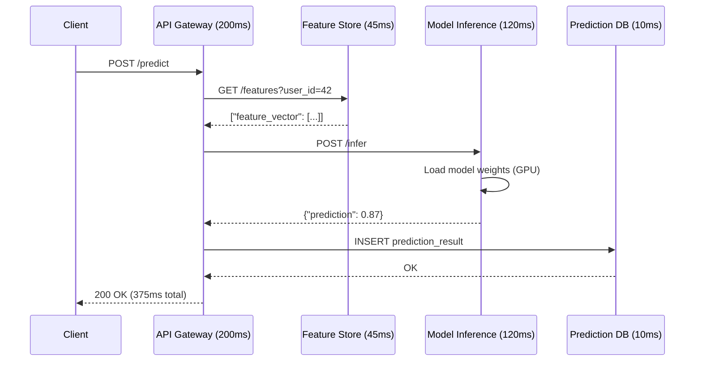

# 🏷️ 07 - Infrastructure Observability — Prometheus, Grafana, and Distributed Tracing

## 🎯 Learning Objectives

- Distinguish the three pillars of observability (metrics, logs, traces) plus the fourth pillar (events) and their roles in ML infrastructure
- Understand Prometheus's pull-based architecture, the PromQL query language, and the exporter ecosystem (node_exporter, DCGM exporter, blackbox exporter)
- Build Grafana dashboards for GPU clusters: utilization, memory, temperature, inference latency, error rates
- Define SRE concepts mathematically: SLI, SLO, error budgets, burn rates — and implement alerting rules with Alertmanager
- Instrument distributed ML services with OpenTelemetry and trace prediction requests across API Gateway → Feature Store → Model Inference → Response
- Apply alert hygiene: never alert on things that don't require immediate action — alert fatigue kills on-call effectiveness

## Introduction

**Observability** is the ability to understand the internal state of a system by examining its external outputs. The term was borrowed from control theory by software engineers in the 2010s as systems grew too complex for traditional monitoring (CPU > 90%? Restart it). Modern observability, as defined by Charity Majors (co-founder of Honeycomb), answers unknown-unknowns: "Why is the p99 latency of my inference API spiking on Tuesdays between 14:00 and 14:15 UTC?" Traditional monitoring answers known-knowns: "Is CPU above 80%?" The distinction matters profoundly for ML infrastructure, where failure modes are subtle: a GPU thermal-throttling under sustained load, a feature store returning stale vectors, a model loading latency of 12 seconds that only manifests after deployments.

The problem before observability was SSH-based debugging: an engineer SSHes into a GPU node, runs `nvidia-smi`, sees 98% GPU utilization, concludes "everything is fine," and logs out. But on another node, GPU 3 has been in ECC error recovery mode for 8 hours, silently running at 30% throughput. On a third node, the EFS mount has hung, and training jobs are blocking on I/O. None of this is visible from `nvidia-smi` on a single node. Observability solves this by collecting metrics from ALL nodes into a centralized time-series database (Prometheus), visualizing them in dashboards (Grafana), and alerting when thresholds are breached (Alertmanager).

For ML infrastructure specifically, observability must handle heterogeneous signals: GPU metrics (utilization, memory bandwidth, temperature, power draw), application metrics (inference latency per model, batch size, queue depth), infrastructure metrics (CPU, disk I/O, network throughput, EFS burst credits), and business metrics (predictions per second, error rate by model version, cold start latency). This note builds on monitoring concepts from [[10 - Cloud, Infra y Backend/22 - Cloud Computing/04 - Redes y Seguridad en Cloud|Cloud Networking]] and connects to ML platform engineering patterns in [[09/21 - Monitoreo y Mantenimiento|Monitoring]] and [[09/26 - ML Platform Engineering|ML Platform Engineering]].

---

## 1. The Three Pillars + One

Observability rests on four signal types, organized by how you use them:

### Metrics (Quantitative)

Time-series numerical data. CPU utilization (%), request latency (ms), GPU memory used (GiB), error count. Metrics are cheap to collect and store — a 200-node cluster generates ~2 million data points per minute, which compresses to ~50 MB/hour in Prometheus. Metrics tell you **WHAT** is happening.

```
# Prometheus metric example — GPU utilization time series
nvidia_gpu_utilization{gpu="0", node="gpu-node-03", model="A100"} 87.5 @1716938400
nvidia_gpu_utilization{gpu="0", node="gpu-node-03", model="A100"} 92.1 @1716938415
nvidia_gpu_utilization{gpu="0", node="gpu-node-03", model="A100"} 89.3 @1716938430
```

### Logs (Textual)

Structured or unstructured text records of discrete events. "Model loaded successfully in 5.3s", "CUDA OOM error on GPU 2", "EFS mount timed out after 120s." Logs tell you **WHY** something happened. In ML systems, logs are particularly valuable for debugging model loading failures, dependency resolution errors, and distributed training synchronization issues.

### Traces (Distributed)

A trace follows a single request through multiple services, recording timing at each hop. In an ML inference pipeline, a trace might show:



Traces tell you **WHERE** time is spent. In this example, the trace reveals that model inference (120ms) is actually faster than API Gateway overhead (200ms) — the bottleneck is infrastructure, not ML.

### Events (The Fourth Pillar)

Discrete, immutable records of significant state changes: "Deployment v1.2.3 started", "Autoscaling triggered: GPU nodes from 4 → 8", "Security group sg-abc123 modified by user alice@company.com", "AWS health event: g5 instance type degradation in us-east-1a". Events connect observability signals to operational context. If p99 latency spiked at 14:05, and the event log shows "Deployment v1.2.3 completed at 14:04:30", you have your root cause.

---

## 2. Prometheus — Pull-Based Architecture

**Prometheus** is the de facto standard for infrastructure metrics. Created at SoundCloud in 2012 by Matt Proud and Julius Volz, it joined the Cloud Native Computing Foundation (CNCF) in 2016 as the second graduated project (after Kubernetes). Its architecture follows a deliberately simple model:

```
                          ┌──────────────────────┐
                          │   Prometheus Server   │
                          │   (scrapes metrics)   │
                          │   (stores time series)│
                          │   (evaluates rules)   │
                          └──────┬───────────────┘
                                 │ scrape (pull HTTP /metrics)
          ┌──────────────────────┼──────────────────────┐
          │                      │                      │
┌─────────▼────────┐  ┌─────────▼────────┐  ┌─────────▼────────┐
│  node_exporter   │  │ dcgm_exporter    │  │ blackbox_exporter│
│  CPU, mem, disk  │  │ GPU utilization  │  │ HTTP/TCP probes  │
│  on every node   │  │ mem, temp, ECC   │  │ external checks  │
└──────────────────┘  └──────────────────┘  └──────────────────┘
```

### The Pull Model

Prometheus does not wait for targets to push metrics — it actively SCRAPES each target's `/metrics` endpoint at a configured `scrape_interval` (default 15s). This design has profound implications:

- **No push infrastructure**: Targets only need an HTTP endpoint; they don't need to know where Prometheus is
- **Health is implicit**: If Prometheus can't scrape a target, the target is effectively down — no need for a separate heartbeat mechanism
- **Service discovery**: Prometheus can discover targets dynamically via Kubernetes API, AWS EC2 tags, Consul, or static configs

```yaml
# prometheus.yml — Scrape configuration for ML infrastructure
global:
  scrape_interval: 15s
  evaluation_interval: 15s

scrape_configs:
  - job_name: "node_exporter"
    ec2_sd_configs:
      - region: us-east-1
        filters:
          - name: tag:Monitoring
            values: ["enabled"]
    relabel_configs:
      - source_labels: [__meta_ec2_tag_Name]
        target_label: instance

  - job_name: "dcgm_exporter"
    static_configs:
      - targets:
          - "gpu-node-01:9400"
          - "gpu-node-02:9400"
          - "gpu-node-03:9400"
    # ⚠️ For large clusters, use EC2 service discovery instead of static targets.
    # Static configs rot when instances are replaced by autoscaling.

  - job_name: "ml_inference_endpoint"
    metrics_path: /metrics
    static_configs:
      - targets:
          - "ml-inference.internal:8080"
```

### DCGM Exporter — GPU Metrics

The **[NVIDIA DCGM Exporter](https://github.com/NVIDIA/dcgm-exporter)** translates NVIDIA's Data Center GPU Manager (DCGM) telemetry into Prometheus metrics. It exposes:

| Prometheus Metric | What It Measures | Critical Threshold |
|-------------------|------------------|-------------------|
| `DCGM_FI_DEV_GPU_UTIL` | GPU utilization % | < 50% sustained = idle waste |
| `DCGM_FI_DEV_FB_USED` | Framebuffer memory used | > 90% = OOM risk |
| `DCGM_FI_DEV_GPU_TEMP` | GPU temperature °C | > 85°C = thermal throttling |
| `DCGM_FI_DEV_POWER_USAGE` | Power draw (watts) | > TDP = power capping |
| `DCGM_FI_DEV_ECC_SBE_VOL_TOTAL` | ECC single-bit errors | > 0/hour = memory degradation |
| `DCGM_FI_DEV_XID_ERRORS` | XID fatal errors | > 0 = GPU has crashed |

💡 `DCGM_FI_DEV_ECC_SBE_VOL_TOTAL` is the canary for GPU hardware failure. A healthy GPU has 0 ECC errors per hour. An increase to 10/hour means memory is degrading; the node should be cordoned and drained before it causes training job failures.

### PromQL — The Query Language

PromQL is the functional query language for Prometheus. Its power comes from rate calculations, histogram quantiles, and vector matching:

```promql
# GPU utilization averaged over 5 minutes, across all nodes
avg by (node) (rate(DCGM_FI_DEV_GPU_UTIL[5m]))

# 99th percentile inference latency over last 5 minutes
histogram_quantile(0.99, rate(http_request_duration_seconds_bucket{endpoint="/predict"}[5m]))

# Error rate this hour — percentage of requests returning 5xx
sum(rate(http_requests_total{status=~"5.."}[1h]))
  /
sum(rate(http_requests_total[1h]))
  * 100

# GPU memory pressure — nodes with < 10% free framebuffer
(DCGM_FI_DEV_FB_USED / DCGM_FI_DEV_FB_TOTAL) > 0.90
```

¡Sorpresa! PromQL `rate()` function calculates the per-second rate of increase over a time window, not the average. `rate(counter[5m])` extrapolates the counter's increase over 5 minutes into a per-second rate. If a counter increases by 300 over 5 minutes, `rate` returns 1.0 (300/300 seconds). This normalization makes counters comparable across different scrape intervals.

---

## 3. Grafana — Visualization and Alerting

**Grafana** is the visualization layer. It queries Prometheus (and dozens of other data sources), renders dashboards, and forwards alerts. The key Grafana workflows for ML infrastructure:

### Dashboard Architecture

```
┌─────────────────────────────────────────────────────────────┐
│  Grafana Dashboard: "ML Inference Platform"                  │
├──────────────────────┬──────────────────────────────────────┤
│  Global Stats Row    │                                      │
│  Requests/sec  GPU%  │  Error Rate  p99 Latency             │
│  [1,234 req/s] [87%] │  [0.03% OK]  [145ms]                │
├──────────────────────┼──────────────────────────────────────┤
│  GPU Grid            │  Inference Latency                    │
│  ┌────────────────┐  │  ┌────────────────────────────────┐  │
│  │ Node  GPU0 GPU1 │  │  │Line chart: p50, p95, p99     │  │
│  │ n-01  92%  88% │  │  │over time with deployment      │  │
│  │ n-02  95%  91% │  │  │markers overlaid               │  │
│  │ n-03  78%  82% │  │  └────────────────────────────────┘  │
│  └────────────────┘  │                                      │
├──────────────────────┼──────────────────────────────────────┤
│  Error Breakdown     │  Model Performance                    │
│  Pie: 5xx codes      │  Predictions/sec by model version    │
└──────────────────────┴──────────────────────────────────────┘
```

### Alerting Rules

Alerts are defined in PromQL and routed through **Alertmanager** to Slack, PagerDuty, Opsgenie, or email. A well-structured alert has: a clear name, a PromQL expression, a severity label, a description, and a runbook link:

```yaml
# prometheus-alerts.yml — ML infrastructure alerting rules
groups:
  - name: gpu_alerts
    rules:
      - alert: GPUThrottlingDetected
        expr: DCGM_FI_DEV_GPU_TEMP > 85
        for: 5m
        labels:
          severity: warning
        annotations:
          summary: "GPU thermal throttling on {{ $labels.node }} GPU {{ $labels.gpu }}"
          description: "GPU temperature is {{ $value }}°C for >5 min. Training throughput degraded."
          runbook: "https://wiki.internal/alerts/gpu-thermal"

      - alert: GPUECCErrorsDetected
        expr: rate(DCGM_FI_DEV_ECC_SBE_VOL_TOTAL[1h]) > 0
        for: 0m
        labels:
          severity: critical
        annotations:
          summary: "ECC errors on {{ $labels.node }} GPU {{ $labels.gpu }}"
          description: "Memory degradation detected. Node must be cordoned and drained."
          # ¡Sorpresa! `for: 0m` means fire immediately — ECC errors on GPUs
          # indicate HARDWARE FAILURE. Zero tolerance for delay.

      - alert: HighInferenceErrorRate
        expr: |
          sum(rate(http_requests_total{status=~"5.."}[5m]))
          /
          sum(rate(http_requests_total[5m])) > 0.01
        for: 10m
        labels:
          severity: critical
        annotations:
          summary: "Inference error rate > 1% for 10 minutes"
```

⚠️ **Alert fatigue** is the #1 cause of on-call burnout and ignored alerts. The rule: never alert on something that doesn't require immediate human action. CPU at 85%? Don't alert — that's normal under load. GPU temperature at 86°C for 5 minutes? Alert — thermal throttling degrades training throughput and indicates cooling failure.

---

## 4. SRE Concepts — SLI, SLO, Error Budgets, Burn Rate

**Site Reliability Engineering** (SRE), pioneered by Google in 2003, formalizes the reliability conversation. Instead of "the system should be fast and reliable" (vague, unmeasurable), SRE defines:

### SLI — Service Level Indicator

The measurable quantity. *What you measure.*

```
SLI examples:
- In the last 28 days, 99.87% of inference requests completed in < 200ms
- In the last 7 days, GPU cluster availability was 99.95%
- In the last 30 days, model loading success rate was 99.99%
```

### SLO — Service Level Objective

The target for the SLI. *What you promise.*

```
SLO examples:
- p99 inference latency < 200ms for 99.9% of requests over 28 days
- GPU cluster availability >= 99.9% monthly
```

### Error Budget

The amount of failure your SLO allows. It is the permission to take risks — deploy on Friday, experiment with larger batch sizes, test new GPU drivers.

$$\text{Error Budget} = 1 - \text{SLO}$$

Concrete example: If your SLO is 99.9% availability over 30 days (43,200 minutes), your error budget is:

$$\text{Error Budget} = (1 - 0.999) \times 30 \times 24 \times 60 = 0.001 \times 43{,}200 = 43.2 \text{ minutes of downtime per month}$$

If you've used 40 of those 43.2 minutes, you STOP shipping new features until the error budget replenishes. This is the **error budget policy**: when error budget is exhausted, all engineering work shifts to reliability improvements.

### Burn Rate

How fast you're consuming your error budget. A burn rate of 1 means you're using error budget at exactly the sustainable rate (you'll exhaust it in 30 days). A burn rate of 10 means you'll exhaust it in 3 days.

$$\text{Burn Rate} = \frac{\text{Error Rate During Window}}{\text{Allowed Error Rate (1 - SLO)}}$$

```promql
# Burn rate alert: if burn rate > 14.4 over 1 hour, alert
# (14.4x over 1 hour → uses 2% of monthly budget in 1 hour)
(
  sum(rate(http_errors_total[1h]))
  /
  sum(rate(http_requests_total[1h]))
) / (1 - 0.999) > 14.4
```

**Caso real: Google's SRE book** documents how Google Search's SLO is 99.99% availability. With an error budget of 52.56 minutes/year, every outage of >1 minute triggers a postmortem. Outages that consume >10% of the quarterly error budget (5.2 minutes) trigger an automatic halt to all feature launches until reliability is restored. This policy — enforced by an automated system, not a manager's judgment — is the mechanism that makes "move fast and don't break things" actually work.

**Caso real: DoorDash** monitors 200+ GPU nodes with Prometheus and NVIDIA DCGM exporter. An alert on GPU temperature > 85°C triggers automatic migration of training jobs to cooler nodes via a custom Kubernetes operator, preventing thermal throttling without human intervention. This closed-loop observability system — detect → alert → remediate automatically — is the gold standard for ML infrastructure operations.

---

## 🎯 Key Takeaways

- Observability answers unknown-unknowns (why is p99 latency spiking?) while traditional monitoring answers known-knowns (is CPU > 80%?) — ML infrastructure failure modes demand observability
- Prometheus's pull-based model means targets only need an HTTP `/metrics` endpoint — no queue, no agent, no push infrastructure. Health is implicit in scrape success
- The NVIDIA DCGM exporter exposes critical GPU telemetry: utilization, memory, temperature, ECC errors, and XID fatal errors — every GPU in your cluster must run `dcgm_exporter`
- SRE formalizes the reliability conversation: `ErrorBudget = 1 - SLO`, `BurnRate = ErrorRate / (1 - SLO)`. When burn rate exceeds 14.4x over 1 hour, alert immediately
- NEVER alert on things that don't require immediate human action — CPU at 85% is normal, GPU at 86°C for 5 minutes is a cooling failure. Alert fatigue kills on-call effectiveness
- A single Grafana dashboard showing GPU metrics across 50 nodes replaces 50 SSH sessions running `nvidia-smi` — proactive observability, not reactive debugging
- Distributed tracing (Jaeger + OpenTelemetry) reveals that 30% of inference latency often comes from feature store lookups, not model inference — visibility drives architectural decisions

## 📦 Código de Compresión

```yaml
# docker-compose.yml — Prometheus + Grafana + Node Exporter + DCGM Exporter
# Run: docker compose up -d && open http://localhost:3000
version: "3.8"
services:
  prometheus:
    image: prom/prometheus:v2.52.0
    volumes:
      - ./prometheus.yml:/etc/prometheus/prometheus.yml
      - ./alerts.yml:/etc/prometheus/alerts.yml
      - prometheus_data:/prometheus
    command:
      - "--config.file=/etc/prometheus/prometheus.yml"
      - "--storage.tsdb.retention.time=15d"
    ports:
      - "9090:9090"

  grafana:
    image: grafana/grafana:10.4.0
    environment:
      - GF_SECURITY_ADMIN_PASSWORD=admin
      - GF_INSTALL_PLUGINS=nvidia-dcgm-datasource
    volumes:
      - grafana_data:/var/lib/grafana
      - ./dashboards:/etc/grafana/provisioning/dashboards
    ports:
      - "3000:3000"
    # 💡 The nvidia-dcgm-datasource plugin provides pre-built GPU dashboards.
    # Import dashboard ID 12239 for the NVIDIA DCGM Exporter dashboard.

  node_exporter:
    image: quay.io/prometheus/node-exporter:v1.8.0
    pid: host
    volumes:
      - /proc:/host/proc:ro
      - /sys:/host/sys:ro
      - /:/rootfs:ro
    command:
      - "--path.procfs=/host/proc"
      - "--path.sysfs=/host/sys"
      - "--collector.filesystem.mount-points-exclude=^/(sys|proc|dev|host|etc)($$|/)"
    ports:
      - "9100:9100"

  dcgm_exporter:
    image: nvcr.io/nvidia/k8s/dcgm-exporter:3.3.5-3.4.0-ubuntu22.04
    runtime: nvidia
    environment:
      - NVIDIA_VISIBLE_DEVICES=all
    ports:
      - "9400:9400"
    # ⚠️ Requires nvidia-container-toolkit on the Docker host.
    # Without it, dcgm_exporter cannot access GPU telemetry.

  alertmanager:
    image: prom/alertmanager:v0.27.0
    volumes:
      - ./alertmanager.yml:/etc/alertmanager/alertmanager.yml
    ports:
      - "9093:9093"

volumes:
  prometheus_data:
  grafana_data:
```

---

## References

- Beyer, B., Jones, C., Petoff, J., & Murphy, N. R. (2016). *Site Reliability Engineering: How Google Runs Production Systems*. O'Reilly Media. — The canonical reference for SLI/SLO, error budgets, and burn rate alerting.
- Majors, C., Fong-Jones, L., & Miranda, G. (2022). *Observability Engineering*. O'Reilly Media. — Modern observability theory: metrics, logs, traces, events, and the "unknown-unknown" framework.
- Prometheus Authors. (2024). *Prometheus Documentation*. https://prometheus.io/docs/ — Architecture, PromQL reference, and alerting best practices.
- Grafana Labs. (2024). *Grafana Documentation*. https://grafana.com/docs/ — Dashboard design, templating, and alerting configuration.
- NVIDIA. (2024). *DCGM Exporter Documentation*. https://docs.nvidia.com/datacenter/dcgm/latest/user-guide/ — GPU telemetry collection for Prometheus.
- OpenTelemetry. (2024). *OpenTelemetry Documentation*. https://opentelemetry.io/docs/ — Vendor-neutral instrumentation for distributed tracing.
- [[09/21 - Monitoreo y Mantenimiento]]
- [[09/26 - ML Platform Engineering]]
- [[09/20 - Deployment and Serving]]
- [[10 - Cloud, Infra y Backend/22 - Cloud Computing/04 - Redes y Seguridad en Cloud|Cloud Networking]]
