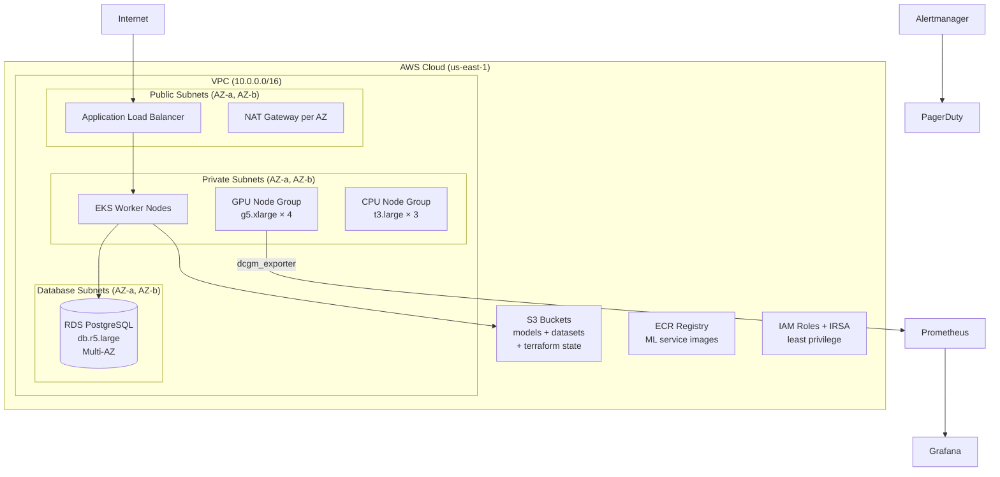

# 🏷️ 09 - Capstone — Production ML Infrastructure from Scratch

## 🎯 Learning Objectives

- Design a complete production ML infrastructure architecture: VPC, EKS with GPU/CPU node groups, RDS PostgreSQL, S3, IAM with least privilege, and Prometheus/Grafana monitoring
- Structure a multi-environment Terraform project with composable modules: VPC, EKS, RDS, and monitoring
- Implement Terratest to verify the entire infrastructure works end-to-end: EKS health, RDS reachability, S3 bucket existence, Prometheus scraping
- Integrate the full CI/CD pipeline: fmt → validate → tflint → tfsec → terraform plan (PR comment) → manual approval → terraform apply → Terratest
- Estimate infrastructure costs with Infracost and detect drift with scheduled plans
- Scale the architecture by changing a single `az_count` variable — demonstrating the power of parameterized IaC

## Introduction

This capstone synthesizes every concept from the Infrastructure as Code course into a single, complete, production-grade ML infrastructure deployment. The architecture you will build is not a toy — it is the same pattern used by ML platform teams at companies from startups to enterprises. It provisions a fully functional ML platform capable of: training models on GPU instances with shared datasets via EFS, serving inference behind an Application Load Balancer, storing model artifacts in S3 with versioning, tracking experiments in RDS PostgreSQL, and monitoring everything with Prometheus and Grafana.

The word *capstone* entered English architecture in the 14th century, referring to the top stone in an arch or dome — the piece that locks all others in place and distributes weight across the structure. Here, the capstone locks together Terraform modules, Ansible configuration, CI/CD pipelines, observability instrumentation, and security policies into a cohesive whole. The architecture you define in this note can be applied to any ML workload, from a two-person research team to a 200-engineer ML platform organization.

The problem before integrated IaC for ML platforms was fragmentation. The VPC was created in the AWS console by one engineer. The EKS cluster was provisioned by a different team using `eksctl`. The RDS instance was configured manually by a DBA. The monitoring stack was installed by a DevOps engineer via Helm commands from their laptop. None of these pieces referenced each other. Upgrading the Kubernetes version meant coordinating three teams across Slack. Disaster recovery meant rebuilding from runbooks that were 11 months out of date. This capstone eliminates that fragmentation: the entire infrastructure is defined in a single Terraform project, versioned in Git, tested with Terratest, and deployed through a CI/CD pipeline. A new environment (dev, staging, prod) is provisioned in 30 minutes by changing one `.tfvars` file. Rollback is `git revert` plus 20 minutes. This note converges all prior notes — [[10 - Cloud, Infra y Backend/23 - Infrastructure as Code/00 - Welcome to Infrastructure as Code|IaC Welcome]], Terraform patterns, [[10 - Cloud, Infra y Backend/23 - Infrastructure as Code/05 - Ansible - Configuration Management at Scale|Ansible]], [[10 - Cloud, Infra y Backend/23 - Infrastructure as Code/06 - CI-CD and GitOps for ML Infrastructure|CI/CD]], [[10 - Cloud, Infra y Backend/23 - Infrastructure as Code/07 - Infrastructure Observability - Prometheus, Grafana and Distributed Tracing|Observability]], and [[10 - Cloud, Infra y Backend/23 - Infrastructure as Code/08 - Terraform Testing - Policy as Code and Security|Testing & Security]].

---

## 1. Architecture Overview

The target architecture is a production ML platform spanning three layers: networking, compute, and data/monitoring.



### Architecture Decisions and Tradeoffs

| Decision | Rationale | Tradeoff |
|----------|-----------|----------|
| EKS over EC2 directly | GPU orchestration, auto-scaling, rolling updates, pod-level IAM (IRSA) | EKS control plane costs $73/month/cluster. For single-node setups, EC2 + Docker is cheaper |
| RDS PostgreSQL over self-managed | Automated backups, Multi-AZ failover, encryption at rest, minor version auto-upgrade | Less control over PG config parameters. No `pg_hba.conf` direct editing |
| Private subnets for workers | Defense in depth: if a container is compromised, it has no direct internet access | Requires NAT Gateway per AZ ($32/month each) for outbound internet (Docker pull, pip install) |
| g5.xlarge over g4dn.xlarge | A10G GPUs (g5) offer 2.5× better FP16 performance than T4 (g4dn) for model inference | g5 instances are 30% more expensive per hour. For training, p4d/p5 are better |
| Prometheus in-cluster via Helm | Single `helm_release` resource, full GitOps compatibility, community dashboards available | Prometheus storage is ephemeral unless you configure persistent volumes. Metric retention limited by PV size |

### Network Architecture Detail

```
VPC: 10.0.0.0/16
├── Public Subnet AZ-a: 10.0.0.0/20    (ALB, NAT Gateway, Bastion)
├── Public Subnet AZ-b: 10.0.16.0/20
├── Private Subnet AZ-a: 10.0.64.0/20  (EKS Workers)
├── Private Subnet AZ-b: 10.0.80.0/20
├── Database Subnet AZ-a: 10.0.128.0/20 (RDS)
├── Database Subnet AZ-b: 10.0.144.0/20
├── Internet Gateway (attached to public subnets)
├── NAT Gateway × 2 (one per AZ, in public subnets, for private subnet egress)
└── VPC Flow Logs → S3 (security audit requirement)
```

---

## 2. Terraform Project Structure

```yaml
# infrastructure/ directory tree
infrastructure/
├── modules/
│   ├── vpc/
│   │   ├── main.tf          # VPC, subnets, route tables, NAT, IGW
│   │   ├── outputs.tf       # vpc_id, subnet_ids, nat_gateway_ips
│   │   └── variables.tf
│   ├── eks/
│   │   ├── main.tf          # EKS cluster, node groups, IRSA, addons
│   │   ├── outputs.tf       # cluster_endpoint, kubeconfig, oidc_provider
│   │   └── variables.tf
│   ├── rds/
│   │   ├── main.tf          # RDS instance, subnet group, parameter group
│   │   ├── outputs.tf       # endpoint, port, database_name
│   │   └── variables.tf
│   └── monitoring/
│       ├── main.tf          # Helm release for kube-prometheus-stack
│       ├── outputs.tf       # grafana_endpoint, prometheus_endpoint
│       └── variables.tf
├── envs/
│   ├── dev/
│   │   ├── main.tf          # Root module: composes all sub-modules
│   │   ├── terraform.tfvars # dev-specific values (smaller instances)
│   │   └── backend.tf       # Remote state config (S3 + DynamoDB)
│   └── prod/
│       ├── main.tf
│       ├── terraform.tfvars # prod values (Multi-AZ, larger instances)
│       └── backend.tf
├── terratest/
│   └── infra_test.go        # Go test: apply → verify → destroy
├── .github/workflows/
│   ├── terraform.yml        # CI/CD pipeline (plan → approval → apply)
│   └── drift-detection.yml  # Scheduled drift check every 6 hours
├── policy/
│   ├── s3_encryption.rego   # OPA policies enforced by Conftest
│   ├── security_groups.rego
│   └── iam_least_privilege.rego
└── .tflint.hcl              # tflint configuration
```

💡 The `envs/` directory pattern (one directory per environment, each composing the same modules with different `.tfvars`) is the most widely used multi-environment Terraform pattern. Alternatives include Terraform workspaces (lighter weight but harder to audit) and Terragrunt (adds DRY configuration but another tool in the chain). For ML infrastructure, the directory-per-environment pattern balances simplicity with auditability.

This structure is directly tested in CI and connects to the module composition patterns explored in Note 03 and the pipeline workflows from [[10 - Cloud, Infra y Backend/23 - Infrastructure as Code/06 - CI-CD and GitOps for ML Infrastructure|Note 06]].

---

## 3. Module Implementations

### VPC Module

```hcl
# modules/vpc/main.tf — VPC with public/private/database subnets
resource "aws_vpc" "main" {
  cidr_block           = var.vpc_cidr
  enable_dns_hostnames = true
  enable_dns_support   = true

  tags = {
    Name        = "${var.environment}-vpc"
    Environment = var.environment
  }
}

resource "aws_flow_log" "main" {
  traffic_type         = "ALL"
  vpc_id               = aws_vpc.main.id
  log_destination_type = "s3"
  log_destination      = "arn:aws:s3:::${var.flow_log_bucket}"
  # 💡 VPC Flow Logs capture ALL IP traffic metadata (src, dst, port, protocol).
  # Required for SOC2 and PCI-DSS compliance. Cost: ~$0.50/GB ingested.
}

resource "aws_subnet" "public" {
  count             = var.az_count
  vpc_id            = aws_vpc.main.id
  cidr_block        = cidrsubnet(var.vpc_cidr, 4, count.index)
  availability_zone = data.aws_availability_zones.available.names[count.index]
  map_public_ip_on_launch = true

  tags = {
    Name = "${var.environment}-public-${count.index}"
    "kubernetes.io/role/elb" = "1"  # Required for AWS Load Balancer Controller
  }
}

resource "aws_subnet" "private" {
  count             = var.az_count
  vpc_id            = aws_vpc.main.id
  cidr_block        = cidrsubnet(var.vpc_cidr, 4, count.index + var.az_count)
  availability_zone = data.aws_availability_zones.available.names[count.index]

  tags = {
    Name = "${var.environment}-private-${count.index}"
    "kubernetes.io/role/internal-elb" = "1"
  }
}

resource "aws_nat_gateway" "main" {
  count         = var.az_count
  allocation_id = aws_eip.nat[count.index].id
  subnet_id     = aws_subnet.public[count.index].id
  # ⚠️ NAT Gateway costs $0.045/hour × 730 hours ≈ $32.85/month/AZ.
  # Two AZs = $65.70/month for internet access from private subnets.
  # This is the largest non-compute cost in the infrastructure.
}
```

### EKS Module

```hcl
# modules/eks/main.tf — EKS cluster with GPU and CPU node groups
resource "aws_eks_cluster" "main" {
  name     = var.cluster_name
  role_arn = aws_iam_role.eks_cluster.arn
  version  = var.kubernetes_version

  vpc_config {
    subnet_ids              = var.private_subnet_ids
    endpoint_private_access = true
    endpoint_public_access  = true
    # ⚠️ public_endpoint_access = true means the K8s API is
    # reachable from the internet (behind IAM auth). For prod,
    # consider false + a bastion host or VPN.
  }

  encryption_config {
    provider {
      key_arn = aws_kms_key.eks.arn
    }
    resources = ["secrets"]
  }

  depends_on = [aws_iam_role_policy_attachment.eks_cluster]
}

resource "aws_eks_node_group" "gpu" {
  cluster_name    = aws_eks_cluster.main.name
  node_group_name = "${var.cluster_name}-gpu"
  node_role_arn   = aws_iam_role.eks_node.arn
  subnet_ids      = var.private_subnet_ids
  capacity_type   = var.gpu_use_spot ? "SPOT" : "ON_DEMAND"

  scaling_config {
    desired_size = var.gpu_desired_count
    max_size     = var.gpu_max_count
    min_size     = var.gpu_min_count
  }

  launch_template {
    id      = aws_launch_template.gpu.id
    version = aws_launch_template.gpu.latest_version
  }

  instance_types = [var.gpu_instance_type]

  labels = {
    workload = "ml-training"
    gpu      = "true"
  }

  taint {
    key    = "nvidia.com/gpu"
    value  = "true"
    effect = "NO_SCHEDULE"
    # ¡Sorpresa! Tainting GPU nodes prevents CPU-only pods from
    # landing on expensive GPU instances. Only pods with GPU
    # tolerations will schedule here.
  }
}

resource "aws_launch_template" "gpu" {
  name_prefix = "${var.cluster_name}-gpu-"

  block_device_mappings {
    device_name = "/dev/xvda"
    ebs {
      volume_size = 200  # GPUs need space for Docker images + datasets
      volume_type = "gp3"
      encrypted   = true
    }
  }

  user_data = base64encode(templatefile("${path.module}/templates/gpu_userdata.sh", {
    efs_id = var.efs_id
  }))
  # 💡 user_data script runs at boot. It mounts EFS, installs
  # nvidia-container-toolkit, and configures Docker for GPU access.
  # This is the bridge between Terraform (provisioning) and
  # configuration management. For complex configs, Ansible
  # post-provisioning is preferred over inline user_data scripts.
}
```

### RDS Module

```hcl
# modules/rds/main.tf — PostgreSQL for model registry and experiment tracking
resource "aws_db_instance" "main" {
  identifier = "${var.environment}-ml-registry"
  engine         = "postgres"
  engine_version = var.postgres_version
  instance_class = var.instance_class

  allocated_storage     = var.allocated_storage
  max_allocated_storage = var.max_allocated_storage
  storage_encrypted     = true

  db_name  = var.database_name
  username = var.admin_username
  password = random_password.master.result
  port     = 5432

  vpc_security_group_ids = [aws_security_group.rds.id]
  db_subnet_group_name   = aws_db_subnet_group.main.name

  backup_retention_period = var.backup_retention_days
  backup_window           = "03:00-04:00"
  maintenance_window      = "sun:04:00-sun:05:00"

  deletion_protection      = var.environment == "prod"
  skip_final_snapshot      = var.environment != "prod"
  final_snapshot_identifier = "${var.environment}-ml-registry-final"

  enabled_cloudwatch_logs_exports = ["postgresql", "upgrade"]
  auto_minor_version_upgrade      = true
  # 💡 auto_minor_version_upgrade = true means RDS patches PG
  # during the maintenance window. Security patches are applied
  # without engineer intervention. Major version upgrades (15→16)
  # are NOT automatic — they require explicit apply.
}
```

---

## 4. Root Module — Composing Everything

```hcl
# envs/prod/main.tf — Root module: compose VPC + EKS + RDS + Monitoring
terraform {
  required_version = ">= 1.7.0"
  required_providers {
    aws   = { source = "hashicorp/aws", version = "~> 5.0" }
    helm  = { source = "hashicorp/helm", version = "~> 2.0" }
    random = { source = "hashicorp/random", version = "~> 3.0" }
  }

  backend "s3" {
    bucket         = "ml-infra-tfstate-prod"
    key            = "09-capstone/terraform.tfstate"
    region         = "us-east-1"
    encrypt        = true
    dynamodb_table = "terraform-locks"
  }
}

provider "aws" {
  region = var.aws_region
}

provider "helm" {
  kubernetes {
    host                   = module.eks.cluster_endpoint
    cluster_ca_certificate = base64decode(module.eks.cluster_ca)
    exec {
      api_version = "client.authentication.k8s.io/v1beta1"
      args        = ["eks", "get-token", "--cluster-name", var.cluster_name, "--region", var.aws_region]
      command     = "aws"
    }
  }
}

module "vpc" {
  source = "../../modules/vpc"
  environment = var.environment
  vpc_cidr    = "10.0.0.0/16"
  az_count    = var.az_count
  flow_log_bucket = "ml-infra-logs-${data.aws_caller_identity.current.account_id}"
}

module "eks" {
  source = "../../modules/eks"
  cluster_name        = "${var.environment}-ml"
  kubernetes_version  = "1.30"
  vpc_id              = module.vpc.vpc_id
  private_subnet_ids  = module.vpc.private_subnet_ids
  gpu_instance_type   = var.gpu_instance_type
  gpu_desired_count   = var.gpu_node_count
  gpu_use_spot        = var.environment != "prod"
  depends_on          = [module.vpc]
}

module "rds" {
  source = "../../modules/rds"
  environment      = var.environment
  database_name    = "ml_registry"
  instance_class   = var.rds_instance_class
  subnet_ids       = module.vpc.database_subnet_ids
  backup_retention_days = var.environment == "prod" ? 35 : 7
  depends_on       = [module.vpc]
}

module "monitoring" {
  source = "../../modules/monitoring"
  cluster_endpoint = module.eks.cluster_endpoint
  cluster_ca       = module.eks.cluster_ca
  environment      = var.environment
  depends_on       = [module.eks]
}

# S3 buckets for model artifacts and datasets
resource "aws_s3_bucket" "models" {
  bucket = "${var.environment}-ml-models-${data.aws_caller_identity.current.account_id}"
  force_destroy = var.environment != "prod"
  # ⚠️ force_destroy = true allows terraform destroy to delete non-empty
  # buckets. In prod, this is false — you must manually empty the bucket
  # before destroying it.
}

resource "aws_s3_bucket_versioning" "models" {
  bucket = aws_s3_bucket.models.id
  versioning_configuration {
    status = "Enabled"
  }
}

resource "aws_s3_bucket_server_side_encryption_configuration" "models" {
  bucket = aws_s3_bucket.models.id
  rule {
    apply_server_side_encryption_by_default {
      sse_algorithm = "aws:kms"
    }
  }
}
```

```hcl
# envs/prod/terraform.tfvars — Production configuration
environment         = "prod"
aws_region          = "us-east-1"
az_count            = 2
gpu_instance_type   = "g5.xlarge"
gpu_node_count      = 4
rds_instance_class  = "db.r5.large"
cluster_name        = "prod-ml"
vpc_cidr            = "10.0.0.0/16"
```

```hcl
# envs/dev/terraform.tfvars — Development configuration (cheaper)
environment         = "dev"
aws_region          = "us-east-1"
az_count            = 2
gpu_instance_type   = "g4dn.xlarge"  # Cheaper GPU for dev
gpu_node_count      = 1              # Single GPU node
rds_instance_class  = "db.t3.medium" # Burstable instance, cheaper
cluster_name        = "dev-ml"
vpc_cidr            = "10.1.0.0/16"  # Non-overlapping with prod
```

¡Sorpresa! Scaling from dev to prod is a `.tfvars` file change. `gpu_node_count = 1` → `gpu_node_count = 4`. `db.t3.medium` → `db.r5.large`. `g4dn.xlarge` → `g5.xlarge`. The Terraform modules handle the rest. This is the power that IaC delivers: parameterized scale.

---

## 5. CI/CD Integration — Full Pipeline

```yaml
# .github/workflows/terraform.yml — Complete infrastructure pipeline
name: "ML Infrastructure CI/CD"

on:
  pull_request:
    paths: ["infrastructure/**"]
    branches: [main]
  push:
    branches: [main]
    paths: ["infrastructure/**"]

env:
  AWS_REGION: us-east-1

jobs:
  validate:
    runs-on: ubuntu-latest
    strategy:
      fail-fast: true
      matrix:
        env: [dev, prod]
    steps:
      - uses: actions/checkout@v4
      - uses: hashicorp/setup-terraform@v3
        with: { terraform_version: "1.7" }
      - run: terraform fmt -check -recursive
        working-directory: infrastructure/envs/${{ matrix.env }}
      - run: terraform init -backend=false
        working-directory: infrastructure/envs/${{ matrix.env }}
      - run: terraform validate
        working-directory: infrastructure/envs/${{ matrix.env }}
      - run: tflint --recursive
        working-directory: infrastructure/envs/${{ matrix.env }}
        continue-on-error: true

  security:
    needs: validate
    runs-on: ubuntu-latest
    steps:
      - uses: actions/checkout@v4
      - uses: aquasecurity/tfsec-action@v1
        with: { working_directory: infrastructure/ }
      - uses: bridgecrewio/checkov-action@v12
        with: { directory: infrastructure/, framework: terraform }

  plan:
    needs: security
    runs-on: ubuntu-latest
    permissions:
      contents: read
      pull-requests: write
      id-token: write
    steps:
      - uses: actions/checkout@v4
      - uses: aws-actions/configure-aws-credentials@v4
        with:
          role-to-assume: arn:aws:iam::123456789:role/github-actions-terraform
          aws-region: us-east-1
      - uses: hashicorp/setup-terraform@v3
      - run: terraform init
        working-directory: infrastructure/envs/prod
      - run: >
          terraform plan -out=tfplan -detailed-exitcode
          2>&1 | tee /tmp/tfplan.txt
        working-directory: infrastructure/envs/prod
        id: plan
        continue-on-error: true
      - uses: actions/github-script@v7
        with:
          script: |
            const plan = require('fs').readFileSync('/tmp/tfplan.txt', 'utf8');
            await github.rest.issues.createComment({
              issue_number: context.issue.number,
              body: `## 📋 Terraform Plan (prod)\n\`\`\`\n${plan.slice(-55000)}\n\`\`\``
            });

  apply:
    needs: plan
    if: github.ref == 'refs/heads/main'
    runs-on: ubuntu-latest
    environment: production
    permissions:
      id-token: write
    steps:
      - uses: actions/checkout@v4
      - uses: aws-actions/configure-aws-credentials@v4
        with:
          role-to-assume: arn:aws:iam::123456789:role/github-actions-terraform
      - uses: hashicorp/setup-terraform@v3
      - run: terraform init
        working-directory: infrastructure/envs/prod
      - run: terraform apply tfplan
        working-directory: infrastructure/envs/prod

  terratest:
    needs: apply
    runs-on: ubuntu-latest
    permissions:
      id-token: write
    steps:
      - uses: actions/checkout@v4
      - uses: aws-actions/configure-aws-credentials@v4
        with:
          role-to-assume: arn:aws:iam::123456789:role/github-actions-terraform
      - uses: actions/setup-go@v5
        with: { go-version: "1.22" }
      - run: go test -v -timeout 45m ./...
        working-directory: infrastructure/terratest
```

**❌ Antipattern**: Provisioning this entire architecture via the AWS console. Estimated time: 2 days of clicking through VPC wizards, EKS cluster creation dialogs, RDS configuration screens, and IAM role editors. Result: unreproducible, zero audit trail, high probability of misconfiguration (wrong subnet association, missing encryption, overly permissive security group).

**✅ Pattern**: Terraform modules composed in a root module, parameterized by `.tfvars`, versioned in Git, tested with Terratest, deployed through CI/CD. Time to provision: 30 minutes (mostly waiting for RDS and EKS). Result: reproducible by any team member, full Git audit trail, consistent across environments.

---

## 🎯 Key Takeaways

- A complete production ML infrastructure spans VPC (networking) → EKS (compute) → RDS (data) → S3 (storage) → Prometheus (monitoring) — all defined in Terraform modules, composed in a root module
- The `envs/{dev,prod}/` directory pattern with shared modules allows you to manage multiple environments with a single codebase — scaling from dev to prod is a `.tfvars` change
- Terratest verifies that the infrastructure actually WORKS: EKS cluster is healthy, RDS is reachable, Prometheus is scraping GPU metrics — not just that Terraform applied without errors
- CI/CD enforces the full pipeline: format → validate → lint → security scan → plan (PR comment) → manual approval → apply → Terratest verification
- EKS with GPU node groups, IRSA for pod-level IAM, and taints/tolerations for GPU scheduling is the production standard for ML inference and training on Kubernetes
- `terraform destroy` takes ~15 minutes because resources must be deleted in dependency order: nodes → cluster → RDS (with deletion protection) → subnets → VPC
- IaC transforms ML infrastructure from a 2-day manual provisioning exercise into a 30-minute automated deployment — reproducible by any team member, versioned in Git, tested in CI

## 📦 Código de Compresión

```hcl
# envs/prod/main.tf — Root module composing the complete ML platform
terraform {
  backend "s3" {
    bucket         = "ml-infra-tfstate"
    key            = "capstone/terraform.tfstate"
    region         = "us-east-1"
    encrypt        = true
    dynamodb_table = "terraform-locks"
  }
  required_providers {
    aws   = { source = "hashicorp/aws", version = "~> 5.0" }
    helm  = { source = "hashicorp/helm",  version = "~> 2.0" }
  }
}

module "vpc" {
  source      = "../../modules/vpc"
  environment = var.environment
  vpc_cidr    = "10.0.0.0/16"
  az_count    = var.az_count
}

module "eks" {
  source             = "../../modules/eks"
  cluster_name       = "${var.environment}-ml"
  kubernetes_version = "1.30"
  vpc_id             = module.vpc.vpc_id
  private_subnet_ids = module.vpc.private_subnet_ids
  gpu_instance_type  = "g5.xlarge"
  gpu_desired_count  = var.gpu_node_count
  depends_on         = [module.vpc]
}

module "rds" {
  source                = "../../modules/rds"
  environment           = var.environment
  database_name         = "ml_registry"
  instance_class        = var.rds_instance_class
  subnet_ids            = module.vpc.database_subnet_ids
  backup_retention_days = var.environment == "prod" ? 35 : 7
  depends_on            = [module.vpc]
}

module "monitoring" {
  source           = "../../modules/monitoring"
  cluster_endpoint = module.eks.cluster_endpoint
  cluster_ca       = module.eks.cluster_ca
  environment      = var.environment
  depends_on       = [module.eks]
}

resource "aws_s3_bucket" "models" {
  bucket        = "${var.environment}-ml-models"
  force_destroy = var.environment != "prod"
}

resource "aws_s3_bucket_versioning" "models" {
  bucket = aws_s3_bucket.models.id
  versioning_configuration { status = "Enabled" }
}

resource "aws_s3_bucket_server_side_encryption_configuration" "models" {
  bucket = aws_s3_bucket.models.id
  rule {
    apply_server_side_encryption_by_default {
      sse_algorithm = "aws:kms"
    }
  }
}
```

---

## References

- HashiCorp. (2024). *Terraform AWS Provider Documentation*. https://registry.terraform.io/providers/hashicorp/aws/latest/docs — Complete resource reference for EKS, RDS, VPC, and IAM.
- AWS. (2024). *Amazon EKS Best Practices Guide*. https://aws.github.io/aws-eks-best-practices/ — Security, networking, and scalability patterns for production EKS.
- Gruntwork. (2024). *Terratest Documentation*. https://terratest.gruntwork.io/docs/ — Go library for infrastructure verification testing.
- NVIDIA. (2024). *GPU Operator for Kubernetes*. https://docs.nvidia.com/datacenter/cloud-native/gpu-operator/ — Automated GPU driver installation and management on Kubernetes.
- Prometheus Community. (2024). *kube-prometheus-stack Helm Chart*. https://github.com/prometheus-community/helm-charts — Production Prometheus + Grafana deployment on Kubernetes.
- [[10 - Cloud, Infra y Backend/22 - Cloud Computing/01 - Fundamentos de Cloud y Modelos de Servicio|Cloud Fundamentals]]
- [[10 - Cloud, Infra y Backend/22 - Cloud Computing/04 - Redes y Seguridad en Cloud|Cloud Networking]]
- [[09/20 - Deployment and Serving]]
- [[09/29 - CI-CD for ML]]
- [[09/21 - Monitoreo y Mantenimiento]]
- [[10 - Cloud, Infra y Backend/23 - Infrastructure as Code/00 - Welcome to Infrastructure as Code|IaC Welcome]]
- [[10 - Cloud, Infra y Backend/23 - Infrastructure as Code/05 - Ansible - Configuration Management at Scale|Ansible]]
- [[10 - Cloud, Infra y Backend/23 - Infrastructure as Code/06 - CI-CD and GitOps for ML Infrastructure|CI/CD and GitOps]]
- [[10 - Cloud, Infra y Backend/23 - Infrastructure as Code/07 - Infrastructure Observability - Prometheus, Grafana and Distributed Tracing|Observability]]
- [[10 - Cloud, Infra y Backend/23 - Infrastructure as Code/08 - Terraform Testing - Policy as Code and Security|Testing and Security]]
- [[13/02 - Go for Cloud Native]]
