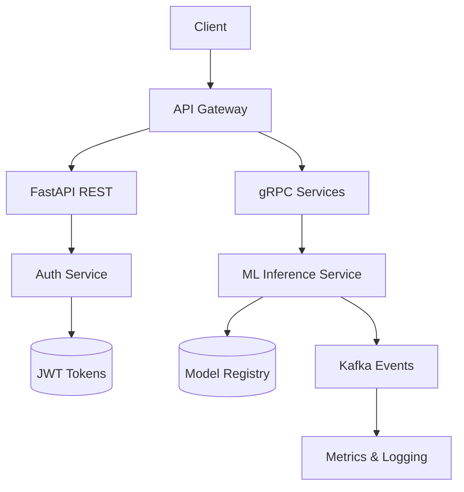
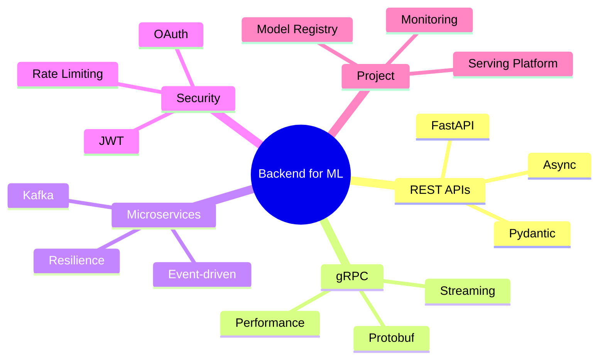

# 🚀 Welcome: Backend for ML

Welcome to module 24 of the Machine Learning and AI Engineering program. This unit explores how to build robust, scalable, secure backend infrastructure for serving machine learning models in production.

The transition from a Jupyter notebook to a production system requires mastery of APIs, communication protocols, distributed architectures, and security. Without a well-designed backend, even the most accurate model remains inaccessible to users and applications.

## 1. Learning Objectives

By the end of this course, you will be able to:

1. Design efficient REST APIs using FastAPI and Pydantic to serve ML inference.
2. Implement inter-service communication with gRPC and Protocol Buffers.
3. Architect microservice and event-driven systems with resilience.
4. Secure APIs with JWT authentication, OAuth 2.0, rate limiting, and best practices.
5. Build a complete production model serving platform.

## 2. Course Map

| # | Note | Description |
|---|------|-------------|
| 00 | [[00 - Welcome]] | Index, glossary, and learning objectives |
| 01 | [[01 - FastAPI and REST APIs]] | Building RESTful APIs with FastAPI |
| 02 | [[02 - gRPC and Inter-Service Communication]] | High-performance communication with gRPC |
| 03 | [[03 - Microservices and Event Architecture]] | Microservices, events, and resilience |
| 04 | [[04 - Authentication and API Security]] | Security, auth, and endpoint protection |
| 05 | [[05 - Capstone: Model Serving Platform]] | Integrated ML serving project |
| 06 | [[../31 - FastAPI for ML/00 - Welcome to FastAPI for ML\|FastAPI for ML]] (merged) | ASGI, async, Pydantic, streaming, DI, production |
| 07 | [[../38 - SQLAlchemy 2.0 Async + Alembic for FastAPI/00 - Welcome\|SQLAlchemy 2.0 + Alembic]] | Data layer for production services |
| 08 | [[../40 - Background Jobs and Workers for FastAPI/00 - Welcome\|Background Jobs]] | Async work, retries, idempotency |
| 09 | [[../41 - API Design Patterns for FastAPI/00 - Welcome\|API Design Patterns]] | RFC 7807, versioning, pagination, OpenAPI |
| 10 | [[../42 - Caching Strategies for FastAPI/00 - Welcome\|Caching Strategies]] | HTTP caching, Redis, invalidation |
| 11 | [[../45 - Webhooks In and Out for FastAPI/00 - Welcome\|Webhooks In/Out]] | Outgoing and incoming webhooks |

## 3. Module Diagram



## 4. Glossary

| Term | Definition |
|------|------------|
| **API** | Application Programming Interface. A protocol that enables software-to-software communication. |
| **REST** | Representational State Transfer. An architectural style for distributed hypermedia systems based on resources and HTTP verbs. |
| **HTTP** | Hypertext Transfer Protocol. The foundation of web communication (GET, POST, PUT, DELETE). |
| **gRPC** | Google Remote Procedure Call. A high-performance RPC framework based on HTTP/2 and Protocol Buffers. |
| **protobuf** | Protocol Buffers. A structured serialization mechanism developed by Google, extensible and efficient. |
| **microservice** | An architectural style that structures an application as a collection of loosely coupled services. |
| **monolith** | A single application where all components are integrated in one deployment. |
| **event-driven** | An architecture where the production, detection, and consumption of events drive the application flow. |
| **Kafka** | A distributed streaming platform with high throughput for building real-time data pipelines. |
| **RabbitMQ** | A message broker that implements AMQP and facilitates asynchronous inter-service communication. |
| **auth** | The process of authentication (identity verification) and authorization (access permissions). |
| **JWT** | JSON Web Token. A compact, self-contained token for securely transmitting information between parties. |
| **OAuth** | An open authorization protocol that allows third parties to obtain limited access to resources. |
| **rate limiting** | A technique to control the amount of traffic sent to or received by an endpoint. |
| **middleware** | Intermediate software that processes requests and responses in an application pipeline. |
| **async** | An asynchronous programming model that handles multiple concurrent operations without blocking. |
| **dependency injection** | A design pattern in which an object receives its dependencies from an external source rather than creating them. |

## 5. Relevance for ML/AI Engineering

Machine learning models generate no value until they are exposed through consumable interfaces. The backend is the bridge between data science and production software engineering.

Production ML system metrics measure not only model accuracy, $Accuracy = \frac{TP + TN}{TP + TN + FP + FN}$, but also inference latency, request throughput, and service availability.

Real case: Netflix uses microservices to serve personalized recommendations. Its backend processes more than 450 billion events daily through event-driven architectures to feed real-time ranking models.

## 6. Module Mindmap



## 7. Visual Resources


---

⚠️ **Warning:** This module assumes prior knowledge of Python, HTTP, and basic networking concepts. Complete the previous Advanced Python modules before continuing.

💡 **Tip:** Maintain a virtual environment for each service you build. Dependency isolation is critical when working with multiple models and ML libraries.

## 📦 Compression Code

```python
# summary_welcome.py
# Executive summary of module 24 - Backend for ML

MODULE_TOPICS = [
    "FastAPI and REST APIs",
    "gRPC and Inter-Service Communication",
    "Microservices and Event Architecture",
    "Authentication and API Security",
    "Capstone - Model Serving Platform",
]

GLOSSARY_ESSENTIALS = [
    "API", "REST", "HTTP", "gRPC", "protobuf",
    "microservice", "monolith", "event-driven",
    "Kafka", "RabbitMQ", "JWT", "OAuth",
]

print(f"=== Module 24: Backend for ML ===")
print(f"Topics: {len(MODULE_TOPICS)}")
print(f"Key terms: {len(GLOSSARY_ESSENTIALS)}")
```
