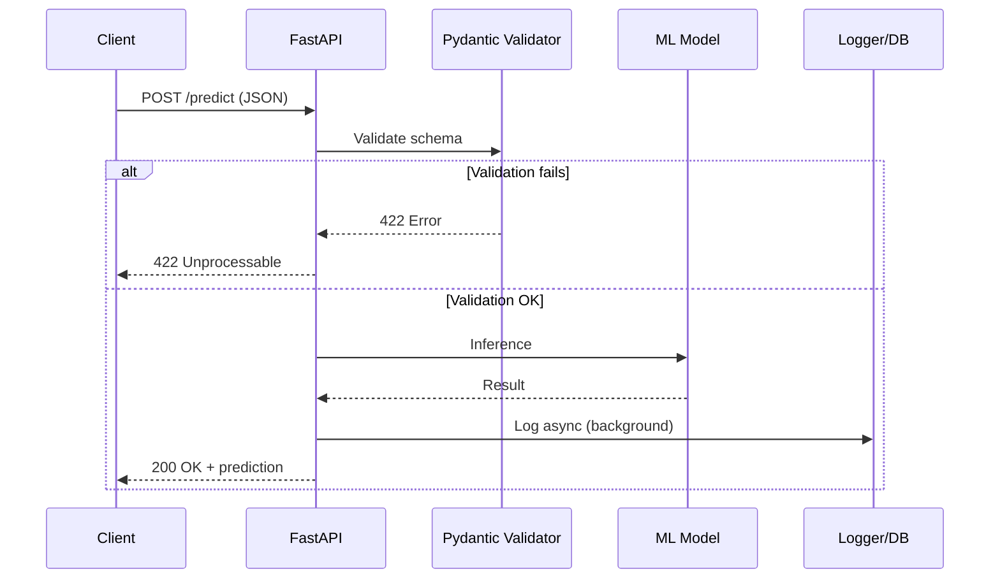

# ⚡ FastAPI and REST APIs

REST APIs are the de facto standard for exposing machine learning models to heterogeneous clients. FastAPI, a modern Python framework built on Starlette and Pydantic, has emerged as the preferred tool for building high-performance APIs thanks to its native async/await support, automatic validation, and OpenAPI documentation generation.

In ML Engineering, a REST API allows data scientists to deploy models without worrying about the client's language. Inference becomes an accessible HTTP resource: a POST to `/predict` with a JSON payload returns the prediction.

## 1. Python API Framework Comparison

| Feature | FastAPI | Flask | Django REST Framework |
|---------|---------|-------|----------------------|
| Performance | Very high | Medium | Medium |
| Auto-validation | Yes (Pydantic) | No (extension needed) | Yes (serializers) |
| Auto-documentation | Yes (Swagger/ReDoc) | No (extension needed) | Yes (with config) |
| Native async/await | Yes | No | Partial |
| Learning curve | Medium | Low | High |
| Dependency injection | Native | No | Partial |
| Framework size | Lightweight | Lightweight | Heavyweight |

Choosing FastAPI for ML is not arbitrary. When serving models, latency matters. The ability to handle multiple concurrent requests via `async` prevents a heavy model from blocking the server.

Real case: Uber migrated demand-prediction services to FastAPI to reduce ML endpoint latency by 40%, leveraging async support for I/O-intensive workloads.

### Quick start

```bash
# Create and activate a virtual environment
python -m venv myenv
source myenv/bin/activate  # On Windows: myenv\Scripts\activate

# Install FastAPI
pip install fastapi uvicorn

# Run the app
uvicorn main:app --reload
```

## 2. Async/Await in ML Endpoints

Python's async concurrency model, based on the event loop, is ideal for I/O-bound operations such as receiving HTTP requests, reading files, or calling databases.

```python
import asyncio
from fastapi import FastAPI

app = FastAPI()

@app.post("/predict")
async def predict(features: dict):
    # Non-blocking I/O: read model from storage
    model = await load_model_async("s3://models/v1.pkl")
    # CPU-bound: inference does block, use ThreadPoolExecutor
    loop = asyncio.get_event_loop()
    prediction = await loop.run_in_executor(None, model.predict, features)
    return {"prediction": prediction}
```

⚠️ **Warning:** CPU-bound operations (like deep learning inference) should not be executed directly in coroutines because they block the event loop. Use `run_in_executor` or separate processes.

💡 **Tip:** For deep learning models that support batching, accumulate requests over a time window $t$ and run batched inference to maximize throughput.

## 3. Validation with Pydantic

Pydantic uses Python type hints to validate and serialize data. In ML APIs, this ensures input features match the expected schema before reaching the model.

```python
from pydantic import BaseModel, Field
from typing import List

class InferenceRequest(BaseModel):
    features: List[float] = Field(..., min_length=10, max_length=10)
    model_version: str = Field(default="v1", pattern=r"^v\d+$")
    
    class Config:
        json_schema_extra = {
            "example": {
                "features": [0.1, 0.2, 0.3, 0.4, 0.5, 0.6, 0.7, 0.8, 0.9, 1.0],
                "model_version": "v1"
            }
        }

@app.post("/predict")
async def predict(request: InferenceRequest):
    # Data is already validated
    return {"input_shape": len(request.features)}
```

Upfront validation prevents costly runtime errors. If a client sends 9 features instead of 10, FastAPI automatically responds with 422 Unprocessable Entity.

## 4. Dependency Injection

FastAPI implements dependency injection natively. This allows sharing resources (like database connections or model instances) across endpoints in a clean way.

```python
from fastapi import Depends

async def get_model():
    model = await load_model("production")
    try:
        yield model
    finally:
        await model.cleanup()

@app.post("/predict")
async def predict(request: InferenceRequest, model=Depends(get_model)):
    result = model.predict(request.features)
    return {"prediction": result}
```

Dependency injection simplifies testing. You can substitute `get_model` with a mock during unit tests without modifying the endpoint logic.

## 5. Background Tasks and Middleware

Background tasks are essential for ML: logging predictions, storing metrics, or queuing retraining jobs should not block the response to the client.

```python
from fastapi import BackgroundTasks

async def log_prediction(features: list, prediction: float):
    await save_to_db(features, prediction)

@app.post("/predict")
async def predict(
    request: InferenceRequest,
    background_tasks: BackgroundTasks,
    model=Depends(get_model)
):
    result = model.predict(request.features)
    background_tasks.add_task(log_prediction, request.features, result)
    return {"prediction": result}
```

Middleware allows running code before and after each request. Useful for metrics, tracing, or security headers.

```python
from fastapi import Request
import time

@app.middleware("http")
async def add_process_time_header(request: Request, call_next):
    start_time = time.time()
    response = await call_next(request)
    process_time = time.time() - start_time
    response.headers["X-Process-Time"] = str(process_time)
    return response
```

## 6. Exception Handlers and Robustness

ML models fail: unexpected features, incompatible versions, or memory errors. A good backend captures and transforms these exceptions into coherent HTTP responses.

```python
from fastapi import HTTPException
from fastapi.responses import JSONResponse

class ModelNotFoundException(Exception):
    pass

@app.exception_handler(ModelNotFoundException)
async def model_not_found_handler(request, exc):
    return JSONResponse(
        status_code=404,
        content={"detail": "Model not found in registry"}
    )
```

⚠️ **Warning:** Never expose full tracebacks to the client in production. Use internal loggers and respond with generic messages to the user.

## 7. OpenAPI and Auto-Generated Swagger

FastAPI auto-generates interactive documentation at `/docs` (Swagger UI) and `/redoc` (ReDoc). This eliminates duplication between code and documentation.


For ML teams, this means data scientists can test endpoints directly from the browser without writing client code.

## 8. Testing with TestClient

Testing ML APIs should cover input validation, response integrity, and error handling.

```python
from fastapi.testclient import TestClient

client = TestClient(app)

def test_predict_valid_input():
    response = client.post("/predict", json={
        "features": [0.1] * 10,
        "model_version": "v1"
    })
    assert response.status_code == 200
    assert "prediction" in response.json()

def test_predict_invalid_input():
    response = client.post("/predict", json={
        "features": [0.1] * 9  # Incorrect length
    })
    assert response.status_code == 422
```

## 9. Deployment: Uvicorn and Gunicorn

FastAPI runs on ASGI, not WSGI. Uvicorn is the recommended ASGI server, and Gunicorn acts as a process manager for multiple Uvicorn workers.

```bash
# Development
uvicorn main:app --reload --host 0.0.0.0 --port 8000

# Production: multiple workers
# Recommended formula: workers = 2 * CPU_cores + 1
gunicorn main:app -w 4 -k uvicorn.workers.UvicornWorker --bind 0.0.0.0:8000
```

The Gunicorn workers formula:

$$
W = 2 \times C + 1
$$

Where $W$ is the number of workers and $C$ is the number of CPU cores. For ML workloads, consider workers = number of available GPUs if each worker loads a model onto GPU.

## 10. API Versioning

In ML, versioning is critical. Models evolve and APIs must support multiple versions simultaneously.

```python
from fastapi import APIRouter

v1_router = APIRouter(prefix="/v1")
v2_router = APIRouter(prefix="/v2")

@v1_router.post("/predict")
async def predict_v1(request: InferenceRequest):
    model = await load_model("v1")
    return model.predict(request.features)

@v2_router.post("/predict")
async def predict_v2(request: InferenceRequest):
    model = await load_model("v2")
    return model.predict_enhanced(request.features)

app.include_router(v1_router)
app.include_router(v2_router)
```

Real case: OpenAI explicitly versions its GPT APIs. Each model (`gpt-3.5-turbo`, `gpt-4`) exposes different capabilities through the same base endpoint with different API versions.

## 11. ML API Architecture



## 12. Reference Images


---

⚠️ **Warning:** Do not expose inference endpoints without authentication in production. An attacker could saturate your service with malicious requests or extract information from the model (model inversion attacks).

💡 **Tip:** Implement health checks (`/health`) that verify not only that the server responds, but also that the model is loaded and ready for inference.

## 📦 Compression Code

```python
# fastapi_ml_api.py
# Complete FastAPI REST API for ML model serving

from fastapi import FastAPI, Depends, BackgroundTasks, HTTPException
from pydantic import BaseModel, Field
from typing import List
import asyncio
import time

app = FastAPI(title="ML Inference API", version="1.0.0")

class PredictRequest(BaseModel):
    features: List[float] = Field(..., min_length=10, max_length=10)
    model_version: str = "v1"

class PredictResponse(BaseModel):
    prediction: float
    model_version: str
    latency_ms: float

# Mock model
class FakeModel:
    def predict(self, features: List[float]) -> float:
        return sum(features) / len(features)
    async def cleanup(self):
        pass

async def get_model():
    model = FakeModel()
    try:
        yield model
    finally:
        await model.cleanup()

async def log_prediction(features, result, version):
    await asyncio.sleep(0.01)
    print(f"[LOG] v={version} pred={result:.4f}")

@app.middleware("http")
async def add_metrics(request, call_next):
    start = time.time()
    response = await call_next(request)
    latency = (time.time() - start) * 1000
    response.headers["X-Latency-Ms"] = str(latency)
    return response

@app.post("/predict", response_model=PredictResponse)
async def predict(
    req: PredictRequest,
    background: BackgroundTasks,
    model=Depends(get_model)
):
    start = time.time()
    pred = model.predict(req.features)
    latency = (time.time() - start) * 1000
    background.add_task(log_prediction, req.features, pred, req.model_version)
    return PredictResponse(
        prediction=pred,
        model_version=req.model_version,
        latency_ms=latency
    )

@app.get("/health")
async def health():
    return {"status": "ok", "model_loaded": True}

# Run: uvicorn fastapi_ml_api:app --reload
```
