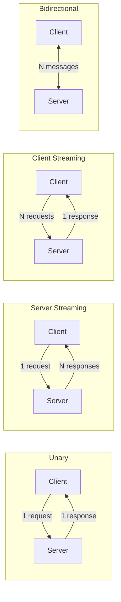
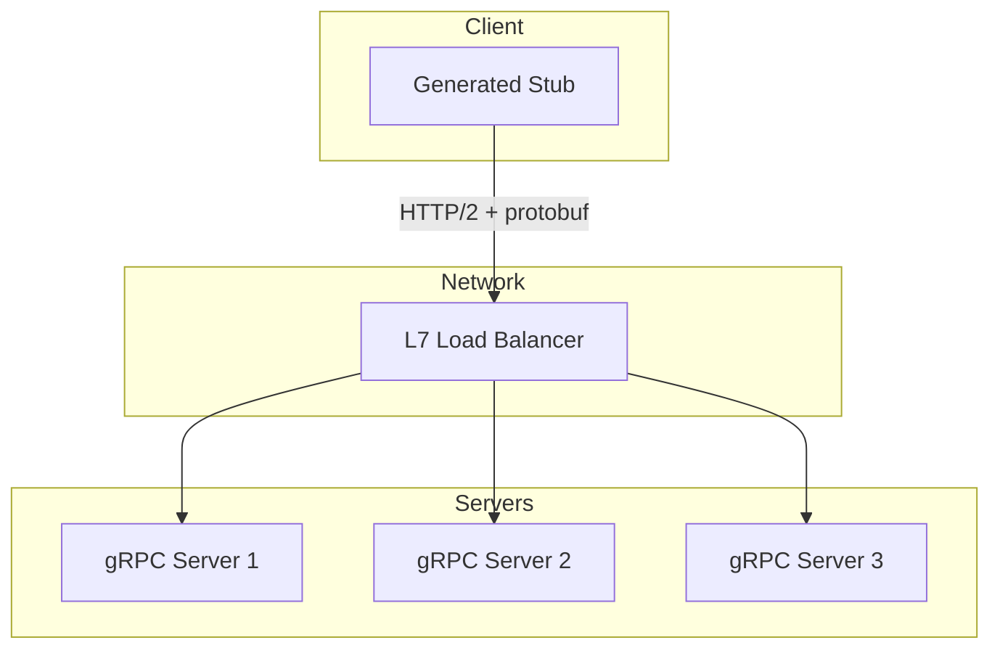

# 🔌 gRPC and Inter-Service Communication

When a REST API is no longer sufficient for the latency and throughput demands of distributed ML systems, gRPC emerges as the standard solution for inter-service communication. Developed by Google, gRPC uses HTTP/2 and Protocol Buffers to offer strongly-typed contracts, bidirectional streaming, and serialization efficiency superior to JSON.

In ML platforms, gRPC is fundamental for connecting data ingestion, preprocessing, inference, and post-processing services where each accumulated millisecond of latency impacts the user experience.

## 1. REST vs gRPC: Deep Comparison

| Feature | REST (JSON/HTTP 1.1) | gRPC (Protobuf/HTTP 2) |
|---------|----------------------|------------------------|
| Transport protocol | HTTP/1.1 or HTTP/2 | HTTP/2 required |
| Data format | JSON (text, verbose) | Protobuf (binary, compact) |
| Contract | OpenAPI/Swagger (optional) | .proto required (strongly typed) |
| Streaming | Not native (SSE/WebSocket workaround) | Unary, Server, Client, Bidirectional |
| Code generation | Manual or tool-based | Automatic from .proto |
| Browser compatibility | Native | Requires gRPC-Web proxy |
| Typical latency | High (handshake per request) | Low (multiplexing + persistent connection) |
| Payload size | ~2-3x larger | Minimal (optimized binary) |

HTTP/2 multiplexing allows multiple RPCs to share a single TCP connection, eliminating the connection setup overhead that REST over HTTP/1.1 suffers from.

Real case: TensorFlow Serving, Google's official system for serving TensorFlow models, exposes its API primarily through gRPC. Batched predictions via gRPC are up to 5x faster than equivalent REST/JSON calls due to protobuf efficiency.

## 2. Protocol Buffers (protobuf)

Protocol Buffers is a language- and platform-independent serialization mechanism. Messages are defined in `.proto` files and the `protoc` compiler generates client and server code.

A typical protobuf message for ML inference:

```protobuf
syntax = "proto3";

package ml.inference;

service InferenceService {
  rpc Predict(PredictRequest) returns (PredictResponse);
  rpc PredictStream(stream PredictRequest) returns (stream PredictResponse);
}

message PredictRequest {
  string model_name = 1;
  string model_version = 2;
  repeated float features = 3;
  map<string, string> metadata = 4;
}

message PredictResponse {
  repeated float predictions = 1;
  int64 inference_time_ms = 2;
  string model_version = 3;
}
```

Each field has a unique number (tag) that identifies the field in binary serialization. This design allows adding new fields without breaking backward compatibility: an old client simply ignores unknown tags.

💡 **Tip:** Number fields consecutively but reserve ranges for future extensions. Tags 1-15 occupy 1 byte in serialization; 16-2047 occupy 2 bytes.

## 3. gRPC Streaming Modes

gRPC supports four communication modes, each with specific ML applications:



| Mode | ML Use Case |
|------|-------------|
| **Unary** | Simple prediction: single request/response. |
| **Server Streaming** | Streaming partial results from a seq2seq model. |
| **Client Streaming** | Send batch progressively for cumulative inference. |
| **Bidirectional** | Chatbots with LLMs: send tokens and receive generated tokens. |

## 4. Python Implementation: Server and Client

First, generate code from the `.proto`:

```bash
python -m grpc_tools.protoc -I. --python_out=. --grpc_python_out=. inference.proto
```

gRPC server with Python:

```python
# server.py
from concurrent import futures
import grpc
import inference_pb2
import inference_pb2_grpc

class InferenceServicer(inference_pb2_grpc.InferenceServiceServicer):
    def Predict(self, request, context):
        # Mock inference
        prediction = sum(request.features) / max(len(request.features), 1)
        return inference_pb2.PredictResponse(
            predictions=[prediction],
            inference_time_ms=12,
            model_version=request.model_version
        )
    
    def PredictStream(self, request_iterator, context):
        for request in request_iterator:
            yield self.Predict(request, context)

def serve():
    server = grpc.server(futures.ThreadPoolExecutor(max_workers=10))
    inference_pb2_grpc.add_InferenceServiceServicer_to_server(
        InferenceServicer(), server
    )
    server.add_insecure_port("[::]:50051")
    server.start()
    server.wait_for_termination()

if __name__ == "__main__":
    serve()
```

gRPC client:

```python
# client.py
import grpc
import inference_pb2
import inference_pb2_grpc

def run():
    channel = grpc.insecure_channel("localhost:50051")
    stub = inference_pb2_grpc.InferenceServiceStub(channel)
    
    request = inference_pb2.PredictRequest(
        model_name="regressor",
        model_version="v1",
        features=[0.1, 0.2, 0.3, 0.4, 0.5],
        metadata={"client_id": "web_app"}
    )
    
    response = stub.Predict(request)
    print(f"Prediction: {response.predictions}")
    print(f"Reported latency: {response.inference_time_ms}ms")

if __name__ == "__main__":
    run()
```

⚠️ **Warning:** In production, never use `insecure_channel`. Configure TLS credentials with `grpc.ssl_channel_credentials()` to encrypt inter-service communication.

## 5. Interceptors and Middleware

Interceptors in gRPC work similarly to FastAPI middleware: they process requests and responses for logging, authentication, metrics, or distributed tracing.

```python
class AuthInterceptor(grpc.ServerInterceptor):
    def intercept_service(self, continuation, handler_call_details):
        # Pre-authentication logic
        print(f"Request to: {handler_call_details.method}")
        return continuation(handler_call_details)

server = grpc.server(
    futures.ThreadPoolExecutor(max_workers=10),
    interceptors=(AuthInterceptor(),)
)
```

## 6. Load Balancing and Service Mesh

gRPC uses persistent HTTP/2 connections, which complicates L4 load balancing. The solution is **L7 load balancing**, where the client maintains multiple sub-connections and distributes RPCs among them.

| Strategy | Description |
|----------|-------------|
| **Round Robin** | Distribute RPCs circularly among backends. |
| **Pick First** | Connect to the first available backend. |
| **Weighted** | Assign weights based on server capacity. |

Real case: Istio, a service mesh for Kubernetes, injects sidecar proxies (Envoy) alongside each ML pod. These proxies automatically handle gRPC L7 load balancing, mTLS between services, and circuit breaking without modifying the application code.

## 7. Performance: Quantitative Metrics

gRPC's efficiency over REST can be quantified in three dimensions:

**Latency ($L$):**

$$
L_{gRPC} \approx L_{REST} \times 0.3 \text{ to } 0.5
$$

**Throughput ($T$):**

$$
T_{gRPC} = \frac{N_{requests}}{T_{total}} \gg T_{REST}
$$

Due to HTTP/2 multiplexing and the absence of JSON parsing overhead.

**Payload size ($S$):**

$$
S_{protobuf} \approx S_{JSON} \times 0.25 \text{ to } 0.35
$$

| Metric | REST/JSON | gRPC/Protobuf | Improvement |
|---------|-----------|---------------|-------------|
| Latency p50 | 45 ms | 12 ms | 3.75x |
| Latency p99 | 180 ms | 35 ms | 5.1x |
| Throughput | 2,000 RPS | 15,000 RPS | 7.5x |
| Payload (10k features) | 280 KB | 78 KB | 3.6x |

## 8. When to Use gRPC vs REST

| Scenario | Recommendation |
|----------|----------------|
| Public API exposed to browsers | REST + OpenAPI |
| Internal microservice communication | gRPC |
| Streaming models (LLMs, audio) | gRPC bidirectional |
| Legacy system integration | REST |
| High-frequency predictions | gRPC |
| HTTP caching required | REST |

💡 **Tip:** Many ML platforms adopt a hybrid pattern: REST at the edge (API Gateway to external clients) and gRPC in the core (communication between internal microservices).

## 9. gRPC Architecture Diagram



## 10. Reference Images


---

⚠️ **Warning:** `.proto` files are contracts. Any incompatible change (changing the type of an existing field, reusing a tag) breaks old clients. Use semantic versioning rules for your protobuf schemas.

💡 **Tip:** Use `grpcio-reflection` to enable reflection on development servers. Tools like `grpcurl` or Postman can introspect services without needing local `.proto` files.

## 📦 Compression Code

```python
# grpc_ml_serving.py
# Minimal gRPC server and client for ML serving

# --- inference.proto (definition) ---
PROTO_DEF = """
syntax = "proto3";
package ml;

service Predictor {
  rpc Predict(PredictRequest) returns (PredictResponse);
}

message PredictRequest {
  repeated float features = 1;
}

message PredictResponse {
  float score = 1;
}
"""

# --- Server ---
from concurrent import futures
import grpc

# Assuming inference_pb2 and inference_pb2_grpc were generated
class PredictorServicer(inference_pb2_grpc.PredictorServicer):
    def Predict(self, request, context):
        score = sum(request.features) / max(len(request.features), 1)
        return inference_pb2.PredictResponse(score=score)

def serve():
    server = grpc.server(futures.ThreadPoolExecutor(max_workers=4))
    inference_pb2_grpc.add_PredictorServicer_to_server(PredictorServicer(), server)
    server.add_insecure_port("[::]:50051")
    print("gRPC Server on port 50051")
    server.wait_for_termination()

# --- Client ---
def predict(features):
    channel = grpc.insecure_channel("localhost:50051")
    stub = inference_pb2_grpc.PredictorStub(channel)
    req = inference_pb2.PredictRequest(features=features)
    resp = stub.Predict(req)
    return resp.score

# Run server and then:
# print(predict([0.1, 0.2, 0.3, 0.4, 0.5]))
```
