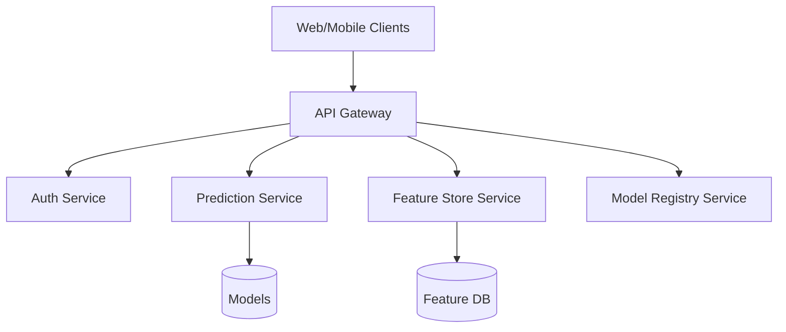
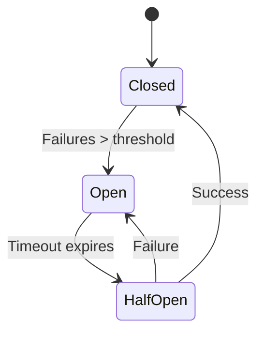
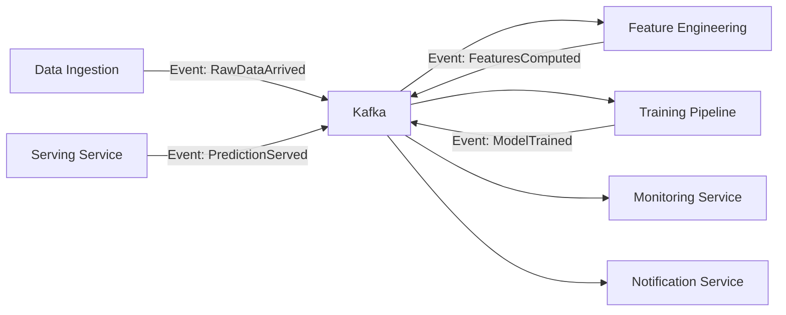
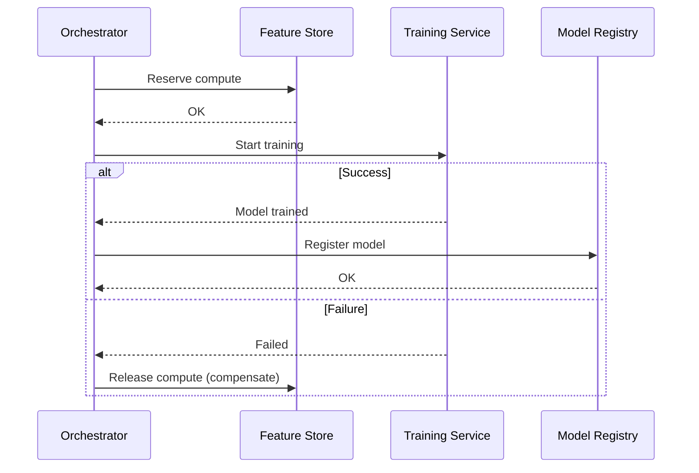

# 🏗️ Microservices and Event Architecture

The monolith has been the natural starting point for most ML applications: a single Python script that loads data, trains a model, and exposes an API. However, when the platform grows — multiple models, concurrent teams, independent scalability requirements — a microservices architecture becomes inevitable.

A modern ML system is not an application but an ecosystem: data ingestion, feature store, training, serving, monitoring, and automated retraining. Each of these components has distinct load patterns, scalability requirements, and deployment cycles.

## 1. Monolith vs Microservices

| Feature | Monolith | Microservices |
|---------|----------|---------------|
| Deployment | Single, coupled | Independent per service |
| Scalability | Horizontal of whole app | Per critical component |
| Cognitive complexity | Low initially | High, distributed |
| Technology | Homogeneous | Polyglot allowed |
| Debugging | Simple | Requires distributed tracing |
| Data consistency | Strong (one DB) | Eventual |
| Startup time | Long | Quick per service |

Conway's Law predicts that a system's architecture reflects the communication structure of the organization that designed it. Autonomous teams need autonomous services.

Real case: Netflix migrated from a Java monolith to over 700 microservices to support its streaming platform. Its ML recommendation system consists of dozens of specialized services: ingestion, feature computation, model training, A/B testing, and serving, each with its own lifecycle.

## 2. Bounded Contexts and Domain-Driven Design

In ML, a bounded context defines the semantic boundaries of a model. The concept of "user" for the recommendation model is not the same as "user" for the billing system.

| Context | "User" Entity | Relevant Attributes |
|----------|---------------|---------------------|
| Recommendation | Viewer | Viewing history, preferred genres, session time |
| Billing | Subscriber | Payment method, active plan, renewal date |
| Security | Account | Credentials, roles, tokens, MFA |

Respecting bounded contexts prevents a change in the billing schema from inadvertently impacting an ML model.

## 3. API Gateway

The API Gateway acts as a single facade to the outside, routing requests to internal microservices and centralizing cross-cutting concerns: authentication, rate limiting, logging, and protocol translation.



💡 **Tip:** In hybrid architectures, the API Gateway translates external REST to internal gRPC, allowing clients to consume JSON while internal services communicate efficiently with protobuf.

## 4. Service Discovery

In dynamic environments (Kubernetes, auto-scaling), service IP addresses change constantly. Service discovery allows consumers to automatically locate healthy instances.

| Tool | Type | Common Integration |
|------|------|---------------------|
| **Consul** | DNS + Health checks | Kubernetes, VMs |
| **Eureka** | Client-side registry | Spring Cloud, Netflix stack |
| **Kubernetes DNS** | Server-side | Native in K8s |
| **AWS Cloud Map** | Cloud-native | ECS, EKS |

The instance selection algorithm can be round-robin, least-connections, or based on health scores:

$$
S_i = \frac{1}{L_i + \epsilon} \times H_i
$$

Where $S_i$ is the selection score, $L_i$ is the average latency, and $H_i$ is the health score (0-1) of instance $i$.

## 5. Circuit Breaker and Resilience

Cascading failure is the worst enemy of distributed systems. If the feature store service collapses, the prediction service should not block waiting indefinitely for timeouts.

The Circuit Breaker pattern has three states:



| State | Behavior |
|-------|----------|
| **Closed** | Requests flow normally. Error rate is monitored. |
| **Open** | Requests fail immediately. Fallback is returned. |
| **Half-Open** | A test request is allowed to verify recovery. |

Implementations:
- **Java:** Resilience4j
- **Python:** pybreaker
- **Go:** gobreaker

```python
from pybreaker import CircuitBreaker

breaker = CircuitBreaker(fail_max=5, reset_timeout=60)

@breaker
def call_feature_store(user_id):
    # HTTP/gRPC call to the feature store
    return requests.get(f"http://features/{user_id}").json()

# If it fails 5 consecutive times, the breaker opens
# and subsequent calls raise CircuitBreakerError immediately
```

⚠️ **Warning:** A poorly configured circuit breaker can mask real issues. Make sure to alert when a breaker is open, even if the application continues responding with fallbacks.

## 6. Event-Driven Architecture

Instead of services calling each other directly, they publish and subscribe to events through a message broker. This decouples producers from consumers and enables asynchronous processing.



**ML advantages:**
- The serving service does not wait for training.
- Multiple consumers can react to the same event (metrics, alerts, logging).
- Facilitates event replay for debugging or retraining.

## 7. Message Brokers: Comparison

| Feature | RabbitMQ | Apache Kafka | Redis Streams |
|---------|----------|--------------|---------------|
| Model | Queues (AMQP) | Distributed log (pub/sub) | In-memory log |
| Persistence | On disk configurable | Durable by design | Volatile (snapshots optional) |
| Throughput | ~50k msg/s | >1M msg/s | ~100k msg/s |
| Ordering | Per queue | Per partition | Per stream |
| Retention | Ack-based | Time/size-based | Time-based |
| ML use case | Task queues, jobs | Event sourcing, pipelines | Cache + light queues |

Real case: LinkedIn processes 7 billion daily messages in Kafka to feed its ML systems. Each user interaction generates events that flow through dozens of topics to ranking and recommendation models.

## 8. CQRS and Saga Pattern

**CQRS** (Command Query Responsibility Segregation) separates write models from read models. In ML, this allows the write feature store (batch ingestion) to be optimized for throughput, while the read store (serving) is optimized for latency.

**Saga Pattern** manages distributed transactions through a sequence of compensable local steps. If model training fails after reserving GPU resources, a compensating transaction releases those resources.



## 9. Eventual Consistency

In distributed systems, strong consistency (ACID) is expensive. Eventual consistency accepts that data may be temporarily inconsistent between services, but converges.

The CAP theorem states that a distributed system cannot simultaneously guarantee Consistency, Availability, and Partition tolerance.

$$
\text{Given } P, \text{ you must choose between } C \text{ and } A
$$

For ML platforms, Availability is usually prioritized: it is preferable to serve a prediction with slightly outdated features than to reject the request.

## 10. Reference Images


---

⚠️ **Warning:** Do not fragment your system into microservices prematurely. The operational complexity (distributed logging, tracing, multiple deployments) can kill the productivity of a small team. Start with a modular monolith (modulith) and extract services when the boundaries are clear.

💡 **Tip:** Instrument each microservice with RED metrics: Rate (requests/sec), Errors (error rate), Duration (latency). Tools like Prometheus and Grafana are standard in ML observability.

## 📦 Compression Code

```python
# microservices_ml_platform.py
# Microservice patterns for ML platform

from dataclasses import dataclass
from typing import List, Callable, Optional
import random
import time

# --- Simulated Service Discovery ---
REGISTRY = {
    "feature-store": ["http://fs-1:8080", "http://fs-2:8080"],
    "predictor": ["http://pred-1:9000"],
}

def discover(service: str) -> str:
    instances = REGISTRY.get(service, [])
    return random.choice(instances) if instances else None

# --- Circuit Breaker ---
class CircuitBreaker:
    def __init__(self, threshold=3, timeout=10):
        self.failures = 0
        self.threshold = threshold
        self.timeout = timeout
        self.last_failure = 0
        self.state = "CLOSED"

    def call(self, func: Callable, *args, **kwargs):
        if self.state == "OPEN":
            if time.time() - self.last_failure > self.timeout:
                self.state = "HALF_OPEN"
            else:
                raise RuntimeError("Circuit breaker is OPEN")
        try:
            result = func(*args, **kwargs)
            self.failures = 0
            self.state = "CLOSED"
            return result
        except Exception as e:
            self.failures += 1
            self.last_failure = time.time()
            if self.failures >= self.threshold:
                self.state = "OPEN"
            raise e

# --- Simulated Event Bus ---
class EventBus:
    def __init__(self):
        self.subscribers: dict[str, List[Callable]] = {}

    def subscribe(self, event_type: str, handler: Callable):
        self.subscribers.setdefault(event_type, []).append(handler)

    def publish(self, event_type: str, payload: dict):
        for handler in self.subscribers.get(event_type, []):
            handler(payload)

# --- Usage ---
bus = EventBus()
breaker = CircuitBreaker()

@dataclass
class PredictionEvent:
    model: str
    latency_ms: float
    error: Optional[str] = None

def on_prediction_served(payload):
    print(f"[MONITOR] Prediction served: {payload}")

bus.subscribe("prediction.served", on_prediction_served)

# Simulate flow
try:
    latency = breaker.call(lambda: random.uniform(10, 50))
    bus.publish("prediction.served", {"model": "v1", "latency_ms": latency})
except RuntimeError as e:
    print(f"[ERROR] {e}")
```
