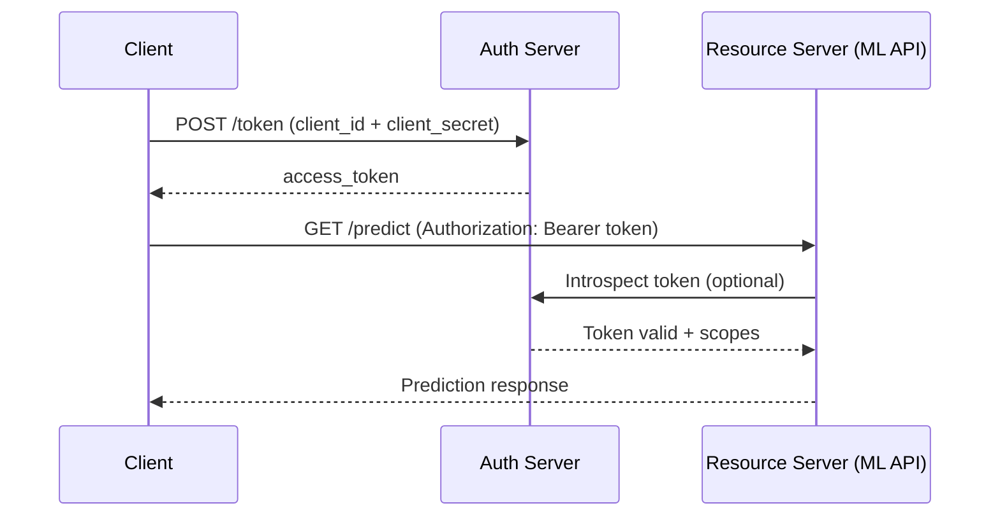

# 🔐 Authentication and API Security

Exposing machine learning models through APIs without adequate security is equivalent to leaving a bank's door open. Attacks not only compromise data; they can extract sensitive information from the model itself (model inversion), manipulate its predictions (adversarial attacks), or saturate the infrastructure (DoS).

Security in ML APIs is a multi-layered problem: transport, authentication, authorization, input validation, and observability. Each layer must be hardened independently.

## 1. Authentication vs Authorization

Although often confused, they are distinct concepts:

| Concept | Question Answered | Typical Implementation |
|----------|-------------------|------------------------|
| **Authentication** | Who are you? | JWT, OAuth, API Keys, mTLS |
| **Authorization** | What can you do? | RBAC, ABAC, scopes, policies |

An authenticated user should not be able to access all models. The `data_scientist` role can train models; the `end_user` role can only predict with specific models.

Real case: OpenAI implements differentiated rate limits and authorization scopes per user tier. A free-tier developer cannot access `gpt-4` models or exceed the assigned token limits.

## 2. JSON Web Tokens (JWT)

JWT is an open standard (RFC 7519) for transmitting claims in a compact, self-contained manner between parties. It consists of three parts separated by dots:

$$
JWT = \underbrace{base64(header)}_{\text{metadata}} . \underbrace{base64(payload)}_{\text{claims}} . \underbrace{signature}_{\text{HMAC/RSA}}
$$

**Header:**
```json
{"alg": "HS256", "typ": "JWT"}
```

**Payload (claims):**
```json
{"sub": "user123", "role": "ml_engineer", "iat": 1715000000, "exp": 1715003600}
```

**Signature:**

$$
HMACSHA256(base64url(header) + "." + base64url(payload), secret)
$$

⚠️ **Warning:** Never store secrets or sensitive information in the JWT payload. Although it is signed, it is not encrypted by default (use JWE if you need confidentiality).

## 3. JWT Implementation with FastAPI

```python
from fastapi import FastAPI, Depends, HTTPException, status
from fastapi.security import HTTPBearer, HTTPAuthorizationCredentials
from jose import JWTError, jwt
from datetime import datetime, timedelta
from pydantic import BaseModel

app = FastAPI()
SECRET_KEY = "super-secret-key-change-in-production"
ALGORITHM = "HS256"
ACCESS_TOKEN_EXPIRE_MINUTES = 30

security = HTTPBearer()

def create_access_token(data: dict):
    to_encode = data.copy()
    expire = datetime.utcnow() + timedelta(minutes=ACCESS_TOKEN_EXPIRE_MINUTES)
    to_encode.update({"exp": expire})
    return jwt.encode(to_encode, SECRET_KEY, algorithm=ALGORITHM)

def verify_token(credentials: HTTPAuthorizationCredentials = Depends(security)):
    token = credentials.credentials
    try:
        payload = jwt.decode(token, SECRET_KEY, algorithms=[ALGORITHM])
        return payload
    except JWTError:
        raise HTTPException(
            status_code=status.HTTP_401_UNAUTHORIZED,
            detail="Invalid or expired token"
        )

@app.post("/login")
def login(username: str, password: str):
    # Verify credentials (simplified)
    if username == "ml_user" and password == "secret":
        token = create_access_token({"sub": username, "role": "engineer"})
        return {"access_token": token}
    raise HTTPException(status_code=401, detail="Invalid credentials")

@app.post("/predict")
def predict(features: list, user=Depends(verify_token)):
    if user.get("role") != "engineer":
        raise HTTPException(status_code=403, detail="Access denied")
    return {"prediction": sum(features)}
```

💡 **Tip:** Rotate signing keys periodically. Implement a `kid` (key ID) mechanism in the JWT header to allow transition between keys without downtime.

## 4. OAuth 2.0 and OpenID Connect

OAuth 2.0 is an authorization protocol, not authentication. OpenID Connect (OIDC) adds an identity layer on top of OAuth 2.0.

| Flow | Recommended Use | Security |
|------|----------------|----------|
| **Authorization Code** | Server-side web apps | High (with PKCE) |
| **Client Credentials** | Machine-to-machine (M2M) communication | Medium-High |
| **Device Code** | Input-limited devices | Medium |
| **Implicit** | Deprecated, do not use | Low |

For ML APIs between microservices, the **Client Credentials** flow is the standard: a prediction service authenticates against an Authorization Server and obtains an access token to call the feature store.



## 5. API Keys

API keys are simple but effective for identifying projects or applications. They do not replace JWT/OAuth for end users, but are useful for usage tracking and per-client throttling.

```python
from fastapi import Security, APIKeyHeader

API_KEY_NAME = "X-API-Key"
api_key_header = APIKeyHeader(name=API_KEY_NAME)

VALID_KEYS = {"prod-ml-key-123": "tier_premium", "dev-key-456": "tier_free"}

async def verify_api_key(key: str = Security(api_key_header)):
    if key not in VALID_KEYS:
        raise HTTPException(status_code=403, detail="Invalid API Key")
    return VALID_KEYS[key]

@app.post("/predict")
async def predict(features: list, tier: str = Depends(verify_api_key)):
    if tier == "tier_free" and len(features) > 100:
        raise HTTPException(status_code=429, detail="Limit exceeded for free tier")
    return {"prediction": sum(features)}
```

## 6. Rate Limiting

Rate limiting protects against abuse and ensures resource fairness. Two algorithms dominate:

**Token Bucket:**

The bucket has capacity $C$ and fills at a rate of $r$ tokens per second. Each request consumes 1 token. If the bucket is empty, the request is rejected.

$$
\text{Permitted if } tokens \geq 1, \quad \text{where } tokens = \min(C, tokens + r \times \Delta t)
$$

**Leaky Bucket:**

Requests enter a fixed-size queue and exit at a constant rate. If the queue fills, new requests are discarded.

| Algorithm | Advantage | Disadvantage |
|-----------|-----------|-------------|
| Token Bucket | Allows controlled burst | Requires per-client state |
| Leaky Bucket | Constant rate guaranteed | Less flexible for burst traffic |

```python
import time
from collections import defaultdict

class TokenBucket:
    def __init__(self, capacity: int, refill_rate: float):
        self.capacity = capacity
        self.tokens = capacity
        self.refill_rate = refill_rate
        self.last_refill = time.time()

    def allow_request(self) -> bool:
        now = time.time()
        elapsed = now - self.last_refill
        self.tokens = min(self.capacity, self.tokens + elapsed * self.refill_rate)
        self.last_refill = now
        if self.tokens >= 1:
            self.tokens -= 1
            return True
        return False

buckets = defaultdict(lambda: TokenBucket(10, 1))
```

Real case: AWS API Gateway applies throttling by default at 10,000 requests/second per account. Users can configure burst limits and rate limits per HTTP method, protecting ML backends from unexpected spikes.

## 7. CORS and HTTPS/TLS

**CORS** (Cross-Origin Resource Sharing) controls which domains can consume your API from browsers.

```python
from fastapi.middleware.cors import CORSMiddleware

app.add_middleware(
    CORSMiddleware,
    allow_origins=["https://myapp.com"],  # NEVER "*" in ML production
    allow_methods=["POST"],
    allow_headers=["Authorization", "Content-Type"],
)
```

**HTTPS/TLS** encrypts the transport layer. In production, terminate TLS at the load balancer or reverse proxy (nginx, traefik) and use certificates managed by Let's Encrypt or your cloud provider.

⚠️ **Warning:** Never transmit JWT tokens or API keys over HTTP without encryption. An attacker on the same network can perform a trivial man-in-the-middle attack with tools like Wireshark.

## 8. Input Validation and Injection Prevention

ML models are vulnerable to malicious inputs. Validation is not just business, it's security.

| Attack | Description | Prevention |
|--------|-------------|------------|
| **SQL Injection** | Inputs that alter SQL queries | ORMs, parameterized queries, never concatenate strings |
| **XSS** | Scripts injected into responses | Escape output, Content-Security-Policy |
| **Command Injection** | Inputs executed in shell | Never use `os.system` with user input |
| **Adversarial Input** | Features designed to fool the model | Input sanitization, adversarial training |

```python
from pydantic import BaseModel, Field, validator
import re

class SafeRequest(BaseModel):
    text: str = Field(..., max_length=1000)
    
    @validator("text")
    def no_scripts(cls, v):
        if re.search(r"<script.*?>.*?</script>", v, re.IGNORECASE):
            raise ValueError("Input contains possible XSS")
        return v
```

## 9. Security Headers

HTTP security headers mitigate common attacks without modifying application logic:

```python
from fastapi import Request
from fastapi.responses import JSONResponse

@app.middleware("http")
async def security_headers(request: Request, call_next):
    response = await call_next(request)
    response.headers["X-Content-Type-Options"] = "nosniff"
    response.headers["X-Frame-Options"] = "DENY"
    response.headers["Content-Security-Policy"] = "default-src 'self'"
    response.headers["Strict-Transport-Security"] = "max-age=31536000; includeSubDomains"
    return response
```

| Header | Protection |
|--------|-----------|
| `X-Content-Type-Options: nosniff` | Prevents MIME-sniffing |
| `X-Frame-Options: DENY` | Prevents clickjacking |
| `Content-Security-Policy` | Mitigates XSS |
| `Strict-Transport-Security` | Forces HTTPS |

## 10. Reference Images


---

⚠️ **Warning:** Store secrets (SECRET_KEY, API keys, DB passwords) in secret managers (AWS Secrets Manager, HashiCorp Vault, Azure Key Vault), never in source code or environment variables in public repos.

💡 **Tip:** Implement security logging: log all failed authentication attempts, accesses to sensitive endpoints, and rate limiting anomalies. Tools like SIEM or Splunk correlate these logs to detect attacks.

## 📦 Compression Code

```python
# secure_ml_api.py
# FastAPI with JWT authentication, rate limiting, and security headers

from fastapi import FastAPI, Depends, HTTPException, status, Security
from fastapi.security import HTTPBearer, HTTPAuthorizationCredentials
from fastapi.middleware.cors import CORSMiddleware
from jose import jwt, JWTError
from datetime import datetime, timedelta
from pydantic import BaseModel, Field
import time
from collections import defaultdict

app = FastAPI()
SECRET_KEY = "change-me-in-production"
ALGORITHM = "HS256"

# --- Security: Bearer Token ---
security = HTTPBearer()

def create_token(data: dict, expires_minutes: int = 30):
    payload = data.copy()
    payload["exp"] = datetime.utcnow() + timedelta(minutes=expires_minutes)
    return jwt.encode(payload, SECRET_KEY, algorithm=ALGORITHM)

def verify_token(cred: HTTPAuthorizationCredentials = Depends(security)):
    try:
        return jwt.decode(cred.credentials, SECRET_KEY, algorithms=[ALGORITHM])
    except JWTError:
        raise HTTPException(status_code=401, detail="Invalid token")

# --- Rate Limiting ---
class TokenBucket:
    def __init__(self, cap: int, rate: float):
        self.cap = cap
        self.tokens = float(cap)
        self.rate = rate
        self.last = time.time()
    def allow(self) -> bool:
        now = time.time()
        self.tokens = min(self.cap, self.tokens + (now - self.last) * self.rate)
        self.last = now
        if self.tokens >= 1:
            self.tokens -= 1
            return True
        return False

buckets = defaultdict(lambda: TokenBucket(10, 2))

async def rate_limit(user=Depends(verify_token)):
    uid = user.get("sub", "anon")
    if not buckets[uid].allow():
        raise HTTPException(status_code=429, detail="Rate limit exceeded")
    return user

# --- Security middleware ---
@app.middleware("http")
async def secure_headers(request, call_next):
    resp = await call_next(request)
    resp.headers["X-Content-Type-Options"] = "nosniff"
    resp.headers["Strict-Transport-Security"] = "max-age=63072000"
    return resp

app.add_middleware(
    CORSMiddleware,
    allow_origins=["https://trusted.com"],
    allow_methods=["POST"],
    allow_headers=["Authorization"],
)

# --- Endpoints ---
class PredictRequest(BaseModel):
    features: list[float] = Field(..., min_length=2, max_length=100)

@app.post("/login")
def login(username: str, password: str):
    if username == "ml" and password == "safe":
        return {"access_token": create_token({"sub": username, "role": "user"})}
    raise HTTPException(status_code=401)

@app.post("/predict")
def predict(req: PredictRequest, user=Depends(rate_limit)):
    return {"prediction": sum(req.features), "user": user["sub"]}

# Run: uvicorn secure_ml_api:app --reload
```
