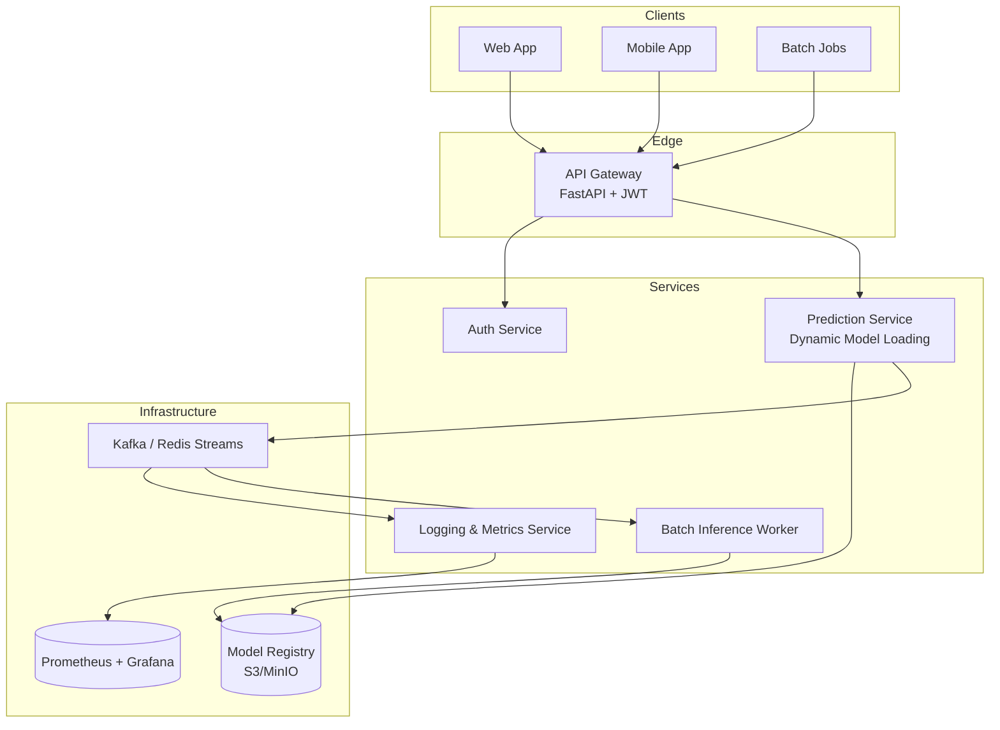
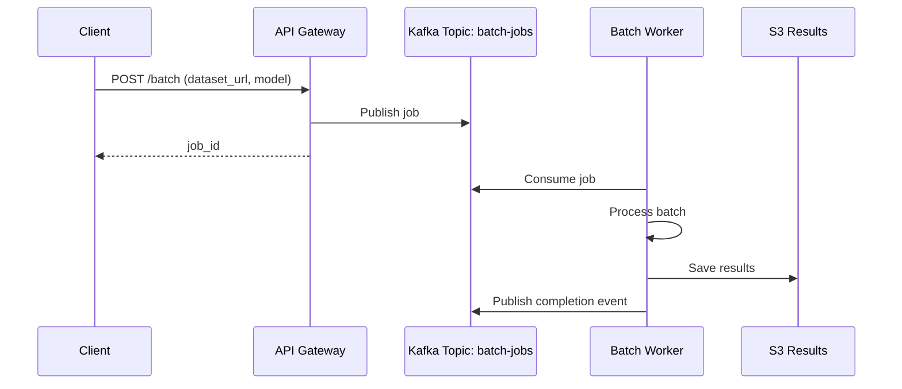
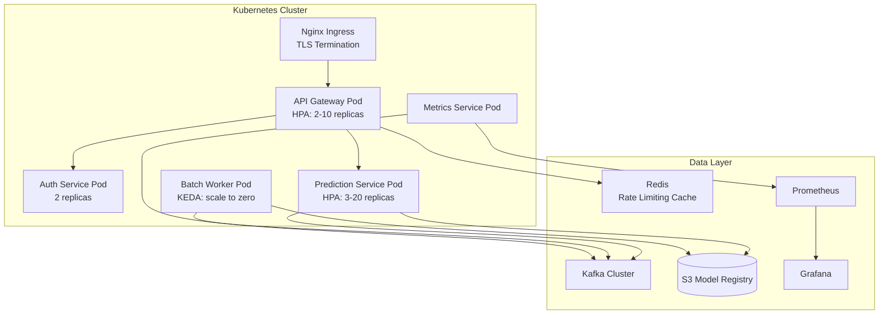

# 🎯 Capstone: Model Serving Platform

This project integrates all the concepts of the module to build a complete model serving platform. The objective is to serve multiple models via REST API in a scalable, secure, and observable way, using a microservices architecture and event-based communication.

The platform demonstrates how an ML Engineering team can move from a prediction notebook to a production system that handles thousands of concurrent requests with guaranteed latency.

## 1. System Requirements

| ID | Requirement | Category |
|----|-------------|----------|
| R1 | Serve predictions from multiple models | Functional |
| R2 | Dynamic model loading without restart | Functional |
| R3 | Authentication and authorization per endpoint | Security |
| R4 | Adaptive rate limiting per client | Security |
| R5 | p95 latency < 100ms for lightweight models | Performance |
| R6 | Throughput > 5000 RPS | Performance |
| R7 | Latency, throughput, and error metrics | Observability |
| R8 | Job queue for batch inference | Scalability |
| R9 | 99.9% availability | Reliability |

Real case: Uber Michelangelo, Uber's ML platform, supports more than 1000 models in production, from real-time predictions (ride arrival time) to batch fraud detection pipelines. Its serving architecture decouples model storage from inference through a centralized model registry.

## 2. Microservices Architecture



## 3. Detailed Components

### 3.1. API Gateway (FastAPI)

Single entry point that routes requests, validates JWT, applies rate limiting, and centralizes logging.

```python
# gateway.py
from fastapi import FastAPI, Depends, HTTPException, Request
from fastapi.security import HTTPBearer
import httpx
import time

app = FastAPI(title="ML Platform Gateway")
security = HTTPBearer()

PREDICTION_SERVICE_URL = "http://prediction:8000"
AUTH_SERVICE_URL = "http://auth:8001"

@app.middleware("http")
async def metrics(request: Request, call_next):
    start = time.time()
    response = await call_next(request)
    latency = (time.time() - start) * 1000
    # Send metrics to Prometheus pushgateway or StatsD
    print(f"method={request.method} path={request.url.path} latency={latency:.2f}ms")
    return response

async def verify_token(credentials=Depends(security)):
    async with httpx.AsyncClient() as client:
        resp = await client.post(
            f"{AUTH_SERVICE_URL}/verify",
            headers={"Authorization": f"Bearer {credentials.credentials}"}
        )
    if resp.status_code != 200:
        raise HTTPException(status_code=401, detail="Invalid token")
    return resp.json()

@app.post("/predict/{model_name}")
async def predict(model_name: str, payload: dict, user=Depends(verify_token)):
    async with httpx.AsyncClient() as client:
        resp = await client.post(
            f"{PREDICTION_SERVICE_URL}/predict/{model_name}",
            json=payload,
            timeout=5.0
        )
    return resp.json()
```

### 3.2. Authentication Service

Issues and verifies JWT. Supports multiple roles: `admin`, `data_scientist`, `end_user`.

```python
# auth_service.py
from fastapi import FastAPI
from jose import jwt
from datetime import datetime, timedelta

app = FastAPI()
SECRET = "platform-secret"

@app.post("/login")
def login(username: str, password: str):
    # Simplified verification
    users = {
        "admin": {"password": "admin123", "role": "admin"},
        "ds": {"password": "ds123", "role": "data_scientist"},
    }
    u = users.get(username)
    if not u or u["password"] != password:
        return {"error": "Invalid credentials"}
    token = jwt.encode(
        {"sub": username, "role": u["role"], "exp": datetime.utcnow() + timedelta(hours=1)},
        SECRET,
        algorithm="HS256"
    )
    return {"access_token": token}

@app.post("/verify")
def verify(token: str):
    try:
        payload = jwt.decode(token, SECRET, algorithms=["HS256"])
        return payload
    except jwt.JWTError:
        return {"error": "Invalid token"}
```

### 3.3. Prediction Service (Dynamic Model Loading)

Loads models on demand from a centralized registry (S3, GCS, MinIO). Implements LRU caching to avoid repeated I/O.

```python
# prediction_service.py
from fastapi import FastAPI, HTTPException
from functools import lru_cache
import joblib
import boto3
import io

app = FastAPI()
s3 = boto3.client("s3")
BUCKET = "ml-model-registry"

class ModelCache:
    def __init__(self, maxsize=10):
        self.cache = {}
        self.maxsize = maxsize
    
    def get(self, model_name: str, version: str):
        key = f"{model_name}:{version}"
        if key not in self.cache:
            if len(self.cache) >= self.maxsize:
                self.cache.pop(next(iter(self.cache)))
            obj = s3.get_object(Bucket=BUCKET, Key=f"{model_name}/{version}/model.pkl")
            self.cache[key] = joblib.load(io.BytesIO(obj["Body"].read()))
        return self.cache[key]

cache = ModelCache()

@app.post("/predict/{model_name}")
def predict(model_name: str, payload: dict):
    version = payload.get("version", "latest")
    try:
        model = cache.get(model_name, version)
    except Exception as e:
        raise HTTPException(status_code=404, detail=f"Model not found: {e}")
    
    features = payload.get("features", [])
    prediction = model.predict([features]).tolist()
    return {
        "model": model_name,
        "version": version,
        "prediction": prediction
    }
```

⚠️ **Warning:** In-memory caching of large models can cause OOM (Out Of Memory). Monitor RAM usage and set strict limits. Consider using `weakref` or disk storage (mmap) for massive models.

### 3.4. Logging and Metrics Service

Consumes events from Kafka to compute aggregate metrics and persist audit logs.

```python
# metrics_service.py
from kafka import KafkaConsumer
import json
from collections import deque

consumer = KafkaConsumer(
    "predictions",
    bootstrap_servers=["kafka:9092"],
    value_deserializer=lambda m: json.loads(m.decode("utf-8"))
)

latencies = deque(maxlen=10000)

for msg in consumer:
    event = msg.value
    latencies.append(event["latency_ms"])
    
    p50 = sorted(latencies)[len(latencies)//2]
    p95 = sorted(latencies)[int(len(latencies)*0.95)]
    
    print(f"[METRICS] total={len(latencies)} p50={p50}ms p95={p95}ms")
```

## 4. Key Platform Metrics

| Metric | Formula | Target |
|---------|---------|--------|
| **Latency p50/p95/p99** | Response time percentiles | p95 < 100ms |
| **Throughput** | $\frac{\text{requests}}{\text{second}}$ | > 5000 RPS |
| **Availability** | $\frac{\text{uptime}}{\text{uptime} + \text{downtime}} \times 100$ | 99.9% |
| **Error Rate** | $\frac{\text{errors}}{\text{total requests}} \times 100$ | < 0.1% |
| **Model Load Time** | Time from request to ready | < 5s |
| **Cache Hit Rate** | $\frac{\text{cache hits}}{\text{total lookups}} \times 100$ | > 80% |

The total inference latency can be decomposed as:

$$
L_{total} = L_{network} + L_{gateway} + L_{auth} + L_{model\_load} + L_{inference} + L_{serialization}
$$

Optimizing each term is the responsibility of a different component, which justifies the decoupled architecture.

## 5. Job Queue for Batch Inference

Not all predictions are real-time. Batch jobs (retraining datasets, predictions on millions of records) are queued and processed by independent workers.



```python
# batch_worker.py
from kafka import KafkaConsumer, KafkaProducer
import json

producer = KafkaProducer(
    bootstrap_servers=["kafka:9092"],
    value_serializer=lambda v: json.dumps(v).encode("utf-8")
)

consumer = KafkaConsumer(
    "batch-jobs",
    bootstrap_servers=["kafka:9092"],
    value_deserializer=lambda m: json.loads(m.decode("utf-8"))
)

for msg in consumer:
    job = msg.value
    print(f"Processing job {job['job_id']}")
    # Load dataset from job['dataset_url']
    # Run batch predictions
    # Upload results to S3
    producer.send("batch-completed", {
        "job_id": job["job_id"],
        "status": "completed",
        "output_url": f"s3://results/{job['job_id']}.parquet"
    })
```

💡 **Tip:** Use backpressure patterns in workers. If the queue grows beyond a threshold, scale horizontally by adding more workers or reduce the ingestion frequency at the gateway.

## 6. Deployment Diagram



## 7. Reference Images


---

⚠️ **Warning:** A serving platform without a rollback strategy is dangerous. If a new model degrades metrics, the system must be able to automatically revert to the previous version (canary deployment + shadow traffic).

💡 **Tip:** Implement shadow mode for new models: send real traffic to the new model but do not serve its predictions to the client. Compare offline metrics before promoting the model to production.

## 🎯 Documented Project

### Name: ML Serving Platform v1.0

**Technology Stack:**
- **Gateway:** FastAPI + Uvicorn
- **Internal Communication:** HTTP/REST (toward gRPC in v2.0)
- **Message Broker:** Apache Kafka
- **Model Registry:** S3 with versioning
- **Observability:** Prometheus + Grafana + Centralized Logs (ELK/Loki)
- **Auth:** JWT (HS256), migration to OAuth 2.0 Client Credentials
- **Deployment:** Kubernetes with HPA and KEDA

**Repository Structure:**

```
ml-platform/
├── gateway/
│   ├── main.py
│   ├── Dockerfile
│   └── k8s/
├── auth-service/
│   ├── main.py
│   └── Dockerfile
├── prediction-service/
│   ├── main.py
│   ├── model_cache.py
│   └── Dockerfile
├── batch-worker/
│   ├── worker.py
│   └── Dockerfile
├── metrics-service/
│   └── consumer.py
├── proto/
│   └── inference.proto
└── docker-compose.yml
```

**Roadmap:**
1. MVP with modular monolith (week 1-2)
2. Extraction of auth service (week 3)
3. Introduction of Kafka for events (week 4)
4. Dynamic model loading from S3 (week 5)
5. Batch workers with KEDA (week 6)
6. Internal migration to gRPC (week 7-8)
7. Service mesh with Istio (week 9-10)

**Success Criteria:**
- p95 latency < 100ms on a reference model (sklearn RandomForest, 100 features).
- New model deployment without downtime.
- 99.9% of authenticated requests respond in < 200ms.
- Automatic recovery from prediction pod failure (< 30s).

## 📦 Compression Code

```python
# platform_serving.py
# Integrated code for the ML model serving platform

from fastapi import FastAPI, Depends, HTTPException
from jose import jwt
from datetime import datetime, timedelta
import hashlib
import json
from typing import Any

app = FastAPI(title="ML Serving Platform")
SECRET = "platform-secret"
MODEL_REGISTRY = {}

# --- Auth ---
def create_token(sub: str, role: str) -> str:
    payload = {
        "sub": sub,
        "role": role,
        "exp": datetime.utcnow() + timedelta(hours=1)
    }
    return jwt.encode(payload, SECRET, algorithm="HS256")

def verify_token(token: str) -> dict:
    try:
        return jwt.decode(token, SECRET, algorithms=["HS256"])
    except jwt.JWTError:
        raise HTTPException(status_code=401, detail="Invalid token")

# --- Simulated Model Registry ---
class SimpleModel:
    def predict(self, features: list) -> float:
        return sum(features) / max(len(features), 1)

def load_model(name: str, version: str) -> Any:
    key = f"{name}:{version}"
    if key not in MODEL_REGISTRY:
        MODEL_REGISTRY[key] = SimpleModel()
    return MODEL_REGISTRY[key]

# --- Endpoints ---
@app.post("/auth/login")
def login(username: str, password: str):
    if username == "ml" and hashlib.sha256(password.encode()).hexdigest() == hashlib.sha256(b"safe").hexdigest():
        return {"access_token": create_token("ml", "engineer")}
    raise HTTPException(status_code=401)

@app.post("/predict/{model_name}")
def predict(model_name: str, payload: dict, token: str):
    user = verify_token(token)
    model = load_model(model_name, payload.get("version", "latest"))
    pred = model.predict(payload.get("features", []))
    return {
        "prediction": pred,
        "model": model_name,
        "user": user["sub"],
        "role": user["role"]
    }

@app.get("/health")
async def health():
    return {"status": "ok", "models_loaded": len(MODEL_REGISTRY)}

# Run: uvicorn platform_serving:app --host 0.0.0.0 --port 8000
```
