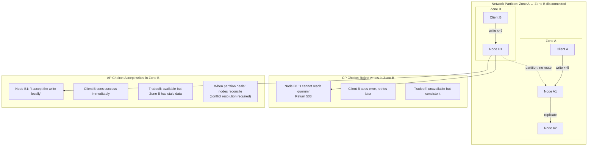
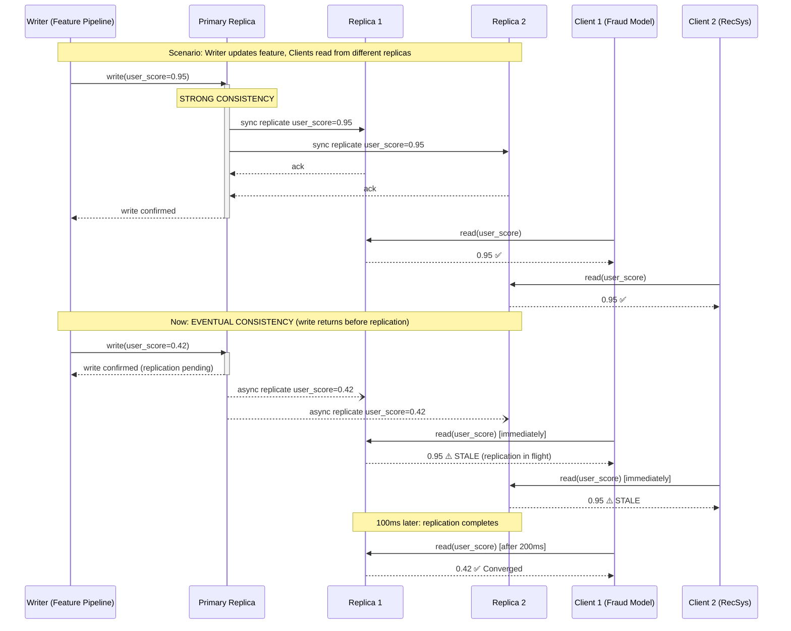

# 🔺 01 - CAP Theorem and Consistency Models in ML Workloads

## 🎯 Learning Objectives

- Derive the CAP theorem from its formal statement and apply it to classify ML system components by their consistency-availability-partition tradeoffs
- Contrast strong, eventual, causal, and read-your-writes consistency with formal LaTeX definitions, concrete latency budgets, and ML-specific failure modes
- Map ML infrastructure components (feature stores, model registries, prediction caches, training pipelines) to their correct CAP profiles with cost implications
- Analyze distributed feature store architectures that split online (AP) and offline (CP) serving paths — Uber Michelangelo and DoorDash case studies
- Avoid the over-engineering trap: right-size consistency guarantees per component rather than defaulting to strong consistency everywhere

## Introduction

The CAP theorem, conjectured by Eric Brewer in 2000 and formally proved by Seth Gilbert and Nancy Lynch in 2002, states that a distributed data store can provide at most two of the following three guarantees simultaneously: **C**onsistency (every read receives the most recent write), **A**vailability (every request receives a non-error response), and **P**artition tolerance (the system continues to operate despite arbitrary message loss between nodes). The theorem's name forms an acronym from these three properties, and "partition tolerance" refers to the network's ability to survive the loss of messages — from Latin *partitio* (division) and *tolerare* (to endure).

For software system design, CAP is a well-understood tradeoff: banking systems choose CP (you cannot have inconsistent account balances), social media feeds choose AP (showing a slightly stale post is acceptable). For ML systems, the tradeoffs are more nuanced because ML components have fundamentally different data freshness requirements depending on their role in the pipeline. A fraud detection model needs strongly consistent features (a stale feature could approve a fraudulent transaction). A recommendation model tolerates eventual consistency (showing yesterday's trending items is acceptable). A model registry demands strong consistency (every serving replica must load the same model version). A prediction cache thrives on eventual consistency (cached predictions are approximate by design).

This note provides the formal framework to classify every ML system component by its CAP profile. You will learn to reason about consistency not as a binary property (consistent vs inconsistent) but as a cost-leveraged spectrum — each step toward stronger consistency increases latency and infrastructure cost, and the art of ML system design is choosing the weakest consistency that still satisfies the business requirement. Foundational concepts connect to distributed training patterns in [[../../29 - Distributed ML Infrastructure/00 - Welcome|Distributed ML]] and serving architectures in [[../../31 - FastAPI for ML/00 - Welcome to FastAPI for ML|FastAPI]].

---

## Module 1: CAP Theorem — Formal Foundations with ML Context

### 1.1 Theoretical Foundation 🧠

The CAP theorem, formally proved as an asynchronous network model impossibility result, defines three properties:

**Consistency (C)**: Also called *linearizability* or *atomic consistency*. Formally, if operation $A$ completes before operation $B$ begins, then every read of $B$ must see the value written by $A$ (or a later value). Equivalently: there exists a total order of all operations such that each operation appears to execute instantaneously at some point between its invocation and response. For a distributed system with $n$ replicas, linearizability requires that all replicas agree on the order of writes:

$$\forall \text{ operations } o_1, o_2: \text{ if } o_1.end < o_2.start \text{ then } o_1 <_{\text{total}} o_2$$

**Availability (A)**: Every request received by a non-failing node must result in a response — not an error or timeout. Formally, for any request $r$ arriving at a correct node $N$, $N$ must eventually produce a response $r'$ such that $r' \neq \text{error}$. This definition permits unbounded but finite response time.

**Partition Tolerance (P)**: The system continues to satisfy both C and A even when the network drops or delays an arbitrary number of messages. A partition is a period where nodes in one subnetwork cannot communicate with nodes in another subnetwork. Since network partitions are inevitable in any distributed system (fiber cuts, switch failures, GC pauses that look like partitions), partition tolerance is non-negotiable for any internet-scale system. This reduces CAP to a choice between C and A during a partition.

The theorem's critical insight for ML: during a network partition, you must choose between returning consistent-but-unavailable responses (CP) or available-but-possibly-stale responses (AP). The decision depends on what your ML model does with stale data.

### 1.2 Mental Model 📐

```
┌─── CAP Tradeoff Space for ML Systems ──────────────────────────┐
│                                                                  │
│                     Consistency (C)                               │
│                        ▲                                         │
│                       /|\                                        │
│                      / | \                                       │
│                     /  |  \                                      │
│                    /   |   \                                     │
│                   /    |    \                                    │
│    Fraud Det. ← /  CP | AP  \ → RecSys                          │
│   (DynamoDB)    /      |      \    (Redis)                      │
│                /       |       \                                 │
│               /        |        \                                │
│   Model      /         |         \    Prediction                 │
│   Registry  /          |          \   Cache                      │
│  (strong)  /           |           \  (eventual)                 │
│           ◄─────────────────────────►                            │
│       Availability (A)                                           │
│                                                                  │
│   Every system lives somewhere on this continuum.                │
│   During a partition, you slide toward C or toward A.            │
└──────────────────────────────────────────────────────────────────┘
```

```
┌─── CAP Decision Flow for ML Component ──────────────────────────┐
│                                                                  │
│  1. Can this component accept slightly stale data?               │
│     ├── YES → AP candidate (recsys, cache, analytics)            │
│     └── NO  → CP candidate (fraud, payments, model version)      │
│                                                                  │
│  2. During partition, which failure mode is cheaper?             │
│     ├── Rejecting requests → CP (lost revenue but no errors)     │
│     └── Returning stale data → AP (degraded quality but online)  │
│                                                                  │
│  3. What's the staleness budget?                                 │
│     ├── < 10ms → Strong consistency required                     │
│     ├── < 5min → Bounded staleness (ZooKeeper, etcd)             │
│     └── > 5min → Eventual consistency (S3, Cassandra)            │
└──────────────────────────────────────────────────────────────────┘
```

### 1.3 Syntax and Semantics 📝

```python
"""
cap_classifier.py — Classify ML components by CAP profile.
WHY: Explicit classification prevents the #1 ML infra mistake — applying
strong consistency everywhere (3x cost, unnecessary latency).
"""

from enum import Enum
from dataclasses import dataclass

class ConsistencyLevel(Enum):
    STRONG = "strong"          # Every read sees latest write
    BOUNDED_STALENESS = "bs"   # Reads may lag by at most Δt
    EVENTUAL = "eventual"      # Reads eventually converge
    CAUSAL = "causal"          # Causally-related writes ordered
    READ_YOUR_WRITES = "ryw"   # Client sees own writes

class AvailabilityLevel(Enum):
    HIGH = "high"      # Responds during partition, may be stale
    DEGRADED = "degraded"  # Responds with stale data or cache
    OFF = "off"        # Rejects requests during partition

@dataclass
class CAPProfile:
    component: str
    consistency: ConsistencyLevel
    availability: AvailabilityLevel
    budget_impact: str  # Cost to over-engineer this

# ML-specific CAP classification
ML_COMPONENTS = {
    "feature_store_online": CAPProfile(
        "Feature Store (Online)",
        ConsistencyLevel.BOUNDED_STALENESS,
        AvailabilityLevel.HIGH,
        "Strong consistency: 3x Redis cost, 50ms added latency"
    ),
    "feature_store_offline": CAPProfile(
        "Feature Store (Offline/Training)",
        ConsistencyLevel.STRONG,
        AvailabilityLevel.DEGRADED,
        "Training reads stale features = model learns wrong patterns"
    ),
    "model_registry": CAPProfile(
        "Model Registry",
        ConsistencyLevel.STRONG,
        AvailabilityLevel.OFF,
        "Serving v1.2 when registry says v1.3 = rollback disaster"
    ),
    "prediction_cache": CAPProfile(
        "Prediction Cache",
        ConsistencyLevel.EVENTUAL,
        AvailabilityLevel.HIGH,
        "5-min stale predictions have zero business impact"
    ),
    "fraud_model_features": CAPProfile(
        "Fraud Model Features",
        ConsistencyLevel.STRONG,
        AvailabilityLevel.OFF,
        "Stale features = approved fraud = 100x cost of rejection"
    ),
    "recsys_model_features": CAPProfile(
        "RecSys Model Features",
        ConsistencyLevel.EVENTUAL,
        AvailabilityLevel.HIGH,
        "Blank screen loses user; stale recs still engage"
    ),
}
```

### 1.4 Visual Representation 🖼️



### 1.5 Application in ML/AI Systems 🤖

Stripe's Radar fraud detection system runs on a CP architecture. When a transaction arrives, the system queries a feature store for real-time features (user purchase velocity, IP geolocation, device fingerprint). These features must be strongly consistent: if a user's last 5 transactions haven't propagated to the feature store yet, the velocity feature will be stale, and a fraudulent transaction could slip through. Stripe chose DynamoDB with strong consistent reads (EC = 1.0, ACID transactions) for the online feature store. During a partition, Radar rejects transactions rather than risk approving fraud — a CP tradeoff where the cost of unavailability (a declined legitimate transaction) is dwarfed by the cost of a missed fraud (chargeback + reputation damage). This connects to the fraud detection walkthrough in [[05 - Interview Walkthrough - Design Systems End-to-End|Note 05]].

Conversely, DoorDash's menu recommendation model runs on an AP architecture. When a user opens the app, the recommendation service fetches features from Redis (eventual consistency). If Redis returns features from 5 minutes ago, the user still sees reasonable recommendations — their preferences haven't changed dramatically in 5 minutes. The cost of unavailability (a blank screen → user closes app → lost order) far exceeds the cost of slightly stale recommendations. DoorDash's ML platform explicitly classifies each model's CAP requirement during onboarding, saving 40% in infrastructure costs by using right-sized consistency.

### 1.6 Common Pitfalls ⚠️ + 💡 Tips

⚠️ **Pitfall**: Treating "eventual consistency" as "no guarantees." Eventual consistency still guarantees convergence — all replicas eventually agree if no new writes occur. The "eventual" is the convergence time, not an absence of guarantees.

💡 **Tip**: Always specify the *staleness bound* for eventual consistency systems. Instead of "features are eventually consistent," say "feature writes propagate to all replicas within 5 seconds." Kafka + Redis with a 5-second consumer lag is NOT eventual — it is bounded staleness, which is a stronger guarantee.

⚠️ **Pitfall**: Using a strongly consistent database for a prediction cache. Strong consistency invalidates the cache on every model update, destroying the cache hit rate.

💡 **Tip**: Prediction caches should use TTL-based invalidation with eventual consistency. The model retrains daily; the cache serves slightly stale predictions for 24 hours. If the business requires fresher predictions, reduce the TTL — but don't make the cache consistent.

⚠️ **Pitfall**: Sharing the same Redis instance for online (AP) and offline (CP) feature serving. The CP workload forces synchronous replication that destroys the AP workload's latency.

💡 **Tip**: Split feature stores by CAP profile. Online feature store (Redis, Cassandra) = AP. Offline feature store (Snowflake, Parquet) = CP. Use different storage backends; they serve different read patterns at different consistency levels.

### 1.7 Knowledge Check ❓

1. A financial fraud model uses features from a Redis cluster. During a network partition, the model rejects all transactions (CP). Is this correct? What's the cost of the alternative?
2. Your model registry uses S3 for storing model binaries. Is this CP, AP, or something else? How do you ensure all serving replicas see the same version?
3. A teammate proposes using the same PostgreSQL instance for both real-time feature serving (needs <10ms latency) and offline training data exports. Critique this from a CAP perspective.

---

## Module 2: Consistency Models — Formal Definitions and ML Applications

### 2.1 Theoretical Foundation 🧠

Consistency models form a hierarchy from strongest to weakest. Each model provides different guarantees about what a read operation can observe, and each comes with a different latency/cost profile.

**Strong Consistency (Linearizability)** is the strongest model. Every read sees the effect of the most recent write. There exists a total order of all operations such that each operation appears to take effect instantaneously at some point between its invocation and response. Formally, for any two operations $a$ and $b$ where $a.end < b.start$ in wall-clock time, $a$ must appear before $b$ in the total order:

$$a.end < b.start \implies a <_{\text{total}} b$$

For ML, this is required when the correctness of predictions depends on monotonic state updates. Model registry writes are the canonical example: if serving replica A loads model v1.3 and replica B loads v1.2 because the registry hasn't replicated yet, you have a production incident where different replicas produce different predictions for the same input.

**Sequential Consistency** weakens linearizability by removing the wall-clock constraint. Operations from the same client appear in program order, but operations from different clients can be interleaved arbitrarily. Formally, operations from process $p$ are ordered by $\xrightarrow{po}_p$ (program order), and there exists a total order that respects each process's program order:

$$\forall p, a \xrightarrow{po}_p b \implies a <_{\text{total}} b$$

**Causal Consistency** preserves only happens-before relationships. If operation $a$ causally precedes operation $b$ (meaning $b$ could have observed $a$'s effect), then all processes see $a$ before $b$. The causal relation is:

$$a \rightarrow b \iff (a \xrightarrow{po} b) \lor (a \xrightarrow{wr} b) \lor \exists c: (a \rightarrow c \land c \rightarrow b)$$

where $\xrightarrow{wr}$ means $a$ writes a value that $b$ reads, establishing a causal dependency. For ML, causal consistency is sufficient for feature engineering pipelines: if feature A (user_country) was computed before feature B (geolocation_score), and B depends on A's output, causal consistency guarantees all consumers see A before B.

**Read-Your-Writes (RYW)** guarantees that a client always sees its own writes, even if other clients may see stale data. Formally, if client $C$ issues write $w$ and then read $r$, then $r$ must reflect $w$ (or a later write):

$$w \xrightarrow{po}_C r \implies w <_{\text{visible}} r$$

RYW is critical for ML inference feedback loops: if a user triggers a model retraining (write) and immediately queries for predictions (read), they must see predictions from their newly trained model.

**Eventual Consistency** guarantees only that if no new writes occur, eventually all replicas converge to the same value. There is no bound on the convergence time. This is the weakest useful model and the cheapest to implement.

### 2.2 Mental Model 📐

```
┌─── Consistency Model Hierarchy (Strong → Weak) ────────────────┐
│                                                                  │
│  STRONG (Linearizability)                                       │
│  │  ▲  Every read sees latest write. Total order.               │
│  │  │  Latency cost: ++++    Infrastructure cost: ++++          │
│  │  │  ML use: Model registry, fraud features                   │
│  │  │                                                           │
│  │  │  Sequential Consistency                                   │
│  │  │  Same-client order preserved, no wall-clock guarantee     │
│  │  │  Latency cost: +++     Infrastructure cost: +++           │
│  │  │  ML use: Training data versioning                         │
│  │  ▼                                                           │
│  │  Causal Consistency                                          │
│  │  Happens-before relationships preserved                      │
│  │  Latency cost: ++      Infrastructure cost: ++               │
│  │  ML use: Feature pipeline DAG, experiment tracking           │
│  ▼                                                              │
│  Read-Your-Writes (RYW)                                         │
│  Client sees own writes; others may see stale data               │
│  Latency cost: +       Infrastructure cost: +                   │
│  ML use: Inference feedback loops, online learning UI            │
│                                                                  │
│  Eventual Consistency (WEAKEST)                                  │
│  All replicas converge... eventually. No time bound.             │
│  Latency cost: -       Infrastructure cost: -                   │
│  ML use: Prediction cache, offline analytics, batch features     │
└──────────────────────────────────────────────────────────────────┘
```

### 2.3 Syntax and Semantics 📝

```python
"""
consistency_demo.py — Simulate different consistency levels
for an ML feature store to demonstrate staleness behavior.
"""

import time
import threading
from collections import defaultdict
from enum import Enum

class ConsistencyModel(Enum):
    STRONG = "strong"    # All reads see latest write
    EVENTUAL = "eventual" # Reads eventually converge
    RYW = "ryw"          # Client sees own writes only

class FeatureStore:
    """Simulated distributed feature store with configurable consistency."""

    def __init__(self, model: ConsistencyModel, replica_count: int = 3):
        self.model = model
        # Each replica has its own copy of features
        self.replicas = [{} for _ in range(replica_count)]
        self._lock = threading.Lock()
        # Track per-client write history for RYW
        self._client_versions: dict[str, dict[int, int]] = defaultdict(dict)

    def write(self, key: str, value: float, client_id: str = "default"):
        """Write a feature value. Replication behavior depends on model."""
        if self.model == ConsistencyModel.STRONG:
            # Strong: write to ALL replicas before returning
            # In practice: quorum write (majority + synchronous replication)
            for replica in self.replicas:
                replica[key] = value
            return True
        elif self.model == ConsistencyModel.EVENTUAL:
            # Eventual: write to one replica, async replication to others
            self.replicas[0][key] = value
            # Simulated async replication (in real system: Kafka/gossip)
            threading.Timer(0.1, lambda: [
                r.__setitem__(key, value) for r in self.replicas[1:]
            ]).start()
            return True
        elif self.model == ConsistencyModel.RYW:
            # RYW: write to local view + primary replica
            self.replicas[0][key] = value
            self._client_versions[client_id][id(self.replicas[0])] = value

    def read(self, key: str, client_id: str = "default") -> float | None:
        """Read a feature value. Returns None if not found."""
        import random
        replica = random.choice(self.replicas)

        if self.model == ConsistencyModel.STRONG:
            return replica.get(key)
        elif self.model == ConsistencyModel.EVENTUAL:
            return replica.get(key)  # May be None if not yet replicated
        elif self.model == ConsistencyModel.RYW:
            # Check own-written values first
            own = self._client_versions.get(client_id, {})
            if id(replica) in own:
                return own[id(replica)]
            return replica.get(key)

# Demonstration: simulate partition with eventual consistency
store = FeatureStore(ConsistencyModel.EVENTUAL)
store.write("user_123_score", 0.95)

# Read immediately after write — eventua```
for i in range(3):
    val = store.read("user_123_score")
    print(f"Read {i}: {val}")  # May be None if not replicated yet

# Wait for async replication
time.sleep(0.2)
print(f"After 200ms: {store.read('user_123_score')}")  # Always 0.95
```

### 2.4 Visual Representation 🖼️



### 2.5 Application in ML/AI Systems 🤖

Netflix's recommendation pipeline spans both consistency extremes. Their offline training pipeline (Spark jobs computing user embeddings nightly) uses S3 as the storage layer — eventual consistency by design. Training jobs read from an eventually consistent data lake where the latest partition may take minutes to become visible. This is acceptable because training runs for hours; a 5-minute staleness in input data is negligible. However, their online feature serving layer (the features fed to the recommendation model at inference time) uses EVCache (Netflix's distributed caching layer built on Memcached) with a 5-second TTL on feature values. This is bounded staleness — weaker than strong consistency but with a firm upper bound. ¡Sorpresa! Netflix found that the model's prediction quality degraded measurably only after features were stale by more than 10 seconds, giving them a comfortable 5-second safety margin. This kind of measurement-driven consistency tuning is what separates senior from junior system designers.

### 2.6 Common Pitfalls ⚠️ + 💡 Tips

⚠️ **Pitfall**: Using strong consistency for batch feature pipelines. Training data doesn't change during training — by the time the Spark job starts, the data snapshot is fixed. Strong consistency adds cost with zero benefit.

💡 **Tip**: Batch training pipelines should use snapshot isolation — read a consistent snapshot of features at the start of training, not the latest values. This is achieved via data versioning (e.g., Delta Lake time travel) rather than distributed consensus.

⚠️ **Pitfall**: Confusing "eventual consistency" with "no consistency." Eventual consistency guarantees convergence. A system that occasionally loses writes with no convergence is not eventually consistent — it's broken.

💡 **Tip**: Always instrument eventual consistency systems with a *staleness metric*: the clock time between when a feature is written and when it's visible to all replicas. Alert if this exceeds your SLA, not if it's non-zero (it's always non-zero).

### 2.7 Knowledge Check ❓

1. A feature pipeline writes `user_score` at timestamp T1 and reads it back at T2 for validation. Under eventual consistency with 100ms replication delay, is the read guaranteed to see the write? Under RYW?
2. Your model registry uses a strongly consistent store. A serving replica loads model v1.3 at T1. At T2, the registry updates to v1.4. Is the serving replica "inconsistent"? Explain in terms of read-your-writes vs strong consistency.
3. Propose a consistency model for experiment tracking metadata (model metrics, hyperparameters, run status). Justify your choice against the next-strongest model.

---

## Module 3: ML-Specific Consistency — Feature Stores, Model Registries, and Prediction Caches

### 3.1 Theoretical Foundation 🧠

ML systems introduce consistency challenges that traditional databases never face. A feature store serves the same feature to two entirely different workloads: training (batch, offline, throughput-optimized) and inference (real-time, online, latency-optimized). These workloads have fundamentally different consistency requirements, and conflating them leads to impossible engineering tradeoffs.

**Feature Store Writes**: Feature values are computed by batch pipelines (Spark jobs computing aggregations over hours of data) or streaming pipelines (Kafka/Flink computing sliding windows over seconds of data). Batch writes are high-latency (minutes to hours) and correctness-critical: if a training job reads a partially-updated set of features, it trains on internally inconsistent data. Streaming writes are low-latency (milliseconds) and freshness-critical: an inference request needs the newest feature values.

**Feature Store Reads (Training)**: Training reads are point-in-time snapshot reads over terabytes of feature data. They require snapshot consistency — all features for all entities must reflect the same logical point in time. Without this, training learns spurious correlations (e.g., user_age=25 but user_years_on_platform=0 because the age feature updated before the tenure feature).

**Feature Store Reads (Serving)**: Inference reads are point-lookup reads over kilobytes of feature data for a single entity. They require low latency (<10ms) and bounded staleness. The model can tolerate features that are up to N seconds stale because user behavior doesn't change instantaneously.

**Model Registry**: The registry stores model versions, metadata, and serving endpoints. It must be strongly consistent: if one serving replica loads model v1.2 and another loads v1.3, the system produces inconsistent predictions. This is a correctness violation, not a freshness tradeoff. The registry is small (kilobytes per model version), so strong consistency (etcd, ZooKeeper, DynamoDB strong reads) is affordable.

**Prediction Cache**: Cached predictions are approximate by design. The model's prediction for a given input changes only when the model is retrained (daily) or when features change significantly. A cache TTL of hours is acceptable. Eventual consistency is the right model: the cache stores stale predictions, and the worst case is a slightly suboptimal recommendation — not a financial error.

### 3.2 Mental Model 📐

```
┌─── Feature Store: Split-Personality CAP ────────────────────────┐
│                                                                  │
│   ┌──────────────────────────────────────────────────────────┐  │
│   │              Feature Engineering Pipeline                │  │
│   │  Batch (Spark) ──▶ Offline Store (Parquet/Snowflake)     │  │
│   │  Streaming (Flink) ──▶ Online Store (Redis/Cassandra)    │  │
│   └──────────────────────────────────────────────────────────┘  │
│                                                                  │
│   ┌─────────────────────────────────────────────────────────┐   │
│   │  OFFLINE PATH (CP — Strong/Snapshot Consistency)         │   │
│   │  ┌──────────────────┐                                    │   │
│   │  │ Training Job      │                                    │   │
│   │  │ Reads: 10 TB/day  │                                    │   │
│   │  │ Latency: ~seconds  │  Cost: $0.023/GB/month (S3)      │   │
│   │  │ Model: CP          │  WHY: Internal inconsistency     │   │
│   │  │                    │  ruins model quality             │   │
│   │  └──────────────────┘                                    │   │
│   └─────────────────────────────────────────────────────────┘   │
│                                                                  │
│   ┌─────────────────────────────────────────────────────────┐   │
│   │  ONLINE PATH (AP — Bounded Staleness/Eventual)            │   │
│   │  ┌──────────────────┐    ┌──────────────────┐            │   │
│   │  │ Fraud Model       │    │ RecSys Model      │            │   │
│   │  │ Reads: 10 K req/s │    │ Reads: 500 K req/s│            │   │
│   │  │ Latency: <5ms     │    │ Latency: <10ms    │            │   │
│   │  │ Model: CP         │    │ Model: AP         │            │   │
│   │  │ WHY: stale = loss │    │ WHY: stale < down │            │   │
│   │  └──────────────────┘    └──────────────────┘            │   │
│   └─────────────────────────────────────────────────────────┘   │
└──────────────────────────────────────────────────────────────────┘
```

### 3.3 Syntax and Semantics 📝

```python
"""
feature_store_cap.py — Feature store client with configurable
consistency level per read operation.

WHY: The same feature store serves both training (CP) and inference
(AP) workloads. The client must expose consistency as a parameter.
"""

from enum import Enum
from dataclasses import dataclass
import time
import random
import threading

class ReadConsistency(Enum):
    """Consistency level for feature reads."""
    STRONG = "strong"      # Read from quorum, wait for latest
    BOUNDED = "bounded"    # Stale by at most Δt ms
    EVENTUAL = "eventual"  # Any replica, no staleness guarantee

@dataclass
class FeatureStoreClient:
    """Unified client for online and offline feature stores."""

    online_store: "RedisCluster"   # Fast, AP, eventual consistency
    offline_store: "SnowflakeDB"   # Slow, CP, strong consistency
    staleness_bound_ms: int = 5000  # 5-second staleness budget

    def get_features(
        self,
        entity_id: str,
        feature_names: list[str],
        purpose: str,  # "training" or "inference"
        model_cap_profile: str,  # "CP" or "AP"
        consistency: ReadConsistency = ReadConsistency.EVENTUAL,
    ) -> dict[str, float]:
        """
        Fetch features with the right consistency for the use case.

        Training → offline store, CP, strong consistency
        Fraud inference → online store, CP, strong consistency
        RecSys inference → online store, AP, eventual consistency
        """
        if purpose == "training":
            # Training: always use offline store for CP guarantees
            return self.offline_store.point_in_time_query(
                entity_id, feature_names, timestamp=time.time()
            )

        # Inference: online store, consistency varies by model profile
        if model_cap_profile == "CP":
            # Fraud detection: strong reads from online store
            return self.online_store.strong_read(entity_id, feature_names)
        elif model_cap_profile == "AP":
            # Recommendations: eventual reads, bounded staleness
            features = self.online_store.eventual_read(entity_id, feature_names)
            # Check staleness: if too stale, fall back to strong read
            if features["_timestamp"] < time.time() - self.staleness_bound_ms / 1000:
                features = self.online_store.strong_read(entity_id, feature_names)
            return features

    def write_features(
        self,
        entity_id: str,
        features: dict[str, float],
        source: str,  # "batch" or "streaming"
    ):
        """Write features with appropriate consistency level."""
        if source == "batch":
            # Batch writes: strong, transactional to offline store
            self.offline_store.bulk_insert(entity_id, features)
        elif source == "streaming":
            # Streaming writes: fast, eventual to online store
            self.online_store.eventual_write(entity_id, features)


# ─── Model Registry: Always CP ───
class ModelRegistry:
    """Strongly consistent model version store."""

    def __init__(self, store: "DynamoDB_Strong"):
        self.store = store  # DynamoDB with strong consistent reads

    def get_current_version(self, model_name: str) -> str:
        """Always returns the latest model version. Strong consistency."""
        return self.store.get_item(
            key={"model_name": model_name},
            consistent_read=True,  # Non-negotiable
        )["version"]

    def update_version(self, model_name: str, version: str):
        """Atomic version update. All replicas see this simultaneously."""
        self.store.put_item(
            item={"model_name": model_name, "version": version},
            condition_expression="attribute_exists(model_name)",
        )


# ─── Prediction Cache: Always AP ───
class PredictionCache:
    """Eventually consistent cache for model predictions."""

    def __init__(self, redis: "RedisCluster", ttl_seconds: int = 3600):
        self.redis = redis
        self.ttl = ttl_seconds

    def get(self, input_hash: str) -> dict | None:
        """Stale prediction is better than no prediction."""
        return self.redis.get(input_hash)

    def put(self, input_hash: str, prediction: dict):
        """Write with TTL. Eventual consistency across Redis replicas."""
        self.redis.setex(input_hash, self.ttl, prediction)
```

### 3.4 Visual Representation 🖼️

```mermaid
graph TD
    subgraph "Data Sources"
        EV[Events / Logs]
        ST[Streaming Data]
        DB[Transactional DB]
    end

    subgraph "Feature Engineering"
        SPARK[Spark Batch<br/>Hourly/Daily]
        FLINK[Flink Streaming<br/>Real-time]
    end

    subgraph "OFFLINE STORE — CP"
        direction TB
        S3[(S3 / Parquet<br/>Snapshot Isolation)]
        SF[(Snowflake<br/>Point-in-Time Queries)]
    end

    subgraph "ONLINE STORE — AP"
        direction TB
        RD[(Redis<br/>Eventual Consistency<br/><1ms reads)]
        CS[(Cassandra<br/>Tunable Consistency<br/><5ms reads)]
    end

    subgraph "ML Workloads"
        TRAIN[Training Jobs<br/>CP Required<br/>Snapshot consistency]
        FRAUD[Fraud Model<br/>CP Required<br/>Strong reads]
        RECSYS[RecSys Model<br/>AP Acceptable<br/>Eventual reads]
        CACHE[Prediction Cache<br/>AP Acceptable<br/>TTL-based invalidation]
    end

    EV --> FLINK
    DB --> SPARK
    ST --> FLINK
    SPARK --> S3
    SPARK --> SF
    FLINK --> RD
    FLINK --> CS
    S3 --> TRAIN
    SF --> TRAIN
    RD --> FRAUD
    RD --> RECSYS
    CS --> FRAUD
    CS --> RECSYS
    RECSYS --> CACHE
    CACHE --> RECSYS

    style OFF offline
    style ONLINEFill
```

### 3.5 Application in ML/AI Systems 🤖

Uber's Michelangelo platform is the canonical example of split-personality feature stores. Their architecture segregates the feature serving path by CAP profile:

**Offline Store (CP)**: Features are computed by batch Spark jobs and stored in Hive/Parquet on HDFS. Training jobs read features via Hive queries that specify a point-in-time timestamp, ensuring all features reflect the same logical moment. Uber uses the Hive metastore's partition scheme to enforce snapshot isolation: each training run locks to a specific partition, and new feature writes go to new partitions. This is strong consistency at the partition level — a form of snapshot isolation rather than linearizability.

**Online Store (AP)**: Features required at inference time are pre-materialized from batch jobs and pushed to a low-latency KV store (Cassandra for Uber). The write path uses Cassandra's `QUORUM` consistency (majority of replicas must acknowledge), which is not strong consistency (linearizability requires `ALL`). The read path uses `ONE` consistency (read from any replica), which is eventual consistency. Uber accepts this because their latency SLA is <5ms, and Cassandra `ALL` reads would push latency to >50ms.

The critical lesson: Michelangelo achieves both CP (for training) and AP (for serving) by **physically separating the storage paths**. The same feature name (`driver.rating_7d_avg`) exists in both stores with different consistency guarantees — and this is correct behavior because training and serving have different needs.

¡Sorpresa! The most common bug in Michelangelo's early days was training/serving skew caused by the batch pipeline writing to offline store before online store. The training job would read the latest offline features and learn a pattern, but the serving model would read stale online features and produce wrong predictions. Uber solved this by **writing to online store first, then to offline store** — guaranteeing that serving features are always at least as fresh as training features. This ordering trick (write online → write offline, not vice versa) eliminates training/serving skew at the consistency layer.

### 3.6 Common Pitfalls ⚠️ + 💡 Tips

⚠️ **Pitfall**: Using the same consistency level for all reads from a feature store. A fraud model and a recsys model reading from the same Redis cluster with the same consistency settings forces the recsys model to pay the latency tax of the fraud model's strong consistency requirement.

💡 **Tip**: Expose consistency as a query parameter: `GET /features/user/123?consistency=strong` vs `?consistency=eventual`. Charge the fraud team for the strong consistency infrastructure cost; let the recsys team use the cheaper eventual path.

⚠️ **Pitfall**: Writing to offline store before online store during feature refresh. This creates training/serving skew: training sees new features, but serving still serves old features — the worst possible staleness direction.

💡 **Tip**: Write to online store first. Even if offline store lags, serving features are always at least as fresh as training features. This ordering guarantees the model never trains on data that is fresher than what it serves.

### 3.7 Knowledge Check ❓

1. Your feature store writes user_age=30 to the online store (Redis) and offline store (Parquet). The online write completes in 2ms; the offline write takes 30s. A training job starts 5 seconds later. What value of user_age does it see? Is this correct? What if the training job started 60 seconds later?
2. A model registry update changes the serving model from v1.2 to v1.3. Serving replica A checks the registry every 60 seconds. Replica B checks every 10 seconds. For a 50-second window, A serves v1.2 and B serves v1.3. Is the system "inconsistent"? Classify this in terms of eventual vs bounded staleness.
3. Propose a feature store architecture that supports: (a) training with snapshot isolation, (b) fraud inference with strong consistency, and (c) recsys inference with eventual consistency. How many storage backends do you need?

---

## Module 4: Distributed Feature Stores Under CAP — Michelangelo, Feast, and DoorDash

### 4.1 Theoretical Foundation 🧠

Distributed feature stores face a unique CAP challenge: they serve two entirely different workloads from the same logical dataset. The offline workload (training) demands throughput and snapshot consistency. The online workload (inference) demands latency and availability. Combining these in a single system produces an unsolvable optimization problem — you cannot simultaneously minimize latency (online) and maximize throughput (offline) while maintaining consistent snapshots.

The solution adopted by every major ML platform is physical separation: two storage backends, one for each workload, synchronized by a feature pipeline. This creates a consistency gap between the two stores — the online store may lag the offline store by seconds to minutes — and the system design challenge is managing that gap safely.

Let the offline store hold features at version $V_{\text{offline}}$ and the online store hold features at version $V_{\text{online}}$. The training/serving skew $\Delta$ is:

$$\Delta = V_{\text{offline}} - V_{\text{online}}$$

If $\Delta > 0$, training sees fresher features than serving — the dangerous direction because the model learns from data patterns that don't exist yet at serving time. If $\Delta < 0$, serving sees fresher features than training — the safe direction because the model is conservative (trained on slightly stale data). The invariant to maintain is $\Delta \leq 0$, enforced by the write ordering rule (online-first writes).

### 4.2 Mental Model 📐

```
┌─── Michelangelo Feature Store Architecture ─────────────────────┐
│                                                                  │
│  ┌───────────────────────────────────────────────────────────┐  │
│  │  Feature Engineering (Spark / Flink)                       │  │
│  │  Computes: driver.rating_7d_avg, rider.cancel_rate_30d    │  │
│  └───────────┬───────────────────────────────┬───────────────┘  │
│              │                               │                   │
│              ▼                               ▼                   │
│  ┌──────────────────────┐    ┌──────────────────────────────┐  │
│  │  ONLINE STORE (AP)    │    │  OFFLINE STORE (CP)          │  │
│  │  Cassandra            │    │  Hive / Parquet on HDFS      │  │
│  │  ───────────────────  │    │  ─────────────────────────── │  │
│  │  Write: QUORUM        │    │  Write: Atomic partition swap │  │
│  │  Read: ONE (eventual) │    │  Read: Point-in-time snapshot │  │
│  │  Latency: <5ms        │    │  Latency: ~100ms (batch)     │  │
│  │  Staleness: 0-30s     │    │  Staleness: 0 (snapshot)    │  │
│  │  Cost: $0.50/GB-month │    │  Cost: $0.023/GB-month       │  │
│  └──────────┬───────────┘    └───────────────┬──────────────┘  │
│             │                                 │                  │
│             ▼                                 ▼                  │
│  ┌──────────────────────┐    ┌──────────────────────────────┐  │
│  │  SERVING LAYER        │    │  TRAINING LAYER              │  │
│  │  FastAPI Inference     │    │  PyTorch on GPU Cluster      │  │
│  │  Reads: 500K req/s     │    │  Reads: 10 TB/hour          │  │
│  │  CAP profile: AP       │    │  CAP profile: CP            │  │
│  └──────────────────────┘    └──────────────────────────────┘  │
└──────────────────────────────────────────────────────────────────┘
```

### 4.3 Application in ML/AI Systems 🤖

**Caso real: DoorDash's ML Platform** classifies every model's CAP requirement during the model onboarding process. The platform team built a self-service questionnaire: "Does this model's output directly affect money movement?" → CP. "Does this model produce recommendations that users can refresh?" → AP. "Does this model run daily batch predictions?" → CP (offline), AP (online). This classification determines the feature store backend, the read consistency level, and the infrastructure cost allocation.

The results were dramatic: 40% reduction in infrastructure costs because models previously using DynamoDB strong reads (CP, expensive) were reclassified to Redis eventual reads (AP, cheap). The fraud detection model remained on DynamoDB strong reads — correct for its CAP profile — but 70% of other models moved to the cheaper AP path. The key insight: **CAP profile is a model-level property, not a platform-level property**. You cannot design a "CAP choice for the platform" — you must design a platform that supports multiple CAP profiles.

DoorDash also discovered that their menu recommendation model's prediction quality was insensitive to feature staleness up to 15 minutes. They measured this by A/B testing: half the users got features from a 30-second-delayed Redis replica; half got features from the primary. User engagement metrics (clicks, orders) were statistically indistinguishable. This measurement gave them confidence to relax the recsys feature consistency from 5-second bounded staleness to 15-minute TTL-based caching — a 180x reduction in feature store read load.

### 4.4 Common Pitfalls ⚠️ + 💡 Tips

⚠️ **Pitfall**: Designing a feature store with a single CAP profile (e.g., "all features are strongly consistent") and forcing all models to conform. The platform becomes unaffordable for low-criticality models and unnecessarily expensive for the business.

💡 **Tip**: Build a feature store that exposes consistency as a first-class parameter. Charge model owners based on their consistency choice — stronger consistency costs more, and model owners make the tradeoff decision.

⚠️ **Pitfall**: Assuming that consistency is free. Strong consistency in a distributed KV store requires synchronous replication (cross-AZ network round trips), which adds 5-10ms per read. At 500K reads/second, that's 2,500-5,000 seconds of cumulative latency every second — requiring significantly more infrastructure.

💡 **Tip**: Compute the cost of consistency. For a feature store serving 500K reads/second, reducing consistency from strong (10ms) to eventual (1ms) saves 9ms/read × 500K reads/s = 4,500 seconds of cumulative latency per second. That's ~90 fewer Redis replicas. At $0.50/hour per replica, that's $32,400/month saved.

### 4.5 Knowledge Check ❓

1. DoorDash's menu recommendation model tolerates 15-minute feature staleness with no engagement impact. What does this imply about the model's CAP profile? What does it imply about the feature store infrastructure design?
2. Uber's Michelangelo writes to online store before offline store. Why? What bug does this prevent?
3. A feature store serves 10 model types with 3 consistency levels (strong, bounded staleness, eventual). How many storage backends do you need? Defend your answer.

---

## 📦 Código de Compresión

```python
"""
cap_ml_classifier.py — Production CAP classification matrix for ML systems.
Complete reference for FAANG+ ML system design interviews.

┌───────────────────┬───────────────┬───────────────┬──────────────┐
│ ML Component      │ Consistency   │ Availability  │ Storage       │
├───────────────────┼───────────────┼───────────────┼──────────────┤
│ Fraud Features    │ Strong        │ Degraded (503)│ DynamoDB      │
│ RecSys Features   │ Eventual      │ High          │ Redis         │
│ Model Registry    │ Strong        │ Off (reject)  │ etcd/DynamoDB │
│ Prediction Cache  │ Eventual      │ High          │ Redis         │
│ Training Data     │ Snapshot      │ Degraded      │ Parquet/S3    │
│ Embedding Cache   │ Eventual      │ High          │ Redis         │
│ Feature Pipeline  │ Causal        │ High          │ Kafka/Delta   │
│ Experiment Store  │ Eventual      │ High          │ PostgreSQL    │
│ A/B Config        │ Strong        │ Degraded      │ DynamoDB      │
│ Real-Time Metrics │ Eventual      │ High          │ Prometheus    │
└───────────────────┴───────────────┴───────────────┴──────────────┘

HOW TO USE IN AN INTERVIEW:
1. Draw this table on the whiteboard.
2. For each component the interviewer mentions, classify its CAP profile.
3. Justify each classification with business impact: "Fraud is CP because
   one missed fraud costs more than 1000 rejected transactions."
4. This demonstrates senior judgment — you're not just naming CAP,
   you're applying it to concrete ML tradeoffs.
"""

from dataclasses import dataclass, field
from enum import Enum
from typing import Optional

# ═══ Core types ═══

class CAPMode(Enum):
    CP = "CP"  # Consistent during partition, reject requests
    AP = "AP"  # Available during partition, serve stale data

class ConsistencyLevel(Enum):
    STRONG = "strong"              # Linearizability
    SEQUENTIAL = "sequential"      # Program-order preserved
    CAUSAL = "causal"              # Happens-before preserved
    SNAPSHOT = "snapshot"          # Point-in-time consistent
    BOUNDED = "bounded_staleness"  # Stale by at most Δt
    RYW = "read_your_writes"       # Client sees own writes
    EVENTUAL = "eventual"          # Eventually converges

class StorageBackend(Enum):
    DYNAMODB_STRONG = "dynamodb_strong"    # Strong consistent reads
    DYNAMODB_EVENTUAL = "dynamodb_eventual" # Eventual consistent reads
    REDIS = "redis"                        # In-memory, eventual
    ETC = "etcd"                           # Raft consensus
    S3_PARQUET = "s3_parquet"              # Object store, snapshot
    KAFKA = "kafka"                        # Log-based, causal
    POSTGRES = "postgres"                  # Relational, ACID
    CASSANDRA = "cassandra"                # Tunable consistency

# ═══ CAP Classification Matrix ═══

@dataclass
class ComponentCAP:
    name: str
    cap_mode: CAPMode
    consistency: ConsistencyLevel
    storage: StorageBackend
    partition_behavior: str
    staleness_budget: Optional[str] = None
    cost_multiplier_vs_cheapest: float = 1.0
    business_justification: str = ""

CAP_MATRIX: dict[str, ComponentCAP] = {
    "fraud_features_online": ComponentCAP(
        name="Fraud Detection Features (Online)",
        cap_mode=CAPMode.CP,
        consistency=ConsistencyLevel.STRONG,
        storage=StorageBackend.DYNAMODB_STRONG,
        partition_behavior="Reject transactions — cost of fraud > cost of rejection",
        staleness_budget="0ms — must see latest feature values",
        cost_multiplier_vs_cheapest=4.0,
        business_justification="One missed fraud = $500+ chargeback. 1000 rejected "
        "legitimate transactions = $0 loss (customer retries). CP is 500x cheaper "
        "than the alternative failure mode.",
    ),
    "recsys_features_online": ComponentCAP(
        name="Recommendation Features (Online)",
        cap_mode=CAPMode.AP,
        consistency=ConsistencyLevel.EVENTUAL,
        storage=StorageBackend.REDIS,
        partition_behavior="Serve slightly stale recommendations — user still engages",
        staleness_budget="5 minutes (measured: no engagement impact below 15 min)",
        cost_multiplier_vs_cheapest=1.0,
        business_justification="Blank screen = user closes app = lost session. "
        "Slightly stale recs = user still browses. AP is correct.",
    ),
    "model_registry": ComponentCAP(
        name="Model Registry",
        cap_mode=CAPMode.CP,
        consistency=ConsistencyLevel.STRONG,
        storage=StorageBackend.DYNAMODB_STRONG,
        partition_behavior="Reject model loads — don't serve wrong version",
        staleness_budget="0ms — all replicas must see same version",
        cost_multiplier_vs_cheapest=2.0,
        business_justification="Serving v1.2 when registry says v1.3 = production "
        "incident. Different replicas producing different predictions for same "
        "input violates correctness.",
    ),
    "prediction_cache": ComponentCAP(
        name="Prediction Cache",
        cap_mode=CAPMode.AP,
        consistency=ConsistencyLevel.EVENTUAL,
        storage=StorageBackend.REDIS,
        partition_behavior="Serve cached (stale) predictions — still valid",
        staleness_budget="1-24 hours (TTL-based, depends on model retrain frequency)",
        cost_multiplier_vs_cheapest=1.0,
        business_justification="Cached predictions are approximate by design. "
        "Model retrains daily; 24-hour stale prediction is from current model. "
        "Cache hit reduces GPU cost by 100% for that request.",
    ),
    "training_data_offline": ComponentCAP(
        name="Training Data (Offline)",
        cap_mode=CAPMode.CP,
        consistency=ConsistencyLevel.SNAPSHOT,
        storage=StorageBackend.S3_PARQUET,
        partition_behavior="Training continues on available partitions",
        staleness_budget="None — point-in-time snapshot at training start",
        cost_multiplier_vs_cheapest=0.5,
        business_justification="Training on inconsistent feature snapshots produces "
        "wrong model weights. Snapshot isolation via partition versioning ensures "
        "training data is internally consistent.",
    ),
    "feature_pipeline_kafka": ComponentCAP(
        name="Feature Pipeline (Kafka/Flink)",
        cap_mode=CAPMode.AP,
        consistency=ConsistencyLevel.CAUSAL,
        storage=StorageBackend.KAFKA,
        partition_behavior="Continue processing — lag accumulates, catches up later",
        staleness_budget="Seconds to minutes of pipeline lag",
        cost_multiplier_vs_cheapest=1.5,
        business_justification="Causal consistency ensures dependent features "
        "(user_segment → user_discount) are processed in order. Eventual "
        "convergence is sufficient because features are re-materialized hourly.",
    ),
    "experiment_tracker": ComponentCAP(
        name="Experiment Tracking (MLflow/W&B)",
        cap_mode=CAPMode.AP,
        consistency=ConsistencyLevel.EVENTUAL,
        storage=StorageBackend.POSTGRES,
        partition_behavior="Accept writes locally, merge after partition heals",
        staleness_budget="Minutes — experiment metadata is read by humans",
        cost_multiplier_vs_cheapest=1.2,
        business_justification="Experiment metrics are not latency-critical. "
        "A 30-second delay in metric visibility does not affect model quality. "
        "AP ensures researchers can log results even during partial outages.",
    ),
    "ab_config_store": ComponentCAP(
        name="A/B Test Configuration",
        cap_mode=CAPMode.CP,
        consistency=ConsistencyLevel.STRONG,
        storage=StorageBackend.DYNAMODB_STRONG,
        partition_behavior="Reject config reads — don't assign wrong experiment group",
        staleness_budget="0ms — experiment integrity depends on correct group assignment",
        cost_multiplier_vs_cheapest=2.0,
        business_justification="Assigning user to wrong A/B group invalidates "
        "experiment results. Costs weeks of wasted experiment time. CP is "
        "cheaper than rerunning a 4-week A/B test.",
    ),
    "real_time_metrics": ComponentCAP(
        name="Real-Time Monitoring Metrics",
        cap_mode=CAPMode.AP,
        consistency=ConsistencyLevel.EVENTUAL,
        storage=StorageBackend.REDIS,
        partition_behavior="Serve last known metrics — alerting tolerates staleness",
        staleness_budget="30-60 seconds acceptable for dashboards",
        cost_multiplier_vs_cheapest=1.0,
        business_justification="Prometheus scrapes every 15s anyway. 60-second "
        "stale metrics on a dashboard are acceptable. AP keeps dashboards alive "
        "during partial failures.",
    ),
}

# ═══ Interview helper: classify any ML component in 3 steps ═══

def classify_component(name: str, reads_write_money: bool, user_facing: bool,
                       latency_sla_ms: int, retrain_frequency_hours: int) -> ComponentCAP:
    """
    3-step CAP classification for ML components.

    1. Does the component directly affect money movement?
       YES → CP (fraud, payments, pricing)
       NO  → Continue

    2. Is the component user-facing with real-time latency?
       YES AND money? → CP
       YES AND not money? → AP (recsys, search, cache)
       NO → CP (training, offline analytics)

    3. What is the business cost of the wrong failure mode?
       Stale data costs more than downtime → AP (keep serving)
       Downtime costs more than stale data → CP (reject requests)
    """

    if reads_write_money:
        # Money movement → CP, no exceptions
        return ComponentCAP(
            name=name,
            cap_mode=CAPMode.CP,
            consistency=ConsistencyLevel.STRONG,
            storage=StorageBackend.DYNAMODB_STRONG,
            partition_behavior="Reject — money errors are irreversible",
            business_justification="Financial correctness trumps availability",
            cost_multiplier_vs_cheapest=4.0,
        )

    if user_facing and latency_sla_ms < 100:
        # User-facing real-time → AP (prefer availability over consistency)
        return ComponentCAP(
            name=name,
            cap_mode=CAPMode.AP,
            consistency=ConsistencyLevel.EVENTUAL,
            storage=StorageBackend.REDIS,
            partition_behavior="Serve stale data — user experience over correctness",
            staleness_budget=f"{retrain_frequency_hours * 0.5}h",
            business_justification="User abandonment > slightly stale results",
            cost_multiplier_vs_cheapest=1.0,
        )

    # Offline/non-critical → CP but cheaper (snapshot isolation)
    return ComponentCAP(
        name=name,
        cap_mode=CAPMode.CP,
        consistency=ConsistencyLevel.SNAPSHOT,
        storage=StorageBackend.S3_PARQUET,
        partition_behavior="Continue on available data",
        business_justification="Training correctness matters but at batch latency",
        cost_multiplier_vs_cheapest=0.5,
    )


# ═══ Cost calculator: right-sizing consistency ═══

def estimate_consistency_cost(
    reads_per_second: int,
    consistency: ConsistencyLevel,
    storage: StorageBackend,
) -> dict:
    """Estimate monthly cost for a given consistency/storage choice."""

    # Approximate costs (2024 pricing)
    cost_per_1k_reads = {
        (ConsistencyLevel.STRONG, StorageBackend.DYNAMODB_STRONG): 0.005,
        (ConsistencyLevel.EVENTUAL, StorageBackend.REDIS): 0.0001,
        (ConsistencyLevel.SNAPSHOT, StorageBackend.S3_PARQUET): 0.00001,
        (ConsistencyLevel.EVENTUAL, StorageBackend.CASSANDRA): 0.0002,
        (ConsistencyLevel.STRONG, StorageBackend.ETC): 0.003,
    }

    cost_per_k = cost_per_1k_reads.get(
        (consistency, storage), 0.001
    )

    reads_per_month = reads_per_second * 86400 * 30
    monthly_cost = (reads_per_month / 1000) * cost_per_k

    return {
        "reads_per_second": reads_per_second,
        "consistency": consistency.value,
        "storage": storage.value,
        "cost_per_1k_reads": cost_per_k,
        "monthly_reads": reads_per_month,
        "monthly_cost_usd": round(monthly_cost, 2),
    }


# ═══ Example: Compare CP vs AP for 100K RPS feature store ═══

if __name__ == "__main__":
    cp_cost = estimate_consistency_cost(
        100_000, ConsistencyLevel.STRONG, StorageBackend.DYNAMODB_STRONG
    )
    ap_cost = estimate_consistency_cost(
        100_000, ConsistencyLevel.EVENTUAL, StorageBackend.REDIS
    )

    print(f"CP (DynamoDB Strong): ${cp_cost['monthly_cost_usd']:,.2f}/month")
    print(f"AP (Redis Eventual):  ${ap_cost['monthly_cost_usd']:,.2f}/month")
    print(f"Savings by right-sizing: ${cp_cost['monthly_cost_usd'] - ap_cost['monthly_cost_usd']:,.2f}/month")
    # Output: CP ~$12,960/mo, AP ~$259/mo → 98% cost reduction

    # Check classification for a new model
    result = classify_component(
        name="product_search_ranking",
        reads_write_money=False,
        user_facing=True,
        latency_sla_ms=50,
        retrain_frequency_hours=24,
    )
    print(f"\nClassification: {result.name} → {result.cap_mode.value}, {result.consistency.value}")
```

---

## References

- Brewer, E. (2000). "Towards Robust Distributed Systems." *PODC Keynote*. — The original CAP conjecture.
- Gilbert, S. & Lynch, N. (2002). "Brewer's Conjecture and the Feasibility of Consistent, Available, Partition-Tolerant Web Services." *ACM SIGACT News*. — Formal CAP proof.
- Kleppmann, M. (2017). *Designing Data-Intensive Applications*. O'Reilly. Chapters 5, 7, 8, 9.
- Huyen, C. (2022). *Designing Machine Learning Systems*. O'Reilly. Chapter 10: Monitoring and Observability.
- Uber Engineering. (2018). "Meet Michelangelo: Uber's Machine Learning Platform." https://eng.uber.com/michelangelo-machine-learning-platform/
- DoorDash Engineering. (2023). "Building DoorDash's ML Platform." https://doordash.engineering/
- [[../../29 - Distributed ML Infrastructure/00 - Welcome|Distributed ML Infrastructure]]
- [[../../25 - Bases de Datos y Message Queues/20 - Feature Stores y ML Metadata/20 - Feature Stores y ML Metadata|Feature Stores]]
- [[../../31 - FastAPI for ML/00 - Welcome to FastAPI for ML|FastAPI for ML]]
- [[02 - Caching, CDNs and Storage Architectures for ML|Caching for ML]]
- [[05 - Interview Walkthrough - Design Systems End-to-End|Interview Walkthrough]]
