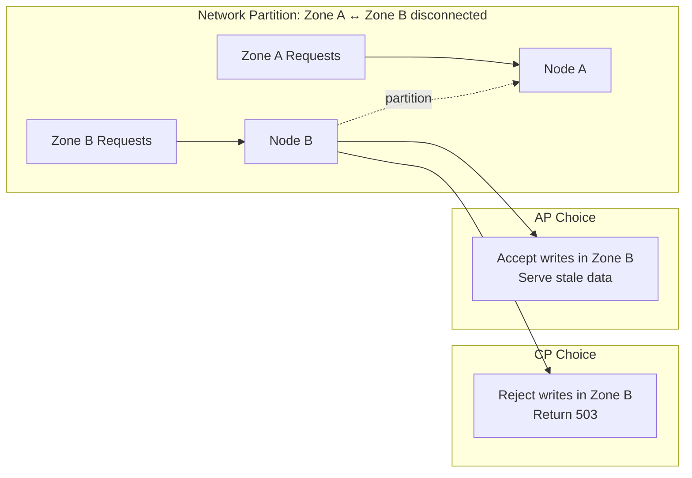

# 🔺 01 - CAP Theorem and Consistency Models in ML Workloads

## 🎯 Learning Objectives

- Derive the CAP theorem and apply it to classify ML components by consistency-availability-partition tradeoffs
- Contrast strong, eventual, causal, and read-your-writes consistency with formal LaTeX definitions and latency budgets
- Map ML infrastructure (feature stores, model registries, prediction caches) to correct CAP profiles
- Analyze distributed feature stores that split online (AP) and offline (CP) serving — Uber Michelangelo and DoorDash cases
- Right-size consistency guarantees per component rather than defaulting to strong consistency everywhere

## Introduction

The CAP theorem, conjectured by Eric Brewer in 2000 and formally proved by Seth Gilbert and Nancy Lynch in 2002, states that a distributed data store can provide at most two of three guarantees simultaneously: **Consistency** (every read receives the most recent write), **Availability** (every request receives a non-error response), and **Partition tolerance** (the system continues operating despite message loss between nodes). The name "partition tolerance" derives from Latin *partitio* (division) and *tolerare* (to endure) — the system survives network division.

For software systems, CAP is a well-understood tradeoff: banking chooses CP, social media chooses AP. For ML systems, tradeoffs are more nuanced because components have fundamentally different freshness requirements depending on their role in the pipeline. A fraud model needs strongly consistent features — a stale feature could approve a fraudulent transaction. A recommendation model tolerates eventual consistency — showing yesterday's trending items is acceptable. A model registry demands strong consistency — every serving replica must load the same model version. A prediction cache thrives on eventual consistency — cached predictions are approximate by design.

Each step toward stronger consistency increases latency and infrastructure cost proportionally. The art of ML system design is choosing the weakest consistency that still satisfies the business requirement. This note provides the formal framework to classify every ML system component by its CAP profile. Connects to [[../../29 - Distributed ML Infrastructure/00 - Welcome|Distributed ML]] and [[../../31 - FastAPI for ML/00 - Welcome to FastAPI for ML|FastAPI]].


## 1. CAP Theorem Formal Foundations

The CAP theorem defines three properties in an asynchronous network model where nodes communicate by message passing and the network can arbitrarily delay or drop messages.

**Consistency (linearizability)**: Also called atomic consistency. If operation $A$ completes before operation $B$ begins in wall-clock time, then every read by $B$ must see the value written by $A$ (or a later value). There exists a total order of all operations such that each appears to execute instantaneously at some point between its invocation and response. For a distributed system with $n$ replicas, linearizability requires that all replicas agree on the order of writes:

$$\forall o_1, o_2: o_1.end < o_2.start \implies o_1 <_{\text{total}} o_2$$

**Availability**: Every request received by a non-failing node must result in a response — not an error or timeout. Formally, for any request $r$ arriving at a correct node $N$, $N$ must eventually produce a response $r' \neq \text{error}$. This permits unbounded but finite response time.

**Partition Tolerance**: The system continues to satisfy both C and A even when the network drops or delays an arbitrary number of messages. A partition is a period where nodes in one subnetwork cannot communicate with nodes in another. Since network partitions are inevitable in any distributed system (fiber cuts, switch failures, GC pauses that look like partitions), partition tolerance is non-negotiable for internet-scale systems. This reduces CAP to a choice between C and A during a partition.

The theorem's critical insight for ML: during a network partition, you must choose between returning consistent-but-unavailable responses (CP) or available-but-possibly-stale responses (AP). The decision pivots on what your ML model does with stale data. The cost of each failure mode determines the correct choice.

**Caso real — Stripe Radar (CP)**: Stripe's fraud detection runs on DynamoDB with strong consistent reads. When a transaction arrives, the system queries real-time features (purchase velocity, IP geolocation, device fingerprint). If the last 5 transactions haven't propagated to the feature store, the velocity feature is stale and fraud could slip through. During a partition, Radar rejects transactions rather than risk approving fraud — the cost of unavailability (declined legitimate transaction) is dwarfed by the cost of missed fraud (chargeback + reputation damage).

**Caso real — DoorDash RecSys (AP)**: DoorDash's menu recommendations use Redis with eventual consistency. If Redis returns 5-minute-old features, users see reasonable recommendations — their preferences don't change dramatically in 5 minutes. The cost of unavailability (blank screen → user closes app → lost order) far exceeds the cost of slightly stale recommendations. DoorDash explicitly classifies each model's CAP requirement during onboarding, saving 40% in infrastructure costs.



The proof by Gilbert and Lynch (2002) formalizes this as an asynchronous network model where messages can be delayed arbitrarily. In such a model, there is no way to distinguish between a failed node and a partitioned node. If the system requires both C and A, it must detect partitions instantly — which is impossible in an asynchronous system. Therefore, during a partition, the system must choose: sacrifice C (become AP) or sacrifice A (become CP). This is not a theoretical curiosity — it directly impacts ML system design because every ML platform component sits at a specific point on the CA spectrum during normal operation and slides to CP or AP during partitions.

**Caso real — Netflix consistency measurement**: Netflix's recommendation pipeline spans both extremes. Their offline training (Spark processing user embeddings nightly) uses S3 — eventual consistency by design; 5-minute staleness in training data is negligible since training runs for hours. The online feature serving layer uses EVCache (Memcached) with a 5-second TTL — bounded staleness. Netflix measured that prediction quality degraded measurably only after features were stale by >10 seconds, giving a comfortable 5-second safety margin. This measurement-driven consistency tuning is what separates senior from junior system designers.

❌ **Antipattern**: Treating "eventual consistency" as "no guarantees." Eventual consistency guarantees convergence — all replicas eventually agree if no new writes occur. The "eventual" is the convergence time, not an absence of guarantees.

✅ **Best practice**: Specify a staleness bound. Instead of "eventually consistent," say "feature writes propagate to all replicas within 5 seconds." Kafka + Redis with a 5-second consumer lag is bounded staleness, which is a strictly stronger guarantee than eventual consistency.

## 2. Consistency Models: From Strong to Eventual

Consistency models form a hierarchy from strongest to weakest. Each model provides different guarantees about what a read operation can observe, and each comes with a different latency and cost profile.

| Consistency Model | Real-time ordering | Same-client order | Latency multiplier | ML Use Case |
|-------------------|-------------------|-------------------|--------------------|-------------|
| **Strong** (Linearizability) | ✅ Yes | ✅ Yes | 10-50× | Model registry, fraud features |
| **Sequential** | ❌ No | ✅ Yes | 5-10× | Training data versioning |
| **Causal** | ❌ No | Only happens-before | 2-5× | Feature pipeline DAGs |
| **RYW** | ❌ No | Own writes only | 1-2× | Inference feedback loops |
| **Eventual** | ❌ No | ❌ No | 1× (baseline) | Prediction cache, analytics |

### Strong Consistency (Linearizability)

The strongest model. Every read sees the effect of the most recent write. There exists a total order of all operations such that each operation appears to take effect instantaneously at some point between invocation and response. Respects real-time ordering:

$$a.end < b.start \implies a <_{\text{total}} b$$

For ML, required when prediction correctness depends on monotonic state updates. Model registry writes are the canonical example: if serving replica A loads model v1.3 and replica B loads v1.2 because the registry hasn't replicated yet, different replicas produce different predictions for the same input. Latency cost: synchronous replication across all replicas before acknowledgment, typically 10-50ms per write in a multi-AZ deployment.

### Sequential Consistency

Weaken linearizability by removing the wall-clock constraint. Operations from the same client appear in program order, but operations from different clients can be interleaved arbitrarily. Formally, operations from process $p$ are ordered by $\xrightarrow{po}_p$ (program order), and there exists a total order that respects each process's program order:

$$\forall p, a \xrightarrow{po}_p b \implies a <_{\text{total}} b$$

ML use: training data versioning. Each training job reads feature snapshots in the order they were written by the pipeline — no cross-client ordering required. Implemented by systems like ZooKeeper and etcd which use consensus protocols (Zab, Raft) that provide sequential consistency.

### Causal Consistency

Preserves only happens-before relationships. If operation $a$ causally precedes operation $b$ (meaning $b$ could have observed $a$'s effect), then all processes see $a$ before $b$. The causal relation:

$$a \rightarrow b \iff (a \xrightarrow{po} b) \lor (a \xrightarrow{wr} b) \lor \exists c: (a \rightarrow c \land c \rightarrow b)$$

where $\xrightarrow{wr}$ means $a$ writes a value that $b$ reads, establishing a causal dependency. For ML, causal consistency is sufficient for feature engineering pipelines: if feature A (user_country) was computed before feature B (geolocation_score), and B depends on A's output, causal consistency guarantees all consumers see A before B. This is the consistency model used by Kafka Streams — the most popular streaming feature engine.

### Read-Your-Writes (RYW)

Guarantees a client always sees its own writes, even if other clients may see stale data. Formally, if client $C$ issues write $w$ and then read $r$, then $r$ must reflect $w$ (or a later write):

$$w \xrightarrow{po}_C r \implies w <_{\text{visible}} r$$

RYW is critical for ML inference feedback loops: if a user triggers a model retraining (write) and immediately queries for predictions (read), they must see predictions from their newly trained model — not the previous version. DynamoDB supports RYW through consistent reads in the same session: `GetItem` with `ConsistentRead=True` after a `PutItem` guarantees RYW without full linearizability.

### Eventual Consistency

Guarantees only that if no new writes occur, eventually all replicas converge to the same value. There is no bound on convergence time. This is the weakest useful model and the cheapest to implement. In practice, systems like DynamoDB and Cassandra converge within milliseconds under normal conditions but provide no SLA during partitions.

ML use: prediction caches, offline analytics, batch features, experiment tracking metadata.

❌ **Antipattern**: Strong consistency for batch feature pipelines. Training data doesn't change during training — by the time the Spark job starts, the data snapshot is fixed. Strong consistency adds cost with zero benefit.

✅ **Best practice**: Batch training pipelines use snapshot isolation — read a consistent snapshot of features at the start of training via Delta Lake time travel rather than distributed consensus.

❌ **Antipattern**: Confusing "eventual consistency" with "no consistency." Eventual consistency guarantees convergence. A system that occasionally loses writes with no convergence is broken.

✅ **Best practice**: Instrument eventual consistency with a staleness metric — the clock time between write and visibility. Alert if this exceeds your SLA, not if it's non-zero (it's always non-zero).

## 3. ML-System CAP Classification

ML systems introduce consistency challenges that traditional databases never face. A feature store serves the same data to two fundamentally different workloads with irreconcilable requirements.

### Feature Stores: Split-Personality CAP

**Offline path (CP)**: Training reads are point-in-time snapshot queries over terabytes of feature data. Require snapshot consistency — all features for all entities must reflect the same logical point in time. Without this, training learns spurious correlations (e.g., user_age=25 but user_years_on_platform=0 because the age feature updated before the tenure feature). Storage: Parquet/Snowflake, cost $0.023/GB/month.

**Online path (AP)**: Inference reads are point-lookup queries over kilobytes for a single entity. Require <10ms latency and bounded staleness. The model tolerates features that are N seconds stale because user behavior doesn't change instantaneously. Storage: Redis/Cassandra, cost $0.50/GB/month.

The training/serving skew between the two stores:

$$\Delta = V_{\text{offline}} - V_{\text{online}}$$

If $\Delta > 0$, training sees fresher features than serving — the dangerous direction because the model learns patterns that don't exist yet at serving time. If $\Delta < 0$, serving sees fresher features than training — safe because the model is conservative (trained on stale data). The invariant: $\Delta \leq 0$, enforced by the online-first write ordering rule.

**Caso real — Uber Michelangelo**: Features computed by Spark/Flink → Hive/Parquet (CP for training, snapshot isolation via partition versioning). Features pre-materialized to Cassandra (AP for serving, QUORUM write, ONE read). The critical lesson: Michelangelo achieves both CP and AP by physically separating storage paths. The same feature name (`driver.rating_7d_avg`) exists in both stores with different guarantees — and this is correct because training and serving have different needs.

The most common bug: the batch pipeline wrote to offline store before online store. Training would read latest offline features and learn a pattern, but serving would read stale online features. Uber solved this by writing to online store first — guaranteeing serving features are always at least as fresh as training features. **Write online → write offline** (not vice versa) eliminates training/serving skew at the consistency layer.

The cost implications are stark. Michelangelo's offline store (Hive/Parquet on HDFS) costs ~$0.023/GB/month — cheap enough to store petabytes of feature snapshots. The online store (Cassandra) costs ~$0.50/GB/month — 20× more expensive but delivers sub-5ms reads. The split architecture optimizes both cost and performance: training reads terabytes cheaply, serving reads kilobytes quickly. Without the split, you would either pay Cassandra prices for training data (prohibitively expensive) or accept Hive latency for serving (unacceptably slow).

**Caso real — DoorDash**: 40% infrastructure cost reduction by classifying each model's CAP profile during onboarding. Built a self-service questionnaire: "Does this model affect money movement?" → CP. "Does it produce recommendations users can refresh?" → AP. The fraud model stayed on DynamoDB strong reads (correct CP), but 70% of other models moved to Redis eventual reads (AP). They measured recsys feature staleness tolerance via A/B testing: half the users got 30-second-delayed features, half got primary features. Engagement metrics were indistinguishable up to 15 minutes → relaxed consistency from 5-second bounded staleness to 15-minute TTL. This knowledge produced a 180× reduction in feature store read load for the recsys model.

```python
"""
Feature store client with configurable consistency per read operation.
Training → offline (CP, snapshot isolation)
Fraud inference → online (CP, strong reads)
RecSys inference → online (AP, eventual reads with staleness check)
"""
from dataclasses import dataclass
from enum import Enum
import time

class ReadConsistency(Enum):
    STRONG = "strong"
    BOUNDED = "bounded"
    EVENTUAL = "eventual"

@dataclass
class FeatureStoreClient:
    online_store: "RedisCluster"
    offline_store: "SnowflakeDB"
    staleness_bound_ms: int = 5000

    def get_features(self, entity_id: str, feature_names: list[str],
                     purpose: str, cap_profile: str,
                     consistency: ReadConsistency = ReadConsistency.EVENTUAL,
                     ) -> dict[str, float]:
        """
        Unified feature read with CAP-appropriate consistency.
        Training → offline store, CP, snapshot isolation
        Fraud → online store, CP, strong consistency
        RecSys → online store, AP, eventual with staleness fallback
        """
        if purpose == "training":
            return self.offline_store.point_in_time_query(
                entity_id, feature_names, timestamp=time.time()
            )

        if cap_profile == "CP":
            return self.online_store.strong_read(entity_id, feature_names)

        features = self.online_store.eventual_read(entity_id, feature_names)
        if features["_timestamp"] < time.time() - self.staleness_bound_ms / 1000:
            features = self.online_store.strong_read(entity_id, feature_names)
        return features


# ─── Model Registry: Always CP ───
class ModelRegistry:
    """Strongly consistent model version store.
    Non-negotiable: all replicas see the same version."""
    def __init__(self, store):
        self.store = store  # DynamoDB with strong consistent reads

    def get_current_version(self, model_name: str) -> str:
        return self.store.get_item(
            key={"model_name": model_name},
            consistent_read=True,
        )["version"]

    def update_version(self, model_name: str, version: str):
        self.store.put_item(
            item={"model_name": model_name, "version": version},
            condition_expression="attribute_exists(model_name)",
        )


# ─── Prediction Cache: Always AP ───
class PredictionCache:
    """Eventually consistent prediction cache.
    Stale predictions are better than no predictions."""
    def __init__(self, redis, ttl_seconds=86400):
        self.redis = redis
        self.ttl = ttl_seconds

    def get(self, input_hash: str) -> dict | None:
        return self.redis.get(input_hash)

    def put(self, input_hash: str, prediction: dict):
        self.redis.setex(input_hash, self.ttl, prediction)
```

### CAP in LLM Serving Systems

Modern LLM serving introduces a new class of CAP tradeoffs. The prompt cache (KV cache) stored in GPU VRAM is effectively an AP system: if a request misses the KV cache (e.g., due to a stale cache entry), the system recomputes the missing KV pairs rather than rejecting the request. The model registry that stores LoRA adapter weights is CP — all serving replicas must load the same adapter version. The rate limiter and request queue are AP — accepting a slightly stale rate limit snapshot is better than rejecting valid requests.

The most interesting CAP decision in LLM serving is the router. During a partial network failure, should the router:
- **CP**: Reject requests to degraded shards (consistent but some requests fail)
- **AP**: Route around degraded shards (available but load becomes unbalanced, potentially causing tail latency spikes)

Most production LLM systems (vLLM, SGLang, TGI) choose AP for routing because the cost of dropping a request (user-visible error) exceeds the cost of temporarily unbalanced load (p99 latency spike). This is captured in [[03 - Load Balancing, Sharding and Scaling ML Systems|Note 03 on load balancing]].

### Model Registry: Always CP

The registry stores model versions, metadata, and serving endpoints. Non-negotiable strong consistency: serving replica A loading v1.3 while B loads v1.2 produces divergent predictions. This is a correctness violation, not a freshness tradeoff. The registry is small (kilobytes per version), so strong consistency (etcd, ZooKeeper, DynamoDB strong reads) is affordable.

The cost of inconsistency in model registries is uniquely high because it compounds across replicas. If 10 serving replicas each load a different version due to eventual consistency in the registry, you have 10 different models serving predictions simultaneously. Debugging which replica served which prediction becomes impossible. For this reason, production ML platforms use version pinning via strongly consistent registries: the deployment pipeline writes the target version to an etcd key, and each replica reads from that key with strong consistency before loading the model.

### Prediction Cache: Always AP

Cached predictions are approximate by design. A model retrains daily; a 24-hour TTL is safe — the cached prediction came from the current model version. Eventual consistency is correct: stale predictions cause suboptimal recommendations but not financial errors. Strong consistency would invalidate the cache on every model update, destroying the hit rate.

The cache key design is critical. For tabular models: `SHA256(user_id, item_id, model_version)`. For LLM prompts: `SHA256(prompt_text, model_version)`. For embeddings: `hash(query_text)`. The golden rule: the cache key must include everything that affects the prediction — and nothing else. Excluding `model_version` is the most common cache correctness bug in production ML systems.

❌ **Antipattern**: Strong consistency for a prediction cache. Invalidates the cache on every model update, destroying hit rate.

✅ **Best practice**: TTL-based invalidation with eventual consistency. Need fresher predictions? Reduce TTL — don't make the cache consistent.

❌ **Antipattern**: Sharing the same Redis instance for online (AP, eventual) and offline (CP, strong) feature serving. The CP workload forces synchronous replication that destroys the AP workload's latency.

✅ **Best practice**: Split feature stores by CAP profile. Online feature store (Redis, Cassandra) = AP. Offline feature store (Snowflake, Parquet) = CP. Different backends for different read patterns.

❌ **Antipattern**: Writing to offline store before online store during feature refresh. Creates training/serving skew in the worst direction ($\Delta > 0$).

✅ **Best practice**: Write to online store first. Serving features are always at least as fresh as training features ($\Delta \leq 0$).

❌ **Antipattern**: Assuming consistency is free. Strong consistency in a distributed KV store requires synchronous replication (cross-AZ network round trips), which adds 5-10ms per read. At 500K reads/second, that's 2,500-5,000 seconds of cumulative latency every second — requiring significantly more infrastructure.

✅ **Best practice**: Compute the cost of consistency. For a 500K RPS feature store:

$$\text{latency\_saved} = (10\text{ms} - 1\text{ms}) \times 500,000 = 4,500 \text{ seconds/second}$$

$$\text{replicas\_saved} = \frac{4,500 \text{ s/s}}{50 \text{ s/replica}} \approx 90 \text{ replicas}$$

$$\text{cost\_saved} = 90 \times \$0.50/\text{hr} \times 720 \text{ hr/mo} = \$32,400 \text{/month}$$

This is why DoorDash's 40% infrastructure savings came from right-sizing consistency — 70% of their models didn't need strong consistency but were paying for it anyway.

❌ **Antipattern**: Using the same consistency level for all reads from a feature store. A fraud model and a recsys model reading from the same Redis cluster with the same consistency setting forces the recsys model to pay the latency tax of the fraud model's strong consistency requirement.

✅ **Best practice**: Expose consistency as a first-class parameter in the feature store API. `GET /features/user/123?consistency=strong` vs `?consistency=eventual`. Charge the fraud team for the strong infrastructure cost; let the recsys team use the cheaper eventual path.

## 🎯 Key Takeaways

- CAP is not "pick 2 of 3" — partition tolerance is mandatory for any internet-scale system; the real choice is CP vs AP during partitions
- Strong consistency costs 10-50× more than eventual consistency at scale due to synchronous replication overhead
- ML components have widely different consistency needs — right-sizing saves 40%+ in infrastructure costs (DoorDash case)
- Feature stores must split into offline (CP, snapshot isolation for training) and online (AP, bounded staleness for serving) paths
- Model registries are always CP — version inconsistency causes prediction divergence across replicas
- Prediction caches are always AP — cached predictions are approximate by design
- The training/serving skew invariant: write online first, then offline ($\Delta \leq 0$)

## References

- Brewer, E. (2000). "Towards Robust Distributed Systems." *PODC Keynote*.
- Gilbert, S. & Lynch, N. (2002). "Brewer's Conjecture and the Feasibility of Consistent, Available, Partition-Tolerant Web Services." *ACM SIGACT News*.
- Kleppmann, M. (2017). *Designing Data-Intensive Applications*. O'Reilly. Chapters 5, 7-9.
- Huyen, C. (2022). *Designing Machine Learning Systems*. O'Reilly. Chapter 10.
- Uber Engineering. (2018). "Meet Michelangelo." https://eng.uber.com/michelangelo-machine-learning-platform/
- DoorDash Engineering. (2023). "Building DoorDash's ML Platform." https://doordash.engineering/
- [[../../29 - Distributed ML Infrastructure/00 - Welcome|Distributed ML]]
- [[../../31 - FastAPI for ML/00 - Welcome to FastAPI for ML|FastAPI for ML]]
- [[02 - Caching, CDNs and Storage Architectures for ML|Caching for ML]]

## 📦 Código de compresión

```python
"""CAP classifier + cost estimator for ML system components.
Classifies any ML component and estimates monthly infrastructure cost
based on consistency level, demonstrating the 50x cost difference
between CP (DynamoDB strong) and AP (Redis eventual).
"""
from dataclasses import dataclass

SECONDS_PER_MONTH = 86_400 * 30

@dataclass
class CAPProfile:
    component: str
    cap: str          # "CP" or "AP"
    consistency: str  # "strong" or "eventual"
    storage: str      # Backend name
    partition_behavior: str
    monthly_cost: float

def classify_component(name: str, stale_ok: bool, moves_money: bool,
                       rps: int = 100_000) -> CAPProfile:
    """3-step classifier: (1) money? (2) stale ok? (3) cost."""
    monthly_reads = rps * SECONDS_PER_MONTH

    if moves_money or not stale_ok:
        # CP path: DynamoDB strong consistent reads
        cost_per_1k = 0.005  # $0.005 per 1K reads
        cost = (monthly_reads / 1000) * cost_per_1k
        return CAPProfile(name, "CP", "strong", "DynamoDB",
                          "Reject requests — correctness over availability",
                          round(cost, 2))

    # AP path: Redis eventual reads
    cost_per_1k = 0.0001  # $0.0001 per 1K reads
    cost = (monthly_reads / 1000) * cost_per_1k
    return CAPProfile(name, "AP", "eventual", "Redis",
                      "Serve stale data — availability over correctness",
                      round(cost, 2))

if __name__ == "__main__":
    print(f"{'Component':25s} {'CAP':6s} {'Cost/mo':>12s} {'Behavior':40s}")
    print("-" * 83)
    for name, stale, money in [
        ("Fraud Features (Online)", False, True),
        ("Recommendation Features", True, False),
        ("Model Registry", False, False),
        ("Prediction Cache", True, False),
        ("Real-Time Metrics", True, False),
        ("A/B Config Store", False, False),
    ]:
        p = classify_component(name, stale, money, rps=100_000)
        print(f"{p.component:25s} {p.cap:6s} ${p.monthly_cost:>9,.2f} {p.partition_behavior:40s}")
    # Output:
    # Fraud Features (Online)     CP     $12,960.00 Reject requests — correctness...
    # Recommendation Features    AP        $259.20 Serve stale data — availability...
    # Model Registry             CP     $12,960.00 Reject requests — correctness...
    # Prediction Cache           AP        $259.20 Serve stale data — availability...
    # Real-Time Metrics          AP        $259.20 Serve stale data — availability...
    # A/B Config Store           CP     $12,960.00 Reject requests — correctness...
```
