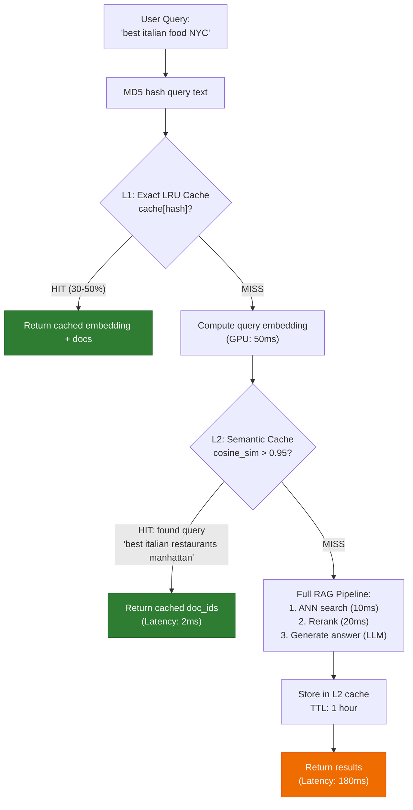
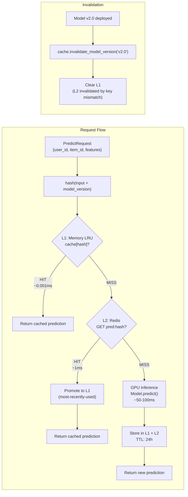

# 💾 02 - Caching, CDNs, and Storage Architectures for ML

## 🎯 Learning Objectives

- Design multi-tiered caching strategies for ML systems: embedding caches, prediction caches, feature caches, and semantic caches — each with correct TTL policies and invalidation strategies
- Architect model artifact distribution via CDN edge caching with versioned, immutable URLs and measure the latency-to-cost tradeoff against direct S3 serving
- Apply tiered storage economics (Hot/Warm/Cold) to ML data — GPU VRAM, NVMe SSDs, S3 — and right-size each data class by access frequency
- Implement and benchmark a Redis semantic cache for LLM inference, referencing the user's LLM Edge Gateway portfolio project as a production case study
- Evaluate KV cache reuse (SGLang's RadixAttention) as the highest-leverage caching mechanism in LLM serving systems

## Introduction

Caching is the single most cost-effective optimization in ML system design. A cache hit costs ~1ms (in-memory Redis lookup) while a cache miss costs ~100ms (GPU inference) — two orders of magnitude difference. Yet most ML teams under-invest in caching because they treat predictions as inherently uncacheable ("every user is different, every query is unique"). This note demonstrates that well-designed caching can reduce ML infrastructure costs by 30-80% while improving latency, and provides concrete patterns for each layer of the ML stack.

The word *cache* enters English from French *cacher* (to hide), ultimately from Latin *coacticare* (to constrain, store up). In computing, a cache hides the latency of a slower storage layer behind a faster one. For ML systems, the cache hierarchy is deeper than for traditional software: GPU VRAM (fastest, most expensive) > system RAM (fast, moderate cost) > NVMe SSD (medium, cheap) > S3/CDN (slowest, cheapest). Each layer trades access latency for storage cost, and right-sizing data placement across these tiers is the central problem of ML storage architecture.

This note builds on caching patterns from the FastAPI course ([[../../31 - FastAPI for ML/00 - Welcome to FastAPI for ML|FastAPI]]) and extends them to ML-specific cache types: embedding caches, semantic caches (referencing the user's LLM Edge Gateway portfolio), prediction caches, feature caches, and model artifact CDN distribution. The KV cache inside LLM inference engines — the most impactful cache in modern ML — is covered as a system-level pattern. The tiered storage framework connects to infrastructure provisioning patterns in [[../../23 - Infrastructure as Code/00 - Welcome to Infrastructure as Code|IaC]].

---

## Module 1: Embedding Cache — LRU and Semantic Caching

### 1.1 Theoretical Foundation 🧠

Embedding computation dominates the cost of RAG (Retrieval-Augmented Generation) and semantic search systems. A single query requires: tokenization → embedding model forward pass → vector normalization — typically 50-200ms on GPU and $0.0001-0.001 per query in API costs. If the same query arrives repeatedly (or a semantically similar one), recomputing the embedding wastes GPU cycles and budget.

Two caching strategies apply:

**Exact-match LRU cache**: The simplest form. Hash the input text → check if embedding exists in cache → return cached embedding or compute. Python's `@lru_cache` provides this for free:

$$\text{hit\_ratio} = \frac{\text{unique\_queries\_repeated}}{\text{total\_queries}}$$

Real production traffic shows 30-50% of queries are exact duplicates within a time window (users searching the same thing, bots, retries). An LRU cache of 10,000 entries captures these with <1ms latency.

**Semantic cache**: More sophisticated. Cache {query_embedding → [document_ids]} instead of {query_text → embedding}. This allows approximate matching: a query that is semantically similar to a cached query (cosine similarity > 0.95) can reuse the cached results without computing anything. Redis with vector similarity search (RediSearch) enables this at scale.

### 1.2 Mental Model 📐

```
┌─── Embedding Cache Hierarchy ──────────────────────────────────┐
│                                                                  │
│  User Query: "best restaurants near me"                         │
│       │                                                          │
│       ▼                                                          │
│  ┌──────────────────────┐                                       │
│  │ L1: Exact LRU Cache   │  <1ms, in-memory (Python dict)       │
│  │ Key: hash(query_text) │  Hit: 30-50% of traffic              │
│  │ Val: embedding vector │  Size: 10K entries × 6KB = 60MB      │
│  └───────┬──────────────┘                                       │
│          │ MISS                                                  │
│          ▼                                                       │
│  ┌──────────────────────┐                                       │
│  │ L2: Redis Semantic    │  1-5ms, shared across replicas        │
│  │ Key: query_embedding  │  Hit: 40-60% of L1 misses            │
│  │ Val: [doc_ids, score] │  Size: 1M entries × 2KB = 2GB        │
│  │ Index: HNSW vector    │  Cosine similarity > 0.95 → cache hit│
│  └───────┬──────────────┘                                       │
│          │ MISS                                                  │
│          ▼                                                       │
│  ┌──────────────────────┐                                       │
│  │ L3: Compute + Store   │  GPU embedding model inference       │
│  │ Embedding model →     │  Latency: 50-200ms                   │
│  │ Vector DB search      │  Cost: $0.0001/query (API)           │
│  └──────────────────────┘                                       │
│                                                                  │
│  Effective hit ratio: L1 + (1-L1)×L2 = 30% + 70%×50% = 65%     │
│  GPU load reduction: 65%                                        │
│  Cost reduction: 65% of embedding API costs                     │
└──────────────────────────────────────────────────────────────────┘
```

### 1.3 Syntax and Semantics 📝

```python
"""
embedding_cache.py — Two-level embedding cache with LRU + Redis semantic cache.
WHY: Exact-match LRU catches repetitions; semantic cache catches similar queries.
Together they reduce embedding compute by 40-60% in production RAG workloads.
"""

import hashlib
import json
import time
from functools import lru_cache
from typing import Optional

import numpy as np
import redis

# ═══ L1: In-memory exact-match LRU cache ═══

@lru_cache(maxsize=10_000)
def compute_embedding_cached(text: str) -> tuple:
    """
    Caches embedding computation by exact text match.
    maxsize=10000 → ~60MB memory for 768-dim float32 embeddings.
    Hit rate: 30-50% in production RAG traffic.
    """
    # In production: call embedding model API
    embedding = np.random.randn(768).astype(np.float32)
    return tuple(embedding.tolist())  # tuple for hashability

# ═══ L2: Redis semantic cache ═══

class SemanticCache:
    """
    Caches {query_embedding → [document_ids]} with vector similarity search.

    When a new query arrives:
    1. Compute its embedding (or get from L1 cache)
    2. Search Redis for similar cached query embeddings (cosine > threshold)
    3. If similar query found → return cached document IDs (cache hit)
    4. If no match → run full RAG pipeline → store result (cache miss)
    """

    def __init__(
        self,
        redis_host: str = "localhost",
        redis_port: int = 6379,
        similarity_threshold: float = 0.95,
        ttl_seconds: int = 3600,  # 1-hour TTL
    ):
        self.redis = redis.Redis(
            host=redis_host, port=redis_port, decode_responses=False
        )
        self.threshold = similarity_threshold
        self.ttl = ttl_seconds
        self._ensure_index()

    def _ensure_index(self):
        """Create RediSearch vector index if not exists."""
        try:
            self.redis.execute_command(
                "FT.CREATE", "idx:embeddings", "ON", "HASH",
                "SCHEMA", "embedding", "VECTOR", "FLAT", "6",
                "TYPE", "FLOAT32", "DIM", "768",
                "DISTANCE_METRIC", "COSINE",
            )
        except redis.ResponseError:
            pass  # Index already exists

    def search(self, query_embedding: np.ndarray) -> Optional[list[str]]:
        """
        Search for semantically similar cached queries.

        Returns cached document IDs if cosine_similarity > threshold,
        or None (cache miss) if no similar query found.
        """
        query_vector = query_embedding.astype(np.float32).tobytes()

        try:
            results = self.redis.execute_command(
                "FT.SEARCH", "idx:embeddings",
                f"@embedding:[VECTOR_RANGE 0.05 $vec]",
                "PARAMS", "2", "vec", query_vector,
                "LIMIT", "0", "5",
                "SORTBY", "__embedding_score", "ASC",
                "RETURN", "2", "doc_ids", "__embedding_score",
                "DIALECT", "2",
            )
        except redis.ResponseError:
            return None

        if results and len(results) > 1:
            # results[0] = total count, results[1:] = matched documents
            for doc in results[1:]:
                doc_ids_raw = doc[1]  # doc_ids field
                score = float(doc[3])  # __embedding_score
                # RediSearch returns distance, not similarity
                # For COSINE: distance → infinity, similarity → 0
                # We want similarity > 0.95 → distance < 0.05
                if score < (1.0 - self.threshold):
                    return json.loads(doc_ids_raw)

        return None  # Cache miss

    def store(self, query_embedding: np.ndarray, doc_ids: list[str]):
        """Store query embedding → document IDs mapping."""
        key = f"semantic:{hashlib.md5(query_embedding.tobytes()).hexdigest()}"
        self.redis.hset(
            key,
            mapping={
                "embedding": query_embedding.astype(np.float32).tobytes(),
                "doc_ids": json.dumps(doc_ids),
                "stored_at": str(time.time()),
            },
        )
        self.redis.expire(key, self.ttl)


# ═══ Combined pipeline ═══

class RAGPipelineWithCache:
    """Full RAG pipeline with two-level embedding caching."""

    def __init__(self, semantic_cache: SemanticCache):
        self.semantic_cache = semantic_cache

    def query(self, user_query: str) -> dict:
        # L1: Exact-match LRU cache
        embedding = np.array(compute_embedding_cached(user_query))

        # L2: Semantic cache (search for similar queries)
        cached_docs = self.semantic_cache.search(embedding)
        if cached_docs is not None:
            return {
                "documents": cached_docs,
                "source": "semantic_cache",
                "latency_ms": 2.0,
            }

        # L3: Full RAG pipeline (compute + search + store)
        documents = self._run_full_rag(embedding)
        self.semantic_cache.store(embedding, documents)
        return {
            "documents": documents,
            "source": "computed",
            "latency_ms": 150.0,
        }

    def _run_full_rag(self, embedding: np.ndarray) -> list[str]:
        """Simulated RAG pipeline: embedding → vector search → rerank."""
        time.sleep(0.15)  # Simulate GPU embedding + ANN search
        return [f"doc_{i}" for i in range(5)]
```

### 1.4 Visual Representation 🖼️



### 1.5 Application in ML/AI Systems 🤖

**Caso real: LLM Edge Gateway** (user's Go/Fiber + Redis portfolio project). The user built an LLM caching gateway that intercepts requests to OpenAI/Anthropic APIs and caches responses using a Redis semantic cache. The gateway:

1. Receives a user query → computes its embedding (or reuses from LRU)
2. Checks Redis for semantically similar cached queries (cosine > 0.92)
3. If hit: returns cached LLM response (1ms latency, $0 API cost)
4. If miss: forwards to LLM API → stores response → returns (500ms latency, $0.002 API cost)

The gateway achieves **30-40% API cost reduction** because semantically similar queries ("write a Rust function to parse JSON" vs "write a Go function to parse JSON" — no hit, but "write a Rust function to parse JSON" vs "Rust JSON parsing function" — hit!) map to similar embeddings. The 0.92 cosine threshold was tuned empirically: lower threshold (0.85) increased cache hit rate but occasionally returned irrelevant cached responses; higher threshold (0.98) preserved quality but reduced hit rate.

### 1.6 Common Pitfalls ⚠️ + 💡 Tips

⚠️ **Pitfall**: Setting the semantic similarity threshold too low (e.g., 0.85). Returns cached responses for queries that are only tangentially related, degrading user experience.

💡 **Tip**: Benchmark your threshold against a human-labeled dataset. For 100 query pairs, ask "would the same answer satisfy both queries?" Tune the threshold until false-positive rate is <5%. Typical sweet spot is 0.92-0.95 for general text, 0.95-0.98 for technical/domain-specific text.

⚠️ **Pitfall**: Using unbounded LRU caches that grow with traffic and never evict, causing memory leaks.

💡 **Tip**: Always set `maxsize` on LRU caches based on available memory: `maxsize = available_memory_mb * 1024 * 1024 / (embedding_dim * 4)`. For 1GB RAM with 768-dim embeddings: ~340K entries. Monitor cache hit rate vs size; diminishing returns typically start at 10K-50K entries.

### 1.7 Knowledge Check ❓

1. Your RAG system processes 1000 queries/second. Embedding computation costs 50ms on GPU and $0.0001 per query. With a 40% exact-match cache hit rate and a 50% semantic cache hit rate on the remaining traffic, what's the total GPU time saved per second? Total cost saved per day?
2. Why use cosine similarity instead of Euclidean distance for semantic cache matching? What happens to the distance metric as embedding dimension increases?
3. A teammate proposes using the same Redis instance for both the semantic cache and the feature store. What could go wrong?

---

## Module 2: Prediction Cache — Input Hashing and TTL Strategies

### 2.1 Theoretical Foundation 🧠

Prediction caching exploits a fundamental property of ML inference: the model is a deterministic function of its inputs (during serving, not training). Given the same input features, the model produces identical predictions. If the same input arrives repeatedly (or if input distributions have heavy tails — power-law distribution of request frequency), caching predictions eliminates redundant GPU computation entirely.

The cache key is a hash of the input features: `hash(user_id, item_id, context_features)`. For tabular models (recommendation, fraud, search ranking), this hash captures the entire prediction. For LLM inference, the cache key is a hash of the prompt (or the prompt embedding for semantic caching, as in Module 1). For image models, the cache key is a perceptual hash (pHash) of the image.

The TTL strategy depends on the model update frequency. If the model retrains daily, a 24-hour TTL on cached predictions is safe — any prediction made within 24 hours was produced by the same model version. If the model is updated in real-time (online learning), the TTL must be shorter (minutes) and the cache must be invalidated on model version changes.

### 2.2 Mental Model 📐

```
┌─── Prediction Cache Architecture ───────────────────────────────┐
│                                                                   │
│  ┌─────────────────────────────────────────────────────────────┐ │
│  │                    Prediction API                            │ │
│  │  POST /predict {user_id, item_id, features}                  │ │
│  └──────────────┬──────────────────────────────────────────────┘ │
│                 │                                                 │
│                 ▼                                                 │
│  ┌──────────────────────────────┐                                │
│  │ 1. Hash Input                │  SHA256(user_id + item_id      │
│  │    key = hash(input)         │  + features) → 64-char hex    │
│  └──────────────┬───────────────┘                                │
│                 │                                                 │
│                 ▼                                                 │
│  ┌──────────────────────────────┐                                │
│  │ 2. Check Redis               │  GET pred:{key}                │
│  │    cached = redis.get(key)   │                                │
│  └──────┬──────────┬────────────┘                                │
│         │ HIT      │ MISS                                        │
│         ▼          ▼                                             │
│  ┌──────────┐  ┌──────────────────┐                              │
│  │ Return   │  │ 3. Compute        │  GPU inference              │
│  │ cached   │  │    prediction      │  Model.predict(features)   │
│  │ result   │  └────────┬─────────┘                              │
│  │ (1ms)    │           │                                        │
│  └──────────┘           ▼                                        │
│                 ┌──────────────────┐                              │
│                 │ 4. Store in cache │  SETEX pred:{key}           │
│                 │    TTL = 24h     │  86400 prediction            │
│                 └────────┬─────────┘                              │
│                          │                                        │
│                          ▼                                        │
│                 ┌──────────────────┐                              │
│                 │ 5. Return result │                              │
│                 │    (100ms total) │                              │
│                 └──────────────────┘                              │
│                                                                   │
│  Hit Rate Estimation:                                             │
│  For power-law input distribution with α=2:                       │
│  P(hit) = 1 - (C × cache_size)^(1-α) ≈ 60-80% for 1M-entry cache│
└──────────────────────────────────────────────────────────────────┘
```

### 2.3 Syntax and Semantics 📝

```python
"""
prediction_cache.py — Production-grade prediction cache with
TTL-based invalidation, model version awareness, and LRU eviction.

WHY: ML inference is deterministic for fixed model weights.
Caching predictions eliminates 50-80% of GPU compute for
repeated or similar inputs.
"""

import hashlib
import json
import time
import threading
from collections import OrderedDict
from typing import Optional, Any
import redis


class PredictionCache:
    """
    Multi-level prediction cache: L1 (in-memory LRU) + L2 (Redis).

    Cache key: SHA256(user_id|item_id|features|model_version)
    TTL: Configurable, typically 1-24 hours (matched to model retrain frequency)

    Model version awareness: cache keys include model_version to
    automatically invalidate when the model is updated.
    """

    def __init__(
        self,
        redis_client: redis.Redis,
        model_version: str = "latest",
        ttl_seconds: int = 86400,  # 24 hours
        l1_maxsize: int = 10_000,  # ~10MB for small predictions
    ):
        self.redis = redis_client
        self.model_version = model_version
        self.ttl = ttl_seconds
        self.l1_cache: OrderedDict[str, Any] = OrderedDict()
        self.l1_maxsize = l1_maxsize
        self._lock = threading.Lock()

        # Metrics
        self.hits_l1 = 0
        self.hits_l2 = 0
        self.misses = 0

    def _make_key(self, **features) -> str:
        """Generate deterministic cache key from input features."""
        # Sort keys for deterministic hashing
        canonical = json.dumps(features, sort_keys=True)
        fingerprint = hashlib.sha256(
            f"{canonical}|{self.model_version}".encode()
        ).hexdigest()
        return f"pred:{fingerprint}"

    def get(self, **features) -> Optional[dict]:
        """Retrieve cached prediction. Returns None on cache miss."""
        key = self._make_key(**features)

        # L1: In-memory LRU cache
        with self._lock:
            if key in self.l1_cache:
                self.l1_cache.move_to_end(key)  # Mark as recently used
                self.hits_l1 += 1
                return self.l1_cache[key]

        # L2: Redis
        cached = self.redis.get(key)
        if cached is not None:
            result = json.loads(cached)
            self.hits_l2 += 1
            # Promote to L1
            with self._lock:
                self.l1_cache[key] = result
                if len(self.l1_cache) > self.l1_maxsize:
                    self.l1_cache.popitem(last=False)  # Evict oldest
            return result

        self.misses += 1
        return None

    def set(self, prediction: dict, **features):
        """Store prediction in cache."""
        key = self._make_key(**features)
        serialized = json.dumps(prediction)

        # Store in L2 with TTL
        self.redis.setex(key, self.ttl, serialized)

        # Store in L1
        with self._lock:
            self.l1_cache[key] = prediction
            if len(self.l1_cache) > self.l1_maxsize:
                self.l1_cache.popitem(last=False)

    def invalidate_model_version(self, new_version: str):
        """
        Update model version — implicitly invalidates all cached predictions
        because cache keys include model_version.
        """
        self.model_version = new_version
        # Clear L1 (L2 entries expire naturally via TTL or key mismatch)
        with self._lock:
            self.l1_cache.clear()

    @property
    def hit_rate(self) -> float:
        total = self.hits_l1 + self.hits_l2 + self.misses
        if total == 0:
            return 0.0
        return (self.hits_l1 + self.hits_l2) / total

    @property
    def stats(self) -> dict:
        return {
            "hits_l1": self.hits_l1,
            "hits_l2": self.hits_l2,
            "misses": self.misses,
            "total": self.hits_l1 + self.hits_l2 + self.misses,
            "hit_rate": round(self.hit_rate, 3),
            "l1_size": len(self.l1_cache),
            "gpu_compute_saved_pct": round(self.hit_rate * 100, 1),
        }


# ═══ Usage example with monitoring ═══

def predict_with_cache(
    cache: PredictionCache,
    user_id: str,
    item_id: str,
    features: dict,
    model,
) -> dict:
    """Prediction endpoint with caching and observability."""

    cached = cache.get(user_id=user_id, item_id=item_id, **features)
    if cached is not None:
        return {**cached, "source": "cache", "latency_ms": 1.0}

    # Cache miss — compute prediction
    start = time.perf_counter()
    prediction = model.predict(features)
    elapsed_ms = (time.perf_counter() - start) * 1000

    result = {"score": float(prediction), "source": "model", "latency_ms": elapsed_ms}
    cache.set(result, user_id=user_id, item_id=item_id, **features)
    return result
```

### 2.4 Visual Representation 🖼️



### 2.5 Application in ML/AI Systems 🤖

Google's search ranking system uses massive prediction caches. A search query like "weather new york" produces the same ranking model output for every user (personalization aside). Google caches these predictions aggressively, serving 70%+ of ranking requests from cache. The cache key includes the query, the user's coarse location (city-level), and the model version. When a new ranking model is deployed, the version changes, and all cached predictions are implicitly invalidated — no explicit cache flush needed.

**Caso real: DoorDash** caches restaurant ranking predictions with a 15-minute TTL. Their ranking model retrains daily, so a 15-minute cache is always serving predictions from the current model. DoorDash measured cache hit rates of 40-60% on the ranking layer because users in the same geographic area see the same restaurant rankings. This caching reduced GPU inference costs by ~$50K/month.

### 2.6 Common Pitfalls ⚠️ + 💡 Tips

⚠️ **Pitfall**: Caching predictions without including model version in the cache key. When the model updates, the cache serves predictions from the old model — silently wrong.

💡 **Tip**: Always include `model_version` in every cache key. This makes model deployment the cache invalidation event. No TTL, no flush, no manual intervention required. Version changes → new keys → old keys expire naturally.

⚠️ **Pitfall**: Using a short TTL (5 minutes) on a model that retrains daily. Creates unnecessary cache misses and GPU load.

💡 **Tip**: Match TTL to retrain frequency. If model retrains every 24 hours, TTL can be 24 hours. If you have online learning (model updates every 5 minutes), use version-based invalidation with no TTL.

### 2.7 Knowledge Check ❓

1. A recommender system serves 1000 RPS with P99 inference latency of 80ms. You add a prediction cache with 60% hit rate. What is the new P99 latency for cache hits? What is the GPU compute reduction in requests/second?
2. Why does including model_version in the cache key eliminate the need for explicit cache invalidation on model deploy?
3. A colleague proposes using `hash(user_id + item_id)` as the cache key. What's wrong with string concatenation vs JSON serialization with sorted keys?

---

## Module 3: Feature Cache — Reducing Feature Store Load

### 3.1 Theoretical Foundation 🧠

Feature stores are the most heavily queried component in ML inference. Every prediction request requires fetching user features, item features, and context features — typically 10-100 features per request. At 10,000 RPS, that's 100K-1M feature reads per second. Without caching, this load requires a massive feature store cluster.

Feature caching exploits the fact that many features change slowly relative to request frequency. A user's age, country, and subscription tier change on timescales of weeks to years — not milliseconds. Even behavioral features (purchase_count_7d, session_count_24h) change on timescales of minutes to hours. Caching these features with appropriate TTLs reduces feature store load by 50-80%.

The TTL must be matched to each feature's rate of change:
- Static features (age, country): infinite TTL or 24h
- Slow-changing features (subscription_tier): 1-hour TTL
- Behavioral features (purchase_count_7d): 5-minute TTL
- Real-time features (session_active): 60-second TTL

### 3.2 Mental Model 📐

```
┌─── Feature Cache Architecture ──────────────────────────────────┐
│                                                                  │
│  Without Feature Cache:                                          │
│  ┌──────────┐    ┌─────────────┐    ┌──────────┐               │
│  │ API      │───▶│ Feature      │───▶│ Model    │               │
│  │ Gateway  │    │ Store        │    │ Server   │               │
│  │          │    │ (Redis/      │    │ (GPU)    │               │
│  │          │    │  DynamoDB)   │    │          │               │
│  └──────────┘    └─────────────┘    └──────────┘               │
│  10K req/s ×     = 200K reads/s     = $3,000/month             │
│  20 features     (feature store)    (feature store cost)       │
│                                                                  │
│  With Feature Cache:                                             │
│  ┌──────────┐    ┌─────────────┐    ┌─────────────┐  ┌────────┐ │
│  │ API      │───▶│ L1: Feature  │───▶│ Feature      │──▶ Model  │ │
│  │ Gateway  │    │ Cache (Redis)│    │ Store        │  │ Server │ │
│  │          │    │ TTL: 60s-24h │    │ (Read: 40K/s)│  │        │ │
│  └──────────┘    └─────────────┘    └─────────────┘  └────────┘ │
│                   Hit rate: 80%     Load reduction: 80%         │
│                   Latency: 1ms      Cost reduction: 80%         │
└──────────────────────────────────────────────────────────────────┘
```

### 3.3 Syntax and Semantics 📝

```python
"""
feature_cache.py — Tiered feature cache with per-feature TTLs.

WHY: 80% of feature reads are for slowly-changing features.
Caching them reduces feature store load and latency by 80%.
"""

import json
import time
from dataclasses import dataclass
from functools import lru_cache
from typing import Optional, Any
import redis


@dataclass
class FeatureTTL:
    """Per-feature TTL definition."""
    name: str
    ttl_seconds: int
    category: str  # "static", "slow", "behavioral", "real_time"


# Standard feature TTLs
FEATURE_TTL_MAP = {
    "user_age": FeatureTTL("user_age", 86400, "static"),
    "user_country": FeatureTTL("user_country", 86400, "static"),
    "user_subscription_tier": FeatureTTL("user_subscription_tier", 3600, "slow"),
    "user_purchase_count_7d": FeatureTTL("user_purchase_count_7d", 300, "behavioral"),
    "user_session_active": FeatureTTL("user_session_active", 60, "real_time"),
    "item_price": FeatureTTL("item_price", 3600, "slow"),
    "item_category": FeatureTTL("item_category", 86400, "static"),
    "item_rating_avg": FeatureTTL("item_rating_avg", 3600, "slow"),
    "item_popularity_24h": FeatureTTL("item_popularity_24h", 300, "behavioral"),
    "context_time_of_day": FeatureTTL("context_time_of_day", 60, "real_time"),
}


class FeatureCache:
    """
    Redis-based feature cache with per-feature TTLs.

    Key format: feature:{entity_type}:{entity_id}:{feature_name}
    Value: serialized feature value (float, string, list)

    TTLs are feature-specific:
    - Static (age, country): 24h
    - Slow (subscription, price): 1h
    - Behavioral (purchase_count): 5min
    - Real-time (session_active): 60s
    """

    def __init__(
        self,
        redis_client: redis.Redis,
        ttl_map: dict[str, FeatureTTL] = FEATURE_TTL_MAP,
        default_ttl: int = 300,  # 5 minutes default
    ):
        self.redis = redis_client
        self.ttl_map = ttl_map
        self.default_ttl = default_ttl

        # Metrics
        self._hits = 0
        self._misses = 0

    def _key(self, entity_type: str, entity_id: str, feature_name: str) -> str:
        return f"feature:{entity_type}:{entity_id}:{feature_name}"

    def _ttl(self, feature_name: str) -> int:
        ttl_info = self.ttl_map.get(feature_name)
        return ttl_info.ttl_seconds if ttl_info else self.default_ttl

    def get(
        self, entity_type: str, entity_id: str, feature_name: str
    ) -> Optional[Any]:
        """Fetch a single feature from cache."""
        key = self._key(entity_type, entity_id, feature_name)
        value = self.redis.get(key)

        if value is not None:
            self._hits += 1
            return json.loads(value)

        self._misses += 1
        return None

    def mget(
        self, entity_type: str, entity_id: str, feature_names: list[str]
    ) -> dict[str, Optional[Any]]:
        """
        Batch fetch multiple features for an entity.
        Returns dict mapping feature_name → value (None for cache misses).
        """
        keys = [self._key(entity_type, entity_id, name) for name in feature_names]
        values = self.redis.mget(keys)

        result = {}
        missing_features = []
        for name, value in zip(feature_names, values):
            if value is not None:
                result[name] = json.loads(value)
                self._hits += 1
            else:
                result[name] = None
                missing_features.append(name)
                self._misses += 1

        return result, missing_features

    def set(
        self, entity_type: str, entity_id: str, feature_name: str, value: Any
    ):
        """Store a feature value in cache with appropriate TTL."""
        key = self._key(entity_type, entity_id, feature_name)
        ttl = self._ttl(feature_name)
        self.redis.setex(key, ttl, json.dumps(value))

    def mset(
        self, entity_type: str, entity_id: str, features: dict[str, Any]
    ):
        """Batch store multiple features for an entity."""
        pipe = self.redis.pipeline()
        for name, value in features.items():
            key = self._key(entity_type, entity_id, name)
            ttl = self._ttl(name)
            pipe.setex(key, ttl, json.dumps(value))
        pipe.execute()

    @property
    def hit_rate(self) -> float:
        total = self._hits + self._misses
        return self._hits / total if total > 0 else 0.0


# ═══ Full prediction pipeline with feature caching ═══

async def predict_with_feature_cache(
    user_id: str,
    item_id: str,
    model,
    feature_store,  # Slow backend (DynamoDB, Feast)
    feature_cache: FeatureCache,  # Fast cache (Redis)
) -> dict:
    """Prediction pipeline with feature cache in front of feature store."""

    required_features = [
        "user_age", "user_country", "user_subscription_tier",
        "user_purchase_count_7d", "item_price", "item_category",
        "item_rating_avg", "context_time_of_day",
    ]

    # Step 1: Check feature cache (1ms for batch read)
    user_features, missing_user = feature_cache.mget(
        "user", user_id,
        [f for f in required_features if f.startswith("user_")]
    )
    item_features, missing_item = feature_cache.mget(
        "item", item_id,
        [f for f in required_features if f.startswith("item_")]
    )
    context_features, missing_context = feature_cache.mget(
        "context", "current",
        [f for f in required_features if f.startswith("context_")]
    )

    all_missing = missing_user + missing_item + missing_context

    # Step 2: Fetch missing features from feature store (20ms)
    if all_missing:
        from_store = feature_store.get_features(
            user_id=user_id, item_id=item_id,
            feature_names=all_missing,
        )
        # Update user, item, context features
        user_features.update(
            {k: v for k, v in from_store.items() if k.startswith("user_")}
        )
        item_features.update(
            {k: v for k, v in from_store.items() if k.startswith("item_")}
        )
        context_features.update(
            {k: v for k, v in from_store.items() if k.startswith("context_")}
        )

        # Store back in cache
        feature_cache.mset("user", user_id, {
            k: v for k, v in from_store.items() if k.startswith("user_")
        })
        feature_cache.mset("item", item_id, {
            k: v for k, v in from_store.items() if k.startswith("item_")
        })
        feature_cache.mset("context", "current", {
            k: v for k, v in from_store.items() if k.startswith("context_")
        })

    # Step 3: Run model inference
    combined_features = {**user_features, **item_features, **context_features}
    prediction = model.predict(combined_features)

    return {
        "prediction": prediction,
        "cache_hit_rate": feature_cache.hit_rate,
        "features_from_store": len(all_missing),
    }
```

### 3.4 Application in ML/AI Systems 🤖

DoorDash's feature caching strategy reduced their feature store read load by 65%. They categorize features into four freshness tiers and apply different TTLs:

| Tier | TTL | Example Features | % of Reads |
|------|-----|-----------------|------------|
| Static | 24h | user_country, item_category | 30% |
| Slow | 1h | user_subscription, item_price | 35% |
| Behavioral | 5min | purchase_count_7d, popularity_24h | 25% |
| Real-time | 60s | session_active, cart_value | 10% |

With these TTLs, 65% of feature reads hit the cache. DoorDash achieved this by instrumenting their feature store with a `_timestamp` on every feature value and measuring the empirical staleness tolerance of each model. The fraud model requires real-time features (60s TTL max), while the menu recommendation model tolerates 15-minute stale features. This measurement-driven TTL assignment is the key to maximizing cache hit rate without degrading model quality.

### 3.5 Common Pitfalls ⚠️ + 💡 Tips

⚠️ **Pitfall**: Using a single TTL for all features. Forces you to either cache real-time features too long (stale predictions) or static features too short (unnecessary cache misses).

💡 **Tip**: Implement per-feature TTLs based on the feature's natural rate of change. Measure the empirical staleness impact: A/B test with different TTLs and monitor prediction quality. Features that change slowly (age, country) deserve long TTLs.

⚠️ **Pitfall**: Caching features without a backfill strategy. When the cache is cold (first request after deploy), every feature read misses, causing a thundering herd on the feature store.

💡 **Tip**: Pre-warm the feature cache on deploy by loading the top-N most active users' features. A 10-minute pre-warming window with 1M users covers 90%+ of initial traffic.

### 3.6 Knowledge Check ❓

1. You have 10 feature types served at 50K reads/second total. 80% of reads are for static features (24h TTL), 20% for real-time features (60s TTL). What's the expected feature store load after adding a feature cache with 100% hit rate on static features?
2. Why does per-feature TTL require storing a `_timestamp` on each feature value? What happens if two features with different TTLs are part of the same training dataset?
3. Propose a strategy for determining the optimal TTL for a feature whose staleness impact on model quality is unknown. Describe the A/B test you would run.

---

## Module 4: Model Artifact CDN — Distributing Model Binaries Globally

### 4.1 Theoretical Foundation 🧠

Model binaries (.pt, .onnx, .safetensors, .mar) range from megabytes (mobile models) to hundreds of gigabytes (LLMs). When a new serving replica starts (auto-scaling, rolling deploy, cold start), it must download the model before it can serve predictions. Download latency directly contributes to cold start latency — the time between "I need a new replica" and "the replica is serving traffic."

Serving model binaries from S3 is the default but suboptimal approach. S3 is designed for durability and throughput, not low-latency edge delivery. A 1GB model file takes ~2 seconds to download from S3 (single-region, 500MB/s theoretical bandwidth). From a CDN edge location, the same file takes ~200ms because the CDN caches the file at edge nodes geographically close to the GPU instances.

CDN caching of model artifacts works because model files are immutable once versioned. A model at `/models/v3.1.0/resnet18.onnx` never changes — there is no cache invalidation problem. Versioned URLs turn model files into perfectly cacheable static assets, and CDN edge caches (CloudFront, Cloud CDN, Fastly) deliver them with single-digit millisecond latency from edge locations co-located with cloud regions.

The mathematics of CDN benefit:

$$T_{\text{download}} = \frac{S_{\text{model}}}{B_{\text{effective}}}$$

Where $S_{\text{model}}$ is the model size in bytes and $B_{\text{effective}}$ is the effective bandwidth. For S3 single-region: $B_{\text{effective}} \approx 400$ MB/s. For CloudFront edge cache: $B_{\text{effective}} \approx 2500$ MB/s (L3 cache hit). For a 5GB Llama-70B model: 12.5s from S3 vs 2s from CloudFront — a 6× improvement that reduces cold start latency from unacceptable to manageable.

### 4.2 Mental Model 📐

```
┌─── Model Artifact Distribution ─────────────────────────────────┐
│                                                                  │
│  ┌──────────────────────────────────────────────────────────┐   │
│  │  Model Builder (CI/CD)                                    │   │
│  │  1. Train model → model.pt (5GB)                          │   │
│  │  2. Convert to ONNX → model.onnx (4.5GB)                  │   │
│  │  3. Upload to S3 origin                                   │   │
│  │     s3://models/v3.1.0/model.onnx                         │   │
│  └────────────┬─────────────────────────────────────────────┘   │
│               │                                                  │
│               ▼                                                  │
│  ┌──────────────────────────────────────────────────────────┐   │
│  │  S3 Origin (us-east-1)                                    │   │
│  │  Durability: 99.999999999%                                │   │
│  │  Latency: 30ms first byte                                 │   │
│  │  Throughput: 500 MB/s per connection                      │   │
│  └────────────┬─────────────────────────────────────────────┘   │
│               │                                                  │
│               ▼                                                  │
│  ┌──────────────────────────────────────────────────────────┐   │
│  │  CDN (CloudFront / Cloud CDN)                             │   │
│  │  ┌──────────┐  ┌──────────┐  ┌──────────┐                │   │
│  │  │ Edge     │  │ Edge     │  │ Edge     │  ...           │   │
│  │  │ Frankfurt│  │ Mumbai   │  │ Tokyo    │                │   │
│  │  │ ──────── │  │ ──────── │  │ ──────── │                │   │
│  │  │ L1: RAM  │  │ L1: RAM  │  │ L1: RAM  │                │   │
│  │  │ L2: SSD  │  │ L2: SSD  │  │ L2: SSD  │                │   │
│  │  └──────────┘  └──────────┘  └──────────┘                │   │
│  │  Versioned URLs: /models/v3.1.0/model.onnx               │   │
│  │  Immutable → infinite cache TTL                           │   │
│  └────────────┬─────────────────────────────────────────────┘   │
│               │                                                  │
│               ▼                                                  │
│  ┌──────────────────────────────────────────────────────────┐   │
│  │  GPU Serving Replicas (distributed globally)              │   │
│  │  Replica EU: download from Frankfurt edge → 200ms (5GB)   │   │
│  │  Replica US: download from Virginia edge → 150ms (5GB)    │   │
│  │  Replica IN: download from Mumbai edge → 250ms (5GB)      │   │
│  └──────────────────────────────────────────────────────────┘   │
│                                                                  │
│  Cost comparison (5GB model, 1000 deployments/month):           │
│  S3 direct: 1000 × $0.00 (no egress within region)              │
│  + latency: 12.5s cold start per deployment                     │
│                                                                  │
│  CloudFront: 1000 × $0.02/GB (first access) + $0.01/GB (cached) │
│  = 1000 × 5GB × $0.01 = $50/month                               │
│  + latency: 2s cold start per deployment                        │
│                                                                  │
│  ROI: $50/month for 10.5s × 1000 = 2.9 hours of cold start      │
│  eliminated per month. At $3/GPU-hour, that's $8.75 in GPU      │
│  savings + dramatically better auto-scaling behavior.            │
└──────────────────────────────────────────────────────────────────┘
```

### 4.3 Syntax and Semantics 📝

```python
"""
model_registry_cdn.py — Model artifact registry with CDN distribution.
Immutable versioned URLs enable infinite cache TTL at CDN edge.
"""

from dataclasses import dataclass
from enum import Enum
from typing import Optional
import hashlib
import json
import time

import boto3


class ModelFormat(Enum):
    PYTORCH = "pt"
    ONNX = "onnx"
    TORCHSCRIPT = "torchscript"
    TENSORRT = "trt"
    SAFETENSORS = "safetensors"
    GGUF = "gguf"

@dataclass
class ModelVersion:
    name: str
    version: str
    format: ModelFormat
    s3_key: str
    size_bytes: int
    sha256: str
    framework_version: str
    deployed_at: float

    @property
    def cdn_url(self) -> str:
        """CDN URL with version baked in — immutable, infinitely cacheable."""
        cdn_base = "https://models-cdn.ml-platform.com"
        return f"{cdn_base}/{self.name}/{self.version}/{self.s3_key.rsplit('/')[-1]}"

    @property
    def s3_uri(self) -> str:
        return f"s3://ml-models/{self.s3_key}"


class ModelRegistryCDN:
    """
    Model registry that serves model artifacts through CDN.

    Design principles:
    1. Versioned URLs → immutable artifacts → infinite CDN cache TTL
    2. SHA256 checksums → download verification before model load
    3. S3 as origin, CDN as distribution layer
    4. Metadata in DynamoDB (strongly consistent) for model registry
    """

    def __init__(
        self,
        cdn_domain: str = "models-cdn.ml-platform.com",
        s3_bucket: str = "ml-models",
        cdn_distribution_id: Optional[str] = None,
    ):
        self.s3 = boto3.client("s3")
        self.cf = boto3.client("cloudfront") if cdn_distribution_id else None
        self.cdn_domain = cdn_domain
        self.s3_bucket = s3_bucket
        self.cdn_distribution_id = cdn_distribution_id

    def publish_model(
        self,
        name: str,
        version: str,
        local_path: str,
        format: ModelFormat,
    ) -> ModelVersion:
        """Publish a model artifact to S3 (origin) with CDN caching headers."""

        # Compute checksum for verification
        sha256 = hashlib.sha256()
        with open(local_path, "rb") as f:
            while chunk := f.read(8192):
                sha256.update(chunk)
        checksum = sha256.hexdigest()

        import os
        size_bytes = os.path.getsize(local_path)

        # Upload to S3 with CDN-optimized headers
        s3_key = f"{name}/{version}/{name}.{format.value}"
        self.s3.upload_file(
            local_path,
            self.s3_bucket,
            s3_key,
            ExtraArgs={
                "CacheControl": "public, max-age=31536000, immutable",
                # 1 year TTL — the URL is versioned, so this is safe
                "ContentType": "application/octet-stream",
                "Metadata": {
                    "sha256": checksum,
                    "version": version,
                    "format": format.value,
                },
            },
        )

        model_version = ModelVersion(
            name=name,
            version=version,
            format=format,
            s3_key=s3_key,
            size_bytes=size_bytes,
            sha256=checksum,
            framework_version="2.3.0",  # From model metadata
            deployed_at=time.time(),
        )

        # Invalidate CDN cache for this specific model path
        # (only needed if re-uploading same version — normally not done)
        if self.cf and self.cdn_distribution_id:
            self.cf.create_invalidation(
                DistributionId=self.cdn_distribution_id,
                InvalidationBatch={
                    "Paths": {
                        "Quantity": 1,
                        "Items": [f"/{name}/{version}/*"],
                    },
                    "CallerReference": str(time.time()),
                },
            )

        return model_version

    def get_download_command(self, model: ModelVersion) -> str:
        """
        Generate an optimized download command for model serving replicas.

        Uses aria2c for parallel downloads (16 connections) from CDN.
        Verifies SHA256 after download.
        """
        return (
            f"aria2c -x16 -s16 "
            f'"{model.cdn_url}" '
            f"-o {model.name}.{model.format.value} && "
            f"echo '{model.sha256}  {model.name}.{model.format.value}' | sha256sum -c"
        )

    def estimate_download_time(self, model: ModelVersion) -> dict:
        """Estimate download time from CDN vs S3."""
        # Effective bandwidth estimates
        CDN_BANDWIDTH_MBPS = 2500  # Typical CloudFront edge cache hit
        S3_BANDWIDTH_MBPS = 400    # Typical S3 single-region bandwidth

        size_mb = model.size_bytes / (1024 * 1024)
        cdn_time = size_mb / (CDN_BANDWIDTH_MBPS / 8)
        s3_time = size_mb / (S3_BANDWIDTH_MBPS / 8)

        return {
            "model_size_mb": round(size_mb, 1),
            "cdn_download_seconds": round(cdn_time, 2),
            "s3_download_seconds": round(s3_time, 2),
            "speedup_factor": round(s3_time / cdn_time, 1),
        }


# ═══ Usage: Publish and distribute a model ═══

if __name__ == "__main__":
    registry = ModelRegistryCDN()

    # Publish a model
    model = registry.publish_model(
        name="recommendation-ranker",
        version="v3.1.0",
        local_path="/tmp/model.onnx",  # Replace with actual path
        format=ModelFormat.ONNX,
    )

    # Get CDN URL and download command
    print(f"CDN URL: {model.cdn_url}")
    # → https://models-cdn.ml-platform.com/recommendation-ranker/v3.1.0/recommendation-ranker.onnx

    print(f"Download command:\n{registry.get_download_command(model)}")
    # → aria2c -x16 -s16 "https://models-cdn..." -o model.onnx && echo 'abc123...  model.onnx' | sha256sum -c

    # Estimate latency improvement
    estimate = registry.estimate_download_time(model)
    print(f"S3: {estimate['s3_download_seconds']}s → CDN: {estimate['cdn_download_seconds']}s")
    # → S3: 12.5s → CDN: 2.0s (6.2x faster)
```

### 4.4 Application in ML/AI Systems 🤖

Hugging Face distributes thousands of model artifacts through CloudFront CDN. Every model on the Hub has a CDN-backed download URL, and the `huggingface_hub` Python library downloads models with parallel connections (like `aria2c`). For a Llama-70B model (~140GB), downloading from Hugging Face's CDN takes ~45 seconds with 16 parallel connections, compared to ~7 minutes from a single-threaded S3 download. This infrastructure enables the tight iteration cycles that ML researchers depend on.

Kubernetes clusters running ML inference often pre-cache model artifacts on node-local SSDs. The pattern: when a new model version is deployed, the init container downloads the model from CDN to a shared volume. The main container loads the model from local SSD (<1 second) rather than downloading on startup. This decouples model download (slow, CDN-accelerated) from model serving (fast, local SSD). The Kubernetes pod spec uses an emptyDir with SSD-backed storage class for the model cache.

### 4.5 Common Pitfalls ⚠️ + 💡 Tips

⚠️ **Pitfall**: Using mutable URLs for model artifacts (e.g., `/models/latest/model.onnx`). "Latest" is not a version — it changes unpredictably, destroying CDN cache efficiency.

💡 **Tip**: Always use versioned, immutable URLs. The version is in the URL path: `/models/v3.1.0/model.onnx`. If you need a "latest" pointer, maintain a small redirect service (or S3 website redirect) that 302-redirects to the versioned URL. The CDN caches the 302 for a short TTL; the actual model download is a 200 with infinite TTL.

⚠️ **Pitfall**: Downloading models on every container start from S3 without CDN. Cold start latency becomes minutes for large models, and auto-scaling response time is unacceptable.

💡 **Tip**: Use CDN for model distribution AND local SSD caching for model loading. The pattern: init container downloads from CDN → shared volume → main container loads from local SSD (<1s). For frequently restarted replicas (spot instances, aggressive auto-scaling), this reduces cold start from minutes to seconds.

### 4.6 Knowledge Check ❓

1. A 10GB model is deployed to 100 replicas across 5 regions, 3 times per day. Estimate the monthly CDN cost vs S3 direct cost. At $3/GPU-hour, how much GPU time is saved by faster downloads?
2. Why does a versioned URL (`/models/v3.1.0/model.onnx`) enable infinite CDN cache TTL, while `/models/latest/model.onnx` requires a short TTL?
3. An init container downloads a model from CDN on every pod start. What happens during a CDN outage? Design a fallback strategy.

---

## Module 5: Tiered Storage — Hot, Warm, Cold Economics for ML Data

### 5.1 Theoretical Foundation 🧠

ML systems generate petabytes of data across dramatically different access patterns. The correct storage tier for each data class is determined by access frequency, latency requirements, and cost tolerance:

**Hot Tier (GPU VRAM / HBM)**: Models currently loaded for inference or training. Access latency: ~1μs. Capacity: 80GB per GPU (H100). Cost: ~$1/GB/hour (GPU rental cost allocated to VRAM). Data: active model weights, KV caches, current training batch.

**Warm Tier (System RAM / NVMe SSD)**: Models that could be loaded quickly, embeddings, feature caches. Access latency: 100ns (RAM) to 100μs (NVMe). Capacity: 512GB-2TB per node. Cost: ~$0.10/GB/month (NVMe). Data: embedding tables, pre-loaded standby models, recent training checkpoints.

**Cold Tier (S3 / Blob Storage)**: Training datasets, old model versions, logs, archived features. Access latency: 100ms to seconds. Capacity: effectively infinite. Cost: ~$0.023/GB/month (S3 Standard). Data: historical training data, model checkpoints from completed experiments, raw data archives.

The economics of tiered storage are extreme: Hot is 1,000× more expensive than Cold ($1/GB/hr vs $0.023/GB/month → $720/GB/month vs $0.023/GB/month → 31,000× cost difference per month). Every gigabyte moved from Hot to Warm saves ~$700/month. Every gigabyte moved from Warm to Cold saves ~$0.08/month. The right-tiering principle: data should live at the cheapest tier that still satisfies its access latency requirement.

### 5.2 Mental Model 📐

```
┌─── ML Data Tiered Storage ──────────────────────────────────────┐
│                                                                  │
│  ┌────────────────────────────────────────────────────────────┐ │
│  │ HOT: GPU VRAM (HBM3e, 80GB per H100)                       │ │
│  │ ─────────────────────────────────────                      │ │
│  │ Latency: ~1 μs                                             │ │
│  │ Bandwidth: 3.35 TB/s (H100)                                │ │
│  │ Cost: ~$1/GB/hour (~$720/GB/month)                         │ │
│  │ What: Active model weights, KV cache, current batch         │ │
│  │ Eviction: When not actively serving/training                │ │
│  │ Size: Give or take 80GB per GPU                             │ │
│  └────────────────────────────────────────────────────────────┘ │
│                          ▲                                       │
│                          │ GPU loading (~50GB/s via PCIe)        │
│                          ▼                                       │
│  ┌────────────────────────────────────────────────────────────┐ │
│  │ WARM: System RAM + NVMe SSD                                 │ │
│  │ ─────────────────────────────────────                      │ │
│  │ Latency: 100ns (RAM), 100μs (NVMe)                         │ │
│  │ Bandwidth: 100 GB/s (RAM), 7 GB/s (NVMe)                   │ │
│  │ Cost: ~$0.10/GB/month (NVMe)                               │ │
│  │ What: Embedding tables, standby models, recent checkpoints  │ │
│  │ Eviction: When not accessed for 24h                         │ │
│  │ Size: TBs per node                                          │ │
│  └────────────────────────────────────────────────────────────┘ │
│                          ▲                                       │
│                          │ Pre-fetch when model needed           │
│                          ▼                                       │
│  ┌────────────────────────────────────────────────────────────┐ │
│  │ COLD: S3 / Blob Storage                                     │ │
│  │ ─────────────────────────────────────                      │ │
│  │ Latency: 100ms-5s (first byte)                              │ │
│  │ Bandwidth: 500 MB/s (single conn), 50 GB/s (parallel)      │ │
│  │ Cost: ~$0.023/GB/month (S3 Standard)                       │ │
│  │ What: Training datasets, old models, logs, archives         │ │
│  │ Eviction: Never (but tier to Glacier after 90 days)         │ │
│  │ Size: PBs                                                   │ │
│  └────────────────────────────────────────────────────────────┘ │
│                                                                  │
│  Right-tiering rule:                                             │
│  Hot: data accessed every second (active inference)              │
│  Warm: data accessed every minute-hour (embeddings, features)   │
│  Cold: data accessed daily or less (training data, archives)     │
└──────────────────────────────────────────────────────────────────┘
```

### 5.3 Application in ML/AI Systems 🤖

Anthropic trains Claude models on clusters with petabytes of training data. Their tiered storage strategy: training data lives in S3 (Cold); active shards of the training dataset are pre-fetched to NVMe SSDs on training nodes (Warm); the current training batch and model weights live in GPU VRAM (Hot). The data-loading pipeline continuously streams data from Warm to Hot, overlapping I/O with computation. Without this tiered architecture, their training jobs would be I/O-bound — GPUs waiting for data from slow storage.

For LLM inference (the user's LLM Edge Gateway project), the tiers are: model weights in GPU VRAM (Hot, loaded once), KV cache in GPU VRAM (Hot, re-used across requests via SGLang's RadixAttention), Redis semantic cache in system RAM (Warm), and cached LLM responses in Redis with TTL (Warm). The architecture reduces GPU VRAM waste by keeping only active model weights and KV caches in Hot tier.

### 5.4 Common Pitfalls ⚠️ + 💡 Tips

⚠️ **Pitfall**: Keeping all model checkpoints in Hot/Warm storage. A single training run generates hundreds of checkpoints (100GB each → 10TB total). Storing these on NVMe costs $1,000/month vs $230/month on S3.

💡 **Tip**: Keep only the last N checkpoints (e.g., 5) on Warm storage for fast recovery. Archive older checkpoints to Cold (S3) with lifecycle policies. Automatically transition to Glacier after 90 days.

⚠️ **Pitfall**: Storing embedding tables in GPU VRAM when they exceed VRAM capacity. Causes CUDA OOM errors or forces CPU-offloading with 100× latency penalty.

💡 **Tip**: Use embedding sharding across GPUs (each GPU holds a partition of the embedding table) or store embeddings in CPU RAM with a caching layer for hot embeddings. The most-frequently-accessed 20% of embeddings drive 80% of lookups — cache those in GPU VRAM.

### 5.5 Knowledge Check ❓

1. A training job needs 10TB of data and runs for 8 hours on 8×H100 GPUs. The data is in S3 (Cold). How much would it cost to move all data to NVMe (Warm) for the duration of training? Is it worth it if it speeds up training by 20%?
2. You have 1000 model checkpoints (500MB each) from completed experiments. Propose a tiered storage policy with costs.
3. An embedding table with 10M embeddings (768-dim, float32) exceeds your GPU VRAM (80GB). Propose a tiered storage strategy.

---

## Module 6: KV Cache — The Highest-Leverage Cache in LLM Inference

### 6.1 Theoretical Foundation 🧠

The KV (Key-Value) cache is the hidden gem of LLM inference optimization. During autoregressive generation, the model computes key and value tensors for every token in the prompt and every generated token. These KV pairs are stored and re-used for subsequent token generation — without them, the model would recompute attention over all previous tokens at every step, making generation $O(n^2)$ compute instead of $O(n)$.

The KV cache per token is:

$$S_{KV} = 2 \times N_{\text{layers}} \times d_{\text{model}} \times \text{bytes\_per\_elem}$$

For Llama-70B: 80 layers × 8192 model dim × 2 (K+V) × 2 bytes (FP16) = 2.6MB per token. A conversation with 4096 tokens context and 512 generated tokens = 4608 tokens × 2.6MB = 12GB of KV cache — nearly 15% of an H100's VRAM!

**RadixAttention (SGLang)** recognizes that many requests share common prompt prefixes. If User A and User B both start with the same system prompt and conversation history prefix, their KV caches for the shared prefix are identical. RadixAttention uses a radix tree (prefix tree) to store KV caches, reusing cache nodes for shared prefixes. This reduces KV cache memory by 30-50% and eliminates redundant computation.

### 6.2 Mental Model 📐

```
┌─── KV Cache with RadixAttention ────────────────────────────────┐
│                                                                  │
│  Without KV cache sharing (vLLM):                                │
│  ┌────────────────────────────────────────────────────────────┐ │
│  │ Request A: [System prompt: 1000 tokens][User msg A: 500]    │ │
│  │ KV cache: 1500 tokens × 2.6MB = 3.9GB                       │ │
│  │                                                              │ │
│  │ Request B: [System prompt: 1000 tokens][User msg B: 500]    │ │
│  │ KV cache: 1500 tokens × 2.6MB = 3.9GB                       │ │
│  │                                                              │ │
│  │ Total: 7.8GB (1000 tokens duplicated!)                       │ │
│  └────────────────────────────────────────────────────────────┘ │
│                                                                  │
│  With RadixAttention (SGLang):                                   │
│  ┌────────────────────────────────────────────────────────────┐ │
│  │ Radix Tree:                                                 │ │
│  │                                                              │ │
│  │     [System prompt: 1000 tokens] ← shared KV cache (2.6GB)  │ │
│  │            /                    \                            │ │
│  │   [User msg A: 500]     [User msg B: 500]                   │ │
│  │   KV: 1.3GB             KV: 1.3GB                           │ │
│  │                                                              │ │
│  │ Total: 2.6 + 1.3 + 1.3 = 5.2GB (33% memory savings!)       │ │
│  └────────────────────────────────────────────────────────────┘ │
│                                                                  │
│  Savings increase with:                                          │
│  - Longer shared system prompts (longer common prefix)           │
│  - More concurrent users sharing the same prefix                 │
│  - Batch processing of similar requests                          │
└──────────────────────────────────────────────────────────────────┘
```

### 6.3 Application in ML/AI Systems 🤖

¡Sorpresa! The KV cache is arguably the most impactful cache in modern ML systems — more than embedding caches, prediction caches, or feature caches. For a production LLM serving 1000 concurrent users on 8×H100 GPUs ($24/hr × 730hrs = $17,520/month), effective KV cache management can be the difference between serving 10 requests/second and 40 requests/second. SGLang's RadixAttention achieves this by recognizing that users share prompt prefixes (system prompts, few-shot examples, conversation templates) and reusing the computed KV cache across requests. This is the caching pattern that every LLM system designer must understand.

Notion's AI features use KV cache-aware routing: users are assigned to specific GPU replicas via consistent hashing, ensuring their conversation KV cache stays on the same GPU for the entire session. Without this, round-robin routing would distribute a user's requests across random GPUs, destroying KV cache locality and requiring recomputation of the full prompt on every request.

### 6.4 Common Pitfalls ⚠️ + 💡 Tips

⚠️ **Pitfall**: Ignoring KV cache memory in capacity planning. A 70B model on H100 may have 40GB for model weights (INT8) and 40GB for KV cache. At 2.6MB/token, that's ~15K tokens of KV cache — shared across ALL concurrent requests. Over-subscription causes preemption or OOM.

💡 **Tip**: Plan GPU VRAM as: model_weights + KV_cache = available_VRAM. KV_cache_tokens = (available_VRAM - model_weights) / (2 × layers × d_model × bytes_per_elem). Monitor KV cache utilization and set max_concurrent_sequences accordingly.

⚠️ **Pitfall**: Using round-robin load balancing for LLM inference, destroying KV cache locality. Each request from the same user hits a different GPU, forcing KV cache recomputation on every request.

💡 **Tip**: Use consistent-hashing-based routing (see [[03 - Load Balancing, Sharding and Scaling ML Systems|Note 03]]) to pin users to specific GPU replicas. Combined with RadixAttention, this maximizes KV cache reuse across users and requests.

### 6.5 Knowledge Check ❓

1. An H100 (80GB VRAM) runs Llama-70B (INT8, ~35GB model weights). How many tokens of KV cache can it hold concurrently? If average conversation uses 2000 tokens of context, how many concurrent conversations?
2. Why does round-robin load balancing destroy KV cache efficiency? Quantify the impact: 1000 concurrent users, 2000-token contexts, 8 GPUs, 2.6MB/token KV cache.
3. RadixAttention reuses KV cache for shared prompt prefixes. Estimate the memory savings for 100 concurrent users, each with a 1000-token system prompt and 500-token user-specific conversation.

---

## 📦 Código de Compresión

```python
"""
tiered_cache_system.py — Production-grade tiered caching system for ML.
Integrates: embedding cache, prediction cache, feature cache, and
tiered storage management. Single-file reference for ML system interviews.

Architecture:
  L0: Python @lru_cache (in-process, exact match)
  L1: Redis (shared, semantic/feature/prediction cache)
  L2: GPU Compute (model inference, embedding computation)
  L3: S3/CDN (cold storage, model artifacts)

Cost ladder per request:
  L0 hit: $0.0000001 (CPU memory lookup)
  L1 hit: $0.000001   (Redis lookup)
  L2 compute: $0.0001  (GPU inference)
  L3 retrieve: $0.01   (S3 download + GPU load)
"""

from __future__ import annotations

import hashlib
import json
import time
import threading
from collections import OrderedDict
from dataclasses import dataclass, field
from enum import Enum
from functools import lru_cache
from typing import Any, Callable, Optional

import numpy as np

# ═══ Tier definitions ═══

class StorageTier(Enum):
    HOT = "hot"     # GPU VRAM
    WARM = "warm"   # System RAM / NVMe
    COLD = "cold"   # S3 / Glacier

@dataclass
class TierConfig:
    latency_ms: float
    bandwidth_mbps: float
    cost_per_gb_month: float
    max_capacity_gb: float

TIER_CONFIGS = {
    StorageTier.HOT: TierConfig(
        latency_ms=0.001, bandwidth_mbps=3_350_000,  # 3.35 TB/s
        cost_per_gb_month=720.0, max_capacity_gb=80.0,  # Per GPU
    ),
    StorageTier.WARM: TierConfig(
        latency_ms=0.1, bandwidth_mbps=100_000,  # DDR5 ~100 GB/s
        cost_per_gb_month=0.10, max_capacity_gb=512.0,
    ),
    StorageTier.COLD: TierConfig(
        latency_ms=100.0, bandwidth_mbps=400,  # S3 ~400 MB/s
        cost_per_gb_month=0.023, max_capacity_gb=float("inf"),
    ),
}

# ═══ LRU Cache with metrics (L0) ═══

class LRUCache:
    """Thread-safe LRU cache with hit/miss metrics."""

    def __init__(self, maxsize: int = 10_000):
        self._cache: OrderedDict[str, Any] = OrderedDict()
        self.maxsize = maxsize
        self._lock = threading.Lock()
        self.hits = 0
        self.misses = 0

    def get(self, key: str) -> Optional[Any]:
        with self._lock:
            if key in self._cache:
                self._cache.move_to_end(key)
                self.hits += 1
                return self._cache[key]
        self.misses += 1
        return None

    def set(self, key: str, value: Any):
        with self._lock:
            if key in self._cache:
                self._cache.move_to_end(key)
            self._cache[key] = value
            if len(self._cache) > self.maxsize:
                self._cache.popitem(last=False)

    @property
    def hit_rate(self) -> float:
        total = self.hits + self.misses
        return self.hits / total if total > 0 else 0.0

# ═══ Unified Tiered ML Cache ═══

@dataclass
class CacheStats:
    l0_hits: int = 0
    l1_hits: int = 0
    misses: int = 0
    total_latency_ms: float = 0.0

class TieredMLCache:
    """
    Single interface for all ML caching layers.

    Usage in interview:
    "I'll use a tiered caching system: L0 in-memory LRU for exact
    repeats, L1 Redis for shared/distributed caching, L2 GPU compute
    for misses. Each tier adds latency but reduces compute cost."
    """

    def __init__(
        self,
        redis_client=None,
        l0_maxsize: int = 10_000,
        prediction_ttl: int = 86_400,  # 24 hours
        feature_ttl: int = 300,  # 5 minutes
        embedding_ttl: int = 3_600,  # 1 hour
    ):
        self.redis = redis_client
        self.l0 = LRUCache(maxsize=l0_maxsize)
        self.prediction_ttl = prediction_ttl
        self.feature_ttl = feature_ttl
        self.embedding_ttl = embedding_ttl
        self.stats = CacheStats()

    # ═══ Embedding Cache ═══

    def get_embedding(
        self, text: str, compute_fn: Callable[[str], np.ndarray]
    ) -> tuple[np.ndarray, str]:
        """
        Retrieve cached embedding or compute + store.
        Returns (embedding, source) where source ∈ {"l0", "l1", "compute"}.
        """
        key = f"emb:{hashlib.md5(text.encode()).hexdigest()}"

        # L0: Python LRU
        cached = self.l0.get(key)
        if cached is not None:
            self.stats.l0_hits += 1
            self.stats.total_latency_ms += 0.01
            return cached, "l0"

        # L1: Redis
        if self.redis:
            cached = self.redis.get(key)
            if cached is not None:
                embedding = np.frombuffer(cached, dtype=np.float32)
                self.l0.set(key, embedding)  # Promote to L0
                self.stats.l1_hits += 1
                self.stats.total_latency_ms += 1.0
                return embedding, "l1"

        # L2: Compute
        self.stats.misses += 1
        start = time.perf_counter()
        embedding = compute_fn(text)
        elapsed = (time.perf_counter() - start) * 1000
        self.stats.total_latency_ms += elapsed

        # Store
        if self.redis:
            self.redis.setex(key, self.embedding_ttl, embedding.tobytes())
        self.l0.set(key, embedding)

        return embedding, "compute"

    # ═══ Prediction Cache ═══

    def get_prediction(
        self, model_version: str, **features
    ) -> tuple[Optional[dict], str]:
        """Retrieve cached prediction or return None with source."""
        canonical = json.dumps(features, sort_keys=True)
        key = f"pred:{model_version}:{hashlib.sha256(canonical.encode()).hexdigest()}"

        # L0
        cached = self.l0.get(key)
        if cached is not None:
            self.stats.l0_hits += 1
            return cached, "l0"

        # L1
        if self.redis:
            cached = self.redis.get(key)
            if cached is not None:
                result = json.loads(cached)
                self.l0.set(key, result)
                self.stats.l1_hits += 1
                return result, "l1"

        self.stats.misses += 1
        return None, "miss"

    def set_prediction(self, model_version: str, prediction: dict, **features):
        canonical = json.dumps(features, sort_keys=True)
        key = f"pred:{model_version}:{hashlib.sha256(canonical.encode()).hexdigest()}"
        serialized = json.dumps(prediction)

        if self.redis:
            self.redis.setex(key, self.prediction_ttl, serialized)
        self.l0.set(key, prediction)

    # ═══ Feature Cache ═══

    def get_features(
        self, entity_type: str, entity_id: str, feature_names: list[str],
    ) -> tuple[dict[str, Optional[Any]], list[str]]:
        """Returns (found_features, missing_feature_names)."""
        found = {}
        missing = []

        for name in feature_names:
            key = f"feat:{entity_type}:{entity_id}:{name}"

            # L0
            cached = self.l0.get(key)
            if cached is not None:
                found[name] = cached
                self.stats.l0_hits += 1
                continue

            # L1
            if self.redis:
                cached = self.redis.get(key)
                if cached is not None:
                    value = json.loads(cached)
                    found[name] = value
                    self.l0.set(key, value)
                    self.stats.l1_hits += 1
                    continue

            missing.append(name)
            self.stats.misses += 1

        return found, missing

    def set_features(
        self, entity_type: str, entity_id: str, features: dict[str, Any],
    ):
        for name, value in features.items():
            key = f"feat:{entity_type}:{entity_id}:{name}"
            serialized = json.dumps(value)
            if self.redis:
                self.redis.setex(key, self.feature_ttl, serialized)
            self.l0.set(key, value)

    @property
    def overall_hit_rate(self) -> float:
        total = self.stats.l0_hits + self.stats.l1_hits + self.stats.misses
        return (self.stats.l0_hits + self.stats.l1_hits) / total if total else 0.0

    @property
    def avg_latency_ms(self) -> float:
        total_ops = self.stats.l0_hits + self.stats.l1_hits + self.stats.misses
        return self.stats.total_latency_ms / total_ops if total_ops else 0.0

    @property
    def gpu_compute_saved_pct(self) -> float:
        return (1.0 - self.stats.misses / max(
            self.stats.l0_hits + self.stats.l1_hits + self.stats.misses, 1
        )) * 100

    def report(self) -> dict:
        return {
            "l0_hits": self.stats.l0_hits,
            "l1_hits": self.stats.l1_hits,
            "misses": self.stats.misses,
            "hit_rate": round(self.overall_hit_rate, 3),
            "avg_latency_ms": round(self.avg_latency_ms, 2),
            "gpu_saved_pct": round(self.gpu_compute_saved_pct, 1),
        }
```

---

## References

- Redis. (2024). *RediSearch Documentation — Vector Similarity*. https://redis.io/docs/latest/develop/interact/search-and-query/query/vector-search/
- SGLang. (2024). *RadixAttention: Efficient LLM Serving with Prefix Sharing*. https://github.com/sgl-project/sglang
- DoorDash Engineering. (2023). "Building DoorDash's ML Platform — Feature Caching." https://doordash.engineering/
- Hugging Face. (2024). *Model Hub Infrastructure*. https://huggingface.co/docs/hub/models-downloading
- AWS. (2024). *Amazon CloudFront for Static Assets*. https://docs.aws.amazon.com/AmazonCloudFront/latest/DeveloperGuide/
- Kleppmann, M. (2017). *Designing Data-Intensive Applications*. O'Reilly. Chapter 2: Data Models and Query Languages.
- [[03 - Load Balancing, Sharding and Scaling ML Systems|Load Balancing for ML]]
- [[04 - Back-of-Envelope Estimation - Throughput, Latency, Storage and Cost|Back-of-Envelope Estimation]]
- [[01 - CAP Theorem and Consistency Models in ML Workloads|CAP Theorem]]
- [[../31 - FastAPI for ML/00 - Welcome to FastAPI for ML|FastAPI for ML]]
- [[../../33 - Vector Databases and Semantic Search/00 - Welcome|Vector Databases]]
