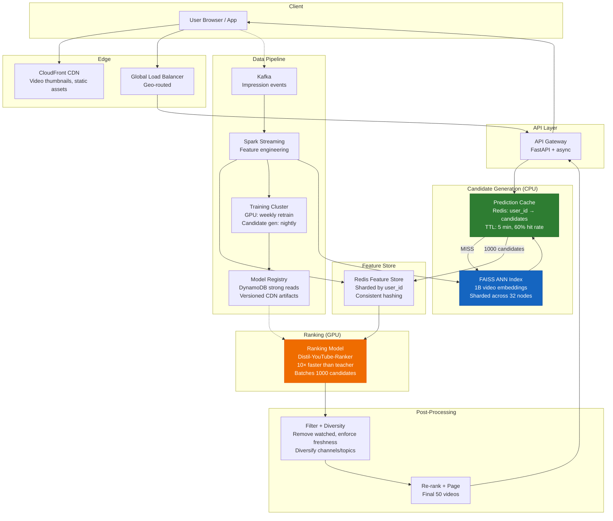
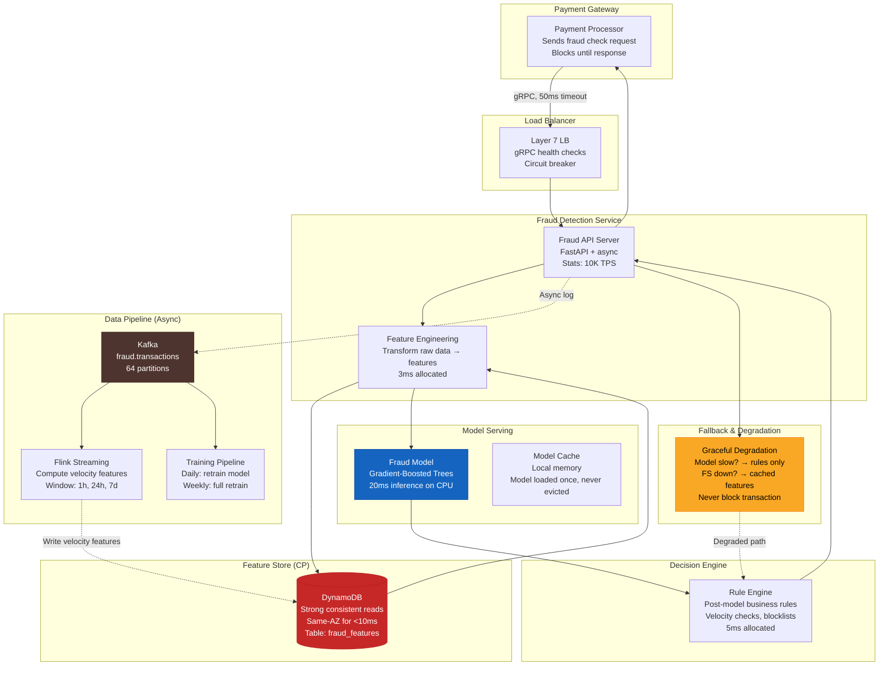

# 🎯 05 - Interview Walkthrough — Design Systems End-to-End

## 🎯 Learning Objectives

- Execute two complete FAANG-style ML system design interviews from requirements gathering through back-of-envelope estimation, API design, data model, architecture diagram, scaling plan, and tradeoffs discussion
- Walk through a YouTube-style video recommendation system serving 500M DAU with <200ms latency — demonstrating two-stage candidate generation (ANN on CPU) + ranking (GPU) to reduce GPU needs 200×
- Walk through a real-time fraud detection system handling 10K tx/s with <50ms SLA and strong consistency (CP) — building a latency budget, implementing graceful degradation, and explaining why CP is non-negotiable
- Demonstrate the interview rhythm: requirements → scale estimation → API → data model → architecture → scaling → tradeoffs — the same pattern FAANG interviewers expect

## Introduction

The system design interview is the capstone of the FAANG+ ML engineer hiring process. You have 45 minutes to design a production ML system from scratch, clarify requirements, estimate scale, sketch an architecture, and defend every tradeoff. This note provides two complete walkthroughs that demonstrate the end-to-end process — the same process you have built competency in across the previous four notes: CAP classification ([[01 - CAP Theorem and Consistency Models in ML Workloads|Note 01]]), caching architectures ([[02 - Caching, CDNs and Storage Architectures for ML|Note 02]]), load balancing and sharding ([[03 - Load Balancing, Sharding and Scaling ML Systems|Note 03]]), and back-of-envelope estimation ([[04 - Back-of-Envelope Estimation - Throughput, Latency, Storage and Cost|Note 04]]).

Each walkthrough follows the interview rhythm that FAANG+ interviewers evaluate:

1. **Requirements** — Clarify functional and non-functional: scale (DAU, RPS), latency SLA, consistency needs, availability targets
2. **Back-of-Envelope** — Derive storage, throughput, GPU count, cost from first principles
3. **API Design** — Define the service interface: endpoints, request/response schemas, protocol (REST/gRPC/streaming)
4. **Data Model** — Feature store schema, database choices, embedding storage, training data organization
5. **Architecture Diagram** — Whiteboard sketch with components, data flow, separation of concerns
6. **Scaling Plan** — Sharding strategy, load balancing algorithm, auto-scaling metrics, CDN usage
7. **Tradeoffs Discussion** — What degrades gracefully, what breaks, what would you change with more time/resources

The word *walkthrough* comes from theater — walking through a scene to understand blocking before performing it. These system design walkthroughs serve the same purpose: you walk through the architecture before building it, catching design errors on the whiteboard rather than in production.

---

## Walkthrough 1: YouTube-Style Video Recommendation System

### 1.1 Requirements Clarification 🎤

*Interviewer*: "Design a video recommendation system like YouTube's homepage. 500 million daily active users. Recommendations should be personalized and appear within 200ms of page load."

**Your first move — clarify, don't design yet:**

- **Functional**: What gets recommended? Videos from subscribed channels? Trending? Personalized feed based on watch history? *Answer: Personalized feed — each user sees a unique set of recommended videos based on their watch history, search history, and engagement patterns.*

- **Non-functional**: 
  - DAU: 500M → How many recommendations per session? *Answer: Each user sees ~50 videos per session, ~3 sessions/day.*
  - Latency SLA: <200ms end-to-end (network + feature fetch + model inference + ranking)
  - Availability: 99.95% (AP — stale recommendations are better than no recommendations)
  - Freshness: New uploads should appear within 10 minutes; user behavior updates within 1 minute
  - Global: Users worldwide, multi-region deployment

### 1.2 Back-of-Envelope Estimation 📐

**Request volume:**

500M DAU × 3 sessions × 50 videos = 75B recommendation calls/day.

$$RPS_{\text{avg}} = \frac{75 \times 10^9}{86400} \approx 868{,}055 \text{ RPS}$$

$$RPS_{\text{peak}} = 868{,}055 \times 2 = 1{,}736{,}110 \approx 1.7M \text{ RPS}$$

That's massive. Each recommendation call returns ~50 ranked videos. Naive approach: 1.7M RPS × one GPU inference per request = 1.7M GPUs. We need architectural cleverness.

**Storage:**

- 500M users × 256-dim embedding (float32) × 4 bytes = 512 GB — fits on one NVMe drive
- Video catalog: assume 1B videos × 256-dim embedding = 1 TB
- User features: 500M × 200 features × 128 bytes = 12.8 TB
- Video features + metadata: 1B × 500 bytes = 500 GB
- Training data: 75B impressions/day × 1KB = 75 TB/day → requires petabyte-scale data lake

**Two-stage architecture justification:**

YouTube uses a two-stage recommendation pipeline for a reason:

1. **Candidate Generation** (CPU, lightweight): From 1B videos → 1000 candidates. Uses ANN (approximate nearest neighbor) + rule-based filters + popularity signals. Performs at ~850K RPS on CPU.
2. **Ranking** (GPU, heavyweight): From 1000 candidates → 50 final ranked videos. Uses a deep neural ranking model. Only needs to run on 1000 candidates, not 1B.

This two-stage design reduces GPU load by 200× (from 1B documents to 1000 candidates per request). At 1.7M peak RPS × 1000 candidates = 1.7B ranking calls/second? No — we batch the ranking step.

Key insight: candidate generation runs on CPU (cheap, abundant) and filters 1B → 1000. Ranking runs on GPU (expensive, scarce) and scores only 1000 candidates. The bottleneck is candidate generation throughput, not ranking.

**GPU estimation for ranking:**

Assume ranking model takes 5ms per candidate on GPU. With 1000 candidates per request:

$$T_{\text{ranking per request}} = 1000 \times 5\text{ms} = 5\text{s}$$

That's too slow. Solution: batch the 1000 candidates into a single GPU forward pass (the ranking model scores all 1000 candidates in one batch). Now:

$$T_{\text{ranking per request}} = 1 \times 50\text{ms} = 50\text{ms}$$

At 1.7M RPS peak: 1.7M × 50ms = 85,000 GPU-seconds per second → need 85,000 GPUs. Still huge. Solution: **caching**.

With a prediction cache (60% hit rate, see [[02 - Caching, CDNs and Storage Architectures for ML|Note 02]]), only 680K RPS hit ranking. At 50ms each: 34,000 GPU-seconds/second → 34,000 GPUs.

With model distillation (teacher → student model, 10× faster): 34,000 / 10 = 3,400 GPUs.

With continuous batching (10× effective throughput): 3,400 / 10 = 340 GPUs.

But this is the pure ranking dimension. The candidate generation step runs on CPU and is much cheaper. Let's include it:

**CPU estimation for candidate generation:**

ANN search over 1B vectors: ~10ms per query on optimized FAISS GPU index. At 1.7M RPS: 17,000 CPU-seconds/second → ~17,000 CPU cores. With 64-core instances: ~266 instances.

### 1.3 API Design 🔌

```python
# ═══ Recommendation API ═══

GET /api/v1/recommendations?user_id={id}&count={n}&page_token={token}

Response:
{
  "videos": [
    {
      "video_id": "v_abc123",
      "title": "System Design for ML in 10 Minutes",
      "channel_name": "ML Engineering",
      "duration_seconds": 634,
      "thumbnail_url": "https://cdn.yt.com/thumb/abc123.jpg",
      "score": 0.942,
      "reason": "Based on your interest in Distributed Systems"
    },
    ...
  ],
  "next_page_token": "CkQzNjR..."
}

# Internal service API (gRPC for performance)
service RecommendationService {
  rpc GetRecommendations(RecommendationRequest)
      returns (RecommendationResponse);
  rpc RecordImpression(ImpressionEvent)
      returns (google.protobuf.Empty);
}
```

### 1.4 Data Model 🗄️

**Feature Store (Online — Redis, sharded by user_id):**

```
Key: feature:user:{user_id}:{feature_name}
TTL: varies by feature freshness tier
```

| Feature | Type | TTL | Example |
|---------|------|-----|---------|
| user_embedding | float32[256] | 24h | [0.12, -0.34, ...] |
| watch_history_7d | string[] | 1h | ["v_001", "v_002"] |
| subscribed_channels | string[] | 24h | ["ch_mleng", "ch_dist"] |
| language_preference | string | 24h | "en" |
| region | string | 24h | "US-WEST" |
| session_active | bool | 60s | true |

**Video Index (FAISS — sharded by video_id hash):**

```
Video ID → embedding (256-dim), metadata, statistics
Sharded across 32 FAISS indices for throughput
```

**Candidate Store (Redis):**

```
Key: candidate:user:{user_id}:session:{session_id}
Value: set of 1000 candidate video IDs (TTL: 5 min)
```

**Training Data (S3 + Feature Store Offline):**

```
s3://ml-training-data/impressions/{YYYY}/{MM}/{DD}/
Format: Parquet, partitioned by date
Schema: user_id, video_id, impression_time, clicked, watched_duration,
        position_in_feed, session_id, user_features, video_features
```

### 1.5 Architecture Diagram 🏗️



### 1.6 Architecture Walkthrough 🚶

**Request flow** (what happens when a user opens YouTube):

1. **User opens app** → `GET /api/v1/recommendations?user_id=123&count=50`
2. **API Gateway** receives request, extracts `user_id`, checks rate limit
3. **Prediction Cache lookup**: `cache.get(user_id=123)` → 60% hit rate, returns pre-computed 1000 candidates with TTL 5 minutes
4. **Cache MISS**: Candidate generation runs — FAISS ANN search over 1B video embeddings using user's embedding as query vector. This is CPU-bound, runs on 32 sharded nodes. Returns 1000 candidate video IDs. Stores in cache for 5 min.
5. **Feature Fetch**: Fetch user features from Redis feature store (sharded by user_id, consistent hashing) — user embedding, watch history, language, region. Fetch video features for all 1000 candidates (batch `MGET`).
6. **Ranking**: GPU ranking model scores all 1000 candidates in one batch forward pass (50ms). Output: 1000 scores.
7. **Filter + Diversity**: Remove already-watched videos, enforce freshness (show some new uploads), diversify across channels/topics (don't show 50 videos from the same channel).
8. **Re-rank + Page**: Apply business rules (promoted content, ads), final sort by score, paginate to 50.
9. **Response** returned to user within 200ms SLA.
10. **Impression logged** to Kafka for training data pipeline.

**Training pipeline** (offline, batch):

- Kafka ingests impression events (video_id, user_id, clicked, watch_duration)
- Spark Streaming computes user and video features (watched_7d, channel_affinity, etc.)
- Weekly: GPU training cluster retrains the ranking model on 7 days of impression data
- Nightly: Candidate generation model updates embeddings for new/trending videos
- Model artifacts pushed to S3 → CDN → serving replicas

### 1.7 Scaling Plan 📈

**Sharding strategy**:

- **User features**: Sharded by `user_id` using consistent hashing across 64 Redis nodes. All features for user X on shard Y. Single `MGET` per user, <1ms latency.
- **Video embeddings (FAISS)**: Sharded by `video_id` hash across 32 FAISS index nodes. Each node holds a partition of 1B/32 ≈ 31M embeddings. ANN search queries all shards in parallel, results merged by coordinator.
- **Prediction cache**: Redis, consistent hashing by `user_id`. Same shard as feature store — enables single Redis pipeline for cache check + feature fetch.

**Load balancing**:

- API layer: standard round-robin (stateless, any replica can serve any request)
- Candidate generation: consistent hashing by `user_id` → FAISS shard → GPU shard. Ensures user's data is co-located.
- Ranking: GPU-aware routing ([[03 - Load Balancing, Sharding and Scaling ML Systems|Note 03]]) — route to GPU with most free VRAM that runs the ranking model.

**Auto-scaling**:

- API servers: CPU-based HPA (they are CPU-bound, not GPU-bound)
- Candidate generation (CPU): scale on queue depth + CPU utilization
- Ranking (GPU): custom-metric HPA on GPU utilization + VRAM usage, NOT CPU

**CDN**:

- Video thumbnails: CloudFront CDN (cache hit 99%+)
- Model artifacts: versioned CDN URLs for deployment
- Static assets: CDN with 1-year TTL

**Multi-region deployment**:

- Deploy full stack in us-east, eu-west, ap-southeast
- Users geo-routed to nearest region
- Video catalog replicated across regions (eventual consistency acceptable — AP)
- User data pinned to home region (no cross-region user data replication for GDPR compliance)

### 1.8 Tradeoffs Discussion 🔄

**CAP profile**: AP. If recommendation features are 5 minutes stale, users still see reasonable videos. The cost of unavailability (blank screen → user closes app) far exceeds the cost of stale recommendations. The training pipeline is CP (snapshot isolation for consistent training data).

**What degrades gracefully**:
- Feature store down → use cached features from Redis (5-min TTL). Recommendation quality degrades slightly but remains functional.
- Ranking model down → fall back to candidate generation scores (no ranking reorder). Users see slightly less relevant recommendations but still get content.
- Candidate generation down → return trending/popular videos (non-personalized fallback). Users see YouTube's default trending page.

**What breaks**:
- Model registry inconsistency (replicas serving different model versions) → different users see different ranking behaviors → A/B test contamination. Fixed by strong consistency (DynamoDB strong reads).
- Feature store shard failure → subset of users get empty recommendations. Mitigated by replica sets (each shard has 3 replicas).

**What you would change with more time**:
- Multi-armed bandit for exploration: allocate 5% of traffic to random recommendations to discover new content and gather training data.
- Real-time features via Flink streaming instead of batch Spark for fresher user behavior features.
- Two-tower model architecture (user tower + item tower) for candidate generation to replace FAISS, enabling end-to-end differentiable training.
- A/B test infrastructure for online experimentation with recommendation algorithms.

---

## Walkthrough 2: Real-Time Fraud Detection System

### 2.1 Requirements Clarification 🎤

*Interviewer*: "Design a real-time fraud detection system for a payment processor. 10,000 transactions per second. Must return a fraud decision within 50ms. 99.9% availability. Fraud missed = financial loss."

**Your first move — clarify:**

- **Functional**: What types of fraud? Credit card fraud, account takeover, promo abuse? *Answer: Credit card transaction fraud — for each payment, return ACCEPT/REJECT/REVIEW with a risk score.*

- **Non-functional**:
  - TPS: 10K transactions/second (peak 15K)
  - Latency SLA: <50ms end-to-end (including network + feature fetch + model inference + decision)
  - Availability: 99.9% — but during partition, reject transactions (CP)
  - Consistency: STRONG — cannot use stale features (stale feature = missed fraud)
  - Uptime: 24/7 — payments never stop
  - Accuracy: Recall > 95% (must catch fraud), precision > 30% (acceptable false positive rate for REVIEW)

### 2.2 Back-of-Envelope Estimation 📐

**Throughput:**

10K TPS × 50ms = 500 concurrent transactions at any moment.

**Latency budget** (must fit within 50ms):

| Component | Allocated | Notes |
|-----------|-----------|-------|
| Network ingress (LB → server) | 2ms | Same-AZ, gRPC |
| Feature fetch (DynamoDB) | 10ms | Strong consistent read |
| Feature transform + preprocess | 3ms | Feature engineering |
| Model inference (GPU) | 20ms | Gradient-boosted trees or small NN |
| Rule engine + decision | 5ms | Post-inference business rules |
| Network egress (server → client) | 2ms | Return decision |
| **Total budget** | **42ms** | 8ms slack for variance |

This budget is tight but feasible. 10ms for DynamoDB strong reads requires the feature store to be in the same AZ as the inference server. 20ms for GPU inference requires a lightweight model (not a 70B LLM — this is tabular fraud detection with gradient-boosted trees or a small neural net).

**GPU estimation:**

A gradient-boosted tree model (XGBoost/LightGBM) runs in <5ms on CPU for tabular fraud features. GPU is optional — many fraud systems run on CPU because the model is not deep learning. But if using a small transformer for sequence features:

At 10K TPS × 20ms per inference = 200,000 ms/s = 200 seconds of compute per second → need 200 CPU cores or ~4 GPU equivalents.

**Storage:**

- Feature store: user profiles (purchase velocity, device fingerprints, IP geolocation) for 500M users × 50 features × 128 bytes = 3.2 TB
- Transaction log: 10K TPS × 1KB = 10 MB/s → 864 GB/day → 26 TB/month → store in S3, query via Athena
- Model artifacts: <1 GB (gradient-boosted trees are small)

### 2.3 CAP Analysis 🔺

**This is a CP system.** During a network partition, a fraud detection system must reject transactions rather than risk approving fraudulent ones. The cost asymmetry is extreme:

$$\text{Cost}(CP) = P(\text{partition}) \times \text{lost\_revenue\_per\_rejected\_txn}$$

$$\text{Cost}(AP) = P(\text{partition}) \times P(\text{fraud}) \times \text{chargeback\_cost}$$

With chargeback costs at $50-500 per transaction and fraud rates at 0.1-1%, AP is 100-1000× more expensive than CP during partitions.

**Component CAP classification** (see [[01 - CAP Theorem and Consistency Models in ML Workloads|Note 01]] for full matrix):

| Component | CAP Mode | Storage | Justification |
|-----------|----------|---------|---------------|
| Online feature store | CP | DynamoDB (strong reads) | Stale features = missed fraud |
| Model registry | CP | DynamoDB (strong reads) | Wrong model version = false approvals |
| Transaction log | CP | Kafka + S3 | Immutable audit trail |
| Training data | CP | S3 (snapshot isolation) | Consistent training snapshots |
| Rule engine config | CP | DynamoDB | Wrong rules = systematic fraud |
| A/B experiment config | CP | DynamoDB | Experiment integrity |
| Monitoring dashboards | AP | Redis | Stale dashboards acceptable |

### 2.4 API Design 🔌

```python
# ═══ Fraud Detection API ═══

# Synchronous (blocking) — must return in <50ms
POST /api/v1/fraud/check
Request:
{
  "transaction_id": "txn_20240529_abc123",
  "merchant_id": "merchant_456",
  "user_id": "user_789",
  "amount_cents": 14999,
  "currency": "USD",
  "card_last4": "4242",
  "card_bin": "424242",
  "ip_address": "203.0.113.42",
  "device_fingerprint": "fp_abc123def456",
  "billing_address": {
    "country": "US",
    "postal_code": "94105"
  },
  "shipping_address": {...},
  "timestamp_ms": 1717000000000
}

Response:
{
  "transaction_id": "txn_20240529_abc123",
  "decision": "ACCEPT",  // ACCEPT | REJECT | REVIEW
  "risk_score": 0.03,    // 0.0 (safe) to 1.0 (fraud)
  "decision_time_ms": 28,
  "model_version": "fraud_v4.2.1",
  "rules_triggered": ["velocity_check_ok", "amount_in_range"],
  "review_reason": null  // Populated for REVIEW decisions
}
```

### 2.5 Data Model 🗄️

**Online Feature Store (DynamoDB, strong consistent reads):**

```
Table: fraud_features
Primary Key: user_id (HASH)
GSI: device_fingerprint (HASH) — for device-level features
GSI: card_bin (HASH) — for card-level velocity checks

Attributes:
  user_purchase_velocity_1h: 3            # transactions in last hour
  user_purchase_velocity_24h: 12          # transactions in last day
  user_avg_transaction_amount_7d: 45.50   # 7-day average
  user_distinct_merchants_24h: 4          # distinct merchants today
  user_distinct_cards_7d: 2              # distinct cards used
  user_country: "US"
  user_account_age_days: 890
  device_risk_score: 0.15                # from 3rd party service
  device_seen_before: true
  device_distinct_users_7d: 1            # how many users on this device
  card_velocity_1h: 2                    # transactions on this card
  card_distinct_users_7d: 1
  ip_geolocation_risk: 0.05
  ip_is_proxy: false
  ip_is_tor: false
  billing_shipping_match: true
  last_updated_at: 1717000000000

Read consistency: STRONG (ConsistentRead=True)
```

**Transaction Log (Kafka + S3):**

```
Kafka topic: fraud.transactions
Partitions: 64 (keyed by user_id for ordering)
Retention: 7 days in Kafka, permanent in S3

Schema (Avro):
  transaction_id: string
  user_id: string
  merchant_id: string
  amount_cents: int
  currency: string
  decision: string
  risk_score: float
  model_version: string
  features_snapshot: map<string, float>
  timestamp_ms: long
```

### 2.6 Architecture Diagram 🏗️



### 2.7 Architecture Walkthrough 🚶

**Request flow** (a payment arrives):

1. **Payment processor** sends `POST /api/v1/fraud/check` with transaction details. Blocks until response (50ms timeout). If timeout, auto-REJECT (CP — safer to reject than approve blindly).

2. **API server** receives request, validates schema, extracts user_id, device_fingerprint.

3. **Feature Engineering** transforms raw input into model features:
   - Transaction features: amount, currency, billing-shipping match, time-of-day
   - These are lightweight (3ms) — no external calls

4. **Feature Store Fetch** (DynamoDB, strong consistent read): Fetches user velocity features, device risk score, card velocity, IP geolocation. Single `GetItem` on `user_id` primary key — <10ms latency.

5. **Model Inference**: Gradient-boosted tree model loaded in process memory scores the feature vector. 20ms for a tree ensemble with ~500 trees.

6. **Rule Engine**: Applies deterministic business rules on top of model score:
   - Amount > $10,000 and risk > 0.1 → REVIEW
   - User on blocklist → REJECT
   - IP from sanctioned country → REJECT
   - Merchant on watchlist and risk > 0.2 → REVIEW
   - 3+ distinct cards in 1h → REVIEW (card testing pattern)

7. **Decision** returned: ACCEPT / REJECT / REVIEW with risk score.

8. **Async** (non-blocking): Transaction logged to Kafka for feature computation and model training.

**Graceful degradation** (what happens when things fail):

- **Feature store slow (>10ms) or down**: Use cached features from local in-memory cache (60s TTL). Features are up to 60s stale — velocity checks may miss the last minute of activity. Tradeoff: slightly higher fraud risk vs blocking all transactions. Decision: fall back to rules-only model with cached features (CP degrades to AP temporarily).

- **Model inference slow (>20ms)**: If P50 latency exceeds 30ms, fall back to rule-engine-only decision. Business rules (blocklists, velocity thresholds, amount checks) catch 70% of fraud without the ML model. The model adds the remaining 25% detection. Fallback still catches most fraud.

- **Model inference down (error/crash)**: Fall back to rules-only immediately. Serving stale/incomplete decisions is CP — but blocking all payments is catastrophic. The rules catch enough fraud to operate safely.

- **Kafka down**: Buffer transaction logs locally (memory, 5-min buffer). If Kafka recovers within 5 minutes, no data loss. If longer, accept data loss for audit trail (not for fraud decisions — those were already made).

**Never block transactions.** The golden rule of fraud system design: it is always better to process a transaction with a weaker fraud check than to block the transaction entirely. False positives (REJECT on legitimate transaction) are bad for business; false negatives (ACCEPT on fraud) lose money. But system downtime (no transactions) loses all revenue.

### 2.8 Feature Freshness Pipeline 🔄

Fraud detection requires real-time velocity features that reflect the last few minutes of user activity. A user making 10 transactions in 10 minutes is suspicious; a batch pipeline computing features hourly would miss this pattern entirely.

**Flink streaming pipeline for velocity features:**

```
Raw transactions (Kafka) → Flink → Aggregated features → DynamoDB
```

- **1-hour window**: `user_purchase_velocity_1h` — COUNT of transactions in last hour, sliding window, updates every 10 seconds
- **24-hour window**: `user_purchase_velocity_24h` — tumbling window, updates every 5 minutes
- **Card velocity**: `card_velocity_1h` — COUNT of transactions on this card in last hour
- **Device velocity**: `device_distinct_users_7d` — COUNT DISTINCT users on this device fingerprint

These features are written to DynamoDB with strong consistency. The inference path reads them with `ConsistentRead=True`, ensuring the fraud model sees the latest velocity counters.

**Training/serving skew prevention** (see [[01 - CAP Theorem and Consistency Models in ML Workloads|Note 01 — write-order trick]]):

- **Write to online store (DynamoDB) first**, then to offline store (S3 for training).
- This guarantees $\Delta = V_{\text{offline}} - V_{\text{online}} \leq 0$ — serving features are always at least as fresh as training features.
- The model never trains on data patterns that don't exist yet at serving time.

### 2.9 Scaling Plan 📈

**Sharding**:

- Feature store (DynamoDB) shards automatically by primary key — no manual sharding needed.
- Kafka topic partitioned by `user_id` (64 partitions) ensures all transactions for a user are processed in order by Flink.
- Inference servers are stateless (except for model weights in memory) — any server handles any request.

**Load balancing**:

- Layer 7 load balancer with gRPC health checks.
- Health check: `/healthz` returns 200 if model loaded, feature store reachable, latency < 40ms.
- Circuit breaker: if > 50% of requests to a backend time out in 30s, mark unhealthy.

**Auto-scaling**:

- Scale on request latency P99 and TPS, NOT CPU (CPU is always low for fast inference).
- Min replicas: 10 (to handle base load with headroom)
- Max replicas: 50 (cost cap)
- Scale-up trigger: P99 latency > 30ms for 30 seconds

**Multi-region**:

- Deploy in 3 regions for HA (us-east, eu-west, ap-southeast).
- Payment processors route to nearest region.
- Feature store: each region has its own DynamoDB table (global tables with strong consistency are not available — DynamoDB global tables are eventually consistent).
- Instead: user data is pinned to a home region. Cross-region requests are proxied to the home region. This adds cross-region latency (50ms) but preserves strong consistency.
- Alternative for lower latency: use DynamoDB transactional writes + global tables with last-writer-wins conflict resolution. Accept that during a rare cross-region race condition, the most recent write wins — a bounded inconsistency window acceptable for velocity counters (off by 1 is tolerable).

### 2.10 Tradeoffs Discussion 🔄

**CAP profile**: CP at every layer. Fraud detection is the canonical CP ML workload. The cost asymmetry is 100-1000× in favor of rejecting transactions during partitions. See [[01 - CAP Theorem and Consistency Models in ML Workloads|Note 01]] for the full CAP matrix.

**Model complexity tradeoff**:

- *Gradient-boosted trees* (current design): 5-10ms inference on CPU, good performance on tabular data, explainable (feature importance), no GPU needed. Best for the 20ms inference budget.
- *Small neural net*: 10-15ms on GPU, slightly better accuracy on complex feature interactions, less explainable. Marginal gain for 5-10ms additional latency.
- *Large transformer*: 50-200ms on GPU, best accuracy for sequence features (transaction history as a sequence). Cannot fit within 50ms SLA — only viable for async/post-transaction review, not real-time screening.

**What degrades gracefully**:
- Model down → rules-only fallback (catches 70% of fraud)
- Feature store slow → cached features (up to 60s stale, catches 85% of fraud)
- Kafka down → buffered logs (no data loss for 5 min)
- Rule engine down → model-only decision (catches 95% of fraud, but misses deterministic patterns)

**What breaks**:
- Feature store returning wrong user's features (data corruption) → model sees wrong features → wrong decisions → either fraud missed or legitimate txns rejected. Mitigated by checksums and user_id verification.
- Model serving old version (model registry inconsistency) → systematically wrong risk scores. Mitigated by strong consistency in model registry.
- Entire region down → cross-region failover. Latency increases from 50ms to 150ms, but the system continues. Transactions are never dropped.

**¡Sorpresa!** The most impactful design decision in fraud systems is not the model architecture — it's the feature store consistency and the grace of degradation. A perfect model with stale features is worse than a simple model with fresh features. And a system that blocks payments during a model outage is worse than one that falls back to rules. Senior fraud system designers spend 80% of their time on feature freshness and degradation paths, and 20% on the model itself.

---

## 📦 Código de Compresión — Interview Checklist

```python
"""
interview_checklist.py — The 7-step ML system design interview checklist.
Reference this during mock interviews to stay on track.
"""

from dataclasses import dataclass, field
from typing import Optional
from enum import Enum


class CapMode(Enum):
    CP = "Consistent during Partition — reject requests"
    AP = "Available during Partition — serve stale data"


@dataclass
class SystemDesign:
    """
    Complete system design template. Fill this out during the interview.

    Time budget (45 min):
    - Requirements:    5 min
    - Back-of-envelope: 5 min
    - API Design:       5 min
    - Data Model:       5 min
    - Architecture:    10 min (diagram + walkthrough)
    - Scaling Plan:     8 min
    - Tradeoffs:        7 min
    """

    name: str
    cap_mode: CapMode
    latency_sla_ms: float
    peak_rps: float

    # ═══ 1. Requirements (5 min) ═══
    functional_reqs: list[str] = field(default_factory=list)
    non_functional_reqs: list[str] = field(default_factory=list)
    scale: str = ""  # "500M DAU, 1.7M RPS"

    # ═══ 2. Back-of-Envelope (5 min) ═══
    storage_tb: float = 0.0
    gpu_count: int = 0
    cost_monthly: float = 0.0
    latency_budget: dict[str, float] = field(default_factory=dict)

    # ═══ 3. API Design (5 min) ═══
    endpoints: list[str] = field(default_factory=list)
    protocol: str = "REST/gRPC"

    # ═══ 4. Data Model (5 min) ═══
    stores: list[str] = field(default_factory=list)
    feature_schema: list[str] = field(default_factory=list)

    # ═══ 5. Architecture (10 min) ═══
    components: list[str] = field(default_factory=list)
    data_flow: str = ""

    # ═══ 6. Scaling Plan (8 min) ═══
    sharding_key: str = ""
    load_balancing: str = ""
    auto_scaling_metric: str = ""
    regions: int = 1

    # ═══ 7. Tradeoffs (7 min) ═══
    graceful_degradation: list[str] = field(default_factory=list)
    break_points: list[str] = field(default_factory=list)
    with_more_time: list[str] = field(default_factory=list)


def interview_script(sd: SystemDesign) -> str:
    """Generate the interview talking points for this system design."""
    return f"""
═══════════════════════════════════════════════════════════════
  {sd.name} — ML System Design Interview Script
═══════════════════════════════════════════════════════════════

1. REQUIREMENTS (say aloud):
   "Let me clarify requirements before designing."
   Scale: {sd.scale}
   SLA: {sd.latency_sla_ms}ms, {sd.cap_mode.value}
   Functional: {', '.join(sd.functional_reqs[:3])}
   Non-functional: {', '.join(sd.non_functional_reqs[:3])}

2. BACK-OF-ENVELOPE (write on board):
   "Let me estimate the scale."
   Storage: {sd.storage_tb} TB
   GPUs needed: {sd.gpu_count}
   Monthly cost: ${sd.cost_monthly:,.0f}
   Latency budget: {sd.latency_budget}

3. API DESIGN:
   "Here's the API surface."
   Protocol: {sd.protocol}
   Endpoints: {', '.join(sd.endpoints)}

4. DATA MODEL:
   "The data lives in these stores."
   Stores: {', '.join(sd.stores)}
   Key features: {', '.join(sd.feature_schema[:5])}

5. ARCHITECTURE (draw diagram):
   "The request flows through these components."
   Components: {', '.join(sd.components)}
   Data flow: {sd.data_flow}

6. SCALING PLAN:
   "To handle {sd.peak_rps} RPS, we shard by {sd.sharding_key}."
   Load balancing: {sd.load_balancing}
   Auto-scaling on: {sd.auto_scaling_metric}
   Regions: {sd.regions}

7. TRADEOFFS:
   "Here's what degrades gracefully."
   Degradation: {', '.join(sd.graceful_degradation[:3])}
   Break points: {', '.join(sd.break_points[:3])}
   With more time: {', '.join(sd.with_more_time[:3])}
"""


# ═══ Example: Fill out for YouTube recsys ═══

youtube_recsys = SystemDesign(
    name="YouTube-Style Video Recommendation",
    cap_mode=CapMode.AP,
    latency_sla_ms=200.0,
    peak_rps=1_736_000,
    scale="500M DAU, 75B recs/day, 1.7M peak RPS",
    functional_reqs=[
        "Personalized video feed",
        "50 videos per page",
        "Real-time impression logging",
    ],
    non_functional_reqs=[
        "P99 < 200ms",
        "99.95% availability",
        "Multi-region, global users",
    ],
    storage_tb=750.0,
    gpu_count=340,
    cost_monthly=850_000,
    latency_budget={
        "network": 5, "cache": 2, "candidate_gen": 30,
        "feature_fetch": 10, "ranking": 50, "filter": 5,
        "network_egress": 5,
    },
    endpoints=["GET /recommendations", "POST /impressions"],
    protocol="REST + gRPC internal",
    stores=["Redis (features)", "FAISS (embeddings)", "S3 (training data)", "DynamoDB (model registry)"],
    feature_schema=[
        "user_embedding", "watch_history_7d",
        "subscribed_channels", "language_preference", "region",
    ],
    components=[
        "CDN", "API Gateway", "Prediction Cache", "FAISS ANN",
        "Feature Store", "Ranking Model GPU", "Filter + Diversity",
        "Kafka", "Spark Streaming", "Training Cluster",
    ],
    data_flow="User → CDN → API → Cache → FAISS → Features → GPU Rank → Filter → Response",
    sharding_key="user_id (consistent hashing)",
    load_balancing="Consistent hashing for user→GPU affinity, round-robin for API",
    auto_scaling_metric="GPU utilization + queue depth (not CPU)",
    regions=3,
    graceful_degradation=[
        "Ranking model down → candidate gen scores only",
        "Feature store down → cached features (5-min TTL)",
        "Candidate gen down → trending/popular fallback",
    ],
    break_points=[
        "Model registry inconsistency → A/B test contamination",
        "Feature shard failure → empty recommendations for subset",
    ],
    with_more_time=[
        "Multi-armed bandit exploration",
        "Real-time features via Flink",
        "Two-tower model for end-to-end training",
    ],
)

print(interview_script(youtube_recsys))


# ═══ Example: Fill out for Fraud Detection ═══

fraud_detection = SystemDesign(
    name="Real-Time Fraud Detection",
    cap_mode=CapMode.CP,
    latency_sla_ms=50.0,
    peak_rps=15_000,
    scale="10K TPS (15K peak), <50ms per transaction",
    functional_reqs=[
        "ACCEPT/REJECT/REVIEW decision",
        "Risk score 0-1",
        "Velocity features in real-time",
    ],
    non_functional_reqs=[
        "P99 < 50ms",
        "99.9% availability (CP during partition)",
        "Strong consistency for features",
    ],
    storage_tb=3.2,
    gpu_count=0,
    cost_monthly=15_000,
    latency_budget={
        "network_in": 2, "feature_fetch": 10,
        "feature_transform": 3, "model_inference": 20,
        "rule_engine": 5, "network_out": 2,
    },
    endpoints=["POST /fraud/check"],
    protocol="gRPC (sync, blocking, 50ms timeout)",
    stores=["DynamoDB (features, CP)", "Kafka (txn log)", "S3 (training data, CP)"],
    feature_schema=[
        "purchase_velocity_1h", "purchase_velocity_24h",
        "avg_txn_amount_7d", "distinct_cards_7d",
        "device_risk_score", "ip_geolocation_risk",
    ],
    components=[
        "Payment Gateway", "Layer 7 LB", "Fraud API Server",
        "Feature Engineering", "DynamoDB Feature Store",
        "Model Inference (CPU)", "Rule Engine", "Kafka",
        "Flink Streaming", "Training Pipeline",
    ],
    data_flow="Payment → API → Feature Transform → DynamoDB → Model → Rules → Decision → Response",
    sharding_key="DynamoDB auto-shard by user_id primary key",
    load_balancing="gRPC health checks + circuit breaker",
    auto_scaling_metric="P99 latency and TPS",
    regions=3,
    graceful_degradation=[
        "Model slow → rules-only fallback",
        "Feature store down → cached features",
        "Kafka down → buffered logs",
    ],
    break_points=[
        "Feature store corruption → wrong decisions",
        "Model registry inconsistency → wrong risk scores",
    ],
    with_more_time=[
        "Graph neural net for transaction network",
        "Sequence transformer for session fraud",
        "Real-time model updates via online learning",
    ],
)

print(interview_script(fraud_detection))
```

---

## References

- Huyen, C. (2022). *Designing Machine Learning Systems*. O'Reilly. Chapters 7-9.
- Kleppmann, M. (2017). *Designing Data-Intensive Applications*. O'Reilly. Chapters 5, 6, 9.
- Donnemartin. (2024). *System Design Primer*. https://github.com/donnemartin/system-design-primer
- YouTube Engineering. (2016). "Deep Neural Networks for YouTube Recommendations." *ACM RecSys*. https://research.google/pubs/pub45530/
- Stripe Engineering. (2023). "Radar: How Stripe's ML detects fraud." https://stripe.com/radar
- DoorDash Engineering. (2023). "Building DoorDash's ML Platform — Feature Store Design." https://doordash.engineering/
- [[01 - CAP Theorem and Consistency Models in ML Workloads|CAP Theorem]]
- [[02 - Caching, CDNs and Storage Architectures for ML|Caching for ML]]
- [[03 - Load Balancing, Sharding and Scaling ML Systems|Load Balancing]]
- [[04 - Back-of-Envelope Estimation - Throughput, Latency, Storage and Cost|Back-of-Envelope]]
