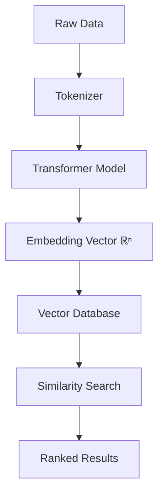
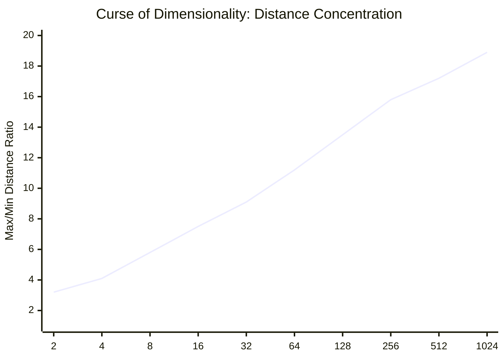
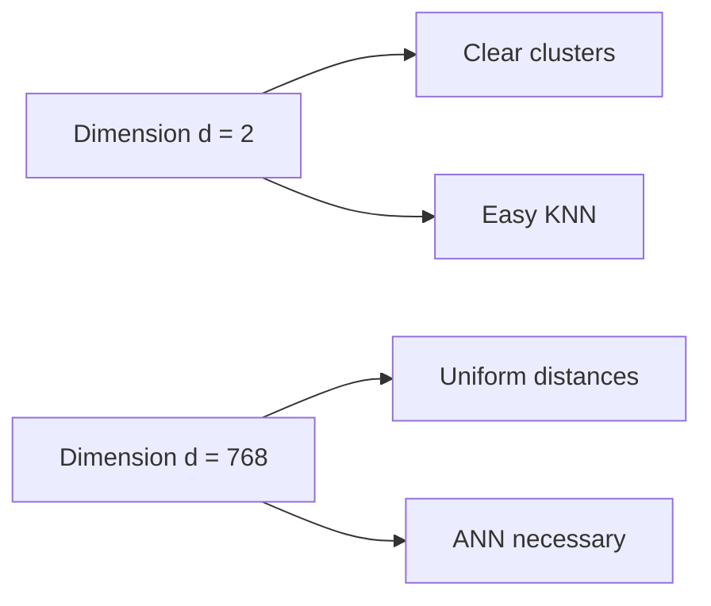

# 🔍 Vector Search Fundamentals

## 🎯 Learning Objectives

- Master the concept of dense vector embeddings and their geometric interpretation
- Compare and contrast Euclidean, Cosine, Dot Product, and Manhattan distance metrics
- Understand the trade-off between exact KNN and approximate ANN search
- Explain the curse of dimensionality and its impact on nearest-neighbor queries
- Map vector search use cases to ML pipelines: semantic search, recommendation, anomaly detection
- Evaluate embedding quality through distance distribution analysis

- Master the concept of dense vector embeddings and their geometric interpretation
- Compare and contrast Euclidean, Cosine, Dot Product, and Manhattan distance metrics
- Understand the trade-off between exact KNN and approximate ANN search
- Explain the curse of dimensionality and its impact on nearest-neighbor queries
- Map vector search use cases to ML pipelines: semantic search, recommendation, anomaly detection

## Introduction

Modern AI systems do not search by keywords; they search by **meaning**. When a user asks "What is the best way to relax after work?" a traditional inverted index fails because the word "relax" may not appear in relevant documents. Vector databases solve this by translating text, images, or audio into high-dimensional dense vectors — embeddings — where semantic similarity becomes geometric proximity.

This note establishes the mathematical and conceptual bedrock for the entire course. Every indexing algorithm, database extension, and deployment pattern we will study is an optimization of a single primitive: **given a query vector, find its nearest neighbors in a large collection**. Understanding *why* this is hard, and *how* distance metrics encode different notions of similarity, is essential before we touch any database syntax.

This module connects directly to [[22 - NLP and Transformers]] (where embeddings are produced) and [[06 - Large Language Models]] (where vector search powers Retrieval-Augmented Generation). We will also reference concepts from [[03 - Mathematics for ML]] when discussing norms and high-dimensional geometry.

---

## Module 1: Embeddings and Vector Spaces

### 1.1 Theoretical Foundation 🧠

The idea of representing discrete objects as continuous vectors is not new. In 2013, word2vec demonstrated that neural networks could learn vector spaces where analogies like *king - man + woman ≈ queen* held geometrically. The breakthrough of transformers (BERT, GPT) was scaling this from words to sentences, paragraphs, and multimodal objects.

An embedding is a learned function f: X → ℝⁿ that maps an object (text, image, audio) into an n-dimensional space such that **semantically similar objects are mapped to nearby points**. The "nearness" is defined by a distance metric. The dimensionality n typically ranges from 384 (small sentence transformers) to 1536 (OpenAI `text-embedding-3-large`) or even 2048+ for vision models.

Why high dimensions? Because natural language is combinatorially explosive. A 768-dimensional space can partition the semantic manifold with enough granularity to distinguish subtle meanings. However, as we will see, high dimensionality is also the root cause of the computational challenge in vector search.

### 1.2 Mental Model 📐

```
┌─────────────────────────────────────────────┐
│  Semantic Space (3D projection)             │
│                                             │
│       ☁️ "cloud computing"                  │
│      /                                      │
│     /  📊 "data analytics"                  │
│    /  /                                     │
│   🐕 "dog" ──── 🐩 "poodle"                 │
│   /                                           │
│  🐈 "cat"                                     │
│                                             │
│  Distance = semantic dissimilarity          │
└─────────────────────────────────────────────┘

┌─────────────────────────────────────────────┐
│  Embedding Pipeline                         │
│                                             │
│  Raw Text ──► Tokenizer ──► Transformer ──► │
│      │            │              │          │
│      │            │              ▼          │
│      │            │         [CLS] Vector    │
│      │            │              │          │
│      │            │              ▼          │
│      │            │      Normalize ──►     │
│      │            │      ℝⁿ (unit sphere)   │
│      ▼            ▼                         │
│   "The cat    [101, 2023,    Neural Net    │
│    sleeps"    3594, 3133]                  │
└─────────────────────────────────────────────┘

┌─────────────────────────────────────────────┐
│  Query vs. Collection Geometry              │
│                                             │
│     Query q ●                               │
│            /│\                              │
│           / │ \  Radius r                   │
│          /  │  \                            │
│    Neighbors: ● ● ●   (inside ball)         │
│               ●                             │
│    Non-neighbors: ○ ○  (outside ball)       │
│                                             │
│  KNN: find K closest points exactly         │
│  ANN: find K close points approximately     │
└─────────────────────────────────────────────┘
```

### 1.3 Syntax and Semantics 📝

```python
import numpy as np
from numpy.linalg import norm

# WHY: We use float32 because embeddings are typically stored in 32-bit
#      to balance precision with memory. Double precision is wasteful.
query = np.array([0.1, -0.3, 0.8, 0.02], dtype=np.float32)
collection = np.array([
    [0.2, -0.1, 0.9, 0.05],   # likely similar to query
    [-0.5, 0.8, 0.1, -0.3],  # likely dissimilar
    [0.15, -0.25, 0.85, 0.0] # likely similar to query
], dtype=np.float32)

# Euclidean (L2) distance: straight-line distance in space.
# WHY: Good when absolute magnitudes matter (e.g., image pixel embeddings).
#      Lower is more similar.
def euclidean(a, b):
    return norm(a - b)

# Cosine similarity: dot product of unit vectors.
# WHY: Ignores magnitude; captures pure orientation.
#      Essential for text embeddings where document length varies.
def cosine_similarity(a, b):
    return np.dot(a, b) / (norm(a) * norm(b))

# Dot product: raw inner product.
# WHY: Fastest to compute; equivalent to cosine when vectors are normalized.
#      Used in OpenAI embeddings where vectors are pre-normalized.
def dot_product(a, b):
    return np.dot(a, b)

# Manhattan (L1) distance: sum of absolute differences.
# WHY: Robust to outliers; useful in sparse or high-noise domains.
def manhattan(a, b):
    return np.sum(np.abs(a - b))

# Brute-force KNN: compute ALL distances, then sort.
# WHY: This is the exact baseline. Every index is an approximation of this.
distances = [euclidean(query, vec) for vec in collection]
k = 2
nearest_indices = np.argsort(distances)[:k]
print(f"Nearest neighbors (exact KNN): {nearest_indices}")
```

### 1.4 Visual Representation 🖼️






### 1.5 Application in ML/AI Systems 🤖

Real case: **Spotify** uses vector search to power its "Discover Weekly" feature. Audio tracks are embedded into 768-dimensional vectors using convolutional neural networks. When you like a song, Spotify performs an approximate nearest neighbor search to find tracks with similar acoustic fingerprints, not just similar metadata tags.

| ML Use Case | This Concept | Impact |
|-------------|-------------|--------|
| Semantic Search | Cosine similarity on sentence embeddings | Find documents by meaning, not keyword overlap |
| Recommendation | ANN on user/item embeddings | Real-time "more like this" at scale |
| Anomaly Detection | L2 distance from centroid vectors | Flag outliers in log or sensor embeddings |
| RAG for LLMs | Hybrid vector + keyword retrieval | Ground LLM answers in private document stores |
| Deduplication | Thresholded cosine similarity | Remove near-duplicate content in pipelines |

### 1.6 Common Pitfalls ⚠️

⚠️ **Pitfall: Using Euclidean distance on unnormalized text embeddings.** Root cause: Text embeddings from sentence-transformers are optimized for cosine space. L2 will over-penalize longer documents because their vectors have larger magnitudes. Always normalize text embeddings before using dot product or cosine, and prefer cosine when in doubt.

💡 **Mnemonic: "Text? Cosine. Images? L2."** — Text semantics are directional (orientation on the unit sphere); image features often carry intensity information where magnitude matters.

### 1.7 Knowledge Check ❓

1. Given two unit vectors, prove that minimizing Euclidean distance is equivalent to maximizing cosine similarity. What algebraic identity connects them?
2. You have a collection of 10 million 768-dimensional vectors. A brute-force KNN query takes 120 seconds. If you need <50ms latency, what class of algorithm must you use, and what do you sacrifice?
3. Why does the ratio of maximum to minimum pairwise distance converge toward 1 as dimensionality increases? What does this imply for threshold-based outlier detection?

---

## Module 2: ANN vs. Exact KNN and the Curse of Dimensionality

### 2.1 Theoretical Foundation 🧠

Exact K-Nearest Neighbor (KNN) search has O(N × d) time complexity per query for N vectors of dimension d. For small N (thousands), this is fine. But in production ML systems, N is millions or billions. A single brute-force scan over 100M vectors in 768D requires ~76 billion floating-point operations — far too slow for interactive applications.

Approximate Nearest Neighbor (ANN) search accepts a trade-off: **sacrifice a small amount of recall (missing a few true nearest neighbors) in exchange for orders-of-magnitude speedup**. ANN algorithms build data structures (indices) that partition the vector space or compress the vectors so that only a small subset must be examined.

The mathematical justification for approximation comes from the **curse of dimensionality**. In high-dimensional spaces, the contrast between near and far points vanishes: distances become uniformly distributed. This makes exact distance computation less meaningful and makes approximate methods surprisingly effective, since "close enough" is often indistinguishable from "exactly closest" in terms of downstream task performance.

### 2.2 Mental Model 📐

```
┌─────────────────────────────────────────────┐
│  Exact KNN: Linear Scan                     │
│                                             │
│  Query ● ──► Compute distance to ALL N      │
│              vectors (O(N))                 │
│              Sort and take top K            │
│                                             │
│  Latency grows LINEARLY with collection size│
└─────────────────────────────────────────────┘

┌─────────────────────────────────────────────┐
│  ANN: Pruned Search                         │
│                                             │
│  Query ● ──► Visit small candidate set C    │
│              (C << N) via index structure   │
│              Compute exact distances on C     │
│              Return approximate top K         │
│                                             │
│  Latency grows SUBLINEARLY with N           │
└─────────────────────────────────────────────┘

┌─────────────────────────────────────────────┐
│  Curse of Dimensionality Intuition          │
│                                             │
│  2D: Volume of cube = 1, sphere = π/4       │
│      Sphere fills ~78% of cube              │
│                                             │
│  100D: Volume of cube = 1, sphere ≈ 0       │
│      Sphere is a vanishing fraction!        │
│      All points end up in the CORNERS       │
│      → Distances become uniform             │
└─────────────────────────────────────────────┘
```

### 2.3 Syntax and Semantics 📝

```python
import numpy as np
import time

# WHY: We simulate a realistic embedding collection to benchmark ANN vs KNN.
np.random.seed(42)
N = 500_000          # collection size (half a million)
d = 768              # embedding dimension (standard for BERT-like models)
query = np.random.randn(d).astype(np.float32)
query /= np.linalg.norm(query)  # normalize like real text embeddings

# Generate random collection. In reality these are model outputs.
collection = np.random.randn(N, d).astype(np.float32)
collection /= np.linalg.norm(collection, axis=1, keepdims=True)

# Exact KNN: full scan. Inefficient but 100% recall.
start = time.time()
# WHY: matrix-vector multiplication is faster than Python loop; BLAS optimized.
scores = collection @ query  # dot product on normalized vectors = cosine similarity
top_k_exact = np.argsort(-scores)[:10]  # negative for descending
exact_time = time.time() - start

print(f"Exact KNN time: {exact_time:.3f}s")
print(f"Top exact indices: {top_k_exact[:5]}")

# ANN simulation: random subsampling (crude, but illustrates the idea).
# WHY: Real ANN uses smarter sampling (HNSW, IVF). This is just for demo.
sample_size = 5_000  # examine only 1% of data
start = time.time()
sample_idx = np.random.choice(N, sample_size, replace=False)
sample_scores = collection[sample_idx] @ query
top_k_ann = sample_idx[np.argsort(-sample_scores)[:10]]
ann_time = time.time() - start

# Measure recall: what fraction of true top-10 are in ANN top-10?
recall = len(set(top_k_exact) & set(top_k_ann)) / 10.0
print(f"ANN time: {ann_time:.3f}s | Recall@10: {recall:.1f}")
```

### 2.4 Visual Representation 🖼️

```mermaid
flowchart LR
    subgraph Exact["Exact KNN"]
        E1[Query] --> E2[Scan all N vectors]
        E2 --> E3[Exact distances]
        E3 --> E4[Sort O(N log N)]
        E4 --> E5[Top K]
    end

    subgraph ANN["Approximate ANN"]
        A1[Query] --> A2[Index lookup]
        A2 --> A3[Candidate set C]
        A3 --> A4[Exact distances on C]
        A4 --> A5[Approximate Top K]
    end
```




### 2.5 Application in ML/AI Systems 🤖

Real case: **Pinterest** built a visual search system where users upload photos to find similar pins. They index billions of image embeddings using ANN. Exact KNN was impossible at their scale; ANN with 95%+ recall allowed sub-100ms visual search across the entire catalog. Their engineering team emphasizes that the choice of distance metric (cosine for style similarity, L2 for color composition) is as important as the index algorithm itself.

| ML Use Case | This Concept | Impact |
|-------------|-------------|--------|
| Semantic Search | ANN on text embeddings | Serve relevant docs in <50ms at billion scale |
| Real-time Recommendations | ANN user embedding lookup | Personalize feeds without batch recomputation |
| Biometric Search | ANN on face embeddings | Border control and device unlock with near-instant matching |
| Drug Discovery | ANN on molecular embeddings | Screen billions of compounds for similarity to known drugs |

### 2.6 Common Pitfalls ⚠️

⚠️ **Pitfall: Assuming ANN recall is always >95% without benchmarking on YOUR data.** Root cause: ANN performance is data-dependent. Highly clustered data may suffer from boundary effects where true neighbors fall into different index partitions. Always measure recall@k on a held-out query set before deploying.

💡 **Mnemonic: "ANN is fast, but verify recall first."** — Build a recall test harness as your first integration step, not your last.

### 2.7 Knowledge Check ❓

1. If your vector dimensionality is only 16 and your collection size is 50,000, should you use ANN or exact KNN? Justify with complexity and accuracy arguments.
2. Explain why the "curse of dimensionality" actually *helps* justify ANN methods rather than making them impossible.
3. A stakeholder demands 100% recall on a 1B-vector collection. Write a one-paragraph explanation of why exact KNN is infeasible and what recall target (with evidence) you would negotiate.

---

## 📦 Compression Code

```python
"""
Vector Search Fundamentals — Compression Script
Summarizes: embeddings, distance metrics, ANN vs KNN, dimensionality curse.
"""
import numpy as np
from numpy.linalg import norm

class VectorSearchBasics:
    def __init__(self, dim: int = 768):
        self.dim = dim

    def embed(self, text: str) -> np.ndarray:
        # Placeholder: in production, call sentence-transformers or OpenAI API.
        vec = np.random.randn(self.dim).astype(np.float32)
        return vec / norm(vec)

    def distance(self, a: np.ndarray, b: np.ndarray, metric: str = "cosine") -> float:
        if metric == "euclidean":
            return float(norm(a - b))
        if metric == "cosine":
            return float(np.dot(a, b) / (norm(a) * norm(b)))
        if metric == "dot":
            return float(np.dot(a, b))
        if metric == "manhattan":
            return float(np.sum(np.abs(a - b)))
        raise ValueError(f"Unknown metric: {metric}")

    def knn(self, query: np.ndarray, collection: np.ndarray, k: int = 10):
        scores = collection @ query  # assumes normalized vectors
        top_k = np.argsort(-scores)[:k]
        return top_k, scores[top_k]

    def recall_at_k(self, exact_top_k, ann_top_k):
        return len(set(exact_top_k) & set(ann_top_k)) / len(exact_top_k)

if __name__ == "__main__":
    engine = VectorSearchBasics(dim=128)
    q = engine.embed("vector databases")
    coll = np.array([engine.embed(f"doc {i}") for i in range(1000)])
    top_k, scores = engine.knn(q, coll, k=5)
    print("Top-5 indices:", top_k, "Scores:", scores)
```

## 🎯 Documented Project

**Project: Semantic Article Search Engine**

- **Description**: Build a minimal semantic search CLI tool that embeds a corpus of articles and answers queries via cosine similarity.
- **Functional Requirements**:
  - Ingest plain-text articles and convert to 384D embeddings using `sentence-transformers/all-MiniLM-L6-v2`.
  - Support exact KNN for collections <100k and ANN via `faiss` for larger collections.
  - Return top-5 results with similarity scores and text snippets.
- **Main Components**:
  - `Embedder` class: wraps the transformer model.
  - `Index` class: holds vectors and runs search (swappable exact/ANN backend).
  - `CLI` interface: accepts query strings and prints ranked results.
- **Success Metrics**:
  - Query latency <100ms for 1M vectors (ANN mode).
  - Recall@10 ≥ 0.90 on a labeled benchmark query set.

## 🎯 Key Takeaways

- Embeddings map discrete objects into continuous vector spaces where geometric proximity equals semantic similarity.
- **Cosine similarity** is the default for normalized text embeddings; **Euclidean (L2)** is common for image and audio embeddings.
- Exact KNN is O(N × d) and becomes infeasible beyond ~100k vectors in high dimensions; ANN is the production standard.
- The **curse of dimensionality** causes distances to concentrate, making exact distinctions harder and approximate methods more justifiable.
- Always benchmark ANN recall on your specific data distribution before committing to an index type.
- Normalize text embeddings to unit length before computing cosine or dot product similarities.
- Monitor embedding model drift; re-embedding your corpus may be necessary when upgrading models.
- Start with exact KNN for prototyping, then migrate to ANN once latency requirements become strict.
- Understand your embedding model's output space before choosing a distance metric; read the model card documentation.
- Document the embedding model version alongside your vector schema to prevent silent mismatches during reindexing.
- Consider memory bandwidth as the primary bottleneck for exact KNN, not just CPU compute.

## References

- J. Johnson, M. Douze, H. Jégou. "Billion-scale similarity search with GPUs." arXiv:1702.08734, 2017.
- T. Mikolov et al. "Efficient Estimation of Word Representations in Vector Space." ICLR, 2013.
- A. Andoni, P. Indyk. "Near-optimal hashing algorithms for approximate nearest neighbor in high dimensions." Communications of the ACM, 2008.
- OpenAI Embeddings Documentation: https://platform.openai.com/docs/guides/embeddings
- Faiss Wiki (ANN fundamentals): https://github.com/facebookresearch/faiss/wiki
