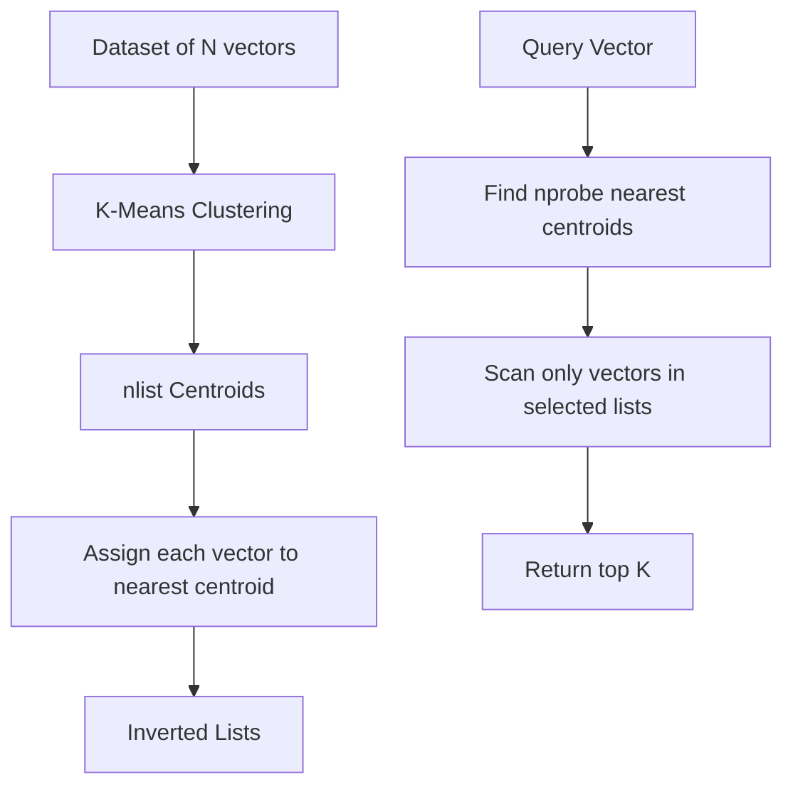
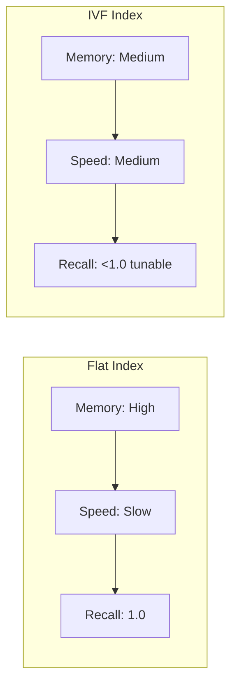
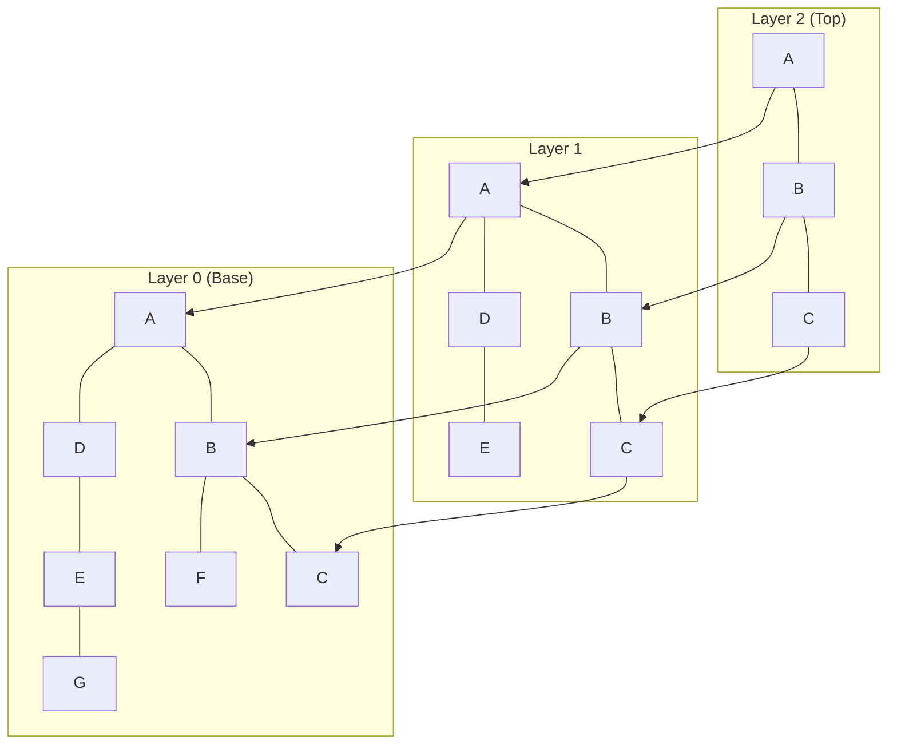
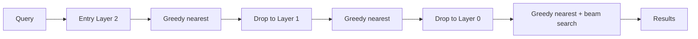
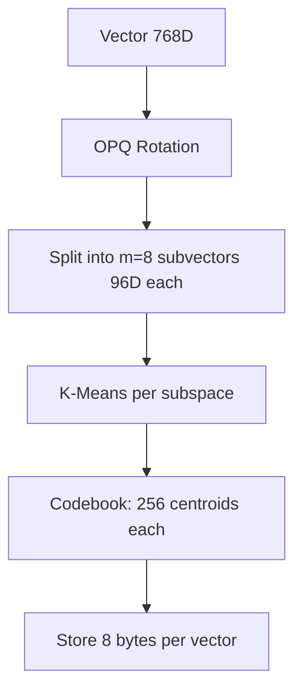
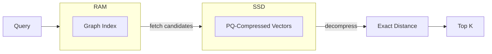

# 🔬 Indexing Algorithms Deep Dive

## 🎯 Learning Objectives

- Understand the design rationale behind Flat, IVF, HNSW, PQ, OPQ, DiskANN, and ScaNN indices
- Build a decision framework for selecting an index based on build time, query time, memory, and recall
- Explain how HNSW navigable graphs achieve polylogarithmic search complexity
- Compare quantization methods (PQ, OPQ) and their impact on memory vs accuracy
- Evaluate DiskANN and ScaNN as solutions for billion-scale and GPU-accelerated search

## Introduction

If vector search is the engine of modern AI retrieval, indexing algorithms are its transmission. Without them, every query would trigger a brute-force scan, making real-time semantic search, recommendation, and RAG impossible at scale. This note dissects the major algorithmic families — space partitioning, graph navigation, vector quantization, and hardware-aware compression — that transform the O(N) KNN problem into sublinear or near-constant time lookups.

This module follows [[01 - Vector Search Fundamentals]] (where we defined the KNN/ANN problem) and precedes [[03 - pgvector I - Core Operations and Indexing]] and [[05 - Qdrant I - Architecture and Collections]] (where these algorithms are packaged into production database engines). Understanding the algorithms *independently* of any database is critical: it allows you to tune parameters like `ef_construction`, `nlist`, and `M` with confidence rather than guesswork.

---

## Module 1: Flat Index and Inverted File Index (IVF)

### 1.1 Theoretical Foundation 🧠

The **Flat index** is the brute-force baseline. It stores vectors in raw form and computes exact distances at query time. It is unbeatable in recall (always 1.0) and requires zero build time, but query latency is linear in N. Flat indices are useful as gold-standard benchmarks and for small collections (<50k vectors) where simplicity outweighs speed.

The **Inverted File Index (IVF)** addresses scalability by partitioning the vector space into `nlist` clusters using k-means. At build time, a k-means clustering learns `nlist` centroids; each vector is assigned to its nearest centroid. At query time, the system identifies the `nprobe` closest centroids to the query and searches only the vectors in those clusters. This reduces the candidate set from N to roughly (N / nlist) × nprobe.

IVF is a space-partitioning strategy. Its fundamental trade-off is between `nlist` (more clusters = smaller per-cluster scans but higher centroid lookup cost) and `nprobe` (more probes = higher recall but slower queries). IVF is memory-efficient because it stores raw vectors without additional graph structures.

### 1.2 Mental Model 📐

```
┌─────────────────────────────────────────────┐
│  Flat Index (Brute Force)                   │
│                                             │
│  Query ● ──► [v1] [v2] [v3] ... [vN]      │
│              Compare with EVERY vector      │
│              Sort, return top K             │
│                                             │
│  Memory: N × d × 4 bytes (float32)          │
│  Query: O(N)                                │
└─────────────────────────────────────────────┘

┌─────────────────────────────────────────────┐
│  IVF: Cluster-based Pruning                 │
│                                             │
│      C1 ●      C2 ●      C3 ●               │
│     / | \    / | \    / | \                 │
│    v1 v2 v3 v4 v5 v6 v7 v8 v9               │
│                                             │
│  Query ● ──► nearest centroids: C1, C3      │
│              Search ONLY vectors in C1+C3   │
│                                             │
│  nlist = 3  |  nprobe = 2                   │
└─────────────────────────────────────────────┘

┌─────────────────────────────────────────────┐
│  IVF Parameter Trade-off                    │
│                                             │
│  nlist ↑  ──►  smaller clusters             │
│              ──►  faster per-query scan     │
│              ──►  but more centroid overhead│
│                                             │
│  nprobe ↑ ──►  higher recall                │
│              ──►  but slower (more clusters)│
└─────────────────────────────────────────────┘
```

### 1.3 Syntax and Semantics 📝

```python
import faiss
import numpy as np

# WHY: Faiss is the canonical library for IVF and other indices.
#      We use float32 because GPU and SIMD instructions expect it.
dim = 768
nlist = 100          # number of Voronoi cells (clusters)
nprobe = 10          # how many cells to visit per query
N = 1_000_000

# Generate synthetic data. In production, this is your embedding matrix.
xb = np.random.randn(N, dim).astype('float32')
xb /= np.linalg.norm(xb, axis=1, keepdims=True)

# Flat index: exact search, no build time, baseline for recall.
flat_index = faiss.IndexFlatIP(dim)  # Inner Product = Cosine on normalized data
flat_index.add(xb)

# IVF index: needs training on representative data.
# WHY: k-means centroids must see the distribution; use a sample if N is huge.
quantizer = faiss.IndexFlatIP(dim)   # coarse quantizer (finds nearest centroids)
ivf_index = faiss.IndexIVFFlat(quantizer, dim, nlist, faiss.METRIC_INNER_PRODUCT)
ivf_index.train(xb)                  # learns the nlist centroids
ivf_index.add(xb)
ivf_index.nprobe = nprobe            # runtime tunable: recall vs speed

# Query
xq = np.random.randn(1, dim).astype('float32')
xq /= np.linalg.norm(xq)

D_flat, I_flat = flat_index.search(xq, k=10)
D_ivf, I_ivf = ivf_index.search(xq, k=10)

# Measure recall: overlap between exact and IVF results.
recall = len(set(I_flat[0]) & set(I_ivf[0])) / 10.0
print(f"IVF recall@10 with nprobe={nprobe}: {recall:.2f}")
```

### 1.4 Visual Representation 🖼️






### 1.5 Application in ML/AI Systems 🤖

Real case: **Meta (Facebook)** uses IVF-based indices in early versions of their photo search infrastructure. IVF was chosen because it offered a simple memory-to-recall trade-off and integrated well with their existing k-means pipelines for visual feature clustering.

| ML Use Case | This Concept | Impact |
|-------------|-------------|--------|
| Medium-scale semantic search | IVF with nprobe tuning | Serve 1M–10M docs with ~90% recall and low memory |
| Embedding deduplication | Flat index on small clusters | Exact nearest-neighbor checks within each shard |
| Batch recommendation | IVF pre-filtered by centroid | Reduce candidate space before heavy ranking model |

### 1.6 Common Pitfalls ⚠️

⚠️ **Pitfall: Training IVF on a non-representative sample.** Root cause: k-means centroids learned on skewed data create imbalanced inverted lists. Some lists become massive, defeating the purpose of pruning. Always train on a random sample of ≥30× nlist vectors that matches the production distribution.

💡 **Mnemonic: "IVF trains; Flat does not."** — If your data distribution drifts (e.g., seasonal products), retrain the IVF index or use an online-adaptive variant.

### 1.7 Knowledge Check ❓

1. If your collection has 5 million vectors and you set `nlist = 100`, approximately how many vectors are scanned per query when `nprobe = 5`? What happens to this number if one cluster is 10× larger than the others?
2. Why does Faiss require a `quantizer` (itself a Flat index) inside `IndexIVFFlat`? What role does it play at query time?
3. You need exact recall on 200k vectors but want to practice the IVF API. What parameter combination achieves this behavior without changing the code structure?

---

## Module 2: Hierarchical Navigable Small World (HNSW)

### 2.1 Theoretical Foundation 🧠

HNSW is a graph-based ANN algorithm introduced by Malkov and Yashunin in 2016. It builds a **multi-layer navigable small-world graph** where each layer is a sparse subgraph of the one below. The bottom layer contains every vector and its local neighborhood edges; higher layers contain exponentially fewer nodes and act as "highways" for long-distance jumps.

The key insight is that **small-world networks** (where most nodes are not neighbors but can be reached in a small number of hops) allow greedy navigation to succeed. Starting from a random entry point in the top layer, the algorithm greedily moves to the nearest neighbor within the current layer until a local minimum is reached. It then drops to the next layer, using that node as the new entry point, and repeats until the bottom layer, where it performs a local search to refine the result.

HNSW parameters `M` (maximum edges per node), `efConstruction` (search width during build), and `ef` (search width during query) control the recall/speed/memory trade-off. HNSW dominates modern vector databases because it achieves high recall with low query latency and supports incremental inserts without full retraining.

### 2.2 Mental Model 📐

```
┌─────────────────────────────────────────────┐
│  HNSW Layer Hierarchy                       │
│                                             │
│  Layer 2:     ●───●                         │
│              /     \    (sparse highway)    │
│  Layer 1:   ●─●───●─●                       │
│            / │ \ / │ \  (mid-density)       │
│  Layer 0:  ●─●─●─●─●─●─●─●                 │
│            (dense: every node + neighbors)  │
│                                             │
│  Query ● enters at Layer 2, greedily        │
│  descends to Layer 0 for final refinement   │
└─────────────────────────────────────────────┘

┌─────────────────────────────────────────────┐
│  Greedy Navigation in One Layer             │
│                                             │
│  Entry ● ──► nearest neighbor ●             │
│               │                             │
│               ▼                             │
│            next nearest ●                   │
│               │                             │
│               ▼                             │
│            local minimum ● ──► drop layer   │
└─────────────────────────────────────────────┘

┌─────────────────────────────────────────────┐
│  HNSW Parameters Explained                  │
│                                             │
│  M = max edges per node                     │
│     ↑ M  →  more connectivity → better      │
│              recall but more memory           │
│                                             │
│  efConstruction = beam width at INSERT time │
│     ↑ efC →  better graph quality → slower  │
│              index build                      │
│                                             │
│  ef = beam width at QUERY time              │
│     ↑ ef  →  higher recall → slower query   │
└─────────────────────────────────────────────┘
```

### 2.3 Syntax and Semantics 📝

```python
import faiss
import numpy as np

dim = 768
M = 16                          # max connections per node
efConstruction = 200            # build-time search width
efSearch = 128                  # query-time search width
N = 500_000

xb = np.random.randn(N, dim).astype('float32')
xb /= np.linalg.norm(xb, axis=1, keepdims=True)

# HNSW index in Faiss uses IndexHNSWFlat.
# WHY: "Flat" means it stores raw vectors (not quantized).
#      The graph is built on top of exact vector comparisons.
index = faiss.IndexHNSWFlat(dim, M)
index.hnsw.efConstruction = efConstruction
index.add(xb)                   # incremental; no separate train step needed

# WHY: efSearch is set AFTER build; it controls recall vs latency at runtime.
index.hnsw.efSearch = efSearch

xq = np.random.randn(1, dim).astype('float32')
xq /= np.linalg.norm(xq)
D, I = index.search(xq, k=10)
print(f"HNSW top-10 neighbors: {I[0]}")

# Memory inspection: HNSW stores vectors + graph edges.
# WHY: Each edge is a 4-byte integer (neighbor id) + overhead.
print(f"Vectors memory (MB): {index.ntotal * dim * 4 / 1e6:.1f}")
```

### 2.4 Visual Representation 🖼️






### 2.5 Application in ML/AI Systems 🤖

Real case: **Pinecone**, **Weaviate**, **Qdrant**, and **pgvector** all offer HNSW as their default or recommended index type. Spotify uses HNSW for real-time music recommendation because it supports online inserts (new tracks arrive constantly) without requiring expensive index rebuilds, and sub-10ms query latency is achievable with tuned `efSearch`.

| ML Use Case | This Concept | Impact |
|-------------|-------------|--------|
| Real-time recommendation | HNSW incremental insert | Add new user/item embeddings without retraining |
| RAG document retrieval | HNSW high recall@10 | Retrieve context chunks with >95% accuracy |
| Dynamic content search | HNSW delete + update support | Remove outdated vectors and insert replacements |

### 2.6 Common Pitfalls ⚠️

⚠️ **Pitfall: Using default `efConstruction` for billion-scale indices.** Root cause: Default `efConstruction` (often 40–64) produces a low-quality graph for very large datasets, leading to poor recall regardless of `efSearch`. For production, use `efConstruction ≥ 200` and accept the longer build time.

💡 **Mnemonic: "Build wide, search wide."** — `efConstruction` determines graph quality forever; `efSearch` only determines how hard you look. You cannot fix a bad graph at query time.

### 2.7 Knowledge Check ❓

1. Draw the asymptotic query complexity of HNSW in terms of N. How does this compare to Flat and IVF?
2. Why is HNSW generally preferred over IVF for applications with frequent insertions and deletions?
3. You have 10M vectors and 64GB RAM. HNSW with M=32 exceeds memory. What two levers can you pull to fit the index in RAM without switching algorithms?

---

## Module 3: Product Quantization (PQ), OPQ, DiskANN, and ScaNN

### 3.1 Theoretical Foundation 🧠

**Product Quantization (PQ)** attacks the memory problem. Instead of storing full float32 vectors, PQ splits each vector into `m` sub-vectors and quantizes each sub-vector independently using a small codebook learned via k-means. The vector is then represented by `m` integers (one per sub-quantizer), reducing memory by 10–30×. Distance computation uses asymmetric distance computation (ADC): the query is kept full-precision, but database vectors are decompressed only via their codebook entries.

**Optimized Product Quantization (OPQ)** adds a rotation matrix before PQ to align the data with the quantization grid, reducing reconstruction error. OPQ is almost always better than raw PQ and is the default in production Faiss pipelines.

**DiskANN** solves the billion-scale problem when RAM is insufficient. It keeps the full-precision graph in RAM but stores compressed vectors on SSD. During search, it uses the graph to navigate and fetches only the necessary compressed vectors from disk, decompressing them on the fly. This achieves SSD-scale capacity with near-RAM latency.

**ScaNN** (Google Research) takes a hardware-aware approach. It uses anisotropic vector quantization and coarse clustering with asymmetric hashing, optimized for AVX2/AVX-512 SIMD instructions. ScaNN is designed for massively parallel batch queries on TPUs/GPUs and dominates leaderboard benchmarks for batch throughput.

### 3.2 Mental Model 📐

```
┌─────────────────────────────────────────────┐
│  Product Quantization Memory Savings        │
│                                             │
│  Original:  768 dims × 4 bytes = 3072 B     │
│                                             │
│  PQ(m=8, k*=256):                           │
│    8 sub-vectors × 1 byte = 8 bytes/vec     │
│    Compression ratio: 3072 / 8 = 384×       │
│    (plus small codebook overhead)           │
└─────────────────────────────────────────────┘

┌─────────────────────────────────────────────┐
│  DiskANN: RAM Graph + SSD Vectors           │
│                                             │
│  RAM:  HNSW graph edges (lightweight)       │
│        ┌───┐                                │
│        │ ● │───► node id, neighbor ids     │
│        └───┘                                │
│                                             │
│  SSD:  Compressed vectors (heavyweight)     │
│        ┌────────┐                           │
│        │ PQ code│  fetched on-demand         │
│        └────────┘                           │
│                                             │
│  Query: navigate graph in RAM ──► fetch     │
│         candidate vectors from SSD          │
└─────────────────────────────────────────────┘

┌─────────────────────────────────────────────┐
│  Algorithm Selection Decision Tree          │
│                                             │
│  Collection <100k? ──► Flat                 │
│  RAM tight, batch queries? ──► IVF + PQ     │
│  Real-time, frequent updates? ──► HNSW      │
│  Billions, SSD available? ──► DiskANN       │
│  TPU/GPU batch throughput? ──► ScaNN        │
└─────────────────────────────────────────────┘
```

### 3.3 Syntax and Semantics 📝

```python
import faiss
import numpy as np

dim = 768
N = 1_000_000
xb = np.random.randn(N, dim).astype('float32')

# OPQ + PQ index: highly compressed, good for memory-constrained serving.
# WHY: OPQ rotates data to make subspaces more independent before PQ.
M = 16                          # number of sub-quantizers (must divide dim)
nbits = 8                       # bits per sub-quantizer (256 centroids each)
coarse_nlist = 1024

# Coarse quantizer (IVF) + OPQ/PQ
quantizer = faiss.IndexFlatL2(dim)
ivf_pq = faiss.IndexIVFPQ(quantizer, dim, coarse_nlist, M, nbits)

# WHY: OPQ requires training; we wrap the index in an OPQ preprocessor.
opq = faiss.OPQMatrix(dim, M)
index = faiss.IndexPreTransform(opq, ivf_pq)

# Train on a representative subset (or full data).
index.train(xb)
index.add(xb)

# Query
index.nprobe = 50
xq = np.random.randn(1, dim).astype('float32')
D, I = index.search(xq, k=10)
print(f"IVF+OPQ+PQ recall may be lower than HNSW but memory is tiny.")

# DiskANN is not in Faiss; it is a separate Microsoft library.
# WHY: DiskANN uses a custom Vamana graph and PQ-compressed SSD storage.
#      It is the state-of-the-art for billion-scale on single machine.
```

### 3.4 Visual Representation 🖼️






### 3.5 Application in ML/AI Systems 🤖

Real case: **Microsoft Bing** uses DiskANN to power vector search over billions of web document embeddings on a single commodity server. By keeping the graph in RAM and vectors on NVMe SSD, they achieve sub-5ms latency without the cost of terabytes of DRAM.

| ML Use Case | This Concept | Impact |
|-------------|-------------|--------|
| Billion-scale semantic search | DiskANN (RAM graph + SSD vectors) | Search 1B+ vectors on one machine |
| Mobile/edge embedding search | PQ-only index | Fit millions of vectors in <100MB |
| Batch embedding scoring | ScaNN anisotropic quantization | Maximize throughput on TPU/GPU clusters |
| Real-time similarity join | OPQ + IVF | Pre-filter large collections before deep model scoring |

### 3.6 Common Pitfalls ⚠️

⚠️ **Pitfall: Using PQ with too few bits or too many subspaces on high-dimensional data.** Root cause: Each sub-quantizer has limited representational power. If `M` is too large (e.g., 64 for 768D), each subspace is only 12D and k-means centroids become sparse and poorly fitted. If `nbits` is too small (e.g., 4), the codebook has only 16 entries and quantization error explodes.

💡 **Mnemonic: "PQ needs room to breathe."** — Aim for subspace dimensions ≥ 24 and `nbits = 8` as a safe default. Benchmark reconstruction error (MSE) before accepting a PQ configuration.

### 3.7 Knowledge Check ❓

1. You have 100M vectors of 768D. How much RAM does a Flat index require? How much does PQ with `M=16, nbits=8` require (ignoring codebook overhead)?
2. Why does OPQ improve over raw PQ? What property of the rotation matrix helps quantization?
3. Compare ScaNN and DiskANN: which is better for (a) a Google-scale batch re-ranking pipeline, and (b) a single-server real-time search API? Justify your answer.

---

## 📦 Compression Code

```python
"""
Indexing Algorithms Deep Dive — Compression Script
Summarizes: Flat, IVF, HNSW, PQ, OPQ, DiskANN, ScaNN trade-offs.
"""
import faiss
import numpy as np

class VectorIndexBenchmark:
    def __init__(self, dim: int = 768):
        self.dim = dim
        self.indices = {}

    def build_flat(self, vectors: np.ndarray):
        idx = faiss.IndexFlatIP(self.dim)
        idx.add(vectors)
        self.indices["flat"] = idx
        return idx

    def build_ivf(self, vectors: np.ndarray, nlist: int = 100, nprobe: int = 10):
        quantizer = faiss.IndexFlatIP(self.dim)
        idx = faiss.IndexIVFFlat(quantizer, self.dim, nlist, faiss.METRIC_INNER_PRODUCT)
        idx.train(vectors)
        idx.add(vectors)
        idx.nprobe = nprobe
        self.indices["ivf"] = idx
        return idx

    def build_hnsw(self, vectors: np.ndarray, M: int = 16, efConstruction: int = 200):
        idx = faiss.IndexHNSWFlat(self.dim, M)
        idx.hnsw.efConstruction = efConstruction
        idx.add(vectors)
        self.indices["hnsw"] = idx
        return idx

    def recall_vs_exact(self, query: np.ndarray, k: int = 10):
        exact_idx = self.indices.get("flat")
        if exact_idx is None:
            raise ValueError("Build flat index first as baseline.")
        _, exact_I = exact_idx.search(query, k)
        results = {}
        for name, idx in self.indices.items():
            if name == "flat":
                continue
            _, I = idx.search(query, k)
            overlap = len(set(exact_I[0]) & set(I[0]))
            results[name] = overlap / k
        return results

if __name__ == "__main__":
    dim, N = 768, 200_000
    vecs = np.random.randn(N, dim).astype("float32")
    vecs /= np.linalg.norm(vecs, axis=1, keepdims=True)
    bench = VectorIndexBenchmark(dim)
    bench.build_flat(vecs)
    bench.build_ivf(vecs, nlist=100, nprobe=10)
    bench.build_hnsw(vecs, M=16, efConstruction=200)
    q = np.random.randn(1, dim).astype("float32")
    q /= np.linalg.norm(q)
    print(bench.recall_vs_exact(q, k=10))
```

## 🎯 Documented Project

**Project: Index Benchmarking Suite**

- **Description**: A reproducible benchmarking harness that builds Flat, IVF, HNSW, and OPQ+PQ indices on the same dataset and reports latency, memory, and recall@k.
- **Functional Requirements**:
  - Accept a NumPy matrix of embeddings and a set of query vectors.
  - Build each index type with configurable parameters.
  - Measure query latency (p50, p99) and peak RSS memory via `psutil`.
  - Compute recall@k against the Flat exact baseline for every approximate index.
- **Main Components**:
  - `IndexBuilder`: factory for Faiss indices with validated parameters.
  - `BenchmarkRunner`: warms up caches, times searches, and aggregates stats.
  - `ReportGenerator`: outputs Markdown tables comparing index configurations.
- **Success Metrics**:
  - HNSW achieves ≥95% recall@10 with p99 latency <20ms on 1M vectors.
  - PQ index uses ≤5% of Flat memory with ≥85% recall@10.

## 🎯 Key Takeaways

- **Flat** is the exact baseline; use it for small datasets and recall validation.
- **IVF** partitions space via k-means; tune `nlist` and `nprobe` for your latency/recall target.
- **HNSW** is the gold standard for dynamic, real-time vector search due to its graph-based navigation and incremental update support.
- **PQ/OPQ** compress vectors by 10–30×, making billion-scale search feasible in limited RAM.
- **DiskANN** extends HNSW ideas to SSD-backed storage, enabling single-machine billion-vector search.
- **ScaNN** is optimized for batch throughput on modern SIMD/GPU hardware and excels in cloud-scale reranking.
- No index is universally best; always benchmark recall, latency, and memory on your data before choosing.

## References

- Y. Malkov, D. Yashunin. "Efficient and robust approximate nearest neighbor search using Hierarchical Navigable Small World graphs." IEEE TPAMI, 2018.
- H. Jégou et al. "Product Quantization for Nearest Neighbor Search." IEEE TPAMI, 2011.
- S. Subramanya et al. "DiskANN: Fast Accurate Billion-point Nearest Neighbor Search on a Single Node." NeurIPS, 2019.
- Google Research. "ScaNN: Accelerating Large-Scale Inference with Anisotropic Vector Quantization." ICML, 2020.
- Faiss documentation: https://github.com/facebookresearch/faiss/wiki
