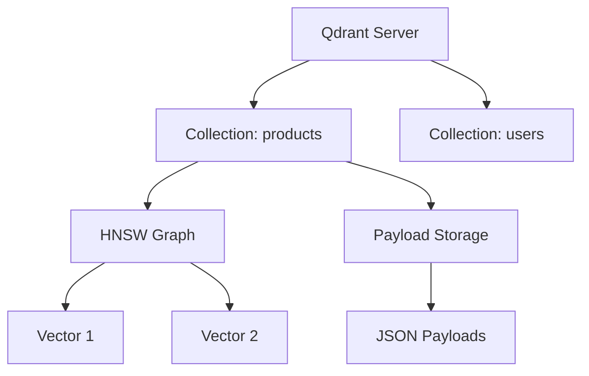
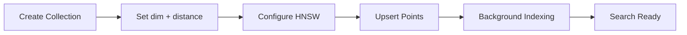
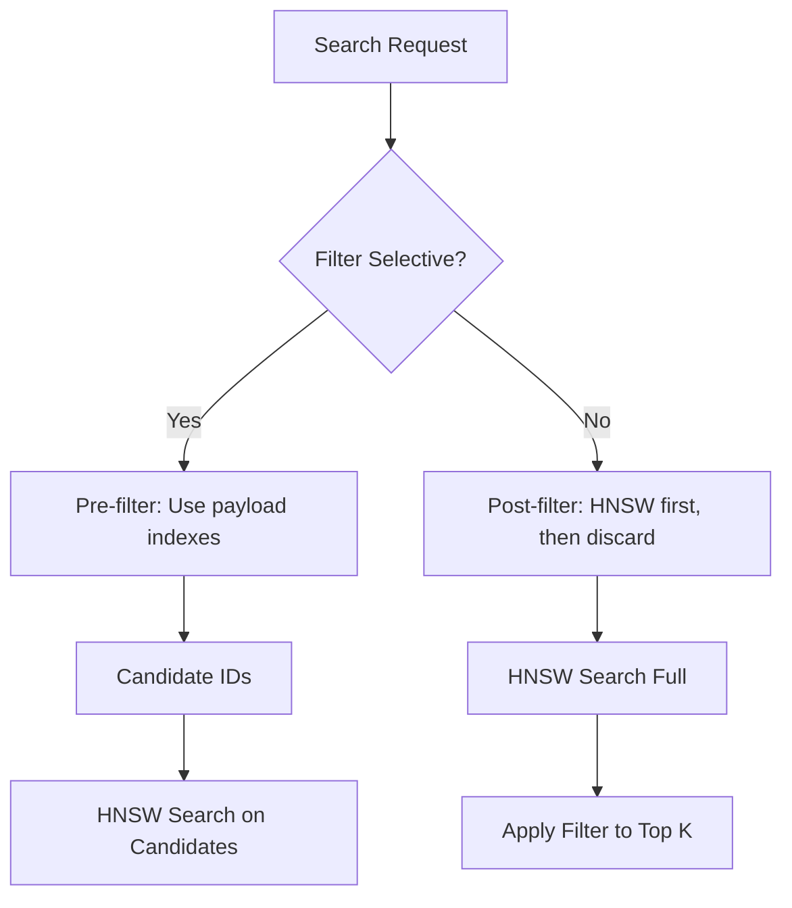
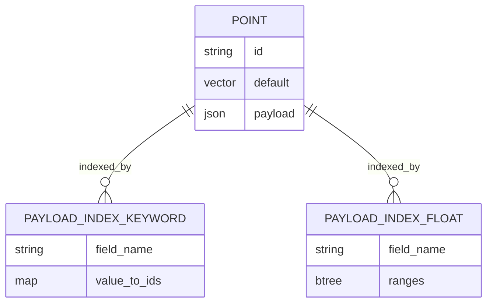
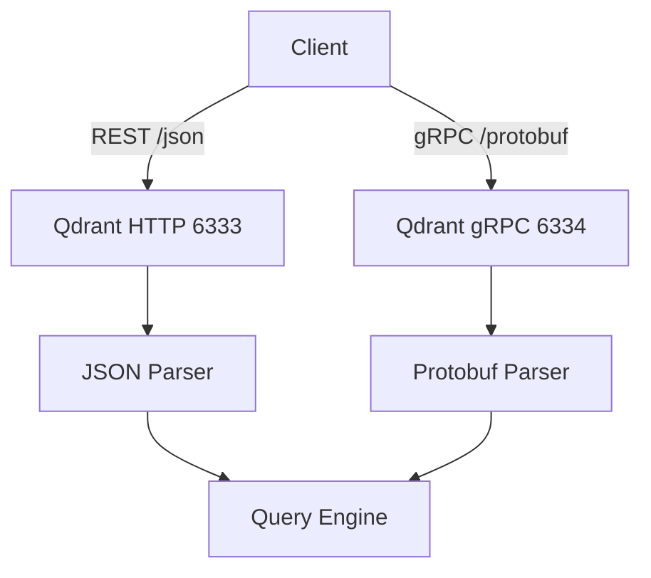
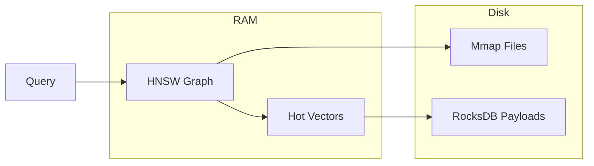

# 🦀 Qdrant I - Architecture and Collections

## 🎯 Learning Objectives

- Explain Qdrant's Rust-based architecture and why it matters for performance and safety
- Design collections with appropriate vector dimensions, distance metrics, and HNSW configurations
- Model data as Points (vector + payload) and choose payload indexing strategies
- Differentiate pre-filtering from post-filtering and their impact on recall and latency
- Interact with Qdrant via REST and gRPC APIs for vector upsert and search
- Configure on-disk payload storage to manage RAM usage for large metadata

## Introduction

Qdrant is an open-source vector database written in **Rust**, designed from the ground up for high-performance approximate nearest neighbor search with rich payload filtering. While `pgvector` extends an existing relational engine, Qdrant is a purpose-built native vector database. This means it optimizes every layer — storage, indexing, networking, and query execution — specifically for embedding workloads, achieving lower latencies and higher throughput than general-purpose databases at comparable scales.

This note covers Qdrant's core abstractions: **Collections** (logical namespaces), **Points** (vectors with JSON payloads), **HNSW indexing**, and **payload indexes**. We also explore the critical filtering pipeline, where Qdrant's ability to apply metadata constraints *before* or *after* the vector search distinguishes it from simpler engines.

This module connects to [[02 - Indexing Algorithms Deep Dive]] (HNSW internals) and [[06 - Qdrant II - Distributed and Cloud Deployment]] (clustering and cloud operations). It also relates to [[14 - Rust Engineering]] because Qdrant's codebase is a production reference for high-performance Rust systems.

---

## Module 1: Collections, Points, and HNSW Configuration

### 1.1 Theoretical Foundation 🧠

Qdrant organizes data into **Collections**. A collection is a logical namespace with a fixed vector configuration: dimensionality, distance metric (Cosine, Euclid, Dot), and optional multi-vector setups (e.g., ColBERT late interaction). Collections are independently configurable and isolated, making them ideal for multi-tenant deployments where each tenant has different embedding models or similarity requirements.

Within a collection, the unit of storage is a **Point**. A point consists of:
- A unique `id` (UUID or unsigned 64-bit integer)
- One or more named vectors (e.g., `default`, `image`, `text`)
- A JSON payload dictionary (unstructured metadata)
- Optional vector-specific storage settings (in-memory, mmap, on-disk)

Qdrant builds an **HNSW graph** per named vector in a collection. Unlike `pgvector`, where HNSW parameters are set at `CREATE INDEX` time, Qdrant's HNSW configuration is part of the collection schema and can be tuned per collection. Key parameters:
- `m`: maximum number of graph edges per node (default 16)
- `ef_construct`: search width during index build (default 100)
- `full_scan_threshold`: switch to brute force below this number of points (default 10000)
- `on_disk`: whether to store the raw vector data on disk rather than in RAM

Rust's memory safety and zero-cost abstractions allow Qdrant to manage these structures without garbage collection pauses, a critical advantage for sub-10ms p99 latency requirements.

### 1.2 Mental Model 📐

```
┌─────────────────────────────────────────────┐
│  Qdrant Server                              │
│                                             │
│  ┌─────────────────────────────────────┐    │
│  │  Collection: "products"             │    │
│  │  dim=768, distance=Cosine           │    │
│  │                                     │    │
│  │  HNSW graph (m=16, ef_construct=128)│    │
│  │  ┌─────┐  ┌─────┐  ┌─────┐         │    │
│  │  │Point│──│Point│──│Point│ ...     │    │
│  │  │  #1 │  │  #2 │  │  #3 │         │    │
│  │  └──┬──┘  └──┬──┘  └──┬──┘         │    │
│  │     │payload │payload │payload      │    │
│  │     │JSON    │JSON    │JSON         │    │
│  └─────┼────────┼────────┼─────────────┘    │
│        │        │        │                   │
│  ┌─────┴────────┴────────┴─────────────┐    │
│  │  Collection: "users"                │    │
│  │  dim=384, distance=Dot              │    │
│  └─────────────────────────────────────┘    │
└─────────────────────────────────────────────┘

┌─────────────────────────────────────────────┐
│  Point Structure                            │
│                                             │
│  id: "550e8400-e29b-41d4-a716-446655440000" │
│  vector: {                                  │
│    "default": [0.1, -0.3, ...],             │
│    "image": [0.05, 0.02, ...]              │
│  }                                          │
│  payload: {                                 │
│    "category": "electronics",               │
│    "price": 299.99,                         │
│    "tags": ["wireless", "bluetooth"]        │
│  }                                          │
└─────────────────────────────────────────────┘
```

### 1.3 Syntax and Semantics 📝

```python
from qdrant_client import QdrantClient
from qdrant_client.models import Distance, VectorParams, PointStruct

# WHY: The client connects via gRPC by default (faster than REST).
#      Use 'prefer_grpc=True' for production throughput.
client = QdrantClient(host="localhost", port=6333, prefer_grpc=True)

# Create a collection with explicit HNSW and vector configuration.
# WHY: Setting on_disk=False keeps vectors in RAM for speed.
#      For billion-scale, set on_disk=True and use mmap.
client.create_collection(
    collection_name="products",
    vectors_config=VectorParams(size=768, distance=Distance.COSINE),
    hnsw_config={
        "m": 16,
        "ef_construct": 128,
        "full_scan_threshold": 10000,
        "on_disk": False,
    },
    optimizers_config={
        # WHY: Indexing is deferred to a background thread.
        #      'indexing_threshold' controls when HNSW build starts.
        "indexing_threshold": 20000,
    },
)

# Upsert points with payloads.
# WHY: Batch upserts are far more efficient than single-point calls.
points = [
    PointStruct(
        id="prod-001",
        vector=[0.1] * 768,  # placeholder embedding
        payload={"category": "electronics", "price": 299.99, "tags": ["wireless"]},
    ),
    PointStruct(
        id="prod-002",
        vector=[0.2] * 768,
        payload={"category": "books", "price": 19.99, "tags": ["fiction"]},
    ),
]
client.upsert(collection_name="products", points=points, wait=True)

# Search without filters (pure vector similarity).
results = client.search(
    collection_name="products",
    query_vector=[0.15] * 768,
    limit=5,
    with_payload=True,
)
for hit in results:
    print(hit.id, hit.score, hit.payload)
```

### 1.4 Visual Representation 🖼️






### 1.5 Application in ML/AI Systems 🤖

Real case: **Databricks** uses Qdrant in their Mosaic AI Vector Search product to provide managed vector retrieval for RAG applications. They leverage Qdrant's collection-per-workspace isolation and Rust-based performance to serve embeddings from their Unity Catalog with sub-20ms latency at multi-tenant scale.

| ML Use Case | This Concept | Impact |
|-------------|-------------|--------|
| Multi-modal search | Multi-vector collections | Store text + image embeddings for the same item |
| Multi-tenant SaaS | Collection-per-tenant | Isolation, independent tuning, easy deletion |
| Real-time recommendations | Low-latency HNSW | Serve personalized results in <10ms |

### 1.6 Common Pitfalls ⚠️

⚠️ **Pitfall: Using the default `ef_construct=100` for production collections >1M points.** Root cause: Default build parameters produce a lower-quality graph, forcing you to raise `ef` at query time and increasing latency. For production, use `ef_construct >= 200` and accept longer initial indexing time. You cannot retroactively improve graph quality without reindexing.

💡 **Mnemonic: "Build once, query forever."** — Index build time is amortized; query latency is paid on every request.

### 1.7 Knowledge Check ❓

1. You need to store both 768D text embeddings and 512D image embeddings for the same product catalog. Should you use one collection with two named vectors, or two separate collections? Justify your answer considering query patterns and index overhead.
2. What happens if you upsert 50,000 points into a new Qdrant collection with `indexing_threshold=20000`? Describe the behavior of the indexing thread.
3. Explain the trade-off between `on_disk=True` and `on_disk=False` for vector storage. When would you choose each?

---

## Module 2: Payloads, Payload Indexing, and Filtering

### 2.1 Theoretical Foundation 🧠

Qdrant's payload system is its superpower relative to simpler vector stores. Payloads are arbitrary JSON documents attached to points, and Qdrant can index payload fields to enable fast metadata filtering. Supported payload index types include:

- **keyword**: exact match and `match_any` on string arrays (backed by a hash map)
- **integer**: range queries and exact match (backed by a B-tree-like structure)
- **float**: range queries (also B-tree-like)
- **geo**: radius and bounding-box queries on latitude/longitude
- **text**: full-text tokenized search on payload strings

Filtering can occur in two modes:

1. **Pre-filtering**: Apply payload constraints first to build a candidate set, then run vector search within that set. This guarantees that all results satisfy the filter but may be slow if the filter is not selective (many candidates).
2. **Post-filtering**: Run vector search first, then discard results that fail the payload constraint. This is faster for unselective filters but may return fewer than `limit` results if many top-k vectors are filtered out.

Qdrant automatically chooses the better strategy based on selectivity estimates, but you can force pre-filtering with explicit query structures.

### 2.2 Mental Model 📐

```
┌─────────────────────────────────────────────┐
│  Payload Indexes per Field                  │
│                                             │
│  category ──► keyword index                 │
│    "electronics" ──► [point_1, point_7]     │
│    "books"       ──► [point_2, point_5]     │
│                                             │
│  price ──► float index (B-tree)             │
│    [0] ─────► [19.99] ─────► [299.99]       │
│     │            │               │            │
│   p3, p4       p2, p5         p1, p6        │
│                                             │
│  tags ──► keyword index (array expansion)   │
│    "wireless" ──► [point_1, point_8]        │
└─────────────────────────────────────────────┘

┌─────────────────────────────────────────────┐
│  Pre-filter vs Post-filter                  │
│                                             │
│  Pre-filter:                                │
│  Filter ──► Candidate Set ──► Vector Search │
│  (guarantees result validity)               │
│                                             │
│  Post-filter:                               │
│  Vector Search ──► Top K ──► Apply Filter   │
│  (may return <K results)                    │
└─────────────────────────────────────────────┘
```

### 2.3 Syntax and Semantics 📝

```python
from qdrant_client.models import Filter, FieldCondition, MatchValue, Range

# WHY: Payload indexes must be created explicitly; unindexed fields
#      cause full payload scans during filtering.
client.create_payload_index(
    collection_name="products",
    field_name="category",
    field_schema="keyword",  # exact match index
)

client.create_payload_index(
    collection_name="products",
    field_name="price",
    field_schema="float",  # range index
)

# Pre-filtered search: only electronics under $100.
# WHY: Qdrant will use the keyword and float indexes to shrink
#      the candidate set before touching the HNSW graph.
search_filter = Filter(
    must=[
        FieldCondition(key="category", match=MatchValue(value="electronics")),
        FieldCondition(key="price", range=Range(lt=100.0)),
    ]
)

results = client.search(
    collection_name="products",
    query_vector=[0.15] * 768,
    query_filter=search_filter,
    limit=5,
    with_payload=True,
)

# Post-filter simulation (not typically needed; Qdrant auto-selects).
# WHY: You can inspect fewer results if the filter is highly selective
#      and you want maximum vector similarity within the matching set.
```

### 2.4 Visual Representation 🖼️






### 2.5 Application in ML/AI Systems 🤖

Real case: **Qualcomm** uses Qdrant's payload filtering to power on-device semantic search over user-generated content. Each photo is embedded and tagged with device-local metadata (timestamp, location, album). Payload indexes on `album_id` (keyword) and `created_at` (integer) allow millisecond-filtered retrieval without exposing private data to cloud backends.

| ML Use Case | This Concept | Impact |
|-------------|-------------|--------|
| Permission-aware RAG | Pre-filter by `user_id` or `group_acl` | Return only documents the user is authorized to see |
| Geo-localized search | Geo payload index | Find semantically similar items within a radius |
| Faceted e-commerce | Keyword + float payload indexes | Combine semantic similarity with price/category filters |

### 2.6 Common Pitfalls ⚠️

⚠️ **Pitfall: Applying complex filters on unindexed payload fields.** Root cause: Without a payload index, Qdrant evaluates the filter by scanning every point's payload, an O(N) operation that destroys the sublinear benefit of HNSW. Always create payload indexes for fields used in `must`/`should`/`must_not` clauses.

💡 **Mnemonic: "Filter fast? Index first."** — Treat payload indexes like database indexes: create them before the query load arrives.

### 2.7 Knowledge Check ❓

1. You search with a filter `category == 'shoes' AND price < 50`. The `category` index returns 10,000 IDs; the `price` index returns 500,000 IDs. How does Qdrant likely combine these indexes before vector search?
2. You receive only 2 results when requesting `limit=10` with a restrictive post-filter. What two strategies can you use to increase result coverage?
3. Design a payload schema and index set for a real estate search system that filters by city (keyword), price range (float), and bedrooms (integer).

---

## Module 3: On-Disk Storage and API Interfaces

### 3.1 Theoretical Foundation 🧠

Qdrant offers fine-grained storage controls to handle the memory/disk trade-off. Each named vector and the payload can be configured independently:

- **In-memory**: Fastest access; required for latency-critical paths. Limited by RAM.
- **Mmap (memory-mapped files)**: The OS caches pages on demand. Good for large datasets where only a fraction is hot. Latency can spike on page faults.
- **On-disk (payload only)**: Payloads are stored in RocksDB. Vectors stay in RAM or Mmap, but metadata is fetched from disk during result expansion.

For collections larger than available RAM, the recommended configuration is:
- Vectors: `on_disk=False` with `mmap` if necessary
- Payload: `on_disk=True` (RocksDB)
- HNSW graph: kept in RAM (graph traversal is random-access and punishes disk I/O)

Qdrant exposes two APIs:
- **REST** (port 6333): Human-readable, easy to debug with `curl`, ideal for administrative tasks and integration with web frameworks.
- **gRPC** (port 6334): Binary protocol with lower serialization overhead and HTTP/2 multiplexing. It is the recommended interface for production search and bulk ingest due to higher throughput and lower latency.

### 3.2 Mental Model 📐

```
┌─────────────────────────────────────────────┐
│  Qdrant Storage Hierarchy                   │
│                                             │
│  ┌─────────────────────────────────────┐    │
│  │  RAM                                │    │
│  │  ┌───────────┐  ┌───────────────┐  │    │
│  │  │ HNSW Graph│  │ Hot Vectors   │  │    │
│  │  └───────────┘  └───────────────┘  │    │
│  └─────────────────────────────────────┘    │
│              │                │             │
│  ┌───────────┴────────┐  ┌───┴──────────┐  │
│  │  Mmap Files        │  │  RocksDB     │  │
│  │  (cold vectors)    │  │  (payloads)  │  │
│  └────────────────────┘  └──────────────┘  │
└─────────────────────────────────────────────┘

┌─────────────────────────────────────────────┐
│  API Choice Matrix                          │
│                                             │
│  Task              │  Recommended API       │
│  ──────────────────┼─────────────────────   │
│  Bulk ingest       │  gRPC                  │
│  Interactive search│  gRPC                  │
│  Admin/debugging   │  REST                  │
│  Browser/frontend  │  REST                  │
└─────────────────────────────────────────────┘
```

### 3.3 Syntax and Semantics 📝

```python
# REST API via requests (for debugging and admin)
import requests

# WHY: REST is ideal for quick checks when you don't have the client installed.
r = requests.put(
    "http://localhost:6333/collections/debug_collection",
    json={
        "vectors": {"size": 768, "distance": "Cosine"},
        "hnsw_config": {"m": 16, "ef_construct": 128},
    },
)
print(r.status_code, r.json())

# gRPC is the production default; here is a Go snippet for completeness.
```

```go
// WHY: Go clients use gRPC for high-throughput production services.
// This snippet shows collection creation with the official qdrant/go-client.
package main

import (
	"context"
	"log"
	"time"

	"github.com/qdrant/go-client/qdrant"
)

func main() {
	client, err := qdrant.NewClient(&qdrant.Config{
		Host: "localhost",
		Port: 6334,
	})
	if err != nil {
		log.Fatal(err)
	}
	defer client.Close()

	ctx, cancel := context.WithTimeout(context.Background(), 10*time.Second)
	defer cancel()

	err = client.CreateCollection(ctx, &qdrant.CreateCollection{
		CollectionName: "products",
		VectorsConfig: qdrant.NewVectorsConfig(
			qdrant.NewVectorParams(768, qdrant.Distance_Cosine),
		),
		HnswConfig: &qdrant.HnswConfigDiff{
			M:              qdrant.PtrOf(uint64(16)),
			EfConstruct:    qdrant.PtrOf(uint64(128)),
		},
	})
	if err != nil {
		log.Fatal(err)
	}
	log.Println("Collection created via gRPC")
}
```

### 3.4 Visual Representation 🖼️






### 3.5 Application in ML/AI Systems 🤖

Real case: **NeuralMagic** uses Qdrant's on-disk payload storage to serve sparse embedding retrieval for model compression research. They keep quantized vectors in Mmap and heavy metadata (model configs, training runs) in RocksDB, allowing a single server to host 50M+ experiment records without terabytes of RAM.

| ML Use Case | This Concept | Impact |
|-------------|-------------|--------|
| Large-scale catalog search | Mmap vectors + on-disk payloads | Serve 100M+ items on modest hardware |
| Edge deployment | Small collections, in-memory only | Sub-millisecond latency on embedded devices |
| Cross-language microservices | REST API from frontend | Python backend queries gRPC; React calls REST |

### 3.6 Common Pitfalls ⚠️

⚠️ **Pitfall: Storing the HNSW graph on disk or using Mmap for the graph.** Root cause: HNSW traversal is random-access with unpredictable locality. Moving the graph to disk causes severe latency spikes (10–100x) due to seek times and page faults. Always keep the HNSW graph in RAM, even if vectors and payloads are on disk.

💡 **Mnemonic: "Graph in RAM; vectors may roam."** — The graph is the navigation structure; it must be hot. Vectors and payloads have more flexibility.

### 3.7 Knowledge Check ❓

1. Your collection has 20M points and each payload is 5KB of JSON. Approximately how much RAM do you save by moving payloads to RocksDB (`on_disk=True`) while keeping vectors in Mmap?
2. You need to debug why a search returns zero results. Which API port and tool would you use for the quickest manual verification?
3. Write the Python client code to create a collection with two named vectors (`text` 768D Cosine, `image` 512D Euclidean) and set `on_disk=True` only for the `image` vector.

---

## 📦 Compression Code

```python
"""
Qdrant I — Compression Script
Summarizes: collections, points, HNSW, payload indexes, filtering, APIs.
"""
from qdrant_client import QdrantClient
from qdrant_client.models import (
    Distance, VectorParams, PointStruct,
    Filter, FieldCondition, MatchValue, Range,
)

client = QdrantClient(host="localhost", port=6333, prefer_grpc=True)

def setup_collection(name: str, dim: int = 768):
    if client.collection_exists(name):
        client.delete_collection(name)
    client.create_collection(
        collection_name=name,
        vectors_config=VectorParams(size=dim, distance=Distance.COSINE),
        hnsw_config={"m": 16, "ef_construct": 128},
    )
    client.create_payload_index(name, "category", "keyword")
    client.create_payload_index(name, "price", "float")

def upsert_batch(name: str, points: list[PointStruct]):
    client.upsert(collection_name=name, points=points, wait=True)

def search_filtered(name: str, vec: list[float], category: str, max_price: float, k: int = 5):
    return client.search(
        collection_name=name,
        query_vector=vec,
        query_filter=Filter(
            must=[
                FieldCondition(key="category", match=MatchValue(value=category)),
                FieldCondition(key="price", range=Range(lt=max_price)),
            ]
        ),
        limit=k,
        with_payload=True,
    )

if __name__ == "__main__":
    setup_collection("demo")
    upsert_batch("demo", [
        PointStruct(id="1", vector=[0.1]*768, payload={"category": "a", "price": 10}),
        PointStruct(id="2", vector=[0.2]*768, payload={"category": "a", "price": 50}),
    ])
    print(search_filtered("demo", [0.15]*768, "a", 30))
```

## 🎯 Documented Project

**Project: E-commerce Semantic Product Search**

- **Description**: A product search backend using Qdrant where items have text embeddings and rich metadata (category, price, tags, brand). Customers search by natural language and filter by facets.
- **Functional Requirements**:
  - Collection `products` with 768D Cosine vectors.
  - Payload indexes on `category` (keyword), `price` (float), `brand` (keyword), `tags` (keyword).
  - Search endpoint accepts `query` (text), `filters` (JSON), and `limit`.
  - Return vector similarity score + payload for each hit.
- **Main Components**:
  - `embedder.py`: converts product descriptions to embeddings via `sentence-transformers`.
  - `ingest.py`: batch-upserts products into Qdrant.
  - `search_api.py`: FastAPI endpoint translating HTTP requests to `client.search()` with `Filter`.
- **Success Metrics**:
  - p99 search latency <30ms with 3 filters applied on 5M products.
  - Catalog updates (price changes) reflected in search within 5 seconds of upsert.

## 🎯 Key Takeaways

- **Collections** are isolated namespaces with fixed vector config; use them for multi-tenancy or multi-modal data.
- **Points** combine vectors and JSON payloads; design payloads for the filters your application actually uses.
- **HNSW** is built per named vector; tune `m` and `ef_construct` at collection creation because reindexing is costly.
- **Payload indexes** (keyword, integer, float, geo, text) are essential for fast filtered search; unindexed filters degrade to O(N) scans.
- Qdrant automatically selects **pre-filtering** or **post-filtering** based on selectivity; you can override if you understand your data.
- **gRPC** is the production API of choice for latency and throughput; **REST** is best for debugging and browser integration.
- Keep the **HNSW graph in RAM**; vectors and payloads can be offloaded to disk or Mmap as scale demands.

## References

- Qdrant Documentation: https://qdrant.tech/documentation/
- Qdrant GitHub: https://github.com/qdrant/qdrant
- Qdrant Python Client: https://github.com/qdrant/qdrant-client
- Qdrant Go Client: https://github.com/qdrant/go-client
- [[02 - Indexing Algorithms Deep Dive]] — HNSW algorithmic foundations.
- [[14 - Rust Engineering]] — Rust systems programming context.
