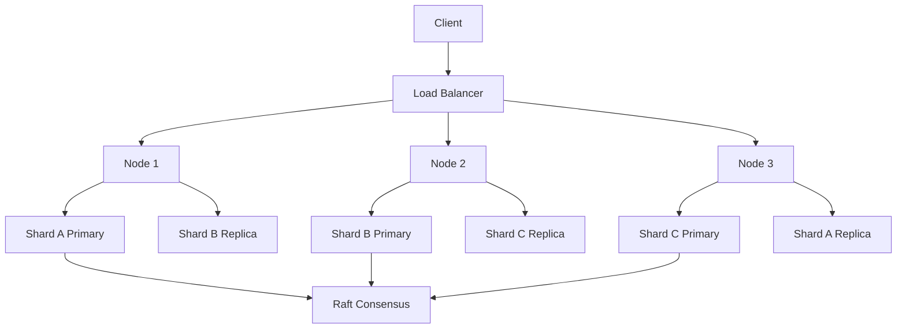
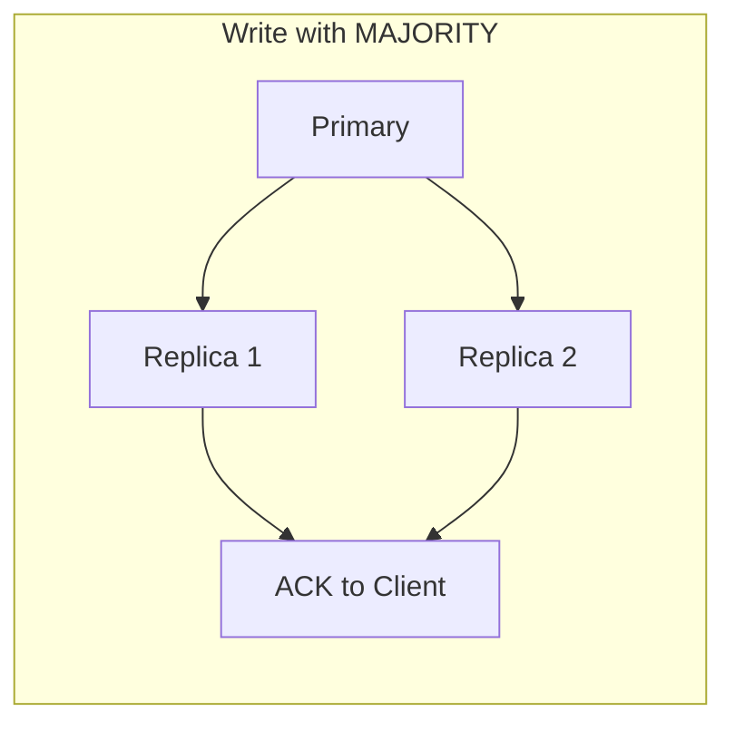
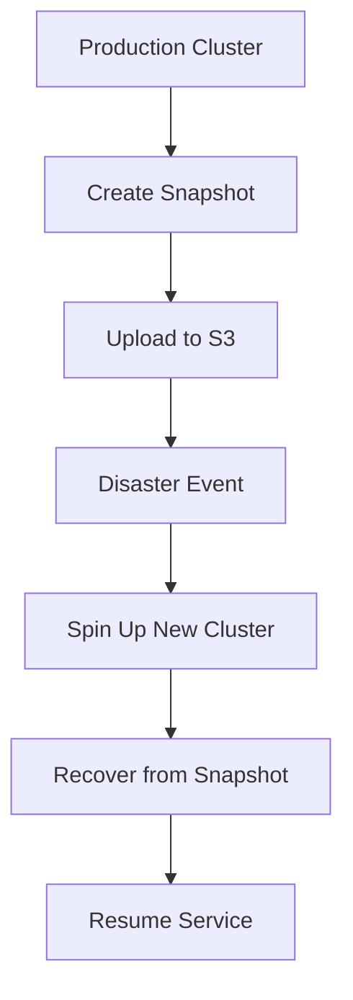
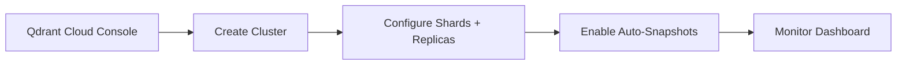
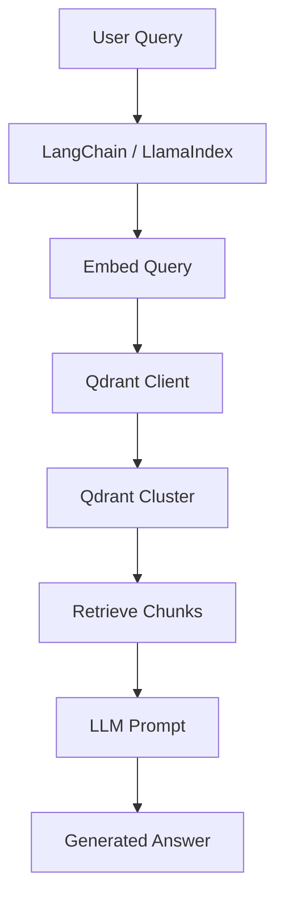
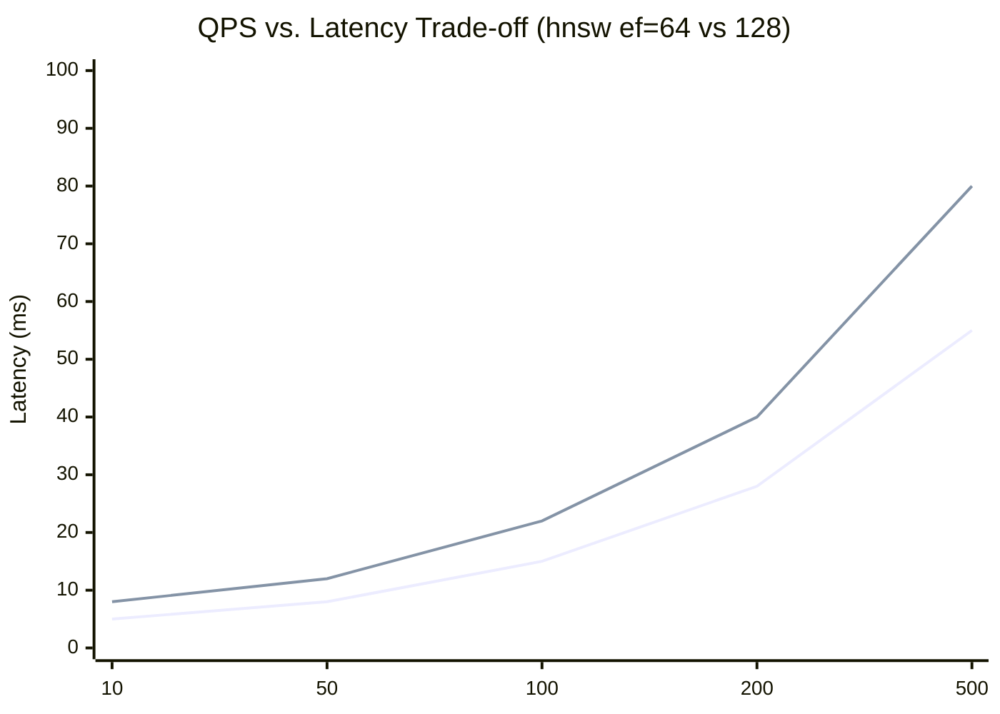

# ☁️ Qdrant II - Distributed and Cloud Deployment

## 🎯 Learning Objectives

- Architect Qdrant clusters using Raft consensus, sharding, and replication
- Configure write consistency levels and understand their trade-offs for ML pipelines
- Implement snapshot and backup strategies for distributed vector collections
- Deploy on Qdrant Cloud and self-hosted Kubernetes with production best practices
- Integrate Qdrant with LangChain and LlamaIndex for RAG and agentic workflows
- Benchmark Qdrant performance and identify bottlenecks in distributed settings

## Introduction

A single-node Qdrant instance is sufficient for prototyping and many mid-scale production workloads. But modern AI systems — especially RAG platforms serving millions of users — require horizontal scalability, fault tolerance, and geographic distribution. Qdrant's distributed mode provides these capabilities through a **Raft-based consensus layer**, **sharded collections**, and **configurable replication**.

This note is the capstone of the course. It combines the algorithmic foundations from [[01 - Vector Search Fundamentals]] and [[02 - Indexing Algorithms Deep Dive]], the database mechanics from [[05 - Qdrant I - Architecture and Collections]], and operational practices from [[04 - pgvector II - Production and Hybrid Search]] to show how vector search scales to cloud-native deployments. We also cover integrations with the two dominant LLM orchestration frameworks: LangChain and LlamaIndex.

This module connects to [[15 - Docker and Kubernetes]] (container orchestration), [[18 - MLOps and Model Serving]] (production SLAs), and [[06 - Large Language Models]] (downstream RAG consumption).

---

## Module 1: Qdrant Cluster Architecture

### 1.1 Theoretical Foundation 🧠

Qdrant's distributed architecture has three core concepts:

1. **Consensus (Raft)**: A consensus group of peer nodes maintains cluster metadata — which collections exist, how they are sharded, and where replicas live. Raft ensures that metadata changes (creating a collection, scaling shards) are committed by a quorum of nodes before taking effect. This prevents split-brain scenarios during network partitions.

2. **Sharding**: A collection is partitioned into `shard_count` shards. Each shard is a independent subset of points with its own HNSW index and payload storage. When you upsert a point, Qdrant hashes the point ID to determine the target shard. Shards can be distributed across nodes, allowing a collection to exceed the RAM or disk of any single machine.

3. **Replication**: Each shard can have `replication_factor` copies across different nodes. Reads can be served by any replica; writes are forwarded to the primary replica and then propagated to secondaries. If a node fails, replicas on surviving nodes continue to serve queries, and Raft promotes a new primary after recovery.

The interplay of these concepts means that Qdrant scales along three axes: **collection count** (isolation), **shard count** (partitioning per collection), and **replication factor** (read throughput and fault tolerance).

### 1.2 Mental Model 📐

```
┌─────────────────────────────────────────────┐
│  Qdrant Cluster (5 nodes)                   │
│                                             │
│  ┌─────────┐  ┌─────────┐  ┌─────────┐    │
│  │ Node 1  │  │ Node 2  │  │ Node 3  │    │
│  │ Shard A │  │ Shard B │  │ Shard C │    │
│  │ (primary│  │ (primary│  │ (primary│    │
│  │  + rep B│  │  + rep C│  │  + rep A│    │
│  └─────────┘  └─────────┘  └─────────┘    │
│  ┌─────────┐  ┌─────────┐                  │
│  │ Node 4  │  │ Node 5  │                  │
│  │ Replica │  │ Replica │                  │
│  │ A, C    │  │ B, A    │                  │
│  └─────────┘  └─────────┘                  │
│                                             │
│  Raft Consensus: Nodes 1-3 are voters       │
│  (metadata changes require quorum)          │
└─────────────────────────────────────────────┘

┌─────────────────────────────────────────────┐
│  Write Path in a Replicated Shard           │
│                                             │
│  Client ──► Node 1 (primary for Shard A)    │
│                │                            │
│                ├──► replicate to Node 3     │
│                ├──► replicate to Node 5     │
│                │                            │
│                ▼                            │
│             ACK after consistency level met │
└─────────────────────────────────────────────┘
```

### 1.3 Syntax and Semantics 📝

```python
from qdrant_client import QdrantClient

# WHY: In cluster mode, connect to any peer; they route internally.
#      The client discovers the topology automatically.
client = QdrantClient(
    url="http://qdrant-node-1:6333",
    prefer_grpc=True,
)

# Create a distributed collection with sharding and replication.
# WHY: shard_count determines how many partitions; replication_factor
#      determines fault tolerance and read scaling.
client.create_collection(
    collection_name="distributed_docs",
    vectors_config={"size": 768, "distance": "Cosine"},
    shard_number=6,            # 6 shards across the cluster
    replication_factor=2,      # each shard has 2 copies
    hnsw_config={"m": 16, "ef_construct": 128},
)

# Write consistency levels:
# - ALL: wait for all replicas (strongest, slowest)
# - MAJORITY: wait for quorum of replicas (default, balanced)
# - QUORUM: alias for MAJORITY in Qdrant
# - ONE: wait for primary only (fastest, weakest)
client.upsert(
    collection_name="distributed_docs",
    points=[...],
    wait=True,
    # consistency level is controlled via write_ordering in newer versions
)
```

```bash
# Docker Compose snippet for a 3-node cluster (dev/testing).
# WHY: Each node needs a unique peer URL and shared consensus config.
version: "3.8"
services:
  qdrant-node1:
    image: qdrant/qdrant:latest
    ports:
      - "6333:6333"
      - "6334:6334"
    environment:
      - QDRANT__CLUSTER__ENABLED=true
      - QDRANT__CLUSTER__PEERS_URL=http://qdrant-node2:6335
      - QDRANT__CLUSTER__PEERS_URL=http://qdrant-node3:6335
    volumes:
      - ./qdrant-node1:/qdrant/storage
```

### 1.4 Visual Representation 🖼️






### 1.5 Application in ML/AI Systems 🤖

Real case: **Klarna** uses a multi-node Qdrant cluster to power semantic search across their transaction and merchant documentation. Sharding by `merchant_id` range keeps related embeddings co-located, while replication factor 3 ensures that their AI assistant remains operational during rolling upgrades of the vector infrastructure.

| ML Use Case | This Concept | Impact |
|-------------|-------------|--------|
| Global RAG platform | Sharded collections by region | Data residency compliance + local latency |
| High-availability recommendations | Replication factor >1 | Zero-downtime during node failures |
| Batch embedding ingestion | ONE consistency | Maximize write throughput for backfills |

### 1.6 Common Pitfalls ⚠️

⚠️ **Pitfall: Using `ALL` write consistency for high-throughput ingestion pipelines.** Root cause: Waiting for all replicas synchronously creates a tail-latency bottleneck. If one replica is slow (GC pause, network blip), every write stalls. Use `MAJORITY` for production writes and `ONE` only for offline batch jobs where eventual consistency is acceptable.

💡 **Mnemonic: "ONE for batches, MAJORITY for serving, ALL for money."** — Reserve ALL for critical metadata changes, not vector upserts.

### 1.7 Knowledge Check ❓

1. You have a 5-node Qdrant cluster and create a collection with `shard_number=10, replication_factor=2`. How many total shard replicas exist in the cluster? What is the minimum number of nodes that must remain healthy to maintain write quorum?
2. Why does Qdrant use hashing (rather than range partitioning) to assign points to shards? What are the advantages and disadvantages for filtered search?
3. A node in your cluster experiences disk corruption and loses its shard data. Describe the recovery process assuming replication factor 2 and healthy peers.

---

## Module 2: Snapshots, Backups, and Qdrant Cloud

### 2.1 Theoretical Foundation 🧠

Vector databases are stateful, and their state must be protected against hardware failures, operator errors, and software bugs. Qdrant provides **snapshots** at two levels:

1. **Collection snapshots**: A point-in-time dump of a single collection's vectors, payloads, and indexes. Snapshots are portable and can be restored to a new collection or cluster. They are ideal for migration, cloning, and scheduled backups.
2. **Full storage snapshots**: A filesystem-level snapshot of the entire Qdrant storage directory. These are faster but less portable and require coordinated filesystem support (LVM, ZFS, or cloud volume snapshots).

For managed deployments, **Qdrant Cloud** abstracts all of this. It offers automated snapshots, vertical and horizontal scaling via UI/API, monitoring dashboards, and VPC peering for secure private connectivity. Qdrant Cloud uses the same open-source binary, so there is no vendor lock-in — you can export a snapshot from Cloud and restore it on a self-hosted cluster.

Backup strategy recommendations:
- **Daily collection snapshots** for RPO (Recovery Point Objective) of 24 hours
- **Pre-deployment snapshots** before schema migrations or index parameter changes
- **Cross-region snapshot replication** for disaster recovery in cloud environments

### 2.2 Mental Model 📐

```
┌─────────────────────────────────────────────┐
│  Snapshot vs. Live Storage                  │
│                                             │
│  Live:  ┌─────────┐  ┌─────────┐            │
│         │ HNSW    │  │ Payload │            │
│         │ Graph   │  │ RocksDB │            │
│         └─────────┘  └─────────┘            │
│              │            │                  │
│  Snapshot:   ▼            ▼                 │
│         ┌─────────────────────┐             │
│         │ .snapshot file      │             │
│         │ (compressed tar)    │             │
│         │ vectors + idx + meta│             │
│         └─────────────────────┘             │
│                                             │
│  Restore: unzip ──► create collection ──►   │
│           load vectors + rebuild HNSW       │
└─────────────────────────────────────────────┘

┌─────────────────────────────────────────────┐
│  Qdrant Cloud Managed Stack                 │
│                                             │
│  ┌─────────────────────────────┐            │
│  │  API / Dashboard            │            │
│  │  (scaling, monitoring,      │            │
│  │   snapshot scheduling)      │            │
│  └──────────────┬──────────────┘            │
│                 ▼                           │
│  ┌─────────────────────────────┐            │
│  │  Qdrant Cluster (managed)   │            │
│  │  same OSS binary            │            │
│  └─────────────────────────────┘            │
│                 ▼                           │
│  ┌─────────────────────────────┐            │
│  │  Cloud Object Storage       │            │
│  │  (snapshots, logs, metrics) │            │
│  └─────────────────────────────┘            │
└─────────────────────────────────────────────┘
```

### 2.3 Syntax and Semantics 📝

```python
# Create a collection snapshot via the Python client.
# WHY: Snapshots are atomic and capture index state; much safer
#      than raw filesystem copies during runtime.
client.create_snapshot(collection_name="distributed_docs")

# List snapshots and restore.
snapshots = client.list_snapshots(collection_name="distributed_docs")
for snap in snapshots:
    print(snap.name, snap.creation_time, snap.size)

# Restore snapshot into a NEW collection (non-destructive).
client.recover_snapshot(
    collection_name="distributed_docs_backup",
    location=snapshots[0].url,  # or a file path / S3 URL
)
```

```bash
# REST API for snapshot creation (useful in CI/CD scripts).
curl -X POST \
  'http://localhost:6333/collections/distributed_docs/snapshots' \
  -H 'Content-Type: application/json'

# Download snapshot for offsite backup.
curl -O \
  'http://localhost:6333/collections/distributed_docs/snapshots/latest'

# WHY: Full storage snapshot via filesystem is faster but less granular.
#      Use it only when Qdrant is stopped or with copy-on-write FS.
```

```bash
# Kubernetes CronJob for daily snapshot to S3.
# WHY: Automated snapshots are the foundation of any DR strategy.
apiVersion: batch/v1
kind: CronJob
metadata:
  name: qdrant-snapshot
spec:
  schedule: "0 2 * * *"
  jobTemplate:
    spec:
      template:
        spec:
          containers:
          - name: snapshotter
            image: curlimages/curl:latest
            command:
            - sh
            - -c
            - |
              curl -X POST \
                "http://qdrant:6333/collections/distributed_docs/snapshots" && \
              aws s3 cp \
                "http://qdrant:6333/collections/distributed_docs/snapshots/latest" \
                s3://my-backup-bucket/qdrant/
          restartPolicy: OnFailure
```

### 2.4 Visual Representation 🖼️






### 2.5 Application in ML/AI Systems 🤖

Real case: **A health-tech startup** running Qdrant Cloud takes automated snapshots every 6 hours. During a buggy deployment that corrupted payload indexes, they restored the previous snapshot to a new collection in under 10 minutes, validated data integrity, and switched traffic with zero data loss. The snapshot portability between Cloud and self-hosted clusters was critical for their hybrid cloud strategy.

| ML Use Case | This Concept | Impact |
|-------------|-------------|--------|
| Disaster recovery | Scheduled snapshots to object storage | RPO < 6 hours for vector indices |
| Environment promotion | Snapshot from staging to prod | Clone exact vector state across environments |
| Model version rollback | Snapshot per embedding model version | Revert to previous model's vector space instantly |

### 2.6 Common Pitfalls ⚠️

⚠️ **Pitfall: Restoring a snapshot without verifying Qdrant version compatibility.** Root cause: Snapshot formats can change between minor versions. Restoring a snapshot from v1.8 onto a v1.5 binary may fail silently or produce corrupted indexes. Always note the Qdrant version at snapshot time and ensure the restore target is the same or a newer compatible version.

💡 **Mnemonic: "Snapshot the version, not just the data."** — Tag snapshots with the Qdrant binary version and embedding model version used to generate them.

### 2.7 Knowledge Check ❓

1. Compare collection snapshots and full storage snapshots in terms of portability, granularity, and restore time. When would you choose each?
2. Write a Terraform or bash snippet that automates daily snapshot creation and S3 upload for a self-hosted Qdrant instance.
3. You have a 500GB collection. Estimate the time and storage cost of creating a snapshot versus performing a full `rsync` of the storage directory while Qdrant is running.

---

## Module 3: Client Integration and Performance Benchmarking

### 3.1 Theoretical Foundation 🧠

Vector databases do not exist in isolation; they are consumed by applications written in Python, Go, Rust, and JavaScript. Qdrant provides first-party clients for Python (`qdrant-client`) and Go (`qdrant/go-client`), and community clients for other languages. The choice of client and integration pattern affects throughput, latency, and developer ergonomics.

In the LLM ecosystem, Qdrant is a standard backend for **LangChain** and **LlamaIndex**, the two dominant retrieval frameworks. LangChain's `Qdrant` vector store wraps the Python client and exposes `similarity_search`, `max_marginal_relevance_search`, and `as_retriever`. LlamaIndex offers a `QdrantVectorStore` that integrates with its indexing and query engine abstractions.

Performance benchmarking is not optional. Key metrics:
- **Latency**: p50, p95, p99 per query (single and batch)
- **Throughput**: queries per second (QPS) at target latency
- **Recall@k**: compared against exact brute-force results on a held-out query set
- **Resource utilization**: CPU, RAM, disk I/O, network bandwidth

For distributed clusters, benchmark both local (single-shard) and global (cross-node) queries, as network hops add latency.

### 3.2 Mental Model 📐

```
┌─────────────────────────────────────────────┐
│  Integration Architecture                   │
│                                             │
│  ┌─────────────┐   ┌─────────────┐         │
│  │  LangChain  │   │  LlamaIndex │         │
│  │  Retriever  │   │  QueryEngine│         │
│  └──────┬──────┘   └──────┬──────┘         │
│         │                 │                 │
│         └────────┬────────┘                 │
│                  ▼                          │
│         ┌─────────────┐                     │
│         │ qdrant-client│                    │
│         │  (Python)   │                     │
│         └──────┬──────┘                     │
│                │ gRPC / REST                 │
│         ┌──────┴──────┐                     │
│         │ Qdrant Cluster│                   │
│         └─────────────┘                     │
└─────────────────────────────────────────────┘

┌─────────────────────────────────────────────┐
│  Benchmark Pyramid                          │
│                                             │
│         ┌─────────┐                         │
│         │ Recall@k│  (accuracy)             │
│         ├─────────┤                         │
│         │ Latency │  (user experience)      │
│         ├─────────┤                         │
│         │  QPS    │  (system capacity)      │
│         ├─────────┤                         │
│         │ Resources│ (cost efficiency)      │
│         └─────────┘                         │
└─────────────────────────────────────────────┘
```

### 3.3 Syntax and Semantics 📝

```python
# LangChain integration
from langchain_community.vectorstores import Qdrant
from langchain_openai import OpenAIEmbeddings
from langchain.chains import RetrievalQA
from langchain_openai import ChatOpenAI

# WHY: LangChain abstracts vector search into a retriever interface.
embeddings = OpenAIEmbeddings(model="text-embedding-3-large")
vector_store = Qdrant(
    client=client,  # existing QdrantClient
    collection_name="distributed_docs",
    embeddings=embeddings,
)

retriever = vector_store.as_retriever(search_kwargs={"k": 5})
qa_chain = RetrievalQA.from_chain_type(
    llm=ChatOpenAI(model="gpt-4o"),
    retriever=retriever,
)
answer = qa_chain.invoke("What is vector search?")
```

```python
# LlamaIndex integration
from llama_index.vector_stores.qdrant import QdrantVectorStore
from llama_index.core import VectorStoreIndex, StorageContext

# WHY: LlamaIndex focuses on indexing strategies (summary, hierarchy)
#      rather than just raw retrieval.
vector_store = QdrantVectorStore(
    client=client,
    collection_name="distributed_docs",
)
storage_context = StorageContext.from_defaults(vector_store=vector_store)
index = VectorStoreIndex.from_documents(
    documents,  # list of LlamaIndex Document objects
    storage_context=storage_context,
)
query_engine = index.as_query_engine()
response = query_engine.query("Explain HNSW in simple terms.")
```

```go
// Go client example for high-throughput microservices.
// WHY: Go's concurrency model pairs well with gRPC streaming.
package main

import (
	"context"
	"fmt"
	"log"

	"github.com/qdrant/go-client/qdrant"
)

func search(client *qdrant.Client, vec []float32) {
	ctx := context.Background()
	res, err := client.Query(ctx, &qdrant.QueryPoints{
		CollectionName: "distributed_docs",
		Query:          qdrant.NewQuery(vec...),
		Limit:          qdrant.PtrOf(uint64(5)),
		WithPayload:    qdrant.NewWithPayload(true),
	})
	if err != nil {
		log.Fatal(err)
	}
	for _, hit := range res {
		fmt.Printf("id=%s score=%f\n", hit.Id.GetUuid(), hit.Score)
	}
}
```

```python
# Benchmarking harness snippet
import time
import numpy as np
from statistics import mean, quantiles

def benchmark_search(client, queries, k=10):
    latencies = []
    for q in queries:
        t0 = time.perf_counter()
        client.search("distributed_docs", q, limit=k)
        latencies.append((time.perf_counter() - t0) * 1000)
    print(f"p50={mean(latencies):.2f}ms")
    print(f"p95={quantiles(latencies, n=20)[18]:.2f}ms")
    print(f"p99={quantiles(latencies, n=100)[98]:.2f}ms")
```

### 3.4 Visual Representation 🖼️






### 3.5 Application in ML/AI Systems 🤖

Real case: **Vercel** uses Qdrant as the retrieval layer for their AI SDK RAG starter template. The template demonstrates LangChain integration with Qdrant Cloud, allowing developers to deploy a full RAG pipeline ( Next.js frontend + Qdrant backend + OpenAI embeddings ) in under 10 minutes. The Go client is used internally for a high-throughput ingestion service that processes millions of documentation pages.

| ML Use Case | This Concept | Impact |
|-------------|-------------|--------|
| RAG chatbot | LangChain + Qdrant | End-to-end question answering with citations |
| Documentation AI | LlamaIndex + Qdrant | Hierarchical document retrieval with summaries |
| High-throughput ingest | Go gRPC client | Saturate network links with concurrent upserts |
| Capacity planning | Custom benchmark harness | Right-size cluster before production launch |

### 3.6 Common Pitfalls ⚠️

⚠️ **Pitfall: Benchmarking with a single-threaded client on a multi-node cluster.** Root cause: A single Python process with synchronous `client.search()` calls cannot stress a distributed Qdrant cluster. You will observe artificially low QPS and conclude the cluster is underutilized. Use concurrent workers (Python `asyncio` or `ThreadPoolExecutor`, Go goroutines) that match your expected production concurrency.

💡 **Mnemonic: "One client, one shard; many clients, real numbers."** — Benchmark concurrency should exceed shard count × replication factor to see true cluster behavior.

### 3.7 Knowledge Check ❓

1. You observe that p99 latency spikes to 500ms under load while p50 remains 15ms. List three potential root causes in a distributed Qdrant cluster and how you would diagnose each.
2. Compare LangChain and LlamaIndex integration patterns: which is better suited for (a) a simple FAQ bot, and (b) a multi-document research assistant requiring hierarchical summarization?
3. Write a minimal Go program that concurrently upserts 10,000 points into a Qdrant collection using the official Go client and `errgroup` for concurrency control.

---

## 📦 Compression Code

```python
"""
Qdrant II — Compression Script
Summarizes: clustering, replication, snapshots, cloud, LangChain, benchmarking.
"""
from qdrant_client import QdrantClient
from qdrant_client.models import Distance, VectorParams
import time

class QdrantClusterManager:
    def __init__(self, url: str):
        self.client = QdrantClient(url=url, prefer_grpc=True)

    def create_distributed_collection(self, name: str, dim: int = 768):
        self.client.create_collection(
            collection_name=name,
            vectors_config=VectorParams(size=dim, distance=Distance.COSINE),
            shard_number=6,
            replication_factor=2,
            hnsw_config={"m": 16, "ef_construct": 128},
        )

    def snapshot_and_upload(self, name: str):
        self.client.create_snapshot(collection_name=name)
        # In production: upload returned URL to S3 via boto3.

    def benchmark(self, name: str, queries: list[list[float]], k: int = 10):
        latencies = []
        for q in queries:
            t0 = time.perf_counter()
            self.client.search(name, q, limit=k)
            latencies.append((time.perf_counter() - t0) * 1000)
        latencies.sort()
        return {
            "p50": latencies[len(latencies)//2],
            "p99": latencies[int(len(latencies)*0.99)],
        }

if __name__ == "__main__":
    mgr = QdrantClusterManager("http://localhost:6333")
    mgr.create_distributed_collection("docs")
    print(mgr.benchmark("docs", [[0.1]*768 for _ in range(100)]))
```

## 🎯 Documented Project

**Project: Cloud-Native RAG Platform**

- **Description**: A full RAG stack using Qdrant Cloud, OpenAI embeddings, LangChain, and a React frontend. Documents are ingested from S3, chunked, embedded, and stored in a sharded, replicated Qdrant collection.
- **Functional Requirements**:
  - Ingest pipeline: Lambda/Cloud Function triggered by S3 upload -> chunk -> embed -> upsert to Qdrant.
  - Query API: FastAPI endpoint that embeds user queries, searches Qdrant (k=10), and chains results to GPT-4o.
  - Admin: snapshot scheduling, collection monitoring, and cost dashboard.
- **Main Components**:
  - `ingest_service.py`: asyncio worker for bulk embedding and upsert via gRPC.
  - `rag_api.py`: FastAPI with LangChain `RetrievalQA` chain.
  - `infra/`: Terraform for Qdrant Cloud provisioning + IAM roles.
  - `benchmark/`: locustfile for load testing the query endpoint.
- **Success Metrics**:
  - p99 query end-to-end latency <500ms (embed + retrieve + generate).
  - Qdrant p99 retrieval latency <30ms on 10M vectors.
  - 99.9% availability during single-node failure (replication factor 3).

## 🎯 Key Takeaways

- **Raft consensus** ensures metadata consistency across Qdrant nodes; vector data is sharded and replicated independently.
- **Sharding** partitions collections horizontally; **replication** provides fault tolerance and read scaling.
- Use **MAJORITY** write consistency for production serving; use **ONE** for offline batch ingestion.
- **Snapshots** are portable and version-tagged; they are the backbone of migration and disaster recovery strategies.
- **Qdrant Cloud** runs the same OSS binary, eliminating vendor lock-in while providing managed scaling and backups.
- **LangChain** and **LlamaIndex** integrations allow rapid RAG prototyping; tune `search_kwargs` and retrieval strategies for your use case.
- Benchmark with **concurrent clients** that exceed your shard/replica count; single-threaded benchmarks mislead capacity planning.

## References

- Qdrant Distributed Deployment: https://qdrant.tech/documentation/guides/distributed_deployment/
- Qdrant Cloud: https://qdrant.tech/cloud/
- Qdrant Snapshots: https://qdrant.tech/documentation/concepts/snapshots/
- LangChain Qdrant Integration: https://python.langchain.com/docs/integrations/vectorstores/qdrant/
- LlamaIndex Qdrant Integration: https://docs.llamaindex.ai/en/stable/examples/vector_stores/QdrantIndexDemo/
- [[05 - Qdrant I - Architecture and Collections]] — Core Qdrant concepts.
- [[15 - Docker and Kubernetes]] — Container orchestration fundamentals.
