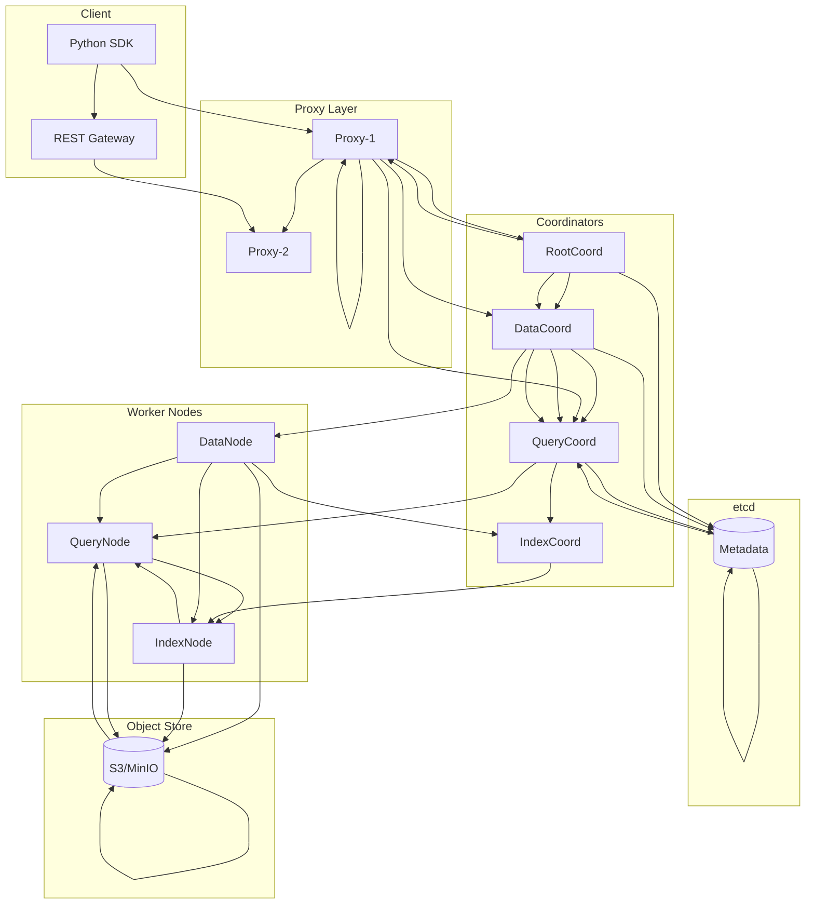
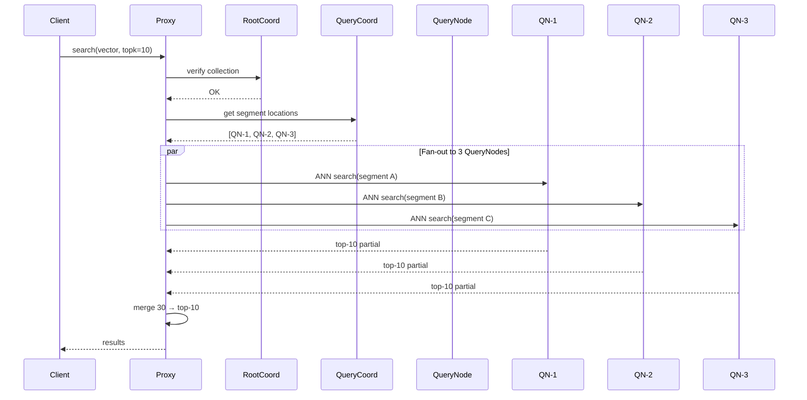
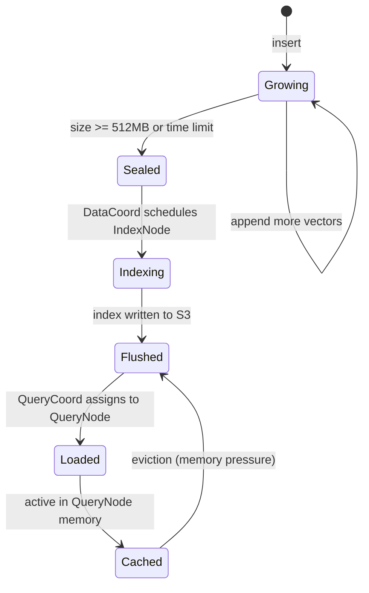
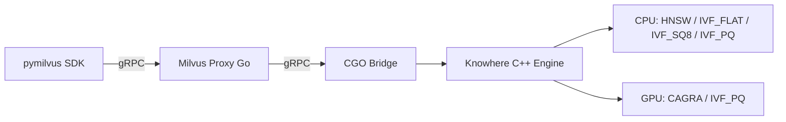

# ☁️ 07 - Milvus I - Distributed Architecture

## 🎯 Learning Objectives
- Master the role of every Milvus microservice (proxy, coordinators, nodes) and how they interact during ingestion and search
- Understand collection, partition, and shard abstractions and their impact on parallelism and latency
- Distinguish growing, sealed, and flushed segment states and the lifecycle transitions between them
- Learn how Knowhere (C++ search engine) bridges the gap between Python SDK and high-performance ANN execution
- Evaluate GPU index support (CAGRA, IVF-PQ on GPU) for large-scale workloads
- Perform resource planning (memory, index overhead, QueryNode sizing) for production deployments
- Leverage JSON payload support for flexible metadata without rigid schema changes

## Introduction

Milvus was born from the observation that monolithic databases collapse under billion-scale vector workloads. While single-node engines like [[02 - Indexing Algorithms Deep Dive|FAISS]] excel in research, production AI systems need horizontal scalability, rolling upgrades, and multi-tenant isolation. Milvus decouples storage from compute by splitting the system into stateless nodes and stateful coordinators, allowing independent scaling of ingestion, indexing, and query planes.

This architectural split echoes [[05 - Qdrant I - Architecture and Collections|Qdrant's distributed mode]], but Milvus pushes decoupling further: every responsibility has a dedicated service. In this note we dissect the anatomy of a Milvus cluster, trace the journey of a vector from SDK call to disk segment, and examine how GPU acceleration and scalar filtering turn raw ANN into a production-grade semantic search engine.

The architecture is complex — a production Milvus deployment runs 8+ distinct service types plus dependencies (etcd, MinIO/S3, Pulsar/Kafka). This is a significant operational tax compared to single-process engines, but it's what enables 10B+ vector workloads with rolling upgrades.

---

## 1. Milvus Cluster Anatomy

Before 2.0, Milvus was a single-process Python wrapper around FAISS. It worked for prototypes, but any restart meant reloading gigabytes of indices from disk, and concurrent writes blocked reads. The team rewrote the engine in Go (control plane) and C++ (execution plane) to achieve shared-nothing scalability.

The core insight: vector search has three fundamentally different resource profiles — write-heavy ingestion, CPU/GPU-intensive index building, and latency-sensitive querying. Collocating them creates noisy-neighbor problems. The explicit separation of concerns is the Milvus design philosophy.

| Service | Role | Scalability | Resource Profile |
|---------|------|------------|------------------|
| Proxy | Client connections, auth, gRPC/REST gateway | Horizontal, stateless | CPU + network |
| RootCoord | Metadata: collections, partitions, segments | Single active + standby | Memory (small) |
| DataCoord | Segment allocation, compaction scheduling | Single active | CPU + memory |
| QueryCoord | Map queries to QueryNodes, balance load | Single active | CPU |
| IndexCoord | Schedule index build jobs on IndexNodes | Single active | CPU |
| DataNode | Buffer writes, flush segments to S3 | Horizontal, stateful | Memory + I/O |
| QueryNode | Load segments, execute ANN search in memory | Horizontal, stateful | Memory-heavy |
| IndexNode | Build IVF/HNSW/CAGRA indices async | Horizontal, stateless | CPU/GPU |

**Query flow in detail:**

```
1. Client sends search(vector, top_k) to any Proxy via gRPC
2. Proxy contacts RootCoord to verify collection exists + RBAC check
3. Proxy queries QueryCoord for which QueryNodes hold the collection's segments
4. Proxy fans out the ANN search to all relevant QueryNodes (gRPC)
5. Each QueryNode runs Knowhere (C++) against its local segment cache
6. QueryNodes return partial top-k results to Proxy
7. Proxy merges, deduplicates, reranks, and returns final top-k to client
```

This handshake means a single search touches 3-20 pods depending on cluster size. The Proxy is the merge bottleneck — it must gather N × top_k results and rerank. At very high QPS, Proxies become CPU-bound.

```python
from pymilvus import connections, FieldSchema, CollectionSchema, DataType, Collection

connections.connect(alias="default", host="milvus-proxy", port="19530")

# FieldSchema: PRIMARY key is mandatory for deduplication during compaction
fields = [
    FieldSchema(name="doc_id", dtype=DataType.INT64, is_primary=True, auto_id=False),
    FieldSchema(name="embedding", dtype=DataType.FLOAT_VECTOR, dim=768),
    FieldSchema(name="category", dtype=DataType.VARCHAR, max_length=64),
]

# enable_dynamic_field=True allows ad-hoc metadata without schema migrations
schema = CollectionSchema(fields, description="Doc embeddings", enable_dynamic_field=True)
collection = Collection(name="docs", schema=schema)

# IVF_FLAT: CPU-friendly baseline; GPU_CAGRA requires GPU nodes
index_params = {"index_type": "IVF_FLAT", "metric_type": "COSINE", "params": {"nlist": 1024}}
collection.create_index(field_name="embedding", index_params=index_params)

# load() is mandatory — triggers QueryCoord to assign segments to QueryNodes
collection.load()

# Insert with dynamic JSON (any extra field becomes part of the payload)
collection.insert([
    [1, 2],
    [[0.12]*768, [0.34]*768],
    ["tech", "science"],
], _json={"source": "arxiv", "year": 2024})
```

⚠️ Forgetting `load()` causes "Collection not loaded" errors — QueryCoord has not assigned segments to QueryNodes. This is a Milvus-specific step absent in Qdrant and pgvector. 💡 *Load before you go.*

❌ **Antipattern**: Single Proxy with no LoadBalancer. The entire cluster becomes single-node under high concurrency.  
✅ **Correct**: At least 2 Proxies behind a Layer-4 LB, scaled with CPU-based HPA (target 70%).

❌ **Antipattern**: Using `auto_id=True` for all collections — loses the ability to deduplicate on retry. Network failures cause duplicate vectors.  
✅ **Correct**: Use deterministic client-generated IDs (UUIDv5 from content hash) for idempotent writes.

**Caso real — Zilliz Cloud**: Powers visual search for a top-5 global retailer with 2B product image embeddings (768-dim, COSINE). During flash sales, QueryNodes auto-scale from 20 to 120 pods; IndexNodes rebuild IVF-PQ indices nightly without affecting search latency. The cluster ingests 50M vectors/day across 3 AZs with Pulsar for WAL replication.





## 2. Segments, Shards, and Storage Lifecycle

In a distributed vector database, the unit of parallelism cannot be an entire collection — billions of vectors are too coarse. Milvus borrows the LSM-tree segment model from OLAP systems: data is appended to small, mutable **growing** segments. Once a segment reaches a size threshold (default 512 MB) or a time limit, it becomes **sealed** — immutable and eligible for indexing. After flushing to object storage, it becomes **flushed**, freeing local memory.

**Segment lifecycle:** `Growing → Sealed → Indexing → Flushed → Loaded → Cached`

This lifecycle solves the write-amplification problem of rebuilding a global index on every insert. Growing segments serve recent data via brute-force scan ($O(n)$ per segment); sealed segments use high-performance ANN indices ($O(\log n)$ or $O(1)$ lookup). A query transparently merges results from both paths.

**Shards** partition the write stream by hash of the primary key. Each shard produces its own independent segment chain, enabling horizontal write scaling.

$$\text{shard\_id} = \text{hash}(\text{primary\_key}) \mod \text{num\_shards}$$

**Partitions** are logical groupings (per-tenant, per-region) that allow data skipping during queries — similar to [[05 - Qdrant I - Architecture and Collections|Qdrant collections]] but lighter-weight because metadata stays centralized in RootCoord.

```python
from pymilvus import utility

# Partition: logical isolation for data skipping
collection.create_partition(partition_name="eu_users")
collection.create_partition(partition_name="us_users")
collection.insert(data=entities, partition_name="eu_users")

# Shard count: set at creation, never changed
collection = Collection(name="docs", schema=schema, shard_num=4)

# Compaction: merge small sealed segments into larger ones
collection.compact()
collection.wait_for_compaction_completed()

# Monitor segment count
stats = utility.collection_stats("docs")
print(f"Segments: {stats['row_count']} rows across {stats['segments']} segments")

# Scalar filter + vector search (hybrid query)
results = collection.search(
    data=[[0.15]*768],
    anns_field="embedding",
    param={"metric_type": "COSINE", "params": {"nprobe": 64}},
    limit=10,
    expr='category == "tech"',
    partition_names=["eu_users"],
    output_fields=["$meta"],
)
```

💡 `shard_num` rule of thumb: 2x DataNode count. Too few = write bottleneck; too many = tiny segments and high merge overhead during compaction.

❌ **Antipattern**: `shard_num=64` for a 1M-vector collection — creates hundreds of tiny sealed segments. QueryNodes spend more time merging partial results than searching.  
✅ **Correct**: Start with `shard_num=4`, monitor segment count. Add DataNodes before increasing shards.

❌ **Antipattern**: Running `compact()` during peak search traffic — compaction consumes I/O and CPU, spiking query latency.  
✅ **Correct**: Schedule compaction during low-traffic windows (e.g., 3 AM cron job).

❌ **Antipattern**: Expecting growing segments to be fast. Brute-force on unindexed data is $O(n)$ per growing segment.  
✅ **Correct**: Lower the seal threshold (from 512 MB to 128 MB) if fresh data needs low-latency search, or use a separate hot cache.

**Caso real — Shopee**: Real-time product deduplication. New listings flow into growing segments and are immediately searchable (brute-force) to catch duplicates within seconds. Nightly compaction seals and indexes the day's data, dropping p99 from 200ms to 20ms for historical lookups. They run 16 shards across 8 DataNodes.



## 3. Knowhere and GPU Index Acceleration

**Knowhere** is a C++ search engine that abstracts FAISS, HNSW, and GPU libraries behind a unified interface. It runs inside IndexNodes and QueryNodes, receiving serialized query plans from Go coordinators and returning result sets via gRPC. The CGO bridge is the critical performance path: marshaling vectors between Go and C++ heaps adds latency proportional to batch size.

NVIDIA's **CAGRA** (CUDA Approximate Graph Search) provides HNSW-like quality at 10-50x throughput on A100 GPUs. IVF-PQ on GPU accelerates coarse quantization for 100M+ batches. The key constraint: PCIe bandwidth dominates latency for small batches.

| Index Type | Memory vs Raw | Build Speed | Search Latency | Best For |
|-----------|--------------|-------------|---------------|----------|
| IVF_FLAT (CPU) | 1.0x | Fast | Moderate | CPU baseline, balanced |
| IVF_SQ8 (CPU) | 0.25x | Fast | Moderate | Memory-constrained CPU |
| IVF_PQ (CPU) | 0.1-0.3x | Moderate | Fast | Large-scale CPU (billions) |
| HNSW (CPU) | 1.5x | Slow | Fastest | Low-latency CPU (< 10ms) |
| GPU_CAGRA | 1.5x (GPU) | Fast | Fastest (batch) | GPU batch search |
| GPU_IVF_PQ | 0.3x (GPU) | Fast | Fast | GPU large-scale |

**Choosing CPU vs GPU**: A QueryNode with an A100 costs ~8x a CPU node but can replace 20 CPU QueryNodes for batch recommendation jobs. For interactive search (chatbot retrieval), CPU HNSW often wins on TCO.

```python
# GPU index (requires GPU-labeled nodes and milvus GPU build)
gpu_index = {
    "index_type": "GPU_CAGRA",
    "metric_type": "L2",
    "params": {"intermediate_graph_degree": 64, "graph_degree": 32, "itopk_size": 128},
}

# CPU memory-optimized index (4x memory reduction vs IVF_FLAT)
cpu_index = {
    "index_type": "IVF_SQ8",
    "metric_type": "COSINE",
    "params": {"nlist": 4096},
}

# nprobe: recall/latency tradeoff. nprobe = nlist → exact search
search_params = {"metric_type": "COSINE", "params": {"nprobe": 128}}
results = collection.search(
    data=[[0.1] * 768],
    anns_field="embedding",
    param=search_params,
    limit=10,
)
```

⚠️ Specifying `GPU_CAGRA` without GPU nodes causes index build failures. Verify node labels. 💡 *No GPU, no CAGRA.*

❌ **Antipattern**: GPU index for single-vector lookups — ~2ms PCIe transfer cost makes CPU HNSW faster for batches < 50 vectors.  
✅ **Correct**: GPU indices for batch workloads (100+ vectors/query), CPU HNSW for interactive search.

❌ **Antipattern**: Using IVF_SQ8 without profiling recall@k against IVF_FLAT — quantization noise can drop recall by 5-15%.  
✅ **Correct**: Profile on a validation set; compensate by increasing `nprobe` (e.g., 64 → 128).

```python
# Resource planning for QueryNode memory (float32 vectors)
VECTOR_DIM = 768
NUM_VECTORS = 50_000_000
BYTES_PER_VEC = VECTOR_DIM * 4  # float32 = 4 bytes
RAW_GB = (NUM_VECTORS * BYTES_PER_VEC) / (1024**3)  # ~143 GB
HNSW_OVERHEAD = RAW_GB * 1.5  # HNSW graph edges: ~50% overhead
IVF_OVERHEAD = RAW_GB * 1.1   # IVF inverted lists: ~10% overhead
HEADROOM = 1.3  # OS cache, other collections
print(f"HNSW RAM needed: {HNSW_OVERHEAD * HEADROOM:.1f} GB")
print(f"IVF RAM needed: {IVF_OVERHEAD * HEADROOM:.1f} GB")
```

**Caso real — Microsoft Bing**: GPU-accelerated Milvus for image search indexing. CAGRA indices are built on A100 clusters and served via QueryNodes with GPU passthrough. Batch queries (1,000 candidate images) achieve 5ms p99, enabling real-time visual duplicate detection across billions of crawled images. CPU HNSW handles single-image lookups in the same cluster.

**Caso real — ByteDance (TikTok)**: Uses IVF_PQ on CPU for video search at 10B+ vectors. PQ compression (M=64, nbits=8) reduces memory from 30 TB to 4 TB, fitting in a 16-node cluster instead of 64+ nodes. They pay a 3% recall drop vs IVF_FLAT but save $200k/month in infrastructure.



---

## 🎯 Key Takeaways
- Milvus decouples ingestion, indexing, and querying into independent microservices for elastic scaling.
- Segments transition Growing → Sealed → Flushed, balancing write throughput and query performance.
- Knowhere (C++) is the execution engine; GPU indices (CAGRA, IVF-PQ) excel at batch workloads but require GPU nodes.
- Scalar filtering and JSON payloads enable hybrid metadata + vector queries without schema migrations.
- Partitions and shards are orthogonal: partitions for logical isolation, shards for write scaling.
- Always `load()` before searching; monitor segment count and compaction to prevent query degradation.
- Use IVF_SQ8 or IVF_PQ for memory-constrained CPU clusters; HNSW for lowest-latency CPU search.
- Right-sizing requires estimating vector memory (dim × 4 bytes), index overhead, and headroom (1.3x).

## References
- Milvus Docs: https://milvus.io/docs
- Knowhere GitHub: https://github.com/zilliztech/knowhere
- CAGRA Paper (NVIDIA): https://arxiv.org/abs/2308.15136
- Attu GUI: https://github.com/zilliztech/attu
- [[05 - Qdrant I - Architecture and Collections]] — Compare shard/partition models
- [[02 - Indexing Algorithms Deep Dive]] — IVF, HNSW fundamentals underlying Knowhere
- [[06 - Qdrant II - Distributed and Cloud Deployment]] — Alternative distributed architecture patterns

## Query Time Parameter Tuning

The `nprobe` parameter (IVF) and `ef` parameter (HNSW) control the recall/latency tradeoff at query time. Increasing these values searches more candidates but increases latency.

$$\text{Recall@k} = \frac{|GNN_k \cap ANN_k|}{k}$$

**Tuning approach:**
1. Sweep `nprobe` from 8 to 256 on a validation set (1,000 queries, brute-force ground truth)
2. Plot recall vs. p99 latency — the elbow is your operating point
3. Monitor recall@k daily; if it drops, increase `nprobe` or rebuild the index

```python
import time
import numpy as np

profiles = []
for nprobe in [8, 16, 32, 64, 128, 256]:
    latencies = []
    for _ in range(100):
        t0 = time.perf_counter()
        collection.search([[0.1]*768], "embedding",
            param={"metric_type": "COSINE", "params": {"nprobe": nprobe}},
            limit=10)
        latencies.append((time.perf_counter() - t0) * 1000)
    profiles.append({
        "nprobe": nprobe,
        "p50": np.median(latencies),
        "p99": np.percentile(latencies, 99),
    })
print(profiles)
```

💡 Start with `nprobe=16` for development, increase to 32-128 for production. Each doubling adds ~20% latency for ~5% recall gain.

**Caso real — Pinterest**: Runs a nightly recall sweep across 500 random queries for their visual search index. If recall@10 drops below 0.88, an automated job increases `nprobe` from 64 to 128 and triggers a reindex with higher `nlist`. This self-healing loop maintains 0.91+ recall without human intervention.

## 📦 Código de compresión
```python
from pymilvus import connections, Collection, FieldSchema, CollectionSchema, DataType

connections.connect("default", host="localhost", port="19530")
fields = [
    FieldSchema("id", DataType.INT64, is_primary=True, auto_id=False),
    FieldSchema("vec", DataType.FLOAT_VECTOR, dim=128),
    FieldSchema("tag", DataType.VARCHAR, max_length=32),
]
schema = CollectionSchema(fields, enable_dynamic_field=True)
coll = Collection("summary", schema)
coll.create_index("vec", {"index_type": "IVF_FLAT", "metric_type": "COSINE", "params": {"nlist": 256}})
coll.load()
coll.insert([[1, 2, 3], [[0.1]*128, [0.2]*128, [0.3]*128], ["a", "b", "c"]])
res = coll.search(
    data=[[0.15]*128], anns_field="vec",
    param={"metric_type": "COSINE", "params": {"nprobe": 16}},
    limit=5, expr='tag == "a"', output_fields=["$meta"],
)
print(res)
```
