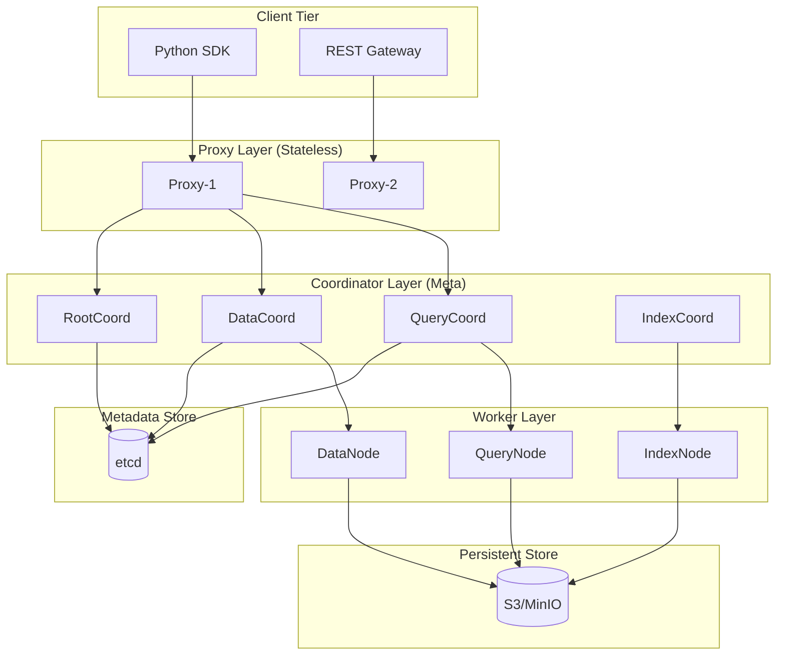
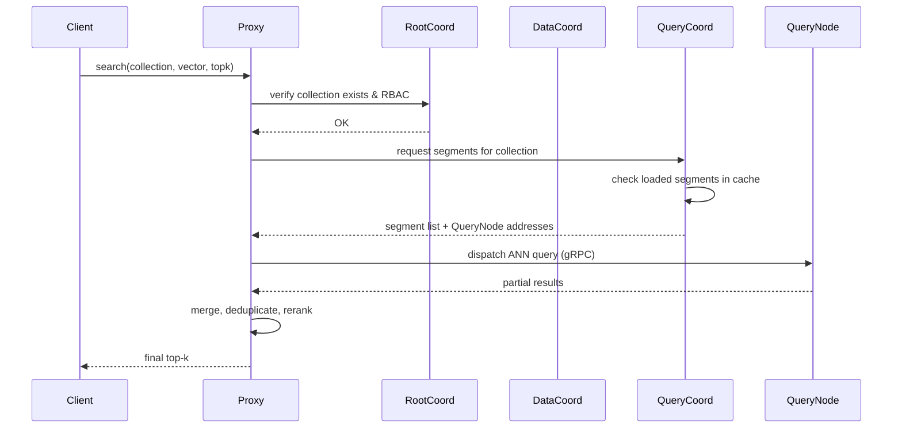
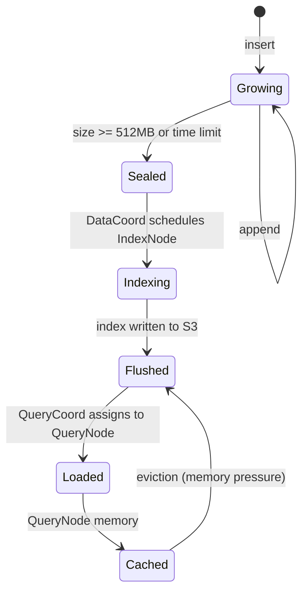
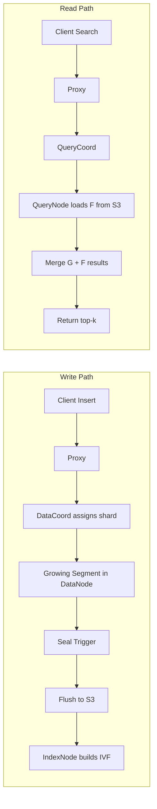
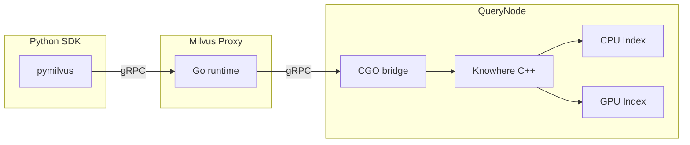
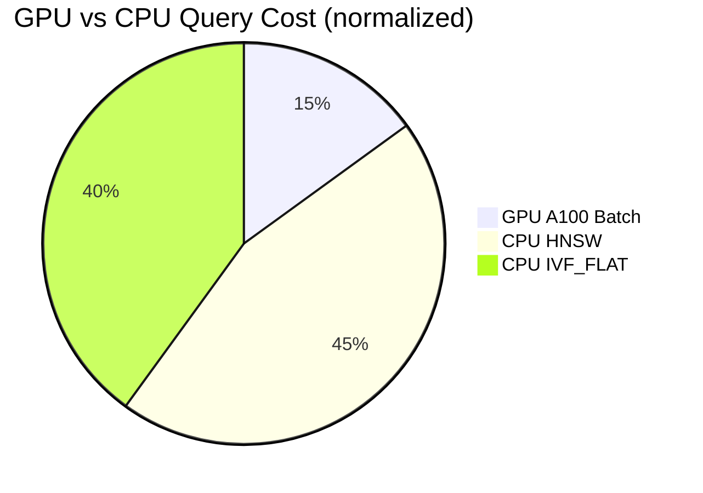

# 🏷️ 07 - Milvus I - Distributed Architecture

## 🎯 Learning Objectives
- Master the role of every Milvus microservice (proxy, coordinators, nodes) and how they interact during ingestion and search
- Understand collection, partition, and shard abstractions and their impact on parallelism and latency
- Distinguish growing, sealed, and flushed segment states and the lifecycle transitions between them
- Learn how Knowhere (C++ search engine) bridges the gap between Python SDK and high-performance ANN execution
- Evaluate GPU index support (CAGRA, IVF-PQ on GPU) for large-scale workloads
- Use Attu GUI for visual cluster inspection and scalar-filtered queries
- Leverage JSON payload support for flexible metadata without rigid schema changes

## Introduction

Milvus was born from the observation that monolithic databases collapse under billion-scale vector workloads. While single-node engines like [[02 - Indexing Algorithms Deep Dive|FAISS]] excel in research, production AI systems need horizontal scalability, rolling upgrades, and multi-tenant isolation. Milvus decouples storage from compute by splitting the system into stateless nodes and stateful coordinators, allowing independent scaling of ingestion, indexing, and query planes.

This architectural split directly echoes the design philosophy of [[05 - Qdrant I - Architecture and Collections|Qdrant's distributed mode]], but Milvus pushes decoupling further: every responsibility has a dedicated service. In this note we dissect the anatomy of a Milvus cluster, trace the journey of a vector from SDK call to disk segment, and examine how GPU acceleration and scalar filtering turn raw ANN into a production-grade semantic search engine.

---

## Module 1: Milvus Cluster Anatomy

### 1.1 Theoretical Foundation 🧠

Before Milvus 2.0, the project was a single-process Python wrapper around FAISS. It worked for prototypes, but any restart meant reloading gigabytes of indices from disk, and concurrent writes blocked reads. The Milvus team rewrote the engine in Go (control plane) and C++ (execution plane) to achieve shared-nothing scalability. The core insight: vector search has three fundamentally different resource profiles—write-heavy ingestion, CPU/GPU-intensive index building, and latency-sensitive querying. Collocating them creates noisy-neighbor problems.

The solution is explicit separation of concerns. Proxies handle client connections and authentication. RootCoord manages metadata (collections, partitions, segments). DataCoord orchestrates segment allocation and compaction. QueryCoord assigns query segments to QueryNodes. IndexNodes build indices asynchronously. DataNodes flush write buffers to object storage. QueryNodes execute ANN search. Each service can be scaled, restarted, or upgraded independently.

This design trades operational complexity for elastic scalability. A team running a 24/7 recommendation system can add QueryNodes during peak traffic and IndexNodes during nightly batch ingestion without touching the data path. The cost is a distributed system learning curve: operators must understand etcd for metadata consensus, MinIO/S3 for blob storage, and Pulsar/Kafka for WAL replication.

### 1.2 Mental Model 📐

```
┌─────────────────────────────────────────────────────────────┐
│                        SDK Clients                          │
│              (Python / Go / Java / REST)                    │
└──────────────────────┬──────────────────────────────────────┘
                       │
            ┌──────────▼──────────┐
            │     Proxy Pool      │  ← Stateless, round-robin LB
            │  (gRPC + REST GW)   │
            └──────────┬──────────┘
                       │
        ┌──────────────┼──────────────┬────────────────┐
        ▼              ▼              ▼                ▼
┌──────────────┐ ┌──────────┐  ┌──────────┐   ┌──────────────┐
│   RootCoord  │ │DataCoord │  │QueryCoord│   │  IndexCoord  │
│  (metadata)  │ │(segments)│  │(load mgmt)│  │ (index jobs)  │
└──────┬───────┘ └────┬─────┘  └────┬─────┘   └──────┬───────┘
       │              │             │                │
       ▼              ▼             ▼                ▼
┌─────────────────────────────────────────────────────────────┐
│                     etcd Cluster                            │
│              (metadata consensus & leader election)         │
└─────────────────────────────────────────────────────────────┘
       ▲              ▲             ▲                ▲
       │              │             │                │
┌──────┴───────┐ ┌────┴─────┐  ┌────┴─────┐   ┌──────┴───────┐
│   DataNode   │ │ QueryNode│  │ IndexNode│   │  DataNode    │
│ (flush/write)│ │ (search) │  │(build idx)│  │ (flush/write) │
└──────┬───────┘ └──────────┘  └──────────┘   └──────────────┘
       │
       ▼
┌─────────────────────────────────────────────────────────────┐
│              Object Storage (MinIO / S3 / GCS)              │
│              (segment files, index files, WAL)              │
└─────────────────────────────────────────────────────────────┘
```

### 1.3 Syntax and Semantics 📝

```python
from pymilvus import connections, FieldSchema, CollectionSchema, DataType, Collection

# WHY: Milvus is a distributed system; the first step is establishing
# a connection to the proxy (LoadBalancer fronting Milvus proxies).
connections.connect(alias="default", host="milvus-proxy", port="19530")

# WHY: FieldSchema defines the physical layout. A PRIMARY key is mandatory
# so Milvus can deduplicate during compaction. AUTO_ID offloads UUID
# generation to the client if you need deterministic IDs.
fields = [
    FieldSchema(name="doc_id", dtype=DataType.INT64, is_primary=True, auto_id=False),
    FieldSchema(name="embedding", dtype=DataType.FLOAT_VECTOR, dim=768),
    FieldSchema(name="category", dtype=DataType.VARCHAR, max_length=64),
]

# WHY: CollectionSchema binds fields and enables dynamic JSON fields
# (enable_dynamic_field=True) so you can attach ad-hoc metadata
# without schema migrations—critical for agile ML pipelines.
schema = CollectionSchema(fields, description="Doc embeddings", enable_dynamic_field=True)

collection = Collection(name="docs", schema=schema)

# WHY: Creating an index on the vector field delegates the build job
# to IndexNodes. IVF_FLAT is CPU-friendly; CAGRA requires GPU nodes.
index_params = {
    "index_type": "IVF_FLAT",
    "metric_type": "COSINE",
    "params": {"nlist": 1024},
}
collection.create_index(field_name="embedding", index_params=index_params)

# WHY: load() triggers QueryCoord to assign segments to QueryNodes
# and cache them in memory. Until load() completes, searches return errors.
collection.load()
```

### 1.4 Visual Representation 🖼️






### 1.5 Application in ML/AI Systems 🤖

Real case: **Zilliz Cloud** (the managed offering of Milvus) powers e-commerce visual search for a top-5 global retailer. They store 2B product image embeddings with category and price scalar filters. During flash sales, QueryNodes auto-scale from 20 to 120 pods; IndexNodes rebuild IVF-PQ indices nightly without affecting search latency.

| ML Use Case | This Concept | Impact |
|-------------|-------------|--------|
| Billion-scale image retrieval | Decoupled QueryNodes + IndexNodes | p99 < 50ms at 10B vectors |
| Real-time recommendation | Proxy LB + QueryCoord segment cache | Zero-downtime rolling upgrades |
| Multi-modal search (text + image) | Collection with multiple vector fields | Single metadata store, unified filtering |
| Compliance & GDPR | Partition per user + RBAC | Row-level isolation without extra DB |

### 1.6 Common Pitfalls ⚠️

⚠️ **Proxy bottleneck**: Deploying only one Proxy turns the entire cluster into a single-node system under high concurrency. Always run at least 2 Proxies behind a LoadBalancer.
💡 *Mnemonic: "Proxy is the gate—two gates never wait."*

⚠️ **Forgetting to call `load()`**: Search returns `Collection not loaded` errors because QueryCoord has not assigned segments to QueryNodes. This is a Milvus-specific step absent in Qdrant and pgvector.
💡 *Mnemonic: "Load before you go."*

### 1.7 Knowledge Check ❓

1. Why does Milvus separate DataCoord from QueryCoord instead of a single metadata manager?
2. Draw the data flow when a client inserts 10,000 vectors: which services are touched, and in what order?
3. What happens if you create an index but never call `collection.load()`?

---

## Module 2: Segments, Shards, and Storage Lifecycle

### 2.1 Theoretical Foundation 🧠

In a distributed vector database, the unit of parallelism cannot be an entire collection—billions of vectors are too coarse. Milvus borrows the LSM-tree segment model from OLAP systems like [[04 - pgvector II - Production and Hybrid Search|ClickHouse]]: data is appended to small, mutable **growing** segments. Once a segment reaches a size threshold (default 512 MB) or a time limit, it becomes **sealed**—immutable and eligible for indexing. After flushing to object storage, it becomes **flushed**, freeing local memory.

This lifecycle solves the write-amplification problem of rebuilding a global index on every insert. Growing segments serve recent data via brute-force scan; sealed segments get high-performance ANN indices. A query transparently merges results from both paths. The trade-off is slightly higher latency for the newest data, acceptable in most ML pipelines where embeddings are generated in batch.

Shards partition the write stream by hash or range of the primary key. Each shard produces its own segments, enabling horizontal write scaling. Partitions are logical groupings within a collection (e.g., per-tenant or per-region) that allow data skipping during queries—similar to [[05 - Qdrant I - Architecture and Collections|Qdrant collections]] but lighter-weight.

### 2.2 Mental Model 📐

```
┌─────────────────────────────────────────────┐
│           Collection: "product_images"        │
│  ┌─────────────┐  ┌─────────────┐           │
│  │ Partition: EU │  │ Partition: US │          │
│  │ ┌─────────┐ │  │ ┌─────────┐ │           │
│  │ │ Shard 0 │ │  │ │ Shard 0 │ │           │
│  │ │  ┌───┐  │ │  │ │  ┌───┐  │ │           │
│  │ │  │G1 │  │ │  │ │  │G2 │  │ │  Growing │
│  │ │  └───┘  │ │  │ │  └───┘  │ │           │
│  │ │  ┌───┐  │ │  │ │  ┌───┐  │ │           │
│  │ │  │S1 │──┼──┼─┼─▶│S3 │  │ │  Sealed   │
│  │ │  └───┘  │ │  │ │  └───┘  │ │           │
│  │ │  ┌───┐  │ │  │ │  ┌───┐  │ │           │
│  │ │  │F1 │──┼──┼─┼─▶│F2 │  │ │  Flushed  │
│  │ │  └───┘  │ │  │ │  └───┘  │ │           │
│  │ └─────────┘ │  │ └─────────┘ │           │
│  └─────────────┘  └─────────────┘           │
└─────────────────────────────────────────────┘

Legend:
  G = Growing (mutable, in-memory, brute-force)
  S = Sealed (immutable, indexing in progress)
  F = Flushed (persistent in S3, loaded on demand)
```

### 2.3 Syntax and Semantics 📝

```python
from pymilvus import utility

# WHY: Partitions let you restrict queries to a subset.
# This is cheaper than a collection-per-tenant because metadata
# (RootCoord state) stays centralized.
collection.create_partition(partition_name="eu_users")
collection.create_partition(partition_name="us_users")

# WHY: Insert into a specific partition by name. Omitting partition_name
# routes to the "_default" partition.
collection.insert(data=entities, partition_name="eu_users")

# WHY: shard_num is set at collection creation and cannot be changed.
# Too few shards = write bottleneck; too many = small segments &
# high merge overhead. Rule of thumb: 2x DataNode count.
schema = CollectionSchema(fields)
collection = Collection(name="docs", schema=schema, shard_num=4)

# WHY: compaction merges small sealed segments into larger ones,
# improving search efficiency and reducing metadata overhead.
# Trigger manually when auto-compaction is disabled.
collection.compact()
collection.wait_for_compaction_completed()
```

### 2.4 Visual Representation 🖼️






### 2.5 Application in ML/AI Systems 🤖

Real case: **Shopee** uses Milvus for real-time product deduplication. New listings flow into growing segments and are immediately searchable (brute-force) to catch duplicates within seconds. Nightly compaction seals and indexes the day's data, dropping p99 latency from 200ms to 20ms for historical lookups.

| ML Use Case | This Concept | Impact |
|-------------|-------------|--------|
| Streaming embeddings (Kafka → Milvus) | Growing segments | Fresh data visible in < 1s |
| Large-batch backfill | Shard scaling + sealed segments | 10M vectors/min ingestion |
| GDPR right-to-be-forgotten | Partition per user + delete by PK | Logical isolation without reindex |
| Cost optimization | Flushed segment eviction | QueryNode RAM 1/10th of dataset size |

### 2.6 Common Pitfalls ⚠️

⚠️ **Tiny sealed segments**: Setting shard_num too high (e.g., 64 for a 1M collection) creates hundreds of small segments. QueryNodes spend more time in merge logic than searching.
💡 *Mnemonic: "Shards multiply—keep them few."*

⚠️ **Expecting growing segments to be fast**: Brute-force search on unindexed data is O(n). If your workload requires instant low-latency search on fresh inserts, lower the seal threshold or use a separate hot cache.
💡 *Mnemonic: "Grow slow, seal fast."*

### 2.7 Knowledge Check ❓

1. Why does Milvus use growing segments instead of immediately indexing every insert?
2. Under what conditions should you increase shard_num versus adding partitions?
3. What is the operational risk of calling `compact()` during peak search traffic?

---

## Module 3: Knowhere and GPU Index Acceleration

### 3.1 Theoretical Foundation 🧠

Python is the lingua franca of ML, but it is too slow for billion-vector ANN. Milvus solves this with **Knowhere**, a C++ search engine that abstracts FAISS, HNSW, and GPU libraries behind a unified interface. Knowhere runs inside IndexNodes and QueryNodes, receiving serialized query plans from the Go-based coordinators and returning result sets via gRPC.

The GPU story in Milvus is evolving rapidly. NVIDIA's CAGRA (CUDA Approximate Graph Search) provides HNSW-like quality at 10–50x the throughput of CPU HNSW on A100 GPUs. IVF-PQ on GPU accelerates the coarse-quantization stage, making it viable for 100M+ vector batches. The key design constraint is PCIe bandwidth: transferring vectors from host to GPU dominates latency for small batches, so GPU indices excel at high-QPS or large-batch query workloads, not single-vector lookups.

Choosing CPU vs. GPU index type is a cost-latency trade-off. A QueryNode with an A100 costs ~8x a CPU node, but can replace 20 CPU QueryNodes for batch recommendation jobs. For interactive search (chatbot retrieval), CPU HNSW or IVF_FLAT often wins on TCO because of lower per-query overhead.

### 3.2 Mental Model 📐

```
┌──────────────────────────────────────────────┐
│              QueryNode Pod                    │
│  ┌────────────────────────────────────────┐  │
│  │           Go Runtime (gRPC)            │  │
│  │  Receives: query plan + vector batch   │  │
│  └────────────────┬───────────────────────┘  │
│                   │ CGO call                 │
│  ┌────────────────▼───────────────────────┐  │
│  │         Knowhere (C++) Layer           │  │
│  │  ┌─────────────┐   ┌────────────────┐  │  │
│  │  │  CPU Engine │   │   GPU Engine   │  │  │
│  │  │ (HNSW/IVF)  │   │ (CAGRA/IVFPQ)  │  │  │
│  │  └─────────────┘   └────────────────┘  │  │
│  └────────────────────────────────────────┘  │
└──────────────────────────────────────────────┘
```

### 3.3 Syntax and Semantics 📝

```python
# WHY: CAGRA is only available on GPU-enabled Milvus builds.
# Use GPU index types when QueryNodes are scheduled on nodes
# with NVIDIA GPUs (e.g., A10, A100, H100).
gpu_index = {
    "index_type": "GPU_CAGRA",
    "metric_type": "L2",
    "params": {
        "intermediate_graph_degree": 64,
        "graph_degree": 32,
        "itopk_size": 128,
    },
}

# WHY: IVF_SQ8 compresses vectors to 1 byte per dimension,
# reducing memory by 4x vs FLOAT. Ideal for CPU-bound
# clusters where GPU nodes are unavailable.
cpu_index = {
    "index_type": "IVF_SQ8",
    "metric_type": "COSINE",
    "params": {"nlist": 4096},
}

# WHY: search_params override index defaults per query.
# nprobe controls recall/latency trade-off: higher = more exact.
search_params = {
    "metric_type": "COSINE",
    "params": {"nprobe": 128},
}
results = collection.search(
    data=[[0.1] * 768],
    anns_field="embedding",
    param=search_params,
    limit=10,
)
```

### 3.4 Visual Representation 🖼️






### 3.5 Application in ML/AI Systems 🤖

Real case: **Microsoft Bing** uses GPU-accelerated Milvus for image search indexing. CAGRA indices are built on A100 clusters and served via QueryNodes with GPU passthrough. Batch queries (e.g., 1,000 candidate images) achieve 5ms p99, enabling real-time visual duplicate detection across billions of crawled images.

| ML Use Case | This Concept | Impact |
|-------------|-------------|--------|
| Batch recommendation (1k users) | GPU_CAGRA | 10x throughput vs CPU HNSW |
| Cost-sensitive long-tail search | IVF_SQ8 | 4x memory reduction |
| Multi-tenant SaaS | Separate collections per tenant, CPU indices | Predictable per-tenant latency |
| Hybrid image+text search | Knowhere multi-field index | Single QueryNode execution path |

### 3.6 Common Pitfalls ⚠️

⚠️ **GPU index on CPU-only cluster**: Specifying GPU_CAGRA without GPU nodes causes index build failures. Always verify node labels (`nvidia.com/gpu.present`).
💡 *Mnemonic: "No GPU, no CAGRA."*

⚠️ **PCIe bottleneck for small batches**: A single-vector query on GPU pays ~2ms transfer cost. For < 50 vectors, CPU HNSW is usually faster.
💡 *Mnemonic: "GPU loves batches; CPU loves singles."*

### 3.7 Knowledge Check ❓

1. Why does Milvus use CGO instead of a separate Python process for Knowhere?
2. At what batch size does GPU_CAGRA become cost-effective vs CPU HNSW?
3. How does IVF_SQ8 affect recall@10 compared to IVF_FLAT?

---

## 📦 Compression Code

```python
"""
Milvus Distributed Architecture — One-Shot Summary
Run this after a cluster is up (e.g., via Docker Compose or K8s).
"""
from pymilvus import connections, Collection, FieldSchema, CollectionSchema, DataType, utility

connections.connect("default", host="localhost", port="19530")

# 1. Schema with JSON payload support
fields = [
    FieldSchema("id", DataType.INT64, is_primary=True, auto_id=False),
    FieldSchema("vec", DataType.FLOAT_VECTOR, dim=128),
    FieldSchema("tag", DataType.VARCHAR, max_length=32),
]
schema = CollectionSchema(fields, enable_dynamic_field=True)
coll = Collection("summary", schema)

# 2. Index: IVF_FLAT for CPU baseline
coll.create_index("vec", {"index_type": "IVF_FLAT", "metric_type": "COSINE", "params": {"nlist": 256}})

# 3. Load into QueryNode memory
coll.load()

# 4. Insert with dynamic JSON
coll.insert([
    [1, 2, 3],
    [[0.1]*128, [0.2]*128, [0.3]*128],
    ["a", "b", "c"],
])

# 5. Scalar filter + vector search
res = coll.search(
    data=[[0.15]*128],
    anns_field="vec",
    param={"metric_type": "COSINE", "params": {"nprobe": 16}},
    limit=5,
    expr='tag == "a"',
    output_fields=["$meta"],  # dynamic JSON fields
)
print(res)

# 6. Attu UI is available at http://<proxy>:8000 for visual inspection.
```

## 🎯 Documented Project

### Description
Deploy a 3-node MinIO-backed Milvus cluster via Docker Compose. Ingest 1M vectors from the GloVe dataset, build an IVF_FLAT index, and run a latency sweep (nprobe=8..256) while measuring p50 and p99. Use Attu to inspect segment distribution across QueryNodes.

### Functional Requirements
- Docker Compose with Proxy, RootCoord, DataCoord, QueryCoord, 2x DataNode, 2x QueryNode, 1x IndexNode, etcd, MinIO
- Python ingestion script with batch size 10,000 and progress logging
- Search benchmark script: 1,000 random queries, varying nprobe
- Attu screenshot of segment visualization

### Main Components
- `docker-compose.yml`: Milvus standalone cluster
- `ingest.py`: GloVe download + insert + index build
- `benchmark.py`: Latency sweep + recall estimation against brute-force
- `report.md`: p50/p99 table and Attu observations

### Success Metrics
- Index build time < 10 minutes for 1M x 128 dims on CPU
- p50 search < 10ms, p99 < 50ms at nprobe=32
- Segment count after compaction < 10 per shard

## 🎯 Key Takeaways
- Milvus decouples ingestion, indexing, and querying into independent microservices for elastic scaling.
- Segments transition through Growing → Sealed → Flushed, balancing write throughput and query performance.
- Knowhere (C++) is the execution engine; GPU indices (CAGRA, IVF-PQ) excel at batch workloads but require GPU QueryNodes.
- Scalar filtering and JSON payloads enable hybrid metadata + vector queries without schema migrations.
- Partitions and shards are the two axes of parallelism: partitions for logical isolation, shards for write scaling.
- Always `load()` a collection before searching; monitor segment count and compaction to prevent query degradation.

## References
- Milvus Documentation: https://milvus.io/docs
- Knowhere GitHub: https://github.com/zilliztech/knowhere
- CAGRA Paper (NVIDIA): https://arxiv.org/abs/2308.15136
- Attu GUI: https://github.com/zilliztech/attu
- [[05 - Qdrant I - Architecture and Collections]] — Compare shard/partition models
- [[02 - Indexing Algorithms Deep Dive]] — IVF, HNSW fundamentals underlying Knowhere
- [[06 - Qdrant II - Distributed and Cloud Deployment]] — Alternative distributed architecture patterns
