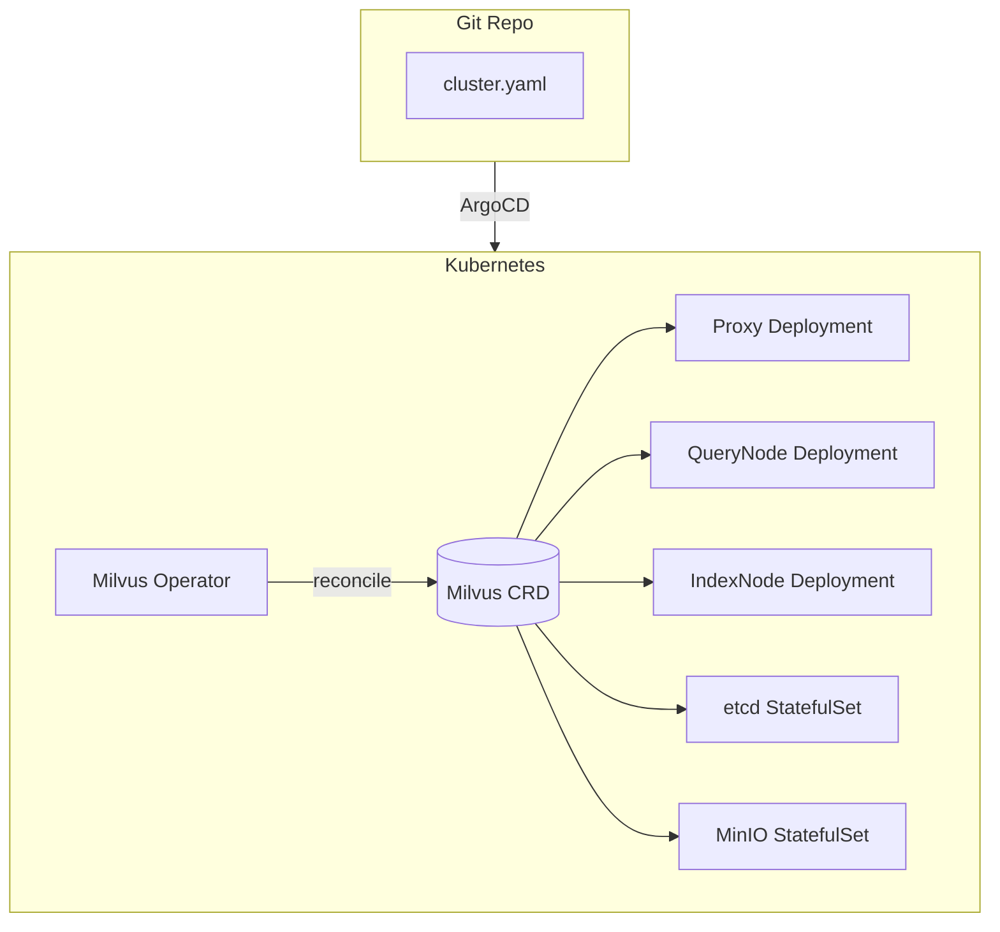
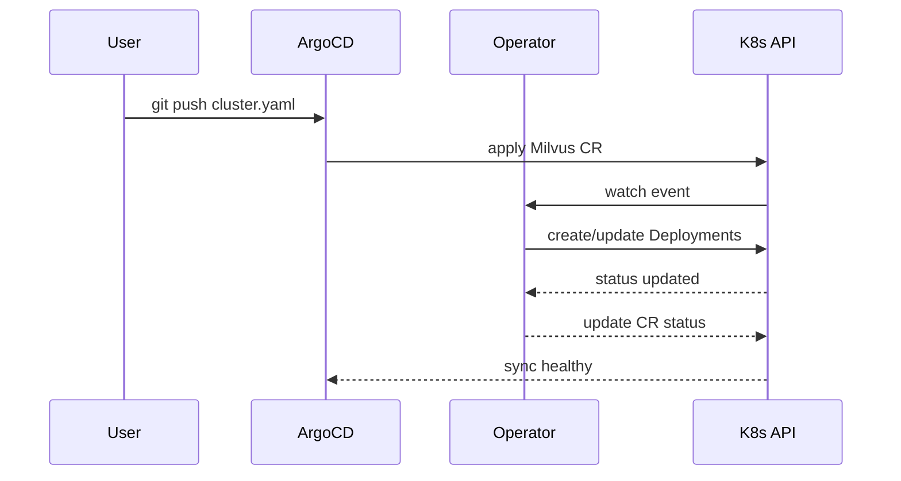
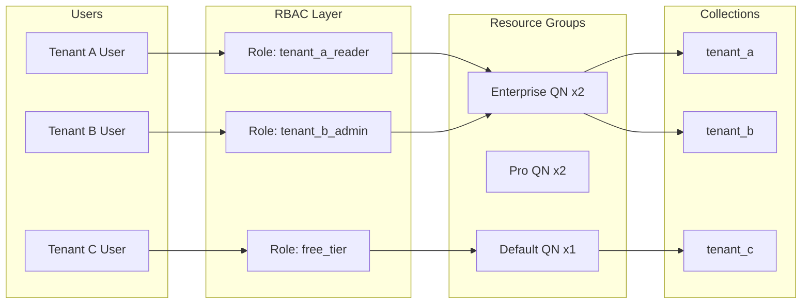
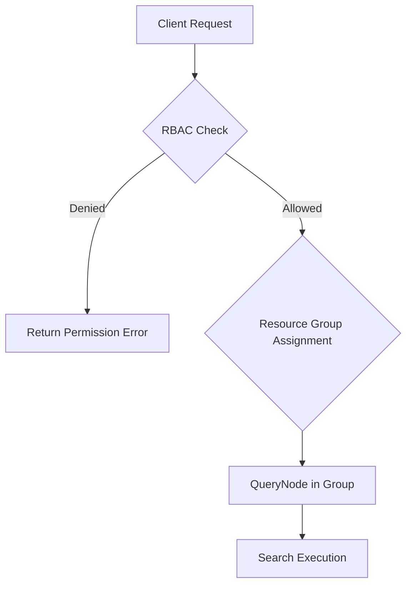
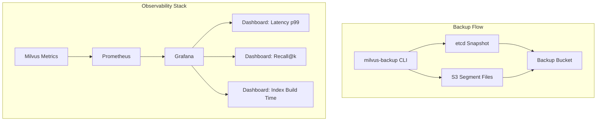
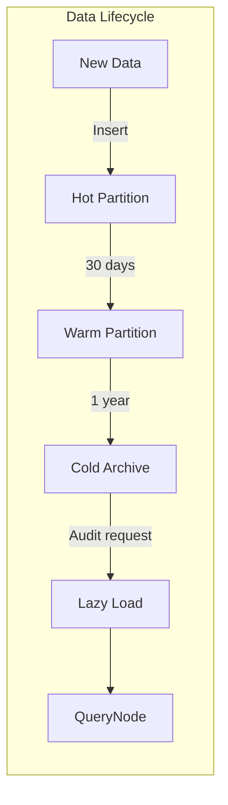

# 🏷️ 08 - Milvus II - Kubernetes and Multi-tenancy

## 🎯 Learning Objectives
- Deploy Milvus clusters declaratively using the Milvus Operator and Helm charts on Kubernetes
- Implement multi-tenant isolation with resource groups, RBAC, and partition-based tenant separation
- Design tiered storage strategies (hot/warm/cold) to balance cost and latency across data lifecycles
- Automate backup and restore workflows using `milvus-backup` for disaster recovery
- Build observability dashboards with Prometheus and Grafana to track cluster health and query performance
- Perform resource planning for CPU, memory, GPU, and disk IOPS to right-size production deployments

## Introduction

Running Milvus on a single Docker Compose node is sufficient for prototyping, but production ML systems demand orchestrated deployments that survive node failures, scale with traffic, and enforce security boundaries between teams. Kubernetes has become the de facto substrate for stateful ML infrastructure, and Milvus provides first-class K8s support through both a custom Operator and community Helm charts.

This note transitions from architecture theory to operational practice. We explore how to map Milvus microservices onto Kubernetes primitives (Deployments, StatefulSets, PersistentVolumeClaims), isolate tenants without sacrificing density, and implement lifecycle policies that move aging vectors to cheaper storage. The patterns here complement [[06 - Qdrant II - Distributed and Cloud Deployment|Qdrant's Kubernetes patterns]] and [[03 - pgvector I - Core Operations and Indexing|pgvector's simpler RDS-style operations]], giving you a complete spectrum of deployment complexity from Postgres to full microservice meshes.

---

## Module 1: Kubernetes Deployment with Milvus Operator

### 1.1 Theoretical Foundation 🧠

The Milvus Operator follows the Kubernetes Operator pattern: a controller loop watches Custom Resources (CRs) and reconciles the actual cluster state to match the desired state declared in YAML. This is superior to Helm for day-2 operations because the Operator can handle rolling upgrades, certificate rotation, and rolling restarts without manual intervention. Helm, by contrast, is a templating engine—excellent for initial installation but less capable of orchestrating complex transitions.

The Operator introduces the `Milvus` CRD, which encapsulates the entire topology: proxy replicas, coordinator resource limits, etcd and MinIO sub-chart configuration, and even TLS secrets. By treating the cluster as a single declarative object, GitOps workflows (ArgoCD, Flux) become straightforward. A single `git push` can trigger a canary rollout of a new Milvus version across staging and production.

However, the abstraction comes with a learning curve. Debugging a failing pod requires understanding the Operator's reconciliation logic, reading events from the Operator pod itself, and occasionally examining the generated ConfigMaps. Operators also increase cluster-wide resource footprint because they run as a permanent control-plane component.

### 1.2 Mental Model 📐

```
┌─────────────────────────────────────────────────────────────┐
│                     Kubernetes Cluster                      │
│  ┌─────────────────────────────────────────────────────┐   │
│  │              Milvus Operator Pod                    │   │
│  │   Watches: Milvus CRD                               │   │
│  │   Reconciles: Deployments, Services, PVCs, Secrets  │   │
│  └──────────────────────┬──────────────────────────────┘   │
│                         │ creates/updates                  │
│  ┌──────────────────────┼──────────────────────────────┐   │
│  │     Milvus Custom Resource (my-milvus)              │   │
│  │  ┌────────┐ ┌────────┐ ┌────────┐ ┌──────────────┐  │   │
│  │  │ Proxy  │ │QueryCo │ │DataCo  │ │  RootCoord   │  │   │
│  │  │  x3    │ │  x1    │ │  x1    │ │    x1        │  │   │
│  │  └──┬─────┘ └────────┘ └────────┘ └──────────────┘  │   │
│  │     │                                                │   │
│  │  ┌──┴──┐ ┌─────────┐ ┌─────────┐ ┌──────────────┐  │   │
│  │  │QueryN │ │DataNode │ │IndexNode│ │  Attu (opt)  │  │   │
│  │  │  x4   │ │   x2    │ │   x2    │ │    x1        │  │   │
│  │  └──────┘ └─────────┘ └─────────┘ └──────────────┘  │   │
│  └─────────────────────────────────────────────────────┘   │
│  ┌─────────────────────────────────────────────────────┐   │
│  │  Dependencies (etcd StatefulSet, MinIO StatefulSet) │   │
│  └─────────────────────────────────────────────────────┘   │
└─────────────────────────────────────────────────────────────┘
```

### 1.3 Syntax and Semantics 📝

```yaml
# milvus-cluster.yaml
# WHY: The Milvus CRD is the single source of truth for the entire
# cluster topology. Changing proxy.replicas triggers a rolling update.
apiVersion: milvus.io/v1beta1
kind: Milvus
metadata:
  name: my-milvus
spec:
  mode: cluster
  components:
    proxy:
      replicas: 3
      resources:
        limits:
          cpu: "2"
          memory: 4Gi
    queryNode:
      replicas: 4
      resources:
        limits:
          cpu: "8"
          memory: 32Gi
    indexNode:
      replicas: 2
      resources:
        limits:
          cpu: "16"
          memory: 64Gi
          nvidia.com/gpu: "1"  # GPU index builds
  dependencies:
    etcd:
      inCluster:
        values:
          replicaCount: 3
    storage:
      inCluster:
        values:
          mode: distributed
          replicas: 4
  config:
    milvus:
      log:
        level: info
```

```bash
# WHY: The Operator must be installed first; it then watches
# all namespaces (or a specific one) for Milvus CRs.
kubectl apply -f https://raw.githubusercontent.com/zilliztech/milvus-operator/main/deploy/manifests/deployment.yaml

# WHY: Apply the CR. The Operator creates pods, services, and PVCs.
kubectl apply -f milvus-cluster.yaml

# WHY: Watch reconciliation events to catch resource quota
# issues or image pull failures early.
kubectl logs -n milvus-operator -l app=milvus-operator -f
```

### 1.4 Visual Representation 🖼️






### 1.5 Application in ML/AI Systems 🤖

Real case: **eBay** deploys Milvus via the Operator across three GKE regions. Each region holds a full cluster with async replication for disaster recovery. GitOps (ArgoCD) manages version rollouts; canary searches are routed to a dedicated Proxy Deployment before full promotion.

| ML Use Case | This Concept | Impact |
|-------------|-------------|--------|
| Multi-region semantic search | Operator + regional clusters | RPO < 5 min, RTO < 15 min |
| CI/CD for embedding models | GitOps + Milvus CRD | Model rollback = config rollback |
| Autoscaling search tier | HPA on QueryNode CPU | Cost aligned with traffic |
| GPU batch index builds | IndexNode GPU node pool | Nightly index builds in < 30 min |

### 1.6 Common Pitfalls ⚠️

⚠️ **etcd resource starvation**: etcd is the metadata brain; running it on burst CPU nodes causes leader election flapping and cluster unavailability. Always pin etcd to dedicated nodes or use a managed etcd service.
💡 *Mnemonic: "etcd is the heart—don't starve it."*

⚠️ **Forgetting storage class**: MinIO distributed mode requires `ReadWriteOnce` or `ReadWriteMany` PVCs. Using the default storage class with slow disks creates index-build I/O bottlenecks.
💡 *Mnemonic: "Storage class defines speed class."*

### 1.7 Knowledge Check ❓

1. What is the difference between the Milvus Operator and Helm in terms of day-2 operations?
2. Why does the Operator use a CRD instead of standard Deployment manifests?
3. How would you perform a zero-downtime Milvus version upgrade using the Operator?

---

## Module 2: Multi-tenancy with Resource Groups and RBAC

### 2.1 Theoretical Foundation 🧠

Multi-tenancy in vector databases is hard because embeddings are memory-hungry, and noisy neighbors (one tenant running a heavy batch query) can starve others. Milvus addresses this at two levels: **resource groups** (physical isolation of QueryNodes) and **RBAC** (logical isolation of access). Resource groups bind specific QueryNodes to specific collections or partitions, guaranteeing CPU and memory quotas. RBAC controls which users can read, write, or manage which collections.

This dual-layer model is analogous to Kubernetes namespaces plus ResourceQuotas. A SaaS platform serving 500 tenants might create 5 resource groups (each with 2 QueryNodes) and assign tenants to groups by tier (free, pro, enterprise). Within a group, RBAC ensures Tenant A cannot query Tenant B's collection. Partitions can further isolate tenants within a single collection, avoiding the overhead of hundreds of collections in RootCoord.

The trade-off is operational complexity: resource groups require manual rebalancing when tenants grow, and RBAC policies must be version-controlled to prevent privilege creep. Unlike [[05 - Qdrant I - Architecture and Collections|Qdrant's built-in multitenancy via payload filtering]], Milvus prefers physical separation for strict SLAs.

### 2.2 Mental Model 📐

```
┌─────────────────────────────────────────────────────────────┐
│                     Milvus Cluster                          │
│  ┌─────────────────────────────────────────────────────┐   │
│  │           Resource Group: "enterprise"              │   │
│  │   QueryNodes: qn-1, qn-2 (8 CPU / 64 GB each)     │   │
│  │   Collections: tenant_a, tenant_b                 │   │
│  └─────────────────────────────────────────────────────┘   │
│  ┌─────────────────────────────────────────────────────┐   │
│  │           Resource Group: "pro"                     │   │
│  │   QueryNodes: qn-3, qn-4 (4 CPU / 32 GB each)     │   │
│  │   Collections: tenant_c, tenant_d, tenant_e       │   │
│  └─────────────────────────────────────────────────────┘   │
│  ┌─────────────────────────────────────────────────────┐   │
│  │           Resource Group: "default"                 │   │
│  │   QueryNodes: qn-5 (shared, burst)                │   │
│  │   Collections: unassigned / free tier             │   │
│  └─────────────────────────────────────────────────────┘   │
└─────────────────────────────────────────────────────────────┘
```

### 2.3 Syntax and Semantics 📝

```python
from pymilvus import utility

# WHY: Resource groups are created via utility API, not YAML.
# They define a pool of QueryNodes that can be loaded with specific collections.
utility.create_resource_group(name="enterprise", config={
    "requests": {"node_num": 2},
    "limits": {"node_num": 4},
})

# WHY: Transfer a QueryNode from the default group to the enterprise group.
# This is a manual operation; auto-scaling groups is not yet native.
utility.transfer_node(source_group="__default_resource_group", target_group="enterprise", num_node=2)

# WHY: RBAC requires creating users, roles, and privilege groups.
# Privileges map to Milvus operations (Search, Insert, IndexDetail, etc.).
utility.create_user(user="tenant_a_user", password="secure_password")
utility.create_role(role="tenant_a_reader")

# WHY: Grant SELECT (search/query) on a specific collection to the role.
# This is finer-grained than database-level grants in pgvector.
utility.grant_privilege(role="tenant_a_reader", object_type="Collection", object_name="tenant_a", privilege="Search")
utility.add_user_to_role(user="tenant_a_user", role="tenant_a_reader")

# WHY: Load collection into a specific resource group so it uses
# only the dedicated QueryNodes, isolating latency from noisy neighbors.
collection.load(_resource_group="enterprise")
```

### 2.4 Visual Representation 🖼️






### 2.5 Application in ML/AI Systems 🤖

Real case: **A leading cybersecurity SaaS** uses Milvus resource groups to isolate threat-intel embeddings per customer. Enterprise customers get dedicated QueryNode pairs; free users share a burstable pool. RBAC ensures analysts can only search their own tenant's collection, satisfying SOC-2 requirements.

| ML Use Case | This Concept | Impact |
|-------------|-------------|--------|
| SaaS embedding search | Resource groups + RBAC | Tenant isolation without cluster-per-tenant cost |
| Tiered pricing (free/pro/enterprise) | Resource group sizing | Predictable latency per tier |
| Audit compliance | RBAC privilege logging | Full traceability of data access |
| CI/CD segregation | Separate roles for dev/staging/prod | Prevents accidental prod writes |

### 2.6 Common Pitfalls ⚠️

⚠️ **Over-assignment to default group**: If all collections load into `__default_resource_group`, resource groups provide no isolation. Always explicitly specify `_resource_group` in `load()`.
💡 *Mnemonic: "Default is shared—name your group."*

⚠️ **RBAC privilege escalation**: Granting `CollectionAdmin` to application service accounts exposes all collections. Use least-privilege: `Search` + `Insert` only.
💡 *Mnemonic: "Least privilege, least damage."*

### 2.7 Knowledge Check ❓

1. What is the latency impact of assigning two high-traffic tenants to the same resource group?
2. Why might you prefer partitions over separate collections for tenant isolation?
3. Write the RBAC commands needed to give a read-only user access to search one collection but not insert.

---

## Module 3: Tiered Storage, Backup, and Observability

### 3.1 Theoretical Foundation 🧠

Vector datasets exhibit strong temporal locality: recent embeddings (last 30 days) are queried frequently; older data is accessed rarely but must remain searchable for compliance. Tiered storage maps this access pattern to infrastructure cost. **Hot** data lives on NVMe SSDs attached to QueryNodes. **Warm** data resides on slower SATA SSDs or network-attached block storage, loaded on demand. **Cold** data is archived to object storage (S3/GCS) with index files; retrieval triggers a lazy load with higher latency.

Milvus does not yet have automatic tiering policies, but operators simulate them using multiple clusters or MinIO lifecycle rules combined with collection-level `load()` control. A more practical approach is partition-level management: recent data in a "hot" partition loaded into GPU QueryNodes; historical data in a "cold" partition loaded only for batch audits.

Backup is non-negotiable for production. `milvus-backup` is an official CLI tool that snapshots etcd metadata and S3 segment files into a portable backup directory. It supports incremental backups (using S3 object versioning) and cross-region replication. Restoration validates checksums and re-creates collections from metadata, avoiding the need to re-ingest billions of vectors.

### 3.2 Mental Model 📐

```
┌─────────────────────────────────────────────────────────────┐
│                    Storage Tiers                             │
│  ┌─────────────┐  ┌─────────────┐  ┌─────────────────────┐ │
│  │    HOT      │  │    WARM     │  │       COLD          │ │
│  │  NVMe SSD   │  │ SATA SSD    │  │  S3/GCS Archive     │ │
│  │  QueryNode  │  │ Network EBS │  │  Glacier / Nearline │ │
│  │  p99 < 5ms  │  │ p99 < 50ms  │  │  p99 < 2s (load)    │ │
│  │  $$$        │  │ $$          │  │  $                  │ │
│  └─────────────┘  └─────────────┘  └─────────────────────┘ │
│         ▲                ▲                    ▲             │
│         └────────────────┴────────────────────┘             │
│              Milvus Object Storage (MinIO/S3)               │
└─────────────────────────────────────────────────────────────┘
```

### 3.3 Syntax and Semantics 📝

```bash
# WHY: milvus-backup connects to both etcd (for metadata) and S3
# (for segment files). The config file stores credentials securely.
cat > backup.yaml <<'EOF'
milvus:
  address: milvus-proxy
  port: 19530
  authorization: "root:Milvus"
storage:
  type: minio
  address: minio:9000
  bucketName: milvus-bucket
  rootPath: files
EOF

# WHY: Full backup captures metadata + all segment/index files.
# Run during low-traffic windows to avoid I/O contention.
milvus-backup create --config backup.yaml --name full-2024-06-01

# WHY: Restore validates checksums and re-creates collections.
# It does NOT automatically load them; call load() post-restore.
milvus-backup restore --config backup.yaml --name full-2024-06-01 --restore_name restored

# WHY: Prometheus scrapes Milvus metrics endpoints. Each component
# exposes /metrics on a dedicated port (e.g., QueryNode 9091).
# ServiceMonitor tells Prometheus where to scrape.
cat > servicemonitor.yaml <<'EOF'
apiVersion: monitoring.coreos.com/v1
kind: ServiceMonitor
metadata:
  name: milvus-metrics
spec:
  selector:
    matchLabels:
      app: milvus
  endpoints:
    - port: metrics
      path: /metrics
      interval: 15s
EOF
```

```python
# WHY: Resource planning starts with estimating memory.
# Each float32 vector = dim * 4 bytes.
# IVF_FLAT index = vector data + inverted list overhead (~10%).
# HNSW index = vector data + graph edges (~1.5x vector data).
VECTOR_DIM = 768
NUM_VECTORS = 10_000_000
BYTES_PER_VEC = VECTOR_DIM * 4  # 3072 bytes
RAW_DATA_GB = (NUM_VECTORS * BYTES_PER_VEC) / (1024**3)  # ~28.6 GB
HNSW_MEMORY_GB = RAW_DATA_GB * 1.5  # ~43 GB

# WHY: QueryNode memory must hold loaded segments + OS page cache.
# Rule of thumb: available RAM = 1.5x index size for stable p99.
QUERY_NODE_RAM_GB = HNSW_MEMORY_GB * 1.5  # ~65 GB
print(f"Required QueryNode RAM: {QUERY_NODE_RAM_GB:.1f} GB")
```

### 3.4 Visual Representation 🖼️






### 3.5 Application in ML/AI Systems 🤖

Real case: **A fintech firm** stores 5 years of transaction embeddings for fraud detection. Recent 90 days are hot (NVMe, p99 10ms); months 3–12 are warm (SATA, p99 80ms); older data is cold (S3 Glacier, queried monthly). Backup runs nightly via `milvus-backup` to a cross-region S3 bucket. Grafana alerts fire when QueryNode memory exceeds 80%.

| ML Use Case | This Concept | Impact |
|-------------|-------------|--------|
| Long-term model audit trails | Cold archive partitions | 80% storage cost reduction |
| Disaster recovery | milvus-backup + cross-region S3 | RPO < 24h |
| Capacity planning | Prometheus memory metrics | Prevent OOM during traffic spikes |
| GPU index cost control | Separate hot (GPU) / warm (CPU) collections | Right-size GPU node pool |

### 3.6 Common Pitfalls ⚠️

⚠️ **Restoring without loading**: `milvus-backup restore` recreates metadata and files, but collections remain unloaded. Searches return errors until `collection.load()` is called.
💡 *Mnemonic: "Restore brings data back; load brings it online."*

⚠️ **Ignoring disk IOPS for index builds**: IndexNodes are CPU/GPU-bound, but writing large IVF/HNSW files to slow EBS stalls completion. Provision gp3 or io2 volumes with >= 3,000 IOPS.
💡 *Mnemonic: "Index build writes heavy—give it fast disk."*

### 3.7 Knowledge Check ❓

1. How would you design a tiered storage policy for a social media platform where only the last 7 days of posts need sub-50ms search?
2. Why is etcd included in the backup snapshot, not just S3 segment files?
3. Calculate the QueryNode RAM required for 50M x 512-dim vectors with HNSW index.

---

## 📦 Compression Code

```python
"""
Milvus K8s + Multi-tenancy + Backup — One-Shot Summary
Assumes a running Milvus cluster with RBAC enabled.
"""
from pymilvus import connections, utility, Collection, FieldSchema, CollectionSchema, DataType

connections.connect("default", host="milvus-proxy", port="19530", user="root", password="Milvus")

# 1. Multi-tenancy: resource group + RBAC
utility.create_resource_group("pro_tier", config={"requests": {"node_num": 2}, "limits": {"node_num": 4}})
utility.transfer_node("__default_resource_group", "pro_tier", 2)

utility.create_user("pro_user", "Secure123!")
utility.create_role("pro_role")
utility.grant_privilege("pro_role", "Collection", "pro_docs", "Search")
utility.add_user_to_role("pro_user", "pro_role")

# 2. Collection with JSON for flexible metadata
fields = [
    FieldSchema("id", DataType.INT64, is_primary=True),
    FieldSchema("vec", DataType.FLOAT_VECTOR, dim=256),
    FieldSchema("ts", DataType.INT64),  # epoch ms for tiering logic
]
schema = CollectionSchema(fields, enable_dynamic_field=True)
coll = Collection("pro_docs", schema)
coll.create_index("vec", {"index_type": "HNSW", "metric_type": "COSINE", "params": {"M": 16, "efConstruction": 200}})

# 3. Load into dedicated resource group
coll.load(_resource_group="pro_tier")

# 4. Insert with timestamp for future tiering
coll.insert([[1, 2], [[0.1]*256, [0.2]*256], [1717200000000, 1717200000001]])

# 5. Search with scalar filter
coll.search([[0.15]*256], "vec", {"metric_type": "COSINE", "params": {"ef": 64}}, limit=10, expr="ts > 1717100000000")

# 6. Backup via CLI (run outside Python):
#   milvus-backup create --config backup.yaml --name nightly
# 7. Prometheus metrics scraped at http://querynode:9091/metrics
```

## 🎯 Documented Project

### Description
Deploy a production-ready Milvus cluster on a local kind/minikube cluster using the Milvus Operator. Configure two resource groups ("fast" and "slow"), set up RBAC for a read-only user, enable Prometheus scraping, and restore from a `milvus-backup` snapshot.

### Functional Requirements
- `kind` cluster with 3 worker nodes (1 GPU-labelled for IndexNode)
- Milvus Operator installed + `Milvus` CR with 2 Proxies, 2 QueryNodes, 1 IndexNode (GPU optional)
- Two collections: `fast_docs` (loaded in "fast" RG) and `slow_docs` (loaded in "slow" RG)
- RBAC user `reader` with Search-only on `fast_docs`
- Prometheus + Grafana via kube-prometheus-stack; import Milvus dashboard JSON
- Backup/restore test: create backup, drop collection, restore, verify data

### Main Components
- `kind-config.yaml`: cluster config with node labels
- `milvus-cr.yaml`: Operator custom resource
- `rbac-setup.py`: user/role/privilege creation
- `backup-test.sh`: end-to-end backup and restore validation
- `grafana-values.yaml`: Helm values for kube-prometheus-stack

### Success Metrics
- `fast_docs` p99 search < 20ms on empty MinIO (local SSD)
- `reader` user denied when attempting Insert
- Backup size within 10% of raw data + index
- Grafana shows QueryNode memory and search latency graphs

## 🎯 Key Takeaways
- The Milvus Operator is the preferred Kubernetes deployment method for day-2 operations and GitOps workflows.
- Resource groups provide physical isolation of QueryNodes; RBAC provides logical access control—use both for secure multi-tenancy.
- Tiered storage (hot/warm/cold) is implemented via partition strategies and infrastructure choices, not yet automatic policy.
- `milvus-backup` snapshots both etcd metadata and S3 segments; restores require explicit `load()` to bring collections online.
- Prometheus/Grafana observability covers latency percentiles, recall metrics, and resource utilization—essential for capacity planning.
- Right-sizing requires estimating vector memory (dim × 4 bytes), index overhead (HNSW ~1.5×), and QueryNode headroom (1.5× total).
- GPU indices speed up batch queries and index builds but demand fast PCIe and increase node cost significantly.

## References
- Milvus Operator Docs: https://milvus.io/docs/install_cluster-milvusoperator.md
- milvus-backup: https://github.com/zilliztech/milvus-backup
- Milvus RBAC Guide: https://milvus.io/docs/users_and_roles.md
- kube-prometheus-stack: https://github.com/prometheus-community/helm-charts
- [[07 - Milvus I - Distributed Architecture]] — Foundation for microservices and segment lifecycle
- [[06 - Qdrant II - Distributed and Cloud Deployment]] — Compare K8s deployment patterns
- [[10 - Advanced Patterns and Observability]] — Deeper latency and recall monitoring strategies
