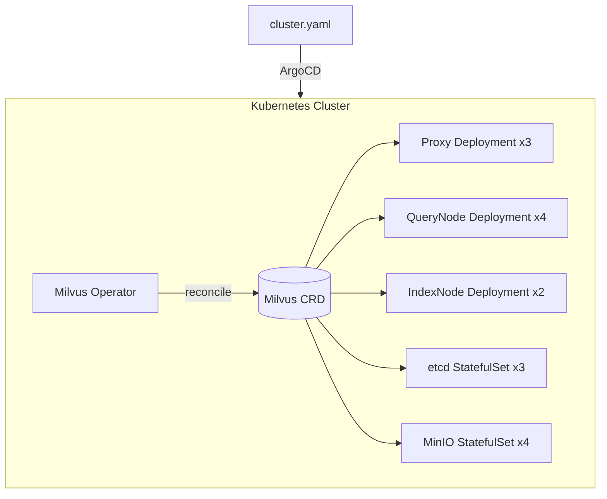
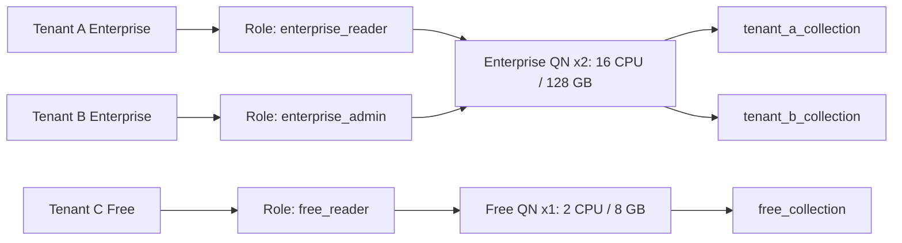
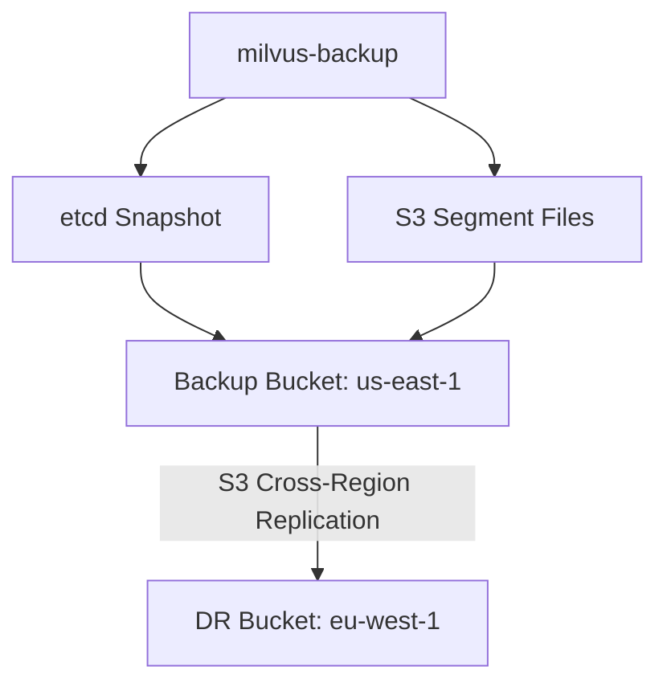

# ☸️ 08 - Milvus II - Kubernetes and Multi-tenancy

## 🎯 Learning Objectives
- Deploy Milvus clusters declaratively using the Milvus Operator and Helm charts on Kubernetes
- Implement multi-tenant isolation with resource groups, RBAC, and partition-based tenant separation
- Design tiered storage strategies (hot/warm/cold) to balance cost and latency across data lifecycles
- Automate backup and restore workflows using `milvus-backup` for disaster recovery
- Perform resource planning for CPU, memory, GPU, and disk IOPS to right-size production deployments
- Build GitOps workflows with ArgoCD for zero-downtime rolling upgrades and canary deployments

## Introduction

Running Milvus on a single Docker Compose node works for prototyping with < 10M vectors. But production ML systems demand orchestrated deployments that survive node failures, scale with traffic, and enforce security boundaries between teams. Kubernetes has become the de facto substrate for stateful ML infrastructure, and Milvus provides first-class K8s support through both a custom Operator and community Helm charts.

This note transitions from architecture theory to operational practice. We explore how to map Milvus microservices onto Kubernetes primitives (Deployments, StatefulSets, PVCs, HPAs), isolate tenants without sacrificing density, and implement lifecycle policies that move aging vectors to cheaper storage. These patterns complement [[06 - Qdrant II - Distributed and Cloud Deployment|Qdrant's Kubernetes patterns]] and [[03 - pgvector I - Core Operations and Indexing|pgvector's simpler RDS-style operations]], giving you a complete spectrum of deployment complexity.

---

## 1. Kubernetes Deployment with Milvus Operator

The Milvus Operator follows the Kubernetes Operator pattern: a controller loop watches `Milvus` Custom Resources (CRs) and reconciles the actual cluster state to match the desired state declared in YAML. This is superior to Helm for day-2 operations because the Operator handles rolling upgrades, certificate rotation, and scaling without manual intervention. Helm is a templating engine — excellent for initial install but less capable of complex transitions like multi-step version upgrades with health checks between steps.

The `Milvus` CRD encapsulates the entire topology: proxy replicas, coordinator resource limits, etcd and MinIO sub-chart configuration, and TLS secrets. By treating the cluster as a single declarative object, GitOps workflows become straightforward. A single `git push` can trigger a canary rollout of a new Milvus version across staging and production, with ArgoCD syncing the CR and the Operator orchestrating the pod rotation.

```yaml
apiVersion: milvus.io/v1beta1
kind: Milvus
metadata:
  name: my-milvus
spec:
  mode: cluster
  components:
    proxy:
      replicas: 3
      resources:
        limits: {cpu: "2", memory: 4Gi}
    queryNode:
      replicas: 4
      resources:
        limits: {cpu: "8", memory: 32Gi}
    indexNode:
      replicas: 2
      resources:
        limits: {cpu: "16", memory: 64Gi, nvidia.com/gpu: "1"}
  dependencies:
    etcd:
      inCluster:
        values: {replicaCount: 3}
    storage:
      inCluster:
        values: {mode: distributed, replicas: 4}
```

```bash
# Install the Milvus Operator
kubectl apply -f https://raw.githubusercontent.com/zilliztech/milvus-operator/main/deploy/manifests/deployment.yaml

# Deploy a Milvus cluster — Operator creates Deployments, Services, PVCs
kubectl apply -f milvus-cluster.yaml

# Watch Operator reconciliation logs
kubectl logs -n milvus-operator -l app=milvus-operator -f

# Scale QueryNodes dynamically (no Helm upgrade needed)
kubectl patch milvus my-milvus --type merge -p '{"spec":{"components":{"queryNode":{"replicas":8}}}}'

# Create HPA for proxy auto-scaling
kubectl autoscale deployment my-milvus-proxy --cpu-percent=70 --min=3 --max=20
```

⚠️ etcd is the metadata brain — running it on burstable CPU nodes (e.g., `t3.*` on AWS) causes leader election flapping and cluster instability. Always pin etcd to dedicated nodes or use a managed etcd service like Amazon MemoryDB. 💡 *etcd is the heart — don't starve it.*

❌ **Antipattern**: Forgetting storage class configuration. MinIO distributed mode requires `ReadWriteOnce` PVCs with sufficient IOPS. Default storage classes with slow HDD backend create I/O bottlenecks during index builds and compaction.  
✅ **Correct**: Provision gp3 (3,000+ baseline IOPS) or io2 volumes for MinIO; use node affinity to colocate with compute.

❌ **Antipattern**: Manually editing Deployments or PVCs created by the Operator — the Operator reverts manual changes on the next reconciliation cycle.  
✅ **Correct**: Treat the Milvus CR as the single source of truth. All changes go through `kubectl apply -f` on the CR.

❌ **Antipattern**: Running all Milvus pods on the same node. A single node failure takes down the entire cluster.  
✅ **Correct**: Use PodAntiAffinity to spread pods across nodes; run etcd with `topologySpreadConstraints`.

```yaml
# PodAntiAffinity for QueryNodes (add to CR via component overrides)
affinity:
  podAntiAffinity:
    preferredDuringSchedulingIgnoredDuringExecution:
    - weight: 100
      podAffinityTerm:
        labelSelector:
          matchLabels:
            app: milvus
            component: querynode
        topologyKey: kubernetes.io/hostname
```

**Caso real — eBay**: Deploys Milvus via Operator across three GKE regions (us-east1, europe-west1, asia-east1). Each region holds a full cluster with async replication for DR. GitOps (ArgoCD) manages version rollouts; canary searches route to a dedicated Proxy Deployment before full promotion. This setup handles 5B vectors with 12 QueryNodes per region.



## 2. Multi-tenancy with Resource Groups and RBAC

Multi-tenancy is hard in vector databases because embeddings are memory-hungry and noisy neighbors can starve each other. Milvus addresses this at two levels: **resource groups** (physical isolation of QueryNodes) and **RBAC** (logical access control).

**Resource groups** bind specific QueryNodes to specific collections, guaranteeing CPU and memory quotas. A SaaS platform with 500 tenants might create 5 resource groups and assign by SLA tier:

- Enterprise: 2 QueryNodes (8 CPU, 64 GB each), dedicated
- Pro: 2 QueryNodes (4 CPU, 32 GB each), shared among 50 tenants
- Free: 1 QueryNode (2 CPU, 8 GB), burstable, all unassigned tenants

**RBAC** ensures Tenant A cannot query Tenant B's collection. Privileges map to specific operations (Search, Insert, IndexDetail, Flush, etc.) at the Collection or Global level.

The dual-layer model is analogous to Kubernetes namespaces plus ResourceQuotas. The trade-off is operational complexity: resource groups require manual rebalancing as tenants grow, and RBAC policies must be version-controlled to prevent privilege creep. Unlike [[05 - Qdrant I - Architecture and Collections|Qdrant's built-in multitenancy via payload filtering]], Milvus prefers physical separation for strict SLAs.

```python
from pymilvus import utility, Collection

# Create resource group with min/max node guarantees
utility.create_resource_group(
    name="enterprise",
    config={"requests": {"node_num": 2}, "limits": {"node_num": 4}},
)

# Transfer nodes from default pool
utility.transfer_node(
    source_group="__default_resource_group",
    target_group="enterprise",
    num_node=2,
)

# RBAC: user → role → privilege
utility.create_user(user="tenant_a_user", password="secure_password")
utility.create_role(role="tenant_a_reader")
utility.grant_privilege(
    role="tenant_a_reader",
    object_type="Collection",
    object_name="tenant_a",
    privilege="Search",
)
utility.add_user_to_role(user="tenant_a_user", role="tenant_a_reader")

# Load collection into dedicated resource group
collection.load(_resource_group="enterprise")
```

💡 If all collections load into `__default_resource_group`, resource groups provide zero isolation. Always explicitly set `_resource_group` in `load()`. 💡 *Default is shared — name your group.*

❌ **Antipattern**: Granting `CollectionAdmin` or `GlobalAdmin` to application service accounts — exposes all collections to accidental deletion or data exfiltration.  
✅ **Correct**: Apply least privilege — `Search` + `Insert` only for API service accounts; `CollectionAdmin` reserved for operators.

❌ **Antipattern**: Over-assigning tenants to the same resource group without monitoring usage. One tenant's heavy batch queries (full scan) starve others.  
✅ **Correct**: Monitor per-collection QPS and segment memory; rebalance tenants when one exceeds 40% of the group's resources.

**Caso real — Cybersecurity SaaS**: Isolates threat-intel embeddings per customer. Enterprise customers get dedicated QueryNode pairs (8 CPU, 64 GB RAM each) with GPU passthrough for nightly index builds. Free users share a burstable pool of 2 QueryNodes. RBAC ensures analysts can only search their own tenant's collection. Resource groups are rebalanced monthly via a Python script that scrapes Prometheus metrics and generates a new CR.



## 3. Tiered Storage, Backup, and Resource Planning

Vector datasets exhibit strong temporal locality: recent embeddings (last 30 days) are queried frequently; older data is accessed rarely but must remain searchable for compliance. Tiered storage maps this to infrastructure cost.

| Tier | Storage Medium | QueryNode Type | Target p99 Latency | Relative Cost |
|------|---------------|----------------|-------------------|--------------|
| Hot | NVMe SSD local | GPU-enabled | < 5ms | $$$ |
| Warm | SATA SSD / EBS gp3 | CPU HNSW | < 50ms | $$ |
| Cold | S3 / GCS / Glacier | On-demand load | < 2s | $ |

Milvus doesn't have automatic tiering policies, but operators simulate them via partition-level management: recent data in a "hot" partition loaded into GPU QueryNodes; historical data in a "cold" partition loaded only for batch audits. MinIO lifecycle rules can transition cold data to S3 Glacier automatically.

**Backup workflow**: `milvus-backup` is an official CLI that snapshots etcd metadata (collection schemas, segment maps) and S3 segment files into a portable backup directory. It supports full backups, incremental backups (using S3 object versioning), and cross-region replication.

```bash
# Backup configuration
cat > backup.yaml <<'EOF'
milvus:
  address: milvus-proxy
  port: 19530
  authorization: "root:Milvus"
storage:
  type: minio
  address: minio:9000
  bucketName: milvus-bucket
  rootPath: files
EOF

# Full backup (captures metadata + all segment/index files)
milvus-backup create --config backup.yaml --name full-2024-06-01

# Restore creates new collections but does NOT load them
milvus-backup restore --config backup.yaml --name full-2024-06-01 --restore_name restored
```

```python
# Resource planning math for QueryNode sizing
VECTOR_DIM = 768
NUM_VECTORS = 10_000_000
BYTES_PER_VEC = VECTOR_DIM * 4  # float32 = 4 bytes
RAW_GB = (NUM_VECTORS * BYTES_PER_VEC) / (1024**3)  # ~28.6 GB

# Index type memory multipliers
INDEX_MULTIPLIERS = {
    "IVF_FLAT": 1.1,   # inverted lists: ~10% overhead
    "IVF_SQ8": 0.3,    # 1 byte per dim instead of 4
    "HNSW": 1.5,       # graph edges: ~50% overhead
    "IVF_PQ": 0.15,    # PQ compression: M=64 dims per subvector
}
for idx_type, mult in INDEX_MULTIPLIERS.items():
    total = RAW_GB * mult * 1.3  # 30% headroom
    print(f"{idx_type}: {total:.1f} GB")
```

⚠️ Restore recreates metadata and files, but collections remain unloaded. Searches return errors until `collection.load()` is called post-restore. 💡 *Restore brings data back; load brings it online.*

❌ **Antipattern**: IndexNodes writing large (10+ GB) index files to burstable EBS volumes (gp2, 100-300 baseline IOPS). IOPS credits exhaust mid-build, stalling completion for hours.  
✅ **Correct**: Provision gp3 with 3,000+ baseline IOPS or io2 (500+ IOPS/GB) for index node volumes.

❌ **Antipattern**: Running full backups during peak traffic hours — backup I/O and network compete with query/ingestion workloads, degrading p99 latency.  
✅ **Correct**: Schedule backups in low-traffic windows; use incremental (S3 versioning) for frequent snapshots.

```python
# Prometheus ServiceMonitor for scraping Milvus metrics
apiVersion: monitoring.coreos.com/v1
kind: ServiceMonitor
metadata:
  name: milvus-metrics
spec:
  selector:
    matchLabels:
      app: milvus
  endpoints:
    - port: metrics
      path: /metrics
      interval: 15s
```

**Caso real — Fintech**: Stores 5 years of transaction embeddings (768-dim COSINE) for fraud detection. Hot tier (NVMe local SSDs, p99 10ms) holds recent 90 days; warm (EBS gp3, p99 80ms) holds months 3-12; cold (S3 Glacier, queried monthly) holds older data. Nightly `milvus-backup` pushes to cross-region S3. Grafana alerts fire when QueryNode memory exceeds 80%. This tiering strategy reduced storage costs by 65%.




---

## 🎯 Key Takeaways
- The Milvus Operator is the preferred K8s deployment method for day-2 operations and GitOps workflows.
- Resource groups provide physical isolation of QueryNodes; RBAC provides logical access control — use both for secure multi-tenancy.
- Tiered storage (hot/warm/cold) is implemented via partition strategies and infrastructure choices, not yet automatic policy.
- `milvus-backup` snapshots both etcd metadata and S3 segments; restores require explicit `load()`.
- Right-sizing requires estimating vector memory (dim × 4 bytes), index overhead (HNSW ~1.5×, IVF ~1.1×), and QueryNode headroom (1.3×).
- GPU indices speed up batch queries and index builds but demand fast PCIe and increase node cost significantly.
- Always pin etcd to dedicated or stable nodes; use PodAntiAffinity to spread Milvus pods across nodes.

## References
- Milvus Operator: https://milvus.io/docs/install_cluster-milvusoperator.md
- milvus-backup: https://github.com/zilliztech/milvus-backup
- Milvus RBAC: https://milvus.io/docs/users_and_roles.md
- kube-prometheus-stack: https://github.com/prometheus-community/helm-charts
- [[07 - Milvus I - Distributed Architecture]] — Foundation for microservices and segment lifecycle
- [[06 - Qdrant II - Distributed and Cloud Deployment]] — Compare K8s deployment patterns
- [[10 - Advanced Patterns and Observability]] — Deeper latency and recall monitoring strategies

## GPU Node Scheduling with Taints and Tolerations

GPU nodes are expensive and must be reserved for index builds and GPU-accelerated queries. Use Kubernetes taints and tolerations to prevent non-GPU pods from landing on GPU nodes.

```bash
# Taint GPU nodes so only IndexNodes and GPU QueryNodes can schedule
kubectl taint nodes gpu-pool-1 nvidia.com/gpu=present:NoSchedule

# The Milvus Operator sets tolerations automatically when
# spec.components.indexNode.resources.limits.nvidia.com/gpu > 0
```

**Prometheus/Grafana for Milvus**: Key dashboard panels to build:
- Latency p50/p99 per component (Proxy, QueryNode, IndexNode)
- Memory usage vs. limit per QueryNode (alert at 80%)
- Segment count per collection (alert if > 100 per shard)
- Index build queue depth (alert if > 10 pending)

```yaml
# Grafana alert rule for QueryNode memory
- alert: QueryNodeMemoryHigh
  expr: sum(process_resident_memory_bytes{component="querynode"}) / sum(kube_pod_container_resource_limits{resource="memory", component="querynode"}) > 0.8
  for: 5m
  annotations:
    summary: "QueryNode memory exceeds 80%"
```

**Caso real — TripAdvisor**: Runs a 500M-vector Milvus cluster across 3 K8s namespaces (staging, canary, prod). GPU nodes are tainted and use node auto-provisioning — they spin up A10G instances only during nightly index builds and scale to zero idle, saving 40% on GPU costs.

## 📦 Código de compresión
```python
from pymilvus import connections, utility, Collection, FieldSchema, CollectionSchema, DataType

connections.connect("default", host="milvus-proxy", port="19530", user="root", password="Milvus")

utility.create_resource_group("pro_tier", config={"requests": {"node_num": 2}, "limits": {"node_num": 4}})
utility.transfer_node("__default_resource_group", "pro_tier", 2)

utility.create_user("pro_user", "Secure123!")
utility.create_role("pro_role")
utility.grant_privilege("pro_role", "Collection", "pro_docs", "Search")
utility.add_user_to_role("pro_user", "pro_role")

fields = [
    FieldSchema("id", DataType.INT64, is_primary=True),
    FieldSchema("vec", DataType.FLOAT_VECTOR, dim=256),
    FieldSchema("ts", DataType.INT64),
]
schema = CollectionSchema(fields, enable_dynamic_field=True)
coll = Collection("pro_docs", schema)
coll.create_index("vec", {"index_type": "HNSW", "metric_type": "COSINE", "params": {"M": 16, "efConstruction": 200}})
coll.load(_resource_group="pro_tier")
coll.insert([[1, 2], [[0.1]*256, [0.2]*256], [1717200000000, 1717200000001]])
coll.search([[0.15]*256], "vec", {"metric_type": "COSINE", "params": {"ef": 64}}, limit=10, expr="ts > 1717100000000")
```
