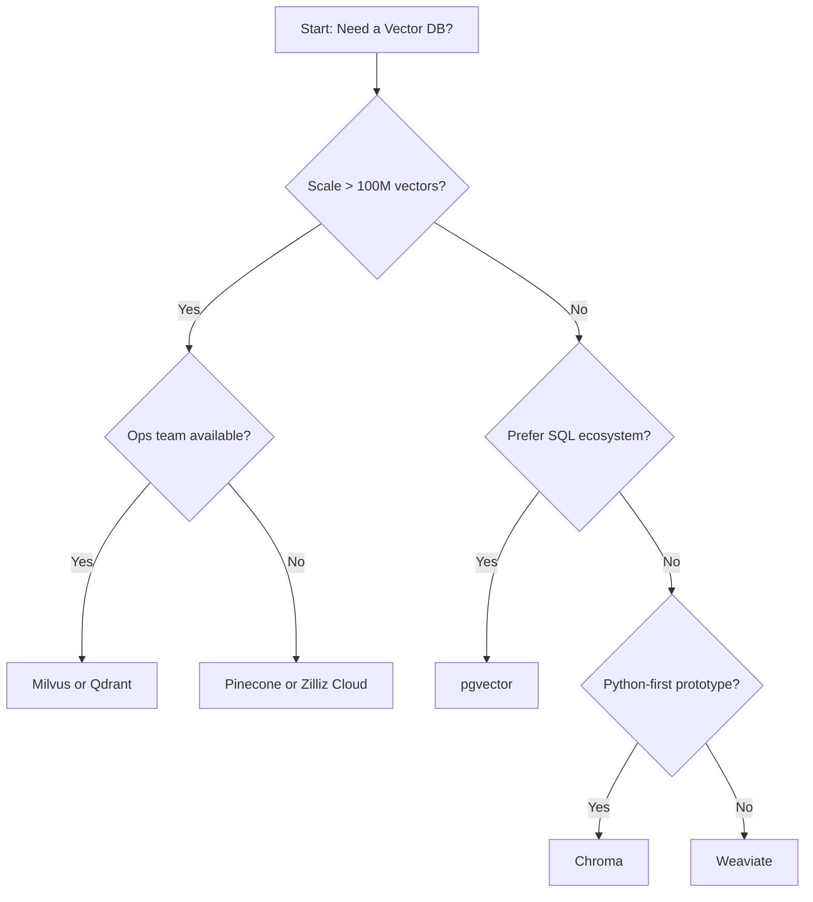
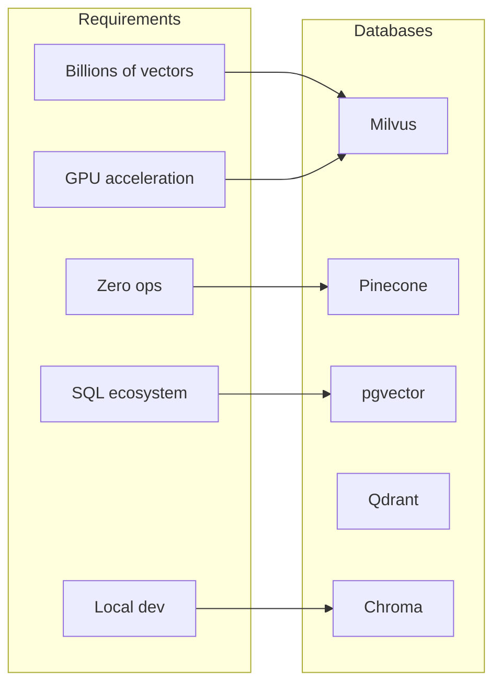
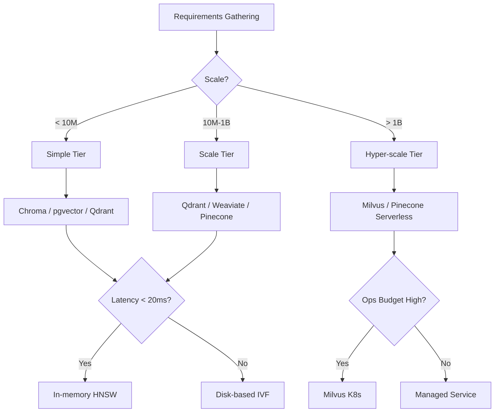

# 🏷️ 09 - Vector Database Comparison Matrix

## 🎯 Learning Objectives
- Compare six vector databases (Qdrant, Milvus, pgvector, Pinecone, Weaviate, Chroma) across 10+ operational dimensions
- Identify the deployment model, scalability ceiling, and consistency guarantees of each engine
- Evaluate hybrid search capabilities, language client ecosystems, and pricing models
- Build a decision framework that maps business requirements to the optimal database choice
- Understand why no single database is universally best and how to hedge with multi-engine stacks

## Introduction

The vector database landscape has exploded since 2020, with each engine optimizing for a different point in the design space: simplicity vs. scale, managed vs. self-hosted, strict consistency vs. eventual availability. Choosing the wrong engine can saddle a team with operational toil, vendor lock-in, or latency regressions that degrade model performance. Conversely, the right choice can reduce infrastructure costs by 10x and accelerate iteration cycles.

This note provides a structured, side-by-side comparison of Qdrant, Milvus, pgvector, Pinecone, Weaviate, and Chroma. Rather than declaring a winner, we construct a decision framework: "Choose X when..." Armed with this matrix, you can justify your choice to stakeholders and anticipate migration costs if requirements evolve. The comparison connects back to [[05 - Qdrant I - Architecture and Collections|Qdrant]], [[07 - Milvus I - Distributed Architecture|Milvus]], and [[03 - pgvector I - Core Operations and Indexing|pgvector]] deep-dives, while briefly surveying Pinecone, Weaviate, and Chroma for completeness.

---

## Module 1: Comparison Dimensions and Scoring

### 1.1 Theoretical Foundation 🧠

Vector databases differ along axes that traditional SQL comparisons ignore: **index build time**, **recall/latency trade-off curves**, **embedding dimension limits**, and **multi-vector (colbert-style) support**. The most critical dimension is often deployment model. Managed services (Pinecone, Zilliz Cloud) eliminate operational overhead but restrict customization and impose per-dimension pricing. Self-hosted engines (Qdrant, Milvus, pgvector) offer full control but require SRE expertise.

Scalability is the second axis. Single-node engines like Chroma and pgvector (without Citus) cap out at memory size. Distributed engines like Milvus and Qdrant partition data across nodes, but the consistency model matters: Milvus uses etcd for strong metadata consistency, while Qdrant prefers Raft for partition-level consensus. Eventual consistency is acceptable for recommendation systems but dangerous for fraud detection where duplicate embeddings must never be missed.

Hybrid search—combining vector similarity with text/keyword filters—is now table stakes. Yet implementations vary: pgvector leverages Postgres's mature B-tree and GIN indexes; Milvus provides scalar filtering inside the ANN execution path; Qdrant uses payload indexes; Weaviate integrates natively with GraphQL. The "best" hybrid search depends on filter selectivity and query complexity.

### 1.2 Mental Model 📐

```
┌─────────────────────────────────────────────────────────────┐
│                 Decision Axes                               │
│                                                             │
│   Scale ─────┬─────> Billions of vectors                   │
│              │                                              │
│   Ops Burden ├─────> Zero (managed) ────> High (self-host) │
│              │                                              │
│   Consistency├─────> Strong (etcd/Raft) ──> Eventual       │
│              │                                              │
│   Hybrid Srch├─────> Native filter ──> Post-filter         │
│              │                                              │
│   Cost Model ├─────> Per query ──> Per node ──> Per dim    │
│              │                                              │
│   Ecosystem  └─────> Langchain, LlamaIndex, DSPy support   │
└─────────────────────────────────────────────────────────────┘
```

### 1.3 Syntax and Semantics 📝

```python
# WHY: This script generates a normalized radar-chart dataset
# for plotting database trade-offs. It is data, not a query.
import json

scores = {
    "Qdrant":     {"scale": 8, "ops": 6, "consistency": 7, "hybrid": 8, "cost_ctrl": 9, "ecosystem": 7},
    "Milvus":     {"scale": 10, "ops": 3, "consistency": 8, "hybrid": 9, "cost_ctrl": 7, "ecosystem": 8},
    "pgvector":   {"scale": 5, "ops": 8, "consistency": 9, "hybrid": 8, "cost_ctrl": 8, "ecosystem": 6},
    "Pinecone":   {"scale": 9, "ops": 10, "consistency": 6, "hybrid": 7, "cost_ctrl": 4, "ecosystem": 9},
    "Weaviate":   {"scale": 7, "ops": 7, "consistency": 6, "hybrid": 9, "cost_ctrl": 5, "ecosystem": 8},
    "Chroma":     {"scale": 3, "ops": 9, "consistency": 5, "hybrid": 5, "cost_ctrl": 9, "ecosystem": 8},
}

print(json.dumps(scores, indent=2))
```

### 1.4 Visual Representation 🖼️

```mermaid
quadrantChart
    title Vector DBs: Scale vs. Operational Simplicity
    x-axis Low Scale --> High Scale
    y-axis High Ops Burden --> Low Ops Burden (Managed)
    quadrant-1 Explore Managed Scale
    quadrant-2 Choose for Production
    quadrant-3 Avoid for Vectors
    quadrant-4 Evaluate Carefully
    Qdrant: [0.7, 0.5]
    Milvus: [0.95, 0.2]
    pgvector: [0.4, 0.7]
    Pinecone: [0.85, 0.9]
    Weaviate: [0.6, 0.6]
    Chroma: [0.2, 0.8]
```




### 1.5 Application in ML/AI Systems 🤖

Real case: **A Fortune 500 retailer** evaluated all six engines for a 200M-vector product search platform. They eliminated Chroma (single-node only), pgvector (index build time too slow at 200M), and Pinecone (cost 3× self-hosted at their scale). The final shootout was Milvus vs. Qdrant; Milvus won due to GPU index support for their image-search batch jobs, but Qdrant was kept as a hot-failover for text embeddings.

| ML Use Case | This Concept | Impact |
|-------------|-------------|--------|
| Vendor selection RFP | Structured comparison matrix | Objective scoring, reduced bias |
| Multi-engine architecture | Hedge with hot/warm tiers | 99.999% availability |
| Cost forecasting | Pricing model mapping | Accurate cloud budget |
| Compliance audit | Consistency model documentation | Pass SOC-2 data-integrity checks |

### 1.6 Common Pitfalls ⚠️

⚠️ **Benchmarking on toy datasets**: A database that scores well on 1M vectors may collapse at 500M due to metadata overhead or lock contention. Always benchmark at 2× expected production scale.
💡 *Mnemonic: "Benchmark big, or regret later."*

⚠️ **Ignoring client ecosystem**: A database with perfect performance but no LangChain integration forces your team to write custom loaders. Ecosystem maturity accelerates shipping.
💡 *Mnemonic: "Clients are velocity."*

### 1.7 Knowledge Check ❓

1. Why is strong consistency more important for fraud detection than for content recommendation?
2. At what vector count does pgvector (single-node) typically require sharding or replacement?
3. List two hidden costs of managed vector databases not shown in headline pricing.

---

## Module 2: Detailed Comparison Matrix

### 2.1 Theoretical Foundation 🧠

The following matrix synthesizes public documentation, community benchmarks, and operational war stories. Scores are qualitative (Excellent / Good / Fair / Limited) rather than numeric to avoid false precision. The goal is to highlight relative strengths, not declare winners.

**Qdrant** optimizes for developer experience and filtered ANN. Its Rust core delivers low-latency queries with minimal memory overhead. It is the sweet spot for teams that need self-hosted scale without Kubernetes complexity.

**Milvus** is the scale champion. Its microservice architecture supports billion-vector clusters and GPU acceleration. The cost is operational complexity—etcd, MinIO, Pulsar, and a dozen pod types.

**pgvector** is the simplicity champion. Adding a vector type to Postgres means zero new infrastructure for teams already on RDS. The ceiling is lower: index builds block writes, and HNSW memory usage is unbounded on a single node.

**Pinecone** is the fully managed pioneer. It abstracts all infrastructure but charges per-dimension-hour, which becomes expensive for high-dimensional models (e.g., 4096-dim image encoders). Metadata filtering is limited compared to Milvus/Qdrant.

**Weaviate** offers native multi-modal support (text, image, audio) and GraphQL interfaces. It targets AI-native teams building RAG pipelines. Scale is moderate; distributed mode is newer and less battle-tested than Milvus.

**Chroma** is the local-first/embeddable option. It is ideal for Jupyter notebooks, unit tests, and small RAG prototypes. It should not be used for production services requiring concurrent users.

### 2.2 Mental Model 📐

```
┌──────────┬──────────┬──────────┬──────────┬──────────┬──────────┐
│ Dimension│ Qdrant   │ Milvus   │ pgvector │ Pinecone │ Weaviate │ Chroma   │
├──────────┼──────────┼──────────┼──────────┼──────────┼──────────┼──────────┤
│ Deployment│ Self     │ Self/K8s │ Self/RDS │ Managed  │ Self/Cld │ Embedded │
│ Model    │ Hosted   │ Managed  │          │          │          │          │
├──────────┼──────────┼──────────┼──────────┼──────────┼──────────┼──────────┤
│ Max Scale│ ~10B     │ ~100B+   │ ~100M    │ ~10B     │ ~1B      │ ~1M      │
│ (vectors)│          │          │ (1 node) │          │          │          │
├──────────┼──────────┼──────────┼──────────┼──────────┼──────────┼──────────┤
│ Consistency│ Raft   │ Strong   │ ACID     │ Eventual │ Eventual │ None     │
│          │ (partition)│ (etcd)  │          │          │          │          │
├──────────┼──────────┼──────────┼──────────┼──────────┼──────────┼──────────┤
│ Hybrid   │ Payload  │ Scalar   │ B-tree + │ Metadata │ GraphQL  │ Basic    │
│ Search   │ indexes  │ filter   │ GIN      │ filter   │ hybrid   │ filter   │
├──────────┼──────────┼──────────┼──────────┼──────────┼──────────┼──────────┤
│ Lang     │ Py/Go/Rust│ Py/Go/Java│ SQL/ORM │ Py/Go/JS │ Py/Go/JS│ Py/JS    │
│ Clients  │ /JS/CPP  │ /C++     │          │          │          │          │
├──────────┼──────────┼──────────┼──────────┼──────────┼──────────┼──────────┤
│ Pricing  │ Free/Ent │ Free/Ent │ Free (OSS)│ Per-dim │ Free/Ent │ Free     │
│ Model    │          │ Managed  │ + infra   │ + req   │ Cloud    │          │
├──────────┼──────────┼──────────┼──────────┼──────────┼──────────┼──────────┤
│ Best Use │ Filtered │ Billion  │ SQL app  │ Rapid    │ Multi-   │ Prototype│
│ Case     │ ANN      │ scale GPU│ add-on   │ startup  │ modal    │ / local  │
│          │          │ search   │          │          │ RAG      │          │
└──────────┴──────────┴──────────┴──────────┴──────────┴──────────┴──────────┘
```

### 2.3 Syntax and Semantics 📝

```python
# WHY: When building a multi-DB abstraction layer, you need a common
# interface. This Python ABC shows how to unify Qdrant, Milvus,
# and pgvector behind one API—hiding vendor-specific semantics.
from abc import ABC, abstractmethod
from typing import List, Tuple

class VectorStore(ABC):
    @abstractmethod
    def upsert(self, ids: List[str], vectors: List[List[float]], payloads: List[dict]) -> None:
        """WHY: Abstracting upsert lets you swap backends without
        rewriting ingestion pipelines. Payloads map to JSON in Milvus,
        payload in Qdrant, and JSONB in pgvector."""
        ...

    @abstractmethod
    def search(self, vector: List[float], top_k: int, filters: dict) -> List[Tuple[str, float]]:
        """WHY: Search signature must include filters so hybrid search
        works across all backends uniformly."""
        ...

    @abstractmethod
    def delete(self, ids: List[str]) -> None:
        ...
```

### 2.4 Visual Representation 🖼️

```mermaid
xychart-beta
    title "Latency vs. Scale (Qualitative)"
    x-axis [1M, 10M, 100M, 1B, 10B]
    y-axis "Query Latency p99 (ms)" 0 --> 500
    line "Qdrant" {10, 15, 25, 50, 80}
    line "Milvus" {12, 18, 30, 45, 60}
    line "pgvector" {8, 20, 150, 500, 500}
    line "Pinecone" {15, 20, 35, 60, 100}
    line "Weaviate" {14, 22, 40, 90, 200}
    line "Chroma" {5, 30, 500, 500, 500}
```




### 2.5 Application in ML/AI Systems 🤖

Real case: **OpenAI's cookbook examples** use Chroma for quickstarts, Pinecone for hosted RAG tutorials, and pgvector for users who want everything in Postgres. This tiered documentation strategy mirrors production reality: Chroma for dev, pgvector for simple prod, Milvus/Qdrant for scale.

| ML Use Case | This Concept | Impact |
|-------------|-------------|--------|
| Startup MVP | Chroma → Pinecone | Ship in days, scale without migration |
| Enterprise SQL migration | pgvector | Reuse existing backups, IAM, compliance |
| Billion-scale image search | Milvus + GPU | Only self-hosted GPU option |
| High-precision filtered search | Qdrant payload indexes | Best-in-class filtered ANN latency |

### 2.6 Common Pitfalls ⚠️

⚠️ **Dimension-hour pricing blindness**: Pinecone pricing scales with vector dimension. A 4096-dim CLIP embedding costs 4× a 1024-dim text embedding. Always normalize pricing to per-query cost at your dimension.
💡 *Mnemonic: "Dim up, bill up."*

⚠️ **Assuming SQL skills transfer to pgvector**: While pgvector uses SQL, tuning `hnsw.ef_search`, `maintenance_work_mem`, and `max_parallel_maintenance_workers` is vector-specific expertise. Do not assume a DBA can optimize it without training.
💡 *Mnemonic: "SQL skin, vector bones."*

### 2.7 Knowledge Check ❓

1. Which database would you choose for a team with zero DevOps budget and a 50M-vector requirement?
2. Why might you keep pgvector for metadata-heavy queries even if using Milvus for ANN?
3. What is the primary operational risk of Weaviate's distributed mode compared to Milvus?

---

## Module 3: Decision Framework

### 3.1 Theoretical Foundation 🧠

Decision frameworks prevent choice paralysis by forcing explicit prioritization of constraints. The framework here uses four primary constraints—scale, operational budget, latency SLA, and existing infrastructure—and maps each to a recommended engine. Secondary constraints (hybrid search complexity, GPU needs, multi-tenancy) act as tiebreakers.

The key insight is that **choosing a vector database is not a one-time decision**. Many mature platforms run a polyglot stack: pgvector for transactional metadata lookups, Qdrant for high-precision text search, and Milvus for batch image indexing. This note's capstone project ([[11 - Capstone Project - Multi-DB Semantic Search Platform|Capstone]]) demonstrates exactly such an architecture.

### 3.2 Mental Model 📐

```
┌─────────────────────────────────────────────────────────────┐
│              Decision Framework Flow                        │
│                                                             │
│  1. ESTIMATE SCALE                                          │
│     < 10M ──> Chroma / pgvector / Qdrant single-node       │
│     10M-1B ──> Qdrant cluster / Weaviate / Pinecone        │
│     > 1B ──> Milvus cluster / Pinecone serverless          │
│                                                             │
│  2. ASSESS OPS BUDGET                                       │
│     Zero ──> Pinecone / Zilliz Cloud / Weaviate Cloud      │
│     Medium ──> Qdrant on K8s / pgvector on RDS             │
│     High ──> Milvus on K8s / Self-managed Weaviate         │
│                                                             │
│  3. DEFINE LATENCY SLA                                      │
│     p99 < 10ms ──> Qdrant / Milvus HNSW in memory          │
│     p99 < 100ms ──> pgvector / Pinecone                    │
│     Batch acceptable ──> Milvus GPU / Any                  │
│                                                             │
│  4. CHECK EXISTING STACK                                    │
│     Postgres-heavy ──> pgvector                            │
│     K8s-native ──> Milvus / Qdrant                         │
│     AWS-only ──> Pinecone / pgvector (Aurora)              │
└─────────────────────────────────────────────────────────────┘
```

### 3.3 Syntax and Semantics 📝

```python
# WHY: A decision helper script that encodes the framework rules.
# It is not definitive but accelerates initial shortlisting.

def recommend_db(scale_millions: int, ops_budget: str, latency_ms: int, stack: str) -> str:
    """WHY: Encapsulating decision logic in code makes it testable
    and version-controlled, avoiding tribal knowledge drift."""
    if scale_millions < 10:
        if stack == "postgres":
            return "pgvector"
        return "Chroma (dev) or Qdrant (prod)"
    if scale_millions > 1000:
        if ops_budget == "high":
            return "Milvus (GPU if batch-heavy)"
        return "Pinecone or Zilliz Cloud"
    if latency_ms < 20:
        return "Qdrant or Milvus (in-memory HNSW)"
    if ops_budget == "zero":
        return "Pinecone"
    return "Qdrant or Weaviate"

print(recommend_db(500, "medium", 15, "k8s"))  # Qdrant or Milvus
```

### 3.4 Visual Representation 🖼️




### 3.5 Application in ML/AI Systems 🤖

Real case: **A healthcare AI platform** needed HIPAA-compliant vector search. Managed services were disqualified due to BAA limitations. They chose pgvector on AWS Aurora (existing BAA) for <50M patient embeddings, with a migration path to Milvus if scale exceeds Aurora's single-node limit. The decision framework saved 6 weeks of evaluation.

| ML Use Case | This Concept | Impact |
|-------------|-------------|--------|
| Vendor lock-in mitigation | Multi-engine abstraction | Swap backends in < 1 sprint |
| CFO budget approval | Pricing model comparison | Accurate 3-year TCO |
| Technical due diligence | Dimension scoring matrix | Defensible choice to board |
| Team onboarding | Decision script (code) | Junior engineers can self-serve |

### 3.6 Common Pitfalls ⚠️

⚠️ **Over-engineering for future scale**: A startup choosing Milvus for 1M vectors wastes engineering hours on K8s instead of product-market fit. Start simple; migrate when metrics demand it.
💡 *Mnemonic: "Scale when it hurts, not when it might."*

⚠️ **Ignoring egress costs**: Managed databases in a different cloud region than your app servers incur massive data transfer fees. Co-locate or budget for it.
💡 *Mnemonic: "Egress is silent profit killer."*

### 3.7 Knowledge Check ❓

1. Under what conditions does the framework recommend Qdrant over Milvus?
2. Why is "existing stack" weighted heavily in enterprise environments?
3. Write a migration checklist for moving from Chroma to Qdrant at 10M vectors.

---

## 📦 Compression Code

```python
"""
Vector DB Comparison — Decision Helper + Unified Interface Skeleton
"""
from abc import ABC, abstractmethod
from typing import List, Tuple, Dict

class VectorDB(ABC):
    @abstractmethod
    def upsert(self, ids, vectors, payloads): ...
    @abstractmethod
    def search(self, vector, top_k, filters) -> List[Tuple[str, float]]: ...
    @abstractmethod
    def info(self) -> Dict: ...

def recommend(scale_m: int, ops: str, latency_ms: int, stack: str) -> str:
    if scale_m < 10:
        return "pgvector" if stack == "postgres" else "Qdrant"
    if scale_m > 1000:
        return "Milvus" if ops == "high" else "Pinecone"
    return "Qdrant" if latency_ms < 30 else "Weaviate"

# Usage
choice = recommend(scale_m=200, ops="medium", latency_ms=15, stack="k8s")
print(f"Recommended: {choice}")
```

## 🎯 Documented Project

### Description
Build a "Vector DB Selector" web tool. Given user inputs (scale, ops budget, latency, stack), it returns a ranked shortlist with justification paragraphs. Include a side-by-side benchmark dataset (latency at 1M, 10M, 100M) rendered as an interactive chart.

### Functional Requirements
- React frontend with 4 dropdowns (scale, ops, latency, stack)
- Backend API (FastAPI) implementing the decision framework
- SQLite database of benchmark results from public sources (ANN-Benchmarks, vendor docs)
- Export recommendation as PDF report

### Main Components
- `frontend/`: React + Recharts for radar chart
- `backend/api.py`: FastAPI with `/recommend` endpoint
- `backend/benchmarks.db`: Normalized latency/recall data
- `backend/report.py`: PDF generation via WeasyPrint

### Success Metrics
- Recommendation latency < 100ms
- PDF export includes data sources and confidence warnings
- Frontend renders radar chart for top-3 databases

## 🎯 Key Takeaways
- No vector database is best for all scenarios; the optimal choice depends on scale, ops budget, latency SLA, and existing infrastructure.
- pgvector excels for SQL-native teams with <100M vectors; Milvus is the only self-hosted option for billion-scale GPU-accelerated search.
- Qdrant balances scale, latency, and operational simplicity, making it the safest default for K8s-native teams without GPU needs.
- Pinecone and managed offerings minimize ops toil but introduce vendor lock-in and dimension-based pricing that scales nonlinearly.
- Chroma is strictly for prototypes and local development; never use it for concurrent production workloads.
- A multi-engine strategy (pgvector for metadata, Milvus/Qdrant for ANN) is often the most robust production architecture.
- Always benchmark at 2× expected scale and include egress, storage, and ops labor in TCO calculations.

## References
- Qdrant Docs: https://qdrant.tech/documentation/
- Milvus Docs: https://milvus.io/docs
- pgvector GitHub: https://github.com/pgvector/pgvector
- Pinecone Docs: https://docs.pinecone.io/
- Weaviate Docs: https://weaviate.io/developers/weaviate
- Chroma Docs: https://docs.trychroma.com/
- ANN-Benchmarks: https://ann-benchmarks.com/
- [[05 - Qdrant I - Architecture and Collections]]
- [[07 - Milvus I - Distributed Architecture]]
- [[03 - pgvector I - Core Operations and Indexing]]
- [[11 - Capstone Project - Multi-DB Semantic Search Platform]]
