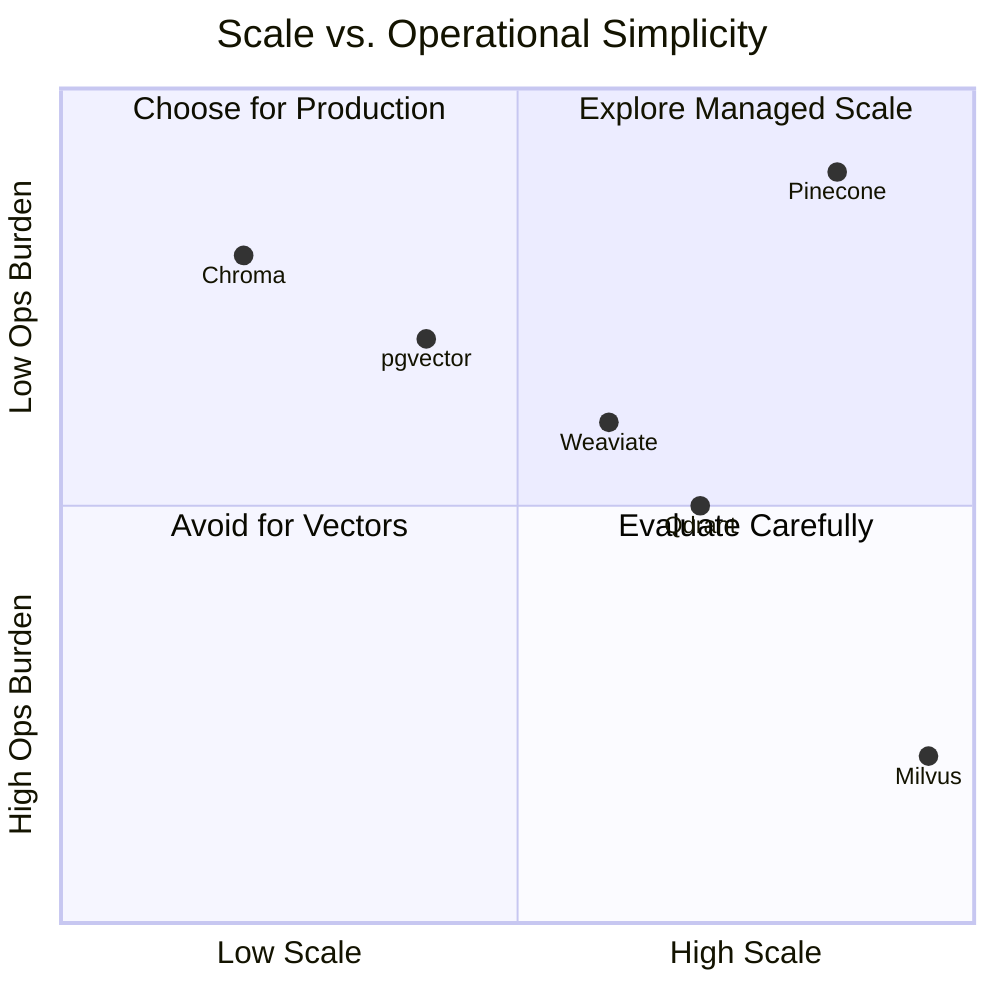
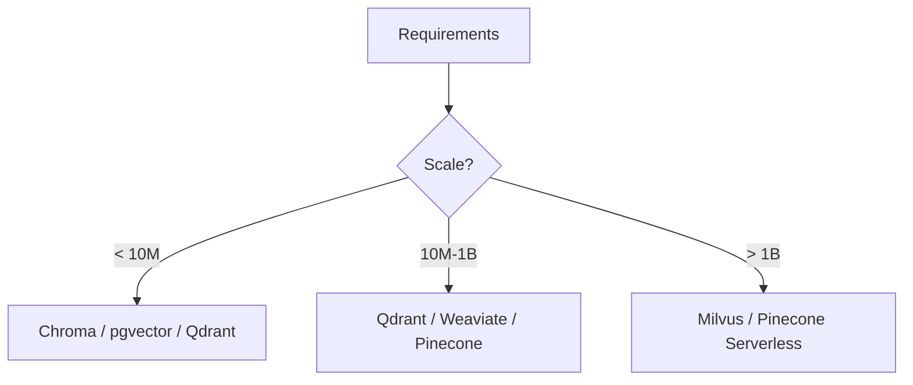

# 📊 09 - Vector Database Comparison Matrix

## 🎯 Learning Objectives
- Compare six vector databases across 10+ operational dimensions
- Identify deployment model, scalability ceiling, and consistency guarantees of each engine
- Evaluate hybrid search capabilities, client ecosystems, and pricing models
- Build a decision framework that maps business requirements to the optimal database choice

## Introduction

The vector database landscape has exploded since 2020, with each engine optimizing for a different point in the design space: simplicity vs. scale, managed vs. self-hosted, strong vs. eventual consistency. Choosing the wrong engine can saddle a team with operational toil, vendor lock-in, or latency regressions. Conversely, the right choice can reduce infrastructure costs by 10x.

This note provides a structured comparison of Qdrant, Milvus, pgvector, Pinecone, Weaviate, and Chroma. Rather than declaring a winner, we construct a decision framework. The comparison connects back to [[05 - Qdrant I - Architecture and Collections|Qdrant]], [[07 - Milvus I - Distributed Architecture|Milvus]], and [[03 - pgvector I - Core Operations and Indexing|pgvector]] deep-dives.

---

## 1. Comparison Dimensions and Decision Framework

Vector databases differ along axes that traditional SQL comparisons ignore: **index build time**, **recall/latency trade-offs**, **dimension limits**, and **multi-vector support**. The most critical dimension is deployment model. Managed services eliminate ops but restrict customization; self-hosted engines offer full control but require SRE expertise.

Scalability is the second axis. Single-node engines (Chroma, pgvector) cap at memory size. Distributed engines (Milvus, Qdrant) partition data, but consistency models differ: Milvus uses etcd for strong metadata consistency; Qdrant prefers Raft for partition-level consensus.

**Caso real — Fortune 500 retailer**: Evaluated all six engines for 200M-vector product search. Eliminated Chroma (single-node only), pgvector (index build slow at 200M), Pinecone (3x cost at scale). Final shootout: Milvus vs. Qdrant. Milvus won due to GPU index support for image-search batch jobs; Qdrant kept as hot-failover for text embeddings.

| Dimension | Qdrant | Milvus | pgvector | Pinecone | Weaviate | Chroma |
|-----------|--------|--------|----------|----------|----------|--------|
| Deployment | Self-hosted | Self/K8s/Managed | Self/RDS | Managed | Self/Cloud | Embedded |
| Max vectors | ~10B | ~100B+ | ~100M (1 node) | ~10B | ~1B | ~1M |
| Consistency | Raft (partition) | Strong (etcd) | ACID | Eventual | Eventual | None |
| Hybrid search | Payload indexes | Scalar filter | B-tree + GIN | Metadata filter | GraphQL hybrid | Basic filter |
| Lang clients | Py/Go/Rust/JS/CPP | Py/Go/Java/C++ | SQL/ORM | Py/Go/JS | Py/Go/JS | Py/JS |
| Pricing | Free/Enterprise | Free/Managed/Ent | Free OSS | Per-dim + req | Free/Cloud | Free |
| Best use case | Filtered ANN | Billion-scale GPU | SQL app add-on | Rapid startup | Multi-modal RAG | Prototype/local |

```python
from abc import ABC, abstractmethod
from typing import List, Tuple, Dict

class VectorDB(ABC):
    @abstractmethod
    def upsert(self, ids, vectors, payloads): ...
    @abstractmethod
    def search(self, vector, top_k, filters) -> List[Tuple[str, float]]: ...
    @abstractmethod
    def info(self) -> Dict: ...

def recommend(scale_m: int, ops: str, latency_ms: int, stack: str) -> str:
    if scale_m < 10:
        return "pgvector" if stack == "postgres" else "Qdrant"
    if scale_m > 1000:
        return "Milvus" if ops == "high" else "Pinecone"
    if latency_ms < 30:
        return "Qdrant"
    return "Weaviate"
```

💡 A database that scores well on 1M vectors may collapse at 500M due to metadata overhead. Always benchmark at 2x expected production scale.

❌ **Antipattern**: Startup choosing Milvus for 1M vectors — wastes engineering on K8s instead of product-market fit.  
✅ **Correct**: Start with Chroma or pgvector; migrate when metrics demand it.

❌ **Antipattern**: Ignoring egress costs — managed DB in a different region than app servers incurs massive data transfer fees.  
✅ **Correct**: Co-locate database and application in the same cloud region.

❌ **Antipattern**: Assuming SQL skills transfer to pgvector — tuning `hnsw.ef_search` and `maintenance_work_mem` is vector-specific.  
✅ **Correct**: Budget vector-DB-specific training for DBAs.

```python
scores = {
    "Qdrant":     {"scale": 8, "ops": 6, "consistency": 7, "hybrid": 8, "cost_ctrl": 9, "ecosystem": 7},
    "Milvus":     {"scale": 10, "ops": 3, "consistency": 8, "hybrid": 9, "cost_ctrl": 7, "ecosystem": 8},
    "pgvector":   {"scale": 5, "ops": 8, "consistency": 9, "hybrid": 8, "cost_ctrl": 8, "ecosystem": 6},
    "Pinecone":   {"scale": 9, "ops": 10, "consistency": 6, "hybrid": 7, "cost_ctrl": 4, "ecosystem": 9},
    "Weaviate":   {"scale": 7, "ops": 7, "consistency": 6, "hybrid": 9, "cost_ctrl": 5, "ecosystem": 8},
    "Chroma":     {"scale": 3, "ops": 9, "consistency": 5, "hybrid": 5, "cost_ctrl": 9, "ecosystem": 8},
}
```



## 2. Decision Framework

The framework uses four primary constraints — scale, ops budget, latency SLA, existing stack — mapped to a recommended engine. Secondary constraints (hybrid search complexity, GPU needs, multi-tenancy) serve as tiebreakers.

The key insight: **choosing a vector DB is not a one-time decision**. Mature platforms run a polyglot stack — pgvector for transactional metadata, Qdrant for high-precision text search, Milvus for batch image indexing. [[11 - Capstone Project - Multi-DB Semantic Search Platform|The capstone]] demonstrates exactly this architecture.

**Caso real — Healthcare AI platform**: Needed HIPAA-compliant vector search. Managed services were disqualified (BAA limitations). Chose pgvector on AWS Aurora for < 50M patient embeddings, with a migration path to Milvus if scale exceeds Aurora's limit. Framework saved 6 weeks of evaluation.



---

## 🎯 Key Takeaways
- No vector database is universally best; optimal choice depends on scale, ops budget, latency SLA, and existing stack.
- pgvector excels for SQL-native teams with < 100M vectors; Milvus is the only self-hosted option for billion-scale GPU search.
- Qdrant balances scale, latency, and simplicity — safest default for K8s-native teams without GPU needs.
- Pinecone minimizes ops but introduces dimension-based pricing that scales nonlinearly.
- Chroma is strictly for prototypes — never for concurrent production workloads.
- A multi-engine strategy (pgvector for metadata, Milvus/Qdrant for ANN) is often the most robust architecture.
- Always benchmark at 2x expected scale; include egress, storage, and ops labor in TCO.

## References
- Qdrant: https://qdrant.tech/documentation/
- Milvus: https://milvus.io/docs
- pgvector: https://github.com/pgvector/pgvector
- Pinecone: https://docs.pinecone.io/
- Weaviate: https://weaviate.io/developers/weaviate
- Chroma: https://docs.trychroma.com/
- ANN-Benchmarks: https://ann-benchmarks.com/
- [[05 - Qdrant I - Architecture and Collections]]
- [[07 - Milvus I - Distributed Architecture]]
- [[03 - pgvector I - Core Operations and Indexing]]
- [[11 - Capstone Project - Multi-DB Semantic Search Platform]]

## 📦 Código de compresión
```python
from abc import ABC, abstractmethod
from typing import List, Tuple, Dict

class VectorDB(ABC):
    @abstractmethod
    def upsert(self, ids, vectors, payloads): ...
    @abstractmethod
    def search(self, vector, top_k, filters) -> List[Tuple[str, float]]: ...
    @abstractmethod
    def info(self) -> Dict: ...

def recommend(scale_m: int, ops: str, latency_ms: int, stack: str) -> str:
    if scale_m < 10:
        return "pgvector" if stack == "postgres" else "Qdrant"
    if scale_m > 1000:
        return "Milvus" if ops == "high" else "Pinecone"
    return "Qdrant" if latency_ms < 30 else "Weaviate"

print(recommend(scale_m=200, ops="medium", latency_ms=15, stack="k8s"))
```
