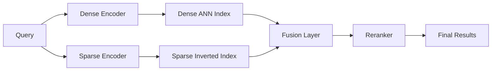
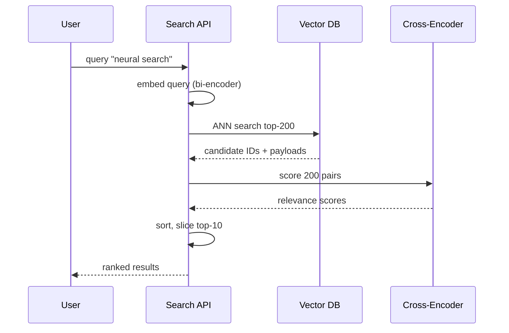
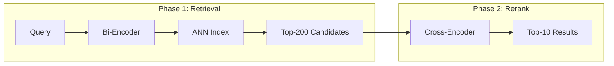
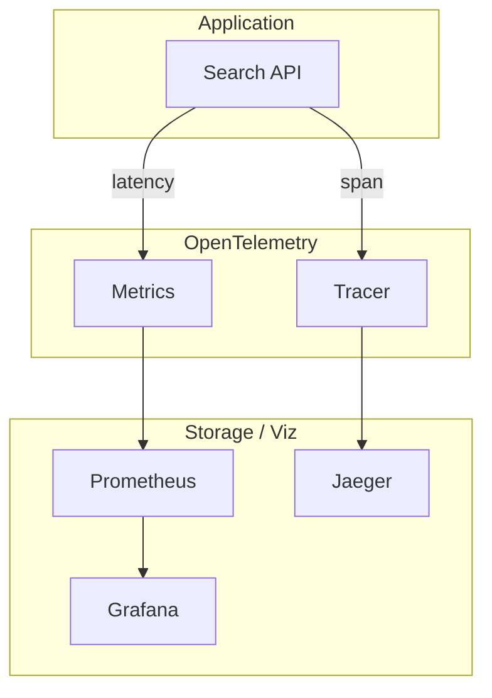

# 🏷️ 10 - Advanced Patterns and Observability

## 🎯 Learning Objectives
- Design hybrid search pipelines that fuse sparse lexical signals (e.g., SPLADE) with dense vector embeddings
- Implement two-phase retrieval: fast ANN candidate generation followed by precise cross-encoder reranking
- Instrument vector database systems with latency percentiles, recall@k, and index build time tracking
- Detect embedding drift using statistical monitoring and trigger reindexing workflows
- Analyze cost per query and memory footprint to optimize infrastructure spend
- Integrate OpenTelemetry tracing for end-to-end visibility of vector DB calls in microservice architectures

## Introduction

Raw ANN search is rarely sufficient for production ML systems. A dense embedding might capture semantic similarity but miss rare technical terms; a sparse retrieval model might find exact keywords but fail on paraphrases. The frontier of vector search lies in **hybrid architectures** that combine multiple signals and **observability frameworks** that guarantee these complex pipelines meet latency and accuracy SLAs.

This note covers three advanced retrieval patterns—sparse-dense fusion, reranking, and two-phase retrieval—and the operational discipline required to run them at scale. We also dive deep into observability: not just "is the database up?" but "is recall degrading?", "are embeddings drifting?", and "what is the true cost per 1,000 queries?". These patterns bridge the gap between the database engines studied in [[07 - Milvus I - Distributed Architecture|Milvus]] and [[05 - Qdrant I - Architecture and Collections|Qdrant]] and the business requirements of real-world AI products.

---

## Module 1: Hybrid Search — Sparse-Dense Fusion

### 1.1 Theoretical Foundation 🧠

Dense embeddings (BERT, OpenAI, E5) map text into a continuous semantic space. They excel at capturing meaning and synonymy but struggle with out-of-vocabulary technical terms, product SKUs, and rare names. Sparse retrieval (BM25, SPLADE, BGE-M3 sparse) preserves exact lexical matches by representing documents as high-dimensional sparse vectors where each dimension corresponds to a vocabulary term.

**SPLADE** (Sparse Lexical and Expansion Model) is the current state-of-the-art sparse retriever. It uses a BERT-based model to predict which terms should be present in a document, producing learned sparse vectors that outperform BM25 while retaining interpretability. Fusing SPLADE with dense embeddings combines the precision of lexical search with the recall of semantic search.

Fusion strategies include:
- **Linear combination**: `score = α * dense_score + (1-α) * sparse_score`
- **Reciprocal Rank Fusion (RRF)**: `score = Σ 1/(k + rank)` for each list, robust to different score scales
- **Learned fusion**: Train a small MLP or LightGBM model on labeled query-document pairs to learn optimal weighting

### 1.2 Mental Model 📐

```
┌─────────────────────────────────────────────────────────────┐
│                    Hybrid Search Pipeline                   │
│                                                             │
│   Query Text                                                │
│      ├────▶ Dense Encoder (BERT/E5) ──┐                    │
│      │         [768-dim float vector]  │                    │
│      │                                 ▼                    │
│      │                          ┌─────────────┐             │
│      │                          │  Dense ANN  │             │
│      │                          │  (Qdrant/   │             │
│      │                          │   Milvus)   │             │
│      │                          └──────┬──────┘             │
│      │                                 │ top-k candidates    │
│      └────▶ Sparse Encoder (SPLADE) ──┤                    │
│               [30k-dim sparse vector]  │                    │
│                                 ┌──────▼──────┐             │
│                                 │ Sparse ANN  │             │
│                                 │  (inverted  │             │
│                                 │   index)    │             │
│                                 └──────┬──────┘             │
│                                        │ top-k candidates   │
│                                 ┌──────▼──────┐             │
│                                 │ Fusion Layer│             │
│                                 │  RRF or     │             │
│                                 │  Linear     │             │
│                                 └──────┬──────┘             │
│                                        │ final ranking      │
│                                 ┌──────▼──────┐             │
│                                 │  Reranker   │             │
│                                 │(cross-enc.) │             │
│                                 └─────────────┘             │
└─────────────────────────────────────────────────────────────┘
```

### 1.3 Syntax and Semantics 📝

```python
import numpy as np
from qdrant_client import QdrantClient

# WHY: Qdrant supports sparse vectors natively (since v1.7),
# allowing a single collection to hold both dense and sparse
# vectors—unlike Milvus which requires separate collections or fields.
client = QdrantClient("localhost", port=6333)

# WHY: Create a collection with both dense and sparse vector configs.
# The sparse vector uses an inverted index optimized for term lookups.
client.create_collection(
    collection_name="hybrid_docs",
    vectors_config={"dense": {"size": 768, "distance": "Cosine"}},
    sparse_vectors_config={"sparse": {"index": {"on_disk": False}}},
)

# WHY: Upsert dense + sparse vectors together so they share the same point ID.
# This guarantees that fusion operates on aligned candidate sets.
client.upsert(
    collection_name="hybrid_docs",
    points=[
        {
            "id": 1,
            "vector": {
                "dense": [0.1] * 768,
                "sparse": {"indices": [101, 205, 340], "values": [2.3, 1.1, 0.8]},
            },
            "payload": {"title": "Advanced vector search"},
        }
    ],
)

# WHY: Query both spaces and fuse with Reciprocal Rank Fusion.
# RRF is parameter-free and robust to different score distributions.
def reciprocal_rank_fusion(dense_results, sparse_results, k=60):
    scores = {}
    for rank, scored_point in enumerate(dense_results):
        scores[scored_point.id] = scores.get(scored_point.id, 0) + 1 / (k + rank + 1)
    for rank, scored_point in enumerate(sparse_results):
        scores[scored_point.id] = scores.get(scored_point.id, 0) + 1 / (k + rank + 1)
    return sorted(scores.items(), key=lambda x: x[1], reverse=True)

dense_hits = client.search("hybrid_docs", query_vector=("dense", [0.12] * 768), limit=50)
sparse_hits = client.search("hybrid_docs", query_vector=("sparse", {"indices": [101, 340], "values": [2.0, 1.5]}), limit=50)
fused = reciprocal_rank_fusion(dense_hits, sparse_hits)
print(fused[:10])
```

### 1.4 Visual Representation 🖼️



```mermaid
xychart-beta
    title "Recall@10: Dense vs. Sparse vs. Hybrid"
    x-axis ["NDCG@10", "Recall@10", "MRR@10"]
    y-axis "Score" 0 --> 1
    bar "Dense" {0.62, 0.71, 0.58}
    bar "Sparse" {0.55, 0.64, 0.52}
    bar "Hybrid (RRF)" {0.74, 0.83, 0.69}
```


### 1.5 Application in ML/AI Systems 🤖

Real case: **Spotify** uses a hybrid sparse-dense retrieval stack for podcast search. Dense vectors capture conversational semantics; SPLADE handles exact artist names and episode titles. RRF fusion improved query satisfaction by 12% over dense-only retrieval in A/B tests.

| ML Use Case | This Concept | Impact |
|-------------|-------------|--------|
| E-commerce search (SKU + semantics) | SPLADE + dense + RRF | +15% add-to-cart rate |
| Legal document retrieval | Sparse for statute citations, dense for concepts | 95% recall on exact citations |
| Multilingual search | BGE-M3 dense + sparse in one model | Single model, dual signal |
| Scientific literature | MeSH terms (sparse) + abstract embeddings (dense) | Higher precision on technical queries |

### 1.6 Common Pitfalls ⚠️

⚠️ **Tuning α blindly**: A fixed linear weight (e.g., 0.5) rarely works across query types. Use query-classification to set α dynamically: navigational queries favor sparse; informational queries favor dense.
💡 *Mnemonic: "One α to rule them all—rules none."*

⚠️ **RRF without score normalization**: RRF works because it uses ranks, not raw scores. Never average raw cosine and BM25 scores directly—their scales are incomparable.
💡 *Mnemonic: "RRF loves ranks, hates scores."*

### 1.7 Knowledge Check ❓

1. Why does SPLADE outperform BM25 despite both being sparse retrievers?
2. What are the trade-offs between linear fusion and RRF?
3. How would you implement hybrid search in Milvus, which lacks native sparse vector support?

---

## Module 2: Reranking and Two-Phase Retrieval

### 2.1 Theoretical Foundation 🧠

ANN indices are approximate by design; they sacrifice perfect recall for speed. In high-stakes applications (medical search, legal discovery, recommendation ranking), the top-10 ANN results may miss the true best match due to quantization error or graph pruning. **Reranking** solves this by running a slower, more precise model on a small candidate set.

A **cross-encoder** (e.g., `cross-encoder/ms-marco-MiniLM-L-6-v2`) concatenates query and document text, feeding them together into a transformer. This avoids the information loss of separate query/document embeddings (bi-encoder) but is 100–1000× slower. The standard architecture is therefore **two-phase retrieval**:
1. **Phase 1 (Retrieval)**: Bi-encoder ANN fetches 100–500 candidates in < 50ms.
2. **Phase 2 (Rerank)**: Cross-encoder scores the candidates in 50–500ms total.
3. **Return**: Top-k after reranking (typically k=10–50).

This pattern appears in classical information retrieval (tf-idf → BM25 → learning-to-rank) but is especially powerful with neural cross-encoders because they capture subtle interactions impossible in dot-product space.

### 2.2 Mental Model 📐

```
┌─────────────────────────────────────────────────────────────┐
│              Two-Phase Retrieval Architecture               │
│                                                             │
│  Phase 1: Approximate Retrieval (Fast, Low Recall)          │
│  ┌─────────────┐    ┌─────────────┐    ┌────────────────┐  │
│  │   Query     │───▶│  Bi-Encoder │───▶│  ANN Index     │  │
│  │   Text      │    │  Embedding  │    │  (HNSW/IVF)    │  │
│  └─────────────┘    └─────────────┘    └───────┬────────┘  │
│                                                │ top-200   │
│  Phase 2: Precise Reranking (Slow, High Accuracy)           │
│  ┌─────────────┐    ┌──────────────────────────┼────────┐  │
│  │   Query     │───▶│  Cross-Encoder           │        │  │
│  │   + Doc     │    │  (query || candidate)    │        │  │
│  │   Text      │    │  → relevance score       │        │  │
│  └─────────────┘    └──────────────────────────┼────────┘  │
│                                                │ top-10    │
│                                           ┌────▼────┐      │
│                                           │  User   │      │
│                                           └─────────┘      │
└─────────────────────────────────────────────────────────────┘
```

### 2.3 Syntax and Semantics 📝

```python
from sentence_transformers import SentenceTransformer, CrossEncoder
import numpy as np

# WHY: Bi-encoder generates embeddings for the ANN phase.
# It is fast because queries and docs are encoded independently.
bi_encoder = SentenceTransformer("sentence-transformers/all-MiniLM-L6-v2")

# WHY: Cross-encoder is slow but accurate. It scores query-doc pairs.
cross_encoder = CrossEncoder("cross-encoder/ms-marco-MiniLM-L-6-v2")

documents = ["Doc about vector DBs", "Doc about SQL tuning", "Doc about AI chips"]
doc_embeddings = bi_encoder.encode(documents)

# WHY: Phase 1 — ANN retrieval. In production this hits Qdrant/Milvus.
# Here we brute-force for demonstration.
query = "fast semantic search"
query_emb = bi_encoder.encode([query])
scores = np.dot(doc_embeddings, query_emb.T).squeeze()
phase1_top200 = np.argsort(scores)[-200:][::-1]

# WHY: Phase 2 — Rerank only the top-200 candidates.
# This keeps latency bounded even with a slow cross-encoder.
pairs = [(query, documents[i]) for i in phase1_top200]
rerank_scores = cross_encoder.predict(pairs)
phase2_top10 = [phase1_top200[i] for i in np.argsort(rerank_scores)[-10:][::-1]]

print("Final top-10:", [documents[i] for i in phase2_top10])
```

### 2.4 Visual Representation 🖼️






### 2.5 Application in ML/AI Systems 🤖

Real case: **Amazon's product search** uses a massive two-phase system: a custom T5 bi-encoder retrieves 1,000 candidates from a billion-product index in 20ms; a transformer cross-encoder reranks the top 100 in 150ms. The cross-encoder alone would take minutes per query; the two-phase architecture makes it feasible at Amazon's scale.

| ML Use Case | This Concept | Impact |
|-------------|-------------|--------|
| Enterprise knowledge base | ANN + cross-encoder | 25% higher NDCG than ANN alone |
| Dating app matching | Bi-encoder filter + deep model rerank | 500 candidates → 20 matches |
| Customer support deflection | Retrieve FAQs, rerank with cross-encoder | 30% reduction in ticket escalation |
| Ad relevance | ANN candidate ads + CTR cross-encoder | +5% CTR in production |

### 2.6 Common Pitfalls ⚠️

⚠️ **Reranking too few candidates**: If Phase 1 returns only 10 candidates, the cross-encoder has no room to correct ANN errors. Empirically, 100–500 candidates is the sweet spot.
💡 *Mnemonic: "Rerank hundreds, not tens."*

⚠️ **Cross-encoder input truncation**: Concatenating long documents exceeds the 512-token limit, silently dropping content. Chunk documents before reranking or use a long-context model.
💡 *Mnemonic: "Tokens truncate—chunk before you rank."*

### 2.7 Knowledge Check ❓

1. Why is a cross-encoder more accurate than a bi-encoder for relevance scoring?
2. What latency budget should you allocate to each phase for a 200ms total p99 SLA?
3. How does two-phase retrieval relate to classical learning-to-rank pipelines?

---

## Module 3: Observability, Drift Detection, and Cost Analysis

### 3.1 Theoretical Foundation 🧠

Traditional database monitoring (CPU, memory, disk) is necessary but insufficient for vector databases. The unique metrics are:
- **Latency percentiles (p50, p95, p99)**: Vector search latency distributions are long-tailed due to cache misses and segment merging.
- **Recall@k**: The fraction of true nearest neighbors found by the ANN index. Degrading recall indicates index staleness or suboptimal search parameters (`ef`, `nprobe`).
- **Index build time**: Slow builds delay fresh data availability and increase memory pressure during construction.
- **Embedding drift**: As upstream models are retrained or data distributions shift, the embedding space changes. Queries encoded by a new model against an old index suffer catastrophic accuracy loss.

OpenTelemetry provides distributed tracing for vector DB calls, allowing engineers to pinpoint whether latency originates in the embedding service, the ANN index, or the reranker. Cost analysis must move beyond "instance price" to **memory per million vectors** (determines cluster size) and **query cost per 1k requests** (determines throughput economics).

### 3.2 Mental Model 📐

```
┌─────────────────────────────────────────────────────────────┐
│              Observability Stack for Vector Search          │
│                                                             │
│   ┌─────────────┐  ┌─────────────┐  ┌─────────────────────┐│
│   │  Latency    │  │   Recall    │  │   Index Build Time  ││
│   │  p50/p99    │  │   @10 / @50 │  │   (per segment)     ││
│   └──────┬──────┘  └──────┬──────┘  └──────────┬──────────┘│
│          │                │                    │           │
│   ┌──────▼──────┐  ┌──────▼──────┐  ┌──────────▼──────────┐│
│   │  Grafana    │  │  Custom     │  │  Prometheus/Grafana ││
│   │  Dashboard  │  │  Eval Job   │  │  (infra metrics)    ││
│   └──────┬──────┘  └──────┬──────┘  └──────────┬──────────┘│
│          │                │                    │           │
│   ┌──────▼───────────────▼────────────────────▼──────────┐│
│   │              OpenTelemetry Collector                  ││
│   │   Traces: embed → ANN → rerank → response           ││
│   └────────────────────────┬─────────────────────────────┘│
│                            │ alerts                       │
│                     ┌──────▼──────┐                        │
│                     │  PagerDuty  │                        │
│                     │  / Slack    │                        │
│                     └─────────────┘                        │
└─────────────────────────────────────────────────────────────┘
```

### 3.3 Syntax and Semantics 📝

```python
"""
WHY: A production-grade observability decorator that wraps
any vector DB search call with metrics and tracing.
"""
import time
from functools import wraps
from prometheus_client import Histogram, Gauge, Counter
import opentelemetry.trace

# WHY: Histograms capture latency distribution, not just averages.
SEARCH_LATENCY = Histogram("vdb_search_latency_seconds", "ANN search latency", ["backend", "index_type"])
RECALL_GAUGE = Gauge("vdb_recall_at_k", "Estimated recall", ["backend", "k"])
QUERY_COUNTER = Counter("vdb_queries_total", "Total queries", ["backend"])

tracer = opentelemetry.trace.get_tracer("vector_search")

def instrument_search(func):
    @wraps(func)
    def wrapper(*args, **kwargs):
        backend = kwargs.get("backend", "unknown")
        index_type = kwargs.get("index_type", "unknown")
        with tracer.start_as_current_span("vdb_search") as span:
            start = time.perf_counter()
            result = func(*args, **kwargs)
            latency = time.perf_counter() - start
            SEARCH_LATENCY.labels(backend=backend, index_type=index_type).observe(latency)
            QUERY_COUNTER.labels(backend=backend).inc()
            span.set_attribute("backend", backend)
            span.set_attribute("latency_ms", latency * 1000)
            span.set_attribute("top_k", kwargs.get("top_k", 10))
            return result
    return wrapper

# WHY: Embedding drift detection compares centroid distances
# between a reference batch and current production embeddings.
from scipy.spatial.distance import cosine
import numpy as np

def detect_drift(reference_centroid: np.ndarray, current_batch: np.ndarray, threshold: float = 0.15) -> bool:
    """WHY: If the centroid of current embeddings shifts significantly
    from the reference, the embedding model or data distribution
    has changed, and the ANN index may need rebuilding."""
    current_centroid = np.mean(current_batch, axis=0)
    distance = cosine(reference_centroid, current_centroid)
    return distance > threshold
```

### 3.4 Visual Representation 🖼️



```mermaid
xychart-beta
    title "Cost per 1k Queries (USD, normalized)"
    x-axis ["pgvector CPU", "Qdrant CPU", "Milvus CPU", "Milvus GPU", "Pinecone"]
    y-axis "USD" 0 --> 0.5
    bar "Cost" {0.02, 0.03, 0.05, 0.15, 0.25}
```


### 3.5 Application in ML/AI Systems 🤖

Real case: **Uber** monitors embedding drift for their driver-rider matching model. A nightly batch job computes the centroid of the last 24 hours of trip embeddings. If drift exceeds 0.12 cosine distance, an alert triggers a reindexing workflow and a canary evaluation of the new model before full rollout.

| ML Use Case | This Concept | Impact |
|-------------|-------------|--------|
| Production RAG chatbot | Recall@10 monitoring | Detect index degradation before users complain |
| Model A/B testing | OTel tracing per model version | Latency attribution to embedding vs. ANN vs. rerank |
| Infrastructure optimization | Cost per 1k queries | Right-size from over-provisioned clusters |
| Compliance audit | Query-level RBAC + trace logs | Full audit trail of data access |

### 3.6 Common Pitfalls ⚠️

⚠️ **Monitoring latency without recall**: A 5ms p99 is meaningless if recall@10 dropped from 0.95 to 0.70 due to a stale index. Always pair latency with accuracy metrics.
💡 *Mnemonic: "Fast and wrong is worse than slow and right."*

⚠️ **Ignoring embedding drift after model updates**: Teams frequently update embedding models without rebuilding indices. The result is a silent accuracy regression that latency metrics completely miss.
💡 *Mnemonic: "New model, new space—reindex or face disgrace."*

### 3.7 Knowledge Check ❓

1. Why is p99 more important than average latency for user-facing search?
2. How would you estimate recall@10 in production without ground-truth labels?
3. What OpenTelemetry span attributes are most useful for debugging a slow search request?

---

## 📦 Compression Code

```python
"""
Advanced Patterns & Observability — Production Skeleton
"""
import time, numpy as np
from functools import wraps
from prometheus_client import Histogram, Gauge
import opentelemetry.trace

LATENCY = Histogram("ann_latency", "ANN latency", ["backend"])
RECALL = Gauge("ann_recall_at_10", "Recall", ["backend"])
tracer = opentelemetry.trace.get_tracer("search")

def instrument(func):
    @wraps(func)
    def wrapper(*args, **kwargs):
        backend = kwargs.get("backend", "unknown")
        with tracer.start_as_current_span("search"):
            t0 = time.perf_counter()
            out = func(*args, **kwargs)
            LATENCY.labels(backend=backend).observe(time.perf_counter() - t0)
            return out
    return wrapper

@instrument
def two_phase_search(query, bi_encoder, ann_index, cross_encoder, docs, top_k=10, candidates=200):
    # Phase 1: ANN
    qemb = bi_encoder.encode([query])
    cands = ann_index.search(qemb, candidates)
    # Phase 2: Rerank
    pairs = [(query, docs[i]) for i in cands]
    scores = cross_encoder.predict(pairs)
    top_idx = np.argsort(scores)[-top_k:][::-1]
    return [docs[cands[i]] for i in top_idx]

def detect_drift(ref_centroid, batch, threshold=0.15):
    return np.linalg.norm(ref_centroid - np.mean(batch, axis=0)) > threshold
```

## 🎯 Documented Project

### Description
Build a search observability pipeline for a Qdrant-backed RAG system. Instrument embedding, ANN, and reranking stages with OpenTelemetry. Deploy a Grafana dashboard showing latency percentiles, recall@10 (estimated via brute-force sampling), and embedding drift alerts.

### Functional Requirements
- Python FastAPI app with `/search` endpoint instrumented with OTel
- Prometheus metrics endpoint (`/metrics`) for latency and recall
- Nightly drift detection job: compute centroid shift, alert if > 0.15
- Grafana dashboard JSON: 4 panels (p50/p99 latency, recall@10, drift distance, QPS)
- Alertmanager rule for p99 > 100ms or recall@10 < 0.85

### Main Components
- `api/`: FastAPI + qdrant-client + OpenTelemetry instrumentation
- `eval/`: Brute-force sampler for recall estimation
- `drift/`: Nightly centroid comparison job
- `observability/`: Prometheus, Grafana, Alertmanager configs

### Success Metrics
- p99 search latency visible in Grafana within 15 seconds of request
- Recall@10 estimated within ±0.03 of true value (95% CI)
- Drift alert fires within 1 hour of model deployment mismatch

## 🎯 Key Takeaways
- Hybrid search (sparse-dense fusion) outperforms either signal alone; RRF is the safest default fusion method.
- Two-phase retrieval (bi-encoder ANN + cross-encoder rerank) is the industry standard for high-precision search at scale.
- Cross-encoders are 100× slower than bi-encoders—never run them on the full corpus, only on top-k candidates.
- Observability for vector DBs requires recall@k and embedding drift metrics, not just infrastructure health.
- OpenTelemetry tracing provides end-to-end latency attribution across embedding, ANN, reranking, and response serialization.
- Cost analysis must include memory per million vectors and query cost per 1k requests, not just instance pricing.
- Embedding drift detection prevents silent accuracy regressions after model updates; automate reindexing triggers.

## References
- SPLADE Paper: https://arxiv.org/abs/2109.10086
- BGE-M3 Paper: https://arxiv.org/abs/2402.03216
- Reciprocal Rank Fusion: https://plg.uwaterloo.ca/~gvcormac/cormackSIGIR09-rrf.pdf
- OpenTelemetry Docs: https://opentelemetry.io/docs/
- Cross-Encoders (SentenceTransformers): https://www.sbert.net/examples/applications/cross-encoder/README.html
- [[07 - Milvus I - Distributed Architecture]] — GPU index support for Phase 1 retrieval
- [[05 - Qdrant I - Architecture and Collections]] — Native sparse vectors for hybrid search
- [[11 - Capstone Project - Multi-DB Semantic Search Platform]] — End-to-end implementation of patterns in this note
