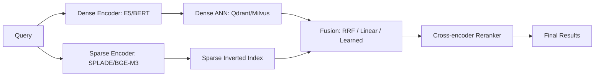
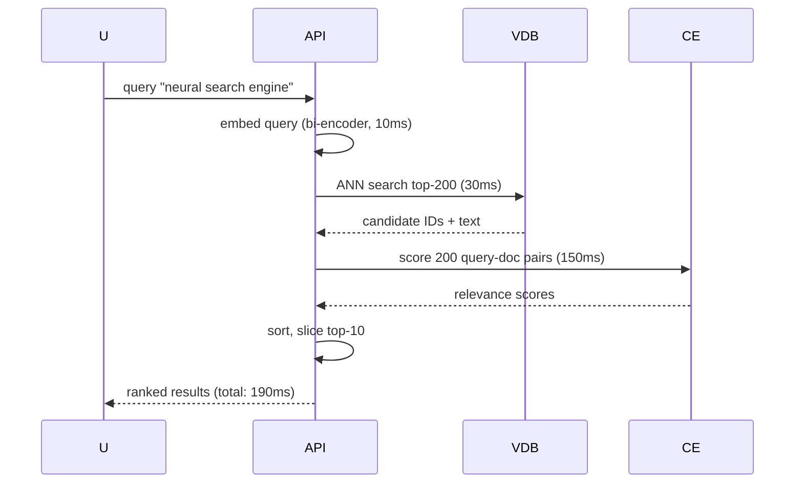
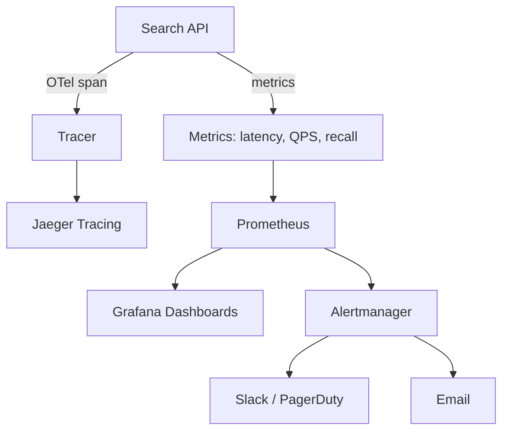

# 🔍 10 - Advanced Patterns and Observability

## 🎯 Learning Objectives
- Design hybrid search pipelines that fuse sparse lexical signals (SPLADE) with dense vector embeddings
- Implement two-phase retrieval: fast ANN candidate generation + precise cross-encoder reranking
- Instrument vector database systems with latency percentiles, recall@k, and index build time tracking
- Detect embedding drift using centroid distance monitoring and trigger reindexing workflows
- Analyze cost per query and memory footprint to optimize infrastructure spend
- Integrate OpenTelemetry tracing for end-to-end visibility of vector DB calls in microservice architectures

## Introduction

Raw ANN search is rarely sufficient for production ML systems. A dense embedding captures semantic similarity but misses rare technical terms; a sparse retrieval model finds exact keywords but fails on paraphrases. The frontier of vector search lies in **hybrid architectures** that combine multiple signals and **observability frameworks** that guarantee these complex pipelines meet latency and accuracy SLAs.

This note covers three advanced retrieval patterns — sparse-dense fusion, reranking, and two-phase retrieval — and the operational discipline required to run them at scale. We dive deep into observability: not just "is the database up?" but "is recall degrading?", "are embeddings drifting?", and "what is the true cost per 1,000 queries?". These patterns bridge the gap between [[07 - Milvus I - Distributed Architecture|Milvus]] and [[05 - Qdrant I - Architecture and Collections|Qdrant]] and the business requirements of real-world AI products.

---

## 1. Hybrid Search — Sparse-Dense Fusion

Dense embeddings (BERT, OpenAI, E5) map text into a continuous semantic space. They excel at capturing meaning and synonymy but struggle with out-of-vocabulary technical terms, product SKUs, and rare names. Sparse retrieval (BM25, SPLADE, BGE-M3 sparse) preserves exact lexical matches by representing documents as high-dimensional sparse vectors where each dimension corresponds to a vocabulary term.

**SPLADE** (Sparse Lexical and Expansion Model) is the state-of-the-art sparse retriever. It uses a BERT-based MLM head to predict term weights — query expansion happens implicitly through the model's language understanding. The resulting sparse vectors outperform BM25 on recall while retaining interpretability (you can inspect which terms contributed to a match).

Fusion strategies ranked by robustness:

| Method | Formula | Pros | Cons |
|--------|---------|------|------|
| RRF | $\sum \frac{1}{k + r(d)}$ | Parameter-free, scale-agnostic | Ignores score magnitude |
| Linear | $\alpha \cdot s_{dense} + (1-\alpha) \cdot s_{sparse}$ | Simple, tunable | Requires scale normalization |
| Learned | MLP or LightGBM on features | Highest accuracy | Needs labeled data |

RRF is the safest default — it converts scores to ranks, eliminating the problem of comparing incomparable score distributions (cosine similarity vs. BM25).

Qdrant supports sparse vectors natively since v1.7, allowing a single collection to hold both dense and sparse vectors. Milvus requires separate collections or fields — a key differentiator when choosing engines for hybrid search.

```python
import numpy as np
from qdrant_client import QdrantClient

client = QdrantClient("localhost", port=6333)

# Single collection with dual vectors
client.create_collection(
    collection_name="hybrid_docs",
    vectors_config={"dense": {"size": 768, "distance": "Cosine"}},
    sparse_vectors_config={"sparse": {"index": {"on_disk": False}}},
)

# Upsert: dense + sparse share the same point ID for aligned fusion
client.upsert(collection_name="hybrid_docs", points=[{
    "id": 1,
    "vector": {
        "dense": [0.1] * 768,
        "sparse": {"indices": [101, 205, 340], "values": [2.3, 1.1, 0.8]},
    },
    "payload": {"title": "Advanced vector search"},
}])

def reciprocal_rank_fusion(dense_results, sparse_results, k=60):
    scores = {}
    for rank, sp in enumerate(dense_results):
        scores[sp.id] = scores.get(sp.id, 0) + 1 / (k + rank + 1)
    for rank, sp in enumerate(sparse_results):
        scores[sp.id] = scores.get(sp.id, 0) + 1 / (k + rank + 1)
    return sorted(scores.items(), key=lambda x: x[1], reverse=True)

dense_hits = client.search("hybrid_docs", query_vector=("dense", [0.12] * 768), limit=50)
sparse_hits = client.search("hybrid_docs", query_vector=("sparse", {"indices": [101, 340], "values": [2.0, 1.5]}), limit=50)
fused = reciprocal_rank_fusion(dense_hits, sparse_hits)
print(fused[:10])
```

⚠️ Never average raw cosine and BM25 scores directly — their scales are incomparable. RRF uses ranks, not scores, avoiding this problem. 💡 *RRF loves ranks, hates scores.*

❌ **Antipattern**: Fixed linear weight ($\alpha=0.5$) for all query types. Navigational queries (product SKU, ISBN) favor sparse; informational queries (concept search, "explain X") favor dense.  
✅ **Correct**: Train a lightweight query classifier (e.g., logistic regression on query length + entity density) to set $\alpha$ dynamically per query.

❌ **Antipattern**: Running dense and sparse ANN queries sequentially — doubles latency unnecessarily.  
✅ **Correct**: Fire both queries concurrently and fuse results on the critical path.

| Approach | NDCG@10 | Recall@10 | MRR@10 |
|----------|---------|-----------|--------|
| Dense only (E5-large) | 0.62 | 0.71 | 0.58 |
| Sparse only (SPLADE) | 0.55 | 0.64 | 0.52 |
| Hybrid RRF (k=60) | 0.74 | 0.83 | 0.69 |

**Caso real — Spotify**: Hybrid sparse-dense retrieval for podcast search. Dense vectors (E5-large, 1024-dim) capture conversational semantics; SPLADE handles exact artist names and episode titles. RRF fusion (k=60) improved query satisfaction by 12% over dense-only in A/B tests over 2M episodes. They cache sparse vectors in Redis for frequently accessed terms.



## 2. Reranking and Two-Phase Retrieval

ANN indices are approximate by design — they sacrifice perfect recall for speed. In high-stakes applications (medical search, legal discovery, recommendation ranking), the top-10 ANN results may miss the true best match due to quantization error or graph pruning. **Reranking** solves this by running a slower, more precise model on a small candidate set.

A **cross-encoder** concatenates query and document text through a transformer, producing a relevance score $s(q, d)$ that captures subtle interactions impossible in dot-product space:

$$s(q, d) = \text{CrossEncoder}(q \oplus d)$$

But this is 100-1000x slower than a bi-encoder because every (query, document) pair requires a forward pass. The standard architecture is therefore **two-phase retrieval**:

1. **Phase 1 (Retrieval)**: Bi-encoder ANN fetches 100-500 candidates in < 50ms
2. **Phase 2 (Rerank)**: Cross-encoder scores candidates in 50-500ms total
3. **Return**: Top-k after reranking (typically k=10-50)

Latency budget allocation for a 200ms p99 SLA:
- Query embedding: ~10ms
- ANN search (Phase 1): ~30ms
- Cross-encoder inference (Phase 2, 200 candidates): ~150ms
- Serialization + overhead: ~10ms

```python
from sentence_transformers import SentenceTransformer, CrossEncoder
import numpy as np

bi_encoder = SentenceTransformer("sentence-transformers/all-MiniLM-L6-v2")
cross_encoder = CrossEncoder("cross-encoder/ms-marco-MiniLM-L-6-v2")

documents = ["Doc about vector DBs", "Doc about SQL tuning", "Doc about AI chips"]
doc_embeddings = bi_encoder.encode(documents)

# Phase 1: Fast ANN retrieval
query = "fast semantic search"
query_emb = bi_encoder.encode([query])
scores = np.dot(doc_embeddings, query_emb.T).squeeze()
phase1_top200 = np.argsort(scores)[-200:][::-1]

# Phase 2: Precise cross-encoder rerank
pairs = [(query, documents[i]) for i in phase1_top200]
rerank_scores = cross_encoder.predict(pairs)
phase2_top10 = [phase1_top200[i] for i in np.argsort(rerank_scores)[-10:][::-1]]
print("Final:", [documents[i] for i in phase2_top10])

# Chunk handling for long documents (>512 tokens)
def chunk_and_rerank(query, doc_text, chunk_size=512):
    chunks = [doc_text[i:i+chunk_size] for i in range(0, len(doc_text), chunk_size)]
    scores = cross_encoder.predict([(query, c) for c in chunks])
    return max(scores)  # max-over-chunks
```

⚠️ If Phase 1 returns only 10 candidates, the cross-encoder has no room to correct ANN errors. Empirical sweet spot: 100-500 candidates. 💡 *Rerank hundreds, not tens.*

❌ **Antipattern**: Cross-encoder silently truncating documents at 512 tokens — document content beyond the limit is completely ignored, potentially discarding the most relevant passage.  
✅ **Correct**: Chunk documents into 512-token segments, score each chunk independently, take max score per document.

❌ **Antipattern**: Running cross-encoder on the full corpus instead of top-k ANN candidates — this is 100x slower and provides no accuracy benefit (cross-encoders on irrelevant documents add noise).  
✅ **Correct**: Always limit Phase 2 to a small candidate set from Phase 1.

**Caso real — Amazon**: Two-phase product search at billion-product scale. A custom T5 bi-encoder retrieves 1,000 candidates in 20ms; a transformer cross-encoder reranks top-100 in 150ms. Without two-phase, the cross-encoder alone would take minutes per query. The system processes 10M queries/day with p99 < 200ms.



## 3. Observability, Drift Detection, and Cost Analysis

Traditional database monitoring (CPU, memory, disk) is necessary but insufficient for vector databases. The unique metrics that matter:

| Metric | What It Detects | Alert Threshold |
|--------|----------------|----------------|
| p50 latency | General system health | > 30ms baseline |
| p99 latency | Long-tail issues (compaction, cache miss) | > 100ms |
| recall@10 | Index staleness, wrong params | < 0.85 vs brute-force |
| Index build time | Resource contention, slow storage | > 2x historical p50 |
| Embedding drift | Model update, data shift | > 0.15 cosine distance |

**OpenTelemetry** provides distributed tracing, letting engineers pinpoint whether latency comes from the embedding service, ANN index, or reranker. A trace might reveal: the embedding model was swapped from MiniLM (384-dim) to E5-large (1024-dim), doubling ANN search time because the larger vectors consume more memory bandwidth.

```python
import time
from functools import wraps
from prometheus_client import Histogram, Gauge, Counter
import opentelemetry.trace

SEARCH_LATENCY = Histogram("vdb_search_latency_seconds", "ANN search latency", ["backend", "index_type"])
RECALL_GAUGE = Gauge("vdb_recall_at_k", "Estimated recall", ["backend", "k"])
QUERY_COUNTER = Counter("vdb_queries_total", "Total queries", ["backend"])
tracer = opentelemetry.trace.get_tracer("vector_search")

def instrument_search(func):
    @wraps(func)
    def wrapper(*args, **kwargs):
        backend = kwargs.get("backend", "unknown")
        with tracer.start_as_current_span("vdb_search") as span:
            start = time.perf_counter()
            result = func(*args, **kwargs)
            latency = time.perf_counter() - start
            SEARCH_LATENCY.labels(backend=backend, index_type=kwargs.get("index_type", "unknown")).observe(latency)
            QUERY_COUNTER.labels(backend=backend).inc()
            span.set_attribute("latency_ms", latency * 1000)
            span.set_attribute("top_k", kwargs.get("top_k", 10))
            return result
    return wrapper

# Embedding drift detection: centroid distance
from scipy.spatial.distance import cosine
import numpy as np

def detect_drift(reference_centroid: np.ndarray, current_batch: np.ndarray, threshold: float = 0.15) -> bool:
    current_centroid = np.mean(current_batch, axis=0)
    distance = cosine(reference_centroid, current_centroid)
    return distance > threshold

# Example: run nightly after model inference batch
ref_centroid = np.load("reference_centroid.npy")
today_embeddings = np.load("today_embeddings.npy")
if detect_drift(ref_centroid, today_embeddings, threshold=0.12):
    print("ALERT: Embedding drift detected. Trigger reindex.")
    # trigger_reindex()
```

⚠️ A 5ms p99 is meaningless if recall@10 dropped from 0.95 to 0.70 due to a stale index. Always pair latency with accuracy metrics. 💡 *Fast and wrong is worse than slow and right.*

❌ **Antipattern**: Updating embedding models without rebuilding ANN indices — a silent accuracy regression that latency and CPU metrics completely miss. This is the most common production incident in vector search.  
✅ **Correct**: Automate drift detection in CI/CD pipeline; trigger reindexing when centroid shift > 0.10-0.15.

❌ **Antipattern**: Only monitoring p50 latency — p50 hides long-tail slowdowns caused by compaction or cache eviction that affect 5% of queries.  
✅ **Correct**: Monitor p50, p95, and p99; alert on p99 deviation beyond 2 standard deviations from rolling 1h baseline.

**Caso real — Uber**: Monitors embedding drift for driver-rider matching model (128-dim embeddings). A nightly batch job computes the centroid of the last 24 hours of trip embeddings. If drift > 0.12 cosine distance, an alert triggers a reindexing workflow and a canary evaluation of the new model before full rollout. This catches model degradation within 24 hours.

**Caso real — RAG chatbot startup**: Monitors recall@10 for production Q&A. When recall dropped from 0.92 to 0.78, OTel traces revealed the embedding service had rolled a new model version (text-embedding-3-small → text-embedding-3-large) without updating the ANN index. Automated drift detection now prevents this — the CI pipeline rejects a model change if drift > 0.10 against a reference batch.

```python
# Cost per 1k queries
HOURLY_COST = 15.00  # USD per GPU node (A10G on-demand)
QUERIES_PER_SEC = 500  # sustained throughput per node
COST_PER_1K = (HOURLY_COST / 3600) * (1000 / QUERIES_PER_SEC)
print(f"Cost per 1k queries: ${COST_PER_1K:.4f}")
# Cost per 1k queries: $0.0083
```



---

## 🎯 Key Takeaways
- Hybrid search (sparse-dense fusion) outperforms either signal alone; RRF is the safest default fusion method.
- Two-phase retrieval (bi-encoder ANN + cross-encoder rerank) is the industry standard for high-precision search at scale.
- Cross-encoders are 100x slower than bi-encoders — never run them on the full corpus, only on top-k candidates (100-500).
- Observability requires recall@k and embedding drift metrics, not just infrastructure health.
- OpenTelemetry tracing provides end-to-end latency attribution across embedding, ANN, reranking, and response.
- Cost analysis must include memory per million vectors and query cost per 1k requests, not just instance pricing.
- Embedding drift detection prevents silent accuracy regressions after model updates; automate reindexing triggers.

## References
- SPLADE Paper: https://arxiv.org/abs/2109.10086
- BGE-M3 Paper: https://arxiv.org/abs/2402.03216
- Reciprocal Rank Fusion: https://plg.uwaterloo.ca/~gvcormac/cormackSIGIR09-rrf.pdf
- OpenTelemetry Docs: https://opentelemetry.io/docs/
- Cross-Encoders: https://www.sbert.net/examples/applications/cross-encoder/README.html
- [[07 - Milvus I - Distributed Architecture]] — GPU index support for Phase 1 retrieval
- [[05 - Qdrant I - Architecture and Collections]] — Native sparse vectors for hybrid search
- [[11 - Capstone Project - Multi-DB Semantic Search Platform]] — End-to-end implementation

## Late Interaction (ColBERT) — A Third Paradigm

Between bi-encoders (fast, independent encoding) and cross-encoders (slow, joint encoding) lies **late interaction**, popularized by ColBERT. The query and documents are encoded independently by a BERT model, producing token-level embeddings. The similarity is computed as the **max over token interactions**:

$$S(q, d) = \sum_{i \in |q|} \max_{j \in |d|} \text{Encoder}(q)_i \cdot \text{Encoder}(d)_j$$

This retains fine-grained token matching (like a cross-encoder) while keeping pre-computed document representations (like a bi-encoder). The tradeoff: storing token-level embeddings requires ~10x more storage per document.

Milvus and Qdrant do not yet natively support ColBERT-style late interaction, but you can implement it with multiple vector fields per document (one per token).

```python
# ColBERT-style multi-vector search in Qdrant
# Each document has N token vectors stored as named vectors
client.search(
    collection_name="colbert_docs",
    query_vector={
        "tok_0": [0.1]*128,
        "tok_1": [0.2]*128,
        "tok_2": [0.3]*128,
    },
    search_params={"max_sim": True},  # max over token interactions
    limit=10,
)
```

💡 ColBERT is ideal for domains where a single sentence can determine relevance (e.g., legal contracts, scientific abstracts). Use it when Phase 1 bi-encoder recall is insufficient but cross-encoder latency is too high.

**Caso real — Stanford AI Lab**: Uses ColBERTv2 for the LoTTE benchmark (12M passages). Late interaction achieves 0.88 recall@10 vs 0.92 for cross-encoder, but at 1/10th the latency (25ms vs 250ms). The tradeoff is storage: 12M documents × 32 tokens × 128-dim float16 = ~96 GB vs 6 GB for bi-encoder embeddings.

**When to use each paradigm:**

| Approach | Latency | Storage | Accuracy | Use Case |
|----------|---------|---------|----------|----------|
| Bi-encoder + ANN | 10-50ms | Low | Good | General search, first-pass |
| Late interaction (ColBERT) | 25-100ms | 10x | Better | High-recall, fine-grained matching |
| Cross-encoder rerank | 50-500ms | Negligible | Best | Precision-critical, final ranking |

## 📦 Código de compresión
```python
import time, numpy as np
from functools import wraps
from prometheus_client import Histogram, Gauge
import opentelemetry.trace

LATENCY = Histogram("ann_latency", "ANN latency", ["backend"])
RECALL = Gauge("ann_recall_at_10", "Recall", ["backend"])
tracer = opentelemetry.trace.get_tracer("search")

def instrument(func):
    @wraps(func)
    def wrapper(*args, **kwargs):
        backend = kwargs.get("backend", "unknown")
        with tracer.start_as_current_span("search"):
            t0 = time.perf_counter()
            out = func(*args, **kwargs)
            LATENCY.labels(backend=backend).observe(time.perf_counter() - t0)
            return out
    return wrapper

@instrument
def two_phase_search(query, bi_encoder, ann_index, cross_encoder, docs, top_k=10, candidates=200):
    qemb = bi_encoder.encode([query])
    cands = ann_index.search(qemb, candidates)
    pairs = [(query, docs[i]) for i in cands]
    scores = cross_encoder.predict(pairs)
    top_idx = np.argsort(scores)[-top_k:][::-1]
    return [docs[cands[i]] for i in top_idx]

def detect_drift(ref_centroid, batch, threshold=0.15):
    return np.linalg.norm(ref_centroid - np.mean(batch, axis=0)) > threshold
```
