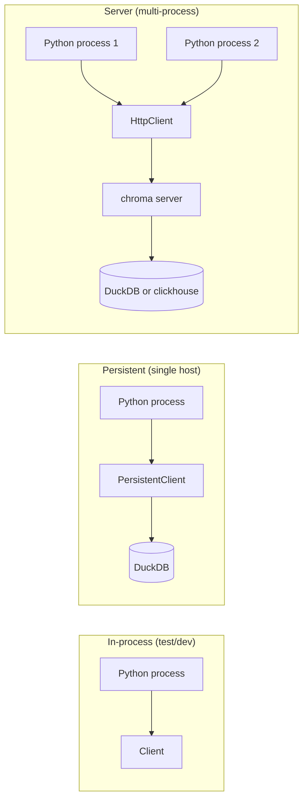

# 🧱 Chroma Fundamentals — Collections, Embeddings and Query

Chroma's API is small: one client class, one collection class, four primary operations (`add`, `query`, `get`, `delete`). The complexity lives in the choices: which client mode (in-memory vs persistent vs server), which embedding function (default vs custom), which distance metric (cosine vs L2 vs ip), and which filtering depth (no filter vs metadata filter vs document filter). This note covers all of them through working code.

By the end you will have used Chroma for the three patterns every AI engineer needs: ingest documents into a collection, query by semantic similarity with metadata filters, and manage collections programmatically (create, list, delete, get/set metadata). These are the building blocks for the rest of the course.

## 🎯 Learning Objectives

- Pick the right client mode for your deployment (in-memory vs `PersistentClient` vs `HttpClient`).
- Create collections with custom embedding functions and distance metrics.
- Add, query, get, and delete documents with metadata.
- Use `peek()` and `count()` for collection introspection.
- Understand the upsert and `update()` patterns for incremental ingest.
- Pick the right `where` filter shape for common RAG scenarios.

## 1. The Client Hierarchy

```python
import chromadb
from chromadb.config import Settings

# Three client modes, same API:
client_inmem = chromadb.Client()                                  # in-process, no persistence
client_persist = chromadb.PersistentClient(path="./chroma_db")   # DuckDB-backed, survives restart
client_http = chromadb.HttpClient(host="localhost", port=8000)   # connects to a Chroma server
client_cloud = chromadb.CloudClient(api_key=..., tenant=..., database=...)  # Chroma Cloud
```

| Client | Storage | Multi-process | Survives restart |
|--------|---------|---------------|------------------|
| `Client()` | In-memory | ❌ | ❌ |
| `PersistentClient(path=...)` | DuckDB at `path` | ❌ | ✅ |
| `HttpClient(host=...)` | Server-side (DuckDB or clickhouse) | ✅ | ✅ |
| `CloudClient(...)` | Chroma Cloud | ✅ | ✅ |

> ⚠️ **Advertencia:** `PersistentClient` is **single-process**. Opening two `PersistentClient(path="./db")` instances from different processes causes file-lock errors and silent corruption. For multi-process access, use `HttpClient` or `CloudClient`.

### Why Three Modes

The same API runs in three deployment shapes:



You can start with `Client()`, move to `PersistentClient()` for local persistence, and graduate to `HttpClient()` when you deploy — without changing your application code.

## 2. Collections — The "Table" of Chroma

A collection is a vector-indexed container for documents.

```python
collection = client.get_or_create_collection(
    name="research_docs",
    metadata={"hnsw:space": "cosine"},  # distance metric: cosine | l2 | ip
    embedding_function=None,            # use default (all-MiniLM-L6-v2)
)
```

### Distance Metric Choice

| Metric | Formula | Best for |
|--------|---------|----------|
| `cosine` | $\frac{a \cdot b}{\|a\| \|b\|}$ | Most text embeddings (default) |
| `l2` | $\sqrt{\sum (a_i - b_i)^2}$ | Image embeddings, fixed-length vectors |
| `ip` (inner product) | $a \cdot b$ | Non-normalized embeddings |

The default `cosine` works for OpenAI, HuggingFace, Cohere embeddings (most text models). Use `l2` for CLIP-style image embeddings, `ip` if your model output is not normalized.

### Collection-Level Metadata

```python
collection.modify(
    metadata={"hnsw:space": "cosine", "version": "1.0"}
)

# Read metadata
print(collection.metadata)  # {'hnsw:space': 'cosine', 'version': '1.0'}
```

`hnsw:space` is **read-only after creation** — you must `delete_collection` and re-create to change distance metrics.

## 3. Adding Documents

```python
collection.add(
    documents=["LangGraph is a stateful agent framework",
               "ChromaDB is a vector database"],
    ids=["doc-1", "doc-2"],
    metadatas=[
        {"source": "langgraph", "year": 2024},
        {"source": "chroma", "year": 2023},
    ],
    embeddings=None,  # None = use the collection's embedding function
)
```

**Required:** at least one of `documents` or `embeddings` (otherwise there's nothing to index). **Optional:** `metadatas` and `ids` (auto-generated if omitted — strongly discouraged).

### `upsert` (Update or Insert)

```python
collection.upsert(
    documents=["Updated LangGraph description", "ChromaDB doc"],
    ids=["doc-1", "doc-3"],
    metadatas=[{"source": "langgraph", "updated": True}, {"source": "chroma"}],
)
# doc-1 is updated; doc-3 is new; doc-2 untouched
```

> 💡 **Tip:** `upsert` is the right tool for incremental ingest. It avoids the "add or update?" decision logic and is idempotent.

### Batch Add with Progress

```python
texts = [f"Document {i}" for i in range(10_000)]

# Chunk to avoid memory spikes
batch_size = 100
for i in range(0, len(texts), batch_size):
    batch_ids = [f"doc-{j}" for j in range(i, i + batch_size)]
    batch_docs = texts[i:i + batch_size]
    collection.add(documents=batch_docs, ids=batch_ids)
    if (i // batch_size) % 10 == 0:
        print(f"  {i + batch_size}/{len(texts)} added")
```

## 4. Querying

### Semantic Query

```python
results = collection.query(
    query_texts=["stateful agents"],
    n_results=3,
    include=["documents", "metadatas", "distances"],
)
print(results)
# {
#   'ids': [['doc-1', 'doc-3', ...]],
#   'documents': [['LangGraph is ...', ...]],
#   'metadatas': [[{'source': 'langgraph', ...}, ...]],
#   'distances': [[0.12, 0.34, ...]]
# }
```

The result is a dict-of-lists: top-level keys are fields, sub-lists align with the top-k for each query.

### Multi-Query

```python
results = collection.query(
    query_texts=["stateful agents", "vector databases"],
    n_results=2,
)
# results['documents'] is now [[top2 for query1], [top2 for query2]]
```

### Filter by Metadata (`where`)

```python
results = collection.query(
    query_texts=["stateful agents"],
    n_results=5,
    where={"source": "langgraph"},       # equality shortcut
    # or:
    where={"year": {"$gte": 2023}},     # operator form
)
```

> See [[04 - Metadata Filtering - Where Clauses and Operators|note 04]] for the full operator reference (`$eq`, `$ne`, `$gt`, `$gte`, `$lt`, `$lte`, `$in`, `$nin`, `$and`, `$or`).

### Filter by Document Content (`where_document`)

```python
results = collection.query(
    query_texts=["x"],
    n_results=10,
    where_document={"$contains": "framework"},   # full-text search within filtered docs
)
```

### Combine Filters

```python
results = collection.query(
    query_texts=["x"],
    n_results=10,
    where={"source": "langgraph", "year": {"$gte": 2024}},
    where_document={"$contains": "stateful"},
)
```

## 5. `get()` and Introspection

```python
# Get by IDs
result = collection.get(ids=["doc-1", "doc-2"], include=["documents", "metadatas"])

# Get all (paginated)
all_docs = collection.get(limit=100, offset=0, include=["documents"])

# Peek (first 10 items)
first_10 = collection.peek()

# Count
print(collection.count())  # 10000
```

`get()` is the SQL `SELECT * WHERE id IN (...)` equivalent. Use it for admin tasks (audit, delete by criteria).

## 6. Delete

```python
# Delete by IDs
collection.delete(ids=["doc-1", "doc-2"])

# Delete by filter
collection.delete(where={"source": "langgraph"})

# Delete the whole collection (the only way to change `hnsw:space`)
client.delete_collection(name="research_docs")
```

> ⚠️ **Advertencia:** `collection.delete()` with a `where` filter without `ids` deletes **all** matching documents. Always test the filter first with `collection.get(where=...)`.

## 7. Custom Embedding Functions (Preview)

```python
from chromadb.utils import embedding_functions

# OpenAI
ef_openai = embedding_functions.OpenAIEmbeddingFunction(
    api_key="sk-...",
    model_name="text-embedding-3-small",
)

# HuggingFace (sentence-transformers)
ef_hf = embedding_functions.HuggingFaceEmbeddingFunction(
    api_key=None,  # public models need no key
    model_name="sentence-transformers/all-mpnet-base-v2",
)

collection = client.get_or_create_collection(
    name="docs",
    embedding_function=ef_openai,
)
```

The full coverage lives in [[03 - Custom Embedding Functions - HuggingFace OpenAI Cohere Multimodal|note 03]] — including multi-modal CLIP embeddings for image-augmented RAG.

## 8. ❌/✅ Antipatterns

### ❌ Auto-generated IDs

```python
# ❌ Auto-IDs change every run → duplicates, queries miss
collection.add(documents=["hello"])  # id like "long-uuid-string" auto-generated
```

### ✅ Deterministic IDs

```python
# ✅ Idempotent ingest
collection.add(documents=["hello"], ids=["greeting-1"])
```

### ❌ Treating `PersistentClient` as multi-process

```python
# ❌ Two workers, same file path → corruption
worker1 = chromadb.PersistentClient(path="./db")
worker2 = chromadb.PersistentClient(path="./db")
```

### ✅ Use `HttpClient` (or Chroma Server) for multi-process

```python
worker1 = chromadb.HttpClient(host="chroma-server", port=8000)
worker2 = chromadb.HttpClient(host="chroma-server", port=8000)
```

### ❌ Reading `collection.modify()` to "update a document"

```python
# ❌ modify() updates collection metadata, not documents
collection.modify(metadata={"hnsw:space": "cosine"})  # doesn't update documents
```

### ✅ Use `upsert` to update a document

```python
collection.upsert(ids=["doc-1"], documents=["new content"], metadatas=[{"version": 2}])
```

### ❌ Re-embedding every call

```python
# ❌ Repeating the same query embedding is wasteful
for _ in range(10):
    collection.query(query_texts=["same query"])
```

### ✅ Cache embeddings via a wrapper

```python
# (See note 03 for the embedding cache pattern)
```

## 9. Production Reality

**Caso real — Production RAG Project (portfolio):** Started with `chromadb.Client()` in a Jupyter notebook. Moved to `PersistentClient("./data/chroma")` for local dev. Now uses `HttpClient(host="chroma", port=8000)` in Docker Compose with a separate `chroma` container. Zero application-code changes between migrations — same API surface.

**Caso real — StayBot agent:** The Airbnb property descriptions were initially indexed in Chroma (`all-MiniLM-L6-v2`). When the corpus hit 500K properties, query latency crossed 200ms — migrated to Qdrant for 10× speedup. The note 05 migration pattern was the playbook.

## 📦 Compression Code

```python
# 📦 Compression: Chroma fundamentals in 60 lines
# pip install chromadb

import chromadb

# 1. Client
client = chromadb.PersistentClient(path="./chroma_demo")

# 2. Collection
collection = client.get_or_create_collection(
    name="research",
    metadata={"hnsw:space": "cosine"},
)

# 3. Add
collection.upsert(
    documents=[
        "LangGraph is a stateful agent framework using state graphs",
        "ChromaDB is a Python-native vector database for prototypes",
        "Qdrant is a Rust-based vector search engine for production",
    ],
    ids=["doc-1", "doc-2", "doc-3"],
    metadatas=[
        {"source": "langgraph", "category": "agents"},
        {"source": "chroma", "category": "databases"},
        {"source": "qdrant", "category": "databases"},
    ],
)

# 4. Query with filter
results = collection.query(
    query_texts=["vector search"],
    n_results=3,
    where={"category": "databases"},
    include=["documents", "metadatas", "distances"],
)
print(results["documents"])
# [['ChromaDB is a Python-native vector database for prototypes',
#   'Qdrant is a Rust-based vector search engine for production']]

# 5. Get count + peek
print(f"Total: {collection.count()}")  # Total: 3
print(collection.peek()["documents"])  # First 10

# 6. Delete by filter
collection.delete(where={"source": "langgraph"})
```

## 🎯 Key Takeaways

1. **Three client modes** — `Client()`, `PersistentClient()`, `HttpClient()` — same API, different storage.
2. **`PersistentClient` is single-process.** For multi-process, use `HttpClient` or Chroma Cloud.
3. **Distance metric is fixed at collection creation** (`cosine`, `l2`, `ip`). To change, delete and re-create.
4. **`upsert` is the right tool for incremental ingest**; `delete` with `where` removes matching documents.
5. **`where` filters by metadata**, `where_document` filters by content. They compose.
6. **Auto-generated IDs are dangerous** — use deterministic IDs for idempotent ingest.
7. **The Chroma API is intentionally small** — `add`, `upsert`, `query`, `get`, `delete`, `peek`, `count`, `modify`. Most RAG code only uses 3-4 of these.

## References

- [[00 - Welcome to ChromaDB|Welcome]] — course map and philosophy.
- [[02 - Chroma Server Mode - Local and Docker Deployment|Server Mode]] — `HttpClient` setup.
- [[03 - Custom Embedding Functions - HuggingFace OpenAI Cohere Multimodal|Custom Embeddings]] — drop the default `all-MiniLM-L6-v2`.
- [[04 - Metadata Filtering - Where Clauses and Operators|Filtering]] — rich filter operators.
- Chroma API: https://docs.trychroma.com/api-guide