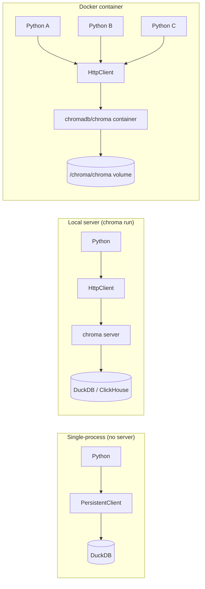
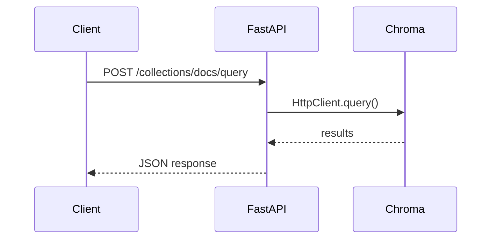

# 🖥️ Chroma Server Mode — Local and Docker Deployment

Once your Chroma project needs more than one Python process — a FastAPI backend, a worker that ingests new documents, an evaluation harness — you graduate from `PersistentClient` to `HttpClient` talking to a Chroma server. The server is a small FastAPI app that wraps the same persistent storage and exposes it over HTTP. It is the **production-light deployment** for Chroma: lower ops burden than Qdrant or Milvus, higher dev velocity than running your own FastAPI on top of `PersistentClient`, and the right shape for a single-region, <5M-vector RAG system.

This note covers three deployment shapes: a one-shot `chroma run` for local development, a Docker container for self-hosted production, and `CloudClient` for the managed option. We also walk through the FastAPI integration pattern and the observability hooks that make a Chroma server production-credible.

## 🎯 Learning Objectives

- Run a Chroma server locally with `chroma run`.
- Deploy Chroma as a Docker container with persistent storage.
- Connect to a remote server with `HttpClient`.
- Understand the server's storage backends (DuckDB vs ClickHouse).
- Build a FastAPI surface that delegates to Chroma.
- Apply multi-tenant patterns with server-mode and per-tenant databases.
- Plan observability and auth for a server-mode deployment.

## 1. The Three Server Modes



| Mode | Process count | Storage | Best for |
|------|---------------|---------|----------|
| `PersistentClient` | 1 | DuckDB at `path` | Local dev, single-process scripts |
| `chroma run` (local server) | N | DuckDB / ClickHouse | Single-host, multi-process |
| Docker container (chromadb/chroma) | N | Volume-mounted DuckDB / ClickHouse | Self-hosted production |
| Chroma Cloud | N | Managed (ClickHouse) | Zero-ops production |

The same Python code uses `HttpClient` to talk to all of them — only the host/port changes.

## 2. Local Server: `chroma run`

```bash
# Install with server support
pip install "chromadb[server]"

# Run the server (default: localhost:8000)
chroma run --path ./chroma_db --port 8000 --host 127.0.0.1
```

Server output:

```
chroma_server running on http://127.0.0.1:8000
storage: ./chroma_db
embedded
```

In Python:

```python
import chromadb

client = chromadb.HttpClient(host="127.0.0.1", port=8000)
print(client.heartbeat())  # nano-seconds since server start
print(client.list_collections())  # []
```

### Server Configuration

```bash
# Persistent mode with custom storage
chroma run --path /var/lib/chroma --port 8000 --host 0.0.0.0

# In-memory mode (dev)
chroma run --in-memory --port 8000

# With auth (Chroma 0.5+)
chroma run --path ./db --port 8000 --auth-provider chromadb.auth.basic_authn.BASIC
```

> ⚠️ **Advertencia:** Without `--auth-provider`, the server has **no authentication**. Anyone who can reach the port can read/write your collections. In production, always enable auth and put the server behind a reverse proxy.

## 3. Docker Deployment

```bash
docker run -d \
  --name chroma \
  -p 8000:8000 \
  -v chroma_data:/chroma/chroma \
  -e IS_PERSISTENT=TRUE \
  -e PERSIST_DIRECTORY=/chroma/chroma \
  -e ANONYMIZED_TELEMETRY=False \
  chromadb/chroma:latest
```

This is the production shape:

- `chromadb/chroma:latest` is the official image.
- The volume `chroma_data` survives container restarts.
- `ANONYMIZED_TELEMETRY=False` disables Chroma's anonymous usage tracking.
- Port `8000` is the FastAPI surface.

### Docker Compose

```yaml
# docker-compose.yml
services:
  chroma:
    image: chromadb/chroma:latest
    ports:
      - "8000:8000"
    volumes:
      - chroma_data:/chroma/chroma
    environment:
      - IS_PERSISTENT=TRUE
      - PERSIST_DIRECTORY=/chroma/chroma
      - ANONYMIZED_TELEMETRY=False
    healthcheck:
      test: ["CMD", "curl", "-f", "http://localhost:8000/api/v1/heartbeat"]
      interval: 10s
      timeout: 3s
      retries: 3

  api:
    build: ./api
    depends_on:
      chroma:
        condition: service_healthy
    environment:
      - CHROMA_HOST=chroma
      - CHROMA_PORT=8000

volumes:
  chroma_data:
```

The `api` service is your FastAPI app; it uses `chromadb.HttpClient(host="chroma", port=8000)`.

### Storage Backends

Chroma supports two persistent backends:

```bash
# DuckDB (default, single-node)
docker run chromadb/chroma:latest

# ClickHouse (distributed, high-volume)
docker run -e CHROMA_BACKEND=clickhouse \
           -e CLICKHOUSE_HOST=clickhouse \
           chromadb/chroma:latest
```

DuckDB is the right default for <10M vectors on a single host. ClickHouse wins for production scale; it requires a separate ClickHouse service.

## 4. The `HttpClient` API

```python
import chromadb

# Basic connection
client = chromadb.HttpClient(host="localhost", port=8000)

# With auth headers (Chroma 0.5+)
client = chromadb.HttpClient(
    host="chroma.internal",
    port=8000,
    headers={"Authorization": "Bearer ${CHROMA_TOKEN}"},
)

# SSL/TLS
client = chromadb.HttpClient(
    host="chroma.internal",
    port=443,
    ssl=True,
)

# Timeouts (default: None = wait forever)
client = chromadb.HttpClient(
    host="chroma.internal",
    port=8000,
    settings=chromadb.Settings(
        chroma_server_http_timeout_ms=5000,
    ),
)
```

`HttpClient` mirrors `PersistentClient` exactly — same `get_or_create_collection`, same `add/query/get/delete`. The only difference is the underlying transport.

## 5. FastAPI + Chroma Server

```python
# api/main.py
import os
import chromadb
from fastapi import FastAPI, HTTPException
from pydantic import BaseModel, Field
from typing import Annotated
from fastapi import Depends

app = FastAPI(title="RAG Backend")

# Module-level client (reused across requests)
_client = None

def get_chroma() -> chromadb.HttpClient:
    global _client
    if _client is None:
        _client = chromadb.HttpClient(
            host=os.environ["CHROMA_HOST"],
            port=int(os.environ.get("CHROMA_PORT", 8000)),
            settings=chromadb.Settings(chroma_server_http_timeout_ms=10_000),
        )
    return _client

class AddRequest(BaseModel):
    documents: list[str] = Field(min_length=1)
    metadatas: list[dict] | None = None
    ids: list[str] | None = None

class QueryRequest(BaseModel):
    query_text: str
    n_results: int = Field(default=5, ge=1, le=100)
    where: dict | None = None

@app.post("/collections/{name}/add")
async def add(name: str, req: AddRequest, ch=Depends(get_chroma)):
    coll = ch.get_or_create_collection(name=name)
    ids = req.ids or [f"doc-{i}" for i in range(len(req.documents))]
    coll.add(
        documents=req.documents,
        metadatas=req.metadatas,
        ids=ids,
    )
    return {"added": len(req.documents)}

@app.post("/collections/{name}/query")
async def query(name: str, req: QueryRequest, ch=Depends(get_chroma)):
    coll = ch.get_or_create_collection(name=name)
    results = coll.query(
        query_texts=[req.query_text],
        n_results=req.n_results,
        where=req.where,
    )
    return results
```



The module-level `_client` is a singleton — recreate only on startup error. `HttpClient` is thread-safe and supports concurrent requests.

## 6. Multi-Tenant Patterns

There are two multi-tenancy patterns:

### Database-Per-Tenant

```python
# Tenant-specific client
def get_chroma_for_tenant(tenant_id: str) -> chromadb.HttpClient:
    return chromadb.HttpClient(
        host="chroma.internal",
        port=8000,
        database=f"tenant-{tenant_id}",  # tenant-scoped database
        headers={"Authorization": f"Bearer {tenant_token}"},
    )

client_a = get_chroma_for_tenant("acme")
coll_a = client_a.get_or_create_collection(name="docs")
```

Each tenant has its own database (Chroma 0.5+ feature). Cleaner isolation; higher overhead per tenant.

### Filter-Per-Tenant (Recommended for Many Tenants)

```python
# Single shared client, tenant_id as metadata filter
client = chromadb.HttpClient(host="chroma.internal", port=8000)
coll = client.get_or_create_collection(name="all_docs")

# On add: tag with tenant_id
coll.add(documents=..., metadatas=[{"tenant_id": "acme", "user_id": "u-42"}])

# On query: filter by tenant_id (REQUIRED — never skip)
results = coll.query(
    query_texts=[user_query],
    n_results=5,
    where={"tenant_id": "acme"},   # mandatory filter
)
```

The "filter per tenant" pattern is the production standard: one collection, one index, hundreds of tenants, with hard isolation enforced at query time. The risk: a **forgotten filter** leaks data. Mitigate with a wrapper:

```python
class TenantScopedCollection:
    def __init__(self, coll, tenant_id: str):
        self._coll = coll
        self._tenant = tenant_id

    def query(self, **kwargs) -> dict:
        # Inject tenant filter — never miss
        existing = kwargs.get("where", {})
        merged = {**existing, "tenant_id": self._tenant}
        return self._coll.query(where=merged, **kwargs)
```

## 7. Observability

The Chroma server exposes Prometheus metrics on `/metrics`:

```bash
curl http://localhost:8000/metrics
# chromadb_query_total{...} 1234
# chromadb_add_total{...} 567
# ...
```

In your platform:

```python
# Add OTel tracing to Chroma client
from opentelemetry.instrumentation.chromadb import ChromaDBInstrumentor
ChromaDBInstrumentor().instrument()

# Or use Phoenix / Langfuse for RAG-specific tracing (note 04 of Phoenix)
from phoenix.otel import register
tracer_provider = register()
```

## 8. Auth and Security

```bash
# Generate credentials
export CHROMA_AUTH_CREDENTIALS_FILE=./chroma-credentials.json
cat > chroma-credentials.json <<EOF
{
  "admin": "admin-secret-password",
  "user-1": "user-1-password"
}
EOF

# Run server with auth
chroma run --path ./db --port 8000 \
  --auth-provider chromadb.auth.basic_authn.BASIC \
  --auth-credentials-file ./chroma-credentials.json
```

In Python:

```python
client = chromadb.HttpClient(
    host="chroma.internal",
    port=8000,
    headers={"Authorization": "Basic <base64(user:pass)>"},
)
```

> ⚠️ **Advertencia:** Behind a reverse proxy (nginx, ALB), enforce TLS termination at the proxy. Never expose the Chroma port directly on the public internet.

## 9. ❌/✅ Antipatterns

### ❌ `chroma run --in-memory` in production

```bash
# ❌ Lost on restart
chroma run --in-memory --port 8000
```

### ✅ Always use persistent mode

```bash
chroma run --path /var/lib/chroma --port 8000
```

### ❌ Exposing Chroma without auth on a public port

```bash
# ❌ Anyone can read your vectors
docker run -p 8000:8000 chromadb/chroma
```

### ✅ Auth + reverse proxy

```bash
# ✅ nginx → chroma (auth) → chroma server
docker run --network private -e CHROMA_AUTH=... chromadb/chroma
```

### ❌ PersistentClient across multiple workers

```python
# ❌ File-lock corruption
worker1 = chromadb.PersistentClient(path="/data/chroma")
worker2 = chromadb.PersistentClient(path="/data/chroma")
```

### ✅ HttpClient against a single-server deployment

```python
worker1 = chromadb.HttpClient(host="chroma.internal", port=8000)
worker2 = chromadb.HttpClient(host="chroma.internal", port=8000)
```

### ❌ Skipping the tenant filter "just this once"

```python
# ❌ Cross-tenant data leak
results = coll.query(query_texts=[q])  # forgot where={"tenant_id": ...}
```

### ✅ `TenantScopedCollection` wrapper

```python
# ✅ Impossible to forget
coll = TenantScopedCollection(shared_coll, tenant_id="acme")
coll.query(query_texts=[q])
```

## 10. Production Reality

**Caso real — Production RAG Project (portfolio):** The agent's RAG endpoint runs FastAPI in 4 Gunicorn workers, all sharing a single Chroma server (`chromadb/chroma:latest` in Docker Compose). Persistent storage is a Docker volume; backup is `tar czf chroma-backup-$(date).tgz /var/lib/chroma`. Latency: 30-50ms p95 for collection-with-100K-vectors query. This worked until the corpus crossed 1M vectors — at that point the migration playbook in [[05 - Migration Path - Chroma to Qdrant and pgvector|note 05]] kicked in.

## 📦 Compression Code

```python
# 📦 Compression: server-mode setup in 50 lines

# === Server side ===
# docker-compose.yml (above)

# === Client side ===
import chromadb
from chromadb.config import Settings
import os

# Module-level singleton
_client = None

def get_client() -> chromadb.HttpClient:
    global _client
    if _client is None:
        _client = chromadb.HttpClient(
            host=os.environ.get("CHROMA_HOST", "localhost"),
            port=int(os.environ.get("CHROMA_PORT", 8000)),
            settings=Settings(chroma_server_http_timeout_ms=10_000),
        )
    return _client

# === Use ===
client = get_client()
print(f"Heartbeat: {client.heartbeat()}")

# Multi-tenant with mandatory filter
class TenantClient:
    def __init__(self, client: chromadb.HttpClient, tenant_id: str):
        self._client = client
        self._tenant = tenant_id

    def collection(self, name: str):
        coll = self._client.get_or_create_collection(name=name)
        return TenantCollection(coll, self._tenant)

class TenantCollection:
    def __init__(self, coll, tenant_id: str):
        self._coll = coll
        self._tenant = tenant_id

    def query(self, query_texts: list[str], **kwargs) -> dict:
        # Inject tenant filter always
        where = kwargs.pop("where", {})
        merged = {**where, "tenant_id": self._tenant}
        return self._coll.query(
            query_texts=query_texts,
            where=merged,
            **kwargs,
        )

# Run
client = get_client()
tenant = TenantClient(client, "acme")
coll = tenant.collection("docs")
results = coll.query(query_texts=["hello"])
print(results["documents"][0][:1])
```

## 🎯 Key Takeaways

1. **`chroma run` is the local server**, `chromadb/chroma:latest` is the Docker image. Both expose the same HTTP API.
2. **`HttpClient`** is the multi-process-safe alternative to `PersistentClient`. Same Python API.
3. **DuckDB is the default storage**; ClickHouse is the high-volume alternative for production scale.
4. **Database-per-tenant** is clean isolation; **filter-per-tenant** is the production pattern. Wrap the latter with a `TenantCollection` to enforce the filter.
5. **Auth and TLS are mandatory in production.** The server defaults to no auth — enable `--auth-provider` before exposing the port.
6. **Prometheus metrics** at `/metrics`; OTel instrumentation via `opentelemetry-instrumentation-chromadb`.
7. **The migration trigger is concrete**: <10M vectors, single region, sub-100 QPS = Chroma works; beyond that, move to Qdrant per [[05 - Migration Path - Chroma to Qdrant and pgvector|note 05]].

## References

- [[00 - Welcome to ChromaDB|Welcome]] — course map.
- [[01 - Chroma Fundamentals - Collections, Embeddings and Query|Fundamentals]] — the same API works on the server.
- [[05 - Migration Path - Chroma to Qdrant and pgvector|Migration]] — when to move beyond Chroma.
- Chroma server docs: https://docs.trychroma.com/deployment
- Chroma Docker: https://hub.docker.com/r/chromadb/chroma