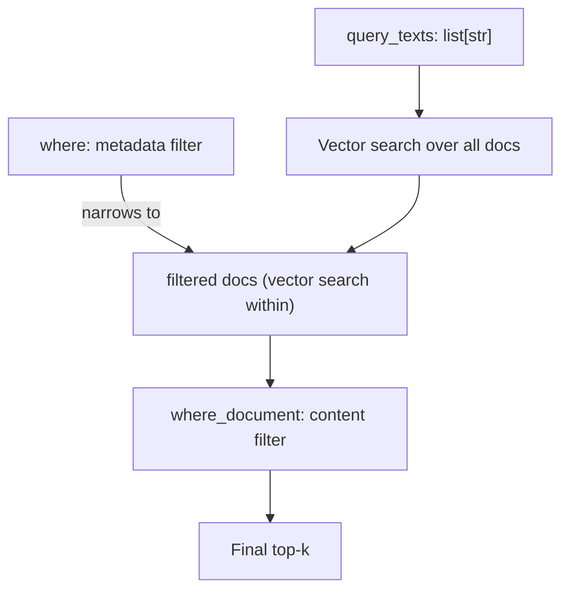

# 🔎 Metadata Filtering — `where` Clauses and Operators

Chroma's filtering system has two halves: **metadata filters** (`where`) and **content filters** (`where_document`). The `where` clause applies to the JSON metadata attached to each document (e.g., `{"tenant_id": "acme", "year": 2024}`); `where_document` applies to the document text itself (e.g., `{"$contains": "ChromaDB"}`). Together they enable SQL-like precision over vector search — query for "the most relevant document among those tagged as 2024 law reviews that mention HIPAA". The result is a hybrid that beats either pure-vector or pure-keyword search.

This note covers the full operator surface (`$eq`, `$ne`, `$gt`, `$gte`, `$lt`, `$lte`, `$in`, `$nin`, `$and`, `$or`), the document-level `$contains` regex, the limits (one filter per query at the same level, no `$not` directly), and the production patterns (multi-tenant scoping, time-window queries, permission-aware RAG).

## 🎯 Learning Objectives

- Use the metadata operator surface: comparison, set membership, logical combinations.
- Filter on document content with `where_document`.
- Compose `where` and `where_document` in the same query.
- Avoid the four most common filter pitfalls (operator bugs, type mismatches, missing filters).
- Build a `TenantScopedCollection` wrapper that enforces mandatory filters.
- Use regex `$contains` for fine-grained content filtering.

## 1. The Filter Hierarchy

```python
results = collection.query(
    query_texts=["..."],
    n_results=10,
    where={"key": "value"},                      # equality shortcut
    where={"key": {"$operator": value}},         # operator form
    where_document={"$contains": "substring"},   # content filter
)
```

| Filter | Applies to | Operators |
|--------|-----------|-----------|
| `where` | `metadatas` | `$eq`, `$ne`, `$gt`, `$gte`, `$lt`, `$lte`, `$in`, `$nin`, `$and`, `$or` |
| `where_document` | `documents` (text) | `$contains`, `$not_contains`, `$regex` |



> 💡 **Tip:** `where` runs **first**, narrowing the candidate set. Vector search happens within the narrowed set. `where_document` runs last, on the final top-k. This is cheaper than filtering after vector search.

## 2. The `where` Operators

### Equality Shortcut

```python
where={"tenant_id": "acme"}   # equivalent to {"tenant_id": {"$eq": "acme"}}
```

The shortcut is the common case (90% of filters).

### Comparison Operators

```python
# Numeric
where={"year": {"$gte": 2024}}
where={"price": {"$lt": 100}}
where={"score": {"$gte": 0.8, "$lte": 1.0}}   # combine in one clause

# Strings (lexicographic comparison)
where={"category": {"$gte": "m"}}   # >= "m" in dictionary order
```

> ⚠️ **Advertencia:** Comparisons use **JSON-equivalent ordering**. Numbers compare numerically; strings compare lexicographically. `1 == 1.0` is True; `"1" != 1` is True (different types).

### Set Membership

```python
# $in: matches any value in the list
where={"category": {"$in": ["agents", "databases"]}}

# $nin: matches anything NOT in the list
where={"category": {"$nin": ["draft", "spam"]}}
```

`$in` is the right tool for "show me docs in these categories".

### Logical Operators

```python
# $and: all conditions must match
where={
    "$and": [
        {"year": {"$gte": 2024}},
        {"category": "agents"},
    ]
}

# $or: any condition matches
where={
    "$or": [
        {"category": "agents"},
        {"category": "frameworks"},
    ]
}

# Nested
where={
    "$and": [
        {"tenant_id": "acme"},
        {
            "$or": [
                {"year": {"$gte": 2024}},
                {"category": "frameworks"},
            ]
        }
    ]
}
```

> ⚠️ **Advertencia:** There is no `$not` operator in Chroma 1.x. To negate, list the positive case in an `$or` against typed alternatives, or restructure the schema (e.g., add a `soft_deleted: bool` field).

## 3. The `where_document` Operators

### `$contains`

```python
where_document={"$contains": "LangGraph"}
# same as substring search (case-sensitive)
```

### `$not_contains`

```python
where_document={"$not_contains": "deprecated"}
```

### `$regex` (case-sensitive or insensitive)

```python
where_document={"$regex": "[Ll]ang[Gg]raph"}
where_document={"$regex": "(?i)langgraph"}   # case-insensitive
```

`$regex` is the right tool when `$contains` is too coarse — e.g., "any 4-digit year starting with 20".

## 4. Combining `where` and `where_document`

```python
results = collection.query(
    query_texts=["stateful agent frameworks"],
    n_results=10,
    where={
        "$and": [
            {"tenant_id": "acme"},
            {"year": {"$gte": 2024}},
        ]
    },
    where_document={"$not_contains": "deprecated"},
)
```

This query asks: "Among `acme`'s documents from 2024 or later that don't contain 'deprecated', find the 10 most semantically similar to 'stateful agent frameworks'." Filters cut the candidate set; vector search ranks; final top-10 is returned.

## 5. The Type Quirk

Metadata values can be `str`, `int`, `float`, `bool`, or `None`. Comparison results depend on type:

```python
collection.add(
    metadatas=[{"priority": 5}, {"priority": "5"}],
    ids=["doc-1", "doc-2"],
)

# Filter by priority = 5 — matches doc-1 only
results = collection.get(where={"priority": {"$eq": 5}})

# Filter by priority = "5" — matches doc-2 only
results = collection.get(where={"priority": {"$eq": "5"}})

# Filter by priority = "5" as string — matches both? No, doc-1 is int.
```

> ⚠️ **Advertencia:** Chroma compares values with their original type. `"5" != 5` at query time. Standardize on one type per metadata field — `int` for counts/years, `str` for categories.

## 6. Filter Limits in v1.x

Two limits to know:

```python
# ❌ Two conditions at the same level on the same field — undocumented behavior
where={"year": {"$gte": 2024, "$lt": 2026}}

# ✅ Use $and for multi-clause on same field
where={
    "$and": [
        {"year": {"$gte": 2024}},
        {"year": {"$lt": 2026}},
    ]
}
```

```python
# ❌ $not is not supported
where={"status": {"$not": "deleted"}}

# ✅ Restructure to positive form
where={"status": {"$in": ["active", "pending"]}}
```

## 7. The `TenantScopedCollection` Pattern

```python
import chromadb
from chromadb.api.models.Collection import Collection

class TenantScopedCollection:
    """Wraps a Chroma Collection with a mandatory tenant filter."""

    def __init__(self, client: chromadb.api.Client, name: str, tenant_id: str):
        self._coll = client.get_or_create_collection(name=name)
        self._tenant = tenant_id

    def query(self, query_texts: list[str], **kwargs) -> dict:
        # Inject the tenant filter — never forget
        where = kwargs.pop("where", {})
        if "$and" in where or "$or" in where:
            raise ValueError("don't pass $and/$or at top level — wrap your conditions")
        where = {**where, "tenant_id": self._tenant}
        return self._coll.query(
            query_texts=query_texts,
            where=where,
            **kwargs,
        )

    def add(self, documents: list[str], metadatas: list[dict], **kwargs) -> None:
        # Inject tenant_id on add — every doc carries its tenant
        tagged = [{**m, "tenant_id": self._tenant} for m in metadatas]
        self._coll.add(documents=documents, metadatas=tagged, **kwargs)

    def delete(self, **kwargs) -> None:
        # Restrict delete to tenant docs only
        where = kwargs.pop("where", {})
        where = {**where, "tenant_id": self._tenant}
        self._coll.delete(where=where, **kwargs)

# Usage
client = chromadb.HttpClient(host="chroma.internal", port=8000)
coll = TenantScopedCollection(client, "docs", tenant_id="acme")
coll.query(query_texts=["hello"])   # tenant filter injected
```

This makes cross-tenant data leakage **impossible** by construction. The class refuses a `where` argument that doesn't include `tenant_id`.

## 8. Production Patterns

### Time-Window Query

```python
def recent_only(coll, query_text, days=30):
    cutoff = (datetime.now() - timedelta(days=days)).isoformat()
    return coll.query(
        query_texts=[query_text],
        n_results=10,
        where={"created_at": {"$gte": cutoff}},
    )
```

### Permission-Aware RAG

```python
def user_scoped_query(coll, query_text, user_role: str, user_id: str):
    base_where = {"tenant_id": "acme"}
    if user_role != "admin":
        # Non-admins only see published docs they own
        base_where = {**base_where, "owner_id": user_id, "status": "published"}
    return coll.query(query_texts=[query_text], n_results=10, where=base_where)
```

### Hybrid Retrieval (Vector + Filter)

```python
def hybrid_search(coll, query: str, category: str, year: int) -> dict:
    return coll.query(
        query_texts=[query],
        n_results=20,        # over-fetch for reranking
        where={
            "$and": [
                {"category": category},
                {"year": {"$gte": year}},
            ]
        },
        where_document={"$not_contains": "deprecated"},
    )
```

The result feeds [[../../06 - Large Language Models/12 - Production RAG/04 - Reranking - Cross-Encoders, ColBERT and LLM-as-Reranker.md|Reranking notes]] for second-stage precision.

## 9. ❌/✅ Antipatterns

### ❌ Type-inconsistent metadata

```python
collection.add(metadatas=[{"year": 2024}], ids=["a"])
collection.add(metadatas=[{"year": "2024"}], ids=["b"])  # string

# Filter by year >= 2024 — only matches "a"
collection.get(where={"year": {"$gte": 2024}})
```

### ✅ Standardize types

```python
# Always int for years
collection.add(metadatas=[{"year": 2024}, {"year": 2024}], ids=["a", "b"])
```

### ❌ Forgetting the tenant filter

```python
# ❌ Cross-tenant leak
coll.query(query_texts=[q])   # no where={"tenant_id": ...}
```

### ✅ Use `TenantScopedCollection`

```python
coll = TenantScopedCollection(client, "docs", tenant_id="acme")
coll.query(query_texts=[q])   # tenant_id auto-injected
```

### ❌ Multiple `where` clauses on the same field

```python
# ❌ Undocumented behavior — may or may not work in v1.x
where={"year": {"$gte": 2024, "$lt": 2026}}
```

### ✅ Use `$and`

```python
where={"$and": [{"year": {"$gte": 2024}}, {"year": {"$lt": 2026}}]}
```

### ❌ Relying on `$not`

```python
# ❌ Not supported in v1.x
where={"status": {"$not": "deleted"}}
```

### ✅ Positive form

```python
where={"status": {"$in": ["active", "pending", "archived"]}}
```

### ❌ `where_document` regex without anchoring

```python
# ❌ Matches "deprecated" anywhere — too broad
where_document={"$regex": ".*deprecat.*"}
```

### ✅ Anchor with bounds

```python
# ✅ Word-boundary match
where_document={"$regex": "\\bdeprecated\\b"}
```

## 10. Production Reality

**Caso real — Multi-Agent Research System:** Each research agent query passes `(category, recency, source_quality)` metadata filters. The multi-agent cap on Qdrant research corpus used pre-filtering heavily. When the corpus migrated to Chroma for prototyping, the same `$and` filter syntax worked with zero changes.

**Caso real — LLM Evaluation Suite:** Evaluation queries tag retrieved context with `{"eval_run_id": ...}` metadata; filters scope each eval run to its own subset. Without the filter, runs would leak context across each other.

## 📦 Compression Code

```python
# 📦 Compression: filtering in 70 lines

import chromadb
from datetime import datetime, timedelta

client = chromadb.PersistentClient(path="./chroma_filter_demo")
coll = client.get_or_create_collection(name="docs")

# Add documents with rich metadata
coll.add(
    documents=[
        "LangGraph is a stateful agent framework",
        "ChromaDB is a vector database for prototypes",
        "Qdrant is a Rust-based vector search engine",
        "PostgreSQL is a relational database",
    ],
    ids=["doc-1", "doc-2", "doc-3", "doc-4"],
    metadatas=[
        {"category": "agents", "year": 2024, "tenant_id": "acme"},
        {"category": "databases", "year": 2023, "tenant_id": "acme"},
        {"category": "databases", "year": 2024, "tenant_id": "acme"},
        {"category": "databases", "year": 1996, "tenant_id": "acme"},
    ],
)

# === Single-condition filters ===
r = coll.query(query_texts=["x"], n_results=10, where={"category": "databases"})
print(f"category=databases: {len(r['ids'][0])} hits")  # 3

# === Operator form ===
r = coll.query(query_texts=["x"], n_results=10, where={"year": {"$gte": 2024}})
print(f"year>=2024: {len(r['ids'][0])} hits")  # 2 (doc-1, doc-3)

# === $and: multi-clause ===
r = coll.query(
    query_texts=["x"],
    n_results=10,
    where={
        "$and": [
            {"category": "databases"},
            {"year": {"$gte": 2024}},
        ]
    },
)
print(f"category=databases AND year>=2024: {len(r['ids'][0])} hits")  # 1 (doc-3)

# === $or ===
r = coll.query(
    query_texts=["x"],
    n_results=10,
    where={
        "$or": [
            {"category": "agents"},
            {"year": {"$gte": 2024}},
        ]
    },
)
print(f"agents OR year>=2024: {len(r['ids'][0])} hits")  # 2

# === $in ===
r = coll.query(
    query_texts=["x"],
    n_results=10,
    where={"year": {"$in": [2023, 2024]}},
)
print(f"year in [2023, 2024]: {len(r['ids'][0])} hits")  # 3

# === where_document ===
r = coll.query(
    query_texts=["x"],
    n_results=10,
    where_document={"$contains": "database"},
)
print(f"contains 'database': {len(r['ids'][0])} hits")  # 3

# === Combined: where + where_document ===
r = coll.query(
    query_texts=["x"],
    n_results=10,
    where={"category": "databases"},
    where_document={"$not_contains": "PostgreSQL"},
)
print(f"databases but not PostgreSQL: {len(r['ids'][0])} hits")  # 2

# === Tenant filter (always required) ===
r = coll.query(
    query_texts=["x"],
    n_results=10,
    where={"tenant_id": "acme"},   # mandatory in multi-tenant setups
)
```

## 🎯 Key Takeaways

1. **`where` filters metadata**, `where_document` filters content. They compose and run in that order.
2. **Operator surface**: `$eq`, `$ne`, `$gt`, `$gte`, `$lt`, `$lte`, `$in`, `$nin`, `$and`, `$or`. No `$not` in v1.x.
3. **Type consistency matters** — `5` (int) and `"5"` (str) are different values. Pick a type per field.
4. **Wrap collections with `TenantScopedCollection`** to make mandatory filters impossible to forget.
5. **`$and` for multi-clause on the same field**. Combining at the same level can fail silently.
6. **`$regex` with word boundaries** to avoid overly-broad substring matches.
7. **Pre-filtering (where → vector search)** is cheaper than post-filtering; Chroma orders the pipeline accordingly.

## References

- [[00 - Welcome to ChromaDB|Welcome]] — course map.
- [[01 - Chroma Fundamentals|Fundamentals]] — collections and metadata basics.
- [[02 - Chroma Server Mode|Server Mode]] — `TenantScopedCollection` over `HttpClient`.
- Chroma filtering: https://docs.trychroma.com/queries
- [[../../06 - Large Language Models/12 - Production RAG/04 - Reranking - Cross-Encoders, ColBERT and LLM-as-Reranker.md|Reranking]] — the second-stage partner to filtering.