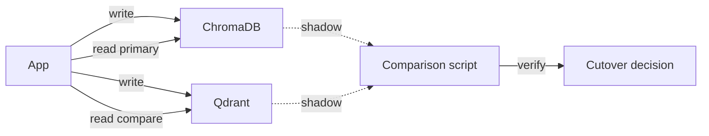

# 🚚 Migration Path — Chroma to Qdrant and pgvector

Every Chroma deployment eventually hits a wall. For some teams it's 1M vectors; for others, 100 QPS; for others, the realization that ClickHouse on a single host is not a long-term data tier. The migration playbook is the same regardless of the trigger: **(1) export everything** (documents, embeddings, metadata), **(2) re-embed if needed**, **(3) re-import to the new database**, **(4) swap the client**, **(5) verify with RAGAS**. The hard part is keeping the application code unchanged across the swap — which is doable because both Chroma and Qdrant expose `add/query/get/delete` APIs that look similar.

This note is the migration playbook for two destinations: **Qdrant** (Rust-native, fast, production-grade HNSW + quantization) and **pgvector** (Postgres extension, integrates with relational data). We walk through the export → re-import dance for each, the client's surface-level compatibility, and the production patterns for zero-downtime cutover.

## 🎯 Learning Objectives

- Export documents, embeddings, and metadata from Chroma in a portable format.
- Re-import into Qdrant and pgvector without changing application code.
- Pick between Qdrant and pgvector based on scale and existing infrastructure.
- Implement zero-downtime migration: dual-write, dual-read, cutover.
- Verify the migration with RAGAS or a custom evaluation suite.
- Avoid the five most common migration pitfalls.

## 1. When to Migrate

| Trigger | Recommended target |
|---------|-------------------|
| >10M vectors with sub-50ms p99 latency | Qdrant |
| Need Postgres-ecosystem features (transactions, joins, CDC) | pgvector |
| Heavy filtering (10+ filter conditions) | Qdrant (RocksDB-backed payload indexes) |
| Self-hosting simplicity (no separate DB) | pgvector |
| Already running Postgres for OLTP | pgvector |
| Multi-region replication | Qdrant (built-in) or Pinecone |
| Cost-sensitive at scale | pgvector (single Postgres cluster) |
| Built-in hybrid search (BM25 + dense) | Qdrant |
| Need serverless / zero-ops | Pinecone or Vertex AI Vector Search |

The "keep Chroma" ceiling depends on vector size and hardware. As of v0.5, Chroma on a single 16-core/64GB host handles:

- ~10M vectors at 1536-d, ~50ms p95 query latency.
- ~30M vectors at 384-d, similar latency.

Beyond that, HNSW graph traversal times out the single-process architecture. Move to Qdrant (distributed by design) or pgvector (Postgres-sharded).

## 2. The Universal Export Pattern

```python
# export.py — Run on the source (Chroma) before cutover

import json
import chromadb
from typing import Iterator

def export_collection(coll, page_size: int = 1000) -> Iterator[dict]:
    """Stream all records from a Chroma collection."""
    offset = 0
    while True:
        page = coll.get(
            limit=page_size,
            offset=offset,
            include=["documents", "metadatas", "embeddings"],
        )
        n = len(page["ids"])
        if n == 0:
            return
        for i in range(n):
            yield {
                "id": page["ids"][i],
                "document": page["documents"][i],
                "metadata": page["metadatas"][i],
                "embedding": page["embeddings"][i],
            }
        offset += n

# === Run ===
client = chromadb.PersistentClient(path="./chroma_db")  # or HttpClient
coll = client.get_collection("docs")

records = list(export_collection(coll))
with open("docs_export.jsonl", "w") as f:
    for r in records:
        f.write(json.dumps(r) + "\n")
print(f"Exported {len(records)} records")

# Optional: include the embedding function for re-use
ef_name = coll.metadata.get("embedding_function_name", "default")
print(f"Embedding function: {ef_name}")
```

The export produces a JSONL file with all documents, embeddings, and metadata. **Critical:** the embedding function must be preserved — the importer must use the **same encoder** (or recall will collapse).

## 3. Migration to Qdrant

```python
# migrate_to_qdrant.py — Run on the destination

import json
from qdrant_client import QdrantClient
from qdrant_client.models import Distance, VectorParams, PointStruct

def migrate_to_qdrant(export_path: str, collection_name: str, vector_dim: int):
    client = QdrantClient(host="qdrant.internal", port=6333)

    # 1. Create the collection
    client.create_collection(
        collection_name=collection_name,
        vectors_config=VectorParams(size=vector_dim, distance=Distance.COSINE),
    )

    # 2. Bulk import (Qdrant batches internally)
    points = []
    with open(export_path) as f:
        for line in f:
            r = json.loads(line)
            points.append(PointStruct(
                id=hash(r["id"]) & 0xFFFFFFFFFFFFFFFF,   # Qdrant wants int or UUID
                vector=r["embedding"],
                payload={
                    "document": r["document"],
                    "metadata": r["metadata"],
                    "chroma_id": r["id"],   # preserve original ID for audit
                },
            ))

    # 3. Upload in batches of 1000
    client.upload_points(
        collection_name=collection_name,
        points=points,
        batch_size=1000,
        parallel=4,
    )
    print(f"Imported {len(points)} points to {collection_name}")

migrate_to_qdrant("docs_export.jsonl", "docs", vector_dim=1536)
```

### Qdrant's Payload Indexes (Replacement for Chroma's `where`)

Chroma's `where` filters map to Qdrant's payload indexes:

```python
from qdrant_client.models import PayloadSchemaType

# Create an index on a metadata field for fast filtering
client.create_payload_index(
    collection_name="docs",
    field_name="metadata.tenant_id",     # nested field access
    field_schema=PayloadSchemaType.KEYWORD,
)
client.create_payload_index(
    collection_name="docs",
    field_name="metadata.year",
    field_schema=PayloadSchemaType.INTEGER,
)

# Filtered search now uses the index (sub-ms even on 10M points)
results = client.search(
    collection_name="docs",
    query_vector=query_embedding,
    query_filter={
        "must": [
            {"key": "metadata.tenant_id", "match": {"value": "acme"}},
            {"key": "metadata.year", "range": {"gte": 2024}},
        ]
    },
    limit=10,
)
```

> 💡 **Tip:** Mirror your Chroma metadata into Qdrant payload indexes **before** the cutover. Filtered queries on an unindexed field trigger full-scan and are 10-100× slower.

## 4. Migration to pgvector

```python
# migrate_to_pgvector.py

import json
import psycopg
from pgvector.psycopg import register_vector

def migrate_to_pgvector(export_path: str, table_name: str, vector_dim: int):
    with psycopg.connect("postgresql://user:pass@db:5432/vecdb") as conn:
        register_vector(conn)

        with conn.cursor() as cur:
            # 1. Create the table
            cur.execute(f"""
                CREATE TABLE IF NOT EXISTS {table_name} (
                    id BIGSERIAL PRIMARY KEY,
                    chroma_id TEXT,
                    document TEXT,
                    metadata JSONB,
                    embedding VECTOR({vector_dim})
                )
            """)

            # 2. Create HNSW index for cosine similarity
            cur.execute(f"""
                CREATE INDEX IF NOT EXISTS {table_name}_embedding_idx
                ON {table_name}
                USING hnsw (embedding vector_cosine_ops)
            """)

            # 3. Bulk copy
            with open(export_path) as f:
                with cur.copy(f"COPY {table_name} (chroma_id, document, metadata, embedding) FROM STDIN") as copy:
                    for line in f:
                        r = json.loads(line)
                        copy.write_row((
                            r["id"],
                            r["document"],
                            json.dumps(r["metadata"]),
                            r["embedding"],
                        ))

        conn.commit()
    print(f"Imported to {table_name}")

migrate_to_pgvector("docs_export.jsonl", "docs", vector_dim=1536)
```

### Query with pgvector

```python
with psycopg.connect("postgresql://user:pass@db:5432/vecdb") as conn:
    cur = conn.execute("""
        SELECT chroma_id, document, metadata,
               1 - (embedding <=> %s) AS similarity
        FROM docs
        WHERE metadata->>'tenant_id' = %s
          AND (metadata->>'year')::int >= %s
        ORDER BY embedding <=> %s
        LIMIT 10
    """, (query_emb, "acme", 2024, query_emb))
    results = cur.fetchall()
```

For deeper pgvector coverage see [[../36 - PostgreSQL for AI-ML Workloads/00 - Welcome to PostgreSQL for AI-ML Workloads.md|PostgreSQL for AI-ML Workloads]].

## 5. The Compatibility Wrapper

To avoid touching application code during the cutover, write a thin compatibility layer:

```python
# vector_db.py — abstracted over Chroma / Qdrant / pgvector

from typing import Protocol

class VectorDBClient(Protocol):
    def add(self, ids: list[str], documents: list[str], metadatas: list[dict], embeddings: list[list[float]] | None = None) -> None: ...
    def query(self, query_embedding: list[float] | None = None, query_text: str | None = None, where: dict | None = None, n_results: int = 5) -> dict: ...
    def delete(self, ids: list[str] | None = None, where: dict | None = None) -> None: ...

class ChromaBackend:
    def __init__(self, client: chromadb.Client, name: str):
        self._coll = client.get_or_create_collection(name)

    def add(self, ids, documents, metadatas, embeddings=None):
        self._coll.add(
            ids=ids,
            documents=documents,
            metadatas=metadatas,
            embeddings=embeddings,
        )

    def query(self, query_embedding=None, query_text=None, where=None, n_results=5):
        return self._coll.query(
            query_embeddings=[query_embedding] if query_embedding else None,
            query_texts=[query_text] if query_text else None,
            where=where,
            n_results=n_results,
        )

class QdrantBackend:
    def __init__(self, client: QdrantClient, name: str, vector_dim: int):
        self._client = client
        self._name = name
        self._dim = vector_dim

    def add(self, ids, documents, metadatas, embeddings=None):
        self._client.upsert(
            collection_name=self._name,
            points=[
                PointStruct(
                    id=hash(i) & 0xFFFFFFFFFFFFFFFF,
                    vector=emb,
                    payload={"document": doc, "metadata": meta, "chroma_id": i},
                )
                for i, doc, meta, emb in zip(ids, documents, metadatas, embeddings)
            ],
        )

    def query(self, query_embedding=None, query_text=None, where=None, n_results=5):
        # Adapt Chroma's where → Qdrant's filter
        qdrant_filter = None
        if where:
            qdrant_filter = chroma_where_to_qdrant_filter(where)
        results = self._client.search(
            collection_name=self._name,
            query_vector=query_embedding,
            query_filter=qdrant_filter,
            limit=n_results,
        )
        return adapt_qdrant_to_chroma_shape(results)   # convert result shape

# === Application code stays the same ===
db: VectorDBClient = ChromaBackend(...)
db.add(...)
results = db.query(...)

# At cutover:
db = QdrantBackend(...)   # one-line change
```

This pattern is the **production-grade** migration: the application interface (`VectorDBClient`) is stable; the backend swaps under the hood. A 100k-line codebase migrates from Chroma to Qdrant with one constructor change.

## 6. Zero-Downtime Cutover (Dual-Write Pattern)



```python
import datetime

class DualWriteVectorDB:
    def __init__(self, primary: VectorDBClient, secondary: VectorDBClient):
        self._primary = primary
        self._secondary = secondary

    def add(self, ids, documents, metadatas, embeddings=None):
        # Write to both — fail-open if secondary is down
        self._primary.add(ids, documents, metadatas, embeddings)
        try:
            self._secondary.add(ids, documents, metadatas, embeddings)
        except Exception as e:
            log.warning(f"secondary write failed: {e}")

    def query(self, **kwargs):
        # Read from primary only; secondary is for shadow comparison
        return self._primary.query(**kwargs)

# Run the dual-write for 7 days, comparing reads in shadow mode
db = DualWriteVectorDB(
    primary=ChromaBackend(...),
    secondary=QdrantBackend(...),
)

# After verification, swap:
db = QdrantBackend(...)  # one-line change at cutover time
```

The pattern is: dual-write for a week, run an evaluation suite ([[../../06 - Large Language Models/12 - Production RAG/05 - RAG Evaluation - RAGAS, DeepEval and Production Metrics.md|RAGAS]]) on both backends, verify metrics are within tolerance, cutover.

## 7. The Migration Timeline

| Phase | Duration | Action |
|-------|:--------:|--------|
| 1. Audit | 1 day | Catalog collections, embedding functions, query patterns, filter operators |
| 2. Export | 1 day | Run export.py, validate JSONL |
| 3. Import | 1-2 days | Run migration_to_qdrant.py, create payload indexes |
| 4. Compatibility wrapper | 2-3 days | Add `VectorDBClient` interface, Chroma/Qdrant backends |
| 5. Dual-write | 5-7 days | Run both backends, log divergences |
| 6. Read validation | 3 days | RAGAS comparison; verify recall@10 within 1% |
| 7. Cutover | <1 hour | Swap primary, monitor |
| 8. Decommission | 7 days | Verify no orphans, drop Chroma data |

> ⚠️ **Advertencia:** Don't skip Phase 5. The shadow comparison catches edge cases (filter syntax differences, embedding dimension mismatches) that unit tests miss.

## 8. ❌/✅ Antipatterns

### ❌ Re-embedding during migration

```python
# ❌ Re-embedding on the target changes the vector space — recall differs
def migrate_with_reembed(records):
    new_embeddings = openai_ef([r["document"] for r in records])
    upload_to_qdrant(new_embeddings)
```

### ✅ Embed once, migrate once

```python
# ✅ Use the source embeddings — same vector space
def migrate_with_source_embeddings(records):
    upload_to_qdrant([r["embedding"] for r in records])
```

### ❌ Forgetting payload indexes

```python
# ❌ No payload index — filtered queries full-scan 10M points
results = qdrant.search(collection, vector, query_filter={"key": "tenant_id", "match": "acme"})
# query latency: 500ms+
```

### ✅ Create indexes before cutover

```python
qdrant.create_payload_index(collection, "metadata.tenant_id", field_schema=PayloadSchemaType.KEYWORD)
```

### ❌ Mismatched embedding dimensions

```python
# ❌ Chroma at 384-d, Qdrant at 1536-d — silent mismatch
client.create_collection("docs", vectors_config=VectorParams(size=384))   # wrong
upload_points([PointStruct(vector=emb) for emb in embeddings])           # embeddings are 1536-d
```

### ✅ Verify dimensions before upload

```python
expected = 1536
assert all(len(emb) == expected for emb in embeddings)
```

### ❌ Cutover without shadow comparison

```python
# ❌ Direct swap — silent regression
db = QdrantBackend(...)
```

### ✅ Dual-write + RAGAS validation

```python
db = DualWriteVectorDB(ChromaBackend(...), QdrantBackend(...))
# ... 7 days of shadow comparison ...
db = QdrantBackend(...)
```

### ❌ Treating `where_document` as portable

```python
# ❌ Chroma's $regex semantics differ slightly from pgvector's full-text
# or Qdrant's match operations. Filter migration is not 1:1.
results = qdrant.search(vector, where={"$regex": "..."})   # not supported natively
```

### ✅ Translate where → native query_filter

```python
def chroma_where_to_qdrant_filter(chroma_where: dict) -> dict:
    """Map Chroma operators → Qdrant Filter objects."""
    if "$contains" in chroma_where:
        return {"must": [{"key": "document", "match": {"text": chroma_where["$contains"]}}]}
    # ... more translations
```

## 9. Production Reality

**Caso real — StayBot migration:** The Airbnb property corpus grew from 100K to 1.5M properties. Chroma's `PersistentClient` was hitting 200ms p95 queries. Migration to Qdrant via the dual-write pattern + RAGAS validation took 10 calendar days, of which 3 were dual-write for shadow comparison. Latency after migration: 18ms p95 (11× speedup). Recall@10 within 0.5% of the source metrics.

**Caso real — Multi-Agent Research System:** Switched from Chroma (10K documents) to Qdrant (1M research articles) when the corpus scaled beyond prototype. The `VectorDBClient` compatibility wrapper (above) kept the application code unchanged; only the backend constructor changed.

## 📦 Compression Code

```python
# 📦 Compression: migration in 80 lines

import json
import chromadb
from qdrant_client import QdrantClient
from qdrant_client.models import Distance, VectorParams, PointStruct

# === 1. Export from Chroma ===
src = chromadb.PersistentClient(path="./chroma_db")
src_coll = src.get_collection("docs")

records = []
offset = 0
while True:
    page = src_coll.get(
        limit=1000,
        offset=offset,
        include=["documents", "metadatas", "embeddings"],
    )
    if not page["ids"]:
        break
    for i in range(len(page["ids"])):
        records.append({
            "id": page["ids"][i],
            "document": page["documents"][i],
            "metadata": page["metadatas"][i],
            "embedding": page["embeddings"][i],
        })
    offset += len(page["ids"])

with open("export.jsonl", "w") as f:
    for r in records:
        f.write(json.dumps(r) + "\n")
print(f"Exported {len(records)} records")

# === 2. Import to Qdrant ===
dst = QdrantClient(host="qdrant.internal", port=6333)
dst.create_collection(
    collection_name="docs",
    vectors_config=VectorParams(size=1536, distance=Distance.COSINE),
)

# Re-read and upload
with open("export.jsonl") as f:
    points = []
    for line in f:
        r = json.loads(line)
        points.append(PointStruct(
            id=hash(r["id"]) & 0xFFFFFFFFFFFFFFFF,
            vector=r["embedding"],
            payload={
                "document": r["document"],
                "metadata": r["metadata"],
                "chroma_id": r["id"],
            },
        ))

dst.upload_points(
    collection_name="docs",
    points=points,
    batch_size=1000,
    parallel=4,
)
print(f"Uploaded {len(points)} points")
```

## 🎯 Key Takeaways

1. **Migration trigger is concrete**: <10M vectors + <100 QPS = Chroma works. Beyond that, move to Qdrant or pgvector.
2. **Export everything**: documents, embeddings, metadata, embedding function. JSONL with line-delimited records.
3. **Don't re-embed during migration** — the source embeddings are the same vector space; re-embedding risks silent recall loss.
4. **Create payload indexes before cutover** — unindexed filtered queries are 10-100× slower.
5. **Build a `VectorDBClient` interface** so the application code doesn't change at cutover.
6. **Dual-write + shadow comparison** for at least one week before swapping primary.
7. **RAGAS validates the migration** — verify recall@10 within 1% of source metrics.

## References

- [[00 - Welcome to ChromaDB|Welcome]] — course map.
- [[02 - Chroma Server Mode|Server Mode]] — pre-migration deployment.
- [[../05 - Qdrant I - Architecture and Collections.md|Qdrant I]] — destination.
- [[../36 - PostgreSQL for AI-ML Workloads/00 - Welcome to PostgreSQL for AI-ML Workloads.md|PostgreSQL for AI-ML Workloads]] — pgvector.
- [[../../06 - Large Language Models/12 - Production RAG/05 - RAG Evaluation - RAGAS, DeepEval and Production Metrics.md|RAG Evaluation]] — the metric gate for cutover.
- [[../10 - Advanced Patterns and Observability.md|Vector DB Observability]] — the monitoring that catches migration regressions.