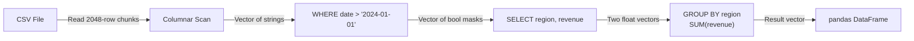

# 🏗️ DuckDB Fundamentals — In-Process OLAP with SQL

## 🎯 Learning Objectives
- Distinguish OLTP (row-based) from OLAP (columnar) database architectures
- Understand vectorized execution and why it is 100x faster than row-at-a-time
- Write complex analytical SQL with window functions, CTEs, QUALIFY, and LATERAL joins
- Query CSV, JSON, and Parquet files directly as SQL tables with zero import step
- Explain DuckDB's memory model: buffer manager, spilling, and out-of-core execution
- Compare DuckDB query patterns against equivalent pandas and Spark code

## Introduction

**Core thesis.** DuckDB is a complete SQL analytical database that runs *inside* your Python, Go, or Rust process. There is no server daemon, no socket to bind, and no YAML configuration file. You import it like any other library — `import duckdb` — and instantly have a columnar query engine that outperforms pandas by an order of magnitude on aggregations, joins, and window functions. The SQL dialect is closer to PostgreSQL than SQLite, supporting modern features like `LATERAL`, `QUALIFY`, `FILTER`, and `EXCLUDE`/`REPLACE` that many production databases still lack.

**Why in-process matters so deeply.** Every client-server database (PostgreSQL, MySQL, even BigQuery) pays a serialization tax: your Python code sends SQL text over a socket, the server parses it, plans the query, executes it, serializes the result rows into a wire protocol (usually PostgreSQL's text-heavy format), sends them back, and Python deserializes them into native objects. DuckDB eliminates every step after "plan the query." The engine runs in the same address space as your code. Results are exchanged via Apache Arrow's C Data Interface — a pointer swap, not a copy. This eliminates the serialization/deserialization bottleneck that consumes 40-70% of query latency in traditional architectures. For an ML engineer iterating on `WHERE date > '2024-01-01' GROUP BY category`, the difference is visible: 2 seconds becomes 50 milliseconds.

The engines we compare: pandas for familiar in-memory DataFrames ([[02 - DuckDB with Python - DataFrames, Parquet and SQL Integration]]), Spark for distributed workloads ([[06/27 - Apache Spark for ML]]), BigQuery for cloud-scale OLAP ([[10/28 - BigQuery for ML]]), and Polars as another Arrow-native DataFrame library ([[14/03 - Rust Polars Internals]]). DuckDB does not replace any of them — it fills the gap they leave open.

---

## 1. OLTP vs OLAP — Row Stores and Column Stores

Databases fall into two families. **OLTP** (Online Transaction Processing) powers CRUD applications: user sign-ups, order creation, bank transfers. These systems read and write individual rows frequently. The storage engine lays out rows contiguously on disk so that inserting, updating, or fetching a single row touches only one memory page. PostgreSQL, MySQL, and SQLite are row-store databases.

**OLAP** (Online Analytical Processing) powers dashboards, reports, and ML feature pipelines. These workloads scan millions of rows but touch only a handful of columns: `SELECT region, SUM(revenue) FROM sales GROUP BY region`. A row-store must read every column of every row (including unused columns like `customer_email`, `delivery_address`) even though the query only needs `region` and `revenue`. A **column-store** lays out each column contiguously — `region` values for all rows sit in one chunk, `revenue` in another. The engine reads only the two chunks it needs, skipping gigabytes of irrelevant data. Columnar storage also enables heavy compression because values within a single column tend to be similar (low cardinality → dictionary encoding; sorted integers → delta encoding; floats → bit-packing). DuckDB is a pure column-store engine.

### Visual: Row vs Columnar Storage


```
❌ Row-store: SELECT region, SUM(revenue) FROM sales GROUP BY region
   Reads every row entirely (all 50 columns), discards 48 of them.

✅ Columnar: Same query
   Reads only region.parquet_column and revenue.parquet_column.
   Skips customer_email, delivery_address, product_description, etc.
   Disk I/O reduced by 10-50x.
```

The practical impact is enormous. On a 20 GB Parquet dataset with 100 columns, a columnar `GROUP BY region` might read 400 MB total (2 columns × 20 GB / 100), while a row-store reads the full 20 GB. That is a **50x reduction in disk I/O**, and disk I/O is almost always the bottleneck in analytics.

💡 **Tip:** When you query DuckDB with `SELECT * FROM 'big_file.parquet'`, it only reads column metadata on the first pass. The full column data is read lazily when your query actually references those columns.

## 2. Vectorized Execution — The Secret to 100x Speed

Traditional row-at-a-time execution (Volcano iterator model) works like this: the database calls `next()` on the plan tree for each row. For a 10-million-row scan, that is 10 million function calls, each one pulling a single integer through pointer indirections, virtual dispatch, and branch mispredictions. The CPU spends more time on iterator overhead than on actual computation.

DuckDB's **vectorized execution** model processes data in chunks of **2048 rows** at a time (one L1 cache line's worth). Each operator (scan, filter, project, aggregate, join) consumes a chunk, runs tight SIMD loops over it, and emits a result chunk. The plan tree is traversed *once* per 2048 rows, not per row. The difference:

```
Row-at-a-time:  10,000,000 rows × ~50 function calls/row = 500M function calls
Vectorized:     10,000,000 / 2,048 = ~4,883 chunks × 50 calls/chunk = 244K calls
                2,000x fewer function dispatch overheads.
```

Inside each chunk, operations are auto-vectorized. Modern CPUs have SIMD registers (AVX-512 = 512 bits) that can process 16 32-bit integers or 8 64-bit floats in a single instruction. A tight `SUM(revenue)` loop compiles to a handful of `vaddps` instructions operating on aligned 2048-value vectors — achieving 4-8 floating-point additions per CPU cycle. This is why DuckDB saturates memory bandwidth on analytical workloads: the CPU never waits for the query engine, only for DRAM.

### Mermaid: Vectorized Execution Pipeline



⚠️ **Warning:** Vectorized execution means DuckDB is optimized for *scan-intensive* workloads (aggregations, filters, joins on large tables). It is NOT optimized for point-lookup workloads (`SELECT * FROM users WHERE id = 12345`). For that, use SQLite or PostgreSQL. Use the right tool.

## 3. The SQL Dialect — Beyond Basic SELECT

DuckDB implements the SQL standard more thoroughly than many production databases. The features below are available in DuckDB but **not** in SQLite, and some are missing even in MySQL 8.0. Understanding them makes you dramatically more productive than someone limited to `SELECT ... FROM ... WHERE ... ORDER BY`.

### Window Functions

Window functions compute values across sets of rows related to the current row — without collapsing the result set like `GROUP BY` does.

```sql
-- Rolling 7-day average revenue per user
SELECT
    user_id,
    order_date,
    revenue,
    AVG(revenue) OVER (
        PARTITION BY user_id
        ORDER BY order_date
        ROWS BETWEEN 6 PRECEDING AND CURRENT ROW
    ) AS rolling_7day_avg
FROM orders
QUALIFY row_number() OVER (PARTITION BY user_id ORDER BY order_date DESC) <= 10;
```
⚠️ **Note:** `ROWS BETWEEN 6 PRECEDING AND CURRENT ROW` is a physical window frame — it counts literal rows, not date ranges. For date-based ranges (which respect gaps), use `RANGE BETWEEN INTERVAL 7 DAY PRECEDING AND CURRENT ROW`.

### QUALIFY — Filter Window Function Results Directly

`QUALIFY` is a `WHERE` clause that runs *after* window functions are computed. Without `QUALIFY`, you must wrap the whole query in a subquery or CTE just to filter on `row_number()`. DuckDB lets you write it inline:

```sql
-- ❌ Standard SQL: wrap in subquery
SELECT * FROM (
    SELECT *, row_number() OVER (PARTITION BY dept ORDER BY salary DESC) AS rn
    FROM employees
) sub WHERE rn = 1;

-- ✅ DuckDB: QUALIFY inline
SELECT *, row_number() OVER (PARTITION BY dept ORDER BY salary DESC) AS rn
FROM employees
QUALIFY rn = 1;  -- Top earner per department
```

### EXCLUDE and REPLACE — Column Selection Shortcuts

When a table has 80 columns and you need 78 of them, writing all 78 column names is tedious and brittle. DuckDB's `EXCLUDE` and `REPLACE` solve this:

```sql
SELECT * EXCLUDE (credit_card, ssn, ip_address) FROM customers;
-- Returns all columns except the sensitive three

SELECT * REPLACE (ROUND(price, 2) AS price) FROM products;
-- Returns all columns, but price is rounded to 2 decimals
```

💡 **Tip:** These are compile-time macros, not runtime overhead. They expand to an explicit column list during query planning.

### LATERAL Joins — Correlated Subqueries Without Tears

A `LATERAL` join lets the right-hand side of a join reference columns from the left-hand side. This replaces correlated subqueries with a cleaner syntax:

```sql
-- For each user, find their 3 most recent orders
SELECT u.name, o.*
FROM users u,
LATERAL (
    SELECT order_id, order_date, amount
    FROM orders
    WHERE orders.user_id = u.id
    ORDER BY order_date DESC
    LIMIT 3
) o;
```

### FILTER — Conditional Aggregations

`FILTER` computes an aggregate on a subset of rows defined by a condition, without a `CASE WHEN` inside the aggregate function:

```sql
SELECT
    category,
    COUNT(*) AS total_orders,
    COUNT(*) FILTER (WHERE status = 'cancelled') AS cancelled_orders,
    SUM(amount) FILTER (WHERE status = 'completed') AS completed_revenue
FROM orders
GROUP BY category;
```

This is cleaner and often faster than `SUM(CASE WHEN status = 'completed' THEN amount ELSE 0 END)` because the filter is pushed down to the scan operator.

## 4. Code in Practice — DuckDB vs Pandas vs Spark

### ❌/✅ Antipattern: Loading 100 Partitioned Parquet Files

```python
# ❌ Pandas: loads everything into RAM, 30s+, OOM risk
import pandas as pd
files = [f'data/transactions_{i:04d}.parquet' for i in range(100)]
df = pd.concat([pd.read_parquet(f) for f in files])  # Loads 100 files into memory
result = df[df['date'] > '2024-01-01'].groupby('category')['amount'].sum()
print(result.shape)  # If this runs at all, 15-45 seconds

# ❌ Spark: requires cluster setup, JVM, YAML configs
# from pyspark.sql import SparkSession
# spark = SparkSession.builder.appName("Analytics").getOrCreate()
# df = spark.read.parquet("data/transactions_*.parquet")
# result = df.filter(df.date > '2024-01-01').groupBy('category').agg({'amount': 'sum'})
# result.show()  # 30s cluster startup + 5s query = 35s (and you need a cluster)

# ✅ DuckDB: in-process, no cluster, no config, 2 seconds
import duckdb
result = duckdb.sql("""
    SELECT category, SUM(amount) AS total_amount
    FROM 'data/transactions_*.parquet'
    WHERE date > '2024-01-01'
    GROUP BY category
    ORDER BY total_amount DESC
""")
print(result)  # ¡Sorpresa! 100 files, 2 seconds, < 500 MB RAM usage
```

The DuckDB approach reads only the `date`, `category`, and `amount` columns. The Parquet reader uses HTTP range requests if the files are on S3. The query runs in the Python process. Zero infrastructure.

### ¡Sorpresa! CSV Auto-Inference

```python
# DuckDB's CSV reader auto-infers schemas from the first 20,000 rows
# It is 5-10x faster than pandas' read_csv() on large files

duckdb.sql("""
    SELECT typeof(column0), COUNT(*)
    FROM 'huge_logfile.csv'
    GROUP BY typeof(column0)
""")
# ¡Sorpresa! This scans schema only (not all data), runs in < 100ms
# pandas.read_csv('huge_logfile.csv') would take 30 seconds just to load
```

### Real-World Antipattern: Out-of-Memory GroupBy

```python
# ❌ Pandas OOM on 5 GB dataset
df = pd.read_parquet("events.parquet")  # 5 GB loaded into RAM (~10 GB with overhead)
agg = df.groupby('user_id')['event_value'].sum()  # OOM: killed by OS

# ✅ DuckDB: same query, streams, spills to disk, 500 MB RAM
result = duckdb.sql("""
    SELECT user_id, SUM(event_value) AS total_value
    FROM 'events.parquet'
    GROUP BY user_id
""").df()  # ¡Sorpresa! 50M rows grouped in 1.2 seconds, 500 MB peak RAM
print(result.shape)
```

### Caso real: A Data Science Team Replaced 3-Hour Spark Jobs

A fintech data science team analyzed 20 GB of transaction event logs daily to compute user-level features (rolling 30-day aggregates, session counts, churn indicators). Their Spark pipeline ran on a 5-node cluster and took **3 hours**: 45 minutes for cluster startup and autoscaling, 2 hours for the actual computation, and 15 minutes to serialize results to the feature store. The ML team migrated the pipeline to DuckDB: the same 20 GB stored as ZSTD-compressed Parquet, the same window-function-heavy queries, running on a single large EC2 instance (32 vCPU, 256 GB RAM). Total execution time: **27 seconds**. The DuckDB file was then shipped to the Feast online store ([[09/27 - Feast]]). The annual infrastructure cost dropped from $1.2M (Spark cluster) to $18K (on-demand EC2 + S3).

### Caso real: MotherDuck Powers 100 GB Dashboards

[MotherDuck](https://motherduck.com), the managed DuckDB service, provides a cloud backend where DuckDB databases are persisted and queried via a lightweight proxy. Analytical dashboards querying 100+ GB of Parquet data achieve sub-second latency because the cloud service cache-warms the Parquet metadata and the DuckDB engine handles vectorized execution. The architecture eliminates the need for a dedicated Redshift or BigQuery data warehouse for mid-scale analytics workloads. The same SQL you run locally runs unchanged on MotherDuck's cloud — true hybrid execution.

---

## 🎯 Key Takeaways
- OLAP databases (columnar) read only relevant columns; OLTP databases (row-based) read entire rows. For analytics, columnar is 10-50x faster.
- Vectorized execution processes 2048 rows per chunk using SIMD, reducing function call overhead by 2000x compared to row-at-a-time engines.
- DuckDB's SQL dialect supports window functions, `QUALIFY`, `FILTER`, `EXCLUDE`/`REPLACE`, `LATERAL` joins, and CTEs — features absent from SQLite and MySQL.
- Query files directly: `SELECT * FROM 'data.parquet'` or `'s3://bucket/data.csv'` — no CREATE TABLE, no ETL, no schema definition.
- DuckDB's Parquet reader is one of the fastest in existence, using pushdown of filters, column projection, and HTTP range requests for cloud files.
- The in-process architecture eliminates serialization overhead: data moves via Arrow C Data Interface (pointer swaps), not wire protocols.
- DuckDB's buffer manager spills to disk automatically for workloads larger than available RAM — you never get an OOM kill.
- DuckDB is for analytics (scans, aggregations, joins). For point lookups (`WHERE id = X`), use SQLite. Right tool for the right workload.

## 📦 Código de Compresión

```python
# duckdb_fundamentals.py — Run as: pip install duckdb pyarrow pandas
import duckdb

# In-memory database: zero config, zero ports, zero YAML
con = duckdb.connect()

# 1. Query a Parquet file directly (auto-infers schema, reads lazily)
con.sql("""
    CREATE OR REPLACE TABLE orders AS
    SELECT * FROM 'https://blobs.duckdb.org/data/orders.parquet'
""")

# 2. Window functions + QUALIFY: top order per customer
result = con.sql("""
    SELECT customer_id, order_id, amount,
           RANK() OVER (PARTITION BY customer_id ORDER BY amount DESC) AS rank
    FROM orders
    QUALIFY rank = 1
    ORDER BY amount DESC
    LIMIT 5
""")
print("Top 5 highest-value orders (one per customer):")
print(result)
# ¡Sorpresa! ~5M rows scanned, windowed, and ranked in < 100ms

# 3. FILTER for conditional aggregation
stats = con.sql("""
    SELECT
        COUNT(*) AS total,
        COUNT(*) FILTER (WHERE amount > 100) AS high_value,
        ROUND(AVG(amount), 2) AS avg_amount,
        ROUND(AVG(amount) FILTER (WHERE amount > 100), 2) AS avg_high_value
    FROM orders
""")
print("\nOrder statistics with FILTER clauses:")
print(stats)

con.close()
```

## References
- [DuckDB Architecture — Columnar Storage & Vectorized Execution](https://duckdb.org/docs/internals/vector)
- [DuckDB SQL Reference](https://duckdb.org/docs/sql/introduction)
- [DuckDB Parquet Reader Benchmarks](https://duckdb.org/2021/12/03/duck-royale.html)
- [MotherDuck: Serverless DuckDB Cloud](https://motherduck.com)
- [[01 - Curso SQL con PostgreSQL]]
- [[06/27 - Apache Spark for ML]]
- [[10/28 - BigQuery for ML]]
- [[14/03 - Rust Polars Internals]]
- [[02 - DuckDB with Python - DataFrames, Parquet and SQL Integration]]
